cola Report for GDS3553
==================

**Date**: 2019-12-25 20:47:11 CET, **cola version**: 1.3.2

----------------------------------------------------------------

<style type='text/css'>

body, td, th {
   font-family: Arial,Helvetica,sans-serif;
   background-color: white;
   font-size: 13px;
  max-width: 800px;
  margin: auto;
  margin-left:210px;
  padding: 0px 10px 0px 10px;
  border-left: 1px solid #EEEEEE;
  line-height: 150%;
}

tt, code, pre {
   font-family: 'DejaVu Sans Mono', 'Droid Sans Mono', 'Lucida Console', Consolas, Monaco, 

monospace;
}

h1 {
   font-size:2.2em;
}

h2 {
   font-size:1.8em;
}

h3 {
   font-size:1.4em;
}

h4 {
   font-size:1.0em;
}

h5 {
   font-size:0.9em;
}

h6 {
   font-size:0.8em;
}

a {
  text-decoration: none;
  color: #0366d6;
}

a:hover {
  text-decoration: underline;
}

a:visited {
   color: #0366d6;
}

pre, img {
  max-width: 100%;
}
pre {
  overflow-x: auto;
}
pre code {
   display: block; padding: 0.5em;
}

code {
  font-size: 92%;
  border: 1px solid #ccc;
}

code[class] {
  background-color: #F8F8F8;
}

table, td, th {
  border: 1px solid #ccc;
}

blockquote {
   color:#666666;
   margin:0;
   padding-left: 1em;
   border-left: 0.5em #EEE solid;
}

hr {
   height: 0px;
   border-bottom: none;
   border-top-width: thin;
   border-top-style: dotted;
   border-top-color: #999999;
}

@media print {
   * {
      background: transparent !important;
      color: black !important;
      filter:none !important;
      -ms-filter: none !important;
   }

   body {
      font-size:12pt;
      max-width:100%;
   }

   a, a:visited {
      text-decoration: underline;
   }

   hr {
      visibility: hidden;
      page-break-before: always;
   }

   pre, blockquote {
      padding-right: 1em;
      page-break-inside: avoid;
   }

   tr, img {
      page-break-inside: avoid;
   }

   img {
      max-width: 100% !important;
   }

   @page :left {
      margin: 15mm 20mm 15mm 10mm;
   }

   @page :right {
      margin: 15mm 10mm 15mm 20mm;
   }

   p, h2, h3 {
      orphans: 3; widows: 3;
   }

   h2, h3 {
      page-break-after: avoid;
   }
}
</style>


## Summary


All available functions which can be applied to this `res_list` object:


```r
res_list
```

```
#> A 'ConsensusPartitionList' object with 24 methods.
#>   On a matrix with 25171 rows and 96 columns.
#>   Top rows are extracted by 'SD, CV, MAD, ATC' methods.
#>   Subgroups are detected by 'hclust, kmeans, skmeans, pam, mclust, NMF' method.
#>   Number of partitions are tried for k = 2, 3, 4, 5, 6.
#>   Performed in total 30000 partitions by row resampling.
#> 
#> Following methods can be applied to this 'ConsensusPartitionList' object:
#>  [1] "cola_report"           "collect_classes"       "collect_plots"         "collect_stats"        
#>  [5] "colnames"              "functional_enrichment" "get_anno_col"          "get_anno"             
#>  [9] "get_classes"           "get_matrix"            "get_membership"        "get_stats"            
#> [13] "is_best_k"             "is_stable_k"           "ncol"                  "nrow"                 
#> [17] "rownames"              "show"                  "suggest_best_k"        "test_to_known_factors"
#> [21] "top_rows_heatmap"      "top_rows_overlap"     
#> 
#> You can get result for a single method by, e.g. object["SD", "hclust"] or object["SD:hclust"]
#> or a subset of methods by object[c("SD", "CV")], c("hclust", "kmeans")]
```

The call of `run_all_consensus_partition_methods()` was:


```
#> run_all_consensus_partition_methods(data = mat, mc.cores = 4, anno = anno)
```

Dimension of the input matrix:


```r
mat = get_matrix(res_list)
dim(mat)
```

```
#> [1] 25171    96
```

### Density distribution

The density distribution for each sample is visualized as in one column in the
following heatmap. The clustering is based on the distance which is the
Kolmogorov-Smirnov statistic between two distributions.


```r
library(ComplexHeatmap)
densityHeatmap(mat, top_annotation = HeatmapAnnotation(df = get_anno(res_list), 
    col = get_anno_col(res_list)), ylab = "value", cluster_columns = TRUE, show_column_names = FALSE,
    mc.cores = 4)
```


### Suggest the best k


Folowing table shows the best `k` (number of partitions) for each combination
of top-value methods and partition methods. Clicking on the method name in
the table goes to the section for a single combination of methods.

[The cola vignette](http://bioconductor.org/packages/devel/bioc/vignettes/cola/inst/doc/cola.html#toc_13)
explains the definition of the metrics used for determining the best
number of partitions.


```r
suggest_best_k(res_list)
```


|                            | The best k| 1-PAC| Mean silhouette| Concordance|   |Optional k |
|:---------------------------|----------:|-----:|---------------:|-----------:|:--|:----------|
|[SD:hclust](#SD-hclust)     |          2| 1.000|           1.000|       1.000|** |           |
|[SD:kmeans](#SD-kmeans)     |          2| 1.000|           1.000|       1.000|** |           |
|[SD:pam](#SD-pam)           |          2| 1.000|           1.000|       1.000|** |           |
|[SD:mclust](#SD-mclust)     |          2| 1.000|           1.000|       1.000|** |           |
|[SD:NMF](#SD-NMF)           |          2| 1.000|           1.000|       1.000|** |           |
|[CV:kmeans](#CV-kmeans)     |          2| 1.000|           0.988|       0.993|** |           |
|[CV:NMF](#CV-NMF)           |          2| 1.000|           0.978|       0.991|** |           |
|[MAD:hclust](#MAD-hclust)   |          2| 1.000|           1.000|       1.000|** |           |
|[MAD:kmeans](#MAD-kmeans)   |          2| 1.000|           1.000|       1.000|** |           |
|[MAD:skmeans](#MAD-skmeans) |          2| 1.000|           1.000|       1.000|** |           |
|[MAD:pam](#MAD-pam)         |          2| 1.000|           1.000|       1.000|** |           |
|[MAD:mclust](#MAD-mclust)   |          2| 1.000|           1.000|       1.000|** |           |
|[MAD:NMF](#MAD-NMF)         |          2| 1.000|           1.000|       1.000|** |           |
|[ATC:kmeans](#ATC-kmeans)   |          2| 1.000|           1.000|       1.000|** |           |
|[ATC:mclust](#ATC-mclust)   |          2| 1.000|           1.000|       1.000|** |           |
|[CV:mclust](#CV-mclust)     |          3| 0.980|           0.934|       0.959|** |2          |
|[ATC:NMF](#ATC-NMF)         |          3| 0.968|           0.950|       0.976|** |2          |
|[CV:skmeans](#CV-skmeans)   |          3| 0.951|           0.910|       0.945|** |2          |
|[ATC:hclust](#ATC-hclust)   |          5| 0.938|           0.914|       0.957|*  |2,4        |
|[SD:skmeans](#SD-skmeans)   |          5| 0.911|           0.891|       0.931|*  |2          |
|[ATC:skmeans](#ATC-skmeans) |          4| 0.908|           0.934|       0.963|*  |2,3        |
|[ATC:pam](#ATC-pam)         |          6| 0.906|           0.917|       0.949|*  |2,3        |
|[CV:pam](#CV-pam)           |          4| 0.900|           0.893|       0.950|*  |2,3        |
|[CV:hclust](#CV-hclust)     |          5| 0.810|           0.868|       0.898|   |           |

\*\*: 1-PAC > 0.95, \*: 1-PAC > 0.9


### CDF of consensus matrices

Cumulative distribution function curves of consensus matrix for all methods.


```r
collect_plots(res_list, fun = plot_ecdf)
```


### Consensus heatmap

Consensus heatmaps for all methods. ([What is a consensus heatmap?](http://bioconductor.org/packages/devel/bioc/vignettes/cola/inst/doc/cola.html#toc_9))


<style type='text/css'>


.ui-helper-hidden {
	display: none;
}
.ui-helper-hidden-accessible {
	border: 0;
	clip: rect(0 0 0 0);
	height: 1px;
	margin: -1px;
	overflow: hidden;
	padding: 0;
	position: absolute;
	width: 1px;
}
.ui-helper-reset {
	margin: 0;
	padding: 0;
	border: 0;
	outline: 0;
	line-height: 1.3;
	text-decoration: none;
	font-size: 100%;
	list-style: none;
}
.ui-helper-clearfix:before,
.ui-helper-clearfix:after {
	content: "";
	display: table;
	border-collapse: collapse;
}
.ui-helper-clearfix:after {
	clear: both;
}
.ui-helper-zfix {
	width: 100%;
	height: 100%;
	top: 0;
	left: 0;
	position: absolute;
	opacity: 0;
	filter:Alpha(Opacity=0); 
}

.ui-front {
	z-index: 100;
}


.ui-state-disabled {
	cursor: default !important;
	pointer-events: none;
}


.ui-icon {
	display: inline-block;
	vertical-align: middle;
	margin-top: -.25em;
	position: relative;
	text-indent: -99999px;
	overflow: hidden;
	background-repeat: no-repeat;
}

.ui-widget-icon-block {
	left: 50%;
	margin-left: -8px;
	display: block;
}


.ui-widget-overlay {
	position: fixed;
	top: 0;
	left: 0;
	width: 100%;
	height: 100%;
}
.ui-accordion .ui-accordion-header {
	display: block;
	cursor: pointer;
	position: relative;
	margin: 2px 0 0 0;
	padding: .5em .5em .5em .7em;
	font-size: 100%;
}
.ui-accordion .ui-accordion-content {
	padding: 1em 2.2em;
	border-top: 0;
	overflow: auto;
}
.ui-autocomplete {
	position: absolute;
	top: 0;
	left: 0;
	cursor: default;
}
.ui-menu {
	list-style: none;
	padding: 0;
	margin: 0;
	display: block;
	outline: 0;
}
.ui-menu .ui-menu {
	position: absolute;
}
.ui-menu .ui-menu-item {
	margin: 0;
	cursor: pointer;
	
	list-style-image: url("data:image/gif;base64,R0lGODlhAQABAIAAAAAAAP///yH5BAEAAAAALAAAAAABAAEAAAIBRAA7");
}
.ui-menu .ui-menu-item-wrapper {
	position: relative;
	padding: 3px 1em 3px .4em;
}
.ui-menu .ui-menu-divider {
	margin: 5px 0;
	height: 0;
	font-size: 0;
	line-height: 0;
	border-width: 1px 0 0 0;
}
.ui-menu .ui-state-focus,
.ui-menu .ui-state-active {
	margin: -1px;
}


.ui-menu-icons {
	position: relative;
}
.ui-menu-icons .ui-menu-item-wrapper {
	padding-left: 2em;
}


.ui-menu .ui-icon {
	position: absolute;
	top: 0;
	bottom: 0;
	left: .2em;
	margin: auto 0;
}


.ui-menu .ui-menu-icon {
	left: auto;
	right: 0;
}
.ui-button {
	padding: .4em 1em;
	display: inline-block;
	position: relative;
	line-height: normal;
	margin-right: .1em;
	cursor: pointer;
	vertical-align: middle;
	text-align: center;
	-webkit-user-select: none;
	-moz-user-select: none;
	-ms-user-select: none;
	user-select: none;

	
	overflow: visible;
}

.ui-button,
.ui-button:link,
.ui-button:visited,
.ui-button:hover,
.ui-button:active {
	text-decoration: none;
}


.ui-button-icon-only {
	width: 2em;
	box-sizing: border-box;
	text-indent: -9999px;
	white-space: nowrap;
}


input.ui-button.ui-button-icon-only {
	text-indent: 0;
}


.ui-button-icon-only .ui-icon {
	position: absolute;
	top: 50%;
	left: 50%;
	margin-top: -8px;
	margin-left: -8px;
}

.ui-button.ui-icon-notext .ui-icon {
	padding: 0;
	width: 2.1em;
	height: 2.1em;
	text-indent: -9999px;
	white-space: nowrap;

}

input.ui-button.ui-icon-notext .ui-icon {
	width: auto;
	height: auto;
	text-indent: 0;
	white-space: normal;
	padding: .4em 1em;
}


input.ui-button::-moz-focus-inner,
button.ui-button::-moz-focus-inner {
	border: 0;
	padding: 0;
}
.ui-controlgroup {
	vertical-align: middle;
	display: inline-block;
}
.ui-controlgroup > .ui-controlgroup-item {
	float: left;
	margin-left: 0;
	margin-right: 0;
}
.ui-controlgroup > .ui-controlgroup-item:focus,
.ui-controlgroup > .ui-controlgroup-item.ui-visual-focus {
	z-index: 9999;
}
.ui-controlgroup-vertical > .ui-controlgroup-item {
	display: block;
	float: none;
	width: 100%;
	margin-top: 0;
	margin-bottom: 0;
	text-align: left;
}
.ui-controlgroup-vertical .ui-controlgroup-item {
	box-sizing: border-box;
}
.ui-controlgroup .ui-controlgroup-label {
	padding: .4em 1em;
}
.ui-controlgroup .ui-controlgroup-label span {
	font-size: 80%;
}
.ui-controlgroup-horizontal .ui-controlgroup-label + .ui-controlgroup-item {
	border-left: none;
}
.ui-controlgroup-vertical .ui-controlgroup-label + .ui-controlgroup-item {
	border-top: none;
}
.ui-controlgroup-horizontal .ui-controlgroup-label.ui-widget-content {
	border-right: none;
}
.ui-controlgroup-vertical .ui-controlgroup-label.ui-widget-content {
	border-bottom: none;
}


.ui-controlgroup-vertical .ui-spinner-input {

	
	width: 75%;
	width: calc( 100% - 2.4em );
}
.ui-controlgroup-vertical .ui-spinner .ui-spinner-up {
	border-top-style: solid;
}

.ui-checkboxradio-label .ui-icon-background {
	box-shadow: inset 1px 1px 1px #ccc;
	border-radius: .12em;
	border: none;
}
.ui-checkboxradio-radio-label .ui-icon-background {
	width: 16px;
	height: 16px;
	border-radius: 1em;
	overflow: visible;
	border: none;
}
.ui-checkboxradio-radio-label.ui-checkboxradio-checked .ui-icon,
.ui-checkboxradio-radio-label.ui-checkboxradio-checked:hover .ui-icon {
	background-image: none;
	width: 8px;
	height: 8px;
	border-width: 4px;
	border-style: solid;
}
.ui-checkboxradio-disabled {
	pointer-events: none;
}
.ui-datepicker {
	width: 17em;
	padding: .2em .2em 0;
	display: none;
}
.ui-datepicker .ui-datepicker-header {
	position: relative;
	padding: .2em 0;
}
.ui-datepicker .ui-datepicker-prev,
.ui-datepicker .ui-datepicker-next {
	position: absolute;
	top: 2px;
	width: 1.8em;
	height: 1.8em;
}
.ui-datepicker .ui-datepicker-prev-hover,
.ui-datepicker .ui-datepicker-next-hover {
	top: 1px;
}
.ui-datepicker .ui-datepicker-prev {
	left: 2px;
}
.ui-datepicker .ui-datepicker-next {
	right: 2px;
}
.ui-datepicker .ui-datepicker-prev-hover {
	left: 1px;
}
.ui-datepicker .ui-datepicker-next-hover {
	right: 1px;
}
.ui-datepicker .ui-datepicker-prev span,
.ui-datepicker .ui-datepicker-next span {
	display: block;
	position: absolute;
	left: 50%;
	margin-left: -8px;
	top: 50%;
	margin-top: -8px;
}
.ui-datepicker .ui-datepicker-title {
	margin: 0 2.3em;
	line-height: 1.8em;
	text-align: center;
}
.ui-datepicker .ui-datepicker-title select {
	font-size: 1em;
	margin: 1px 0;
}
.ui-datepicker select.ui-datepicker-month,
.ui-datepicker select.ui-datepicker-year {
	width: 45%;
}
.ui-datepicker table {
	width: 100%;
	font-size: .9em;
	border-collapse: collapse;
	margin: 0 0 .4em;
}
.ui-datepicker th {
	padding: .7em .3em;
	text-align: center;
	font-weight: bold;
	border: 0;
}
.ui-datepicker td {
	border: 0;
	padding: 1px;
}
.ui-datepicker td span,
.ui-datepicker td a {
	display: block;
	padding: .2em;
	text-align: right;
	text-decoration: none;
}
.ui-datepicker .ui-datepicker-buttonpane {
	background-image: none;
	margin: .7em 0 0 0;
	padding: 0 .2em;
	border-left: 0;
	border-right: 0;
	border-bottom: 0;
}
.ui-datepicker .ui-datepicker-buttonpane button {
	float: right;
	margin: .5em .2em .4em;
	cursor: pointer;
	padding: .2em .6em .3em .6em;
	width: auto;
	overflow: visible;
}
.ui-datepicker .ui-datepicker-buttonpane button.ui-datepicker-current {
	float: left;
}


.ui-datepicker.ui-datepicker-multi {
	width: auto;
}
.ui-datepicker-multi .ui-datepicker-group {
	float: left;
}
.ui-datepicker-multi .ui-datepicker-group table {
	width: 95%;
	margin: 0 auto .4em;
}
.ui-datepicker-multi-2 .ui-datepicker-group {
	width: 50%;
}
.ui-datepicker-multi-3 .ui-datepicker-group {
	width: 33.3%;
}
.ui-datepicker-multi-4 .ui-datepicker-group {
	width: 25%;
}
.ui-datepicker-multi .ui-datepicker-group-last .ui-datepicker-header,
.ui-datepicker-multi .ui-datepicker-group-middle .ui-datepicker-header {
	border-left-width: 0;
}
.ui-datepicker-multi .ui-datepicker-buttonpane {
	clear: left;
}
.ui-datepicker-row-break {
	clear: both;
	width: 100%;
	font-size: 0;
}


.ui-datepicker-rtl {
	direction: rtl;
}
.ui-datepicker-rtl .ui-datepicker-prev {
	right: 2px;
	left: auto;
}
.ui-datepicker-rtl .ui-datepicker-next {
	left: 2px;
	right: auto;
}
.ui-datepicker-rtl .ui-datepicker-prev:hover {
	right: 1px;
	left: auto;
}
.ui-datepicker-rtl .ui-datepicker-next:hover {
	left: 1px;
	right: auto;
}
.ui-datepicker-rtl .ui-datepicker-buttonpane {
	clear: right;
}
.ui-datepicker-rtl .ui-datepicker-buttonpane button {
	float: left;
}
.ui-datepicker-rtl .ui-datepicker-buttonpane button.ui-datepicker-current,
.ui-datepicker-rtl .ui-datepicker-group {
	float: right;
}
.ui-datepicker-rtl .ui-datepicker-group-last .ui-datepicker-header,
.ui-datepicker-rtl .ui-datepicker-group-middle .ui-datepicker-header {
	border-right-width: 0;
	border-left-width: 1px;
}


.ui-datepicker .ui-icon {
	display: block;
	text-indent: -99999px;
	overflow: hidden;
	background-repeat: no-repeat;
	left: .5em;
	top: .3em;
}
.ui-dialog {
	position: absolute;
	top: 0;
	left: 0;
	padding: .2em;
	outline: 0;
}
.ui-dialog .ui-dialog-titlebar {
	padding: .4em 1em;
	position: relative;
}
.ui-dialog .ui-dialog-title {
	float: left;
	margin: .1em 0;
	white-space: nowrap;
	width: 90%;
	overflow: hidden;
	text-overflow: ellipsis;
}
.ui-dialog .ui-dialog-titlebar-close {
	position: absolute;
	right: .3em;
	top: 50%;
	width: 20px;
	margin: -10px 0 0 0;
	padding: 1px;
	height: 20px;
}
.ui-dialog .ui-dialog-content {
	position: relative;
	border: 0;
	padding: .5em 1em;
	background: none;
	overflow: auto;
}
.ui-dialog .ui-dialog-buttonpane {
	text-align: left;
	border-width: 1px 0 0 0;
	background-image: none;
	margin-top: .5em;
	padding: .3em 1em .5em .4em;
}
.ui-dialog .ui-dialog-buttonpane .ui-dialog-buttonset {
	float: right;
}
.ui-dialog .ui-dialog-buttonpane button {
	margin: .5em .4em .5em 0;
	cursor: pointer;
}
.ui-dialog .ui-resizable-n {
	height: 2px;
	top: 0;
}
.ui-dialog .ui-resizable-e {
	width: 2px;
	right: 0;
}
.ui-dialog .ui-resizable-s {
	height: 2px;
	bottom: 0;
}
.ui-dialog .ui-resizable-w {
	width: 2px;
	left: 0;
}
.ui-dialog .ui-resizable-se,
.ui-dialog .ui-resizable-sw,
.ui-dialog .ui-resizable-ne,
.ui-dialog .ui-resizable-nw {
	width: 7px;
	height: 7px;
}
.ui-dialog .ui-resizable-se {
	right: 0;
	bottom: 0;
}
.ui-dialog .ui-resizable-sw {
	left: 0;
	bottom: 0;
}
.ui-dialog .ui-resizable-ne {
	right: 0;
	top: 0;
}
.ui-dialog .ui-resizable-nw {
	left: 0;
	top: 0;
}
.ui-draggable .ui-dialog-titlebar {
	cursor: move;
}
.ui-draggable-handle {
	-ms-touch-action: none;
	touch-action: none;
}
.ui-resizable {
	position: relative;
}
.ui-resizable-handle {
	position: absolute;
	font-size: 0.1px;
	display: block;
	-ms-touch-action: none;
	touch-action: none;
}
.ui-resizable-disabled .ui-resizable-handle,
.ui-resizable-autohide .ui-resizable-handle {
	display: none;
}
.ui-resizable-n {
	cursor: n-resize;
	height: 7px;
	width: 100%;
	top: -5px;
	left: 0;
}
.ui-resizable-s {
	cursor: s-resize;
	height: 7px;
	width: 100%;
	bottom: -5px;
	left: 0;
}
.ui-resizable-e {
	cursor: e-resize;
	width: 7px;
	right: -5px;
	top: 0;
	height: 100%;
}
.ui-resizable-w {
	cursor: w-resize;
	width: 7px;
	left: -5px;
	top: 0;
	height: 100%;
}
.ui-resizable-se {
	cursor: se-resize;
	width: 12px;
	height: 12px;
	right: 1px;
	bottom: 1px;
}
.ui-resizable-sw {
	cursor: sw-resize;
	width: 9px;
	height: 9px;
	left: -5px;
	bottom: -5px;
}
.ui-resizable-nw {
	cursor: nw-resize;
	width: 9px;
	height: 9px;
	left: -5px;
	top: -5px;
}
.ui-resizable-ne {
	cursor: ne-resize;
	width: 9px;
	height: 9px;
	right: -5px;
	top: -5px;
}
.ui-progressbar {
	height: 2em;
	text-align: left;
	overflow: hidden;
}
.ui-progressbar .ui-progressbar-value {
	margin: -1px;
	height: 100%;
}
.ui-progressbar .ui-progressbar-overlay {
	background: url("data:image/gif;base64,R0lGODlhKAAoAIABAAAAAP///yH/C05FVFNDQVBFMi4wAwEAAAAh+QQJAQABACwAAAAAKAAoAAACkYwNqXrdC52DS06a7MFZI+4FHBCKoDeWKXqymPqGqxvJrXZbMx7Ttc+w9XgU2FB3lOyQRWET2IFGiU9m1frDVpxZZc6bfHwv4c1YXP6k1Vdy292Fb6UkuvFtXpvWSzA+HycXJHUXiGYIiMg2R6W459gnWGfHNdjIqDWVqemH2ekpObkpOlppWUqZiqr6edqqWQAAIfkECQEAAQAsAAAAACgAKAAAApSMgZnGfaqcg1E2uuzDmmHUBR8Qil95hiPKqWn3aqtLsS18y7G1SzNeowWBENtQd+T1JktP05nzPTdJZlR6vUxNWWjV+vUWhWNkWFwxl9VpZRedYcflIOLafaa28XdsH/ynlcc1uPVDZxQIR0K25+cICCmoqCe5mGhZOfeYSUh5yJcJyrkZWWpaR8doJ2o4NYq62lAAACH5BAkBAAEALAAAAAAoACgAAAKVDI4Yy22ZnINRNqosw0Bv7i1gyHUkFj7oSaWlu3ovC8GxNso5fluz3qLVhBVeT/Lz7ZTHyxL5dDalQWPVOsQWtRnuwXaFTj9jVVh8pma9JjZ4zYSj5ZOyma7uuolffh+IR5aW97cHuBUXKGKXlKjn+DiHWMcYJah4N0lYCMlJOXipGRr5qdgoSTrqWSq6WFl2ypoaUAAAIfkECQEAAQAsAAAAACgAKAAAApaEb6HLgd/iO7FNWtcFWe+ufODGjRfoiJ2akShbueb0wtI50zm02pbvwfWEMWBQ1zKGlLIhskiEPm9R6vRXxV4ZzWT2yHOGpWMyorblKlNp8HmHEb/lCXjcW7bmtXP8Xt229OVWR1fod2eWqNfHuMjXCPkIGNileOiImVmCOEmoSfn3yXlJWmoHGhqp6ilYuWYpmTqKUgAAIfkECQEAAQAsAAAAACgAKAAAApiEH6kb58biQ3FNWtMFWW3eNVcojuFGfqnZqSebuS06w5V80/X02pKe8zFwP6EFWOT1lDFk8rGERh1TTNOocQ61Hm4Xm2VexUHpzjymViHrFbiELsefVrn6XKfnt2Q9G/+Xdie499XHd2g4h7ioOGhXGJboGAnXSBnoBwKYyfioubZJ2Hn0RuRZaflZOil56Zp6iioKSXpUAAAh+QQJAQABACwAAAAAKAAoAAACkoQRqRvnxuI7kU1a1UU5bd5tnSeOZXhmn5lWK3qNTWvRdQxP8qvaC+/yaYQzXO7BMvaUEmJRd3TsiMAgswmNYrSgZdYrTX6tSHGZO73ezuAw2uxuQ+BbeZfMxsexY35+/Qe4J1inV0g4x3WHuMhIl2jXOKT2Q+VU5fgoSUI52VfZyfkJGkha6jmY+aaYdirq+lQAACH5BAkBAAEALAAAAAAoACgAAAKWBIKpYe0L3YNKToqswUlvznigd4wiR4KhZrKt9Upqip61i9E3vMvxRdHlbEFiEXfk9YARYxOZZD6VQ2pUunBmtRXo1Lf8hMVVcNl8JafV38aM2/Fu5V16Bn63r6xt97j09+MXSFi4BniGFae3hzbH9+hYBzkpuUh5aZmHuanZOZgIuvbGiNeomCnaxxap2upaCZsq+1kAACH5BAkBAAEALAAAAAAoACgAAAKXjI8By5zf4kOxTVrXNVlv1X0d8IGZGKLnNpYtm8Lr9cqVeuOSvfOW79D9aDHizNhDJidFZhNydEahOaDH6nomtJjp1tutKoNWkvA6JqfRVLHU/QUfau9l2x7G54d1fl995xcIGAdXqMfBNadoYrhH+Mg2KBlpVpbluCiXmMnZ2Sh4GBqJ+ckIOqqJ6LmKSllZmsoq6wpQAAAh+QQJAQABACwAAAAAKAAoAAAClYx/oLvoxuJDkU1a1YUZbJ59nSd2ZXhWqbRa2/gF8Gu2DY3iqs7yrq+xBYEkYvFSM8aSSObE+ZgRl1BHFZNr7pRCavZ5BW2142hY3AN/zWtsmf12p9XxxFl2lpLn1rseztfXZjdIWIf2s5dItwjYKBgo9yg5pHgzJXTEeGlZuenpyPmpGQoKOWkYmSpaSnqKileI2FAAACH5BAkBAAEALAAAAAAoACgAAAKVjB+gu+jG4kORTVrVhRlsnn2dJ3ZleFaptFrb+CXmO9OozeL5VfP99HvAWhpiUdcwkpBH3825AwYdU8xTqlLGhtCosArKMpvfa1mMRae9VvWZfeB2XfPkeLmm18lUcBj+p5dnN8jXZ3YIGEhYuOUn45aoCDkp16hl5IjYJvjWKcnoGQpqyPlpOhr3aElaqrq56Bq7VAAAOw==");
	height: 100%;
	filter: alpha(opacity=25); 
	opacity: 0.25;
}
.ui-progressbar-indeterminate .ui-progressbar-value {
	background-image: none;
}
.ui-selectable {
	-ms-touch-action: none;
	touch-action: none;
}
.ui-selectable-helper {
	position: absolute;
	z-index: 100;
	border: 1px dotted black;
}
.ui-selectmenu-menu {
	padding: 0;
	margin: 0;
	position: absolute;
	top: 0;
	left: 0;
	display: none;
}
.ui-selectmenu-menu .ui-menu {
	overflow: auto;
	overflow-x: hidden;
	padding-bottom: 1px;
}
.ui-selectmenu-menu .ui-menu .ui-selectmenu-optgroup {
	font-size: 1em;
	font-weight: bold;
	line-height: 1.5;
	padding: 2px 0.4em;
	margin: 0.5em 0 0 0;
	height: auto;
	border: 0;
}
.ui-selectmenu-open {
	display: block;
}
.ui-selectmenu-text {
	display: block;
	margin-right: 20px;
	overflow: hidden;
	text-overflow: ellipsis;
}
.ui-selectmenu-button.ui-button {
	text-align: left;
	white-space: nowrap;
	width: 14em;
}
.ui-selectmenu-icon.ui-icon {
	float: right;
	margin-top: 0;
}
.ui-slider {
	position: relative;
	text-align: left;
}
.ui-slider .ui-slider-handle {
	position: absolute;
	z-index: 2;
	width: 1.2em;
	height: 1.2em;
	cursor: default;
	-ms-touch-action: none;
	touch-action: none;
}
.ui-slider .ui-slider-range {
	position: absolute;
	z-index: 1;
	font-size: .7em;
	display: block;
	border: 0;
	background-position: 0 0;
}


.ui-slider.ui-state-disabled .ui-slider-handle,
.ui-slider.ui-state-disabled .ui-slider-range {
	filter: inherit;
}

.ui-slider-horizontal {
	height: .8em;
}
.ui-slider-horizontal .ui-slider-handle {
	top: -.3em;
	margin-left: -.6em;
}
.ui-slider-horizontal .ui-slider-range {
	top: 0;
	height: 100%;
}
.ui-slider-horizontal .ui-slider-range-min {
	left: 0;
}
.ui-slider-horizontal .ui-slider-range-max {
	right: 0;
}

.ui-slider-vertical {
	width: .8em;
	height: 100px;
}
.ui-slider-vertical .ui-slider-handle {
	left: -.3em;
	margin-left: 0;
	margin-bottom: -.6em;
}
.ui-slider-vertical .ui-slider-range {
	left: 0;
	width: 100%;
}
.ui-slider-vertical .ui-slider-range-min {
	bottom: 0;
}
.ui-slider-vertical .ui-slider-range-max {
	top: 0;
}
.ui-sortable-handle {
	-ms-touch-action: none;
	touch-action: none;
}
.ui-spinner {
	position: relative;
	display: inline-block;
	overflow: hidden;
	padding: 0;
	vertical-align: middle;
}
.ui-spinner-input {
	border: none;
	background: none;
	color: inherit;
	padding: .222em 0;
	margin: .2em 0;
	vertical-align: middle;
	margin-left: .4em;
	margin-right: 2em;
}
.ui-spinner-button {
	width: 1.6em;
	height: 50%;
	font-size: .5em;
	padding: 0;
	margin: 0;
	text-align: center;
	position: absolute;
	cursor: default;
	display: block;
	overflow: hidden;
	right: 0;
}

.ui-spinner a.ui-spinner-button {
	border-top-style: none;
	border-bottom-style: none;
	border-right-style: none;
}
.ui-spinner-up {
	top: 0;
}
.ui-spinner-down {
	bottom: 0;
}
.ui-tabs {
	position: relative;
	padding: .2em;
}
.ui-tabs .ui-tabs-nav {
	margin: 0;
	padding: .2em .2em 0;
}
.ui-tabs .ui-tabs-nav li {
	list-style: none;
	float: left;
	position: relative;
	top: 0;
	margin: 1px .2em 0 0;
	border-bottom-width: 0;
	padding: 0;
	white-space: nowrap;
}
.ui-tabs .ui-tabs-nav .ui-tabs-anchor {
	float: left;
	padding: .5em 1em;
	text-decoration: none;
}
.ui-tabs .ui-tabs-nav li.ui-tabs-active {
	margin-bottom: -1px;
	padding-bottom: 1px;
}
.ui-tabs .ui-tabs-nav li.ui-tabs-active .ui-tabs-anchor,
.ui-tabs .ui-tabs-nav li.ui-state-disabled .ui-tabs-anchor,
.ui-tabs .ui-tabs-nav li.ui-tabs-loading .ui-tabs-anchor {
	cursor: text;
}
.ui-tabs-collapsible .ui-tabs-nav li.ui-tabs-active .ui-tabs-anchor {
	cursor: pointer;
}
.ui-tabs .ui-tabs-panel {
	display: block;
	border-width: 0;
	padding: 1em 1.4em;
	background: none;
}
.ui-tooltip {
	padding: 8px;
	position: absolute;
	z-index: 9999;
	max-width: 300px;
}
body .ui-tooltip {
	border-width: 2px;
}

.ui-widget {
	font-family: Arial,Helvetica,sans-serif;
	font-size: 1em;
}
.ui-widget .ui-widget {
	font-size: 1em;
}
.ui-widget input,
.ui-widget select,
.ui-widget textarea,
.ui-widget button {
	font-family: Arial,Helvetica,sans-serif;
	font-size: 1em;
}
.ui-widget.ui-widget-content {
	border: 1px solid #c5c5c5;
}
.ui-widget-content {
	border: 1px solid #dddddd;
	background: #ffffff;
	color: #333333;
}
.ui-widget-content a {
	color: #333333;
}
.ui-widget-header {
	border: 1px solid #dddddd;
	background: #e9e9e9;
	color: #333333;
	font-weight: bold;
}
.ui-widget-header a {
	color: #333333;
}


.ui-state-default,
.ui-widget-content .ui-state-default,
.ui-widget-header .ui-state-default,
.ui-button,


html .ui-button.ui-state-disabled:hover,
html .ui-button.ui-state-disabled:active {
	border: 1px solid #c5c5c5;
	background: #f6f6f6;
	font-weight: normal;
	color: #454545;
}
.ui-state-default a,
.ui-state-default a:link,
.ui-state-default a:visited,
a.ui-button,
a:link.ui-button,
a:visited.ui-button,
.ui-button {
	color: #454545;
	text-decoration: none;
}
.ui-state-hover,
.ui-widget-content .ui-state-hover,
.ui-widget-header .ui-state-hover,
.ui-state-focus,
.ui-widget-content .ui-state-focus,
.ui-widget-header .ui-state-focus,
.ui-button:hover,
.ui-button:focus {
	border: 1px solid #cccccc;
	background: #ededed;
	font-weight: normal;
	color: #2b2b2b;
}
.ui-state-hover a,
.ui-state-hover a:hover,
.ui-state-hover a:link,
.ui-state-hover a:visited,
.ui-state-focus a,
.ui-state-focus a:hover,
.ui-state-focus a:link,
.ui-state-focus a:visited,
a.ui-button:hover,
a.ui-button:focus {
	color: #2b2b2b;
	text-decoration: none;
}

.ui-visual-focus {
	box-shadow: 0 0 3px 1px rgb(94, 158, 214);
}
.ui-state-active,
.ui-widget-content .ui-state-active,
.ui-widget-header .ui-state-active,
a.ui-button:active,
.ui-button:active,
.ui-button.ui-state-active:hover {
	border: 1px solid #003eff;
	background: #007fff;
	font-weight: normal;
	color: #ffffff;
}
.ui-icon-background,
.ui-state-active .ui-icon-background {
	border: #003eff;
	background-color: #ffffff;
}
.ui-state-active a,
.ui-state-active a:link,
.ui-state-active a:visited {
	color: #ffffff;
	text-decoration: none;
}


.ui-state-highlight,
.ui-widget-content .ui-state-highlight,
.ui-widget-header .ui-state-highlight {
	border: 1px solid #dad55e;
	background: #fffa90;
	color: #777620;
}
.ui-state-checked {
	border: 1px solid #dad55e;
	background: #fffa90;
}
.ui-state-highlight a,
.ui-widget-content .ui-state-highlight a,
.ui-widget-header .ui-state-highlight a {
	color: #777620;
}
.ui-state-error,
.ui-widget-content .ui-state-error,
.ui-widget-header .ui-state-error {
	border: 1px solid #f1a899;
	background: #fddfdf;
	color: #5f3f3f;
}
.ui-state-error a,
.ui-widget-content .ui-state-error a,
.ui-widget-header .ui-state-error a {
	color: #5f3f3f;
}
.ui-state-error-text,
.ui-widget-content .ui-state-error-text,
.ui-widget-header .ui-state-error-text {
	color: #5f3f3f;
}
.ui-priority-primary,
.ui-widget-content .ui-priority-primary,
.ui-widget-header .ui-priority-primary {
	font-weight: bold;
}
.ui-priority-secondary,
.ui-widget-content .ui-priority-secondary,
.ui-widget-header .ui-priority-secondary {
	opacity: .7;
	filter:Alpha(Opacity=70); 
	font-weight: normal;
}
.ui-state-disabled,
.ui-widget-content .ui-state-disabled,
.ui-widget-header .ui-state-disabled {
	opacity: .35;
	filter:Alpha(Opacity=35); 
	background-image: none;
}
.ui-state-disabled .ui-icon {
	filter:Alpha(Opacity=35); 
}


.ui-icon {
	width: 16px;
	height: 16px;
}
.ui-icon,
.ui-widget-content .ui-icon {
	background-image: url("images/ui-icons_444444_256x240.png");
}
.ui-widget-header .ui-icon {
	background-image: url("images/ui-icons_444444_256x240.png");
}
.ui-state-hover .ui-icon,
.ui-state-focus .ui-icon,
.ui-button:hover .ui-icon,
.ui-button:focus .ui-icon {
	background-image: url("images/ui-icons_555555_256x240.png");
}
.ui-state-active .ui-icon,
.ui-button:active .ui-icon {
	background-image: url("images/ui-icons_ffffff_256x240.png");
}
.ui-state-highlight .ui-icon,
.ui-button .ui-state-highlight.ui-icon {
	background-image: url("images/ui-icons_777620_256x240.png");
}
.ui-state-error .ui-icon,
.ui-state-error-text .ui-icon {
	background-image: url("images/ui-icons_cc0000_256x240.png");
}
.ui-button .ui-icon {
	background-image: url("images/ui-icons_777777_256x240.png");
}


.ui-icon-blank { background-position: 16px 16px; }
.ui-icon-caret-1-n { background-position: 0 0; }
.ui-icon-caret-1-ne { background-position: -16px 0; }
.ui-icon-caret-1-e { background-position: -32px 0; }
.ui-icon-caret-1-se { background-position: -48px 0; }
.ui-icon-caret-1-s { background-position: -65px 0; }
.ui-icon-caret-1-sw { background-position: -80px 0; }
.ui-icon-caret-1-w { background-position: -96px 0; }
.ui-icon-caret-1-nw { background-position: -112px 0; }
.ui-icon-caret-2-n-s { background-position: -128px 0; }
.ui-icon-caret-2-e-w { background-position: -144px 0; }
.ui-icon-triangle-1-n { background-position: 0 -16px; }
.ui-icon-triangle-1-ne { background-position: -16px -16px; }
.ui-icon-triangle-1-e { background-position: -32px -16px; }
.ui-icon-triangle-1-se { background-position: -48px -16px; }
.ui-icon-triangle-1-s { background-position: -65px -16px; }
.ui-icon-triangle-1-sw { background-position: -80px -16px; }
.ui-icon-triangle-1-w { background-position: -96px -16px; }
.ui-icon-triangle-1-nw { background-position: -112px -16px; }
.ui-icon-triangle-2-n-s { background-position: -128px -16px; }
.ui-icon-triangle-2-e-w { background-position: -144px -16px; }
.ui-icon-arrow-1-n { background-position: 0 -32px; }
.ui-icon-arrow-1-ne { background-position: -16px -32px; }
.ui-icon-arrow-1-e { background-position: -32px -32px; }
.ui-icon-arrow-1-se { background-position: -48px -32px; }
.ui-icon-arrow-1-s { background-position: -65px -32px; }
.ui-icon-arrow-1-sw { background-position: -80px -32px; }
.ui-icon-arrow-1-w { background-position: -96px -32px; }
.ui-icon-arrow-1-nw { background-position: -112px -32px; }
.ui-icon-arrow-2-n-s { background-position: -128px -32px; }
.ui-icon-arrow-2-ne-sw { background-position: -144px -32px; }
.ui-icon-arrow-2-e-w { background-position: -160px -32px; }
.ui-icon-arrow-2-se-nw { background-position: -176px -32px; }
.ui-icon-arrowstop-1-n { background-position: -192px -32px; }
.ui-icon-arrowstop-1-e { background-position: -208px -32px; }
.ui-icon-arrowstop-1-s { background-position: -224px -32px; }
.ui-icon-arrowstop-1-w { background-position: -240px -32px; }
.ui-icon-arrowthick-1-n { background-position: 1px -48px; }
.ui-icon-arrowthick-1-ne { background-position: -16px -48px; }
.ui-icon-arrowthick-1-e { background-position: -32px -48px; }
.ui-icon-arrowthick-1-se { background-position: -48px -48px; }
.ui-icon-arrowthick-1-s { background-position: -64px -48px; }
.ui-icon-arrowthick-1-sw { background-position: -80px -48px; }
.ui-icon-arrowthick-1-w { background-position: -96px -48px; }
.ui-icon-arrowthick-1-nw { background-position: -112px -48px; }
.ui-icon-arrowthick-2-n-s { background-position: -128px -48px; }
.ui-icon-arrowthick-2-ne-sw { background-position: -144px -48px; }
.ui-icon-arrowthick-2-e-w { background-position: -160px -48px; }
.ui-icon-arrowthick-2-se-nw { background-position: -176px -48px; }
.ui-icon-arrowthickstop-1-n { background-position: -192px -48px; }
.ui-icon-arrowthickstop-1-e { background-position: -208px -48px; }
.ui-icon-arrowthickstop-1-s { background-position: -224px -48px; }
.ui-icon-arrowthickstop-1-w { background-position: -240px -48px; }
.ui-icon-arrowreturnthick-1-w { background-position: 0 -64px; }
.ui-icon-arrowreturnthick-1-n { background-position: -16px -64px; }
.ui-icon-arrowreturnthick-1-e { background-position: -32px -64px; }
.ui-icon-arrowreturnthick-1-s { background-position: -48px -64px; }
.ui-icon-arrowreturn-1-w { background-position: -64px -64px; }
.ui-icon-arrowreturn-1-n { background-position: -80px -64px; }
.ui-icon-arrowreturn-1-e { background-position: -96px -64px; }
.ui-icon-arrowreturn-1-s { background-position: -112px -64px; }
.ui-icon-arrowrefresh-1-w { background-position: -128px -64px; }
.ui-icon-arrowrefresh-1-n { background-position: -144px -64px; }
.ui-icon-arrowrefresh-1-e { background-position: -160px -64px; }
.ui-icon-arrowrefresh-1-s { background-position: -176px -64px; }
.ui-icon-arrow-4 { background-position: 0 -80px; }
.ui-icon-arrow-4-diag { background-position: -16px -80px; }
.ui-icon-extlink { background-position: -32px -80px; }
.ui-icon-newwin { background-position: -48px -80px; }
.ui-icon-refresh { background-position: -64px -80px; }
.ui-icon-shuffle { background-position: -80px -80px; }
.ui-icon-transfer-e-w { background-position: -96px -80px; }
.ui-icon-transferthick-e-w { background-position: -112px -80px; }
.ui-icon-folder-collapsed { background-position: 0 -96px; }
.ui-icon-folder-open { background-position: -16px -96px; }
.ui-icon-document { background-position: -32px -96px; }
.ui-icon-document-b { background-position: -48px -96px; }
.ui-icon-note { background-position: -64px -96px; }
.ui-icon-mail-closed { background-position: -80px -96px; }
.ui-icon-mail-open { background-position: -96px -96px; }
.ui-icon-suitcase { background-position: -112px -96px; }
.ui-icon-comment { background-position: -128px -96px; }
.ui-icon-person { background-position: -144px -96px; }
.ui-icon-print { background-position: -160px -96px; }
.ui-icon-trash { background-position: -176px -96px; }
.ui-icon-locked { background-position: -192px -96px; }
.ui-icon-unlocked { background-position: -208px -96px; }
.ui-icon-bookmark { background-position: -224px -96px; }
.ui-icon-tag { background-position: -240px -96px; }
.ui-icon-home { background-position: 0 -112px; }
.ui-icon-flag { background-position: -16px -112px; }
.ui-icon-calendar { background-position: -32px -112px; }
.ui-icon-cart { background-position: -48px -112px; }
.ui-icon-pencil { background-position: -64px -112px; }
.ui-icon-clock { background-position: -80px -112px; }
.ui-icon-disk { background-position: -96px -112px; }
.ui-icon-calculator { background-position: -112px -112px; }
.ui-icon-zoomin { background-position: -128px -112px; }
.ui-icon-zoomout { background-position: -144px -112px; }
.ui-icon-search { background-position: -160px -112px; }
.ui-icon-wrench { background-position: -176px -112px; }
.ui-icon-gear { background-position: -192px -112px; }
.ui-icon-heart { background-position: -208px -112px; }
.ui-icon-star { background-position: -224px -112px; }
.ui-icon-link { background-position: -240px -112px; }
.ui-icon-cancel { background-position: 0 -128px; }
.ui-icon-plus { background-position: -16px -128px; }
.ui-icon-plusthick { background-position: -32px -128px; }
.ui-icon-minus { background-position: -48px -128px; }
.ui-icon-minusthick { background-position: -64px -128px; }
.ui-icon-close { background-position: -80px -128px; }
.ui-icon-closethick { background-position: -96px -128px; }
.ui-icon-key { background-position: -112px -128px; }
.ui-icon-lightbulb { background-position: -128px -128px; }
.ui-icon-scissors { background-position: -144px -128px; }
.ui-icon-clipboard { background-position: -160px -128px; }
.ui-icon-copy { background-position: -176px -128px; }
.ui-icon-contact { background-position: -192px -128px; }
.ui-icon-image { background-position: -208px -128px; }
.ui-icon-video { background-position: -224px -128px; }
.ui-icon-script { background-position: -240px -128px; }
.ui-icon-alert { background-position: 0 -144px; }
.ui-icon-info { background-position: -16px -144px; }
.ui-icon-notice { background-position: -32px -144px; }
.ui-icon-help { background-position: -48px -144px; }
.ui-icon-check { background-position: -64px -144px; }
.ui-icon-bullet { background-position: -80px -144px; }
.ui-icon-radio-on { background-position: -96px -144px; }
.ui-icon-radio-off { background-position: -112px -144px; }
.ui-icon-pin-w { background-position: -128px -144px; }
.ui-icon-pin-s { background-position: -144px -144px; }
.ui-icon-play { background-position: 0 -160px; }
.ui-icon-pause { background-position: -16px -160px; }
.ui-icon-seek-next { background-position: -32px -160px; }
.ui-icon-seek-prev { background-position: -48px -160px; }
.ui-icon-seek-end { background-position: -64px -160px; }
.ui-icon-seek-start { background-position: -80px -160px; }

.ui-icon-seek-first { background-position: -80px -160px; }
.ui-icon-stop { background-position: -96px -160px; }
.ui-icon-eject { background-position: -112px -160px; }
.ui-icon-volume-off { background-position: -128px -160px; }
.ui-icon-volume-on { background-position: -144px -160px; }
.ui-icon-power { background-position: 0 -176px; }
.ui-icon-signal-diag { background-position: -16px -176px; }
.ui-icon-signal { background-position: -32px -176px; }
.ui-icon-battery-0 { background-position: -48px -176px; }
.ui-icon-battery-1 { background-position: -64px -176px; }
.ui-icon-battery-2 { background-position: -80px -176px; }
.ui-icon-battery-3 { background-position: -96px -176px; }
.ui-icon-circle-plus { background-position: 0 -192px; }
.ui-icon-circle-minus { background-position: -16px -192px; }
.ui-icon-circle-close { background-position: -32px -192px; }
.ui-icon-circle-triangle-e { background-position: -48px -192px; }
.ui-icon-circle-triangle-s { background-position: -64px -192px; }
.ui-icon-circle-triangle-w { background-position: -80px -192px; }
.ui-icon-circle-triangle-n { background-position: -96px -192px; }
.ui-icon-circle-arrow-e { background-position: -112px -192px; }
.ui-icon-circle-arrow-s { background-position: -128px -192px; }
.ui-icon-circle-arrow-w { background-position: -144px -192px; }
.ui-icon-circle-arrow-n { background-position: -160px -192px; }
.ui-icon-circle-zoomin { background-position: -176px -192px; }
.ui-icon-circle-zoomout { background-position: -192px -192px; }
.ui-icon-circle-check { background-position: -208px -192px; }
.ui-icon-circlesmall-plus { background-position: 0 -208px; }
.ui-icon-circlesmall-minus { background-position: -16px -208px; }
.ui-icon-circlesmall-close { background-position: -32px -208px; }
.ui-icon-squaresmall-plus { background-position: -48px -208px; }
.ui-icon-squaresmall-minus { background-position: -64px -208px; }
.ui-icon-squaresmall-close { background-position: -80px -208px; }
.ui-icon-grip-dotted-vertical { background-position: 0 -224px; }
.ui-icon-grip-dotted-horizontal { background-position: -16px -224px; }
.ui-icon-grip-solid-vertical { background-position: -32px -224px; }
.ui-icon-grip-solid-horizontal { background-position: -48px -224px; }
.ui-icon-gripsmall-diagonal-se { background-position: -64px -224px; }
.ui-icon-grip-diagonal-se { background-position: -80px -224px; }


.ui-corner-all,
.ui-corner-top,
.ui-corner-left,
.ui-corner-tl {
	border-top-left-radius: 3px;
}
.ui-corner-all,
.ui-corner-top,
.ui-corner-right,
.ui-corner-tr {
	border-top-right-radius: 3px;
}
.ui-corner-all,
.ui-corner-bottom,
.ui-corner-left,
.ui-corner-bl {
	border-bottom-left-radius: 3px;
}
.ui-corner-all,
.ui-corner-bottom,
.ui-corner-right,
.ui-corner-br {
	border-bottom-right-radius: 3px;
}


.ui-widget-overlay {
	background: #aaaaaa;
	opacity: .3;
	filter: Alpha(Opacity=30); 
}
.ui-widget-shadow {
	-webkit-box-shadow: 0px 0px 5px #666666;
	box-shadow: 0px 0px 5px #666666;
} 
</style>
<script src='js/jquery-1.12.4.js'></script>
<script src='js/jquery-ui.js'></script>

<script>
$( function() {
	$( '#tabs-collect-consensus-heatmap' ).tabs();
} );
</script>
<div id='tabs-collect-consensus-heatmap'>
<ul>
<li><a href='#tab-collect-consensus-heatmap-1'>k = 2</a></li>
<li><a href='#tab-collect-consensus-heatmap-2'>k = 3</a></li>
<li><a href='#tab-collect-consensus-heatmap-3'>k = 4</a></li>
<li><a href='#tab-collect-consensus-heatmap-4'>k = 5</a></li>
<li><a href='#tab-collect-consensus-heatmap-5'>k = 6</a></li>
</ul>
<div id='tab-collect-consensus-heatmap-1'>
<pre><code class="r">collect_plots(res_list, k = 2, fun = consensus_heatmap, mc.cores = 4)
</code></pre>

<p>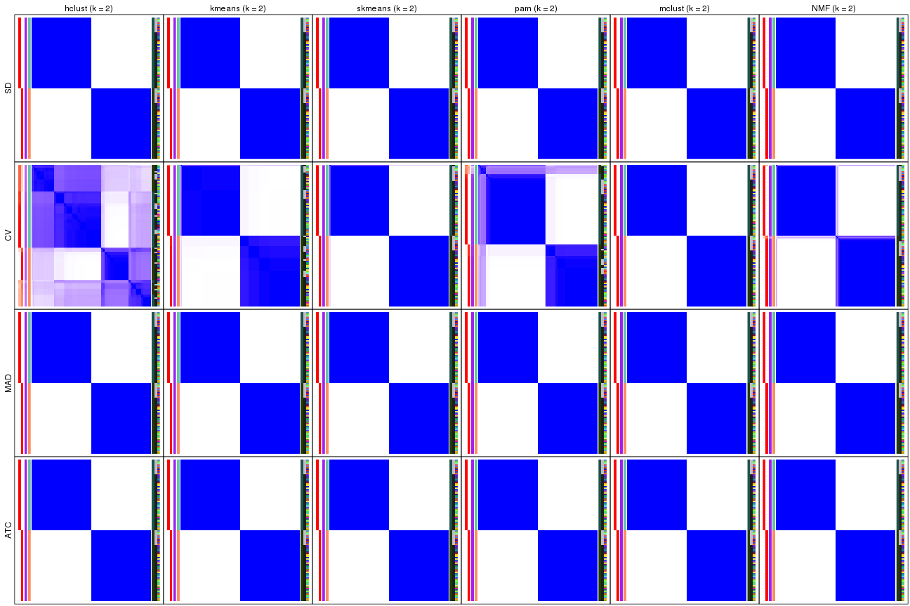</p>

</div>
<div id='tab-collect-consensus-heatmap-2'>
<pre><code class="r">collect_plots(res_list, k = 3, fun = consensus_heatmap, mc.cores = 4)
</code></pre>

<p></p>

</div>
<div id='tab-collect-consensus-heatmap-3'>
<pre><code class="r">collect_plots(res_list, k = 4, fun = consensus_heatmap, mc.cores = 4)
</code></pre>

<p></p>

</div>
<div id='tab-collect-consensus-heatmap-4'>
<pre><code class="r">collect_plots(res_list, k = 5, fun = consensus_heatmap, mc.cores = 4)
</code></pre>

<p></p>

</div>
<div id='tab-collect-consensus-heatmap-5'>
<pre><code class="r">collect_plots(res_list, k = 6, fun = consensus_heatmap, mc.cores = 4)
</code></pre>

<p></p>

</div>
</div>


### Membership heatmap

Membership heatmaps for all methods. ([What is a membership heatmap?](http://bioconductor.org/packages/devel/bioc/vignettes/cola/inst/doc/cola.html#toc_12))


<script>
$( function() {
	$( '#tabs-collect-membership-heatmap' ).tabs();
} );
</script>
<div id='tabs-collect-membership-heatmap'>
<ul>
<li><a href='#tab-collect-membership-heatmap-1'>k = 2</a></li>
<li><a href='#tab-collect-membership-heatmap-2'>k = 3</a></li>
<li><a href='#tab-collect-membership-heatmap-3'>k = 4</a></li>
<li><a href='#tab-collect-membership-heatmap-4'>k = 5</a></li>
<li><a href='#tab-collect-membership-heatmap-5'>k = 6</a></li>
</ul>
<div id='tab-collect-membership-heatmap-1'>
<pre><code class="r">collect_plots(res_list, k = 2, fun = membership_heatmap, mc.cores = 4)
</code></pre>

<p></p>

</div>
<div id='tab-collect-membership-heatmap-2'>
<pre><code class="r">collect_plots(res_list, k = 3, fun = membership_heatmap, mc.cores = 4)
</code></pre>

<p>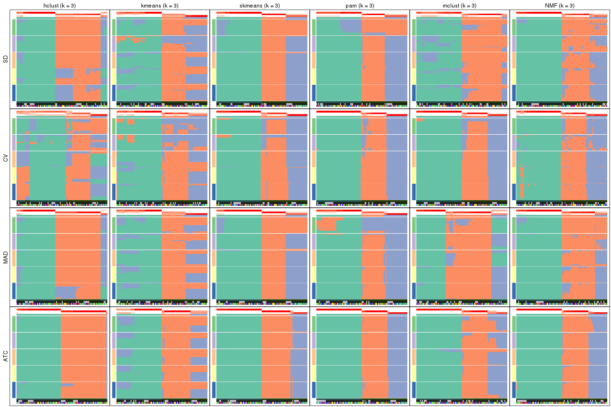</p>

</div>
<div id='tab-collect-membership-heatmap-3'>
<pre><code class="r">collect_plots(res_list, k = 4, fun = membership_heatmap, mc.cores = 4)
</code></pre>

<p></p>

</div>
<div id='tab-collect-membership-heatmap-4'>
<pre><code class="r">collect_plots(res_list, k = 5, fun = membership_heatmap, mc.cores = 4)
</code></pre>

<p></p>

</div>
<div id='tab-collect-membership-heatmap-5'>
<pre><code class="r">collect_plots(res_list, k = 6, fun = membership_heatmap, mc.cores = 4)
</code></pre>

<p></p>

</div>
</div>


### Signature heatmap

Signature heatmaps for all methods. ([What is a signature heatmap?](http://bioconductor.org/packages/devel/bioc/vignettes/cola/inst/doc/cola.html#toc_22))


Note in following heatmaps, rows are scaled.


<script>
$( function() {
	$( '#tabs-collect-get-signatures' ).tabs();
} );
</script>
<div id='tabs-collect-get-signatures'>
<ul>
<li><a href='#tab-collect-get-signatures-1'>k = 2</a></li>
<li><a href='#tab-collect-get-signatures-2'>k = 3</a></li>
<li><a href='#tab-collect-get-signatures-3'>k = 4</a></li>
<li><a href='#tab-collect-get-signatures-4'>k = 5</a></li>
<li><a href='#tab-collect-get-signatures-5'>k = 6</a></li>
</ul>
<div id='tab-collect-get-signatures-1'>
<pre><code class="r">collect_plots(res_list, k = 2, fun = get_signatures, mc.cores = 4)
</code></pre>

<p></p>

</div>
<div id='tab-collect-get-signatures-2'>
<pre><code class="r">collect_plots(res_list, k = 3, fun = get_signatures, mc.cores = 4)
</code></pre>

<p></p>

</div>
<div id='tab-collect-get-signatures-3'>
<pre><code class="r">collect_plots(res_list, k = 4, fun = get_signatures, mc.cores = 4)
</code></pre>

<p></p>

</div>
<div id='tab-collect-get-signatures-4'>
<pre><code class="r">collect_plots(res_list, k = 5, fun = get_signatures, mc.cores = 4)
</code></pre>

<p></p>

</div>
<div id='tab-collect-get-signatures-5'>
<pre><code class="r">collect_plots(res_list, k = 6, fun = get_signatures, mc.cores = 4)
</code></pre>

<p></p>

</div>
</div>


### Statistics table

The statistics used for measuring the stability of consensus partitioning.
([How are they
defined?](http://bioconductor.org/packages/devel/bioc/vignettes/cola/inst/doc/cola.html#toc_13))


<script>
$( function() {
	$( '#tabs-get-stats-from-consensus-partition-list' ).tabs();
} );
</script>
<div id='tabs-get-stats-from-consensus-partition-list'>
<ul>
<li><a href='#tab-get-stats-from-consensus-partition-list-1'>k = 2</a></li>
<li><a href='#tab-get-stats-from-consensus-partition-list-2'>k = 3</a></li>
<li><a href='#tab-get-stats-from-consensus-partition-list-3'>k = 4</a></li>
<li><a href='#tab-get-stats-from-consensus-partition-list-4'>k = 5</a></li>
<li><a href='#tab-get-stats-from-consensus-partition-list-5'>k = 6</a></li>
</ul>
<div id='tab-get-stats-from-consensus-partition-list-1'>
<pre><code class="r">get_stats(res_list, k = 2)
</code></pre>

<pre><code>#&gt;             k 1-PAC mean_silhouette concordance area_increased  Rand Jaccard
#&gt; SD:NMF      2 1.000           1.000       1.000          0.506 0.495   0.495
#&gt; CV:NMF      2 1.000           0.978       0.991          0.506 0.495   0.495
#&gt; MAD:NMF     2 1.000           1.000       1.000          0.506 0.495   0.495
#&gt; ATC:NMF     2 1.000           1.000       1.000          0.506 0.495   0.495
#&gt; SD:skmeans  2 1.000           1.000       1.000          0.506 0.495   0.495
#&gt; CV:skmeans  2 1.000           0.996       0.998          0.506 0.495   0.495
#&gt; MAD:skmeans 2 1.000           1.000       1.000          0.506 0.495   0.495
#&gt; ATC:skmeans 2 1.000           1.000       1.000          0.506 0.495   0.495
#&gt; SD:mclust   2 1.000           1.000       1.000          0.506 0.495   0.495
#&gt; CV:mclust   2 1.000           1.000       1.000          0.506 0.495   0.495
#&gt; MAD:mclust  2 1.000           1.000       1.000          0.506 0.495   0.495
#&gt; ATC:mclust  2 1.000           1.000       1.000          0.506 0.495   0.495
#&gt; SD:kmeans   2 1.000           1.000       1.000          0.506 0.495   0.495
#&gt; CV:kmeans   2 1.000           0.988       0.993          0.505 0.495   0.495
#&gt; MAD:kmeans  2 1.000           1.000       1.000          0.506 0.495   0.495
#&gt; ATC:kmeans  2 1.000           1.000       1.000          0.506 0.495   0.495
#&gt; SD:pam      2 1.000           1.000       1.000          0.506 0.495   0.495
#&gt; CV:pam      2 0.978           0.931       0.970          0.500 0.503   0.503
#&gt; MAD:pam     2 1.000           1.000       1.000          0.506 0.495   0.495
#&gt; ATC:pam     2 1.000           1.000       1.000          0.506 0.495   0.495
#&gt; SD:hclust   2 1.000           1.000       1.000          0.506 0.495   0.495
#&gt; CV:hclust   2 0.434           0.795       0.870          0.470 0.509   0.509
#&gt; MAD:hclust  2 1.000           1.000       1.000          0.506 0.495   0.495
#&gt; ATC:hclust  2 1.000           1.000       1.000          0.506 0.495   0.495
</code></pre>

</div>
<div id='tab-get-stats-from-consensus-partition-list-2'>
<pre><code class="r">get_stats(res_list, k = 3)
</code></pre>

<pre><code>#&gt;             k 1-PAC mean_silhouette concordance area_increased  Rand Jaccard
#&gt; SD:NMF      3 0.842           0.851       0.900         0.1962 0.879   0.756
#&gt; CV:NMF      3 0.811           0.855       0.926         0.2722 0.858   0.716
#&gt; MAD:NMF     3 0.840           0.894       0.915         0.1749 0.900   0.798
#&gt; ATC:NMF     3 0.968           0.950       0.976         0.2407 0.877   0.752
#&gt; SD:skmeans  3 0.807           0.970       0.927         0.2322 0.874   0.745
#&gt; CV:skmeans  3 0.951           0.910       0.945         0.2500 0.859   0.717
#&gt; MAD:skmeans 3 0.814           0.972       0.927         0.2268 0.874   0.745
#&gt; ATC:skmeans 3 1.000           0.969       0.981         0.2254 0.882   0.761
#&gt; SD:mclust   3 0.698           0.763       0.850         0.1979 0.945   0.888
#&gt; CV:mclust   3 0.980           0.934       0.959         0.2403 0.876   0.749
#&gt; MAD:mclust  3 0.829           0.940       0.886         0.1963 0.884   0.766
#&gt; ATC:mclust  3 0.888           0.906       0.933         0.2222 0.876   0.749
#&gt; SD:kmeans   3 0.695           0.875       0.809         0.2362 0.874   0.745
#&gt; CV:kmeans   3 0.676           0.832       0.829         0.2385 0.877   0.752
#&gt; MAD:kmeans  3 0.693           0.866       0.798         0.2369 0.874   0.745
#&gt; ATC:kmeans  3 0.747           0.850       0.825         0.2328 0.882   0.761
#&gt; SD:pam      3 0.753           0.947       0.897         0.2485 0.874   0.745
#&gt; CV:pam      3 0.965           0.937       0.970         0.2664 0.797   0.620
#&gt; MAD:pam     3 0.750           0.910       0.901         0.2480 0.874   0.745
#&gt; ATC:pam     3 1.000           0.984       0.992         0.2460 0.876   0.749
#&gt; SD:hclust   3 0.766           0.834       0.870         0.1753 0.937   0.873
#&gt; CV:hclust   3 0.440           0.598       0.710         0.2986 0.654   0.446
#&gt; MAD:hclust  3 0.787           0.905       0.932         0.1611 0.937   0.873
#&gt; ATC:hclust  3 1.000           0.968       0.988         0.0387 0.990   0.979
</code></pre>

</div>
<div id='tab-get-stats-from-consensus-partition-list-3'>
<pre><code class="r">get_stats(res_list, k = 4)
</code></pre>

<pre><code>#&gt;             k 1-PAC mean_silhouette concordance area_increased  Rand Jaccard
#&gt; SD:NMF      4 0.685           0.794       0.829         0.1043 0.930   0.827
#&gt; CV:NMF      4 0.778           0.785       0.877         0.0895 0.893   0.719
#&gt; MAD:NMF     4 0.681           0.673       0.791         0.1084 0.896   0.750
#&gt; ATC:NMF     4 0.807           0.784       0.888         0.0666 0.984   0.956
#&gt; SD:skmeans  4 0.870           0.799       0.867         0.1777 0.896   0.717
#&gt; CV:skmeans  4 0.872           0.855       0.931         0.1751 0.876   0.663
#&gt; MAD:skmeans 4 0.842           0.758       0.861         0.1697 0.923   0.791
#&gt; ATC:skmeans 4 0.908           0.934       0.963         0.1351 0.911   0.763
#&gt; SD:mclust   4 0.730           0.809       0.852         0.1731 0.801   0.565
#&gt; CV:mclust   4 0.862           0.851       0.938         0.1713 0.880   0.684
#&gt; MAD:mclust  4 0.766           0.895       0.882         0.1830 0.884   0.695
#&gt; ATC:mclust  4 0.685           0.735       0.841         0.1564 0.862   0.644
#&gt; SD:kmeans   4 0.616           0.688       0.658         0.1114 0.864   0.642
#&gt; CV:kmeans   4 0.662           0.641       0.807         0.1337 0.873   0.676
#&gt; MAD:kmeans  4 0.622           0.626       0.680         0.1109 0.910   0.761
#&gt; ATC:kmeans  4 0.644           0.820       0.820         0.1237 0.881   0.687
#&gt; SD:pam      4 0.776           0.793       0.899         0.1852 0.876   0.662
#&gt; CV:pam      4 0.900           0.893       0.950         0.1221 0.911   0.761
#&gt; MAD:pam     4 0.772           0.673       0.847         0.1859 0.874   0.663
#&gt; ATC:pam     4 0.874           0.820       0.925         0.1713 0.888   0.697
#&gt; SD:hclust   4 0.762           0.819       0.899         0.1734 0.836   0.625
#&gt; CV:hclust   4 0.751           0.873       0.886         0.1571 0.833   0.599
#&gt; MAD:hclust  4 0.824           0.842       0.921         0.1914 0.864   0.685
#&gt; ATC:hclust  4 0.912           0.909       0.962         0.1900 0.900   0.794
</code></pre>

</div>
<div id='tab-get-stats-from-consensus-partition-list-4'>
<pre><code class="r">get_stats(res_list, k = 5)
</code></pre>

<pre><code>#&gt;             k 1-PAC mean_silhouette concordance area_increased  Rand Jaccard
#&gt; SD:NMF      5 0.767           0.795       0.883        0.09348 0.868   0.652
#&gt; CV:NMF      5 0.621           0.543       0.756        0.08732 0.928   0.775
#&gt; MAD:NMF     5 0.701           0.765       0.854        0.08878 0.869   0.647
#&gt; ATC:NMF     5 0.749           0.728       0.855        0.07159 0.919   0.779
#&gt; SD:skmeans  5 0.911           0.891       0.931        0.06231 0.902   0.664
#&gt; CV:skmeans  5 0.787           0.685       0.844        0.04791 0.950   0.815
#&gt; MAD:skmeans 5 0.872           0.897       0.928        0.07233 0.911   0.705
#&gt; ATC:skmeans 5 0.832           0.831       0.908        0.05869 0.975   0.912
#&gt; SD:mclust   5 0.597           0.575       0.700        0.06609 0.933   0.774
#&gt; CV:mclust   5 0.808           0.681       0.871        0.00937 0.898   0.682
#&gt; MAD:mclust  5 0.678           0.761       0.821        0.07041 0.948   0.805
#&gt; ATC:mclust  5 0.667           0.758       0.826        0.06243 0.940   0.784
#&gt; SD:kmeans   5 0.586           0.654       0.737        0.07820 0.870   0.571
#&gt; CV:kmeans   5 0.664           0.582       0.756        0.07771 0.932   0.768
#&gt; MAD:kmeans  5 0.581           0.680       0.722        0.07624 0.910   0.703
#&gt; ATC:kmeans  5 0.612           0.685       0.772        0.07685 0.961   0.867
#&gt; SD:pam      5 0.818           0.854       0.891        0.04887 0.946   0.787
#&gt; CV:pam      5 0.766           0.700       0.824        0.08590 0.946   0.814
#&gt; MAD:pam     5 0.849           0.791       0.907        0.05607 0.913   0.682
#&gt; ATC:pam     5 0.842           0.898       0.909        0.07249 0.914   0.689
#&gt; SD:hclust   5 0.767           0.705       0.847        0.05055 0.981   0.933
#&gt; CV:hclust   5 0.810           0.868       0.898        0.06047 0.976   0.911
#&gt; MAD:hclust  5 0.835           0.808       0.901        0.04003 0.951   0.838
#&gt; ATC:hclust  5 0.938           0.914       0.957        0.05803 0.967   0.914
</code></pre>

</div>
<div id='tab-get-stats-from-consensus-partition-list-5'>
<pre><code class="r">get_stats(res_list, k = 6)
</code></pre>

<pre><code>#&gt;             k 1-PAC mean_silhouette concordance area_increased  Rand Jaccard
#&gt; SD:NMF      6 0.876           0.871       0.920         0.0340 0.973   0.902
#&gt; CV:NMF      6 0.653           0.580       0.751         0.0583 0.895   0.651
#&gt; MAD:NMF     6 0.768           0.833       0.888         0.0406 0.953   0.838
#&gt; ATC:NMF     6 0.645           0.743       0.823         0.0464 0.961   0.872
#&gt; SD:skmeans  6 0.818           0.647       0.854         0.0360 0.986   0.938
#&gt; CV:skmeans  6 0.782           0.656       0.801         0.0458 0.934   0.737
#&gt; MAD:skmeans 6 0.826           0.769       0.862         0.0347 0.976   0.898
#&gt; ATC:skmeans 6 0.793           0.707       0.858         0.0407 0.987   0.952
#&gt; SD:mclust   6 0.706           0.621       0.732         0.0668 0.872   0.547
#&gt; CV:mclust   6 0.811           0.638       0.866         0.0534 0.971   0.895
#&gt; MAD:mclust  6 0.694           0.639       0.752         0.0543 0.895   0.587
#&gt; ATC:mclust  6 0.710           0.686       0.800         0.0454 0.931   0.728
#&gt; SD:kmeans   6 0.583           0.584       0.707         0.0551 0.937   0.738
#&gt; CV:kmeans   6 0.722           0.595       0.693         0.0534 0.900   0.610
#&gt; MAD:kmeans  6 0.584           0.591       0.729         0.0581 0.974   0.882
#&gt; ATC:kmeans  6 0.651           0.523       0.747         0.0457 0.906   0.672
#&gt; SD:pam      6 0.843           0.757       0.849         0.0394 0.956   0.801
#&gt; CV:pam      6 0.807           0.742       0.875         0.0553 0.936   0.741
#&gt; MAD:pam     6 0.844           0.776       0.836         0.0336 0.938   0.727
#&gt; ATC:pam     6 0.906           0.917       0.949         0.0541 0.946   0.747
#&gt; SD:hclust   6 0.774           0.685       0.808         0.0354 0.988   0.953
#&gt; CV:hclust   6 0.783           0.843       0.846         0.0331 0.958   0.830
#&gt; MAD:hclust  6 0.750           0.758       0.868         0.0328 0.996   0.985
#&gt; ATC:hclust  6 0.753           0.727       0.862         0.1070 0.946   0.847
</code></pre>

</div>
</div>

Following heatmap plots the partition for each combination of methods and the
lightness correspond to the silhouette scores for samples in each method. On
top the consensus subgroup is inferred from all methods by taking the mean
silhouette scores as weight.


<script>
$( function() {
	$( '#tabs-collect-stats-from-consensus-partition-list' ).tabs();
} );
</script>
<div id='tabs-collect-stats-from-consensus-partition-list'>
<ul>
<li><a href='#tab-collect-stats-from-consensus-partition-list-1'>k = 2</a></li>
<li><a href='#tab-collect-stats-from-consensus-partition-list-2'>k = 3</a></li>
<li><a href='#tab-collect-stats-from-consensus-partition-list-3'>k = 4</a></li>
<li><a href='#tab-collect-stats-from-consensus-partition-list-4'>k = 5</a></li>
<li><a href='#tab-collect-stats-from-consensus-partition-list-5'>k = 6</a></li>
</ul>
<div id='tab-collect-stats-from-consensus-partition-list-1'>
<pre><code class="r">collect_stats(res_list, k = 2)
</code></pre>

<p></p>

</div>
<div id='tab-collect-stats-from-consensus-partition-list-2'>
<pre><code class="r">collect_stats(res_list, k = 3)
</code></pre>

<p></p>

</div>
<div id='tab-collect-stats-from-consensus-partition-list-3'>
<pre><code class="r">collect_stats(res_list, k = 4)
</code></pre>

<p></p>

</div>
<div id='tab-collect-stats-from-consensus-partition-list-4'>
<pre><code class="r">collect_stats(res_list, k = 5)
</code></pre>

<p></p>

</div>
<div id='tab-collect-stats-from-consensus-partition-list-5'>
<pre><code class="r">collect_stats(res_list, k = 6)
</code></pre>

<p></p>

</div>
</div>

### Partition from all methods


Collect partitions from all methods:


<script>
$( function() {
	$( '#tabs-collect-classes-from-consensus-partition-list' ).tabs();
} );
</script>
<div id='tabs-collect-classes-from-consensus-partition-list'>
<ul>
<li><a href='#tab-collect-classes-from-consensus-partition-list-1'>k = 2</a></li>
<li><a href='#tab-collect-classes-from-consensus-partition-list-2'>k = 3</a></li>
<li><a href='#tab-collect-classes-from-consensus-partition-list-3'>k = 4</a></li>
<li><a href='#tab-collect-classes-from-consensus-partition-list-4'>k = 5</a></li>
<li><a href='#tab-collect-classes-from-consensus-partition-list-5'>k = 6</a></li>
</ul>
<div id='tab-collect-classes-from-consensus-partition-list-1'>
<pre><code class="r">collect_classes(res_list, k = 2)
</code></pre>

<p></p>

</div>
<div id='tab-collect-classes-from-consensus-partition-list-2'>
<pre><code class="r">collect_classes(res_list, k = 3)
</code></pre>

<p></p>

</div>
<div id='tab-collect-classes-from-consensus-partition-list-3'>
<pre><code class="r">collect_classes(res_list, k = 4)
</code></pre>

<p></p>

</div>
<div id='tab-collect-classes-from-consensus-partition-list-4'>
<pre><code class="r">collect_classes(res_list, k = 5)
</code></pre>

<p></p>

</div>
<div id='tab-collect-classes-from-consensus-partition-list-5'>
<pre><code class="r">collect_classes(res_list, k = 6)
</code></pre>

<p></p>

</div>
</div>


### Top rows overlap


Overlap of top rows from different top-row methods:


<script>
$( function() {
	$( '#tabs-top-rows-overlap-by-euler' ).tabs();
} );
</script>
<div id='tabs-top-rows-overlap-by-euler'>
<ul>
<li><a href='#tab-top-rows-overlap-by-euler-1'>top_n = 1000</a></li>
<li><a href='#tab-top-rows-overlap-by-euler-2'>top_n = 2000</a></li>
<li><a href='#tab-top-rows-overlap-by-euler-3'>top_n = 3000</a></li>
<li><a href='#tab-top-rows-overlap-by-euler-4'>top_n = 4000</a></li>
<li><a href='#tab-top-rows-overlap-by-euler-5'>top_n = 5000</a></li>
</ul>
<div id='tab-top-rows-overlap-by-euler-1'>
<pre><code class="r">top_rows_overlap(res_list, top_n = 1000, method = &quot;euler&quot;)
</code></pre>

<p></p>

</div>
<div id='tab-top-rows-overlap-by-euler-2'>
<pre><code class="r">top_rows_overlap(res_list, top_n = 2000, method = &quot;euler&quot;)
</code></pre>

<p></p>

</div>
<div id='tab-top-rows-overlap-by-euler-3'>
<pre><code class="r">top_rows_overlap(res_list, top_n = 3000, method = &quot;euler&quot;)
</code></pre>

<p></p>

</div>
<div id='tab-top-rows-overlap-by-euler-4'>
<pre><code class="r">top_rows_overlap(res_list, top_n = 4000, method = &quot;euler&quot;)
</code></pre>

<p></p>

</div>
<div id='tab-top-rows-overlap-by-euler-5'>
<pre><code class="r">top_rows_overlap(res_list, top_n = 5000, method = &quot;euler&quot;)
</code></pre>

<p></p>

</div>
</div>

Also visualize the correspondance of rankings between different top-row methods:


<script>
$( function() {
	$( '#tabs-top-rows-overlap-by-correspondance' ).tabs();
} );
</script>
<div id='tabs-top-rows-overlap-by-correspondance'>
<ul>
<li><a href='#tab-top-rows-overlap-by-correspondance-1'>top_n = 1000</a></li>
<li><a href='#tab-top-rows-overlap-by-correspondance-2'>top_n = 2000</a></li>
<li><a href='#tab-top-rows-overlap-by-correspondance-3'>top_n = 3000</a></li>
<li><a href='#tab-top-rows-overlap-by-correspondance-4'>top_n = 4000</a></li>
<li><a href='#tab-top-rows-overlap-by-correspondance-5'>top_n = 5000</a></li>
</ul>
<div id='tab-top-rows-overlap-by-correspondance-1'>
<pre><code class="r">top_rows_overlap(res_list, top_n = 1000, method = &quot;correspondance&quot;)
</code></pre>

<p></p>

</div>
<div id='tab-top-rows-overlap-by-correspondance-2'>
<pre><code class="r">top_rows_overlap(res_list, top_n = 2000, method = &quot;correspondance&quot;)
</code></pre>

<p></p>

</div>
<div id='tab-top-rows-overlap-by-correspondance-3'>
<pre><code class="r">top_rows_overlap(res_list, top_n = 3000, method = &quot;correspondance&quot;)
</code></pre>

<p></p>

</div>
<div id='tab-top-rows-overlap-by-correspondance-4'>
<pre><code class="r">top_rows_overlap(res_list, top_n = 4000, method = &quot;correspondance&quot;)
</code></pre>

<p></p>

</div>
<div id='tab-top-rows-overlap-by-correspondance-5'>
<pre><code class="r">top_rows_overlap(res_list, top_n = 5000, method = &quot;correspondance&quot;)
</code></pre>

<p></p>

</div>
</div>


Heatmaps of the top rows:


<script>
$( function() {
	$( '#tabs-top-rows-heatmap' ).tabs();
} );
</script>
<div id='tabs-top-rows-heatmap'>
<ul>
<li><a href='#tab-top-rows-heatmap-1'>top_n = 1000</a></li>
<li><a href='#tab-top-rows-heatmap-2'>top_n = 2000</a></li>
<li><a href='#tab-top-rows-heatmap-3'>top_n = 3000</a></li>
<li><a href='#tab-top-rows-heatmap-4'>top_n = 4000</a></li>
<li><a href='#tab-top-rows-heatmap-5'>top_n = 5000</a></li>
</ul>
<div id='tab-top-rows-heatmap-1'>
<pre><code class="r">top_rows_heatmap(res_list, top_n = 1000)
</code></pre>

<p></p>

</div>
<div id='tab-top-rows-heatmap-2'>
<pre><code class="r">top_rows_heatmap(res_list, top_n = 2000)
</code></pre>

<p></p>

</div>
<div id='tab-top-rows-heatmap-3'>
<pre><code class="r">top_rows_heatmap(res_list, top_n = 3000)
</code></pre>

<p></p>

</div>
<div id='tab-top-rows-heatmap-4'>
<pre><code class="r">top_rows_heatmap(res_list, top_n = 4000)
</code></pre>

<p></p>

</div>
<div id='tab-top-rows-heatmap-5'>
<pre><code class="r">top_rows_heatmap(res_list, top_n = 5000)
</code></pre>

<p></p>

</div>
</div>


### Test to known annotations


Test correlation between subgroups and known annotations. If the known
annotation is numeric, one-way ANOVA test is applied, and if the known
annotation is discrete, chi-squared contingency table test is applied.


<script>
$( function() {
	$( '#tabs-test-to-known-factors-from-consensus-partition-list' ).tabs();
} );
</script>
<div id='tabs-test-to-known-factors-from-consensus-partition-list'>
<ul>
<li><a href='#tab-test-to-known-factors-from-consensus-partition-list-1'>k = 2</a></li>
<li><a href='#tab-test-to-known-factors-from-consensus-partition-list-2'>k = 3</a></li>
<li><a href='#tab-test-to-known-factors-from-consensus-partition-list-3'>k = 4</a></li>
<li><a href='#tab-test-to-known-factors-from-consensus-partition-list-4'>k = 5</a></li>
<li><a href='#tab-test-to-known-factors-from-consensus-partition-list-5'>k = 6</a></li>
</ul>
<div id='tab-test-to-known-factors-from-consensus-partition-list-1'>
<pre><code class="r">test_to_known_factors(res_list, k = 2)
</code></pre>

<pre><code>#&gt;              n cell.type(p) protocol(p) individual(p) k
#&gt; SD:NMF      96     8.49e-22        1.00          1.00 2
#&gt; CV:NMF      95     1.41e-21        1.00          1.00 2
#&gt; MAD:NMF     96     8.49e-22        1.00          1.00 2
#&gt; ATC:NMF     96     8.49e-22        1.00          1.00 2
#&gt; SD:skmeans  96     8.49e-22        1.00          1.00 2
#&gt; CV:skmeans  96     8.49e-22        1.00          1.00 2
#&gt; MAD:skmeans 96     8.49e-22        1.00          1.00 2
#&gt; ATC:skmeans 96     8.49e-22        1.00          1.00 2
#&gt; SD:mclust   96     8.49e-22        1.00          1.00 2
#&gt; CV:mclust   96     8.49e-22        1.00          1.00 2
#&gt; MAD:mclust  96     8.49e-22        1.00          1.00 2
#&gt; ATC:mclust  96     8.49e-22        1.00          1.00 2
#&gt; SD:kmeans   96     8.49e-22        1.00          1.00 2
#&gt; CV:kmeans   96     8.49e-22        1.00          1.00 2
#&gt; MAD:kmeans  96     8.49e-22        1.00          1.00 2
#&gt; ATC:kmeans  96     8.49e-22        1.00          1.00 2
#&gt; SD:pam      96     8.49e-22        1.00          1.00 2
#&gt; CV:pam      91     7.48e-20        1.00          1.00 2
#&gt; MAD:pam     96     8.49e-22        1.00          1.00 2
#&gt; ATC:pam     96     8.49e-22        1.00          1.00 2
#&gt; SD:hclust   96     8.49e-22        1.00          1.00 2
#&gt; CV:hclust   96     8.38e-05        0.35          0.81 2
#&gt; MAD:hclust  96     8.49e-22        1.00          1.00 2
#&gt; ATC:hclust  96     8.49e-22        1.00          1.00 2
</code></pre>

</div>
<div id='tab-test-to-known-factors-from-consensus-partition-list-2'>
<pre><code class="r">test_to_known_factors(res_list, k = 3)
</code></pre>

<pre><code>#&gt;              n cell.type(p) protocol(p) individual(p) k
#&gt; SD:NMF      93     6.39e-21       0.665         1.000 3
#&gt; CV:NMF      91     1.74e-20       0.772         1.000 3
#&gt; MAD:NMF     95     2.35e-21       0.614         1.000 3
#&gt; ATC:NMF     94     3.87e-21       0.484         1.000 3
#&gt; SD:skmeans  96     1.43e-21       0.691         1.000 3
#&gt; CV:skmeans  93     6.39e-21       0.791         1.000 3
#&gt; MAD:skmeans 96     1.43e-21       0.691         1.000 3
#&gt; ATC:skmeans 94     3.87e-21       0.161         1.000 3
#&gt; SD:mclust   90     2.86e-20       0.626         1.000 3
#&gt; CV:mclust   92     1.05e-20       0.793         1.000 3
#&gt; MAD:mclust  96     1.43e-21       0.519         1.000 3
#&gt; ATC:mclust  94     3.87e-21       0.797         1.000 3
#&gt; SD:kmeans   94     3.87e-21       0.539         1.000 3
#&gt; CV:kmeans   92     1.05e-20       0.751         1.000 3
#&gt; MAD:kmeans  94     3.87e-21       0.539         1.000 3
#&gt; ATC:kmeans  93     6.39e-21       0.329         1.000 3
#&gt; SD:pam      96     1.43e-21       0.364         1.000 3
#&gt; CV:pam      94     3.87e-21       0.642         1.000 3
#&gt; MAD:pam     93     6.39e-21       0.713         1.000 3
#&gt; ATC:pam     96     1.43e-21       0.508         1.000 3
#&gt; SD:hclust   91     1.74e-20       0.898         1.000 3
#&gt; CV:hclust   77     1.90e-17       0.309         0.993 3
#&gt; MAD:hclust  92     1.05e-20       0.898         1.000 3
#&gt; ATC:hclust  95     1.41e-21       1.000         1.000 3
</code></pre>

</div>
<div id='tab-test-to-known-factors-from-consensus-partition-list-3'>
<pre><code class="r">test_to_known_factors(res_list, k = 4)
</code></pre>

<pre><code>#&gt;              n cell.type(p) protocol(p) individual(p) k
#&gt; SD:NMF      92     1.05e-20       0.365         1.000 4
#&gt; CV:NMF      85     1.06e-16       0.667         0.942 4
#&gt; MAD:NMF     75     5.18e-17       0.786         0.999 4
#&gt; ATC:NMF     87     1.28e-19       0.445         1.000 4
#&gt; SD:skmeans  91     1.34e-19       0.863         0.996 4
#&gt; CV:skmeans  89     3.59e-19       0.407         0.993 4
#&gt; MAD:skmeans 78     8.24e-17       0.746         0.984 4
#&gt; ATC:skmeans 94     3.03e-20       0.295         0.998 4
#&gt; SD:mclust   94     3.03e-20       0.146         0.998 4
#&gt; CV:mclust   89     3.59e-19       0.217         0.994 4
#&gt; MAD:mclust  95     1.85e-20       0.500         0.998 4
#&gt; ATC:mclust  84     4.25e-18       0.333         0.992 4
#&gt; SD:kmeans   63     2.09e-14       0.401         0.909 4
#&gt; CV:kmeans   80     3.07e-17       0.375         0.979 4
#&gt; MAD:kmeans  72     1.59e-15       0.834         0.983 4
#&gt; ATC:kmeans  90     2.19e-19       0.481         0.996 4
#&gt; SD:pam      88     5.89e-19       0.571         0.994 4
#&gt; CV:pam      92     8.15e-20       0.699         0.992 4
#&gt; MAD:pam     73     9.72e-16       0.883         0.966 4
#&gt; ATC:pam     83     6.97e-18       0.505         0.990 4
#&gt; SD:hclust   87     9.66e-19       0.538         0.994 4
#&gt; CV:hclust   95     3.63e-16       0.497         0.945 4
#&gt; MAD:hclust  89     3.59e-19       0.417         0.996 4
#&gt; ATC:hclust  95     2.35e-21       0.189         1.000 4
</code></pre>

</div>
<div id='tab-test-to-known-factors-from-consensus-partition-list-4'>
<pre><code class="r">test_to_known_factors(res_list, k = 5)
</code></pre>

<pre><code>#&gt;              n cell.type(p) protocol(p) individual(p) k
#&gt; SD:NMF      90     1.32e-18       0.630         0.991 5
#&gt; CV:NMF      67     1.87e-14       0.415         0.489 5
#&gt; MAD:NMF     86     9.31e-18       0.685         0.926 5
#&gt; ATC:NMF     87     5.71e-18       0.436         0.928 5
#&gt; SD:skmeans  93     3.03e-19       0.639         0.991 5
#&gt; CV:skmeans  80     3.07e-17       0.641         0.944 5
#&gt; MAD:skmeans 92     4.95e-19       0.623         0.990 5
#&gt; ATC:skmeans 92     4.95e-19       0.113         0.991 5
#&gt; SD:mclust   73     5.28e-15       0.236         0.853 5
#&gt; CV:mclust   70     2.27e-14       0.211         0.858 5
#&gt; MAD:mclust  85     1.52e-17       0.246         0.988 5
#&gt; ATC:mclust  87     5.71e-18       0.356         0.989 5
#&gt; SD:kmeans   83     4.03e-17       0.518         0.980 5
#&gt; CV:kmeans   73     5.28e-15       0.593         0.981 5
#&gt; MAD:kmeans  83     4.03e-17       0.591         0.982 5
#&gt; ATC:kmeans  84     4.25e-18       0.279         0.987 5
#&gt; SD:pam      93     3.03e-19       0.496         0.991 5
#&gt; CV:pam      81     1.07e-16       0.823         0.979 5
#&gt; MAD:pam     86     9.31e-18       0.931         0.983 5
#&gt; ATC:pam     95     1.14e-19       0.773         0.991 5
#&gt; SD:hclust   80     1.74e-16       0.593         0.873 5
#&gt; CV:hclust   95     1.14e-19       0.610         0.993 5
#&gt; MAD:hclust  89     2.15e-18       0.471         0.990 5
#&gt; ATC:hclust  93     4.97e-20       0.109         0.997 5
</code></pre>

</div>
<div id='tab-test-to-known-factors-from-consensus-partition-list-5'>
<pre><code class="r">test_to_known_factors(res_list, k = 6)
</code></pre>

<pre><code>#&gt;              n cell.type(p) protocol(p) individual(p) k
#&gt; SD:NMF      93     3.03e-19       0.434         0.989 6
#&gt; CV:NMF      71     1.40e-14       0.615         0.955 6
#&gt; MAD:NMF     91     8.07e-19       0.399         0.985 6
#&gt; ATC:NMF     91     8.07e-19       0.707         0.972 6
#&gt; SD:skmeans  82     6.56e-17       0.640         0.937 6
#&gt; CV:skmeans  80     8.39e-16       0.420         0.879 6
#&gt; MAD:skmeans 93     3.03e-19       0.639         0.991 6
#&gt; ATC:skmeans 76     5.75e-15       0.471         0.808 6
#&gt; SD:mclust   72     8.58e-15       0.803         0.915 6
#&gt; CV:mclust   71     1.40e-14       0.705         0.861 6
#&gt; MAD:mclust  78     2.20e-15       0.433         0.843 6
#&gt; ATC:mclust  84     1.22e-16       0.297         0.915 6
#&gt; SD:kmeans   70     2.27e-14       0.203         0.860 6
#&gt; CV:kmeans   64     1.81e-12       0.399         0.850 6
#&gt; MAD:kmeans  74     1.50e-14       0.480         0.777 6
#&gt; ATC:kmeans  68     2.67e-13       0.639         0.937 6
#&gt; SD:pam      87     2.87e-17       0.285         0.985 6
#&gt; CV:pam      85     7.53e-17       0.958         0.929 6
#&gt; MAD:pam     87     2.87e-17       0.674         0.961 6
#&gt; ATC:pam     95     5.97e-19       0.643         0.981 6
#&gt; SD:hclust   80     1.74e-16       0.605         0.929 6
#&gt; CV:hclust   92     2.55e-18       0.457         0.976 6
#&gt; MAD:hclust  83     4.03e-17       0.503         0.986 6
#&gt; ATC:hclust  84     2.47e-17       0.168         0.957 6
</code></pre>

</div>
</div>


 
## Results for each method


---------------------------------------------------


### SD:hclust**


The object with results only for a single top-value method and a single partition method 
can be extracted as:

```r
res = res_list["SD", "hclust"]
# you can also extract it by
# res = res_list["SD:hclust"]
```

A summary of `res` and all the functions that can be applied to it:

```r
res
```

```
#> A 'ConsensusPartition' object with k = 2, 3, 4, 5, 6.
#>   On a matrix with 25171 rows and 96 columns.
#>   Top rows (1000, 2000, 3000, 4000, 5000) are extracted by 'SD' method.
#>   Subgroups are detected by 'hclust' method.
#>   Performed in total 1250 partitions by row resampling.
#>   Best k for subgroups seems to be 2.
#> 
#> Following methods can be applied to this 'ConsensusPartition' object:
#>  [1] "cola_report"             "collect_classes"         "collect_plots"          
#>  [4] "collect_stats"           "colnames"                "compare_signatures"     
#>  [7] "consensus_heatmap"       "dimension_reduction"     "functional_enrichment"  
#> [10] "get_anno_col"            "get_anno"                "get_classes"            
#> [13] "get_consensus"           "get_matrix"              "get_membership"         
#> [16] "get_param"               "get_signatures"          "get_stats"              
#> [19] "is_best_k"               "is_stable_k"             "membership_heatmap"     
#> [22] "ncol"                    "nrow"                    "plot_ecdf"              
#> [25] "rownames"                "select_partition_number" "show"                   
#> [28] "suggest_best_k"          "test_to_known_factors"
```

`collect_plots()` function collects all the plots made from `res` for all `k` (number of partitions)
into one single page to provide an easy and fast comparison between different `k`.

```r
collect_plots(res)
```


The plots are:

- The first row: a plot of the ECDF (empirical cumulative distribution
  function) curves of the consensus matrix for each `k` and the heatmap of
  predicted classes for each `k`.
- The second row: heatmaps of the consensus matrix for each `k`.
- The third row: heatmaps of the membership matrix for each `k`.
- The fouth row: heatmaps of the signatures for each `k`.

All the plots in panels can be made by individual functions and they are
plotted later in this section.

`select_partition_number()` produces several plots showing different
statistics for choosing "optimized" `k`. There are following statistics:

- ECDF curves of the consensus matrix for each `k`;
- 1-PAC. [The PAC
  score](https://en.wikipedia.org/wiki/Consensus_clustering#Over-interpretation_potential_of_consensus_clustering)
  measures the proportion of the ambiguous subgrouping.
- Mean silhouette score.
- Concordance. The mean probability of fiting the consensus class ids in all
  partitions.
- Area increased. Denote $A_k$ as the area under the ECDF curve for current
  `k`, the area increased is defined as $A_k - A_{k-1}$.
- Rand index. The percent of pairs of samples that are both in a same cluster
  or both are not in a same cluster in the partition of k and k-1.
- Jaccard index. The ratio of pairs of samples are both in a same cluster in
  the partition of k and k-1 and the pairs of samples are both in a same
  cluster in the partition k or k-1.

The detailed explanations of these statistics can be found in [the _cola_
vignette](http://bioconductor.org/packages/devel/bioc/vignettes/cola/inst/doc/cola.html#toc_13).

Generally speaking, lower PAC score, higher mean silhouette score or higher
concordance corresponds to better partition. Rand index and Jaccard index
measure how similar the current partition is compared to partition with `k-1`.
If they are too similar, we won't accept `k` is better than `k-1`.

```r
select_partition_number(res)
```


The numeric values for all these statistics can be obtained by `get_stats()`.

```r
get_stats(res)
```

```
#>   k 1-PAC mean_silhouette concordance area_increased  Rand Jaccard
#> 2 2 1.000           1.000       1.000         0.5058 0.495   0.495
#> 3 3 0.766           0.834       0.870         0.1753 0.937   0.873
#> 4 4 0.762           0.819       0.899         0.1734 0.836   0.625
#> 5 5 0.767           0.705       0.847         0.0506 0.981   0.933
#> 6 6 0.774           0.685       0.808         0.0354 0.988   0.953
```

`suggest_best_k()` suggests the best $k$ based on these statistics. The rules are as follows:

- All $k$ with Jaccard index larger than 0.95 are removed because increasing
  $k$ does not provide enough extra information. If all $k$ are removed, it is
  marked as no subgroup is detected.
- For all $k$ with 1-PAC score larger than 0.9, the maximal $k$ is taken as
  the best $k$, and other $k$ are marked as optional $k$.
- If it does not fit the second rule. The $k$ with the maximal vote of the
  highest 1-PAC score, highest mean silhouette, and highest concordance is
  taken as the best $k$.

```r
suggest_best_k(res)
```

```
#> [1] 2
```


Following shows the table of the partitions (You need to click the **show/hide
code output** link to see it). The membership matrix (columns with name `p*`)
is inferred by
[`clue::cl_consensus()`](https://www.rdocumentation.org/link/cl_consensus?package=clue)
function with the `SE` method. Basically the value in the membership matrix
represents the probability to belong to a certain group. The finall class
label for an item is determined with the group with highest probability it
belongs to.

In `get_classes()` function, the entropy is calculated from the membership
matrix and the silhouette score is calculated from the consensus matrix.


<script>
$( function() {
	$( '#tabs-SD-hclust-get-classes' ).tabs();
} );
</script>
<div id='tabs-SD-hclust-get-classes'>
<ul>
<li><a href='#tab-SD-hclust-get-classes-1'>k = 2</a></li>
<li><a href='#tab-SD-hclust-get-classes-2'>k = 3</a></li>
<li><a href='#tab-SD-hclust-get-classes-3'>k = 4</a></li>
<li><a href='#tab-SD-hclust-get-classes-4'>k = 5</a></li>
<li><a href='#tab-SD-hclust-get-classes-5'>k = 6</a></li>
</ul>

<div id='tab-SD-hclust-get-classes-1'>
<p><a id='tab-SD-hclust-get-classes-1-a' style='color:#0366d6' href='#'>show/hide code output</a></p>
<pre><code class="r">cbind(get_classes(res, k = 2), get_membership(res, k = 2))
</code></pre>

<pre><code>#&gt;           class entropy silhouette p1 p2
#&gt; GSM257886     1       0          1  1  0
#&gt; GSM257888     1       0          1  1  0
#&gt; GSM257890     1       0          1  1  0
#&gt; GSM257892     1       0          1  1  0
#&gt; GSM257894     1       0          1  1  0
#&gt; GSM257896     1       0          1  1  0
#&gt; GSM257898     1       0          1  1  0
#&gt; GSM257900     1       0          1  1  0
#&gt; GSM257902     1       0          1  1  0
#&gt; GSM257904     1       0          1  1  0
#&gt; GSM257906     1       0          1  1  0
#&gt; GSM257908     1       0          1  1  0
#&gt; GSM257910     1       0          1  1  0
#&gt; GSM257912     1       0          1  1  0
#&gt; GSM257914     1       0          1  1  0
#&gt; GSM257917     1       0          1  1  0
#&gt; GSM257919     1       0          1  1  0
#&gt; GSM257921     1       0          1  1  0
#&gt; GSM257923     1       0          1  1  0
#&gt; GSM257925     1       0          1  1  0
#&gt; GSM257927     1       0          1  1  0
#&gt; GSM257929     1       0          1  1  0
#&gt; GSM257937     1       0          1  1  0
#&gt; GSM257939     1       0          1  1  0
#&gt; GSM257941     1       0          1  1  0
#&gt; GSM257943     1       0          1  1  0
#&gt; GSM257945     1       0          1  1  0
#&gt; GSM257947     1       0          1  1  0
#&gt; GSM257949     1       0          1  1  0
#&gt; GSM257951     1       0          1  1  0
#&gt; GSM257953     1       0          1  1  0
#&gt; GSM257955     1       0          1  1  0
#&gt; GSM257958     1       0          1  1  0
#&gt; GSM257960     1       0          1  1  0
#&gt; GSM257962     1       0          1  1  0
#&gt; GSM257964     1       0          1  1  0
#&gt; GSM257966     1       0          1  1  0
#&gt; GSM257968     1       0          1  1  0
#&gt; GSM257970     1       0          1  1  0
#&gt; GSM257972     1       0          1  1  0
#&gt; GSM257977     1       0          1  1  0
#&gt; GSM257982     1       0          1  1  0
#&gt; GSM257984     1       0          1  1  0
#&gt; GSM257986     1       0          1  1  0
#&gt; GSM257990     1       0          1  1  0
#&gt; GSM257992     1       0          1  1  0
#&gt; GSM257996     1       0          1  1  0
#&gt; GSM258006     1       0          1  1  0
#&gt; GSM257887     2       0          1  0  1
#&gt; GSM257889     2       0          1  0  1
#&gt; GSM257891     2       0          1  0  1
#&gt; GSM257893     2       0          1  0  1
#&gt; GSM257895     2       0          1  0  1
#&gt; GSM257897     2       0          1  0  1
#&gt; GSM257899     2       0          1  0  1
#&gt; GSM257901     2       0          1  0  1
#&gt; GSM257903     2       0          1  0  1
#&gt; GSM257905     2       0          1  0  1
#&gt; GSM257907     2       0          1  0  1
#&gt; GSM257909     2       0          1  0  1
#&gt; GSM257911     2       0          1  0  1
#&gt; GSM257913     2       0          1  0  1
#&gt; GSM257916     2       0          1  0  1
#&gt; GSM257918     2       0          1  0  1
#&gt; GSM257920     2       0          1  0  1
#&gt; GSM257922     2       0          1  0  1
#&gt; GSM257924     2       0          1  0  1
#&gt; GSM257926     2       0          1  0  1
#&gt; GSM257928     2       0          1  0  1
#&gt; GSM257930     2       0          1  0  1
#&gt; GSM257938     2       0          1  0  1
#&gt; GSM257940     2       0          1  0  1
#&gt; GSM257942     2       0          1  0  1
#&gt; GSM257944     2       0          1  0  1
#&gt; GSM257946     2       0          1  0  1
#&gt; GSM257948     2       0          1  0  1
#&gt; GSM257950     2       0          1  0  1
#&gt; GSM257952     2       0          1  0  1
#&gt; GSM257954     2       0          1  0  1
#&gt; GSM257956     2       0          1  0  1
#&gt; GSM257959     2       0          1  0  1
#&gt; GSM257961     2       0          1  0  1
#&gt; GSM257963     2       0          1  0  1
#&gt; GSM257965     2       0          1  0  1
#&gt; GSM257967     2       0          1  0  1
#&gt; GSM257969     2       0          1  0  1
#&gt; GSM257971     2       0          1  0  1
#&gt; GSM257973     2       0          1  0  1
#&gt; GSM257981     2       0          1  0  1
#&gt; GSM257983     2       0          1  0  1
#&gt; GSM257985     2       0          1  0  1
#&gt; GSM257988     2       0          1  0  1
#&gt; GSM257991     2       0          1  0  1
#&gt; GSM257993     2       0          1  0  1
#&gt; GSM257994     2       0          1  0  1
#&gt; GSM257989     2       0          1  0  1
</code></pre>

<script>
$('#tab-SD-hclust-get-classes-1-a').parent().next().next().hide();
$('#tab-SD-hclust-get-classes-1-a').click(function(){
  $('#tab-SD-hclust-get-classes-1-a').parent().next().next().toggle();
  return(false);
});
</script>
</div>

<div id='tab-SD-hclust-get-classes-2'>
<p><a id='tab-SD-hclust-get-classes-2-a' style='color:#0366d6' href='#'>show/hide code output</a></p>
<pre><code class="r">cbind(get_classes(res, k = 3), get_membership(res, k = 3))
</code></pre>

<pre><code>#&gt;           class entropy silhouette    p1    p2    p3
#&gt; GSM257886     3  0.5706     0.8481 0.320 0.000 0.680
#&gt; GSM257888     1  0.0000     0.9083 1.000 0.000 0.000
#&gt; GSM257890     1  0.0424     0.9023 0.992 0.000 0.008
#&gt; GSM257892     3  0.5706     0.8481 0.320 0.000 0.680
#&gt; GSM257894     1  0.0000     0.9083 1.000 0.000 0.000
#&gt; GSM257896     1  0.0000     0.9083 1.000 0.000 0.000
#&gt; GSM257898     3  0.6225     0.8855 0.432 0.000 0.568
#&gt; GSM257900     1  0.5706     0.0586 0.680 0.000 0.320
#&gt; GSM257902     1  0.0000     0.9083 1.000 0.000 0.000
#&gt; GSM257904     3  0.6225     0.8855 0.432 0.000 0.568
#&gt; GSM257906     3  0.6225     0.8855 0.432 0.000 0.568
#&gt; GSM257908     1  0.0000     0.9083 1.000 0.000 0.000
#&gt; GSM257910     1  0.0000     0.9083 1.000 0.000 0.000
#&gt; GSM257912     1  0.0000     0.9083 1.000 0.000 0.000
#&gt; GSM257914     1  0.0000     0.9083 1.000 0.000 0.000
#&gt; GSM257917     1  0.0000     0.9083 1.000 0.000 0.000
#&gt; GSM257919     1  0.0000     0.9083 1.000 0.000 0.000
#&gt; GSM257921     1  0.1643     0.8606 0.956 0.000 0.044
#&gt; GSM257923     1  0.0000     0.9083 1.000 0.000 0.000
#&gt; GSM257925     1  0.0000     0.9083 1.000 0.000 0.000
#&gt; GSM257927     1  0.4842     0.4744 0.776 0.000 0.224
#&gt; GSM257929     1  0.0000     0.9083 1.000 0.000 0.000
#&gt; GSM257937     1  0.0237     0.9053 0.996 0.000 0.004
#&gt; GSM257939     1  0.0000     0.9083 1.000 0.000 0.000
#&gt; GSM257941     1  0.5591     0.1444 0.696 0.000 0.304
#&gt; GSM257943     1  0.5706     0.0586 0.680 0.000 0.320
#&gt; GSM257945     1  0.5706     0.0615 0.680 0.000 0.320
#&gt; GSM257947     1  0.0000     0.9083 1.000 0.000 0.000
#&gt; GSM257949     1  0.0000     0.9083 1.000 0.000 0.000
#&gt; GSM257951     1  0.0000     0.9083 1.000 0.000 0.000
#&gt; GSM257953     1  0.1163     0.8828 0.972 0.000 0.028
#&gt; GSM257955     1  0.0000     0.9083 1.000 0.000 0.000
#&gt; GSM257958     1  0.0000     0.9083 1.000 0.000 0.000
#&gt; GSM257960     1  0.4702     0.5113 0.788 0.000 0.212
#&gt; GSM257962     1  0.4702     0.5113 0.788 0.000 0.212
#&gt; GSM257964     1  0.0000     0.9083 1.000 0.000 0.000
#&gt; GSM257966     1  0.0000     0.9083 1.000 0.000 0.000
#&gt; GSM257968     1  0.0000     0.9083 1.000 0.000 0.000
#&gt; GSM257970     1  0.0000     0.9083 1.000 0.000 0.000
#&gt; GSM257972     1  0.1753     0.8557 0.952 0.000 0.048
#&gt; GSM257977     1  0.0237     0.9053 0.996 0.000 0.004
#&gt; GSM257982     1  0.0000     0.9083 1.000 0.000 0.000
#&gt; GSM257984     1  0.0000     0.9083 1.000 0.000 0.000
#&gt; GSM257986     1  0.0000     0.9083 1.000 0.000 0.000
#&gt; GSM257990     1  0.0747     0.8943 0.984 0.000 0.016
#&gt; GSM257992     3  0.5968     0.8779 0.364 0.000 0.636
#&gt; GSM257996     1  0.1289     0.8768 0.968 0.000 0.032
#&gt; GSM258006     3  0.6291     0.8167 0.468 0.000 0.532
#&gt; GSM257887     2  0.4750     0.8548 0.000 0.784 0.216
#&gt; GSM257889     2  0.3038     0.8617 0.000 0.896 0.104
#&gt; GSM257891     2  0.3038     0.8617 0.000 0.896 0.104
#&gt; GSM257893     2  0.2796     0.8659 0.000 0.908 0.092
#&gt; GSM257895     2  0.4750     0.8548 0.000 0.784 0.216
#&gt; GSM257897     2  0.3038     0.8617 0.000 0.896 0.104
#&gt; GSM257899     2  0.3038     0.8617 0.000 0.896 0.104
#&gt; GSM257901     2  0.1289     0.8814 0.000 0.968 0.032
#&gt; GSM257903     2  0.4750     0.8548 0.000 0.784 0.216
#&gt; GSM257905     2  0.4750     0.8548 0.000 0.784 0.216
#&gt; GSM257907     2  0.1289     0.8814 0.000 0.968 0.032
#&gt; GSM257909     2  0.4750     0.8548 0.000 0.784 0.216
#&gt; GSM257911     2  0.1289     0.8814 0.000 0.968 0.032
#&gt; GSM257913     2  0.1031     0.8823 0.000 0.976 0.024
#&gt; GSM257916     2  0.2165     0.8802 0.000 0.936 0.064
#&gt; GSM257918     2  0.2165     0.8802 0.000 0.936 0.064
#&gt; GSM257920     2  0.1031     0.8823 0.000 0.976 0.024
#&gt; GSM257922     2  0.3551     0.8682 0.000 0.868 0.132
#&gt; GSM257924     2  0.1031     0.8823 0.000 0.976 0.024
#&gt; GSM257926     2  0.1031     0.8823 0.000 0.976 0.024
#&gt; GSM257928     2  0.4750     0.8548 0.000 0.784 0.216
#&gt; GSM257930     2  0.4750     0.8548 0.000 0.784 0.216
#&gt; GSM257938     2  0.4750     0.8548 0.000 0.784 0.216
#&gt; GSM257940     2  0.1289     0.8814 0.000 0.968 0.032
#&gt; GSM257942     2  0.4750     0.8548 0.000 0.784 0.216
#&gt; GSM257944     2  0.4750     0.8548 0.000 0.784 0.216
#&gt; GSM257946     2  0.2878     0.8645 0.000 0.904 0.096
#&gt; GSM257948     2  0.1031     0.8823 0.000 0.976 0.024
#&gt; GSM257950     2  0.3038     0.8617 0.000 0.896 0.104
#&gt; GSM257952     2  0.1031     0.8832 0.000 0.976 0.024
#&gt; GSM257954     2  0.4750     0.8548 0.000 0.784 0.216
#&gt; GSM257956     2  0.4750     0.8548 0.000 0.784 0.216
#&gt; GSM257959     2  0.4750     0.8548 0.000 0.784 0.216
#&gt; GSM257961     2  0.4750     0.8548 0.000 0.784 0.216
#&gt; GSM257963     2  0.4750     0.8548 0.000 0.784 0.216
#&gt; GSM257965     2  0.1289     0.8814 0.000 0.968 0.032
#&gt; GSM257967     2  0.4750     0.8548 0.000 0.784 0.216
#&gt; GSM257969     2  0.4750     0.8548 0.000 0.784 0.216
#&gt; GSM257971     2  0.3038     0.8617 0.000 0.896 0.104
#&gt; GSM257973     2  0.3038     0.8617 0.000 0.896 0.104
#&gt; GSM257981     2  0.1163     0.8831 0.000 0.972 0.028
#&gt; GSM257983     2  0.3038     0.8617 0.000 0.896 0.104
#&gt; GSM257985     2  0.3038     0.8617 0.000 0.896 0.104
#&gt; GSM257988     2  0.3038     0.8617 0.000 0.896 0.104
#&gt; GSM257991     2  0.1753     0.8815 0.000 0.952 0.048
#&gt; GSM257993     2  0.4750     0.8548 0.000 0.784 0.216
#&gt; GSM257994     2  0.4750     0.8548 0.000 0.784 0.216
#&gt; GSM257989     2  0.3038     0.8617 0.000 0.896 0.104
</code></pre>

<script>
$('#tab-SD-hclust-get-classes-2-a').parent().next().next().hide();
$('#tab-SD-hclust-get-classes-2-a').click(function(){
  $('#tab-SD-hclust-get-classes-2-a').parent().next().next().toggle();
  return(false);
});
</script>
</div>

<div id='tab-SD-hclust-get-classes-3'>
<p><a id='tab-SD-hclust-get-classes-3-a' style='color:#0366d6' href='#'>show/hide code output</a></p>
<pre><code class="r">cbind(get_classes(res, k = 4), get_membership(res, k = 4))
</code></pre>

<pre><code>#&gt;           class entropy silhouette    p1    p2    p3    p4
#&gt; GSM257886     4  0.1118     0.6926 0.000 0.000 0.036 0.964
#&gt; GSM257888     1  0.0592     0.9423 0.984 0.000 0.000 0.016
#&gt; GSM257890     1  0.0817     0.9394 0.976 0.000 0.000 0.024
#&gt; GSM257892     4  0.1118     0.6926 0.000 0.000 0.036 0.964
#&gt; GSM257894     1  0.0188     0.9520 0.996 0.000 0.000 0.004
#&gt; GSM257896     1  0.0336     0.9492 0.992 0.000 0.000 0.008
#&gt; GSM257898     4  0.2469     0.7766 0.108 0.000 0.000 0.892
#&gt; GSM257900     4  0.4955     0.4616 0.444 0.000 0.000 0.556
#&gt; GSM257902     1  0.0000     0.9546 1.000 0.000 0.000 0.000
#&gt; GSM257904     4  0.2469     0.7766 0.108 0.000 0.000 0.892
#&gt; GSM257906     4  0.2469     0.7766 0.108 0.000 0.000 0.892
#&gt; GSM257908     1  0.0000     0.9546 1.000 0.000 0.000 0.000
#&gt; GSM257910     1  0.0000     0.9546 1.000 0.000 0.000 0.000
#&gt; GSM257912     1  0.0000     0.9546 1.000 0.000 0.000 0.000
#&gt; GSM257914     1  0.0000     0.9546 1.000 0.000 0.000 0.000
#&gt; GSM257917     1  0.0000     0.9546 1.000 0.000 0.000 0.000
#&gt; GSM257919     1  0.0000     0.9546 1.000 0.000 0.000 0.000
#&gt; GSM257921     1  0.1867     0.8863 0.928 0.000 0.000 0.072
#&gt; GSM257923     1  0.0000     0.9546 1.000 0.000 0.000 0.000
#&gt; GSM257925     1  0.0000     0.9546 1.000 0.000 0.000 0.000
#&gt; GSM257927     1  0.4543     0.3561 0.676 0.000 0.000 0.324
#&gt; GSM257929     1  0.0000     0.9546 1.000 0.000 0.000 0.000
#&gt; GSM257937     1  0.0188     0.9522 0.996 0.000 0.000 0.004
#&gt; GSM257939     1  0.0000     0.9546 1.000 0.000 0.000 0.000
#&gt; GSM257941     4  0.4989     0.3994 0.472 0.000 0.000 0.528
#&gt; GSM257943     4  0.4972     0.4382 0.456 0.000 0.000 0.544
#&gt; GSM257945     4  0.4989     0.3947 0.472 0.000 0.000 0.528
#&gt; GSM257947     1  0.0000     0.9546 1.000 0.000 0.000 0.000
#&gt; GSM257949     1  0.0000     0.9546 1.000 0.000 0.000 0.000
#&gt; GSM257951     1  0.0000     0.9546 1.000 0.000 0.000 0.000
#&gt; GSM257953     1  0.1474     0.9133 0.948 0.000 0.000 0.052
#&gt; GSM257955     1  0.0000     0.9546 1.000 0.000 0.000 0.000
#&gt; GSM257958     1  0.0000     0.9546 1.000 0.000 0.000 0.000
#&gt; GSM257960     1  0.4222     0.5126 0.728 0.000 0.000 0.272
#&gt; GSM257962     1  0.4222     0.5126 0.728 0.000 0.000 0.272
#&gt; GSM257964     1  0.0000     0.9546 1.000 0.000 0.000 0.000
#&gt; GSM257966     1  0.0000     0.9546 1.000 0.000 0.000 0.000
#&gt; GSM257968     1  0.0000     0.9546 1.000 0.000 0.000 0.000
#&gt; GSM257970     1  0.0000     0.9546 1.000 0.000 0.000 0.000
#&gt; GSM257972     1  0.1940     0.8816 0.924 0.000 0.000 0.076
#&gt; GSM257977     1  0.0469     0.9487 0.988 0.000 0.000 0.012
#&gt; GSM257982     1  0.0336     0.9492 0.992 0.000 0.000 0.008
#&gt; GSM257984     1  0.0000     0.9546 1.000 0.000 0.000 0.000
#&gt; GSM257986     1  0.0000     0.9546 1.000 0.000 0.000 0.000
#&gt; GSM257990     1  0.1211     0.9223 0.960 0.000 0.000 0.040
#&gt; GSM257992     4  0.1022     0.7289 0.032 0.000 0.000 0.968
#&gt; GSM257996     1  0.1637     0.9021 0.940 0.000 0.000 0.060
#&gt; GSM258006     4  0.2760     0.7690 0.128 0.000 0.000 0.872
#&gt; GSM257887     2  0.0188     0.9046 0.000 0.996 0.004 0.000
#&gt; GSM257889     3  0.1867     0.8575 0.000 0.072 0.928 0.000
#&gt; GSM257891     3  0.1118     0.8375 0.000 0.036 0.964 0.000
#&gt; GSM257893     3  0.3024     0.8678 0.000 0.148 0.852 0.000
#&gt; GSM257895     2  0.0188     0.9046 0.000 0.996 0.004 0.000
#&gt; GSM257897     3  0.1118     0.8375 0.000 0.036 0.964 0.000
#&gt; GSM257899     3  0.1118     0.8375 0.000 0.036 0.964 0.000
#&gt; GSM257901     3  0.3486     0.8492 0.000 0.188 0.812 0.000
#&gt; GSM257903     2  0.0469     0.9067 0.000 0.988 0.012 0.000
#&gt; GSM257905     2  0.0469     0.9067 0.000 0.988 0.012 0.000
#&gt; GSM257907     3  0.3486     0.8492 0.000 0.188 0.812 0.000
#&gt; GSM257909     2  0.0469     0.9067 0.000 0.988 0.012 0.000
#&gt; GSM257911     3  0.3975     0.8234 0.000 0.240 0.760 0.000
#&gt; GSM257913     3  0.3942     0.8306 0.000 0.236 0.764 0.000
#&gt; GSM257916     2  0.4855     0.0685 0.000 0.600 0.400 0.000
#&gt; GSM257918     2  0.4855     0.0685 0.000 0.600 0.400 0.000
#&gt; GSM257920     3  0.3942     0.8306 0.000 0.236 0.764 0.000
#&gt; GSM257922     3  0.4866     0.4205 0.000 0.404 0.596 0.000
#&gt; GSM257924     3  0.3942     0.8306 0.000 0.236 0.764 0.000
#&gt; GSM257926     3  0.3942     0.8306 0.000 0.236 0.764 0.000
#&gt; GSM257928     2  0.0000     0.9027 0.000 1.000 0.000 0.000
#&gt; GSM257930     2  0.0000     0.9027 0.000 1.000 0.000 0.000
#&gt; GSM257938     2  0.0000     0.9027 0.000 1.000 0.000 0.000
#&gt; GSM257940     3  0.3764     0.8404 0.000 0.216 0.784 0.000
#&gt; GSM257942     2  0.0469     0.9067 0.000 0.988 0.012 0.000
#&gt; GSM257944     2  0.0469     0.9067 0.000 0.988 0.012 0.000
#&gt; GSM257946     3  0.3024     0.8670 0.000 0.148 0.852 0.000
#&gt; GSM257948     3  0.3907     0.8332 0.000 0.232 0.768 0.000
#&gt; GSM257950     3  0.2704     0.8703 0.000 0.124 0.876 0.000
#&gt; GSM257952     3  0.4605     0.6989 0.000 0.336 0.664 0.000
#&gt; GSM257954     2  0.0592     0.9017 0.000 0.984 0.016 0.000
#&gt; GSM257956     2  0.1557     0.8701 0.000 0.944 0.056 0.000
#&gt; GSM257959     2  0.0469     0.9067 0.000 0.988 0.012 0.000
#&gt; GSM257961     2  0.0469     0.9067 0.000 0.988 0.012 0.000
#&gt; GSM257963     2  0.0469     0.9067 0.000 0.988 0.012 0.000
#&gt; GSM257965     3  0.3975     0.8234 0.000 0.240 0.760 0.000
#&gt; GSM257967     2  0.1211     0.8851 0.000 0.960 0.040 0.000
#&gt; GSM257969     2  0.1557     0.8701 0.000 0.944 0.056 0.000
#&gt; GSM257971     3  0.2149     0.8628 0.000 0.088 0.912 0.000
#&gt; GSM257973     3  0.2345     0.8681 0.000 0.100 0.900 0.000
#&gt; GSM257981     3  0.4898     0.5362 0.000 0.416 0.584 0.000
#&gt; GSM257983     3  0.1118     0.8375 0.000 0.036 0.964 0.000
#&gt; GSM257985     3  0.2345     0.8681 0.000 0.100 0.900 0.000
#&gt; GSM257988     3  0.2345     0.8681 0.000 0.100 0.900 0.000
#&gt; GSM257991     2  0.4985    -0.2188 0.000 0.532 0.468 0.000
#&gt; GSM257993     2  0.0000     0.9027 0.000 1.000 0.000 0.000
#&gt; GSM257994     2  0.0000     0.9027 0.000 1.000 0.000 0.000
#&gt; GSM257989     3  0.2345     0.8681 0.000 0.100 0.900 0.000
</code></pre>

<script>
$('#tab-SD-hclust-get-classes-3-a').parent().next().next().hide();
$('#tab-SD-hclust-get-classes-3-a').click(function(){
  $('#tab-SD-hclust-get-classes-3-a').parent().next().next().toggle();
  return(false);
});
</script>
</div>

<div id='tab-SD-hclust-get-classes-4'>
<p><a id='tab-SD-hclust-get-classes-4-a' style='color:#0366d6' href='#'>show/hide code output</a></p>
<pre><code class="r">cbind(get_classes(res, k = 5), get_membership(res, k = 5))
</code></pre>

<pre><code>#&gt;           class entropy silhouette    p1    p2    p3    p4    p5
#&gt; GSM257886     4  0.3177     0.5860 0.000 0.000 0.000 0.792 0.208
#&gt; GSM257888     1  0.0579     0.9376 0.984 0.000 0.000 0.008 0.008
#&gt; GSM257890     1  0.0898     0.9327 0.972 0.000 0.000 0.020 0.008
#&gt; GSM257892     4  0.3177     0.5860 0.000 0.000 0.000 0.792 0.208
#&gt; GSM257894     1  0.0162     0.9456 0.996 0.000 0.000 0.000 0.004
#&gt; GSM257896     1  0.0290     0.9435 0.992 0.000 0.000 0.000 0.008
#&gt; GSM257898     4  0.0880     0.7037 0.032 0.000 0.000 0.968 0.000
#&gt; GSM257900     4  0.4088     0.5346 0.368 0.000 0.000 0.632 0.000
#&gt; GSM257902     1  0.0000     0.9473 1.000 0.000 0.000 0.000 0.000
#&gt; GSM257904     4  0.0880     0.7037 0.032 0.000 0.000 0.968 0.000
#&gt; GSM257906     4  0.0880     0.7037 0.032 0.000 0.000 0.968 0.000
#&gt; GSM257908     1  0.0000     0.9473 1.000 0.000 0.000 0.000 0.000
#&gt; GSM257910     1  0.0000     0.9473 1.000 0.000 0.000 0.000 0.000
#&gt; GSM257912     1  0.0000     0.9473 1.000 0.000 0.000 0.000 0.000
#&gt; GSM257914     1  0.0000     0.9473 1.000 0.000 0.000 0.000 0.000
#&gt; GSM257917     1  0.0000     0.9473 1.000 0.000 0.000 0.000 0.000
#&gt; GSM257919     1  0.0000     0.9473 1.000 0.000 0.000 0.000 0.000
#&gt; GSM257921     1  0.1732     0.8796 0.920 0.000 0.000 0.080 0.000
#&gt; GSM257923     1  0.0000     0.9473 1.000 0.000 0.000 0.000 0.000
#&gt; GSM257925     1  0.0000     0.9473 1.000 0.000 0.000 0.000 0.000
#&gt; GSM257927     1  0.4161     0.2281 0.608 0.000 0.000 0.392 0.000
#&gt; GSM257929     1  0.0000     0.9473 1.000 0.000 0.000 0.000 0.000
#&gt; GSM257937     1  0.0290     0.9433 0.992 0.000 0.000 0.008 0.000
#&gt; GSM257939     1  0.0000     0.9473 1.000 0.000 0.000 0.000 0.000
#&gt; GSM257941     4  0.4171     0.4838 0.396 0.000 0.000 0.604 0.000
#&gt; GSM257943     4  0.4126     0.5152 0.380 0.000 0.000 0.620 0.000
#&gt; GSM257945     4  0.4171     0.4780 0.396 0.000 0.000 0.604 0.000
#&gt; GSM257947     1  0.0000     0.9473 1.000 0.000 0.000 0.000 0.000
#&gt; GSM257949     1  0.0000     0.9473 1.000 0.000 0.000 0.000 0.000
#&gt; GSM257951     1  0.0000     0.9473 1.000 0.000 0.000 0.000 0.000
#&gt; GSM257953     1  0.2074     0.8556 0.896 0.000 0.000 0.104 0.000
#&gt; GSM257955     1  0.0000     0.9473 1.000 0.000 0.000 0.000 0.000
#&gt; GSM257958     1  0.0162     0.9455 0.996 0.000 0.000 0.004 0.000
#&gt; GSM257960     1  0.3999     0.3875 0.656 0.000 0.000 0.344 0.000
#&gt; GSM257962     1  0.3999     0.3875 0.656 0.000 0.000 0.344 0.000
#&gt; GSM257964     1  0.0000     0.9473 1.000 0.000 0.000 0.000 0.000
#&gt; GSM257966     1  0.0000     0.9473 1.000 0.000 0.000 0.000 0.000
#&gt; GSM257968     1  0.0000     0.9473 1.000 0.000 0.000 0.000 0.000
#&gt; GSM257970     1  0.0000     0.9473 1.000 0.000 0.000 0.000 0.000
#&gt; GSM257972     1  0.1792     0.8756 0.916 0.000 0.000 0.084 0.000
#&gt; GSM257977     1  0.0579     0.9404 0.984 0.000 0.000 0.008 0.008
#&gt; GSM257982     1  0.0290     0.9435 0.992 0.000 0.000 0.000 0.008
#&gt; GSM257984     1  0.0000     0.9473 1.000 0.000 0.000 0.000 0.000
#&gt; GSM257986     1  0.0000     0.9473 1.000 0.000 0.000 0.000 0.000
#&gt; GSM257990     1  0.1270     0.9080 0.948 0.000 0.000 0.052 0.000
#&gt; GSM257992     4  0.1557     0.6698 0.008 0.000 0.000 0.940 0.052
#&gt; GSM257996     1  0.1608     0.8883 0.928 0.000 0.000 0.072 0.000
#&gt; GSM258006     4  0.1914     0.7001 0.060 0.000 0.000 0.924 0.016
#&gt; GSM257887     2  0.4305    -0.3665 0.000 0.512 0.000 0.000 0.488
#&gt; GSM257889     3  0.1197     0.8075 0.000 0.048 0.952 0.000 0.000
#&gt; GSM257891     3  0.0290     0.7836 0.000 0.000 0.992 0.000 0.008
#&gt; GSM257893     3  0.2561     0.8166 0.000 0.144 0.856 0.000 0.000
#&gt; GSM257895     2  0.4305    -0.3665 0.000 0.512 0.000 0.000 0.488
#&gt; GSM257897     3  0.0451     0.7843 0.000 0.004 0.988 0.000 0.008
#&gt; GSM257899     3  0.0451     0.7843 0.000 0.004 0.988 0.000 0.008
#&gt; GSM257901     3  0.3689     0.7877 0.000 0.256 0.740 0.000 0.004
#&gt; GSM257903     2  0.1792     0.5950 0.000 0.916 0.000 0.000 0.084
#&gt; GSM257905     2  0.1792     0.5950 0.000 0.916 0.000 0.000 0.084
#&gt; GSM257907     3  0.3689     0.7877 0.000 0.256 0.740 0.000 0.004
#&gt; GSM257909     2  0.1792     0.5950 0.000 0.916 0.000 0.000 0.084
#&gt; GSM257911     3  0.4009     0.7592 0.000 0.312 0.684 0.000 0.004
#&gt; GSM257913     3  0.3857     0.7720 0.000 0.312 0.688 0.000 0.000
#&gt; GSM257916     2  0.4029     0.0843 0.000 0.680 0.316 0.000 0.004
#&gt; GSM257918     2  0.4029     0.0843 0.000 0.680 0.316 0.000 0.004
#&gt; GSM257920     3  0.3857     0.7720 0.000 0.312 0.688 0.000 0.000
#&gt; GSM257922     3  0.5341     0.4517 0.000 0.080 0.620 0.000 0.300
#&gt; GSM257924     3  0.3857     0.7720 0.000 0.312 0.688 0.000 0.000
#&gt; GSM257926     3  0.3857     0.7720 0.000 0.312 0.688 0.000 0.000
#&gt; GSM257928     5  0.3274     0.8754 0.000 0.220 0.000 0.000 0.780
#&gt; GSM257930     5  0.3274     0.8754 0.000 0.220 0.000 0.000 0.780
#&gt; GSM257938     5  0.3274     0.8754 0.000 0.220 0.000 0.000 0.780
#&gt; GSM257940     3  0.3861     0.7799 0.000 0.284 0.712 0.000 0.004
#&gt; GSM257942     2  0.1792     0.5950 0.000 0.916 0.000 0.000 0.084
#&gt; GSM257944     2  0.1792     0.5950 0.000 0.916 0.000 0.000 0.084
#&gt; GSM257946     3  0.2516     0.8148 0.000 0.140 0.860 0.000 0.000
#&gt; GSM257948     3  0.3837     0.7744 0.000 0.308 0.692 0.000 0.000
#&gt; GSM257950     3  0.2286     0.8202 0.000 0.108 0.888 0.000 0.004
#&gt; GSM257952     3  0.4557     0.6430 0.000 0.404 0.584 0.000 0.012
#&gt; GSM257954     2  0.4467     0.1921 0.000 0.640 0.016 0.000 0.344
#&gt; GSM257956     2  0.5507    -0.1936 0.000 0.480 0.064 0.000 0.456
#&gt; GSM257959     2  0.1792     0.5950 0.000 0.916 0.000 0.000 0.084
#&gt; GSM257961     2  0.1965     0.5867 0.000 0.904 0.000 0.000 0.096
#&gt; GSM257963     2  0.1965     0.5867 0.000 0.904 0.000 0.000 0.096
#&gt; GSM257965     3  0.4009     0.7592 0.000 0.312 0.684 0.000 0.004
#&gt; GSM257967     2  0.4822     0.3602 0.000 0.664 0.048 0.000 0.288
#&gt; GSM257969     2  0.5229     0.2882 0.000 0.612 0.064 0.000 0.324
#&gt; GSM257971     3  0.2966     0.8174 0.000 0.136 0.848 0.000 0.016
#&gt; GSM257973     3  0.1831     0.8166 0.000 0.076 0.920 0.000 0.004
#&gt; GSM257981     3  0.4743     0.5043 0.000 0.472 0.512 0.000 0.016
#&gt; GSM257983     3  0.0451     0.7843 0.000 0.004 0.988 0.000 0.008
#&gt; GSM257985     3  0.1831     0.8166 0.000 0.076 0.920 0.000 0.004
#&gt; GSM257988     3  0.1831     0.8166 0.000 0.076 0.920 0.000 0.004
#&gt; GSM257991     2  0.4310    -0.2128 0.000 0.604 0.392 0.000 0.004
#&gt; GSM257993     5  0.4305     0.2761 0.000 0.488 0.000 0.000 0.512
#&gt; GSM257994     5  0.3274     0.8754 0.000 0.220 0.000 0.000 0.780
#&gt; GSM257989     3  0.1831     0.8166 0.000 0.076 0.920 0.000 0.004
</code></pre>

<script>
$('#tab-SD-hclust-get-classes-4-a').parent().next().next().hide();
$('#tab-SD-hclust-get-classes-4-a').click(function(){
  $('#tab-SD-hclust-get-classes-4-a').parent().next().next().toggle();
  return(false);
});
</script>
</div>

<div id='tab-SD-hclust-get-classes-5'>
<p><a id='tab-SD-hclust-get-classes-5-a' style='color:#0366d6' href='#'>show/hide code output</a></p>
<pre><code class="r">cbind(get_classes(res, k = 6), get_membership(res, k = 6))
</code></pre>

<pre><code>#&gt;           class entropy silhouette    p1    p2    p3 p4    p5    p6
#&gt; GSM257886     6  0.5566     0.3613 0.000 0.028 0.000 NA 0.068 0.492
#&gt; GSM257888     1  0.1204     0.9145 0.944 0.000 0.000 NA 0.000 0.000
#&gt; GSM257890     1  0.1563     0.9110 0.932 0.000 0.000 NA 0.000 0.012
#&gt; GSM257892     6  0.5566     0.3613 0.000 0.028 0.000 NA 0.068 0.492
#&gt; GSM257894     1  0.0547     0.9262 0.980 0.000 0.000 NA 0.000 0.000
#&gt; GSM257896     1  0.1219     0.9174 0.948 0.000 0.000 NA 0.000 0.004
#&gt; GSM257898     6  0.0363     0.6402 0.012 0.000 0.000 NA 0.000 0.988
#&gt; GSM257900     6  0.3607     0.5331 0.348 0.000 0.000 NA 0.000 0.652
#&gt; GSM257902     1  0.0146     0.9270 0.996 0.000 0.000 NA 0.000 0.000
#&gt; GSM257904     6  0.0363     0.6402 0.012 0.000 0.000 NA 0.000 0.988
#&gt; GSM257906     6  0.0363     0.6402 0.012 0.000 0.000 NA 0.000 0.988
#&gt; GSM257908     1  0.0937     0.9206 0.960 0.000 0.000 NA 0.000 0.000
#&gt; GSM257910     1  0.0937     0.9206 0.960 0.000 0.000 NA 0.000 0.000
#&gt; GSM257912     1  0.0937     0.9206 0.960 0.000 0.000 NA 0.000 0.000
#&gt; GSM257914     1  0.0937     0.9206 0.960 0.000 0.000 NA 0.000 0.000
#&gt; GSM257917     1  0.0937     0.9206 0.960 0.000 0.000 NA 0.000 0.000
#&gt; GSM257919     1  0.0937     0.9206 0.960 0.000 0.000 NA 0.000 0.000
#&gt; GSM257921     1  0.1866     0.8682 0.908 0.000 0.000 NA 0.000 0.084
#&gt; GSM257923     1  0.0146     0.9270 0.996 0.000 0.000 NA 0.000 0.000
#&gt; GSM257925     1  0.0146     0.9270 0.996 0.000 0.000 NA 0.000 0.000
#&gt; GSM257927     1  0.3907     0.1889 0.588 0.000 0.000 NA 0.000 0.408
#&gt; GSM257929     1  0.0146     0.9270 0.996 0.000 0.000 NA 0.000 0.000
#&gt; GSM257937     1  0.1124     0.9221 0.956 0.000 0.000 NA 0.000 0.008
#&gt; GSM257939     1  0.0146     0.9270 0.996 0.000 0.000 NA 0.000 0.000
#&gt; GSM257941     6  0.3819     0.4887 0.372 0.000 0.000 NA 0.000 0.624
#&gt; GSM257943     6  0.3647     0.5148 0.360 0.000 0.000 NA 0.000 0.640
#&gt; GSM257945     6  0.3819     0.4835 0.372 0.000 0.000 NA 0.000 0.624
#&gt; GSM257947     1  0.0146     0.9270 0.996 0.000 0.000 NA 0.000 0.000
#&gt; GSM257949     1  0.0146     0.9270 0.996 0.000 0.000 NA 0.000 0.000
#&gt; GSM257951     1  0.0146     0.9270 0.996 0.000 0.000 NA 0.000 0.000
#&gt; GSM257953     1  0.2053     0.8410 0.888 0.000 0.000 NA 0.000 0.108
#&gt; GSM257955     1  0.0146     0.9270 0.996 0.000 0.000 NA 0.000 0.000
#&gt; GSM257958     1  0.0291     0.9256 0.992 0.000 0.000 NA 0.000 0.004
#&gt; GSM257960     1  0.3782     0.3478 0.636 0.000 0.000 NA 0.000 0.360
#&gt; GSM257962     1  0.3782     0.3478 0.636 0.000 0.000 NA 0.000 0.360
#&gt; GSM257964     1  0.0146     0.9270 0.996 0.000 0.000 NA 0.000 0.000
#&gt; GSM257966     1  0.0865     0.9219 0.964 0.000 0.000 NA 0.000 0.000
#&gt; GSM257968     1  0.0458     0.9261 0.984 0.000 0.000 NA 0.000 0.000
#&gt; GSM257970     1  0.0146     0.9270 0.996 0.000 0.000 NA 0.000 0.000
#&gt; GSM257972     1  0.1663     0.8632 0.912 0.000 0.000 NA 0.000 0.088
#&gt; GSM257977     1  0.1434     0.9159 0.940 0.000 0.000 NA 0.000 0.012
#&gt; GSM257982     1  0.1219     0.9174 0.948 0.000 0.000 NA 0.000 0.004
#&gt; GSM257984     1  0.0000     0.9270 1.000 0.000 0.000 NA 0.000 0.000
#&gt; GSM257986     1  0.0000     0.9270 1.000 0.000 0.000 NA 0.000 0.000
#&gt; GSM257990     1  0.1285     0.8947 0.944 0.000 0.000 NA 0.000 0.052
#&gt; GSM257992     6  0.1649     0.6125 0.000 0.008 0.000 NA 0.016 0.936
#&gt; GSM257996     1  0.1588     0.8767 0.924 0.000 0.000 NA 0.000 0.072
#&gt; GSM258006     6  0.3504     0.6161 0.052 0.000 0.000 NA 0.016 0.820
#&gt; GSM257887     5  0.4131     0.6077 0.000 0.384 0.000 NA 0.600 0.000
#&gt; GSM257889     3  0.3065     0.6844 0.000 0.028 0.820 NA 0.000 0.000
#&gt; GSM257891     3  0.2996     0.6456 0.000 0.000 0.772 NA 0.000 0.000
#&gt; GSM257893     3  0.2537     0.7112 0.000 0.096 0.872 NA 0.000 0.000
#&gt; GSM257895     5  0.4131     0.6077 0.000 0.384 0.000 NA 0.600 0.000
#&gt; GSM257897     3  0.3023     0.6438 0.000 0.000 0.768 NA 0.000 0.000
#&gt; GSM257899     3  0.3023     0.6438 0.000 0.000 0.768 NA 0.000 0.000
#&gt; GSM257901     3  0.4634     0.6519 0.000 0.080 0.656 NA 0.000 0.000
#&gt; GSM257903     2  0.0713     0.6987 0.000 0.972 0.028 NA 0.000 0.000
#&gt; GSM257905     2  0.0713     0.6987 0.000 0.972 0.028 NA 0.000 0.000
#&gt; GSM257907     3  0.4634     0.6519 0.000 0.080 0.656 NA 0.000 0.000
#&gt; GSM257909     2  0.0713     0.6987 0.000 0.972 0.028 NA 0.000 0.000
#&gt; GSM257911     3  0.5055     0.6232 0.000 0.132 0.624 NA 0.000 0.000
#&gt; GSM257913     3  0.4662     0.6585 0.000 0.172 0.688 NA 0.000 0.000
#&gt; GSM257916     2  0.5499     0.2656 0.000 0.560 0.292 NA 0.004 0.000
#&gt; GSM257918     2  0.5499     0.2656 0.000 0.560 0.292 NA 0.004 0.000
#&gt; GSM257920     3  0.4697     0.6587 0.000 0.172 0.684 NA 0.000 0.000
#&gt; GSM257922     3  0.5796     0.3483 0.000 0.024 0.544 NA 0.312 0.000
#&gt; GSM257924     3  0.4697     0.6587 0.000 0.172 0.684 NA 0.000 0.000
#&gt; GSM257926     3  0.4697     0.6587 0.000 0.172 0.684 NA 0.000 0.000
#&gt; GSM257928     5  0.1387     0.7366 0.000 0.068 0.000 NA 0.932 0.000
#&gt; GSM257930     5  0.1387     0.7366 0.000 0.068 0.000 NA 0.932 0.000
#&gt; GSM257938     5  0.1387     0.7366 0.000 0.068 0.000 NA 0.932 0.000
#&gt; GSM257940     3  0.4791     0.6450 0.000 0.104 0.652 NA 0.000 0.000
#&gt; GSM257942     2  0.0713     0.6987 0.000 0.972 0.028 NA 0.000 0.000
#&gt; GSM257944     2  0.0713     0.6987 0.000 0.972 0.028 NA 0.000 0.000
#&gt; GSM257946     3  0.2020     0.7097 0.000 0.096 0.896 NA 0.000 0.000
#&gt; GSM257948     3  0.4631     0.6613 0.000 0.168 0.692 NA 0.000 0.000
#&gt; GSM257950     3  0.2030     0.7158 0.000 0.064 0.908 NA 0.000 0.000
#&gt; GSM257952     3  0.6095     0.5089 0.000 0.256 0.508 NA 0.016 0.000
#&gt; GSM257954     2  0.4688    -0.2604 0.000 0.544 0.020 NA 0.420 0.000
#&gt; GSM257956     5  0.5530     0.3010 0.000 0.420 0.084 NA 0.480 0.000
#&gt; GSM257959     2  0.0713     0.6987 0.000 0.972 0.028 NA 0.000 0.000
#&gt; GSM257961     2  0.1074     0.6891 0.000 0.960 0.028 NA 0.012 0.000
#&gt; GSM257963     2  0.1074     0.6891 0.000 0.960 0.028 NA 0.012 0.000
#&gt; GSM257965     3  0.5055     0.6232 0.000 0.132 0.624 NA 0.000 0.000
#&gt; GSM257967     2  0.4867     0.2951 0.000 0.660 0.068 NA 0.256 0.000
#&gt; GSM257969     2  0.5354     0.0955 0.000 0.572 0.084 NA 0.328 0.000
#&gt; GSM257971     3  0.3659     0.7068 0.000 0.012 0.752 NA 0.012 0.000
#&gt; GSM257973     3  0.2930     0.6993 0.000 0.036 0.840 NA 0.000 0.000
#&gt; GSM257981     3  0.6181     0.3658 0.000 0.316 0.468 NA 0.016 0.000
#&gt; GSM257983     3  0.2941     0.6462 0.000 0.000 0.780 NA 0.000 0.000
#&gt; GSM257985     3  0.2972     0.6978 0.000 0.036 0.836 NA 0.000 0.000
#&gt; GSM257988     3  0.2930     0.6993 0.000 0.036 0.840 NA 0.000 0.000
#&gt; GSM257991     2  0.5931    -0.0866 0.000 0.424 0.360 NA 0.000 0.000
#&gt; GSM257993     5  0.4039     0.6370 0.000 0.352 0.000 NA 0.632 0.000
#&gt; GSM257994     5  0.1387     0.7366 0.000 0.068 0.000 NA 0.932 0.000
#&gt; GSM257989     3  0.2930     0.6993 0.000 0.036 0.840 NA 0.000 0.000
</code></pre>

<script>
$('#tab-SD-hclust-get-classes-5-a').parent().next().next().hide();
$('#tab-SD-hclust-get-classes-5-a').click(function(){
  $('#tab-SD-hclust-get-classes-5-a').parent().next().next().toggle();
  return(false);
});
</script>
</div>
</div>

Heatmaps for the consensus matrix. It visualizes the probability of two
samples to be in a same group.


<script>
$( function() {
	$( '#tabs-SD-hclust-consensus-heatmap' ).tabs();
} );
</script>
<div id='tabs-SD-hclust-consensus-heatmap'>
<ul>
<li><a href='#tab-SD-hclust-consensus-heatmap-1'>k = 2</a></li>
<li><a href='#tab-SD-hclust-consensus-heatmap-2'>k = 3</a></li>
<li><a href='#tab-SD-hclust-consensus-heatmap-3'>k = 4</a></li>
<li><a href='#tab-SD-hclust-consensus-heatmap-4'>k = 5</a></li>
<li><a href='#tab-SD-hclust-consensus-heatmap-5'>k = 6</a></li>
</ul>
<div id='tab-SD-hclust-consensus-heatmap-1'>
<pre><code class="r">consensus_heatmap(res, k = 2)
</code></pre>

<p></p>

</div>
<div id='tab-SD-hclust-consensus-heatmap-2'>
<pre><code class="r">consensus_heatmap(res, k = 3)
</code></pre>

<p></p>

</div>
<div id='tab-SD-hclust-consensus-heatmap-3'>
<pre><code class="r">consensus_heatmap(res, k = 4)
</code></pre>

<p></p>

</div>
<div id='tab-SD-hclust-consensus-heatmap-4'>
<pre><code class="r">consensus_heatmap(res, k = 5)
</code></pre>

<p></p>

</div>
<div id='tab-SD-hclust-consensus-heatmap-5'>
<pre><code class="r">consensus_heatmap(res, k = 6)
</code></pre>

<p></p>

</div>
</div>

Heatmaps for the membership of samples in all partitions to see how consistent they are:


<script>
$( function() {
	$( '#tabs-SD-hclust-membership-heatmap' ).tabs();
} );
</script>
<div id='tabs-SD-hclust-membership-heatmap'>
<ul>
<li><a href='#tab-SD-hclust-membership-heatmap-1'>k = 2</a></li>
<li><a href='#tab-SD-hclust-membership-heatmap-2'>k = 3</a></li>
<li><a href='#tab-SD-hclust-membership-heatmap-3'>k = 4</a></li>
<li><a href='#tab-SD-hclust-membership-heatmap-4'>k = 5</a></li>
<li><a href='#tab-SD-hclust-membership-heatmap-5'>k = 6</a></li>
</ul>
<div id='tab-SD-hclust-membership-heatmap-1'>
<pre><code class="r">membership_heatmap(res, k = 2)
</code></pre>

<p></p>

</div>
<div id='tab-SD-hclust-membership-heatmap-2'>
<pre><code class="r">membership_heatmap(res, k = 3)
</code></pre>

<p></p>

</div>
<div id='tab-SD-hclust-membership-heatmap-3'>
<pre><code class="r">membership_heatmap(res, k = 4)
</code></pre>

<p></p>

</div>
<div id='tab-SD-hclust-membership-heatmap-4'>
<pre><code class="r">membership_heatmap(res, k = 5)
</code></pre>

<p>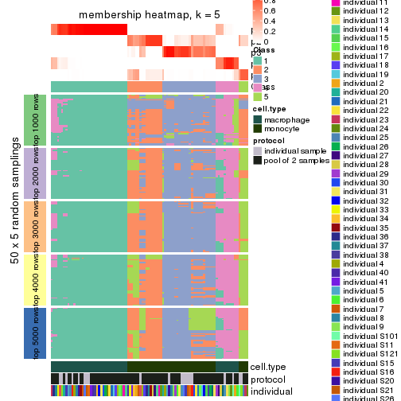</p>

</div>
<div id='tab-SD-hclust-membership-heatmap-5'>
<pre><code class="r">membership_heatmap(res, k = 6)
</code></pre>

<p></p>

</div>
</div>

As soon as we have had the classes for columns, we can look for signatures
which are significantly different between classes which can be candidate marks
for certain classes. Following are the heatmaps for signatures.


Signature heatmaps where rows are scaled:


<script>
$( function() {
	$( '#tabs-SD-hclust-get-signatures' ).tabs();
} );
</script>
<div id='tabs-SD-hclust-get-signatures'>
<ul>
<li><a href='#tab-SD-hclust-get-signatures-1'>k = 2</a></li>
<li><a href='#tab-SD-hclust-get-signatures-2'>k = 3</a></li>
<li><a href='#tab-SD-hclust-get-signatures-3'>k = 4</a></li>
<li><a href='#tab-SD-hclust-get-signatures-4'>k = 5</a></li>
<li><a href='#tab-SD-hclust-get-signatures-5'>k = 6</a></li>
</ul>
<div id='tab-SD-hclust-get-signatures-1'>
<pre><code class="r">get_signatures(res, k = 2)
</code></pre>

<p></p>

</div>
<div id='tab-SD-hclust-get-signatures-2'>
<pre><code class="r">get_signatures(res, k = 3)
</code></pre>

<p></p>

</div>
<div id='tab-SD-hclust-get-signatures-3'>
<pre><code class="r">get_signatures(res, k = 4)
</code></pre>

<p></p>

</div>
<div id='tab-SD-hclust-get-signatures-4'>
<pre><code class="r">get_signatures(res, k = 5)
</code></pre>

<p></p>

</div>
<div id='tab-SD-hclust-get-signatures-5'>
<pre><code class="r">get_signatures(res, k = 6)
</code></pre>

<p></p>

</div>
</div>


Signature heatmaps where rows are not scaled:


<script>
$( function() {
	$( '#tabs-SD-hclust-get-signatures-no-scale' ).tabs();
} );
</script>
<div id='tabs-SD-hclust-get-signatures-no-scale'>
<ul>
<li><a href='#tab-SD-hclust-get-signatures-no-scale-1'>k = 2</a></li>
<li><a href='#tab-SD-hclust-get-signatures-no-scale-2'>k = 3</a></li>
<li><a href='#tab-SD-hclust-get-signatures-no-scale-3'>k = 4</a></li>
<li><a href='#tab-SD-hclust-get-signatures-no-scale-4'>k = 5</a></li>
<li><a href='#tab-SD-hclust-get-signatures-no-scale-5'>k = 6</a></li>
</ul>
<div id='tab-SD-hclust-get-signatures-no-scale-1'>
<pre><code class="r">get_signatures(res, k = 2, scale_rows = FALSE)
</code></pre>

<p></p>

</div>
<div id='tab-SD-hclust-get-signatures-no-scale-2'>
<pre><code class="r">get_signatures(res, k = 3, scale_rows = FALSE)
</code></pre>

<p></p>

</div>
<div id='tab-SD-hclust-get-signatures-no-scale-3'>
<pre><code class="r">get_signatures(res, k = 4, scale_rows = FALSE)
</code></pre>

<p></p>

</div>
<div id='tab-SD-hclust-get-signatures-no-scale-4'>
<pre><code class="r">get_signatures(res, k = 5, scale_rows = FALSE)
</code></pre>

<p></p>

</div>
<div id='tab-SD-hclust-get-signatures-no-scale-5'>
<pre><code class="r">get_signatures(res, k = 6, scale_rows = FALSE)
</code></pre>

<pre><code>#&gt; Error in mat[ceiling(1:nr/h_ratio), ceiling(1:nc/w_ratio), drop = FALSE]: subscript out of bounds
</code></pre>

<p></p>

</div>
</div>


Compare the overlap of signatures from different k:

```r
compare_signatures(res)
```


`get_signature()` returns a data frame invisibly. TO get the list of signatures, the function
call should be assigned to a variable explicitly. In following code, if `plot` argument is set
to `FALSE`, no heatmap is plotted while only the differential analysis is performed.

```r
# code only for demonstration
tb = get_signature(res, k = ..., plot = FALSE)
```

An example of the output of `tb` is:

```
#>   which_row         fdr    mean_1    mean_2 scaled_mean_1 scaled_mean_2 km
#> 1        38 0.042760348  8.373488  9.131774    -0.5533452     0.5164555  1
#> 2        40 0.018707592  7.106213  8.469186    -0.6173731     0.5762149  1
#> 3        55 0.019134737 10.221463 11.207825    -0.6159697     0.5749050  1
#> 4        59 0.006059896  5.921854  7.869574    -0.6899429     0.6439467  1
#> 5        60 0.018055526  8.928898 10.211722    -0.6204761     0.5791110  1
#> 6        98 0.009384629 15.714769 14.887706     0.6635654    -0.6193277  2
...
```

The columns in `tb` are:

1. `which_row`: row indices corresponding to the input matrix.
2. `fdr`: FDR for the differential test. 
3. `mean_x`: The mean value in group x.
4. `scaled_mean_x`: The mean value in group x after rows are scaled.
5. `km`: Row groups if k-means clustering is applied to rows.


UMAP plot which shows how samples are separated.


<script>
$( function() {
	$( '#tabs-SD-hclust-dimension-reduction' ).tabs();
} );
</script>
<div id='tabs-SD-hclust-dimension-reduction'>
<ul>
<li><a href='#tab-SD-hclust-dimension-reduction-1'>k = 2</a></li>
<li><a href='#tab-SD-hclust-dimension-reduction-2'>k = 3</a></li>
<li><a href='#tab-SD-hclust-dimension-reduction-3'>k = 4</a></li>
<li><a href='#tab-SD-hclust-dimension-reduction-4'>k = 5</a></li>
<li><a href='#tab-SD-hclust-dimension-reduction-5'>k = 6</a></li>
</ul>
<div id='tab-SD-hclust-dimension-reduction-1'>
<pre><code class="r">dimension_reduction(res, k = 2, method = &quot;UMAP&quot;)
</code></pre>

<p></p>

</div>
<div id='tab-SD-hclust-dimension-reduction-2'>
<pre><code class="r">dimension_reduction(res, k = 3, method = &quot;UMAP&quot;)
</code></pre>

<p></p>

</div>
<div id='tab-SD-hclust-dimension-reduction-3'>
<pre><code class="r">dimension_reduction(res, k = 4, method = &quot;UMAP&quot;)
</code></pre>

<p></p>

</div>
<div id='tab-SD-hclust-dimension-reduction-4'>
<pre><code class="r">dimension_reduction(res, k = 5, method = &quot;UMAP&quot;)
</code></pre>

<p></p>

</div>
<div id='tab-SD-hclust-dimension-reduction-5'>
<pre><code class="r">dimension_reduction(res, k = 6, method = &quot;UMAP&quot;)
</code></pre>

<p></p>

</div>
</div>


Following heatmap shows how subgroups are split when increasing `k`:

```r
collect_classes(res)
```


Test correlation between subgroups and known annotations. If the known
annotation is numeric, one-way ANOVA test is applied, and if the known
annotation is discrete, chi-squared contingency table test is applied.

```r
test_to_known_factors(res)
```

```
#>            n cell.type(p) protocol(p) individual(p) k
#> SD:hclust 96     8.49e-22       1.000         1.000 2
#> SD:hclust 91     1.74e-20       0.898         1.000 3
#> SD:hclust 87     9.66e-19       0.538         0.994 4
#> SD:hclust 80     1.74e-16       0.593         0.873 5
#> SD:hclust 80     1.74e-16       0.605         0.929 6
```


If matrix rows can be associated to genes, consider to use `functional_enrichment(res,
...)` to perform function enrichment for the signature genes. See [this vignette](http://bioconductor.org/packages/devel/bioc/vignettes/cola/inst/doc/functional_enrichment.html) for more detailed explanations.


 

---------------------------------------------------


### SD:kmeans**


The object with results only for a single top-value method and a single partition method 
can be extracted as:

```r
res = res_list["SD", "kmeans"]
# you can also extract it by
# res = res_list["SD:kmeans"]
```

A summary of `res` and all the functions that can be applied to it:

```r
res
```

```
#> A 'ConsensusPartition' object with k = 2, 3, 4, 5, 6.
#>   On a matrix with 25171 rows and 96 columns.
#>   Top rows (1000, 2000, 3000, 4000, 5000) are extracted by 'SD' method.
#>   Subgroups are detected by 'kmeans' method.
#>   Performed in total 1250 partitions by row resampling.
#>   Best k for subgroups seems to be 2.
#> 
#> Following methods can be applied to this 'ConsensusPartition' object:
#>  [1] "cola_report"             "collect_classes"         "collect_plots"          
#>  [4] "collect_stats"           "colnames"                "compare_signatures"     
#>  [7] "consensus_heatmap"       "dimension_reduction"     "functional_enrichment"  
#> [10] "get_anno_col"            "get_anno"                "get_classes"            
#> [13] "get_consensus"           "get_matrix"              "get_membership"         
#> [16] "get_param"               "get_signatures"          "get_stats"              
#> [19] "is_best_k"               "is_stable_k"             "membership_heatmap"     
#> [22] "ncol"                    "nrow"                    "plot_ecdf"              
#> [25] "rownames"                "select_partition_number" "show"                   
#> [28] "suggest_best_k"          "test_to_known_factors"
```

`collect_plots()` function collects all the plots made from `res` for all `k` (number of partitions)
into one single page to provide an easy and fast comparison between different `k`.

```r
collect_plots(res)
```


The plots are:

- The first row: a plot of the ECDF (empirical cumulative distribution
  function) curves of the consensus matrix for each `k` and the heatmap of
  predicted classes for each `k`.
- The second row: heatmaps of the consensus matrix for each `k`.
- The third row: heatmaps of the membership matrix for each `k`.
- The fouth row: heatmaps of the signatures for each `k`.

All the plots in panels can be made by individual functions and they are
plotted later in this section.

`select_partition_number()` produces several plots showing different
statistics for choosing "optimized" `k`. There are following statistics:

- ECDF curves of the consensus matrix for each `k`;
- 1-PAC. [The PAC
  score](https://en.wikipedia.org/wiki/Consensus_clustering#Over-interpretation_potential_of_consensus_clustering)
  measures the proportion of the ambiguous subgrouping.
- Mean silhouette score.
- Concordance. The mean probability of fiting the consensus class ids in all
  partitions.
- Area increased. Denote $A_k$ as the area under the ECDF curve for current
  `k`, the area increased is defined as $A_k - A_{k-1}$.
- Rand index. The percent of pairs of samples that are both in a same cluster
  or both are not in a same cluster in the partition of k and k-1.
- Jaccard index. The ratio of pairs of samples are both in a same cluster in
  the partition of k and k-1 and the pairs of samples are both in a same
  cluster in the partition k or k-1.

The detailed explanations of these statistics can be found in [the _cola_
vignette](http://bioconductor.org/packages/devel/bioc/vignettes/cola/inst/doc/cola.html#toc_13).

Generally speaking, lower PAC score, higher mean silhouette score or higher
concordance corresponds to better partition. Rand index and Jaccard index
measure how similar the current partition is compared to partition with `k-1`.
If they are too similar, we won't accept `k` is better than `k-1`.

```r
select_partition_number(res)
```


The numeric values for all these statistics can be obtained by `get_stats()`.

```r
get_stats(res)
```

```
#>   k 1-PAC mean_silhouette concordance area_increased  Rand Jaccard
#> 2 2 1.000           1.000       1.000         0.5058 0.495   0.495
#> 3 3 0.695           0.875       0.809         0.2362 0.874   0.745
#> 4 4 0.616           0.688       0.658         0.1114 0.864   0.642
#> 5 5 0.586           0.654       0.737         0.0782 0.870   0.571
#> 6 6 0.583           0.584       0.707         0.0551 0.937   0.738
```

`suggest_best_k()` suggests the best $k$ based on these statistics. The rules are as follows:

- All $k$ with Jaccard index larger than 0.95 are removed because increasing
  $k$ does not provide enough extra information. If all $k$ are removed, it is
  marked as no subgroup is detected.
- For all $k$ with 1-PAC score larger than 0.9, the maximal $k$ is taken as
  the best $k$, and other $k$ are marked as optional $k$.
- If it does not fit the second rule. The $k$ with the maximal vote of the
  highest 1-PAC score, highest mean silhouette, and highest concordance is
  taken as the best $k$.

```r
suggest_best_k(res)
```

```
#> [1] 2
```


Following shows the table of the partitions (You need to click the **show/hide
code output** link to see it). The membership matrix (columns with name `p*`)
is inferred by
[`clue::cl_consensus()`](https://www.rdocumentation.org/link/cl_consensus?package=clue)
function with the `SE` method. Basically the value in the membership matrix
represents the probability to belong to a certain group. The finall class
label for an item is determined with the group with highest probability it
belongs to.

In `get_classes()` function, the entropy is calculated from the membership
matrix and the silhouette score is calculated from the consensus matrix.


<script>
$( function() {
	$( '#tabs-SD-kmeans-get-classes' ).tabs();
} );
</script>
<div id='tabs-SD-kmeans-get-classes'>
<ul>
<li><a href='#tab-SD-kmeans-get-classes-1'>k = 2</a></li>
<li><a href='#tab-SD-kmeans-get-classes-2'>k = 3</a></li>
<li><a href='#tab-SD-kmeans-get-classes-3'>k = 4</a></li>
<li><a href='#tab-SD-kmeans-get-classes-4'>k = 5</a></li>
<li><a href='#tab-SD-kmeans-get-classes-5'>k = 6</a></li>
</ul>

<div id='tab-SD-kmeans-get-classes-1'>
<p><a id='tab-SD-kmeans-get-classes-1-a' style='color:#0366d6' href='#'>show/hide code output</a></p>
<pre><code class="r">cbind(get_classes(res, k = 2), get_membership(res, k = 2))
</code></pre>

<pre><code>#&gt;           class entropy silhouette p1 p2
#&gt; GSM257886     1       0          1  1  0
#&gt; GSM257888     1       0          1  1  0
#&gt; GSM257890     1       0          1  1  0
#&gt; GSM257892     1       0          1  1  0
#&gt; GSM257894     1       0          1  1  0
#&gt; GSM257896     1       0          1  1  0
#&gt; GSM257898     1       0          1  1  0
#&gt; GSM257900     1       0          1  1  0
#&gt; GSM257902     1       0          1  1  0
#&gt; GSM257904     1       0          1  1  0
#&gt; GSM257906     1       0          1  1  0
#&gt; GSM257908     1       0          1  1  0
#&gt; GSM257910     1       0          1  1  0
#&gt; GSM257912     1       0          1  1  0
#&gt; GSM257914     1       0          1  1  0
#&gt; GSM257917     1       0          1  1  0
#&gt; GSM257919     1       0          1  1  0
#&gt; GSM257921     1       0          1  1  0
#&gt; GSM257923     1       0          1  1  0
#&gt; GSM257925     1       0          1  1  0
#&gt; GSM257927     1       0          1  1  0
#&gt; GSM257929     1       0          1  1  0
#&gt; GSM257937     1       0          1  1  0
#&gt; GSM257939     1       0          1  1  0
#&gt; GSM257941     1       0          1  1  0
#&gt; GSM257943     1       0          1  1  0
#&gt; GSM257945     1       0          1  1  0
#&gt; GSM257947     1       0          1  1  0
#&gt; GSM257949     1       0          1  1  0
#&gt; GSM257951     1       0          1  1  0
#&gt; GSM257953     1       0          1  1  0
#&gt; GSM257955     1       0          1  1  0
#&gt; GSM257958     1       0          1  1  0
#&gt; GSM257960     1       0          1  1  0
#&gt; GSM257962     1       0          1  1  0
#&gt; GSM257964     1       0          1  1  0
#&gt; GSM257966     1       0          1  1  0
#&gt; GSM257968     1       0          1  1  0
#&gt; GSM257970     1       0          1  1  0
#&gt; GSM257972     1       0          1  1  0
#&gt; GSM257977     1       0          1  1  0
#&gt; GSM257982     1       0          1  1  0
#&gt; GSM257984     1       0          1  1  0
#&gt; GSM257986     1       0          1  1  0
#&gt; GSM257990     1       0          1  1  0
#&gt; GSM257992     1       0          1  1  0
#&gt; GSM257996     1       0          1  1  0
#&gt; GSM258006     1       0          1  1  0
#&gt; GSM257887     2       0          1  0  1
#&gt; GSM257889     2       0          1  0  1
#&gt; GSM257891     2       0          1  0  1
#&gt; GSM257893     2       0          1  0  1
#&gt; GSM257895     2       0          1  0  1
#&gt; GSM257897     2       0          1  0  1
#&gt; GSM257899     2       0          1  0  1
#&gt; GSM257901     2       0          1  0  1
#&gt; GSM257903     2       0          1  0  1
#&gt; GSM257905     2       0          1  0  1
#&gt; GSM257907     2       0          1  0  1
#&gt; GSM257909     2       0          1  0  1
#&gt; GSM257911     2       0          1  0  1
#&gt; GSM257913     2       0          1  0  1
#&gt; GSM257916     2       0          1  0  1
#&gt; GSM257918     2       0          1  0  1
#&gt; GSM257920     2       0          1  0  1
#&gt; GSM257922     2       0          1  0  1
#&gt; GSM257924     2       0          1  0  1
#&gt; GSM257926     2       0          1  0  1
#&gt; GSM257928     2       0          1  0  1
#&gt; GSM257930     2       0          1  0  1
#&gt; GSM257938     2       0          1  0  1
#&gt; GSM257940     2       0          1  0  1
#&gt; GSM257942     2       0          1  0  1
#&gt; GSM257944     2       0          1  0  1
#&gt; GSM257946     2       0          1  0  1
#&gt; GSM257948     2       0          1  0  1
#&gt; GSM257950     2       0          1  0  1
#&gt; GSM257952     2       0          1  0  1
#&gt; GSM257954     2       0          1  0  1
#&gt; GSM257956     2       0          1  0  1
#&gt; GSM257959     2       0          1  0  1
#&gt; GSM257961     2       0          1  0  1
#&gt; GSM257963     2       0          1  0  1
#&gt; GSM257965     2       0          1  0  1
#&gt; GSM257967     2       0          1  0  1
#&gt; GSM257969     2       0          1  0  1
#&gt; GSM257971     2       0          1  0  1
#&gt; GSM257973     2       0          1  0  1
#&gt; GSM257981     2       0          1  0  1
#&gt; GSM257983     2       0          1  0  1
#&gt; GSM257985     2       0          1  0  1
#&gt; GSM257988     2       0          1  0  1
#&gt; GSM257991     2       0          1  0  1
#&gt; GSM257993     2       0          1  0  1
#&gt; GSM257994     2       0          1  0  1
#&gt; GSM257989     2       0          1  0  1
</code></pre>

<script>
$('#tab-SD-kmeans-get-classes-1-a').parent().next().next().hide();
$('#tab-SD-kmeans-get-classes-1-a').click(function(){
  $('#tab-SD-kmeans-get-classes-1-a').parent().next().next().toggle();
  return(false);
});
</script>
</div>

<div id='tab-SD-kmeans-get-classes-2'>
<p><a id='tab-SD-kmeans-get-classes-2-a' style='color:#0366d6' href='#'>show/hide code output</a></p>
<pre><code class="r">cbind(get_classes(res, k = 3), get_membership(res, k = 3))
</code></pre>

<pre><code>#&gt;           class entropy silhouette    p1    p2    p3
#&gt; GSM257886     1  0.6126      0.818 0.600 0.400 0.000
#&gt; GSM257888     1  0.4504      0.870 0.804 0.196 0.000
#&gt; GSM257890     1  0.5785      0.848 0.668 0.332 0.000
#&gt; GSM257892     1  0.6126      0.818 0.600 0.400 0.000
#&gt; GSM257894     1  0.4121      0.874 0.832 0.168 0.000
#&gt; GSM257896     1  0.4974      0.871 0.764 0.236 0.000
#&gt; GSM257898     1  0.5138      0.854 0.748 0.252 0.000
#&gt; GSM257900     1  0.4121      0.878 0.832 0.168 0.000
#&gt; GSM257902     1  0.0000      0.897 1.000 0.000 0.000
#&gt; GSM257904     1  0.5560      0.850 0.700 0.300 0.000
#&gt; GSM257906     1  0.5560      0.850 0.700 0.300 0.000
#&gt; GSM257908     1  0.3879      0.877 0.848 0.152 0.000
#&gt; GSM257910     1  0.3879      0.877 0.848 0.152 0.000
#&gt; GSM257912     1  0.5216      0.871 0.740 0.260 0.000
#&gt; GSM257914     1  0.5216      0.871 0.740 0.260 0.000
#&gt; GSM257917     1  0.5254      0.871 0.736 0.264 0.000
#&gt; GSM257919     1  0.5216      0.871 0.740 0.260 0.000
#&gt; GSM257921     1  0.4178      0.894 0.828 0.172 0.000
#&gt; GSM257923     1  0.0000      0.897 1.000 0.000 0.000
#&gt; GSM257925     1  0.0237      0.897 0.996 0.004 0.000
#&gt; GSM257927     1  0.3686      0.885 0.860 0.140 0.000
#&gt; GSM257929     1  0.0237      0.897 0.996 0.004 0.000
#&gt; GSM257937     1  0.5327      0.867 0.728 0.272 0.000
#&gt; GSM257939     1  0.0000      0.897 1.000 0.000 0.000
#&gt; GSM257941     1  0.4002      0.879 0.840 0.160 0.000
#&gt; GSM257943     1  0.4750      0.859 0.784 0.216 0.000
#&gt; GSM257945     1  0.4235      0.874 0.824 0.176 0.000
#&gt; GSM257947     1  0.0000      0.897 1.000 0.000 0.000
#&gt; GSM257949     1  0.0000      0.897 1.000 0.000 0.000
#&gt; GSM257951     1  0.0000      0.897 1.000 0.000 0.000
#&gt; GSM257953     1  0.0237      0.897 0.996 0.004 0.000
#&gt; GSM257955     1  0.0000      0.897 1.000 0.000 0.000
#&gt; GSM257958     1  0.0237      0.897 0.996 0.004 0.000
#&gt; GSM257960     1  0.4002      0.880 0.840 0.160 0.000
#&gt; GSM257962     1  0.3686      0.885 0.860 0.140 0.000
#&gt; GSM257964     1  0.0000      0.897 1.000 0.000 0.000
#&gt; GSM257966     1  0.4452      0.871 0.808 0.192 0.000
#&gt; GSM257968     1  0.3340      0.884 0.880 0.120 0.000
#&gt; GSM257970     1  0.0000      0.897 1.000 0.000 0.000
#&gt; GSM257972     1  0.0000      0.897 1.000 0.000 0.000
#&gt; GSM257977     1  0.5178      0.869 0.744 0.256 0.000
#&gt; GSM257982     1  0.4235      0.873 0.824 0.176 0.000
#&gt; GSM257984     1  0.0000      0.897 1.000 0.000 0.000
#&gt; GSM257986     1  0.0000      0.897 1.000 0.000 0.000
#&gt; GSM257990     1  0.0424      0.897 0.992 0.008 0.000
#&gt; GSM257992     1  0.5138      0.854 0.748 0.252 0.000
#&gt; GSM257996     1  0.2711      0.895 0.912 0.088 0.000
#&gt; GSM258006     1  0.5621      0.848 0.692 0.308 0.000
#&gt; GSM257887     2  0.6140      0.969 0.000 0.596 0.404
#&gt; GSM257889     3  0.0747      0.910 0.000 0.016 0.984
#&gt; GSM257891     3  0.0424      0.915 0.000 0.008 0.992
#&gt; GSM257893     3  0.1163      0.900 0.000 0.028 0.972
#&gt; GSM257895     2  0.6140      0.969 0.000 0.596 0.404
#&gt; GSM257897     3  0.1163      0.900 0.000 0.028 0.972
#&gt; GSM257899     3  0.1163      0.900 0.000 0.028 0.972
#&gt; GSM257901     3  0.0000      0.918 0.000 0.000 1.000
#&gt; GSM257903     2  0.6225      0.974 0.000 0.568 0.432
#&gt; GSM257905     2  0.6225      0.974 0.000 0.568 0.432
#&gt; GSM257907     3  0.0000      0.918 0.000 0.000 1.000
#&gt; GSM257909     2  0.6225      0.974 0.000 0.568 0.432
#&gt; GSM257911     3  0.0000      0.918 0.000 0.000 1.000
#&gt; GSM257913     3  0.0000      0.918 0.000 0.000 1.000
#&gt; GSM257916     2  0.6225      0.974 0.000 0.568 0.432
#&gt; GSM257918     2  0.6225      0.974 0.000 0.568 0.432
#&gt; GSM257920     3  0.0000      0.918 0.000 0.000 1.000
#&gt; GSM257922     3  0.1163      0.900 0.000 0.028 0.972
#&gt; GSM257924     3  0.1411      0.881 0.000 0.036 0.964
#&gt; GSM257926     3  0.0000      0.918 0.000 0.000 1.000
#&gt; GSM257928     2  0.6140      0.969 0.000 0.596 0.404
#&gt; GSM257930     2  0.6140      0.969 0.000 0.596 0.404
#&gt; GSM257938     2  0.6140      0.969 0.000 0.596 0.404
#&gt; GSM257940     3  0.0000      0.918 0.000 0.000 1.000
#&gt; GSM257942     2  0.6225      0.974 0.000 0.568 0.432
#&gt; GSM257944     2  0.6225      0.974 0.000 0.568 0.432
#&gt; GSM257946     3  0.0424      0.915 0.000 0.008 0.992
#&gt; GSM257948     3  0.0000      0.918 0.000 0.000 1.000
#&gt; GSM257950     3  0.0000      0.918 0.000 0.000 1.000
#&gt; GSM257952     3  0.6274     -0.731 0.000 0.456 0.544
#&gt; GSM257954     2  0.6140      0.969 0.000 0.596 0.404
#&gt; GSM257956     2  0.6140      0.969 0.000 0.596 0.404
#&gt; GSM257959     2  0.6225      0.974 0.000 0.568 0.432
#&gt; GSM257961     2  0.6215      0.974 0.000 0.572 0.428
#&gt; GSM257963     2  0.6215      0.974 0.000 0.572 0.428
#&gt; GSM257965     2  0.6235      0.969 0.000 0.564 0.436
#&gt; GSM257967     2  0.6225      0.974 0.000 0.568 0.432
#&gt; GSM257969     2  0.6140      0.969 0.000 0.596 0.404
#&gt; GSM257971     3  0.1163      0.900 0.000 0.028 0.972
#&gt; GSM257973     3  0.0000      0.918 0.000 0.000 1.000
#&gt; GSM257981     3  0.6260     -0.719 0.000 0.448 0.552
#&gt; GSM257983     3  0.0000      0.918 0.000 0.000 1.000
#&gt; GSM257985     3  0.0424      0.915 0.000 0.008 0.992
#&gt; GSM257988     3  0.0000      0.918 0.000 0.000 1.000
#&gt; GSM257991     2  0.6280      0.930 0.000 0.540 0.460
#&gt; GSM257993     2  0.6140      0.969 0.000 0.596 0.404
#&gt; GSM257994     2  0.6140      0.969 0.000 0.596 0.404
#&gt; GSM257989     3  0.0000      0.918 0.000 0.000 1.000
</code></pre>

<script>
$('#tab-SD-kmeans-get-classes-2-a').parent().next().next().hide();
$('#tab-SD-kmeans-get-classes-2-a').click(function(){
  $('#tab-SD-kmeans-get-classes-2-a').parent().next().next().toggle();
  return(false);
});
</script>
</div>

<div id='tab-SD-kmeans-get-classes-3'>
<p><a id='tab-SD-kmeans-get-classes-3-a' style='color:#0366d6' href='#'>show/hide code output</a></p>
<pre><code class="r">cbind(get_classes(res, k = 4), get_membership(res, k = 4))
</code></pre>

<pre><code>#&gt;           class entropy silhouette    p1    p2    p3    p4
#&gt; GSM257886     1  0.6523     0.4481 0.628 0.000 0.236 0.136
#&gt; GSM257888     1  0.2675     0.4157 0.892 0.000 0.008 0.100
#&gt; GSM257890     1  0.2060     0.4974 0.932 0.000 0.016 0.052
#&gt; GSM257892     1  0.6523     0.4481 0.628 0.000 0.236 0.136
#&gt; GSM257894     1  0.3196     0.3532 0.856 0.000 0.008 0.136
#&gt; GSM257896     1  0.2048     0.4579 0.928 0.000 0.008 0.064
#&gt; GSM257898     1  0.7753     0.3138 0.432 0.000 0.256 0.312
#&gt; GSM257900     1  0.7081    -0.0834 0.452 0.000 0.124 0.424
#&gt; GSM257902     4  0.4961     0.9890 0.448 0.000 0.000 0.552
#&gt; GSM257904     1  0.7478     0.3950 0.504 0.000 0.256 0.240
#&gt; GSM257906     1  0.7476     0.3953 0.504 0.000 0.260 0.236
#&gt; GSM257908     1  0.3694     0.3809 0.844 0.000 0.032 0.124
#&gt; GSM257910     1  0.3694     0.3809 0.844 0.000 0.032 0.124
#&gt; GSM257912     1  0.1929     0.4871 0.940 0.000 0.036 0.024
#&gt; GSM257914     1  0.1929     0.4871 0.940 0.000 0.036 0.024
#&gt; GSM257917     1  0.2227     0.4903 0.928 0.000 0.036 0.036
#&gt; GSM257919     1  0.1929     0.4871 0.940 0.000 0.036 0.024
#&gt; GSM257921     1  0.3725     0.3101 0.812 0.000 0.008 0.180
#&gt; GSM257923     4  0.4961     0.9890 0.448 0.000 0.000 0.552
#&gt; GSM257925     4  0.4955     0.9829 0.444 0.000 0.000 0.556
#&gt; GSM257927     1  0.7030    -0.1788 0.472 0.000 0.120 0.408
#&gt; GSM257929     4  0.4955     0.9829 0.444 0.000 0.000 0.556
#&gt; GSM257937     1  0.0804     0.4919 0.980 0.000 0.008 0.012
#&gt; GSM257939     4  0.4961     0.9890 0.448 0.000 0.000 0.552
#&gt; GSM257941     1  0.7113    -0.1077 0.456 0.000 0.128 0.416
#&gt; GSM257943     1  0.7806     0.2562 0.392 0.000 0.252 0.356
#&gt; GSM257945     1  0.7188    -0.0305 0.432 0.000 0.136 0.432
#&gt; GSM257947     4  0.4961     0.9890 0.448 0.000 0.000 0.552
#&gt; GSM257949     4  0.4961     0.9890 0.448 0.000 0.000 0.552
#&gt; GSM257951     4  0.4961     0.9890 0.448 0.000 0.000 0.552
#&gt; GSM257953     4  0.4961     0.9890 0.448 0.000 0.000 0.552
#&gt; GSM257955     4  0.4961     0.9890 0.448 0.000 0.000 0.552
#&gt; GSM257958     4  0.4955     0.9829 0.444 0.000 0.000 0.556
#&gt; GSM257960     1  0.7110    -0.1183 0.460 0.000 0.128 0.412
#&gt; GSM257962     1  0.7030    -0.1788 0.472 0.000 0.120 0.408
#&gt; GSM257964     4  0.4961     0.9890 0.448 0.000 0.000 0.552
#&gt; GSM257966     1  0.3056     0.4398 0.888 0.000 0.040 0.072
#&gt; GSM257968     1  0.4699    -0.2259 0.676 0.000 0.004 0.320
#&gt; GSM257970     4  0.4961     0.9890 0.448 0.000 0.000 0.552
#&gt; GSM257972     4  0.4961     0.9890 0.448 0.000 0.000 0.552
#&gt; GSM257977     1  0.1452     0.4800 0.956 0.000 0.008 0.036
#&gt; GSM257982     1  0.3032     0.3697 0.868 0.000 0.008 0.124
#&gt; GSM257984     4  0.4961     0.9890 0.448 0.000 0.000 0.552
#&gt; GSM257986     4  0.4961     0.9890 0.448 0.000 0.000 0.552
#&gt; GSM257990     4  0.5821     0.8454 0.432 0.000 0.032 0.536
#&gt; GSM257992     1  0.7758     0.3145 0.432 0.000 0.260 0.308
#&gt; GSM257996     1  0.5837    -0.5439 0.564 0.000 0.036 0.400
#&gt; GSM258006     1  0.7371     0.4074 0.520 0.000 0.268 0.212
#&gt; GSM257887     2  0.3166     0.8511 0.000 0.868 0.016 0.116
#&gt; GSM257889     3  0.4746     0.9339 0.000 0.304 0.688 0.008
#&gt; GSM257891     3  0.4792     0.9373 0.000 0.312 0.680 0.008
#&gt; GSM257893     3  0.5161     0.9225 0.000 0.300 0.676 0.024
#&gt; GSM257895     2  0.3647     0.8361 0.000 0.832 0.016 0.152
#&gt; GSM257897     3  0.4844     0.9297 0.000 0.300 0.688 0.012
#&gt; GSM257899     3  0.5161     0.9240 0.000 0.300 0.676 0.024
#&gt; GSM257901     3  0.6746     0.8931 0.000 0.316 0.568 0.116
#&gt; GSM257903     2  0.0817     0.8647 0.000 0.976 0.000 0.024
#&gt; GSM257905     2  0.0000     0.8707 0.000 1.000 0.000 0.000
#&gt; GSM257907     3  0.6746     0.8931 0.000 0.316 0.568 0.116
#&gt; GSM257909     2  0.0000     0.8707 0.000 1.000 0.000 0.000
#&gt; GSM257911     3  0.6778     0.8760 0.000 0.336 0.552 0.112
#&gt; GSM257913     3  0.6123     0.9121 0.000 0.336 0.600 0.064
#&gt; GSM257916     2  0.0817     0.8647 0.000 0.976 0.000 0.024
#&gt; GSM257918     2  0.0817     0.8647 0.000 0.976 0.000 0.024
#&gt; GSM257920     3  0.5917     0.9272 0.000 0.320 0.624 0.056
#&gt; GSM257922     3  0.5814     0.8965 0.000 0.300 0.644 0.056
#&gt; GSM257924     3  0.4624     0.9257 0.000 0.340 0.660 0.000
#&gt; GSM257926     3  0.4677     0.9390 0.000 0.316 0.680 0.004
#&gt; GSM257928     2  0.5160     0.7688 0.000 0.748 0.072 0.180
#&gt; GSM257930     2  0.4035     0.8195 0.000 0.804 0.020 0.176
#&gt; GSM257938     2  0.3925     0.8219 0.000 0.808 0.016 0.176
#&gt; GSM257940     3  0.6700     0.8934 0.000 0.316 0.572 0.112
#&gt; GSM257942     2  0.0817     0.8647 0.000 0.976 0.000 0.024
#&gt; GSM257944     2  0.0817     0.8647 0.000 0.976 0.000 0.024
#&gt; GSM257946     3  0.4477     0.9383 0.000 0.312 0.688 0.000
#&gt; GSM257948     3  0.5917     0.9272 0.000 0.320 0.624 0.056
#&gt; GSM257950     3  0.5152     0.9389 0.000 0.316 0.664 0.020
#&gt; GSM257952     2  0.6147     0.3599 0.000 0.664 0.224 0.112
#&gt; GSM257954     2  0.3280     0.8483 0.000 0.860 0.016 0.124
#&gt; GSM257956     2  0.2987     0.8548 0.000 0.880 0.016 0.104
#&gt; GSM257959     2  0.0000     0.8707 0.000 1.000 0.000 0.000
#&gt; GSM257961     2  0.0000     0.8707 0.000 1.000 0.000 0.000
#&gt; GSM257963     2  0.0000     0.8707 0.000 1.000 0.000 0.000
#&gt; GSM257965     2  0.3464     0.7770 0.000 0.860 0.032 0.108
#&gt; GSM257967     2  0.0000     0.8707 0.000 1.000 0.000 0.000
#&gt; GSM257969     2  0.2593     0.8602 0.000 0.904 0.016 0.080
#&gt; GSM257971     3  0.6425     0.8852 0.000 0.300 0.604 0.096
#&gt; GSM257973     3  0.5517     0.9358 0.000 0.316 0.648 0.036
#&gt; GSM257981     2  0.6064     0.3755 0.000 0.672 0.220 0.108
#&gt; GSM257983     3  0.4814     0.9381 0.000 0.316 0.676 0.008
#&gt; GSM257985     3  0.4792     0.9373 0.000 0.312 0.680 0.008
#&gt; GSM257988     3  0.5754     0.9317 0.000 0.316 0.636 0.048
#&gt; GSM257991     2  0.3219     0.7762 0.000 0.868 0.020 0.112
#&gt; GSM257993     2  0.3443     0.8437 0.000 0.848 0.016 0.136
#&gt; GSM257994     2  0.3925     0.8219 0.000 0.808 0.016 0.176
#&gt; GSM257989     3  0.5047     0.9392 0.000 0.316 0.668 0.016
</code></pre>

<script>
$('#tab-SD-kmeans-get-classes-3-a').parent().next().next().hide();
$('#tab-SD-kmeans-get-classes-3-a').click(function(){
  $('#tab-SD-kmeans-get-classes-3-a').parent().next().next().toggle();
  return(false);
});
</script>
</div>

<div id='tab-SD-kmeans-get-classes-4'>
<p><a id='tab-SD-kmeans-get-classes-4-a' style='color:#0366d6' href='#'>show/hide code output</a></p>
<pre><code class="r">cbind(get_classes(res, k = 5), get_membership(res, k = 5))
</code></pre>

<pre><code>#&gt;           class entropy silhouette    p1    p2    p3    p4    p5
#&gt; GSM257886     5  0.7308    0.61530 0.156 0.112 0.000 0.184 0.548
#&gt; GSM257888     4  0.6956    0.75641 0.392 0.120 0.000 0.444 0.044
#&gt; GSM257890     4  0.7793    0.65861 0.228 0.132 0.000 0.476 0.164
#&gt; GSM257892     5  0.7308    0.61530 0.156 0.112 0.000 0.184 0.548
#&gt; GSM257894     1  0.6464   -0.72488 0.444 0.116 0.000 0.424 0.016
#&gt; GSM257896     4  0.7150    0.77944 0.372 0.120 0.000 0.448 0.060
#&gt; GSM257898     5  0.5184    0.79569 0.280 0.044 0.000 0.016 0.660
#&gt; GSM257900     1  0.4533    0.00123 0.544 0.000 0.000 0.008 0.448
#&gt; GSM257902     1  0.0162    0.70432 0.996 0.004 0.000 0.000 0.000
#&gt; GSM257904     5  0.5757    0.82798 0.232 0.044 0.000 0.064 0.660
#&gt; GSM257906     5  0.5823    0.82829 0.232 0.048 0.000 0.064 0.656
#&gt; GSM257908     4  0.4225    0.81796 0.364 0.000 0.000 0.632 0.004
#&gt; GSM257910     4  0.4225    0.81796 0.364 0.000 0.000 0.632 0.004
#&gt; GSM257912     4  0.5104    0.82958 0.308 0.000 0.000 0.632 0.060
#&gt; GSM257914     4  0.5104    0.82958 0.308 0.000 0.000 0.632 0.060
#&gt; GSM257917     4  0.5285    0.80227 0.288 0.000 0.000 0.632 0.080
#&gt; GSM257919     4  0.5104    0.82958 0.308 0.000 0.000 0.632 0.060
#&gt; GSM257921     1  0.6555   -0.24893 0.460 0.000 0.000 0.320 0.220
#&gt; GSM257923     1  0.0000    0.70424 1.000 0.000 0.000 0.000 0.000
#&gt; GSM257925     1  0.0794    0.70022 0.972 0.000 0.000 0.000 0.028
#&gt; GSM257927     1  0.4510    0.05804 0.560 0.000 0.000 0.008 0.432
#&gt; GSM257929     1  0.0794    0.70022 0.972 0.000 0.000 0.000 0.028
#&gt; GSM257937     4  0.7386    0.79467 0.304 0.112 0.000 0.484 0.100
#&gt; GSM257939     1  0.0000    0.70424 1.000 0.000 0.000 0.000 0.000
#&gt; GSM257941     1  0.4533    0.00123 0.544 0.000 0.000 0.008 0.448
#&gt; GSM257943     5  0.3932    0.66058 0.328 0.000 0.000 0.000 0.672
#&gt; GSM257945     1  0.4302   -0.11779 0.520 0.000 0.000 0.000 0.480
#&gt; GSM257947     1  0.0000    0.70424 1.000 0.000 0.000 0.000 0.000
#&gt; GSM257949     1  0.0162    0.70267 0.996 0.004 0.000 0.000 0.000
#&gt; GSM257951     1  0.0162    0.70432 0.996 0.004 0.000 0.000 0.000
#&gt; GSM257953     1  0.0404    0.70399 0.988 0.000 0.000 0.000 0.012
#&gt; GSM257955     1  0.0162    0.70432 0.996 0.004 0.000 0.000 0.000
#&gt; GSM257958     1  0.0794    0.70022 0.972 0.000 0.000 0.000 0.028
#&gt; GSM257960     1  0.4533    0.00123 0.544 0.000 0.000 0.008 0.448
#&gt; GSM257962     1  0.4510    0.05804 0.560 0.000 0.000 0.008 0.432
#&gt; GSM257964     1  0.0000    0.70424 1.000 0.000 0.000 0.000 0.000
#&gt; GSM257966     4  0.5243    0.83168 0.352 0.048 0.000 0.596 0.004
#&gt; GSM257968     1  0.4967    0.16779 0.732 0.080 0.000 0.172 0.016
#&gt; GSM257970     1  0.0162    0.70432 0.996 0.004 0.000 0.000 0.000
#&gt; GSM257972     1  0.0912    0.69863 0.972 0.016 0.000 0.000 0.012
#&gt; GSM257977     4  0.7311    0.78468 0.352 0.120 0.000 0.452 0.076
#&gt; GSM257982     1  0.6934   -0.74119 0.424 0.116 0.000 0.416 0.044
#&gt; GSM257984     1  0.0162    0.70267 0.996 0.004 0.000 0.000 0.000
#&gt; GSM257986     1  0.0162    0.70267 0.996 0.004 0.000 0.000 0.000
#&gt; GSM257990     1  0.2719    0.62308 0.852 0.000 0.000 0.004 0.144
#&gt; GSM257992     5  0.5548    0.80092 0.280 0.056 0.000 0.024 0.640
#&gt; GSM257996     1  0.4681    0.43056 0.696 0.000 0.000 0.052 0.252
#&gt; GSM258006     5  0.6344    0.79930 0.216 0.076 0.000 0.080 0.628
#&gt; GSM257887     2  0.4263    0.78113 0.000 0.760 0.180 0.000 0.060
#&gt; GSM257889     3  0.3019    0.83460 0.000 0.016 0.880 0.056 0.048
#&gt; GSM257891     3  0.2153    0.85037 0.000 0.000 0.916 0.044 0.040
#&gt; GSM257893     3  0.3110    0.82593 0.000 0.020 0.876 0.060 0.044
#&gt; GSM257895     2  0.5322    0.75768 0.000 0.708 0.180 0.024 0.088
#&gt; GSM257897     3  0.3255    0.83168 0.000 0.020 0.868 0.056 0.056
#&gt; GSM257899     3  0.3388    0.82669 0.000 0.020 0.860 0.064 0.056
#&gt; GSM257901     3  0.3804    0.78491 0.000 0.000 0.796 0.044 0.160
#&gt; GSM257903     2  0.6181    0.81007 0.000 0.576 0.200 0.220 0.004
#&gt; GSM257905     2  0.5904    0.81743 0.000 0.600 0.200 0.200 0.000
#&gt; GSM257907     3  0.3804    0.78491 0.000 0.000 0.796 0.044 0.160
#&gt; GSM257909     2  0.5931    0.81655 0.000 0.596 0.200 0.204 0.000
#&gt; GSM257911     3  0.3911    0.77161 0.000 0.000 0.796 0.060 0.144
#&gt; GSM257913     3  0.2522    0.82990 0.000 0.000 0.896 0.052 0.052
#&gt; GSM257916     2  0.6181    0.81007 0.000 0.576 0.200 0.220 0.004
#&gt; GSM257918     2  0.6181    0.81007 0.000 0.576 0.200 0.220 0.004
#&gt; GSM257920     3  0.2067    0.84055 0.000 0.000 0.920 0.032 0.048
#&gt; GSM257922     3  0.3375    0.81669 0.000 0.020 0.860 0.072 0.048
#&gt; GSM257924     3  0.2745    0.83618 0.000 0.028 0.896 0.052 0.024
#&gt; GSM257926     3  0.0992    0.85573 0.000 0.000 0.968 0.024 0.008
#&gt; GSM257928     2  0.6645    0.66393 0.000 0.600 0.220 0.072 0.108
#&gt; GSM257930     2  0.6041    0.73104 0.000 0.664 0.180 0.056 0.100
#&gt; GSM257938     2  0.5866    0.74019 0.000 0.676 0.180 0.048 0.096
#&gt; GSM257940     3  0.3565    0.78461 0.000 0.000 0.816 0.040 0.144
#&gt; GSM257942     2  0.6181    0.81007 0.000 0.576 0.200 0.220 0.004
#&gt; GSM257944     2  0.6181    0.81007 0.000 0.576 0.200 0.220 0.004
#&gt; GSM257946     3  0.1018    0.85446 0.000 0.000 0.968 0.016 0.016
#&gt; GSM257948     3  0.2067    0.84055 0.000 0.000 0.920 0.032 0.048
#&gt; GSM257950     3  0.0162    0.85543 0.000 0.000 0.996 0.004 0.000
#&gt; GSM257952     3  0.7268   -0.10663 0.000 0.328 0.460 0.052 0.160
#&gt; GSM257954     2  0.4661    0.77542 0.000 0.744 0.180 0.008 0.068
#&gt; GSM257956     2  0.4199    0.78228 0.000 0.764 0.180 0.000 0.056
#&gt; GSM257959     2  0.5904    0.81743 0.000 0.600 0.200 0.200 0.000
#&gt; GSM257961     2  0.5904    0.81743 0.000 0.600 0.200 0.200 0.000
#&gt; GSM257963     2  0.5904    0.81743 0.000 0.600 0.200 0.200 0.000
#&gt; GSM257965     2  0.7719    0.63122 0.000 0.468 0.268 0.124 0.140
#&gt; GSM257967     2  0.5877    0.81770 0.000 0.604 0.200 0.196 0.000
#&gt; GSM257969     2  0.5379    0.79443 0.000 0.712 0.180 0.052 0.056
#&gt; GSM257971     3  0.4853    0.78536 0.000 0.020 0.748 0.076 0.156
#&gt; GSM257973     3  0.1012    0.85238 0.000 0.000 0.968 0.012 0.020
#&gt; GSM257981     3  0.7029   -0.11226 0.000 0.336 0.476 0.040 0.148
#&gt; GSM257983     3  0.2077    0.85129 0.000 0.000 0.920 0.040 0.040
#&gt; GSM257985     3  0.1582    0.85434 0.000 0.000 0.944 0.028 0.028
#&gt; GSM257988     3  0.1281    0.85184 0.000 0.000 0.956 0.012 0.032
#&gt; GSM257991     2  0.7843    0.60217 0.000 0.440 0.288 0.140 0.132
#&gt; GSM257993     2  0.4719    0.77388 0.000 0.740 0.180 0.008 0.072
#&gt; GSM257994     2  0.5866    0.74019 0.000 0.676 0.180 0.048 0.096
#&gt; GSM257989     3  0.0324    0.85578 0.000 0.000 0.992 0.004 0.004
</code></pre>

<script>
$('#tab-SD-kmeans-get-classes-4-a').parent().next().next().hide();
$('#tab-SD-kmeans-get-classes-4-a').click(function(){
  $('#tab-SD-kmeans-get-classes-4-a').parent().next().next().toggle();
  return(false);
});
</script>
</div>

<div id='tab-SD-kmeans-get-classes-5'>
<p><a id='tab-SD-kmeans-get-classes-5-a' style='color:#0366d6' href='#'>show/hide code output</a></p>
<pre><code class="r">cbind(get_classes(res, k = 6), get_membership(res, k = 6))
</code></pre>

<pre><code>#&gt;           class entropy silhouette    p1    p2    p3    p4    p5    p6
#&gt; GSM257886     6  0.7523     0.3640 0.092 0.088 0.000 0.128 0.180 0.512
#&gt; GSM257888     4  0.6552     0.7456 0.280 0.000 0.000 0.452 0.232 0.036
#&gt; GSM257890     4  0.6851     0.6955 0.136 0.000 0.000 0.492 0.244 0.128
#&gt; GSM257892     6  0.7523     0.3640 0.092 0.088 0.000 0.128 0.180 0.512
#&gt; GSM257894     4  0.6431     0.7095 0.328 0.004 0.000 0.428 0.224 0.016
#&gt; GSM257896     4  0.6802     0.7535 0.248 0.000 0.000 0.456 0.232 0.064
#&gt; GSM257898     6  0.5295     0.6190 0.172 0.036 0.000 0.020 0.076 0.696
#&gt; GSM257900     6  0.4141     0.4796 0.432 0.000 0.000 0.012 0.000 0.556
#&gt; GSM257902     1  0.0291     0.8893 0.992 0.004 0.000 0.000 0.004 0.000
#&gt; GSM257904     6  0.5563     0.5984 0.140 0.036 0.000 0.052 0.076 0.696
#&gt; GSM257906     6  0.5920     0.5911 0.140 0.060 0.000 0.052 0.076 0.672
#&gt; GSM257908     4  0.3323     0.7536 0.240 0.000 0.000 0.752 0.000 0.008
#&gt; GSM257910     4  0.3323     0.7536 0.240 0.000 0.000 0.752 0.000 0.008
#&gt; GSM257912     4  0.3874     0.7499 0.172 0.000 0.000 0.760 0.000 0.068
#&gt; GSM257914     4  0.3874     0.7499 0.172 0.000 0.000 0.760 0.000 0.068
#&gt; GSM257917     4  0.3928     0.7358 0.160 0.000 0.000 0.760 0.000 0.080
#&gt; GSM257919     4  0.3874     0.7499 0.172 0.000 0.000 0.760 0.000 0.068
#&gt; GSM257921     6  0.6129     0.0314 0.336 0.000 0.000 0.320 0.000 0.344
#&gt; GSM257923     1  0.0000     0.8883 1.000 0.000 0.000 0.000 0.000 0.000
#&gt; GSM257925     1  0.1327     0.8505 0.936 0.000 0.000 0.000 0.000 0.064
#&gt; GSM257927     6  0.4175     0.4216 0.464 0.000 0.000 0.012 0.000 0.524
#&gt; GSM257929     1  0.1327     0.8505 0.936 0.000 0.000 0.000 0.000 0.064
#&gt; GSM257937     4  0.6781     0.7477 0.180 0.000 0.000 0.496 0.232 0.092
#&gt; GSM257939     1  0.0000     0.8883 1.000 0.000 0.000 0.000 0.000 0.000
#&gt; GSM257941     6  0.4147     0.4760 0.436 0.000 0.000 0.012 0.000 0.552
#&gt; GSM257943     6  0.2964     0.6319 0.204 0.000 0.000 0.004 0.000 0.792
#&gt; GSM257945     6  0.4158     0.5006 0.416 0.004 0.000 0.008 0.000 0.572
#&gt; GSM257947     1  0.0000     0.8883 1.000 0.000 0.000 0.000 0.000 0.000
#&gt; GSM257949     1  0.0291     0.8893 0.992 0.004 0.000 0.000 0.004 0.000
#&gt; GSM257951     1  0.0291     0.8893 0.992 0.004 0.000 0.000 0.004 0.000
#&gt; GSM257953     1  0.0937     0.8684 0.960 0.000 0.000 0.000 0.000 0.040
#&gt; GSM257955     1  0.0291     0.8893 0.992 0.004 0.000 0.000 0.004 0.000
#&gt; GSM257958     1  0.1327     0.8505 0.936 0.000 0.000 0.000 0.000 0.064
#&gt; GSM257960     6  0.4141     0.4822 0.432 0.000 0.000 0.012 0.000 0.556
#&gt; GSM257962     6  0.4175     0.4216 0.464 0.000 0.000 0.012 0.000 0.524
#&gt; GSM257964     1  0.0291     0.8893 0.992 0.004 0.000 0.000 0.004 0.000
#&gt; GSM257966     4  0.4763     0.7832 0.220 0.000 0.000 0.680 0.092 0.008
#&gt; GSM257968     1  0.5231     0.2564 0.668 0.004 0.000 0.152 0.160 0.016
#&gt; GSM257970     1  0.0291     0.8893 0.992 0.004 0.000 0.000 0.004 0.000
#&gt; GSM257972     1  0.1937     0.8537 0.924 0.004 0.000 0.004 0.032 0.036
#&gt; GSM257977     4  0.6802     0.7529 0.236 0.000 0.000 0.464 0.232 0.068
#&gt; GSM257982     4  0.6663     0.7272 0.304 0.004 0.000 0.432 0.228 0.032
#&gt; GSM257984     1  0.0291     0.8893 0.992 0.004 0.000 0.000 0.004 0.000
#&gt; GSM257986     1  0.0291     0.8893 0.992 0.004 0.000 0.000 0.004 0.000
#&gt; GSM257990     1  0.3668     0.4850 0.728 0.008 0.000 0.008 0.000 0.256
#&gt; GSM257992     6  0.5965     0.6085 0.172 0.064 0.000 0.024 0.092 0.648
#&gt; GSM257996     1  0.4845    -0.1035 0.560 0.008 0.000 0.044 0.000 0.388
#&gt; GSM258006     6  0.6829     0.5129 0.124 0.084 0.000 0.072 0.124 0.596
#&gt; GSM257887     2  0.7155     0.5097 0.000 0.528 0.108 0.148 0.184 0.032
#&gt; GSM257889     3  0.3777     0.6860 0.000 0.008 0.812 0.012 0.088 0.080
#&gt; GSM257891     3  0.3039     0.7029 0.000 0.000 0.852 0.008 0.056 0.084
#&gt; GSM257893     3  0.3672     0.6771 0.000 0.012 0.820 0.012 0.104 0.052
#&gt; GSM257895     2  0.7562     0.4595 0.000 0.444 0.108 0.164 0.252 0.032
#&gt; GSM257897     3  0.4023     0.6712 0.000 0.012 0.796 0.012 0.096 0.084
#&gt; GSM257899     3  0.4070     0.6652 0.000 0.012 0.792 0.012 0.100 0.084
#&gt; GSM257901     3  0.3547     0.4269 0.000 0.004 0.696 0.000 0.300 0.000
#&gt; GSM257903     2  0.2696     0.5800 0.000 0.856 0.116 0.000 0.028 0.000
#&gt; GSM257905     2  0.2003     0.6004 0.000 0.884 0.116 0.000 0.000 0.000
#&gt; GSM257907     3  0.3584     0.4266 0.000 0.004 0.688 0.000 0.308 0.000
#&gt; GSM257909     2  0.2146     0.5983 0.000 0.880 0.116 0.000 0.004 0.000
#&gt; GSM257911     3  0.4302     0.3407 0.000 0.036 0.668 0.000 0.292 0.004
#&gt; GSM257913     3  0.3183     0.6210 0.000 0.040 0.828 0.000 0.128 0.004
#&gt; GSM257916     2  0.3185     0.5768 0.000 0.832 0.116 0.000 0.048 0.004
#&gt; GSM257918     2  0.2985     0.5777 0.000 0.844 0.116 0.000 0.036 0.004
#&gt; GSM257920     3  0.2544     0.6650 0.000 0.012 0.864 0.000 0.120 0.004
#&gt; GSM257922     3  0.4831     0.5819 0.000 0.012 0.744 0.040 0.116 0.088
#&gt; GSM257924     3  0.3001     0.6860 0.000 0.048 0.868 0.004 0.060 0.020
#&gt; GSM257926     3  0.1974     0.7225 0.000 0.012 0.920 0.000 0.048 0.020
#&gt; GSM257928     2  0.8518     0.2447 0.000 0.284 0.160 0.204 0.276 0.076
#&gt; GSM257930     2  0.8150     0.3955 0.000 0.372 0.108 0.200 0.252 0.068
#&gt; GSM257938     2  0.8141     0.4004 0.000 0.376 0.108 0.200 0.248 0.068
#&gt; GSM257940     3  0.3626     0.4243 0.000 0.004 0.704 0.000 0.288 0.004
#&gt; GSM257942     2  0.2771     0.5777 0.000 0.852 0.116 0.000 0.032 0.000
#&gt; GSM257944     2  0.2771     0.5777 0.000 0.852 0.116 0.000 0.032 0.000
#&gt; GSM257946     3  0.1261     0.7246 0.000 0.000 0.952 0.000 0.024 0.024
#&gt; GSM257948     3  0.2566     0.6625 0.000 0.012 0.868 0.000 0.112 0.008
#&gt; GSM257950     3  0.0862     0.7208 0.000 0.004 0.972 0.000 0.016 0.008
#&gt; GSM257952     5  0.6075     0.0000 0.000 0.268 0.360 0.000 0.372 0.000
#&gt; GSM257954     2  0.7407     0.4885 0.000 0.484 0.108 0.164 0.212 0.032
#&gt; GSM257956     2  0.7108     0.5069 0.000 0.528 0.108 0.144 0.192 0.028
#&gt; GSM257959     2  0.2003     0.6004 0.000 0.884 0.116 0.000 0.000 0.000
#&gt; GSM257961     2  0.2003     0.6004 0.000 0.884 0.116 0.000 0.000 0.000
#&gt; GSM257963     2  0.2003     0.6004 0.000 0.884 0.116 0.000 0.000 0.000
#&gt; GSM257965     2  0.5912    -0.3763 0.000 0.472 0.192 0.000 0.332 0.004
#&gt; GSM257967     2  0.2257     0.5998 0.000 0.876 0.116 0.000 0.008 0.000
#&gt; GSM257969     2  0.6561     0.5276 0.000 0.600 0.108 0.104 0.160 0.028
#&gt; GSM257971     3  0.5012     0.5154 0.000 0.012 0.652 0.008 0.264 0.064
#&gt; GSM257973     3  0.1296     0.7114 0.000 0.004 0.948 0.000 0.044 0.004
#&gt; GSM257981     3  0.6285    -0.9485 0.000 0.272 0.388 0.000 0.332 0.008
#&gt; GSM257983     3  0.2762     0.7141 0.000 0.004 0.876 0.008 0.040 0.072
#&gt; GSM257985     3  0.1700     0.7242 0.000 0.000 0.928 0.000 0.024 0.048
#&gt; GSM257988     3  0.1787     0.6989 0.000 0.004 0.920 0.000 0.068 0.008
#&gt; GSM257991     2  0.5756    -0.2070 0.000 0.544 0.180 0.000 0.268 0.008
#&gt; GSM257993     2  0.7407     0.4885 0.000 0.484 0.108 0.164 0.212 0.032
#&gt; GSM257994     2  0.8141     0.4004 0.000 0.376 0.108 0.200 0.248 0.068
#&gt; GSM257989     3  0.0653     0.7239 0.000 0.004 0.980 0.000 0.004 0.012
</code></pre>

<script>
$('#tab-SD-kmeans-get-classes-5-a').parent().next().next().hide();
$('#tab-SD-kmeans-get-classes-5-a').click(function(){
  $('#tab-SD-kmeans-get-classes-5-a').parent().next().next().toggle();
  return(false);
});
</script>
</div>
</div>

Heatmaps for the consensus matrix. It visualizes the probability of two
samples to be in a same group.


<script>
$( function() {
	$( '#tabs-SD-kmeans-consensus-heatmap' ).tabs();
} );
</script>
<div id='tabs-SD-kmeans-consensus-heatmap'>
<ul>
<li><a href='#tab-SD-kmeans-consensus-heatmap-1'>k = 2</a></li>
<li><a href='#tab-SD-kmeans-consensus-heatmap-2'>k = 3</a></li>
<li><a href='#tab-SD-kmeans-consensus-heatmap-3'>k = 4</a></li>
<li><a href='#tab-SD-kmeans-consensus-heatmap-4'>k = 5</a></li>
<li><a href='#tab-SD-kmeans-consensus-heatmap-5'>k = 6</a></li>
</ul>
<div id='tab-SD-kmeans-consensus-heatmap-1'>
<pre><code class="r">consensus_heatmap(res, k = 2)
</code></pre>

<p></p>

</div>
<div id='tab-SD-kmeans-consensus-heatmap-2'>
<pre><code class="r">consensus_heatmap(res, k = 3)
</code></pre>

<p></p>

</div>
<div id='tab-SD-kmeans-consensus-heatmap-3'>
<pre><code class="r">consensus_heatmap(res, k = 4)
</code></pre>

<p></p>

</div>
<div id='tab-SD-kmeans-consensus-heatmap-4'>
<pre><code class="r">consensus_heatmap(res, k = 5)
</code></pre>

<p></p>

</div>
<div id='tab-SD-kmeans-consensus-heatmap-5'>
<pre><code class="r">consensus_heatmap(res, k = 6)
</code></pre>

<p></p>

</div>
</div>

Heatmaps for the membership of samples in all partitions to see how consistent they are:


<script>
$( function() {
	$( '#tabs-SD-kmeans-membership-heatmap' ).tabs();
} );
</script>
<div id='tabs-SD-kmeans-membership-heatmap'>
<ul>
<li><a href='#tab-SD-kmeans-membership-heatmap-1'>k = 2</a></li>
<li><a href='#tab-SD-kmeans-membership-heatmap-2'>k = 3</a></li>
<li><a href='#tab-SD-kmeans-membership-heatmap-3'>k = 4</a></li>
<li><a href='#tab-SD-kmeans-membership-heatmap-4'>k = 5</a></li>
<li><a href='#tab-SD-kmeans-membership-heatmap-5'>k = 6</a></li>
</ul>
<div id='tab-SD-kmeans-membership-heatmap-1'>
<pre><code class="r">membership_heatmap(res, k = 2)
</code></pre>

<p></p>

</div>
<div id='tab-SD-kmeans-membership-heatmap-2'>
<pre><code class="r">membership_heatmap(res, k = 3)
</code></pre>

<p></p>

</div>
<div id='tab-SD-kmeans-membership-heatmap-3'>
<pre><code class="r">membership_heatmap(res, k = 4)
</code></pre>

<p></p>

</div>
<div id='tab-SD-kmeans-membership-heatmap-4'>
<pre><code class="r">membership_heatmap(res, k = 5)
</code></pre>

<p></p>

</div>
<div id='tab-SD-kmeans-membership-heatmap-5'>
<pre><code class="r">membership_heatmap(res, k = 6)
</code></pre>

<p></p>

</div>
</div>

As soon as we have had the classes for columns, we can look for signatures
which are significantly different between classes which can be candidate marks
for certain classes. Following are the heatmaps for signatures.


Signature heatmaps where rows are scaled:


<script>
$( function() {
	$( '#tabs-SD-kmeans-get-signatures' ).tabs();
} );
</script>
<div id='tabs-SD-kmeans-get-signatures'>
<ul>
<li><a href='#tab-SD-kmeans-get-signatures-1'>k = 2</a></li>
<li><a href='#tab-SD-kmeans-get-signatures-2'>k = 3</a></li>
<li><a href='#tab-SD-kmeans-get-signatures-3'>k = 4</a></li>
<li><a href='#tab-SD-kmeans-get-signatures-4'>k = 5</a></li>
<li><a href='#tab-SD-kmeans-get-signatures-5'>k = 6</a></li>
</ul>
<div id='tab-SD-kmeans-get-signatures-1'>
<pre><code class="r">get_signatures(res, k = 2)
</code></pre>

<p></p>

</div>
<div id='tab-SD-kmeans-get-signatures-2'>
<pre><code class="r">get_signatures(res, k = 3)
</code></pre>

<p></p>

</div>
<div id='tab-SD-kmeans-get-signatures-3'>
<pre><code class="r">get_signatures(res, k = 4)
</code></pre>

<p></p>

</div>
<div id='tab-SD-kmeans-get-signatures-4'>
<pre><code class="r">get_signatures(res, k = 5)
</code></pre>

<p>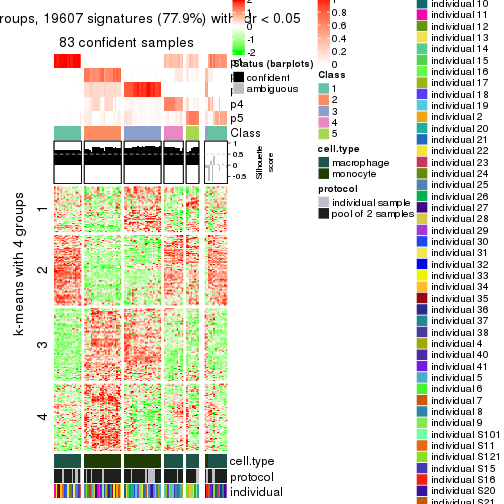</p>

</div>
<div id='tab-SD-kmeans-get-signatures-5'>
<pre><code class="r">get_signatures(res, k = 6)
</code></pre>

<p></p>

</div>
</div>


Signature heatmaps where rows are not scaled:


<script>
$( function() {
	$( '#tabs-SD-kmeans-get-signatures-no-scale' ).tabs();
} );
</script>
<div id='tabs-SD-kmeans-get-signatures-no-scale'>
<ul>
<li><a href='#tab-SD-kmeans-get-signatures-no-scale-1'>k = 2</a></li>
<li><a href='#tab-SD-kmeans-get-signatures-no-scale-2'>k = 3</a></li>
<li><a href='#tab-SD-kmeans-get-signatures-no-scale-3'>k = 4</a></li>
<li><a href='#tab-SD-kmeans-get-signatures-no-scale-4'>k = 5</a></li>
<li><a href='#tab-SD-kmeans-get-signatures-no-scale-5'>k = 6</a></li>
</ul>
<div id='tab-SD-kmeans-get-signatures-no-scale-1'>
<pre><code class="r">get_signatures(res, k = 2, scale_rows = FALSE)
</code></pre>

<p></p>

</div>
<div id='tab-SD-kmeans-get-signatures-no-scale-2'>
<pre><code class="r">get_signatures(res, k = 3, scale_rows = FALSE)
</code></pre>

<p></p>

</div>
<div id='tab-SD-kmeans-get-signatures-no-scale-3'>
<pre><code class="r">get_signatures(res, k = 4, scale_rows = FALSE)
</code></pre>

<p></p>

</div>
<div id='tab-SD-kmeans-get-signatures-no-scale-4'>
<pre><code class="r">get_signatures(res, k = 5, scale_rows = FALSE)
</code></pre>

<p></p>

</div>
<div id='tab-SD-kmeans-get-signatures-no-scale-5'>
<pre><code class="r">get_signatures(res, k = 6, scale_rows = FALSE)
</code></pre>

<p></p>

</div>
</div>


Compare the overlap of signatures from different k:

```r
compare_signatures(res)
```


`get_signature()` returns a data frame invisibly. TO get the list of signatures, the function
call should be assigned to a variable explicitly. In following code, if `plot` argument is set
to `FALSE`, no heatmap is plotted while only the differential analysis is performed.

```r
# code only for demonstration
tb = get_signature(res, k = ..., plot = FALSE)
```

An example of the output of `tb` is:

```
#>   which_row         fdr    mean_1    mean_2 scaled_mean_1 scaled_mean_2 km
#> 1        38 0.042760348  8.373488  9.131774    -0.5533452     0.5164555  1
#> 2        40 0.018707592  7.106213  8.469186    -0.6173731     0.5762149  1
#> 3        55 0.019134737 10.221463 11.207825    -0.6159697     0.5749050  1
#> 4        59 0.006059896  5.921854  7.869574    -0.6899429     0.6439467  1
#> 5        60 0.018055526  8.928898 10.211722    -0.6204761     0.5791110  1
#> 6        98 0.009384629 15.714769 14.887706     0.6635654    -0.6193277  2
...
```

The columns in `tb` are:

1. `which_row`: row indices corresponding to the input matrix.
2. `fdr`: FDR for the differential test. 
3. `mean_x`: The mean value in group x.
4. `scaled_mean_x`: The mean value in group x after rows are scaled.
5. `km`: Row groups if k-means clustering is applied to rows.


UMAP plot which shows how samples are separated.


<script>
$( function() {
	$( '#tabs-SD-kmeans-dimension-reduction' ).tabs();
} );
</script>
<div id='tabs-SD-kmeans-dimension-reduction'>
<ul>
<li><a href='#tab-SD-kmeans-dimension-reduction-1'>k = 2</a></li>
<li><a href='#tab-SD-kmeans-dimension-reduction-2'>k = 3</a></li>
<li><a href='#tab-SD-kmeans-dimension-reduction-3'>k = 4</a></li>
<li><a href='#tab-SD-kmeans-dimension-reduction-4'>k = 5</a></li>
<li><a href='#tab-SD-kmeans-dimension-reduction-5'>k = 6</a></li>
</ul>
<div id='tab-SD-kmeans-dimension-reduction-1'>
<pre><code class="r">dimension_reduction(res, k = 2, method = &quot;UMAP&quot;)
</code></pre>

<p></p>

</div>
<div id='tab-SD-kmeans-dimension-reduction-2'>
<pre><code class="r">dimension_reduction(res, k = 3, method = &quot;UMAP&quot;)
</code></pre>

<p></p>

</div>
<div id='tab-SD-kmeans-dimension-reduction-3'>
<pre><code class="r">dimension_reduction(res, k = 4, method = &quot;UMAP&quot;)
</code></pre>

<p></p>

</div>
<div id='tab-SD-kmeans-dimension-reduction-4'>
<pre><code class="r">dimension_reduction(res, k = 5, method = &quot;UMAP&quot;)
</code></pre>

<p></p>

</div>
<div id='tab-SD-kmeans-dimension-reduction-5'>
<pre><code class="r">dimension_reduction(res, k = 6, method = &quot;UMAP&quot;)
</code></pre>

<p></p>

</div>
</div>


Following heatmap shows how subgroups are split when increasing `k`:

```r
collect_classes(res)
```


Test correlation between subgroups and known annotations. If the known
annotation is numeric, one-way ANOVA test is applied, and if the known
annotation is discrete, chi-squared contingency table test is applied.

```r
test_to_known_factors(res)
```

```
#>            n cell.type(p) protocol(p) individual(p) k
#> SD:kmeans 96     8.49e-22       1.000         1.000 2
#> SD:kmeans 94     3.87e-21       0.539         1.000 3
#> SD:kmeans 63     2.09e-14       0.401         0.909 4
#> SD:kmeans 83     4.03e-17       0.518         0.980 5
#> SD:kmeans 70     2.27e-14       0.203         0.860 6
```


If matrix rows can be associated to genes, consider to use `functional_enrichment(res,
...)` to perform function enrichment for the signature genes. See [this vignette](http://bioconductor.org/packages/devel/bioc/vignettes/cola/inst/doc/functional_enrichment.html) for more detailed explanations.


 

---------------------------------------------------


### SD:skmeans*


The object with results only for a single top-value method and a single partition method 
can be extracted as:

```r
res = res_list["SD", "skmeans"]
# you can also extract it by
# res = res_list["SD:skmeans"]
```

A summary of `res` and all the functions that can be applied to it:

```r
res
```

```
#> A 'ConsensusPartition' object with k = 2, 3, 4, 5, 6.
#>   On a matrix with 25171 rows and 96 columns.
#>   Top rows (1000, 2000, 3000, 4000, 5000) are extracted by 'SD' method.
#>   Subgroups are detected by 'skmeans' method.
#>   Performed in total 1250 partitions by row resampling.
#>   Best k for subgroups seems to be 5.
#> 
#> Following methods can be applied to this 'ConsensusPartition' object:
#>  [1] "cola_report"             "collect_classes"         "collect_plots"          
#>  [4] "collect_stats"           "colnames"                "compare_signatures"     
#>  [7] "consensus_heatmap"       "dimension_reduction"     "functional_enrichment"  
#> [10] "get_anno_col"            "get_anno"                "get_classes"            
#> [13] "get_consensus"           "get_matrix"              "get_membership"         
#> [16] "get_param"               "get_signatures"          "get_stats"              
#> [19] "is_best_k"               "is_stable_k"             "membership_heatmap"     
#> [22] "ncol"                    "nrow"                    "plot_ecdf"              
#> [25] "rownames"                "select_partition_number" "show"                   
#> [28] "suggest_best_k"          "test_to_known_factors"
```

`collect_plots()` function collects all the plots made from `res` for all `k` (number of partitions)
into one single page to provide an easy and fast comparison between different `k`.

```r
collect_plots(res)
```


The plots are:

- The first row: a plot of the ECDF (empirical cumulative distribution
  function) curves of the consensus matrix for each `k` and the heatmap of
  predicted classes for each `k`.
- The second row: heatmaps of the consensus matrix for each `k`.
- The third row: heatmaps of the membership matrix for each `k`.
- The fouth row: heatmaps of the signatures for each `k`.

All the plots in panels can be made by individual functions and they are
plotted later in this section.

`select_partition_number()` produces several plots showing different
statistics for choosing "optimized" `k`. There are following statistics:

- ECDF curves of the consensus matrix for each `k`;
- 1-PAC. [The PAC
  score](https://en.wikipedia.org/wiki/Consensus_clustering#Over-interpretation_potential_of_consensus_clustering)
  measures the proportion of the ambiguous subgrouping.
- Mean silhouette score.
- Concordance. The mean probability of fiting the consensus class ids in all
  partitions.
- Area increased. Denote $A_k$ as the area under the ECDF curve for current
  `k`, the area increased is defined as $A_k - A_{k-1}$.
- Rand index. The percent of pairs of samples that are both in a same cluster
  or both are not in a same cluster in the partition of k and k-1.
- Jaccard index. The ratio of pairs of samples are both in a same cluster in
  the partition of k and k-1 and the pairs of samples are both in a same
  cluster in the partition k or k-1.

The detailed explanations of these statistics can be found in [the _cola_
vignette](http://bioconductor.org/packages/devel/bioc/vignettes/cola/inst/doc/cola.html#toc_13).

Generally speaking, lower PAC score, higher mean silhouette score or higher
concordance corresponds to better partition. Rand index and Jaccard index
measure how similar the current partition is compared to partition with `k-1`.
If they are too similar, we won't accept `k` is better than `k-1`.

```r
select_partition_number(res)
```

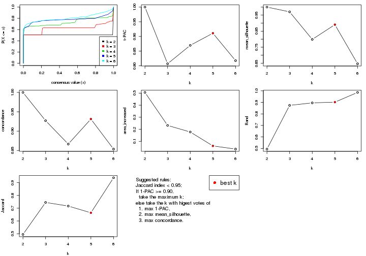

The numeric values for all these statistics can be obtained by `get_stats()`.

```r
get_stats(res)
```

```
#>   k 1-PAC mean_silhouette concordance area_increased  Rand Jaccard
#> 2 2 1.000           1.000       1.000         0.5058 0.495   0.495
#> 3 3 0.807           0.970       0.927         0.2322 0.874   0.745
#> 4 4 0.870           0.799       0.867         0.1777 0.896   0.717
#> 5 5 0.911           0.891       0.931         0.0623 0.902   0.664
#> 6 6 0.818           0.647       0.854         0.0360 0.986   0.938
```

`suggest_best_k()` suggests the best $k$ based on these statistics. The rules are as follows:

- All $k$ with Jaccard index larger than 0.95 are removed because increasing
  $k$ does not provide enough extra information. If all $k$ are removed, it is
  marked as no subgroup is detected.
- For all $k$ with 1-PAC score larger than 0.9, the maximal $k$ is taken as
  the best $k$, and other $k$ are marked as optional $k$.
- If it does not fit the second rule. The $k$ with the maximal vote of the
  highest 1-PAC score, highest mean silhouette, and highest concordance is
  taken as the best $k$.

```r
suggest_best_k(res)
```

```
#> [1] 5
#> attr(,"optional")
#> [1] 2
```

There is also optional best $k$ = 2 that is worth to check.

Following shows the table of the partitions (You need to click the **show/hide
code output** link to see it). The membership matrix (columns with name `p*`)
is inferred by
[`clue::cl_consensus()`](https://www.rdocumentation.org/link/cl_consensus?package=clue)
function with the `SE` method. Basically the value in the membership matrix
represents the probability to belong to a certain group. The finall class
label for an item is determined with the group with highest probability it
belongs to.

In `get_classes()` function, the entropy is calculated from the membership
matrix and the silhouette score is calculated from the consensus matrix.


<script>
$( function() {
	$( '#tabs-SD-skmeans-get-classes' ).tabs();
} );
</script>
<div id='tabs-SD-skmeans-get-classes'>
<ul>
<li><a href='#tab-SD-skmeans-get-classes-1'>k = 2</a></li>
<li><a href='#tab-SD-skmeans-get-classes-2'>k = 3</a></li>
<li><a href='#tab-SD-skmeans-get-classes-3'>k = 4</a></li>
<li><a href='#tab-SD-skmeans-get-classes-4'>k = 5</a></li>
<li><a href='#tab-SD-skmeans-get-classes-5'>k = 6</a></li>
</ul>

<div id='tab-SD-skmeans-get-classes-1'>
<p><a id='tab-SD-skmeans-get-classes-1-a' style='color:#0366d6' href='#'>show/hide code output</a></p>
<pre><code class="r">cbind(get_classes(res, k = 2), get_membership(res, k = 2))
</code></pre>

<pre><code>#&gt;           class entropy silhouette p1 p2
#&gt; GSM257886     1       0          1  1  0
#&gt; GSM257888     1       0          1  1  0
#&gt; GSM257890     1       0          1  1  0
#&gt; GSM257892     1       0          1  1  0
#&gt; GSM257894     1       0          1  1  0
#&gt; GSM257896     1       0          1  1  0
#&gt; GSM257898     1       0          1  1  0
#&gt; GSM257900     1       0          1  1  0
#&gt; GSM257902     1       0          1  1  0
#&gt; GSM257904     1       0          1  1  0
#&gt; GSM257906     1       0          1  1  0
#&gt; GSM257908     1       0          1  1  0
#&gt; GSM257910     1       0          1  1  0
#&gt; GSM257912     1       0          1  1  0
#&gt; GSM257914     1       0          1  1  0
#&gt; GSM257917     1       0          1  1  0
#&gt; GSM257919     1       0          1  1  0
#&gt; GSM257921     1       0          1  1  0
#&gt; GSM257923     1       0          1  1  0
#&gt; GSM257925     1       0          1  1  0
#&gt; GSM257927     1       0          1  1  0
#&gt; GSM257929     1       0          1  1  0
#&gt; GSM257937     1       0          1  1  0
#&gt; GSM257939     1       0          1  1  0
#&gt; GSM257941     1       0          1  1  0
#&gt; GSM257943     1       0          1  1  0
#&gt; GSM257945     1       0          1  1  0
#&gt; GSM257947     1       0          1  1  0
#&gt; GSM257949     1       0          1  1  0
#&gt; GSM257951     1       0          1  1  0
#&gt; GSM257953     1       0          1  1  0
#&gt; GSM257955     1       0          1  1  0
#&gt; GSM257958     1       0          1  1  0
#&gt; GSM257960     1       0          1  1  0
#&gt; GSM257962     1       0          1  1  0
#&gt; GSM257964     1       0          1  1  0
#&gt; GSM257966     1       0          1  1  0
#&gt; GSM257968     1       0          1  1  0
#&gt; GSM257970     1       0          1  1  0
#&gt; GSM257972     1       0          1  1  0
#&gt; GSM257977     1       0          1  1  0
#&gt; GSM257982     1       0          1  1  0
#&gt; GSM257984     1       0          1  1  0
#&gt; GSM257986     1       0          1  1  0
#&gt; GSM257990     1       0          1  1  0
#&gt; GSM257992     1       0          1  1  0
#&gt; GSM257996     1       0          1  1  0
#&gt; GSM258006     1       0          1  1  0
#&gt; GSM257887     2       0          1  0  1
#&gt; GSM257889     2       0          1  0  1
#&gt; GSM257891     2       0          1  0  1
#&gt; GSM257893     2       0          1  0  1
#&gt; GSM257895     2       0          1  0  1
#&gt; GSM257897     2       0          1  0  1
#&gt; GSM257899     2       0          1  0  1
#&gt; GSM257901     2       0          1  0  1
#&gt; GSM257903     2       0          1  0  1
#&gt; GSM257905     2       0          1  0  1
#&gt; GSM257907     2       0          1  0  1
#&gt; GSM257909     2       0          1  0  1
#&gt; GSM257911     2       0          1  0  1
#&gt; GSM257913     2       0          1  0  1
#&gt; GSM257916     2       0          1  0  1
#&gt; GSM257918     2       0          1  0  1
#&gt; GSM257920     2       0          1  0  1
#&gt; GSM257922     2       0          1  0  1
#&gt; GSM257924     2       0          1  0  1
#&gt; GSM257926     2       0          1  0  1
#&gt; GSM257928     2       0          1  0  1
#&gt; GSM257930     2       0          1  0  1
#&gt; GSM257938     2       0          1  0  1
#&gt; GSM257940     2       0          1  0  1
#&gt; GSM257942     2       0          1  0  1
#&gt; GSM257944     2       0          1  0  1
#&gt; GSM257946     2       0          1  0  1
#&gt; GSM257948     2       0          1  0  1
#&gt; GSM257950     2       0          1  0  1
#&gt; GSM257952     2       0          1  0  1
#&gt; GSM257954     2       0          1  0  1
#&gt; GSM257956     2       0          1  0  1
#&gt; GSM257959     2       0          1  0  1
#&gt; GSM257961     2       0          1  0  1
#&gt; GSM257963     2       0          1  0  1
#&gt; GSM257965     2       0          1  0  1
#&gt; GSM257967     2       0          1  0  1
#&gt; GSM257969     2       0          1  0  1
#&gt; GSM257971     2       0          1  0  1
#&gt; GSM257973     2       0          1  0  1
#&gt; GSM257981     2       0          1  0  1
#&gt; GSM257983     2       0          1  0  1
#&gt; GSM257985     2       0          1  0  1
#&gt; GSM257988     2       0          1  0  1
#&gt; GSM257991     2       0          1  0  1
#&gt; GSM257993     2       0          1  0  1
#&gt; GSM257994     2       0          1  0  1
#&gt; GSM257989     2       0          1  0  1
</code></pre>

<script>
$('#tab-SD-skmeans-get-classes-1-a').parent().next().next().hide();
$('#tab-SD-skmeans-get-classes-1-a').click(function(){
  $('#tab-SD-skmeans-get-classes-1-a').parent().next().next().toggle();
  return(false);
});
</script>
</div>

<div id='tab-SD-skmeans-get-classes-2'>
<p><a id='tab-SD-skmeans-get-classes-2-a' style='color:#0366d6' href='#'>show/hide code output</a></p>
<pre><code class="r">cbind(get_classes(res, k = 3), get_membership(res, k = 3))
</code></pre>

<pre><code>#&gt;           class entropy silhouette    p1    p2    p3
#&gt; GSM257886     1  0.4654      0.861 0.792 0.000 0.208
#&gt; GSM257888     1  0.0424      0.962 0.992 0.000 0.008
#&gt; GSM257890     1  0.0592      0.961 0.988 0.000 0.012
#&gt; GSM257892     1  0.4654      0.861 0.792 0.000 0.208
#&gt; GSM257894     1  0.0424      0.962 0.992 0.000 0.008
#&gt; GSM257896     1  0.0424      0.962 0.992 0.000 0.008
#&gt; GSM257898     1  0.4555      0.862 0.800 0.000 0.200
#&gt; GSM257900     1  0.2537      0.931 0.920 0.000 0.080
#&gt; GSM257902     1  0.0000      0.963 1.000 0.000 0.000
#&gt; GSM257904     1  0.4555      0.862 0.800 0.000 0.200
#&gt; GSM257906     1  0.4555      0.862 0.800 0.000 0.200
#&gt; GSM257908     1  0.0424      0.962 0.992 0.000 0.008
#&gt; GSM257910     1  0.0424      0.962 0.992 0.000 0.008
#&gt; GSM257912     1  0.0424      0.962 0.992 0.000 0.008
#&gt; GSM257914     1  0.0424      0.962 0.992 0.000 0.008
#&gt; GSM257917     1  0.0424      0.962 0.992 0.000 0.008
#&gt; GSM257919     1  0.0424      0.962 0.992 0.000 0.008
#&gt; GSM257921     1  0.0000      0.963 1.000 0.000 0.000
#&gt; GSM257923     1  0.0000      0.963 1.000 0.000 0.000
#&gt; GSM257925     1  0.0000      0.963 1.000 0.000 0.000
#&gt; GSM257927     1  0.1643      0.947 0.956 0.000 0.044
#&gt; GSM257929     1  0.0000      0.963 1.000 0.000 0.000
#&gt; GSM257937     1  0.0424      0.962 0.992 0.000 0.008
#&gt; GSM257939     1  0.0000      0.963 1.000 0.000 0.000
#&gt; GSM257941     1  0.2537      0.931 0.920 0.000 0.080
#&gt; GSM257943     1  0.4555      0.862 0.800 0.000 0.200
#&gt; GSM257945     1  0.3619      0.901 0.864 0.000 0.136
#&gt; GSM257947     1  0.0000      0.963 1.000 0.000 0.000
#&gt; GSM257949     1  0.0000      0.963 1.000 0.000 0.000
#&gt; GSM257951     1  0.0000      0.963 1.000 0.000 0.000
#&gt; GSM257953     1  0.0000      0.963 1.000 0.000 0.000
#&gt; GSM257955     1  0.0000      0.963 1.000 0.000 0.000
#&gt; GSM257958     1  0.0000      0.963 1.000 0.000 0.000
#&gt; GSM257960     1  0.2537      0.931 0.920 0.000 0.080
#&gt; GSM257962     1  0.1643      0.947 0.956 0.000 0.044
#&gt; GSM257964     1  0.0000      0.963 1.000 0.000 0.000
#&gt; GSM257966     1  0.0424      0.962 0.992 0.000 0.008
#&gt; GSM257968     1  0.0424      0.962 0.992 0.000 0.008
#&gt; GSM257970     1  0.0000      0.963 1.000 0.000 0.000
#&gt; GSM257972     1  0.0000      0.963 1.000 0.000 0.000
#&gt; GSM257977     1  0.0424      0.962 0.992 0.000 0.008
#&gt; GSM257982     1  0.0424      0.962 0.992 0.000 0.008
#&gt; GSM257984     1  0.0000      0.963 1.000 0.000 0.000
#&gt; GSM257986     1  0.0000      0.963 1.000 0.000 0.000
#&gt; GSM257990     1  0.0237      0.962 0.996 0.000 0.004
#&gt; GSM257992     1  0.4555      0.862 0.800 0.000 0.200
#&gt; GSM257996     1  0.0000      0.963 1.000 0.000 0.000
#&gt; GSM258006     1  0.4555      0.862 0.800 0.000 0.200
#&gt; GSM257887     2  0.0000      0.999 0.000 1.000 0.000
#&gt; GSM257889     3  0.4654      1.000 0.000 0.208 0.792
#&gt; GSM257891     3  0.4654      1.000 0.000 0.208 0.792
#&gt; GSM257893     3  0.4654      1.000 0.000 0.208 0.792
#&gt; GSM257895     2  0.0000      0.999 0.000 1.000 0.000
#&gt; GSM257897     3  0.4654      1.000 0.000 0.208 0.792
#&gt; GSM257899     3  0.4654      1.000 0.000 0.208 0.792
#&gt; GSM257901     3  0.4654      1.000 0.000 0.208 0.792
#&gt; GSM257903     2  0.0000      0.999 0.000 1.000 0.000
#&gt; GSM257905     2  0.0000      0.999 0.000 1.000 0.000
#&gt; GSM257907     3  0.4654      1.000 0.000 0.208 0.792
#&gt; GSM257909     2  0.0000      0.999 0.000 1.000 0.000
#&gt; GSM257911     3  0.4654      1.000 0.000 0.208 0.792
#&gt; GSM257913     3  0.4654      1.000 0.000 0.208 0.792
#&gt; GSM257916     2  0.0000      0.999 0.000 1.000 0.000
#&gt; GSM257918     2  0.0000      0.999 0.000 1.000 0.000
#&gt; GSM257920     3  0.4654      1.000 0.000 0.208 0.792
#&gt; GSM257922     3  0.4654      1.000 0.000 0.208 0.792
#&gt; GSM257924     3  0.4702      0.995 0.000 0.212 0.788
#&gt; GSM257926     3  0.4654      1.000 0.000 0.208 0.792
#&gt; GSM257928     2  0.0000      0.999 0.000 1.000 0.000
#&gt; GSM257930     2  0.0000      0.999 0.000 1.000 0.000
#&gt; GSM257938     2  0.0000      0.999 0.000 1.000 0.000
#&gt; GSM257940     3  0.4654      1.000 0.000 0.208 0.792
#&gt; GSM257942     2  0.0000      0.999 0.000 1.000 0.000
#&gt; GSM257944     2  0.0000      0.999 0.000 1.000 0.000
#&gt; GSM257946     3  0.4654      1.000 0.000 0.208 0.792
#&gt; GSM257948     3  0.4654      1.000 0.000 0.208 0.792
#&gt; GSM257950     3  0.4654      1.000 0.000 0.208 0.792
#&gt; GSM257952     2  0.0237      0.995 0.000 0.996 0.004
#&gt; GSM257954     2  0.0000      0.999 0.000 1.000 0.000
#&gt; GSM257956     2  0.0000      0.999 0.000 1.000 0.000
#&gt; GSM257959     2  0.0000      0.999 0.000 1.000 0.000
#&gt; GSM257961     2  0.0000      0.999 0.000 1.000 0.000
#&gt; GSM257963     2  0.0000      0.999 0.000 1.000 0.000
#&gt; GSM257965     2  0.0000      0.999 0.000 1.000 0.000
#&gt; GSM257967     2  0.0000      0.999 0.000 1.000 0.000
#&gt; GSM257969     2  0.0000      0.999 0.000 1.000 0.000
#&gt; GSM257971     3  0.4654      1.000 0.000 0.208 0.792
#&gt; GSM257973     3  0.4654      1.000 0.000 0.208 0.792
#&gt; GSM257981     2  0.0424      0.990 0.000 0.992 0.008
#&gt; GSM257983     3  0.4654      1.000 0.000 0.208 0.792
#&gt; GSM257985     3  0.4654      1.000 0.000 0.208 0.792
#&gt; GSM257988     3  0.4654      1.000 0.000 0.208 0.792
#&gt; GSM257991     2  0.0237      0.995 0.000 0.996 0.004
#&gt; GSM257993     2  0.0000      0.999 0.000 1.000 0.000
#&gt; GSM257994     2  0.0000      0.999 0.000 1.000 0.000
#&gt; GSM257989     3  0.4654      1.000 0.000 0.208 0.792
</code></pre>

<script>
$('#tab-SD-skmeans-get-classes-2-a').parent().next().next().hide();
$('#tab-SD-skmeans-get-classes-2-a').click(function(){
  $('#tab-SD-skmeans-get-classes-2-a').parent().next().next().toggle();
  return(false);
});
</script>
</div>

<div id='tab-SD-skmeans-get-classes-3'>
<p><a id='tab-SD-skmeans-get-classes-3-a' style='color:#0366d6' href='#'>show/hide code output</a></p>
<pre><code class="r">cbind(get_classes(res, k = 4), get_membership(res, k = 4))
</code></pre>

<pre><code>#&gt;           class entropy silhouette    p1    p2    p3    p4
#&gt; GSM257886     4  0.5220      0.320 0.424 0.000 0.008 0.568
#&gt; GSM257888     1  0.0000      0.608 1.000 0.000 0.000 0.000
#&gt; GSM257890     1  0.1557      0.545 0.944 0.000 0.000 0.056
#&gt; GSM257892     4  0.5220      0.320 0.424 0.000 0.008 0.568
#&gt; GSM257894     1  0.0000      0.608 1.000 0.000 0.000 0.000
#&gt; GSM257896     1  0.0000      0.608 1.000 0.000 0.000 0.000
#&gt; GSM257898     4  0.0672      0.750 0.008 0.000 0.008 0.984
#&gt; GSM257900     4  0.3444      0.640 0.184 0.000 0.000 0.816
#&gt; GSM257902     1  0.4916      0.601 0.576 0.000 0.000 0.424
#&gt; GSM257904     4  0.0672      0.750 0.008 0.000 0.008 0.984
#&gt; GSM257906     4  0.0672      0.750 0.008 0.000 0.008 0.984
#&gt; GSM257908     1  0.0188      0.610 0.996 0.000 0.000 0.004
#&gt; GSM257910     1  0.0188      0.610 0.996 0.000 0.000 0.004
#&gt; GSM257912     1  0.0188      0.610 0.996 0.000 0.000 0.004
#&gt; GSM257914     1  0.0188      0.610 0.996 0.000 0.000 0.004
#&gt; GSM257917     1  0.0336      0.608 0.992 0.000 0.000 0.008
#&gt; GSM257919     1  0.0188      0.610 0.996 0.000 0.000 0.004
#&gt; GSM257921     1  0.4925      0.596 0.572 0.000 0.000 0.428
#&gt; GSM257923     1  0.4916      0.601 0.576 0.000 0.000 0.424
#&gt; GSM257925     1  0.4925      0.596 0.572 0.000 0.000 0.428
#&gt; GSM257927     4  0.4072      0.496 0.252 0.000 0.000 0.748
#&gt; GSM257929     1  0.4925      0.596 0.572 0.000 0.000 0.428
#&gt; GSM257937     1  0.0000      0.608 1.000 0.000 0.000 0.000
#&gt; GSM257939     1  0.4916      0.601 0.576 0.000 0.000 0.424
#&gt; GSM257941     4  0.3356      0.650 0.176 0.000 0.000 0.824
#&gt; GSM257943     4  0.0672      0.750 0.008 0.000 0.008 0.984
#&gt; GSM257945     4  0.2647      0.698 0.120 0.000 0.000 0.880
#&gt; GSM257947     1  0.4916      0.601 0.576 0.000 0.000 0.424
#&gt; GSM257949     1  0.4916      0.601 0.576 0.000 0.000 0.424
#&gt; GSM257951     1  0.4916      0.601 0.576 0.000 0.000 0.424
#&gt; GSM257953     1  0.4925      0.596 0.572 0.000 0.000 0.428
#&gt; GSM257955     1  0.4916      0.601 0.576 0.000 0.000 0.424
#&gt; GSM257958     1  0.4925      0.596 0.572 0.000 0.000 0.428
#&gt; GSM257960     4  0.3444      0.640 0.184 0.000 0.000 0.816
#&gt; GSM257962     4  0.4072      0.496 0.252 0.000 0.000 0.748
#&gt; GSM257964     1  0.4916      0.601 0.576 0.000 0.000 0.424
#&gt; GSM257966     1  0.0000      0.608 1.000 0.000 0.000 0.000
#&gt; GSM257968     1  0.0592      0.610 0.984 0.000 0.000 0.016
#&gt; GSM257970     1  0.4916      0.601 0.576 0.000 0.000 0.424
#&gt; GSM257972     1  0.4916      0.601 0.576 0.000 0.000 0.424
#&gt; GSM257977     1  0.0000      0.608 1.000 0.000 0.000 0.000
#&gt; GSM257982     1  0.0469      0.610 0.988 0.000 0.000 0.012
#&gt; GSM257984     1  0.4916      0.601 0.576 0.000 0.000 0.424
#&gt; GSM257986     1  0.4916      0.601 0.576 0.000 0.000 0.424
#&gt; GSM257990     1  0.4998      0.460 0.512 0.000 0.000 0.488
#&gt; GSM257992     4  0.0672      0.750 0.008 0.000 0.008 0.984
#&gt; GSM257996     1  0.4933      0.590 0.568 0.000 0.000 0.432
#&gt; GSM258006     4  0.0804      0.747 0.012 0.000 0.008 0.980
#&gt; GSM257887     2  0.0188      0.992 0.000 0.996 0.000 0.004
#&gt; GSM257889     3  0.0336      0.998 0.000 0.008 0.992 0.000
#&gt; GSM257891     3  0.0336      0.998 0.000 0.008 0.992 0.000
#&gt; GSM257893     3  0.0336      0.998 0.000 0.008 0.992 0.000
#&gt; GSM257895     2  0.0336      0.991 0.000 0.992 0.000 0.008
#&gt; GSM257897     3  0.0336      0.998 0.000 0.008 0.992 0.000
#&gt; GSM257899     3  0.0336      0.998 0.000 0.008 0.992 0.000
#&gt; GSM257901     3  0.0336      0.998 0.000 0.008 0.992 0.000
#&gt; GSM257903     2  0.0000      0.992 0.000 1.000 0.000 0.000
#&gt; GSM257905     2  0.0000      0.992 0.000 1.000 0.000 0.000
#&gt; GSM257907     3  0.0336      0.998 0.000 0.008 0.992 0.000
#&gt; GSM257909     2  0.0000      0.992 0.000 1.000 0.000 0.000
#&gt; GSM257911     3  0.0592      0.991 0.000 0.016 0.984 0.000
#&gt; GSM257913     3  0.0336      0.998 0.000 0.008 0.992 0.000
#&gt; GSM257916     2  0.0000      0.992 0.000 1.000 0.000 0.000
#&gt; GSM257918     2  0.0000      0.992 0.000 1.000 0.000 0.000
#&gt; GSM257920     3  0.0336      0.998 0.000 0.008 0.992 0.000
#&gt; GSM257922     3  0.0336      0.998 0.000 0.008 0.992 0.000
#&gt; GSM257924     3  0.1211      0.964 0.000 0.040 0.960 0.000
#&gt; GSM257926     3  0.0336      0.998 0.000 0.008 0.992 0.000
#&gt; GSM257928     2  0.0336      0.991 0.000 0.992 0.000 0.008
#&gt; GSM257930     2  0.0336      0.991 0.000 0.992 0.000 0.008
#&gt; GSM257938     2  0.0336      0.991 0.000 0.992 0.000 0.008
#&gt; GSM257940     3  0.0336      0.998 0.000 0.008 0.992 0.000
#&gt; GSM257942     2  0.0000      0.992 0.000 1.000 0.000 0.000
#&gt; GSM257944     2  0.0000      0.992 0.000 1.000 0.000 0.000
#&gt; GSM257946     3  0.0336      0.998 0.000 0.008 0.992 0.000
#&gt; GSM257948     3  0.0336      0.998 0.000 0.008 0.992 0.000
#&gt; GSM257950     3  0.0336      0.998 0.000 0.008 0.992 0.000
#&gt; GSM257952     2  0.1474      0.944 0.000 0.948 0.052 0.000
#&gt; GSM257954     2  0.0336      0.991 0.000 0.992 0.000 0.008
#&gt; GSM257956     2  0.0336      0.991 0.000 0.992 0.000 0.008
#&gt; GSM257959     2  0.0000      0.992 0.000 1.000 0.000 0.000
#&gt; GSM257961     2  0.0000      0.992 0.000 1.000 0.000 0.000
#&gt; GSM257963     2  0.0000      0.992 0.000 1.000 0.000 0.000
#&gt; GSM257965     2  0.0000      0.992 0.000 1.000 0.000 0.000
#&gt; GSM257967     2  0.0000      0.992 0.000 1.000 0.000 0.000
#&gt; GSM257969     2  0.0336      0.991 0.000 0.992 0.000 0.008
#&gt; GSM257971     3  0.0336      0.998 0.000 0.008 0.992 0.000
#&gt; GSM257973     3  0.0336      0.998 0.000 0.008 0.992 0.000
#&gt; GSM257981     2  0.1637      0.935 0.000 0.940 0.060 0.000
#&gt; GSM257983     3  0.0336      0.998 0.000 0.008 0.992 0.000
#&gt; GSM257985     3  0.0336      0.998 0.000 0.008 0.992 0.000
#&gt; GSM257988     3  0.0336      0.998 0.000 0.008 0.992 0.000
#&gt; GSM257991     2  0.0188      0.990 0.000 0.996 0.004 0.000
#&gt; GSM257993     2  0.0336      0.991 0.000 0.992 0.000 0.008
#&gt; GSM257994     2  0.0336      0.991 0.000 0.992 0.000 0.008
#&gt; GSM257989     3  0.0336      0.998 0.000 0.008 0.992 0.000
</code></pre>

<script>
$('#tab-SD-skmeans-get-classes-3-a').parent().next().next().hide();
$('#tab-SD-skmeans-get-classes-3-a').click(function(){
  $('#tab-SD-skmeans-get-classes-3-a').parent().next().next().toggle();
  return(false);
});
</script>
</div>

<div id='tab-SD-skmeans-get-classes-4'>
<p><a id='tab-SD-skmeans-get-classes-4-a' style='color:#0366d6' href='#'>show/hide code output</a></p>
<pre><code class="r">cbind(get_classes(res, k = 5), get_membership(res, k = 5))
</code></pre>

<pre><code>#&gt;           class entropy silhouette    p1    p2    p3    p4    p5
#&gt; GSM257886     5  0.1792     0.8066 0.000 0.000 0.000 0.084 0.916
#&gt; GSM257888     4  0.3805     0.8654 0.184 0.000 0.000 0.784 0.032
#&gt; GSM257890     4  0.2514     0.9168 0.060 0.000 0.000 0.896 0.044
#&gt; GSM257892     5  0.1792     0.8066 0.000 0.000 0.000 0.084 0.916
#&gt; GSM257894     4  0.3910     0.8565 0.196 0.000 0.000 0.772 0.032
#&gt; GSM257896     4  0.3876     0.8610 0.192 0.000 0.000 0.776 0.032
#&gt; GSM257898     5  0.1965     0.8966 0.096 0.000 0.000 0.000 0.904
#&gt; GSM257900     1  0.3160     0.7459 0.808 0.000 0.000 0.004 0.188
#&gt; GSM257902     1  0.0162     0.8820 0.996 0.000 0.000 0.004 0.000
#&gt; GSM257904     5  0.1965     0.8966 0.096 0.000 0.000 0.000 0.904
#&gt; GSM257906     5  0.1965     0.8966 0.096 0.000 0.000 0.000 0.904
#&gt; GSM257908     4  0.1671     0.9309 0.076 0.000 0.000 0.924 0.000
#&gt; GSM257910     4  0.1671     0.9309 0.076 0.000 0.000 0.924 0.000
#&gt; GSM257912     4  0.1704     0.9297 0.068 0.000 0.000 0.928 0.004
#&gt; GSM257914     4  0.1704     0.9297 0.068 0.000 0.000 0.928 0.004
#&gt; GSM257917     4  0.1764     0.9266 0.064 0.000 0.000 0.928 0.008
#&gt; GSM257919     4  0.1704     0.9297 0.068 0.000 0.000 0.928 0.004
#&gt; GSM257921     1  0.4573     0.6023 0.700 0.000 0.000 0.256 0.044
#&gt; GSM257923     1  0.0162     0.8820 0.996 0.000 0.000 0.004 0.000
#&gt; GSM257925     1  0.0000     0.8806 1.000 0.000 0.000 0.000 0.000
#&gt; GSM257927     1  0.2848     0.7782 0.840 0.000 0.000 0.004 0.156
#&gt; GSM257929     1  0.0000     0.8806 1.000 0.000 0.000 0.000 0.000
#&gt; GSM257937     4  0.2426     0.9220 0.064 0.000 0.000 0.900 0.036
#&gt; GSM257939     1  0.0162     0.8820 0.996 0.000 0.000 0.004 0.000
#&gt; GSM257941     1  0.3160     0.7441 0.808 0.000 0.000 0.004 0.188
#&gt; GSM257943     5  0.4211     0.4670 0.360 0.000 0.000 0.004 0.636
#&gt; GSM257945     1  0.3266     0.7270 0.796 0.000 0.000 0.004 0.200
#&gt; GSM257947     1  0.0162     0.8820 0.996 0.000 0.000 0.004 0.000
#&gt; GSM257949     1  0.0162     0.8820 0.996 0.000 0.000 0.004 0.000
#&gt; GSM257951     1  0.0162     0.8820 0.996 0.000 0.000 0.004 0.000
#&gt; GSM257953     1  0.0162     0.8820 0.996 0.000 0.000 0.004 0.000
#&gt; GSM257955     1  0.0162     0.8820 0.996 0.000 0.000 0.004 0.000
#&gt; GSM257958     1  0.0000     0.8806 1.000 0.000 0.000 0.000 0.000
#&gt; GSM257960     1  0.3086     0.7544 0.816 0.000 0.000 0.004 0.180
#&gt; GSM257962     1  0.2848     0.7782 0.840 0.000 0.000 0.004 0.156
#&gt; GSM257964     1  0.0162     0.8820 0.996 0.000 0.000 0.004 0.000
#&gt; GSM257966     4  0.1671     0.9309 0.076 0.000 0.000 0.924 0.000
#&gt; GSM257968     1  0.4898     0.1275 0.592 0.000 0.000 0.376 0.032
#&gt; GSM257970     1  0.0162     0.8820 0.996 0.000 0.000 0.004 0.000
#&gt; GSM257972     1  0.0162     0.8820 0.996 0.000 0.000 0.004 0.000
#&gt; GSM257977     4  0.3841     0.8623 0.188 0.000 0.000 0.780 0.032
#&gt; GSM257982     1  0.4958     0.0309 0.568 0.000 0.000 0.400 0.032
#&gt; GSM257984     1  0.0162     0.8820 0.996 0.000 0.000 0.004 0.000
#&gt; GSM257986     1  0.0162     0.8820 0.996 0.000 0.000 0.004 0.000
#&gt; GSM257990     1  0.1357     0.8560 0.948 0.000 0.000 0.004 0.048
#&gt; GSM257992     5  0.1965     0.8966 0.096 0.000 0.000 0.000 0.904
#&gt; GSM257996     1  0.3749     0.7631 0.816 0.000 0.000 0.104 0.080
#&gt; GSM258006     5  0.1638     0.8821 0.064 0.000 0.000 0.004 0.932
#&gt; GSM257887     2  0.1281     0.9537 0.000 0.956 0.000 0.012 0.032
#&gt; GSM257889     3  0.0566     0.9823 0.000 0.000 0.984 0.012 0.004
#&gt; GSM257891     3  0.0000     0.9846 0.000 0.000 1.000 0.000 0.000
#&gt; GSM257893     3  0.1117     0.9737 0.000 0.000 0.964 0.020 0.016
#&gt; GSM257895     2  0.2359     0.9361 0.000 0.904 0.000 0.060 0.036
#&gt; GSM257897     3  0.0693     0.9812 0.000 0.000 0.980 0.012 0.008
#&gt; GSM257899     3  0.0807     0.9769 0.000 0.000 0.976 0.012 0.012
#&gt; GSM257901     3  0.0290     0.9828 0.000 0.000 0.992 0.000 0.008
#&gt; GSM257903     2  0.0000     0.9608 0.000 1.000 0.000 0.000 0.000
#&gt; GSM257905     2  0.0000     0.9608 0.000 1.000 0.000 0.000 0.000
#&gt; GSM257907     3  0.0290     0.9828 0.000 0.000 0.992 0.000 0.008
#&gt; GSM257909     2  0.0000     0.9608 0.000 1.000 0.000 0.000 0.000
#&gt; GSM257911     3  0.1557     0.9402 0.000 0.052 0.940 0.000 0.008
#&gt; GSM257913     3  0.0798     0.9763 0.000 0.016 0.976 0.008 0.000
#&gt; GSM257916     2  0.0000     0.9608 0.000 1.000 0.000 0.000 0.000
#&gt; GSM257918     2  0.0000     0.9608 0.000 1.000 0.000 0.000 0.000
#&gt; GSM257920     3  0.0290     0.9837 0.000 0.000 0.992 0.008 0.000
#&gt; GSM257922     3  0.1310     0.9646 0.000 0.000 0.956 0.024 0.020
#&gt; GSM257924     3  0.1605     0.9507 0.000 0.040 0.944 0.012 0.004
#&gt; GSM257926     3  0.0290     0.9837 0.000 0.000 0.992 0.008 0.000
#&gt; GSM257928     2  0.2859     0.9214 0.000 0.876 0.000 0.068 0.056
#&gt; GSM257930     2  0.2729     0.9257 0.000 0.884 0.000 0.060 0.056
#&gt; GSM257938     2  0.2659     0.9280 0.000 0.888 0.000 0.060 0.052
#&gt; GSM257940     3  0.0290     0.9828 0.000 0.000 0.992 0.000 0.008
#&gt; GSM257942     2  0.0000     0.9608 0.000 1.000 0.000 0.000 0.000
#&gt; GSM257944     2  0.0000     0.9608 0.000 1.000 0.000 0.000 0.000
#&gt; GSM257946     3  0.0290     0.9837 0.000 0.000 0.992 0.008 0.000
#&gt; GSM257948     3  0.0290     0.9837 0.000 0.000 0.992 0.008 0.000
#&gt; GSM257950     3  0.0000     0.9846 0.000 0.000 1.000 0.000 0.000
#&gt; GSM257952     2  0.2302     0.8942 0.000 0.904 0.080 0.008 0.008
#&gt; GSM257954     2  0.2074     0.9428 0.000 0.920 0.000 0.044 0.036
#&gt; GSM257956     2  0.1485     0.9519 0.000 0.948 0.000 0.020 0.032
#&gt; GSM257959     2  0.0000     0.9608 0.000 1.000 0.000 0.000 0.000
#&gt; GSM257961     2  0.0000     0.9608 0.000 1.000 0.000 0.000 0.000
#&gt; GSM257963     2  0.0000     0.9608 0.000 1.000 0.000 0.000 0.000
#&gt; GSM257965     2  0.0290     0.9579 0.000 0.992 0.000 0.000 0.008
#&gt; GSM257967     2  0.0000     0.9608 0.000 1.000 0.000 0.000 0.000
#&gt; GSM257969     2  0.1082     0.9558 0.000 0.964 0.000 0.008 0.028
#&gt; GSM257971     3  0.1399     0.9645 0.000 0.000 0.952 0.028 0.020
#&gt; GSM257973     3  0.0000     0.9846 0.000 0.000 1.000 0.000 0.000
#&gt; GSM257981     2  0.2077     0.8932 0.000 0.908 0.084 0.000 0.008
#&gt; GSM257983     3  0.0000     0.9846 0.000 0.000 1.000 0.000 0.000
#&gt; GSM257985     3  0.0000     0.9846 0.000 0.000 1.000 0.000 0.000
#&gt; GSM257988     3  0.0000     0.9846 0.000 0.000 1.000 0.000 0.000
#&gt; GSM257991     2  0.0798     0.9492 0.000 0.976 0.016 0.000 0.008
#&gt; GSM257993     2  0.2074     0.9428 0.000 0.920 0.000 0.044 0.036
#&gt; GSM257994     2  0.2659     0.9280 0.000 0.888 0.000 0.060 0.052
#&gt; GSM257989     3  0.0000     0.9846 0.000 0.000 1.000 0.000 0.000
</code></pre>

<script>
$('#tab-SD-skmeans-get-classes-4-a').parent().next().next().hide();
$('#tab-SD-skmeans-get-classes-4-a').click(function(){
  $('#tab-SD-skmeans-get-classes-4-a').parent().next().next().toggle();
  return(false);
});
</script>
</div>

<div id='tab-SD-skmeans-get-classes-5'>
<p><a id='tab-SD-skmeans-get-classes-5-a' style='color:#0366d6' href='#'>show/hide code output</a></p>
<pre><code class="r">cbind(get_classes(res, k = 6), get_membership(res, k = 6))
</code></pre>

<pre><code>#&gt;           class entropy silhouette    p1    p2    p3    p4    p5    p6
#&gt; GSM257886     6  0.2618      0.760 0.000 0.000 0.000 0.116 0.024 0.860
#&gt; GSM257888     4  0.3206      0.651 0.152 0.000 0.000 0.816 0.004 0.028
#&gt; GSM257890     4  0.1829      0.663 0.004 0.000 0.000 0.920 0.012 0.064
#&gt; GSM257892     6  0.2618      0.760 0.000 0.000 0.000 0.116 0.024 0.860
#&gt; GSM257894     4  0.3614      0.620 0.220 0.000 0.000 0.752 0.000 0.028
#&gt; GSM257896     4  0.3139      0.647 0.160 0.000 0.000 0.812 0.000 0.028
#&gt; GSM257898     6  0.1196      0.848 0.040 0.000 0.000 0.000 0.008 0.952
#&gt; GSM257900     1  0.4311      0.711 0.716 0.000 0.000 0.008 0.056 0.220
#&gt; GSM257902     1  0.0000      0.861 1.000 0.000 0.000 0.000 0.000 0.000
#&gt; GSM257904     6  0.1340      0.846 0.040 0.000 0.000 0.004 0.008 0.948
#&gt; GSM257906     6  0.0937      0.850 0.040 0.000 0.000 0.000 0.000 0.960
#&gt; GSM257908     4  0.3954      0.711 0.012 0.000 0.000 0.636 0.352 0.000
#&gt; GSM257910     4  0.4039      0.711 0.016 0.000 0.000 0.632 0.352 0.000
#&gt; GSM257912     4  0.3892      0.710 0.004 0.000 0.000 0.640 0.352 0.004
#&gt; GSM257914     4  0.3892      0.710 0.004 0.000 0.000 0.640 0.352 0.004
#&gt; GSM257917     4  0.3892      0.710 0.004 0.000 0.000 0.640 0.352 0.004
#&gt; GSM257919     4  0.3892      0.710 0.004 0.000 0.000 0.640 0.352 0.004
#&gt; GSM257921     1  0.5973      0.574 0.608 0.000 0.000 0.196 0.072 0.124
#&gt; GSM257923     1  0.0000      0.861 1.000 0.000 0.000 0.000 0.000 0.000
#&gt; GSM257925     1  0.1075      0.853 0.952 0.000 0.000 0.000 0.048 0.000
#&gt; GSM257927     1  0.4179      0.741 0.744 0.000 0.000 0.012 0.056 0.188
#&gt; GSM257929     1  0.1075      0.853 0.952 0.000 0.000 0.000 0.048 0.000
#&gt; GSM257937     4  0.1503      0.682 0.008 0.000 0.000 0.944 0.016 0.032
#&gt; GSM257939     1  0.0000      0.861 1.000 0.000 0.000 0.000 0.000 0.000
#&gt; GSM257941     1  0.4352      0.718 0.720 0.000 0.000 0.012 0.056 0.212
#&gt; GSM257943     6  0.4909      0.230 0.348 0.000 0.000 0.008 0.056 0.588
#&gt; GSM257945     1  0.4325      0.722 0.724 0.000 0.000 0.012 0.056 0.208
#&gt; GSM257947     1  0.0000      0.861 1.000 0.000 0.000 0.000 0.000 0.000
#&gt; GSM257949     1  0.0000      0.861 1.000 0.000 0.000 0.000 0.000 0.000
#&gt; GSM257951     1  0.0000      0.861 1.000 0.000 0.000 0.000 0.000 0.000
#&gt; GSM257953     1  0.0146      0.861 0.996 0.000 0.000 0.000 0.004 0.000
#&gt; GSM257955     1  0.0000      0.861 1.000 0.000 0.000 0.000 0.000 0.000
#&gt; GSM257958     1  0.1075      0.853 0.952 0.000 0.000 0.000 0.048 0.000
#&gt; GSM257960     1  0.4297      0.726 0.728 0.000 0.000 0.012 0.056 0.204
#&gt; GSM257962     1  0.4209      0.737 0.740 0.000 0.000 0.012 0.056 0.192
#&gt; GSM257964     1  0.0000      0.861 1.000 0.000 0.000 0.000 0.000 0.000
#&gt; GSM257966     4  0.3171      0.717 0.012 0.000 0.000 0.784 0.204 0.000
#&gt; GSM257968     1  0.4449     -0.089 0.532 0.000 0.000 0.440 0.000 0.028
#&gt; GSM257970     1  0.0000      0.861 1.000 0.000 0.000 0.000 0.000 0.000
#&gt; GSM257972     1  0.0458      0.860 0.984 0.000 0.000 0.000 0.016 0.000
#&gt; GSM257977     4  0.3279      0.651 0.148 0.000 0.000 0.816 0.008 0.028
#&gt; GSM257982     4  0.4469      0.153 0.468 0.000 0.000 0.504 0.000 0.028
#&gt; GSM257984     1  0.0146      0.859 0.996 0.000 0.000 0.004 0.000 0.000
#&gt; GSM257986     1  0.0146      0.859 0.996 0.000 0.000 0.004 0.000 0.000
#&gt; GSM257990     1  0.3429      0.796 0.824 0.000 0.000 0.012 0.056 0.108
#&gt; GSM257992     6  0.1391      0.849 0.040 0.000 0.000 0.000 0.016 0.944
#&gt; GSM257996     1  0.4789      0.732 0.728 0.000 0.000 0.068 0.056 0.148
#&gt; GSM258006     6  0.1555      0.824 0.008 0.000 0.000 0.040 0.012 0.940
#&gt; GSM257887     2  0.2883      0.289 0.000 0.788 0.000 0.000 0.212 0.000
#&gt; GSM257889     3  0.1411      0.923 0.000 0.000 0.936 0.000 0.060 0.004
#&gt; GSM257891     3  0.0692      0.934 0.000 0.000 0.976 0.000 0.020 0.004
#&gt; GSM257893     3  0.2362      0.881 0.000 0.000 0.860 0.000 0.136 0.004
#&gt; GSM257895     2  0.3774     -0.618 0.000 0.592 0.000 0.000 0.408 0.000
#&gt; GSM257897     3  0.1806      0.911 0.000 0.000 0.908 0.000 0.088 0.004
#&gt; GSM257899     3  0.2234      0.891 0.000 0.000 0.872 0.000 0.124 0.004
#&gt; GSM257901     3  0.1590      0.920 0.000 0.000 0.936 0.008 0.048 0.008
#&gt; GSM257903     2  0.0767      0.653 0.000 0.976 0.008 0.000 0.012 0.004
#&gt; GSM257905     2  0.0146      0.652 0.000 0.996 0.000 0.000 0.004 0.000
#&gt; GSM257907     3  0.1523      0.921 0.000 0.000 0.940 0.008 0.044 0.008
#&gt; GSM257909     2  0.0000      0.652 0.000 1.000 0.000 0.000 0.000 0.000
#&gt; GSM257911     3  0.4429      0.662 0.000 0.228 0.712 0.008 0.044 0.008
#&gt; GSM257913     3  0.2002      0.888 0.000 0.076 0.908 0.000 0.012 0.004
#&gt; GSM257916     2  0.0767      0.653 0.000 0.976 0.008 0.000 0.012 0.004
#&gt; GSM257918     2  0.0767      0.653 0.000 0.976 0.008 0.000 0.012 0.004
#&gt; GSM257920     3  0.0551      0.934 0.000 0.004 0.984 0.000 0.008 0.004
#&gt; GSM257922     3  0.2703      0.851 0.000 0.000 0.824 0.000 0.172 0.004
#&gt; GSM257924     3  0.2197      0.903 0.000 0.056 0.900 0.000 0.044 0.000
#&gt; GSM257926     3  0.0260      0.936 0.000 0.000 0.992 0.000 0.008 0.000
#&gt; GSM257928     5  0.3996      0.000 0.000 0.484 0.004 0.000 0.512 0.000
#&gt; GSM257930     2  0.3868     -0.937 0.000 0.504 0.000 0.000 0.496 0.000
#&gt; GSM257938     2  0.3868     -0.937 0.000 0.504 0.000 0.000 0.496 0.000
#&gt; GSM257940     3  0.1523      0.919 0.000 0.000 0.940 0.008 0.044 0.008
#&gt; GSM257942     2  0.0767      0.653 0.000 0.976 0.008 0.000 0.012 0.004
#&gt; GSM257944     2  0.0767      0.653 0.000 0.976 0.008 0.000 0.012 0.004
#&gt; GSM257946     3  0.0260      0.936 0.000 0.000 0.992 0.000 0.008 0.000
#&gt; GSM257948     3  0.0291      0.935 0.000 0.000 0.992 0.000 0.004 0.004
#&gt; GSM257950     3  0.0000      0.936 0.000 0.000 1.000 0.000 0.000 0.000
#&gt; GSM257952     2  0.3927      0.433 0.000 0.792 0.124 0.008 0.068 0.008
#&gt; GSM257954     2  0.3578     -0.294 0.000 0.660 0.000 0.000 0.340 0.000
#&gt; GSM257956     2  0.2996      0.232 0.000 0.772 0.000 0.000 0.228 0.000
#&gt; GSM257959     2  0.0146      0.652 0.000 0.996 0.000 0.000 0.004 0.000
#&gt; GSM257961     2  0.0146      0.652 0.000 0.996 0.000 0.000 0.004 0.000
#&gt; GSM257963     2  0.0146      0.652 0.000 0.996 0.000 0.000 0.004 0.000
#&gt; GSM257965     2  0.1975      0.612 0.000 0.924 0.016 0.008 0.044 0.008
#&gt; GSM257967     2  0.0146      0.652 0.000 0.996 0.000 0.000 0.004 0.000
#&gt; GSM257969     2  0.2793      0.321 0.000 0.800 0.000 0.000 0.200 0.000
#&gt; GSM257971     3  0.3133      0.855 0.000 0.000 0.804 0.008 0.180 0.008
#&gt; GSM257973     3  0.0260      0.936 0.000 0.000 0.992 0.000 0.008 0.000
#&gt; GSM257981     2  0.3231      0.519 0.000 0.848 0.084 0.008 0.052 0.008
#&gt; GSM257983     3  0.0692      0.935 0.000 0.000 0.976 0.000 0.020 0.004
#&gt; GSM257985     3  0.0146      0.936 0.000 0.000 0.996 0.000 0.004 0.000
#&gt; GSM257988     3  0.0260      0.936 0.000 0.000 0.992 0.000 0.008 0.000
#&gt; GSM257991     2  0.2226      0.599 0.000 0.912 0.028 0.008 0.044 0.008
#&gt; GSM257993     2  0.3592     -0.313 0.000 0.656 0.000 0.000 0.344 0.000
#&gt; GSM257994     2  0.3868     -0.937 0.000 0.504 0.000 0.000 0.496 0.000
#&gt; GSM257989     3  0.0146      0.936 0.000 0.000 0.996 0.000 0.004 0.000
</code></pre>

<script>
$('#tab-SD-skmeans-get-classes-5-a').parent().next().next().hide();
$('#tab-SD-skmeans-get-classes-5-a').click(function(){
  $('#tab-SD-skmeans-get-classes-5-a').parent().next().next().toggle();
  return(false);
});
</script>
</div>
</div>

Heatmaps for the consensus matrix. It visualizes the probability of two
samples to be in a same group.


<script>
$( function() {
	$( '#tabs-SD-skmeans-consensus-heatmap' ).tabs();
} );
</script>
<div id='tabs-SD-skmeans-consensus-heatmap'>
<ul>
<li><a href='#tab-SD-skmeans-consensus-heatmap-1'>k = 2</a></li>
<li><a href='#tab-SD-skmeans-consensus-heatmap-2'>k = 3</a></li>
<li><a href='#tab-SD-skmeans-consensus-heatmap-3'>k = 4</a></li>
<li><a href='#tab-SD-skmeans-consensus-heatmap-4'>k = 5</a></li>
<li><a href='#tab-SD-skmeans-consensus-heatmap-5'>k = 6</a></li>
</ul>
<div id='tab-SD-skmeans-consensus-heatmap-1'>
<pre><code class="r">consensus_heatmap(res, k = 2)
</code></pre>

<p></p>

</div>
<div id='tab-SD-skmeans-consensus-heatmap-2'>
<pre><code class="r">consensus_heatmap(res, k = 3)
</code></pre>

<p></p>

</div>
<div id='tab-SD-skmeans-consensus-heatmap-3'>
<pre><code class="r">consensus_heatmap(res, k = 4)
</code></pre>

<p></p>

</div>
<div id='tab-SD-skmeans-consensus-heatmap-4'>
<pre><code class="r">consensus_heatmap(res, k = 5)
</code></pre>

<p></p>

</div>
<div id='tab-SD-skmeans-consensus-heatmap-5'>
<pre><code class="r">consensus_heatmap(res, k = 6)
</code></pre>

<p></p>

</div>
</div>

Heatmaps for the membership of samples in all partitions to see how consistent they are:


<script>
$( function() {
	$( '#tabs-SD-skmeans-membership-heatmap' ).tabs();
} );
</script>
<div id='tabs-SD-skmeans-membership-heatmap'>
<ul>
<li><a href='#tab-SD-skmeans-membership-heatmap-1'>k = 2</a></li>
<li><a href='#tab-SD-skmeans-membership-heatmap-2'>k = 3</a></li>
<li><a href='#tab-SD-skmeans-membership-heatmap-3'>k = 4</a></li>
<li><a href='#tab-SD-skmeans-membership-heatmap-4'>k = 5</a></li>
<li><a href='#tab-SD-skmeans-membership-heatmap-5'>k = 6</a></li>
</ul>
<div id='tab-SD-skmeans-membership-heatmap-1'>
<pre><code class="r">membership_heatmap(res, k = 2)
</code></pre>

<p></p>

</div>
<div id='tab-SD-skmeans-membership-heatmap-2'>
<pre><code class="r">membership_heatmap(res, k = 3)
</code></pre>

<p></p>

</div>
<div id='tab-SD-skmeans-membership-heatmap-3'>
<pre><code class="r">membership_heatmap(res, k = 4)
</code></pre>

<p></p>

</div>
<div id='tab-SD-skmeans-membership-heatmap-4'>
<pre><code class="r">membership_heatmap(res, k = 5)
</code></pre>

<p></p>

</div>
<div id='tab-SD-skmeans-membership-heatmap-5'>
<pre><code class="r">membership_heatmap(res, k = 6)
</code></pre>

<p></p>

</div>
</div>

As soon as we have had the classes for columns, we can look for signatures
which are significantly different between classes which can be candidate marks
for certain classes. Following are the heatmaps for signatures.


Signature heatmaps where rows are scaled:


<script>
$( function() {
	$( '#tabs-SD-skmeans-get-signatures' ).tabs();
} );
</script>
<div id='tabs-SD-skmeans-get-signatures'>
<ul>
<li><a href='#tab-SD-skmeans-get-signatures-1'>k = 2</a></li>
<li><a href='#tab-SD-skmeans-get-signatures-2'>k = 3</a></li>
<li><a href='#tab-SD-skmeans-get-signatures-3'>k = 4</a></li>
<li><a href='#tab-SD-skmeans-get-signatures-4'>k = 5</a></li>
<li><a href='#tab-SD-skmeans-get-signatures-5'>k = 6</a></li>
</ul>
<div id='tab-SD-skmeans-get-signatures-1'>
<pre><code class="r">get_signatures(res, k = 2)
</code></pre>

<p></p>

</div>
<div id='tab-SD-skmeans-get-signatures-2'>
<pre><code class="r">get_signatures(res, k = 3)
</code></pre>

<p></p>

</div>
<div id='tab-SD-skmeans-get-signatures-3'>
<pre><code class="r">get_signatures(res, k = 4)
</code></pre>

<p></p>

</div>
<div id='tab-SD-skmeans-get-signatures-4'>
<pre><code class="r">get_signatures(res, k = 5)
</code></pre>

<p></p>

</div>
<div id='tab-SD-skmeans-get-signatures-5'>
<pre><code class="r">get_signatures(res, k = 6)
</code></pre>

<p></p>

</div>
</div>


Signature heatmaps where rows are not scaled:


<script>
$( function() {
	$( '#tabs-SD-skmeans-get-signatures-no-scale' ).tabs();
} );
</script>
<div id='tabs-SD-skmeans-get-signatures-no-scale'>
<ul>
<li><a href='#tab-SD-skmeans-get-signatures-no-scale-1'>k = 2</a></li>
<li><a href='#tab-SD-skmeans-get-signatures-no-scale-2'>k = 3</a></li>
<li><a href='#tab-SD-skmeans-get-signatures-no-scale-3'>k = 4</a></li>
<li><a href='#tab-SD-skmeans-get-signatures-no-scale-4'>k = 5</a></li>
<li><a href='#tab-SD-skmeans-get-signatures-no-scale-5'>k = 6</a></li>
</ul>
<div id='tab-SD-skmeans-get-signatures-no-scale-1'>
<pre><code class="r">get_signatures(res, k = 2, scale_rows = FALSE)
</code></pre>

<p></p>

</div>
<div id='tab-SD-skmeans-get-signatures-no-scale-2'>
<pre><code class="r">get_signatures(res, k = 3, scale_rows = FALSE)
</code></pre>

<p></p>

</div>
<div id='tab-SD-skmeans-get-signatures-no-scale-3'>
<pre><code class="r">get_signatures(res, k = 4, scale_rows = FALSE)
</code></pre>

<p></p>

</div>
<div id='tab-SD-skmeans-get-signatures-no-scale-4'>
<pre><code class="r">get_signatures(res, k = 5, scale_rows = FALSE)
</code></pre>

<p></p>

</div>
<div id='tab-SD-skmeans-get-signatures-no-scale-5'>
<pre><code class="r">get_signatures(res, k = 6, scale_rows = FALSE)
</code></pre>

<p></p>

</div>
</div>


Compare the overlap of signatures from different k:

```r
compare_signatures(res)
```

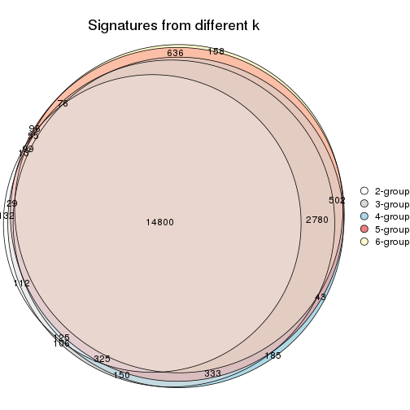

`get_signature()` returns a data frame invisibly. TO get the list of signatures, the function
call should be assigned to a variable explicitly. In following code, if `plot` argument is set
to `FALSE`, no heatmap is plotted while only the differential analysis is performed.

```r
# code only for demonstration
tb = get_signature(res, k = ..., plot = FALSE)
```

An example of the output of `tb` is:

```
#>   which_row         fdr    mean_1    mean_2 scaled_mean_1 scaled_mean_2 km
#> 1        38 0.042760348  8.373488  9.131774    -0.5533452     0.5164555  1
#> 2        40 0.018707592  7.106213  8.469186    -0.6173731     0.5762149  1
#> 3        55 0.019134737 10.221463 11.207825    -0.6159697     0.5749050  1
#> 4        59 0.006059896  5.921854  7.869574    -0.6899429     0.6439467  1
#> 5        60 0.018055526  8.928898 10.211722    -0.6204761     0.5791110  1
#> 6        98 0.009384629 15.714769 14.887706     0.6635654    -0.6193277  2
...
```

The columns in `tb` are:

1. `which_row`: row indices corresponding to the input matrix.
2. `fdr`: FDR for the differential test. 
3. `mean_x`: The mean value in group x.
4. `scaled_mean_x`: The mean value in group x after rows are scaled.
5. `km`: Row groups if k-means clustering is applied to rows.


UMAP plot which shows how samples are separated.


<script>
$( function() {
	$( '#tabs-SD-skmeans-dimension-reduction' ).tabs();
} );
</script>
<div id='tabs-SD-skmeans-dimension-reduction'>
<ul>
<li><a href='#tab-SD-skmeans-dimension-reduction-1'>k = 2</a></li>
<li><a href='#tab-SD-skmeans-dimension-reduction-2'>k = 3</a></li>
<li><a href='#tab-SD-skmeans-dimension-reduction-3'>k = 4</a></li>
<li><a href='#tab-SD-skmeans-dimension-reduction-4'>k = 5</a></li>
<li><a href='#tab-SD-skmeans-dimension-reduction-5'>k = 6</a></li>
</ul>
<div id='tab-SD-skmeans-dimension-reduction-1'>
<pre><code class="r">dimension_reduction(res, k = 2, method = &quot;UMAP&quot;)
</code></pre>

<p></p>

</div>
<div id='tab-SD-skmeans-dimension-reduction-2'>
<pre><code class="r">dimension_reduction(res, k = 3, method = &quot;UMAP&quot;)
</code></pre>

<p></p>

</div>
<div id='tab-SD-skmeans-dimension-reduction-3'>
<pre><code class="r">dimension_reduction(res, k = 4, method = &quot;UMAP&quot;)
</code></pre>

<p></p>

</div>
<div id='tab-SD-skmeans-dimension-reduction-4'>
<pre><code class="r">dimension_reduction(res, k = 5, method = &quot;UMAP&quot;)
</code></pre>

<p></p>

</div>
<div id='tab-SD-skmeans-dimension-reduction-5'>
<pre><code class="r">dimension_reduction(res, k = 6, method = &quot;UMAP&quot;)
</code></pre>

<p></p>

</div>
</div>


Following heatmap shows how subgroups are split when increasing `k`:

```r
collect_classes(res)
```


Test correlation between subgroups and known annotations. If the known
annotation is numeric, one-way ANOVA test is applied, and if the known
annotation is discrete, chi-squared contingency table test is applied.

```r
test_to_known_factors(res)
```

```
#>             n cell.type(p) protocol(p) individual(p) k
#> SD:skmeans 96     8.49e-22       1.000         1.000 2
#> SD:skmeans 96     1.43e-21       0.691         1.000 3
#> SD:skmeans 91     1.34e-19       0.863         0.996 4
#> SD:skmeans 93     3.03e-19       0.639         0.991 5
#> SD:skmeans 82     6.56e-17       0.640         0.937 6
```


If matrix rows can be associated to genes, consider to use `functional_enrichment(res,
...)` to perform function enrichment for the signature genes. See [this vignette](http://bioconductor.org/packages/devel/bioc/vignettes/cola/inst/doc/functional_enrichment.html) for more detailed explanations.


 

---------------------------------------------------


### SD:pam**


The object with results only for a single top-value method and a single partition method 
can be extracted as:

```r
res = res_list["SD", "pam"]
# you can also extract it by
# res = res_list["SD:pam"]
```

A summary of `res` and all the functions that can be applied to it:

```r
res
```

```
#> A 'ConsensusPartition' object with k = 2, 3, 4, 5, 6.
#>   On a matrix with 25171 rows and 96 columns.
#>   Top rows (1000, 2000, 3000, 4000, 5000) are extracted by 'SD' method.
#>   Subgroups are detected by 'pam' method.
#>   Performed in total 1250 partitions by row resampling.
#>   Best k for subgroups seems to be 2.
#> 
#> Following methods can be applied to this 'ConsensusPartition' object:
#>  [1] "cola_report"             "collect_classes"         "collect_plots"          
#>  [4] "collect_stats"           "colnames"                "compare_signatures"     
#>  [7] "consensus_heatmap"       "dimension_reduction"     "functional_enrichment"  
#> [10] "get_anno_col"            "get_anno"                "get_classes"            
#> [13] "get_consensus"           "get_matrix"              "get_membership"         
#> [16] "get_param"               "get_signatures"          "get_stats"              
#> [19] "is_best_k"               "is_stable_k"             "membership_heatmap"     
#> [22] "ncol"                    "nrow"                    "plot_ecdf"              
#> [25] "rownames"                "select_partition_number" "show"                   
#> [28] "suggest_best_k"          "test_to_known_factors"
```

`collect_plots()` function collects all the plots made from `res` for all `k` (number of partitions)
into one single page to provide an easy and fast comparison between different `k`.

```r
collect_plots(res)
```


The plots are:

- The first row: a plot of the ECDF (empirical cumulative distribution
  function) curves of the consensus matrix for each `k` and the heatmap of
  predicted classes for each `k`.
- The second row: heatmaps of the consensus matrix for each `k`.
- The third row: heatmaps of the membership matrix for each `k`.
- The fouth row: heatmaps of the signatures for each `k`.

All the plots in panels can be made by individual functions and they are
plotted later in this section.

`select_partition_number()` produces several plots showing different
statistics for choosing "optimized" `k`. There are following statistics:

- ECDF curves of the consensus matrix for each `k`;
- 1-PAC. [The PAC
  score](https://en.wikipedia.org/wiki/Consensus_clustering#Over-interpretation_potential_of_consensus_clustering)
  measures the proportion of the ambiguous subgrouping.
- Mean silhouette score.
- Concordance. The mean probability of fiting the consensus class ids in all
  partitions.
- Area increased. Denote $A_k$ as the area under the ECDF curve for current
  `k`, the area increased is defined as $A_k - A_{k-1}$.
- Rand index. The percent of pairs of samples that are both in a same cluster
  or both are not in a same cluster in the partition of k and k-1.
- Jaccard index. The ratio of pairs of samples are both in a same cluster in
  the partition of k and k-1 and the pairs of samples are both in a same
  cluster in the partition k or k-1.

The detailed explanations of these statistics can be found in [the _cola_
vignette](http://bioconductor.org/packages/devel/bioc/vignettes/cola/inst/doc/cola.html#toc_13).

Generally speaking, lower PAC score, higher mean silhouette score or higher
concordance corresponds to better partition. Rand index and Jaccard index
measure how similar the current partition is compared to partition with `k-1`.
If they are too similar, we won't accept `k` is better than `k-1`.

```r
select_partition_number(res)
```


The numeric values for all these statistics can be obtained by `get_stats()`.

```r
get_stats(res)
```

```
#>   k 1-PAC mean_silhouette concordance area_increased  Rand Jaccard
#> 2 2 1.000           1.000       1.000         0.5058 0.495   0.495
#> 3 3 0.753           0.947       0.897         0.2485 0.874   0.745
#> 4 4 0.776           0.793       0.899         0.1852 0.876   0.662
#> 5 5 0.818           0.854       0.891         0.0489 0.946   0.787
#> 6 6 0.843           0.757       0.849         0.0394 0.956   0.801
```

`suggest_best_k()` suggests the best $k$ based on these statistics. The rules are as follows:

- All $k$ with Jaccard index larger than 0.95 are removed because increasing
  $k$ does not provide enough extra information. If all $k$ are removed, it is
  marked as no subgroup is detected.
- For all $k$ with 1-PAC score larger than 0.9, the maximal $k$ is taken as
  the best $k$, and other $k$ are marked as optional $k$.
- If it does not fit the second rule. The $k$ with the maximal vote of the
  highest 1-PAC score, highest mean silhouette, and highest concordance is
  taken as the best $k$.

```r
suggest_best_k(res)
```

```
#> [1] 2
```


Following shows the table of the partitions (You need to click the **show/hide
code output** link to see it). The membership matrix (columns with name `p*`)
is inferred by
[`clue::cl_consensus()`](https://www.rdocumentation.org/link/cl_consensus?package=clue)
function with the `SE` method. Basically the value in the membership matrix
represents the probability to belong to a certain group. The finall class
label for an item is determined with the group with highest probability it
belongs to.

In `get_classes()` function, the entropy is calculated from the membership
matrix and the silhouette score is calculated from the consensus matrix.


<script>
$( function() {
	$( '#tabs-SD-pam-get-classes' ).tabs();
} );
</script>
<div id='tabs-SD-pam-get-classes'>
<ul>
<li><a href='#tab-SD-pam-get-classes-1'>k = 2</a></li>
<li><a href='#tab-SD-pam-get-classes-2'>k = 3</a></li>
<li><a href='#tab-SD-pam-get-classes-3'>k = 4</a></li>
<li><a href='#tab-SD-pam-get-classes-4'>k = 5</a></li>
<li><a href='#tab-SD-pam-get-classes-5'>k = 6</a></li>
</ul>

<div id='tab-SD-pam-get-classes-1'>
<p><a id='tab-SD-pam-get-classes-1-a' style='color:#0366d6' href='#'>show/hide code output</a></p>
<pre><code class="r">cbind(get_classes(res, k = 2), get_membership(res, k = 2))
</code></pre>

<pre><code>#&gt;           class entropy silhouette p1 p2
#&gt; GSM257886     1       0          1  1  0
#&gt; GSM257888     1       0          1  1  0
#&gt; GSM257890     1       0          1  1  0
#&gt; GSM257892     1       0          1  1  0
#&gt; GSM257894     1       0          1  1  0
#&gt; GSM257896     1       0          1  1  0
#&gt; GSM257898     1       0          1  1  0
#&gt; GSM257900     1       0          1  1  0
#&gt; GSM257902     1       0          1  1  0
#&gt; GSM257904     1       0          1  1  0
#&gt; GSM257906     1       0          1  1  0
#&gt; GSM257908     1       0          1  1  0
#&gt; GSM257910     1       0          1  1  0
#&gt; GSM257912     1       0          1  1  0
#&gt; GSM257914     1       0          1  1  0
#&gt; GSM257917     1       0          1  1  0
#&gt; GSM257919     1       0          1  1  0
#&gt; GSM257921     1       0          1  1  0
#&gt; GSM257923     1       0          1  1  0
#&gt; GSM257925     1       0          1  1  0
#&gt; GSM257927     1       0          1  1  0
#&gt; GSM257929     1       0          1  1  0
#&gt; GSM257937     1       0          1  1  0
#&gt; GSM257939     1       0          1  1  0
#&gt; GSM257941     1       0          1  1  0
#&gt; GSM257943     1       0          1  1  0
#&gt; GSM257945     1       0          1  1  0
#&gt; GSM257947     1       0          1  1  0
#&gt; GSM257949     1       0          1  1  0
#&gt; GSM257951     1       0          1  1  0
#&gt; GSM257953     1       0          1  1  0
#&gt; GSM257955     1       0          1  1  0
#&gt; GSM257958     1       0          1  1  0
#&gt; GSM257960     1       0          1  1  0
#&gt; GSM257962     1       0          1  1  0
#&gt; GSM257964     1       0          1  1  0
#&gt; GSM257966     1       0          1  1  0
#&gt; GSM257968     1       0          1  1  0
#&gt; GSM257970     1       0          1  1  0
#&gt; GSM257972     1       0          1  1  0
#&gt; GSM257977     1       0          1  1  0
#&gt; GSM257982     1       0          1  1  0
#&gt; GSM257984     1       0          1  1  0
#&gt; GSM257986     1       0          1  1  0
#&gt; GSM257990     1       0          1  1  0
#&gt; GSM257992     1       0          1  1  0
#&gt; GSM257996     1       0          1  1  0
#&gt; GSM258006     1       0          1  1  0
#&gt; GSM257887     2       0          1  0  1
#&gt; GSM257889     2       0          1  0  1
#&gt; GSM257891     2       0          1  0  1
#&gt; GSM257893     2       0          1  0  1
#&gt; GSM257895     2       0          1  0  1
#&gt; GSM257897     2       0          1  0  1
#&gt; GSM257899     2       0          1  0  1
#&gt; GSM257901     2       0          1  0  1
#&gt; GSM257903     2       0          1  0  1
#&gt; GSM257905     2       0          1  0  1
#&gt; GSM257907     2       0          1  0  1
#&gt; GSM257909     2       0          1  0  1
#&gt; GSM257911     2       0          1  0  1
#&gt; GSM257913     2       0          1  0  1
#&gt; GSM257916     2       0          1  0  1
#&gt; GSM257918     2       0          1  0  1
#&gt; GSM257920     2       0          1  0  1
#&gt; GSM257922     2       0          1  0  1
#&gt; GSM257924     2       0          1  0  1
#&gt; GSM257926     2       0          1  0  1
#&gt; GSM257928     2       0          1  0  1
#&gt; GSM257930     2       0          1  0  1
#&gt; GSM257938     2       0          1  0  1
#&gt; GSM257940     2       0          1  0  1
#&gt; GSM257942     2       0          1  0  1
#&gt; GSM257944     2       0          1  0  1
#&gt; GSM257946     2       0          1  0  1
#&gt; GSM257948     2       0          1  0  1
#&gt; GSM257950     2       0          1  0  1
#&gt; GSM257952     2       0          1  0  1
#&gt; GSM257954     2       0          1  0  1
#&gt; GSM257956     2       0          1  0  1
#&gt; GSM257959     2       0          1  0  1
#&gt; GSM257961     2       0          1  0  1
#&gt; GSM257963     2       0          1  0  1
#&gt; GSM257965     2       0          1  0  1
#&gt; GSM257967     2       0          1  0  1
#&gt; GSM257969     2       0          1  0  1
#&gt; GSM257971     2       0          1  0  1
#&gt; GSM257973     2       0          1  0  1
#&gt; GSM257981     2       0          1  0  1
#&gt; GSM257983     2       0          1  0  1
#&gt; GSM257985     2       0          1  0  1
#&gt; GSM257988     2       0          1  0  1
#&gt; GSM257991     2       0          1  0  1
#&gt; GSM257993     2       0          1  0  1
#&gt; GSM257994     2       0          1  0  1
#&gt; GSM257989     2       0          1  0  1
</code></pre>

<script>
$('#tab-SD-pam-get-classes-1-a').parent().next().next().hide();
$('#tab-SD-pam-get-classes-1-a').click(function(){
  $('#tab-SD-pam-get-classes-1-a').parent().next().next().toggle();
  return(false);
});
</script>
</div>

<div id='tab-SD-pam-get-classes-2'>
<p><a id='tab-SD-pam-get-classes-2-a' style='color:#0366d6' href='#'>show/hide code output</a></p>
<pre><code class="r">cbind(get_classes(res, k = 3), get_membership(res, k = 3))
</code></pre>

<pre><code>#&gt;           class entropy silhouette    p1    p2    p3
#&gt; GSM257886     1  0.3752      0.933 0.856 0.000 0.144
#&gt; GSM257888     1  0.1163      0.921 0.972 0.000 0.028
#&gt; GSM257890     1  0.3816      0.933 0.852 0.000 0.148
#&gt; GSM257892     1  0.3752      0.933 0.856 0.000 0.144
#&gt; GSM257894     1  0.1163      0.921 0.972 0.000 0.028
#&gt; GSM257896     1  0.3619      0.933 0.864 0.000 0.136
#&gt; GSM257898     1  0.3752      0.933 0.856 0.000 0.144
#&gt; GSM257900     1  0.3752      0.933 0.856 0.000 0.144
#&gt; GSM257902     1  0.1163      0.921 0.972 0.000 0.028
#&gt; GSM257904     1  0.3752      0.933 0.856 0.000 0.144
#&gt; GSM257906     1  0.3752      0.933 0.856 0.000 0.144
#&gt; GSM257908     1  0.1163      0.921 0.972 0.000 0.028
#&gt; GSM257910     1  0.0892      0.923 0.980 0.000 0.020
#&gt; GSM257912     1  0.3752      0.933 0.856 0.000 0.144
#&gt; GSM257914     1  0.3752      0.933 0.856 0.000 0.144
#&gt; GSM257917     1  0.3752      0.933 0.856 0.000 0.144
#&gt; GSM257919     1  0.3752      0.933 0.856 0.000 0.144
#&gt; GSM257921     1  0.3752      0.933 0.856 0.000 0.144
#&gt; GSM257923     1  0.1031      0.922 0.976 0.000 0.024
#&gt; GSM257925     1  0.0000      0.926 1.000 0.000 0.000
#&gt; GSM257927     1  0.3752      0.933 0.856 0.000 0.144
#&gt; GSM257929     1  0.0424      0.925 0.992 0.000 0.008
#&gt; GSM257937     1  0.3752      0.933 0.856 0.000 0.144
#&gt; GSM257939     1  0.1031      0.922 0.976 0.000 0.024
#&gt; GSM257941     1  0.3752      0.933 0.856 0.000 0.144
#&gt; GSM257943     1  0.3752      0.933 0.856 0.000 0.144
#&gt; GSM257945     1  0.3752      0.933 0.856 0.000 0.144
#&gt; GSM257947     1  0.1031      0.922 0.976 0.000 0.024
#&gt; GSM257949     1  0.1163      0.921 0.972 0.000 0.028
#&gt; GSM257951     1  0.1163      0.921 0.972 0.000 0.028
#&gt; GSM257953     1  0.0424      0.925 0.992 0.000 0.008
#&gt; GSM257955     1  0.1163      0.921 0.972 0.000 0.028
#&gt; GSM257958     1  0.0424      0.925 0.992 0.000 0.008
#&gt; GSM257960     1  0.3752      0.933 0.856 0.000 0.144
#&gt; GSM257962     1  0.3752      0.933 0.856 0.000 0.144
#&gt; GSM257964     1  0.1163      0.921 0.972 0.000 0.028
#&gt; GSM257966     1  0.0892      0.923 0.980 0.000 0.020
#&gt; GSM257968     1  0.1163      0.921 0.972 0.000 0.028
#&gt; GSM257970     1  0.1163      0.921 0.972 0.000 0.028
#&gt; GSM257972     1  0.3619      0.933 0.864 0.000 0.136
#&gt; GSM257977     1  0.3816      0.933 0.852 0.000 0.148
#&gt; GSM257982     1  0.0892      0.923 0.980 0.000 0.020
#&gt; GSM257984     1  0.1163      0.921 0.972 0.000 0.028
#&gt; GSM257986     1  0.1163      0.921 0.972 0.000 0.028
#&gt; GSM257990     1  0.1860      0.930 0.948 0.000 0.052
#&gt; GSM257992     1  0.3752      0.933 0.856 0.000 0.144
#&gt; GSM257996     1  0.3752      0.933 0.856 0.000 0.144
#&gt; GSM258006     1  0.3752      0.933 0.856 0.000 0.144
#&gt; GSM257887     2  0.0000      0.971 0.000 1.000 0.000
#&gt; GSM257889     3  0.4178      0.995 0.000 0.172 0.828
#&gt; GSM257891     3  0.4178      0.995 0.000 0.172 0.828
#&gt; GSM257893     3  0.4178      0.995 0.000 0.172 0.828
#&gt; GSM257895     2  0.0000      0.971 0.000 1.000 0.000
#&gt; GSM257897     3  0.4178      0.995 0.000 0.172 0.828
#&gt; GSM257899     3  0.4178      0.995 0.000 0.172 0.828
#&gt; GSM257901     3  0.4178      0.995 0.000 0.172 0.828
#&gt; GSM257903     2  0.3482      0.821 0.000 0.872 0.128
#&gt; GSM257905     2  0.0000      0.971 0.000 1.000 0.000
#&gt; GSM257907     3  0.4178      0.995 0.000 0.172 0.828
#&gt; GSM257909     2  0.0000      0.971 0.000 1.000 0.000
#&gt; GSM257911     3  0.4291      0.986 0.000 0.180 0.820
#&gt; GSM257913     3  0.4178      0.995 0.000 0.172 0.828
#&gt; GSM257916     2  0.0000      0.971 0.000 1.000 0.000
#&gt; GSM257918     2  0.0000      0.971 0.000 1.000 0.000
#&gt; GSM257920     3  0.4178      0.995 0.000 0.172 0.828
#&gt; GSM257922     3  0.4178      0.995 0.000 0.172 0.828
#&gt; GSM257924     3  0.4178      0.995 0.000 0.172 0.828
#&gt; GSM257926     3  0.4178      0.995 0.000 0.172 0.828
#&gt; GSM257928     2  0.2261      0.908 0.000 0.932 0.068
#&gt; GSM257930     2  0.1643      0.934 0.000 0.956 0.044
#&gt; GSM257938     2  0.0000      0.971 0.000 1.000 0.000
#&gt; GSM257940     3  0.4178      0.995 0.000 0.172 0.828
#&gt; GSM257942     2  0.1529      0.936 0.000 0.960 0.040
#&gt; GSM257944     2  0.0000      0.971 0.000 1.000 0.000
#&gt; GSM257946     3  0.4178      0.995 0.000 0.172 0.828
#&gt; GSM257948     3  0.4178      0.995 0.000 0.172 0.828
#&gt; GSM257950     3  0.4178      0.995 0.000 0.172 0.828
#&gt; GSM257952     2  0.0237      0.969 0.000 0.996 0.004
#&gt; GSM257954     2  0.0000      0.971 0.000 1.000 0.000
#&gt; GSM257956     2  0.0237      0.969 0.000 0.996 0.004
#&gt; GSM257959     2  0.0000      0.971 0.000 1.000 0.000
#&gt; GSM257961     2  0.0000      0.971 0.000 1.000 0.000
#&gt; GSM257963     2  0.0000      0.971 0.000 1.000 0.000
#&gt; GSM257965     2  0.0000      0.971 0.000 1.000 0.000
#&gt; GSM257967     2  0.0000      0.971 0.000 1.000 0.000
#&gt; GSM257969     2  0.0000      0.971 0.000 1.000 0.000
#&gt; GSM257971     3  0.4178      0.995 0.000 0.172 0.828
#&gt; GSM257973     3  0.4178      0.995 0.000 0.172 0.828
#&gt; GSM257981     2  0.5098      0.586 0.000 0.752 0.248
#&gt; GSM257983     3  0.4178      0.995 0.000 0.172 0.828
#&gt; GSM257985     3  0.4178      0.995 0.000 0.172 0.828
#&gt; GSM257988     3  0.4178      0.995 0.000 0.172 0.828
#&gt; GSM257991     3  0.5138      0.893 0.000 0.252 0.748
#&gt; GSM257993     2  0.0000      0.971 0.000 1.000 0.000
#&gt; GSM257994     2  0.0237      0.969 0.000 0.996 0.004
#&gt; GSM257989     3  0.4178      0.995 0.000 0.172 0.828
</code></pre>

<script>
$('#tab-SD-pam-get-classes-2-a').parent().next().next().hide();
$('#tab-SD-pam-get-classes-2-a').click(function(){
  $('#tab-SD-pam-get-classes-2-a').parent().next().next().toggle();
  return(false);
});
</script>
</div>

<div id='tab-SD-pam-get-classes-3'>
<p><a id='tab-SD-pam-get-classes-3-a' style='color:#0366d6' href='#'>show/hide code output</a></p>
<pre><code class="r">cbind(get_classes(res, k = 4), get_membership(res, k = 4))
</code></pre>

<pre><code>#&gt;           class entropy silhouette    p1    p2    p3    p4
#&gt; GSM257886     1  0.0000      0.851 1.000 0.000 0.000 0.000
#&gt; GSM257888     4  0.3528      0.561 0.192 0.000 0.000 0.808
#&gt; GSM257890     1  0.4907      0.314 0.580 0.000 0.000 0.420
#&gt; GSM257892     1  0.0000      0.851 1.000 0.000 0.000 0.000
#&gt; GSM257894     4  0.0000      0.679 0.000 0.000 0.000 1.000
#&gt; GSM257896     1  0.4933      0.293 0.568 0.000 0.000 0.432
#&gt; GSM257898     1  0.0000      0.851 1.000 0.000 0.000 0.000
#&gt; GSM257900     1  0.0000      0.851 1.000 0.000 0.000 0.000
#&gt; GSM257902     4  0.0000      0.679 0.000 0.000 0.000 1.000
#&gt; GSM257904     1  0.0000      0.851 1.000 0.000 0.000 0.000
#&gt; GSM257906     1  0.0000      0.851 1.000 0.000 0.000 0.000
#&gt; GSM257908     4  0.4134      0.463 0.260 0.000 0.000 0.740
#&gt; GSM257910     4  0.2589      0.635 0.116 0.000 0.000 0.884
#&gt; GSM257912     1  0.2011      0.789 0.920 0.000 0.000 0.080
#&gt; GSM257914     1  0.2408      0.766 0.896 0.000 0.000 0.104
#&gt; GSM257917     1  0.0000      0.851 1.000 0.000 0.000 0.000
#&gt; GSM257919     1  0.2868      0.731 0.864 0.000 0.000 0.136
#&gt; GSM257921     1  0.0000      0.851 1.000 0.000 0.000 0.000
#&gt; GSM257923     4  0.4898      0.548 0.416 0.000 0.000 0.584
#&gt; GSM257925     1  0.4989     -0.391 0.528 0.000 0.000 0.472
#&gt; GSM257927     1  0.0000      0.851 1.000 0.000 0.000 0.000
#&gt; GSM257929     4  0.4977      0.484 0.460 0.000 0.000 0.540
#&gt; GSM257937     1  0.4500      0.479 0.684 0.000 0.000 0.316
#&gt; GSM257939     4  0.4907      0.543 0.420 0.000 0.000 0.580
#&gt; GSM257941     1  0.0000      0.851 1.000 0.000 0.000 0.000
#&gt; GSM257943     1  0.0000      0.851 1.000 0.000 0.000 0.000
#&gt; GSM257945     1  0.0000      0.851 1.000 0.000 0.000 0.000
#&gt; GSM257947     4  0.4898      0.548 0.416 0.000 0.000 0.584
#&gt; GSM257949     4  0.2868      0.684 0.136 0.000 0.000 0.864
#&gt; GSM257951     4  0.4661      0.615 0.348 0.000 0.000 0.652
#&gt; GSM257953     4  0.4948      0.513 0.440 0.000 0.000 0.560
#&gt; GSM257955     4  0.4624      0.620 0.340 0.000 0.000 0.660
#&gt; GSM257958     4  0.4955      0.507 0.444 0.000 0.000 0.556
#&gt; GSM257960     1  0.0000      0.851 1.000 0.000 0.000 0.000
#&gt; GSM257962     1  0.0000      0.851 1.000 0.000 0.000 0.000
#&gt; GSM257964     4  0.4643      0.617 0.344 0.000 0.000 0.656
#&gt; GSM257966     4  0.4382      0.395 0.296 0.000 0.000 0.704
#&gt; GSM257968     4  0.0000      0.679 0.000 0.000 0.000 1.000
#&gt; GSM257970     4  0.3610      0.675 0.200 0.000 0.000 0.800
#&gt; GSM257972     1  0.2704      0.700 0.876 0.000 0.000 0.124
#&gt; GSM257977     1  0.4925      0.300 0.572 0.000 0.000 0.428
#&gt; GSM257982     4  0.2149      0.651 0.088 0.000 0.000 0.912
#&gt; GSM257984     4  0.0000      0.679 0.000 0.000 0.000 1.000
#&gt; GSM257986     4  0.0000      0.679 0.000 0.000 0.000 1.000
#&gt; GSM257990     1  0.2408      0.722 0.896 0.000 0.000 0.104
#&gt; GSM257992     1  0.0000      0.851 1.000 0.000 0.000 0.000
#&gt; GSM257996     1  0.0000      0.851 1.000 0.000 0.000 0.000
#&gt; GSM258006     1  0.0000      0.851 1.000 0.000 0.000 0.000
#&gt; GSM257887     2  0.0000      0.913 0.000 1.000 0.000 0.000
#&gt; GSM257889     3  0.0000      0.986 0.000 0.000 1.000 0.000
#&gt; GSM257891     3  0.0000      0.986 0.000 0.000 1.000 0.000
#&gt; GSM257893     3  0.0000      0.986 0.000 0.000 1.000 0.000
#&gt; GSM257895     2  0.0000      0.913 0.000 1.000 0.000 0.000
#&gt; GSM257897     3  0.0000      0.986 0.000 0.000 1.000 0.000
#&gt; GSM257899     3  0.0000      0.986 0.000 0.000 1.000 0.000
#&gt; GSM257901     3  0.0592      0.975 0.000 0.016 0.984 0.000
#&gt; GSM257903     2  0.4250      0.719 0.000 0.724 0.276 0.000
#&gt; GSM257905     2  0.3024      0.875 0.000 0.852 0.148 0.000
#&gt; GSM257907     3  0.0000      0.986 0.000 0.000 1.000 0.000
#&gt; GSM257909     2  0.2530      0.892 0.000 0.888 0.112 0.000
#&gt; GSM257911     3  0.0336      0.980 0.000 0.008 0.992 0.000
#&gt; GSM257913     3  0.0000      0.986 0.000 0.000 1.000 0.000
#&gt; GSM257916     2  0.3024      0.875 0.000 0.852 0.148 0.000
#&gt; GSM257918     2  0.3024      0.875 0.000 0.852 0.148 0.000
#&gt; GSM257920     3  0.0000      0.986 0.000 0.000 1.000 0.000
#&gt; GSM257922     3  0.1022      0.962 0.000 0.032 0.968 0.000
#&gt; GSM257924     3  0.0000      0.986 0.000 0.000 1.000 0.000
#&gt; GSM257926     3  0.0000      0.986 0.000 0.000 1.000 0.000
#&gt; GSM257928     2  0.2081      0.880 0.000 0.916 0.084 0.000
#&gt; GSM257930     2  0.1302      0.903 0.000 0.956 0.044 0.000
#&gt; GSM257938     2  0.0000      0.913 0.000 1.000 0.000 0.000
#&gt; GSM257940     3  0.0000      0.986 0.000 0.000 1.000 0.000
#&gt; GSM257942     2  0.3486      0.837 0.000 0.812 0.188 0.000
#&gt; GSM257944     2  0.3024      0.875 0.000 0.852 0.148 0.000
#&gt; GSM257946     3  0.0000      0.986 0.000 0.000 1.000 0.000
#&gt; GSM257948     3  0.0000      0.986 0.000 0.000 1.000 0.000
#&gt; GSM257950     3  0.0000      0.986 0.000 0.000 1.000 0.000
#&gt; GSM257952     2  0.0188      0.914 0.000 0.996 0.004 0.000
#&gt; GSM257954     2  0.0000      0.913 0.000 1.000 0.000 0.000
#&gt; GSM257956     2  0.0188      0.914 0.000 0.996 0.004 0.000
#&gt; GSM257959     2  0.1716      0.910 0.000 0.936 0.064 0.000
#&gt; GSM257961     2  0.0000      0.913 0.000 1.000 0.000 0.000
#&gt; GSM257963     2  0.1389      0.914 0.000 0.952 0.048 0.000
#&gt; GSM257965     2  0.1716      0.910 0.000 0.936 0.064 0.000
#&gt; GSM257967     2  0.1389      0.913 0.000 0.952 0.048 0.000
#&gt; GSM257969     2  0.0000      0.913 0.000 1.000 0.000 0.000
#&gt; GSM257971     3  0.1792      0.927 0.000 0.068 0.932 0.000
#&gt; GSM257973     3  0.0000      0.986 0.000 0.000 1.000 0.000
#&gt; GSM257981     2  0.4543      0.564 0.000 0.676 0.324 0.000
#&gt; GSM257983     3  0.0000      0.986 0.000 0.000 1.000 0.000
#&gt; GSM257985     3  0.1716      0.931 0.000 0.064 0.936 0.000
#&gt; GSM257988     3  0.0000      0.986 0.000 0.000 1.000 0.000
#&gt; GSM257991     3  0.2281      0.883 0.000 0.096 0.904 0.000
#&gt; GSM257993     2  0.0000      0.913 0.000 1.000 0.000 0.000
#&gt; GSM257994     2  0.0188      0.914 0.000 0.996 0.004 0.000
#&gt; GSM257989     3  0.0000      0.986 0.000 0.000 1.000 0.000
</code></pre>

<script>
$('#tab-SD-pam-get-classes-3-a').parent().next().next().hide();
$('#tab-SD-pam-get-classes-3-a').click(function(){
  $('#tab-SD-pam-get-classes-3-a').parent().next().next().toggle();
  return(false);
});
</script>
</div>

<div id='tab-SD-pam-get-classes-4'>
<p><a id='tab-SD-pam-get-classes-4-a' style='color:#0366d6' href='#'>show/hide code output</a></p>
<pre><code class="r">cbind(get_classes(res, k = 5), get_membership(res, k = 5))
</code></pre>

<pre><code>#&gt;           class entropy silhouette    p1    p2    p3    p4    p5
#&gt; GSM257886     1  0.3074      0.687 0.804 0.000 0.000 0.196 0.000
#&gt; GSM257888     4  0.0963      0.821 0.000 0.000 0.000 0.964 0.036
#&gt; GSM257890     4  0.1043      0.816 0.040 0.000 0.000 0.960 0.000
#&gt; GSM257892     1  0.3074      0.687 0.804 0.000 0.000 0.196 0.000
#&gt; GSM257894     4  0.0963      0.821 0.000 0.000 0.000 0.964 0.036
#&gt; GSM257896     4  0.1043      0.816 0.040 0.000 0.000 0.960 0.000
#&gt; GSM257898     1  0.0000      0.853 1.000 0.000 0.000 0.000 0.000
#&gt; GSM257900     1  0.0000      0.853 1.000 0.000 0.000 0.000 0.000
#&gt; GSM257902     4  0.3700      0.712 0.008 0.000 0.000 0.752 0.240
#&gt; GSM257904     1  0.0000      0.853 1.000 0.000 0.000 0.000 0.000
#&gt; GSM257906     1  0.0162      0.851 0.996 0.000 0.000 0.004 0.000
#&gt; GSM257908     4  0.5998      0.572 0.188 0.000 0.000 0.584 0.228
#&gt; GSM257910     4  0.6021      0.570 0.188 0.000 0.000 0.580 0.232
#&gt; GSM257912     1  0.4134      0.681 0.744 0.000 0.000 0.032 0.224
#&gt; GSM257914     1  0.4134      0.681 0.744 0.000 0.000 0.032 0.224
#&gt; GSM257917     1  0.4134      0.681 0.744 0.000 0.000 0.032 0.224
#&gt; GSM257919     1  0.4134      0.681 0.744 0.000 0.000 0.032 0.224
#&gt; GSM257921     1  0.0162      0.851 0.996 0.000 0.000 0.004 0.000
#&gt; GSM257923     5  0.3461      0.956 0.224 0.000 0.000 0.004 0.772
#&gt; GSM257925     5  0.4256      0.617 0.436 0.000 0.000 0.000 0.564
#&gt; GSM257927     1  0.0000      0.853 1.000 0.000 0.000 0.000 0.000
#&gt; GSM257929     5  0.3837      0.862 0.308 0.000 0.000 0.000 0.692
#&gt; GSM257937     1  0.4273      0.253 0.552 0.000 0.000 0.448 0.000
#&gt; GSM257939     5  0.3461      0.956 0.224 0.000 0.000 0.004 0.772
#&gt; GSM257941     1  0.0000      0.853 1.000 0.000 0.000 0.000 0.000
#&gt; GSM257943     1  0.0000      0.853 1.000 0.000 0.000 0.000 0.000
#&gt; GSM257945     1  0.0000      0.853 1.000 0.000 0.000 0.000 0.000
#&gt; GSM257947     5  0.3461      0.956 0.224 0.000 0.000 0.004 0.772
#&gt; GSM257949     5  0.4024      0.935 0.220 0.000 0.000 0.028 0.752
#&gt; GSM257951     5  0.3461      0.956 0.224 0.000 0.000 0.004 0.772
#&gt; GSM257953     5  0.3336      0.954 0.228 0.000 0.000 0.000 0.772
#&gt; GSM257955     5  0.3551      0.953 0.220 0.000 0.000 0.008 0.772
#&gt; GSM257958     5  0.3395      0.949 0.236 0.000 0.000 0.000 0.764
#&gt; GSM257960     1  0.0000      0.853 1.000 0.000 0.000 0.000 0.000
#&gt; GSM257962     1  0.1043      0.819 0.960 0.000 0.000 0.000 0.040
#&gt; GSM257964     5  0.3461      0.956 0.224 0.000 0.000 0.004 0.772
#&gt; GSM257966     4  0.3003      0.748 0.000 0.000 0.000 0.812 0.188
#&gt; GSM257968     4  0.2605      0.783 0.000 0.000 0.000 0.852 0.148
#&gt; GSM257970     5  0.3461      0.956 0.224 0.000 0.000 0.004 0.772
#&gt; GSM257972     1  0.3876      0.257 0.684 0.000 0.000 0.000 0.316
#&gt; GSM257977     4  0.1043      0.816 0.040 0.000 0.000 0.960 0.000
#&gt; GSM257982     4  0.1082      0.821 0.008 0.000 0.000 0.964 0.028
#&gt; GSM257984     4  0.3582      0.726 0.008 0.000 0.000 0.768 0.224
#&gt; GSM257986     4  0.4425      0.479 0.008 0.000 0.000 0.600 0.392
#&gt; GSM257990     1  0.2648      0.671 0.848 0.000 0.000 0.000 0.152
#&gt; GSM257992     1  0.0000      0.853 1.000 0.000 0.000 0.000 0.000
#&gt; GSM257996     1  0.0000      0.853 1.000 0.000 0.000 0.000 0.000
#&gt; GSM258006     1  0.0290      0.849 0.992 0.000 0.000 0.008 0.000
#&gt; GSM257887     2  0.0162      0.906 0.000 0.996 0.000 0.004 0.000
#&gt; GSM257889     3  0.0162      0.984 0.000 0.000 0.996 0.000 0.004
#&gt; GSM257891     3  0.0162      0.984 0.000 0.000 0.996 0.000 0.004
#&gt; GSM257893     3  0.0162      0.984 0.000 0.000 0.996 0.000 0.004
#&gt; GSM257895     2  0.0000      0.906 0.000 1.000 0.000 0.000 0.000
#&gt; GSM257897     3  0.0162      0.984 0.000 0.000 0.996 0.000 0.004
#&gt; GSM257899     3  0.0162      0.984 0.000 0.000 0.996 0.000 0.004
#&gt; GSM257901     3  0.0510      0.974 0.000 0.016 0.984 0.000 0.000
#&gt; GSM257903     2  0.3790      0.724 0.000 0.724 0.272 0.004 0.000
#&gt; GSM257905     2  0.2719      0.868 0.000 0.852 0.144 0.004 0.000
#&gt; GSM257907     3  0.0000      0.984 0.000 0.000 1.000 0.000 0.000
#&gt; GSM257909     2  0.2286      0.884 0.000 0.888 0.108 0.004 0.000
#&gt; GSM257911     3  0.0290      0.978 0.000 0.008 0.992 0.000 0.000
#&gt; GSM257913     3  0.0000      0.984 0.000 0.000 1.000 0.000 0.000
#&gt; GSM257916     2  0.2561      0.869 0.000 0.856 0.144 0.000 0.000
#&gt; GSM257918     2  0.2719      0.868 0.000 0.852 0.144 0.004 0.000
#&gt; GSM257920     3  0.0000      0.984 0.000 0.000 1.000 0.000 0.000
#&gt; GSM257922     3  0.0955      0.963 0.000 0.028 0.968 0.000 0.004
#&gt; GSM257924     3  0.0162      0.984 0.000 0.000 0.996 0.000 0.004
#&gt; GSM257926     3  0.0000      0.984 0.000 0.000 1.000 0.000 0.000
#&gt; GSM257928     2  0.1952      0.867 0.000 0.912 0.084 0.000 0.004
#&gt; GSM257930     2  0.1121      0.894 0.000 0.956 0.044 0.000 0.000
#&gt; GSM257938     2  0.0000      0.906 0.000 1.000 0.000 0.000 0.000
#&gt; GSM257940     3  0.0000      0.984 0.000 0.000 1.000 0.000 0.000
#&gt; GSM257942     2  0.3123      0.832 0.000 0.812 0.184 0.004 0.000
#&gt; GSM257944     2  0.2719      0.868 0.000 0.852 0.144 0.004 0.000
#&gt; GSM257946     3  0.0162      0.984 0.000 0.000 0.996 0.000 0.004
#&gt; GSM257948     3  0.0000      0.984 0.000 0.000 1.000 0.000 0.000
#&gt; GSM257950     3  0.0000      0.984 0.000 0.000 1.000 0.000 0.000
#&gt; GSM257952     2  0.0162      0.907 0.000 0.996 0.004 0.000 0.000
#&gt; GSM257954     2  0.0000      0.906 0.000 1.000 0.000 0.000 0.000
#&gt; GSM257956     2  0.0162      0.907 0.000 0.996 0.004 0.000 0.000
#&gt; GSM257959     2  0.1410      0.903 0.000 0.940 0.060 0.000 0.000
#&gt; GSM257961     2  0.0162      0.906 0.000 0.996 0.000 0.004 0.000
#&gt; GSM257963     2  0.1357      0.907 0.000 0.948 0.048 0.004 0.000
#&gt; GSM257965     2  0.1410      0.903 0.000 0.940 0.060 0.000 0.000
#&gt; GSM257967     2  0.1357      0.906 0.000 0.948 0.048 0.004 0.000
#&gt; GSM257969     2  0.0000      0.906 0.000 1.000 0.000 0.000 0.000
#&gt; GSM257971     3  0.1638      0.927 0.000 0.064 0.932 0.000 0.004
#&gt; GSM257973     3  0.0000      0.984 0.000 0.000 1.000 0.000 0.000
#&gt; GSM257981     2  0.3932      0.556 0.000 0.672 0.328 0.000 0.000
#&gt; GSM257983     3  0.0162      0.984 0.000 0.000 0.996 0.000 0.004
#&gt; GSM257985     3  0.1571      0.930 0.000 0.060 0.936 0.000 0.004
#&gt; GSM257988     3  0.0000      0.984 0.000 0.000 1.000 0.000 0.000
#&gt; GSM257991     3  0.2124      0.877 0.000 0.096 0.900 0.004 0.000
#&gt; GSM257993     2  0.0000      0.906 0.000 1.000 0.000 0.000 0.000
#&gt; GSM257994     2  0.0162      0.906 0.000 0.996 0.004 0.000 0.000
#&gt; GSM257989     3  0.0162      0.984 0.000 0.000 0.996 0.000 0.004
</code></pre>

<script>
$('#tab-SD-pam-get-classes-4-a').parent().next().next().hide();
$('#tab-SD-pam-get-classes-4-a').click(function(){
  $('#tab-SD-pam-get-classes-4-a').parent().next().next().toggle();
  return(false);
});
</script>
</div>

<div id='tab-SD-pam-get-classes-5'>
<p><a id='tab-SD-pam-get-classes-5-a' style='color:#0366d6' href='#'>show/hide code output</a></p>
<pre><code class="r">cbind(get_classes(res, k = 6), get_membership(res, k = 6))
</code></pre>

<pre><code>#&gt;           class entropy silhouette    p1    p2    p3    p4    p5    p6
#&gt; GSM257886     6  0.3867    -0.0574 0.000 0.000 0.000 0.000 0.488 0.512
#&gt; GSM257888     5  0.0865     0.8098 0.036 0.000 0.000 0.000 0.964 0.000
#&gt; GSM257890     5  0.0865     0.8147 0.000 0.000 0.000 0.000 0.964 0.036
#&gt; GSM257892     6  0.3867    -0.0574 0.000 0.000 0.000 0.000 0.488 0.512
#&gt; GSM257894     5  0.0865     0.8098 0.036 0.000 0.000 0.000 0.964 0.000
#&gt; GSM257896     5  0.0865     0.8147 0.000 0.000 0.000 0.000 0.964 0.036
#&gt; GSM257898     6  0.0000     0.8080 0.000 0.000 0.000 0.000 0.000 1.000
#&gt; GSM257900     6  0.1765     0.8358 0.096 0.000 0.000 0.000 0.000 0.904
#&gt; GSM257902     1  0.3857     0.1023 0.532 0.000 0.000 0.000 0.468 0.000
#&gt; GSM257904     6  0.0000     0.8080 0.000 0.000 0.000 0.000 0.000 1.000
#&gt; GSM257906     6  0.0000     0.8080 0.000 0.000 0.000 0.000 0.000 1.000
#&gt; GSM257908     4  0.3710     0.5767 0.000 0.000 0.000 0.696 0.292 0.012
#&gt; GSM257910     4  0.3828     0.5788 0.004 0.000 0.000 0.696 0.288 0.012
#&gt; GSM257912     4  0.3428     0.7250 0.000 0.000 0.000 0.696 0.000 0.304
#&gt; GSM257914     4  0.3428     0.7250 0.000 0.000 0.000 0.696 0.000 0.304
#&gt; GSM257917     4  0.3428     0.7250 0.000 0.000 0.000 0.696 0.000 0.304
#&gt; GSM257919     4  0.3428     0.7250 0.000 0.000 0.000 0.696 0.000 0.304
#&gt; GSM257921     6  0.2006     0.7869 0.016 0.000 0.000 0.080 0.000 0.904
#&gt; GSM257923     1  0.0000     0.8009 1.000 0.000 0.000 0.000 0.000 0.000
#&gt; GSM257925     1  0.3851    -0.0124 0.540 0.000 0.000 0.000 0.000 0.460
#&gt; GSM257927     6  0.1765     0.8358 0.096 0.000 0.000 0.000 0.000 0.904
#&gt; GSM257929     1  0.3672     0.2691 0.632 0.000 0.000 0.000 0.000 0.368
#&gt; GSM257937     5  0.3992     0.2581 0.000 0.000 0.000 0.012 0.624 0.364
#&gt; GSM257939     1  0.0000     0.8009 1.000 0.000 0.000 0.000 0.000 0.000
#&gt; GSM257941     6  0.1765     0.8358 0.096 0.000 0.000 0.000 0.000 0.904
#&gt; GSM257943     6  0.1610     0.8354 0.084 0.000 0.000 0.000 0.000 0.916
#&gt; GSM257945     6  0.1714     0.8360 0.092 0.000 0.000 0.000 0.000 0.908
#&gt; GSM257947     1  0.0000     0.8009 1.000 0.000 0.000 0.000 0.000 0.000
#&gt; GSM257949     1  0.0865     0.7746 0.964 0.000 0.000 0.000 0.036 0.000
#&gt; GSM257951     1  0.0000     0.8009 1.000 0.000 0.000 0.000 0.000 0.000
#&gt; GSM257953     1  0.0000     0.8009 1.000 0.000 0.000 0.000 0.000 0.000
#&gt; GSM257955     1  0.0000     0.8009 1.000 0.000 0.000 0.000 0.000 0.000
#&gt; GSM257958     1  0.0146     0.7980 0.996 0.000 0.000 0.000 0.000 0.004
#&gt; GSM257960     6  0.1765     0.8358 0.096 0.000 0.000 0.000 0.000 0.904
#&gt; GSM257962     6  0.2048     0.8191 0.120 0.000 0.000 0.000 0.000 0.880
#&gt; GSM257964     1  0.0000     0.8009 1.000 0.000 0.000 0.000 0.000 0.000
#&gt; GSM257966     4  0.3515     0.5332 0.000 0.000 0.000 0.676 0.324 0.000
#&gt; GSM257968     5  0.3634     0.3047 0.356 0.000 0.000 0.000 0.644 0.000
#&gt; GSM257970     1  0.0000     0.8009 1.000 0.000 0.000 0.000 0.000 0.000
#&gt; GSM257972     6  0.3592     0.5321 0.344 0.000 0.000 0.000 0.000 0.656
#&gt; GSM257977     5  0.0865     0.8147 0.000 0.000 0.000 0.000 0.964 0.036
#&gt; GSM257982     5  0.0993     0.8150 0.024 0.000 0.000 0.000 0.964 0.012
#&gt; GSM257984     1  0.3862     0.0797 0.524 0.000 0.000 0.000 0.476 0.000
#&gt; GSM257986     1  0.3706     0.3129 0.620 0.000 0.000 0.000 0.380 0.000
#&gt; GSM257990     6  0.2730     0.7457 0.192 0.000 0.000 0.000 0.000 0.808
#&gt; GSM257992     6  0.0000     0.8080 0.000 0.000 0.000 0.000 0.000 1.000
#&gt; GSM257996     6  0.1765     0.8358 0.096 0.000 0.000 0.000 0.000 0.904
#&gt; GSM258006     6  0.0000     0.8080 0.000 0.000 0.000 0.000 0.000 1.000
#&gt; GSM257887     2  0.1257     0.8390 0.000 0.952 0.000 0.028 0.020 0.000
#&gt; GSM257889     3  0.0820     0.9528 0.000 0.000 0.972 0.016 0.012 0.000
#&gt; GSM257891     3  0.1074     0.9471 0.000 0.000 0.960 0.028 0.012 0.000
#&gt; GSM257893     3  0.0508     0.9534 0.000 0.000 0.984 0.004 0.012 0.000
#&gt; GSM257895     2  0.0665     0.8343 0.000 0.980 0.004 0.008 0.008 0.000
#&gt; GSM257897     3  0.1151     0.9481 0.000 0.000 0.956 0.032 0.012 0.000
#&gt; GSM257899     3  0.1074     0.9471 0.000 0.000 0.960 0.028 0.012 0.000
#&gt; GSM257901     3  0.1036     0.9474 0.000 0.008 0.964 0.024 0.004 0.000
#&gt; GSM257903     2  0.6116     0.6318 0.000 0.516 0.212 0.252 0.020 0.000
#&gt; GSM257905     2  0.5223     0.7675 0.000 0.652 0.116 0.212 0.020 0.000
#&gt; GSM257907     3  0.1268     0.9463 0.000 0.008 0.952 0.036 0.004 0.000
#&gt; GSM257909     2  0.5051     0.7634 0.000 0.652 0.080 0.248 0.020 0.000
#&gt; GSM257911     3  0.2454     0.8930 0.000 0.008 0.884 0.088 0.020 0.000
#&gt; GSM257913     3  0.1010     0.9480 0.000 0.000 0.960 0.036 0.004 0.000
#&gt; GSM257916     2  0.3396     0.8122 0.000 0.828 0.108 0.048 0.016 0.000
#&gt; GSM257918     2  0.4915     0.7856 0.000 0.696 0.100 0.180 0.024 0.000
#&gt; GSM257920     3  0.0632     0.9526 0.000 0.000 0.976 0.024 0.000 0.000
#&gt; GSM257922     3  0.1269     0.9402 0.000 0.012 0.956 0.020 0.012 0.000
#&gt; GSM257924     3  0.0725     0.9531 0.000 0.000 0.976 0.012 0.012 0.000
#&gt; GSM257926     3  0.0547     0.9527 0.000 0.000 0.980 0.020 0.000 0.000
#&gt; GSM257928     2  0.2114     0.8029 0.000 0.904 0.076 0.008 0.012 0.000
#&gt; GSM257930     2  0.1542     0.8156 0.000 0.936 0.052 0.008 0.004 0.000
#&gt; GSM257938     2  0.0405     0.8336 0.000 0.988 0.000 0.008 0.004 0.000
#&gt; GSM257940     3  0.1010     0.9448 0.000 0.000 0.960 0.036 0.004 0.000
#&gt; GSM257942     2  0.5554     0.7258 0.000 0.600 0.128 0.252 0.020 0.000
#&gt; GSM257944     2  0.5270     0.7517 0.000 0.632 0.100 0.248 0.020 0.000
#&gt; GSM257946     3  0.0363     0.9530 0.000 0.000 0.988 0.000 0.012 0.000
#&gt; GSM257948     3  0.0777     0.9497 0.000 0.000 0.972 0.024 0.004 0.000
#&gt; GSM257950     3  0.0260     0.9533 0.000 0.000 0.992 0.008 0.000 0.000
#&gt; GSM257952     2  0.0777     0.8318 0.000 0.972 0.000 0.024 0.004 0.000
#&gt; GSM257954     2  0.0146     0.8357 0.000 0.996 0.000 0.004 0.000 0.000
#&gt; GSM257956     2  0.0146     0.8352 0.000 0.996 0.000 0.004 0.000 0.000
#&gt; GSM257959     2  0.3752     0.8087 0.000 0.760 0.036 0.200 0.004 0.000
#&gt; GSM257961     2  0.3543     0.8045 0.000 0.764 0.004 0.212 0.020 0.000
#&gt; GSM257963     2  0.4046     0.8019 0.000 0.744 0.028 0.208 0.020 0.000
#&gt; GSM257965     2  0.1749     0.8364 0.000 0.932 0.036 0.024 0.008 0.000
#&gt; GSM257967     2  0.3429     0.8247 0.000 0.812 0.028 0.144 0.016 0.000
#&gt; GSM257969     2  0.0000     0.8350 0.000 1.000 0.000 0.000 0.000 0.000
#&gt; GSM257971     3  0.2265     0.9004 0.000 0.056 0.904 0.028 0.012 0.000
#&gt; GSM257973     3  0.0547     0.9520 0.000 0.000 0.980 0.020 0.000 0.000
#&gt; GSM257981     2  0.4286     0.5640 0.000 0.648 0.320 0.028 0.004 0.000
#&gt; GSM257983     3  0.0891     0.9486 0.000 0.000 0.968 0.024 0.008 0.000
#&gt; GSM257985     3  0.1922     0.9142 0.000 0.040 0.924 0.024 0.012 0.000
#&gt; GSM257988     3  0.0777     0.9491 0.000 0.000 0.972 0.024 0.004 0.000
#&gt; GSM257991     3  0.4926     0.5788 0.000 0.056 0.652 0.268 0.024 0.000
#&gt; GSM257993     2  0.0146     0.8346 0.000 0.996 0.000 0.004 0.000 0.000
#&gt; GSM257994     2  0.0951     0.8298 0.000 0.968 0.020 0.008 0.004 0.000
#&gt; GSM257989     3  0.0363     0.9530 0.000 0.000 0.988 0.000 0.012 0.000
</code></pre>

<script>
$('#tab-SD-pam-get-classes-5-a').parent().next().next().hide();
$('#tab-SD-pam-get-classes-5-a').click(function(){
  $('#tab-SD-pam-get-classes-5-a').parent().next().next().toggle();
  return(false);
});
</script>
</div>
</div>

Heatmaps for the consensus matrix. It visualizes the probability of two
samples to be in a same group.


<script>
$( function() {
	$( '#tabs-SD-pam-consensus-heatmap' ).tabs();
} );
</script>
<div id='tabs-SD-pam-consensus-heatmap'>
<ul>
<li><a href='#tab-SD-pam-consensus-heatmap-1'>k = 2</a></li>
<li><a href='#tab-SD-pam-consensus-heatmap-2'>k = 3</a></li>
<li><a href='#tab-SD-pam-consensus-heatmap-3'>k = 4</a></li>
<li><a href='#tab-SD-pam-consensus-heatmap-4'>k = 5</a></li>
<li><a href='#tab-SD-pam-consensus-heatmap-5'>k = 6</a></li>
</ul>
<div id='tab-SD-pam-consensus-heatmap-1'>
<pre><code class="r">consensus_heatmap(res, k = 2)
</code></pre>

<p></p>

</div>
<div id='tab-SD-pam-consensus-heatmap-2'>
<pre><code class="r">consensus_heatmap(res, k = 3)
</code></pre>

<p></p>

</div>
<div id='tab-SD-pam-consensus-heatmap-3'>
<pre><code class="r">consensus_heatmap(res, k = 4)
</code></pre>

<p></p>

</div>
<div id='tab-SD-pam-consensus-heatmap-4'>
<pre><code class="r">consensus_heatmap(res, k = 5)
</code></pre>

<p></p>

</div>
<div id='tab-SD-pam-consensus-heatmap-5'>
<pre><code class="r">consensus_heatmap(res, k = 6)
</code></pre>

<p></p>

</div>
</div>

Heatmaps for the membership of samples in all partitions to see how consistent they are:


<script>
$( function() {
	$( '#tabs-SD-pam-membership-heatmap' ).tabs();
} );
</script>
<div id='tabs-SD-pam-membership-heatmap'>
<ul>
<li><a href='#tab-SD-pam-membership-heatmap-1'>k = 2</a></li>
<li><a href='#tab-SD-pam-membership-heatmap-2'>k = 3</a></li>
<li><a href='#tab-SD-pam-membership-heatmap-3'>k = 4</a></li>
<li><a href='#tab-SD-pam-membership-heatmap-4'>k = 5</a></li>
<li><a href='#tab-SD-pam-membership-heatmap-5'>k = 6</a></li>
</ul>
<div id='tab-SD-pam-membership-heatmap-1'>
<pre><code class="r">membership_heatmap(res, k = 2)
</code></pre>

<p></p>

</div>
<div id='tab-SD-pam-membership-heatmap-2'>
<pre><code class="r">membership_heatmap(res, k = 3)
</code></pre>

<p></p>

</div>
<div id='tab-SD-pam-membership-heatmap-3'>
<pre><code class="r">membership_heatmap(res, k = 4)
</code></pre>

<p></p>

</div>
<div id='tab-SD-pam-membership-heatmap-4'>
<pre><code class="r">membership_heatmap(res, k = 5)
</code></pre>

<p></p>

</div>
<div id='tab-SD-pam-membership-heatmap-5'>
<pre><code class="r">membership_heatmap(res, k = 6)
</code></pre>

<p></p>

</div>
</div>

As soon as we have had the classes for columns, we can look for signatures
which are significantly different between classes which can be candidate marks
for certain classes. Following are the heatmaps for signatures.


Signature heatmaps where rows are scaled:


<script>
$( function() {
	$( '#tabs-SD-pam-get-signatures' ).tabs();
} );
</script>
<div id='tabs-SD-pam-get-signatures'>
<ul>
<li><a href='#tab-SD-pam-get-signatures-1'>k = 2</a></li>
<li><a href='#tab-SD-pam-get-signatures-2'>k = 3</a></li>
<li><a href='#tab-SD-pam-get-signatures-3'>k = 4</a></li>
<li><a href='#tab-SD-pam-get-signatures-4'>k = 5</a></li>
<li><a href='#tab-SD-pam-get-signatures-5'>k = 6</a></li>
</ul>
<div id='tab-SD-pam-get-signatures-1'>
<pre><code class="r">get_signatures(res, k = 2)
</code></pre>

<p></p>

</div>
<div id='tab-SD-pam-get-signatures-2'>
<pre><code class="r">get_signatures(res, k = 3)
</code></pre>

<p></p>

</div>
<div id='tab-SD-pam-get-signatures-3'>
<pre><code class="r">get_signatures(res, k = 4)
</code></pre>

<p></p>

</div>
<div id='tab-SD-pam-get-signatures-4'>
<pre><code class="r">get_signatures(res, k = 5)
</code></pre>

<p></p>

</div>
<div id='tab-SD-pam-get-signatures-5'>
<pre><code class="r">get_signatures(res, k = 6)
</code></pre>

<p></p>

</div>
</div>


Signature heatmaps where rows are not scaled:


<script>
$( function() {
	$( '#tabs-SD-pam-get-signatures-no-scale' ).tabs();
} );
</script>
<div id='tabs-SD-pam-get-signatures-no-scale'>
<ul>
<li><a href='#tab-SD-pam-get-signatures-no-scale-1'>k = 2</a></li>
<li><a href='#tab-SD-pam-get-signatures-no-scale-2'>k = 3</a></li>
<li><a href='#tab-SD-pam-get-signatures-no-scale-3'>k = 4</a></li>
<li><a href='#tab-SD-pam-get-signatures-no-scale-4'>k = 5</a></li>
<li><a href='#tab-SD-pam-get-signatures-no-scale-5'>k = 6</a></li>
</ul>
<div id='tab-SD-pam-get-signatures-no-scale-1'>
<pre><code class="r">get_signatures(res, k = 2, scale_rows = FALSE)
</code></pre>

<p></p>

</div>
<div id='tab-SD-pam-get-signatures-no-scale-2'>
<pre><code class="r">get_signatures(res, k = 3, scale_rows = FALSE)
</code></pre>

<p></p>

</div>
<div id='tab-SD-pam-get-signatures-no-scale-3'>
<pre><code class="r">get_signatures(res, k = 4, scale_rows = FALSE)
</code></pre>

<p></p>

</div>
<div id='tab-SD-pam-get-signatures-no-scale-4'>
<pre><code class="r">get_signatures(res, k = 5, scale_rows = FALSE)
</code></pre>

<p></p>

</div>
<div id='tab-SD-pam-get-signatures-no-scale-5'>
<pre><code class="r">get_signatures(res, k = 6, scale_rows = FALSE)
</code></pre>

<p>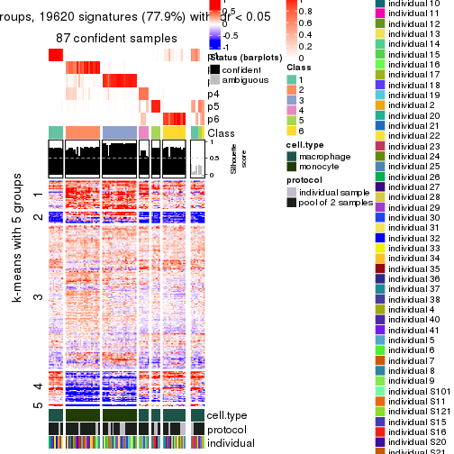</p>

</div>
</div>


Compare the overlap of signatures from different k:

```r
compare_signatures(res)
```


`get_signature()` returns a data frame invisibly. TO get the list of signatures, the function
call should be assigned to a variable explicitly. In following code, if `plot` argument is set
to `FALSE`, no heatmap is plotted while only the differential analysis is performed.

```r
# code only for demonstration
tb = get_signature(res, k = ..., plot = FALSE)
```

An example of the output of `tb` is:

```
#>   which_row         fdr    mean_1    mean_2 scaled_mean_1 scaled_mean_2 km
#> 1        38 0.042760348  8.373488  9.131774    -0.5533452     0.5164555  1
#> 2        40 0.018707592  7.106213  8.469186    -0.6173731     0.5762149  1
#> 3        55 0.019134737 10.221463 11.207825    -0.6159697     0.5749050  1
#> 4        59 0.006059896  5.921854  7.869574    -0.6899429     0.6439467  1
#> 5        60 0.018055526  8.928898 10.211722    -0.6204761     0.5791110  1
#> 6        98 0.009384629 15.714769 14.887706     0.6635654    -0.6193277  2
...
```

The columns in `tb` are:

1. `which_row`: row indices corresponding to the input matrix.
2. `fdr`: FDR for the differential test. 
3. `mean_x`: The mean value in group x.
4. `scaled_mean_x`: The mean value in group x after rows are scaled.
5. `km`: Row groups if k-means clustering is applied to rows.


UMAP plot which shows how samples are separated.


<script>
$( function() {
	$( '#tabs-SD-pam-dimension-reduction' ).tabs();
} );
</script>
<div id='tabs-SD-pam-dimension-reduction'>
<ul>
<li><a href='#tab-SD-pam-dimension-reduction-1'>k = 2</a></li>
<li><a href='#tab-SD-pam-dimension-reduction-2'>k = 3</a></li>
<li><a href='#tab-SD-pam-dimension-reduction-3'>k = 4</a></li>
<li><a href='#tab-SD-pam-dimension-reduction-4'>k = 5</a></li>
<li><a href='#tab-SD-pam-dimension-reduction-5'>k = 6</a></li>
</ul>
<div id='tab-SD-pam-dimension-reduction-1'>
<pre><code class="r">dimension_reduction(res, k = 2, method = &quot;UMAP&quot;)
</code></pre>

<p></p>

</div>
<div id='tab-SD-pam-dimension-reduction-2'>
<pre><code class="r">dimension_reduction(res, k = 3, method = &quot;UMAP&quot;)
</code></pre>

<p></p>

</div>
<div id='tab-SD-pam-dimension-reduction-3'>
<pre><code class="r">dimension_reduction(res, k = 4, method = &quot;UMAP&quot;)
</code></pre>

<p></p>

</div>
<div id='tab-SD-pam-dimension-reduction-4'>
<pre><code class="r">dimension_reduction(res, k = 5, method = &quot;UMAP&quot;)
</code></pre>

<p></p>

</div>
<div id='tab-SD-pam-dimension-reduction-5'>
<pre><code class="r">dimension_reduction(res, k = 6, method = &quot;UMAP&quot;)
</code></pre>

<p></p>

</div>
</div>


Following heatmap shows how subgroups are split when increasing `k`:

```r
collect_classes(res)
```


Test correlation between subgroups and known annotations. If the known
annotation is numeric, one-way ANOVA test is applied, and if the known
annotation is discrete, chi-squared contingency table test is applied.

```r
test_to_known_factors(res)
```

```
#>         n cell.type(p) protocol(p) individual(p) k
#> SD:pam 96     8.49e-22       1.000         1.000 2
#> SD:pam 96     1.43e-21       0.364         1.000 3
#> SD:pam 88     5.89e-19       0.571         0.994 4
#> SD:pam 93     3.03e-19       0.496         0.991 5
#> SD:pam 87     2.87e-17       0.285         0.985 6
```


If matrix rows can be associated to genes, consider to use `functional_enrichment(res,
...)` to perform function enrichment for the signature genes. See [this vignette](http://bioconductor.org/packages/devel/bioc/vignettes/cola/inst/doc/functional_enrichment.html) for more detailed explanations.


 

---------------------------------------------------


### SD:mclust**


The object with results only for a single top-value method and a single partition method 
can be extracted as:

```r
res = res_list["SD", "mclust"]
# you can also extract it by
# res = res_list["SD:mclust"]
```

A summary of `res` and all the functions that can be applied to it:

```r
res
```

```
#> A 'ConsensusPartition' object with k = 2, 3, 4, 5, 6.
#>   On a matrix with 25171 rows and 96 columns.
#>   Top rows (1000, 2000, 3000, 4000, 5000) are extracted by 'SD' method.
#>   Subgroups are detected by 'mclust' method.
#>   Performed in total 1250 partitions by row resampling.
#>   Best k for subgroups seems to be 2.
#> 
#> Following methods can be applied to this 'ConsensusPartition' object:
#>  [1] "cola_report"             "collect_classes"         "collect_plots"          
#>  [4] "collect_stats"           "colnames"                "compare_signatures"     
#>  [7] "consensus_heatmap"       "dimension_reduction"     "functional_enrichment"  
#> [10] "get_anno_col"            "get_anno"                "get_classes"            
#> [13] "get_consensus"           "get_matrix"              "get_membership"         
#> [16] "get_param"               "get_signatures"          "get_stats"              
#> [19] "is_best_k"               "is_stable_k"             "membership_heatmap"     
#> [22] "ncol"                    "nrow"                    "plot_ecdf"              
#> [25] "rownames"                "select_partition_number" "show"                   
#> [28] "suggest_best_k"          "test_to_known_factors"
```

`collect_plots()` function collects all the plots made from `res` for all `k` (number of partitions)
into one single page to provide an easy and fast comparison between different `k`.

```r
collect_plots(res)
```


The plots are:

- The first row: a plot of the ECDF (empirical cumulative distribution
  function) curves of the consensus matrix for each `k` and the heatmap of
  predicted classes for each `k`.
- The second row: heatmaps of the consensus matrix for each `k`.
- The third row: heatmaps of the membership matrix for each `k`.
- The fouth row: heatmaps of the signatures for each `k`.

All the plots in panels can be made by individual functions and they are
plotted later in this section.

`select_partition_number()` produces several plots showing different
statistics for choosing "optimized" `k`. There are following statistics:

- ECDF curves of the consensus matrix for each `k`;
- 1-PAC. [The PAC
  score](https://en.wikipedia.org/wiki/Consensus_clustering#Over-interpretation_potential_of_consensus_clustering)
  measures the proportion of the ambiguous subgrouping.
- Mean silhouette score.
- Concordance. The mean probability of fiting the consensus class ids in all
  partitions.
- Area increased. Denote $A_k$ as the area under the ECDF curve for current
  `k`, the area increased is defined as $A_k - A_{k-1}$.
- Rand index. The percent of pairs of samples that are both in a same cluster
  or both are not in a same cluster in the partition of k and k-1.
- Jaccard index. The ratio of pairs of samples are both in a same cluster in
  the partition of k and k-1 and the pairs of samples are both in a same
  cluster in the partition k or k-1.

The detailed explanations of these statistics can be found in [the _cola_
vignette](http://bioconductor.org/packages/devel/bioc/vignettes/cola/inst/doc/cola.html#toc_13).

Generally speaking, lower PAC score, higher mean silhouette score or higher
concordance corresponds to better partition. Rand index and Jaccard index
measure how similar the current partition is compared to partition with `k-1`.
If they are too similar, we won't accept `k` is better than `k-1`.

```r
select_partition_number(res)
```


The numeric values for all these statistics can be obtained by `get_stats()`.

```r
get_stats(res)
```

```
#>   k 1-PAC mean_silhouette concordance area_increased  Rand Jaccard
#> 2 2 1.000           1.000       1.000         0.5058 0.495   0.495
#> 3 3 0.698           0.763       0.850         0.1979 0.945   0.888
#> 4 4 0.730           0.809       0.852         0.1731 0.801   0.565
#> 5 5 0.597           0.575       0.700         0.0661 0.933   0.774
#> 6 6 0.706           0.621       0.732         0.0668 0.872   0.547
```

`suggest_best_k()` suggests the best $k$ based on these statistics. The rules are as follows:

- All $k$ with Jaccard index larger than 0.95 are removed because increasing
  $k$ does not provide enough extra information. If all $k$ are removed, it is
  marked as no subgroup is detected.
- For all $k$ with 1-PAC score larger than 0.9, the maximal $k$ is taken as
  the best $k$, and other $k$ are marked as optional $k$.
- If it does not fit the second rule. The $k$ with the maximal vote of the
  highest 1-PAC score, highest mean silhouette, and highest concordance is
  taken as the best $k$.

```r
suggest_best_k(res)
```

```
#> [1] 2
```


Following shows the table of the partitions (You need to click the **show/hide
code output** link to see it). The membership matrix (columns with name `p*`)
is inferred by
[`clue::cl_consensus()`](https://www.rdocumentation.org/link/cl_consensus?package=clue)
function with the `SE` method. Basically the value in the membership matrix
represents the probability to belong to a certain group. The finall class
label for an item is determined with the group with highest probability it
belongs to.

In `get_classes()` function, the entropy is calculated from the membership
matrix and the silhouette score is calculated from the consensus matrix.


<script>
$( function() {
	$( '#tabs-SD-mclust-get-classes' ).tabs();
} );
</script>
<div id='tabs-SD-mclust-get-classes'>
<ul>
<li><a href='#tab-SD-mclust-get-classes-1'>k = 2</a></li>
<li><a href='#tab-SD-mclust-get-classes-2'>k = 3</a></li>
<li><a href='#tab-SD-mclust-get-classes-3'>k = 4</a></li>
<li><a href='#tab-SD-mclust-get-classes-4'>k = 5</a></li>
<li><a href='#tab-SD-mclust-get-classes-5'>k = 6</a></li>
</ul>

<div id='tab-SD-mclust-get-classes-1'>
<p><a id='tab-SD-mclust-get-classes-1-a' style='color:#0366d6' href='#'>show/hide code output</a></p>
<pre><code class="r">cbind(get_classes(res, k = 2), get_membership(res, k = 2))
</code></pre>

<pre><code>#&gt;           class entropy silhouette p1 p2
#&gt; GSM257886     1       0          1  1  0
#&gt; GSM257888     1       0          1  1  0
#&gt; GSM257890     1       0          1  1  0
#&gt; GSM257892     1       0          1  1  0
#&gt; GSM257894     1       0          1  1  0
#&gt; GSM257896     1       0          1  1  0
#&gt; GSM257898     1       0          1  1  0
#&gt; GSM257900     1       0          1  1  0
#&gt; GSM257902     1       0          1  1  0
#&gt; GSM257904     1       0          1  1  0
#&gt; GSM257906     1       0          1  1  0
#&gt; GSM257908     1       0          1  1  0
#&gt; GSM257910     1       0          1  1  0
#&gt; GSM257912     1       0          1  1  0
#&gt; GSM257914     1       0          1  1  0
#&gt; GSM257917     1       0          1  1  0
#&gt; GSM257919     1       0          1  1  0
#&gt; GSM257921     1       0          1  1  0
#&gt; GSM257923     1       0          1  1  0
#&gt; GSM257925     1       0          1  1  0
#&gt; GSM257927     1       0          1  1  0
#&gt; GSM257929     1       0          1  1  0
#&gt; GSM257937     1       0          1  1  0
#&gt; GSM257939     1       0          1  1  0
#&gt; GSM257941     1       0          1  1  0
#&gt; GSM257943     1       0          1  1  0
#&gt; GSM257945     1       0          1  1  0
#&gt; GSM257947     1       0          1  1  0
#&gt; GSM257949     1       0          1  1  0
#&gt; GSM257951     1       0          1  1  0
#&gt; GSM257953     1       0          1  1  0
#&gt; GSM257955     1       0          1  1  0
#&gt; GSM257958     1       0          1  1  0
#&gt; GSM257960     1       0          1  1  0
#&gt; GSM257962     1       0          1  1  0
#&gt; GSM257964     1       0          1  1  0
#&gt; GSM257966     1       0          1  1  0
#&gt; GSM257968     1       0          1  1  0
#&gt; GSM257970     1       0          1  1  0
#&gt; GSM257972     1       0          1  1  0
#&gt; GSM257977     1       0          1  1  0
#&gt; GSM257982     1       0          1  1  0
#&gt; GSM257984     1       0          1  1  0
#&gt; GSM257986     1       0          1  1  0
#&gt; GSM257990     1       0          1  1  0
#&gt; GSM257992     1       0          1  1  0
#&gt; GSM257996     1       0          1  1  0
#&gt; GSM258006     1       0          1  1  0
#&gt; GSM257887     2       0          1  0  1
#&gt; GSM257889     2       0          1  0  1
#&gt; GSM257891     2       0          1  0  1
#&gt; GSM257893     2       0          1  0  1
#&gt; GSM257895     2       0          1  0  1
#&gt; GSM257897     2       0          1  0  1
#&gt; GSM257899     2       0          1  0  1
#&gt; GSM257901     2       0          1  0  1
#&gt; GSM257903     2       0          1  0  1
#&gt; GSM257905     2       0          1  0  1
#&gt; GSM257907     2       0          1  0  1
#&gt; GSM257909     2       0          1  0  1
#&gt; GSM257911     2       0          1  0  1
#&gt; GSM257913     2       0          1  0  1
#&gt; GSM257916     2       0          1  0  1
#&gt; GSM257918     2       0          1  0  1
#&gt; GSM257920     2       0          1  0  1
#&gt; GSM257922     2       0          1  0  1
#&gt; GSM257924     2       0          1  0  1
#&gt; GSM257926     2       0          1  0  1
#&gt; GSM257928     2       0          1  0  1
#&gt; GSM257930     2       0          1  0  1
#&gt; GSM257938     2       0          1  0  1
#&gt; GSM257940     2       0          1  0  1
#&gt; GSM257942     2       0          1  0  1
#&gt; GSM257944     2       0          1  0  1
#&gt; GSM257946     2       0          1  0  1
#&gt; GSM257948     2       0          1  0  1
#&gt; GSM257950     2       0          1  0  1
#&gt; GSM257952     2       0          1  0  1
#&gt; GSM257954     2       0          1  0  1
#&gt; GSM257956     2       0          1  0  1
#&gt; GSM257959     2       0          1  0  1
#&gt; GSM257961     2       0          1  0  1
#&gt; GSM257963     2       0          1  0  1
#&gt; GSM257965     2       0          1  0  1
#&gt; GSM257967     2       0          1  0  1
#&gt; GSM257969     2       0          1  0  1
#&gt; GSM257971     2       0          1  0  1
#&gt; GSM257973     2       0          1  0  1
#&gt; GSM257981     2       0          1  0  1
#&gt; GSM257983     2       0          1  0  1
#&gt; GSM257985     2       0          1  0  1
#&gt; GSM257988     2       0          1  0  1
#&gt; GSM257991     2       0          1  0  1
#&gt; GSM257993     2       0          1  0  1
#&gt; GSM257994     2       0          1  0  1
#&gt; GSM257989     2       0          1  0  1
</code></pre>

<script>
$('#tab-SD-mclust-get-classes-1-a').parent().next().next().hide();
$('#tab-SD-mclust-get-classes-1-a').click(function(){
  $('#tab-SD-mclust-get-classes-1-a').parent().next().next().toggle();
  return(false);
});
</script>
</div>

<div id='tab-SD-mclust-get-classes-2'>
<p><a id='tab-SD-mclust-get-classes-2-a' style='color:#0366d6' href='#'>show/hide code output</a></p>
<pre><code class="r">cbind(get_classes(res, k = 3), get_membership(res, k = 3))
</code></pre>

<pre><code>#&gt;           class entropy silhouette    p1    p2    p3
#&gt; GSM257886     1  0.5785     0.8278 0.668 0.000 0.332
#&gt; GSM257888     1  0.5706     0.8235 0.680 0.000 0.320
#&gt; GSM257890     1  0.5706     0.8235 0.680 0.000 0.320
#&gt; GSM257892     1  0.5810     0.8260 0.664 0.000 0.336
#&gt; GSM257894     1  0.5529     0.8347 0.704 0.000 0.296
#&gt; GSM257896     1  0.5497     0.8395 0.708 0.000 0.292
#&gt; GSM257898     1  0.2878     0.8564 0.904 0.000 0.096
#&gt; GSM257900     1  0.2066     0.8610 0.940 0.000 0.060
#&gt; GSM257902     1  0.2448     0.8762 0.924 0.000 0.076
#&gt; GSM257904     1  0.3941     0.8680 0.844 0.000 0.156
#&gt; GSM257906     1  0.2878     0.8564 0.904 0.000 0.096
#&gt; GSM257908     1  0.5706     0.8235 0.680 0.000 0.320
#&gt; GSM257910     1  0.5706     0.8235 0.680 0.000 0.320
#&gt; GSM257912     1  0.5706     0.8235 0.680 0.000 0.320
#&gt; GSM257914     1  0.5706     0.8235 0.680 0.000 0.320
#&gt; GSM257917     1  0.5706     0.8235 0.680 0.000 0.320
#&gt; GSM257919     1  0.5706     0.8235 0.680 0.000 0.320
#&gt; GSM257921     1  0.3412     0.8724 0.876 0.000 0.124
#&gt; GSM257923     1  0.1964     0.8664 0.944 0.000 0.056
#&gt; GSM257925     1  0.1529     0.8655 0.960 0.000 0.040
#&gt; GSM257927     1  0.1529     0.8666 0.960 0.000 0.040
#&gt; GSM257929     1  0.1643     0.8657 0.956 0.000 0.044
#&gt; GSM257937     1  0.5706     0.8235 0.680 0.000 0.320
#&gt; GSM257939     1  0.1964     0.8664 0.944 0.000 0.056
#&gt; GSM257941     1  0.2356     0.8573 0.928 0.000 0.072
#&gt; GSM257943     1  0.3038     0.8543 0.896 0.000 0.104
#&gt; GSM257945     1  0.3116     0.8531 0.892 0.000 0.108
#&gt; GSM257947     1  0.1753     0.8660 0.952 0.000 0.048
#&gt; GSM257949     1  0.4235     0.8651 0.824 0.000 0.176
#&gt; GSM257951     1  0.1411     0.8651 0.964 0.000 0.036
#&gt; GSM257953     1  0.2261     0.8666 0.932 0.000 0.068
#&gt; GSM257955     1  0.1411     0.8651 0.964 0.000 0.036
#&gt; GSM257958     1  0.1529     0.8645 0.960 0.000 0.040
#&gt; GSM257960     1  0.2356     0.8646 0.928 0.000 0.072
#&gt; GSM257962     1  0.1411     0.8675 0.964 0.000 0.036
#&gt; GSM257964     1  0.2625     0.8746 0.916 0.000 0.084
#&gt; GSM257966     1  0.5706     0.8235 0.680 0.000 0.320
#&gt; GSM257968     1  0.5650     0.8286 0.688 0.000 0.312
#&gt; GSM257970     1  0.1411     0.8651 0.964 0.000 0.036
#&gt; GSM257972     1  0.2537     0.8759 0.920 0.000 0.080
#&gt; GSM257977     1  0.5560     0.8349 0.700 0.000 0.300
#&gt; GSM257982     1  0.5497     0.8395 0.708 0.000 0.292
#&gt; GSM257984     1  0.3482     0.8709 0.872 0.000 0.128
#&gt; GSM257986     1  0.3412     0.8716 0.876 0.000 0.124
#&gt; GSM257990     1  0.2066     0.8619 0.940 0.000 0.060
#&gt; GSM257992     1  0.3879     0.8567 0.848 0.000 0.152
#&gt; GSM257996     1  0.3941     0.8675 0.844 0.000 0.156
#&gt; GSM258006     1  0.3879     0.8567 0.848 0.000 0.152
#&gt; GSM257887     2  0.0237     0.8350 0.000 0.996 0.004
#&gt; GSM257889     2  0.5988    -0.3284 0.000 0.632 0.368
#&gt; GSM257891     3  0.6267     0.9598 0.000 0.452 0.548
#&gt; GSM257893     2  0.2959     0.7615 0.000 0.900 0.100
#&gt; GSM257895     2  0.0000     0.8364 0.000 1.000 0.000
#&gt; GSM257897     3  0.6225     0.9680 0.000 0.432 0.568
#&gt; GSM257899     3  0.6225     0.9680 0.000 0.432 0.568
#&gt; GSM257901     2  0.2959     0.7595 0.000 0.900 0.100
#&gt; GSM257903     2  0.0000     0.8364 0.000 1.000 0.000
#&gt; GSM257905     2  0.0000     0.8364 0.000 1.000 0.000
#&gt; GSM257907     2  0.3752     0.6827 0.000 0.856 0.144
#&gt; GSM257909     2  0.0000     0.8364 0.000 1.000 0.000
#&gt; GSM257911     2  0.2537     0.7779 0.000 0.920 0.080
#&gt; GSM257913     2  0.2625     0.7735 0.000 0.916 0.084
#&gt; GSM257916     2  0.0000     0.8364 0.000 1.000 0.000
#&gt; GSM257918     2  0.0237     0.8350 0.000 0.996 0.004
#&gt; GSM257920     2  0.5529     0.0977 0.000 0.704 0.296
#&gt; GSM257922     2  0.6267    -0.7055 0.000 0.548 0.452
#&gt; GSM257924     2  0.2537     0.7776 0.000 0.920 0.080
#&gt; GSM257926     2  0.2878     0.7611 0.000 0.904 0.096
#&gt; GSM257928     2  0.0592     0.8289 0.000 0.988 0.012
#&gt; GSM257930     2  0.0237     0.8350 0.000 0.996 0.004
#&gt; GSM257938     2  0.0000     0.8364 0.000 1.000 0.000
#&gt; GSM257940     2  0.5810    -0.1777 0.000 0.664 0.336
#&gt; GSM257942     2  0.0000     0.8364 0.000 1.000 0.000
#&gt; GSM257944     2  0.0000     0.8364 0.000 1.000 0.000
#&gt; GSM257946     2  0.4654     0.5021 0.000 0.792 0.208
#&gt; GSM257948     2  0.3551     0.7022 0.000 0.868 0.132
#&gt; GSM257950     3  0.6267     0.9615 0.000 0.452 0.548
#&gt; GSM257952     2  0.0892     0.8275 0.000 0.980 0.020
#&gt; GSM257954     2  0.0000     0.8364 0.000 1.000 0.000
#&gt; GSM257956     2  0.0000     0.8364 0.000 1.000 0.000
#&gt; GSM257959     2  0.0000     0.8364 0.000 1.000 0.000
#&gt; GSM257961     2  0.0237     0.8350 0.000 0.996 0.004
#&gt; GSM257963     2  0.0000     0.8364 0.000 1.000 0.000
#&gt; GSM257965     2  0.0237     0.8356 0.000 0.996 0.004
#&gt; GSM257967     2  0.0000     0.8364 0.000 1.000 0.000
#&gt; GSM257969     2  0.0000     0.8364 0.000 1.000 0.000
#&gt; GSM257971     2  0.2625     0.7799 0.000 0.916 0.084
#&gt; GSM257973     2  0.3116     0.7432 0.000 0.892 0.108
#&gt; GSM257981     2  0.0592     0.8330 0.000 0.988 0.012
#&gt; GSM257983     3  0.6225     0.9680 0.000 0.432 0.568
#&gt; GSM257985     2  0.6111    -0.4804 0.000 0.604 0.396
#&gt; GSM257988     3  0.6286     0.9404 0.000 0.464 0.536
#&gt; GSM257991     2  0.0592     0.8330 0.000 0.988 0.012
#&gt; GSM257993     2  0.0000     0.8364 0.000 1.000 0.000
#&gt; GSM257994     2  0.0000     0.8364 0.000 1.000 0.000
#&gt; GSM257989     2  0.6280    -0.7270 0.000 0.540 0.460
</code></pre>

<script>
$('#tab-SD-mclust-get-classes-2-a').parent().next().next().hide();
$('#tab-SD-mclust-get-classes-2-a').click(function(){
  $('#tab-SD-mclust-get-classes-2-a').parent().next().next().toggle();
  return(false);
});
</script>
</div>

<div id='tab-SD-mclust-get-classes-3'>
<p><a id='tab-SD-mclust-get-classes-3-a' style='color:#0366d6' href='#'>show/hide code output</a></p>
<pre><code class="r">cbind(get_classes(res, k = 4), get_membership(res, k = 4))
</code></pre>

<pre><code>#&gt;           class entropy silhouette    p1    p2    p3    p4
#&gt; GSM257886     1  0.5028     0.5729 0.596 0.000 0.004 0.400
#&gt; GSM257888     4  0.4830     0.9879 0.392 0.000 0.000 0.608
#&gt; GSM257890     4  0.4843     0.9861 0.396 0.000 0.000 0.604
#&gt; GSM257892     1  0.5028     0.5729 0.596 0.000 0.004 0.400
#&gt; GSM257894     4  0.4855     0.9830 0.400 0.000 0.000 0.600
#&gt; GSM257896     1  0.4040     0.6608 0.752 0.000 0.000 0.248
#&gt; GSM257898     1  0.4991     0.5829 0.608 0.000 0.004 0.388
#&gt; GSM257900     1  0.0817     0.7876 0.976 0.000 0.000 0.024
#&gt; GSM257902     1  0.0469     0.7821 0.988 0.000 0.000 0.012
#&gt; GSM257904     1  0.4991     0.5829 0.608 0.000 0.004 0.388
#&gt; GSM257906     1  0.4991     0.5829 0.608 0.000 0.004 0.388
#&gt; GSM257908     4  0.4790     0.9880 0.380 0.000 0.000 0.620
#&gt; GSM257910     4  0.4790     0.9880 0.380 0.000 0.000 0.620
#&gt; GSM257912     4  0.4790     0.9880 0.380 0.000 0.000 0.620
#&gt; GSM257914     4  0.4790     0.9880 0.380 0.000 0.000 0.620
#&gt; GSM257917     4  0.4817     0.9879 0.388 0.000 0.000 0.612
#&gt; GSM257919     4  0.4790     0.9880 0.380 0.000 0.000 0.620
#&gt; GSM257921     1  0.0592     0.7856 0.984 0.000 0.000 0.016
#&gt; GSM257923     1  0.0000     0.7881 1.000 0.000 0.000 0.000
#&gt; GSM257925     1  0.0188     0.7883 0.996 0.000 0.000 0.004
#&gt; GSM257927     1  0.0336     0.7884 0.992 0.000 0.000 0.008
#&gt; GSM257929     1  0.0336     0.7871 0.992 0.000 0.000 0.008
#&gt; GSM257937     4  0.4843     0.9861 0.396 0.000 0.000 0.604
#&gt; GSM257939     1  0.0000     0.7881 1.000 0.000 0.000 0.000
#&gt; GSM257941     1  0.1302     0.7791 0.956 0.000 0.000 0.044
#&gt; GSM257943     1  0.4830     0.5842 0.608 0.000 0.000 0.392
#&gt; GSM257945     1  0.4843     0.5827 0.604 0.000 0.000 0.396
#&gt; GSM257947     1  0.0000     0.7881 1.000 0.000 0.000 0.000
#&gt; GSM257949     1  0.0000     0.7881 1.000 0.000 0.000 0.000
#&gt; GSM257951     1  0.0336     0.7871 0.992 0.000 0.000 0.008
#&gt; GSM257953     1  0.0592     0.7858 0.984 0.000 0.000 0.016
#&gt; GSM257955     1  0.0336     0.7854 0.992 0.000 0.000 0.008
#&gt; GSM257958     1  0.0469     0.7884 0.988 0.000 0.000 0.012
#&gt; GSM257960     1  0.1118     0.7828 0.964 0.000 0.000 0.036
#&gt; GSM257962     1  0.0592     0.7887 0.984 0.000 0.000 0.016
#&gt; GSM257964     1  0.0000     0.7881 1.000 0.000 0.000 0.000
#&gt; GSM257966     4  0.4830     0.9879 0.392 0.000 0.000 0.608
#&gt; GSM257968     4  0.4866     0.9805 0.404 0.000 0.000 0.596
#&gt; GSM257970     1  0.0188     0.7873 0.996 0.000 0.000 0.004
#&gt; GSM257972     1  0.0188     0.7871 0.996 0.000 0.000 0.004
#&gt; GSM257977     1  0.4999    -0.7599 0.508 0.000 0.000 0.492
#&gt; GSM257982     1  0.3024     0.7203 0.852 0.000 0.000 0.148
#&gt; GSM257984     1  0.0000     0.7881 1.000 0.000 0.000 0.000
#&gt; GSM257986     1  0.0592     0.7820 0.984 0.000 0.000 0.016
#&gt; GSM257990     1  0.0336     0.7884 0.992 0.000 0.000 0.008
#&gt; GSM257992     1  0.4978     0.5834 0.612 0.000 0.004 0.384
#&gt; GSM257996     1  0.1637     0.7174 0.940 0.000 0.000 0.060
#&gt; GSM258006     1  0.4817     0.5849 0.612 0.000 0.000 0.388
#&gt; GSM257887     2  0.0000     0.9292 0.000 1.000 0.000 0.000
#&gt; GSM257889     3  0.3219     0.8963 0.000 0.164 0.836 0.000
#&gt; GSM257891     3  0.0921     0.8513 0.000 0.028 0.972 0.000
#&gt; GSM257893     3  0.4164     0.8144 0.000 0.264 0.736 0.000
#&gt; GSM257895     2  0.0000     0.9292 0.000 1.000 0.000 0.000
#&gt; GSM257897     3  0.0188     0.8351 0.000 0.004 0.996 0.000
#&gt; GSM257899     3  0.0188     0.8351 0.000 0.004 0.996 0.000
#&gt; GSM257901     3  0.3444     0.8927 0.000 0.184 0.816 0.000
#&gt; GSM257903     2  0.0000     0.9292 0.000 1.000 0.000 0.000
#&gt; GSM257905     2  0.0000     0.9292 0.000 1.000 0.000 0.000
#&gt; GSM257907     3  0.3123     0.8960 0.000 0.156 0.844 0.000
#&gt; GSM257909     2  0.0000     0.9292 0.000 1.000 0.000 0.000
#&gt; GSM257911     2  0.4008     0.6409 0.000 0.756 0.244 0.000
#&gt; GSM257913     2  0.3975     0.6482 0.000 0.760 0.240 0.000
#&gt; GSM257916     2  0.0000     0.9292 0.000 1.000 0.000 0.000
#&gt; GSM257918     2  0.0000     0.9292 0.000 1.000 0.000 0.000
#&gt; GSM257920     3  0.3726     0.8782 0.000 0.212 0.788 0.000
#&gt; GSM257922     3  0.3024     0.8946 0.000 0.148 0.852 0.000
#&gt; GSM257924     2  0.4955    -0.0107 0.000 0.556 0.444 0.000
#&gt; GSM257926     3  0.4304     0.7831 0.000 0.284 0.716 0.000
#&gt; GSM257928     2  0.0188     0.9265 0.000 0.996 0.004 0.000
#&gt; GSM257930     2  0.0188     0.9265 0.000 0.996 0.004 0.000
#&gt; GSM257938     2  0.0188     0.9265 0.000 0.996 0.004 0.000
#&gt; GSM257940     3  0.3486     0.8914 0.000 0.188 0.812 0.000
#&gt; GSM257942     2  0.0000     0.9292 0.000 1.000 0.000 0.000
#&gt; GSM257944     2  0.0000     0.9292 0.000 1.000 0.000 0.000
#&gt; GSM257946     3  0.3610     0.8856 0.000 0.200 0.800 0.000
#&gt; GSM257948     3  0.3688     0.8809 0.000 0.208 0.792 0.000
#&gt; GSM257950     3  0.0921     0.8512 0.000 0.028 0.972 0.000
#&gt; GSM257952     2  0.3837     0.6772 0.000 0.776 0.224 0.000
#&gt; GSM257954     2  0.0000     0.9292 0.000 1.000 0.000 0.000
#&gt; GSM257956     2  0.0000     0.9292 0.000 1.000 0.000 0.000
#&gt; GSM257959     2  0.0000     0.9292 0.000 1.000 0.000 0.000
#&gt; GSM257961     2  0.0000     0.9292 0.000 1.000 0.000 0.000
#&gt; GSM257963     2  0.0000     0.9292 0.000 1.000 0.000 0.000
#&gt; GSM257965     2  0.0817     0.9116 0.000 0.976 0.024 0.000
#&gt; GSM257967     2  0.0000     0.9292 0.000 1.000 0.000 0.000
#&gt; GSM257969     2  0.0000     0.9292 0.000 1.000 0.000 0.000
#&gt; GSM257971     3  0.3801     0.8709 0.000 0.220 0.780 0.000
#&gt; GSM257973     3  0.3764     0.8749 0.000 0.216 0.784 0.000
#&gt; GSM257981     2  0.3074     0.7815 0.000 0.848 0.152 0.000
#&gt; GSM257983     3  0.0188     0.8351 0.000 0.004 0.996 0.000
#&gt; GSM257985     3  0.3266     0.8961 0.000 0.168 0.832 0.000
#&gt; GSM257988     3  0.0817     0.8489 0.000 0.024 0.976 0.000
#&gt; GSM257991     2  0.3486     0.7324 0.000 0.812 0.188 0.000
#&gt; GSM257993     2  0.0000     0.9292 0.000 1.000 0.000 0.000
#&gt; GSM257994     2  0.0188     0.9265 0.000 0.996 0.004 0.000
#&gt; GSM257989     3  0.2281     0.8794 0.000 0.096 0.904 0.000
</code></pre>

<script>
$('#tab-SD-mclust-get-classes-3-a').parent().next().next().hide();
$('#tab-SD-mclust-get-classes-3-a').click(function(){
  $('#tab-SD-mclust-get-classes-3-a').parent().next().next().toggle();
  return(false);
});
</script>
</div>

<div id='tab-SD-mclust-get-classes-4'>
<p><a id='tab-SD-mclust-get-classes-4-a' style='color:#0366d6' href='#'>show/hide code output</a></p>
<pre><code class="r">cbind(get_classes(res, k = 5), get_membership(res, k = 5))
</code></pre>

<pre><code>#&gt;           class entropy silhouette    p1    p2    p3    p4    p5
#&gt; GSM257886     1  0.6202     0.2985 0.484 0.000 0.000 0.372 0.144
#&gt; GSM257888     4  0.3183     0.8574 0.156 0.000 0.000 0.828 0.016
#&gt; GSM257890     4  0.3399     0.8472 0.168 0.000 0.000 0.812 0.020
#&gt; GSM257892     1  0.6232     0.2880 0.480 0.000 0.000 0.372 0.148
#&gt; GSM257894     4  0.3160     0.8346 0.188 0.000 0.000 0.808 0.004
#&gt; GSM257896     1  0.4734     0.3220 0.604 0.000 0.000 0.372 0.024
#&gt; GSM257898     1  0.5475     0.5670 0.644 0.000 0.000 0.232 0.124
#&gt; GSM257900     1  0.0510     0.7684 0.984 0.000 0.000 0.016 0.000
#&gt; GSM257902     1  0.2471     0.7671 0.864 0.000 0.000 0.136 0.000
#&gt; GSM257904     1  0.5500     0.5645 0.640 0.000 0.000 0.236 0.124
#&gt; GSM257906     1  0.5500     0.5645 0.640 0.000 0.000 0.236 0.124
#&gt; GSM257908     4  0.2708     0.8711 0.072 0.000 0.000 0.884 0.044
#&gt; GSM257910     4  0.2645     0.8707 0.068 0.000 0.000 0.888 0.044
#&gt; GSM257912     4  0.2645     0.8707 0.068 0.000 0.000 0.888 0.044
#&gt; GSM257914     4  0.2645     0.8707 0.068 0.000 0.000 0.888 0.044
#&gt; GSM257917     4  0.2645     0.8707 0.068 0.000 0.000 0.888 0.044
#&gt; GSM257919     4  0.2645     0.8707 0.068 0.000 0.000 0.888 0.044
#&gt; GSM257921     1  0.4096     0.7017 0.760 0.000 0.000 0.200 0.040
#&gt; GSM257923     1  0.1965     0.7751 0.904 0.000 0.000 0.096 0.000
#&gt; GSM257925     1  0.1908     0.7762 0.908 0.000 0.000 0.092 0.000
#&gt; GSM257927     1  0.0510     0.7698 0.984 0.000 0.000 0.016 0.000
#&gt; GSM257929     1  0.1908     0.7762 0.908 0.000 0.000 0.092 0.000
#&gt; GSM257937     4  0.3319     0.8543 0.160 0.000 0.000 0.820 0.020
#&gt; GSM257939     1  0.1908     0.7760 0.908 0.000 0.000 0.092 0.000
#&gt; GSM257941     1  0.1121     0.7645 0.956 0.000 0.000 0.044 0.000
#&gt; GSM257943     1  0.4666     0.6412 0.732 0.000 0.000 0.180 0.088
#&gt; GSM257945     1  0.5072     0.6156 0.696 0.000 0.000 0.188 0.116
#&gt; GSM257947     1  0.1908     0.7760 0.908 0.000 0.000 0.092 0.000
#&gt; GSM257949     1  0.2230     0.7700 0.884 0.000 0.000 0.116 0.000
#&gt; GSM257951     1  0.1965     0.7766 0.904 0.000 0.000 0.096 0.000
#&gt; GSM257953     1  0.0955     0.7727 0.968 0.000 0.000 0.028 0.004
#&gt; GSM257955     1  0.1965     0.7776 0.904 0.000 0.000 0.096 0.000
#&gt; GSM257958     1  0.1908     0.7762 0.908 0.000 0.000 0.092 0.000
#&gt; GSM257960     1  0.2124     0.7410 0.900 0.000 0.000 0.096 0.004
#&gt; GSM257962     1  0.0880     0.7674 0.968 0.000 0.000 0.032 0.000
#&gt; GSM257964     1  0.2389     0.7711 0.880 0.000 0.000 0.116 0.004
#&gt; GSM257966     4  0.2920     0.8646 0.132 0.000 0.000 0.852 0.016
#&gt; GSM257968     4  0.3882     0.7978 0.224 0.000 0.000 0.756 0.020
#&gt; GSM257970     1  0.2020     0.7755 0.900 0.000 0.000 0.100 0.000
#&gt; GSM257972     1  0.2074     0.7757 0.896 0.000 0.000 0.104 0.000
#&gt; GSM257977     4  0.4815     0.1518 0.456 0.000 0.000 0.524 0.020
#&gt; GSM257982     1  0.4709     0.3401 0.612 0.000 0.000 0.364 0.024
#&gt; GSM257984     1  0.3521     0.7300 0.820 0.000 0.000 0.140 0.040
#&gt; GSM257986     1  0.3531     0.7301 0.816 0.000 0.000 0.148 0.036
#&gt; GSM257990     1  0.1043     0.7763 0.960 0.000 0.000 0.040 0.000
#&gt; GSM257992     1  0.5516     0.5640 0.640 0.000 0.000 0.232 0.128
#&gt; GSM257996     1  0.3848     0.6888 0.788 0.000 0.000 0.172 0.040
#&gt; GSM258006     1  0.5475     0.5670 0.644 0.000 0.000 0.232 0.124
#&gt; GSM257887     2  0.4548     0.6238 0.000 0.752 0.120 0.000 0.128
#&gt; GSM257889     3  0.6188    -0.3680 0.000 0.144 0.492 0.000 0.364
#&gt; GSM257891     3  0.3409     0.2037 0.000 0.024 0.816 0.000 0.160
#&gt; GSM257893     3  0.6531     0.1650 0.000 0.336 0.456 0.000 0.208
#&gt; GSM257895     2  0.5210     0.5332 0.000 0.652 0.084 0.000 0.264
#&gt; GSM257897     5  0.4283     0.8672 0.000 0.000 0.456 0.000 0.544
#&gt; GSM257899     5  0.4283     0.8672 0.000 0.000 0.456 0.000 0.544
#&gt; GSM257901     3  0.2293     0.5680 0.000 0.084 0.900 0.000 0.016
#&gt; GSM257903     2  0.3707     0.5477 0.000 0.716 0.284 0.000 0.000
#&gt; GSM257905     2  0.3177     0.6092 0.000 0.792 0.208 0.000 0.000
#&gt; GSM257907     3  0.2362     0.5626 0.000 0.076 0.900 0.000 0.024
#&gt; GSM257909     2  0.3661     0.5562 0.000 0.724 0.276 0.000 0.000
#&gt; GSM257911     3  0.3884     0.4617 0.000 0.288 0.708 0.000 0.004
#&gt; GSM257913     3  0.3421     0.5634 0.000 0.204 0.788 0.000 0.008
#&gt; GSM257916     2  0.3550     0.5951 0.000 0.760 0.236 0.000 0.004
#&gt; GSM257918     2  0.3398     0.6040 0.000 0.780 0.216 0.000 0.004
#&gt; GSM257920     3  0.2616     0.5689 0.000 0.100 0.880 0.000 0.020
#&gt; GSM257922     5  0.6095     0.4542 0.000 0.124 0.416 0.000 0.460
#&gt; GSM257924     3  0.4841     0.3333 0.000 0.416 0.560 0.000 0.024
#&gt; GSM257926     3  0.3602     0.5666 0.000 0.180 0.796 0.000 0.024
#&gt; GSM257928     2  0.5547     0.4701 0.000 0.644 0.148 0.000 0.208
#&gt; GSM257930     2  0.5187     0.5327 0.000 0.656 0.084 0.000 0.260
#&gt; GSM257938     2  0.5082     0.5385 0.000 0.664 0.076 0.000 0.260
#&gt; GSM257940     3  0.3622     0.5559 0.000 0.124 0.820 0.000 0.056
#&gt; GSM257942     2  0.3906     0.5391 0.000 0.704 0.292 0.000 0.004
#&gt; GSM257944     2  0.4138     0.3717 0.000 0.616 0.384 0.000 0.000
#&gt; GSM257946     3  0.4852     0.4306 0.000 0.184 0.716 0.000 0.100
#&gt; GSM257948     3  0.3051     0.5807 0.000 0.120 0.852 0.000 0.028
#&gt; GSM257950     3  0.4348    -0.4130 0.000 0.016 0.668 0.000 0.316
#&gt; GSM257952     3  0.4886     0.1082 0.000 0.448 0.528 0.000 0.024
#&gt; GSM257954     2  0.3720     0.5913 0.000 0.760 0.012 0.000 0.228
#&gt; GSM257956     2  0.3912     0.5931 0.000 0.752 0.020 0.000 0.228
#&gt; GSM257959     2  0.3242     0.6035 0.000 0.784 0.216 0.000 0.000
#&gt; GSM257961     2  0.0671     0.6237 0.000 0.980 0.016 0.000 0.004
#&gt; GSM257963     2  0.1341     0.6289 0.000 0.944 0.056 0.000 0.000
#&gt; GSM257965     2  0.4138     0.4013 0.000 0.616 0.384 0.000 0.000
#&gt; GSM257967     2  0.3534     0.5794 0.000 0.744 0.256 0.000 0.000
#&gt; GSM257969     2  0.4627     0.5706 0.000 0.732 0.080 0.000 0.188
#&gt; GSM257971     3  0.6645     0.1315 0.000 0.316 0.440 0.000 0.244
#&gt; GSM257973     3  0.3477     0.5532 0.000 0.112 0.832 0.000 0.056
#&gt; GSM257981     3  0.4283     0.0229 0.000 0.456 0.544 0.000 0.000
#&gt; GSM257983     5  0.4283     0.8672 0.000 0.000 0.456 0.000 0.544
#&gt; GSM257985     3  0.5348     0.2186 0.000 0.112 0.656 0.000 0.232
#&gt; GSM257988     3  0.4467    -0.4928 0.000 0.016 0.640 0.000 0.344
#&gt; GSM257991     2  0.4451     0.1126 0.000 0.504 0.492 0.000 0.004
#&gt; GSM257993     2  0.3671     0.5889 0.000 0.756 0.008 0.000 0.236
#&gt; GSM257994     2  0.5082     0.5385 0.000 0.664 0.076 0.000 0.260
#&gt; GSM257989     3  0.3164     0.3850 0.000 0.044 0.852 0.000 0.104
</code></pre>

<script>
$('#tab-SD-mclust-get-classes-4-a').parent().next().next().hide();
$('#tab-SD-mclust-get-classes-4-a').click(function(){
  $('#tab-SD-mclust-get-classes-4-a').parent().next().next().toggle();
  return(false);
});
</script>
</div>

<div id='tab-SD-mclust-get-classes-5'>
<p><a id='tab-SD-mclust-get-classes-5-a' style='color:#0366d6' href='#'>show/hide code output</a></p>
<pre><code class="r">cbind(get_classes(res, k = 6), get_membership(res, k = 6))
</code></pre>

<pre><code>#&gt;           class entropy silhouette    p1    p2    p3    p4    p5    p6
#&gt; GSM257886     6  0.4118     0.1049 0.004 0.000 0.000 0.396 0.008 0.592
#&gt; GSM257888     4  0.5875     0.3273 0.188 0.000 0.000 0.516 0.008 0.288
#&gt; GSM257890     4  0.5898     0.3258 0.192 0.000 0.000 0.512 0.008 0.288
#&gt; GSM257892     6  0.4118     0.1049 0.004 0.000 0.000 0.396 0.008 0.592
#&gt; GSM257894     1  0.5873     0.0992 0.444 0.000 0.000 0.204 0.000 0.352
#&gt; GSM257896     4  0.5201     0.1392 0.092 0.000 0.000 0.500 0.000 0.408
#&gt; GSM257898     6  0.3890     0.7889 0.400 0.000 0.000 0.004 0.000 0.596
#&gt; GSM257900     1  0.0622     0.7633 0.980 0.000 0.000 0.008 0.000 0.012
#&gt; GSM257902     1  0.1321     0.7628 0.952 0.000 0.000 0.020 0.004 0.024
#&gt; GSM257904     6  0.3765     0.7890 0.404 0.000 0.000 0.000 0.000 0.596
#&gt; GSM257906     6  0.3765     0.7890 0.404 0.000 0.000 0.000 0.000 0.596
#&gt; GSM257908     4  0.4403     0.4634 0.024 0.000 0.000 0.508 0.000 0.468
#&gt; GSM257910     4  0.4403     0.4634 0.024 0.000 0.000 0.508 0.000 0.468
#&gt; GSM257912     4  0.4533     0.4627 0.024 0.000 0.000 0.504 0.004 0.468
#&gt; GSM257914     4  0.4533     0.4627 0.024 0.000 0.000 0.504 0.004 0.468
#&gt; GSM257917     4  0.4834     0.4587 0.044 0.000 0.000 0.484 0.004 0.468
#&gt; GSM257919     4  0.4533     0.4627 0.024 0.000 0.000 0.504 0.004 0.468
#&gt; GSM257921     1  0.4083     0.4041 0.532 0.000 0.000 0.008 0.000 0.460
#&gt; GSM257923     1  0.2838     0.7145 0.808 0.000 0.000 0.000 0.004 0.188
#&gt; GSM257925     1  0.0146     0.7684 0.996 0.000 0.000 0.004 0.000 0.000
#&gt; GSM257927     1  0.0520     0.7638 0.984 0.000 0.000 0.008 0.000 0.008
#&gt; GSM257929     1  0.0508     0.7718 0.984 0.000 0.000 0.000 0.004 0.012
#&gt; GSM257937     4  0.5940     0.3207 0.200 0.000 0.000 0.504 0.008 0.288
#&gt; GSM257939     1  0.2558     0.7309 0.840 0.000 0.000 0.000 0.004 0.156
#&gt; GSM257941     1  0.1584     0.7094 0.928 0.000 0.000 0.008 0.000 0.064
#&gt; GSM257943     6  0.4328     0.7152 0.460 0.000 0.000 0.020 0.000 0.520
#&gt; GSM257945     6  0.3915     0.7840 0.412 0.000 0.000 0.004 0.000 0.584
#&gt; GSM257947     1  0.0405     0.7711 0.988 0.000 0.000 0.000 0.004 0.008
#&gt; GSM257949     1  0.3265     0.6751 0.748 0.000 0.000 0.000 0.004 0.248
#&gt; GSM257951     1  0.0146     0.7682 0.996 0.000 0.000 0.000 0.004 0.000
#&gt; GSM257953     1  0.1010     0.7478 0.960 0.000 0.000 0.036 0.000 0.004
#&gt; GSM257955     1  0.0146     0.7682 0.996 0.000 0.000 0.000 0.004 0.000
#&gt; GSM257958     1  0.0146     0.7706 0.996 0.000 0.000 0.000 0.000 0.004
#&gt; GSM257960     1  0.2357     0.6200 0.872 0.000 0.000 0.012 0.000 0.116
#&gt; GSM257962     1  0.0520     0.7638 0.984 0.000 0.000 0.008 0.000 0.008
#&gt; GSM257964     1  0.3795     0.5464 0.632 0.000 0.000 0.000 0.004 0.364
#&gt; GSM257966     4  0.5715     0.3245 0.160 0.000 0.000 0.540 0.008 0.292
#&gt; GSM257968     4  0.6261     0.2313 0.296 0.000 0.000 0.412 0.008 0.284
#&gt; GSM257970     1  0.1219     0.7689 0.948 0.000 0.000 0.000 0.004 0.048
#&gt; GSM257972     1  0.2740     0.7420 0.852 0.000 0.000 0.028 0.000 0.120
#&gt; GSM257977     4  0.6101     0.2793 0.228 0.000 0.000 0.464 0.008 0.300
#&gt; GSM257982     4  0.5494     0.2268 0.136 0.000 0.000 0.504 0.000 0.360
#&gt; GSM257984     1  0.3986     0.5229 0.608 0.000 0.000 0.004 0.004 0.384
#&gt; GSM257986     1  0.3986     0.5181 0.608 0.000 0.000 0.004 0.004 0.384
#&gt; GSM257990     1  0.0405     0.7662 0.988 0.000 0.000 0.008 0.000 0.004
#&gt; GSM257992     6  0.4238     0.7867 0.404 0.000 0.000 0.008 0.008 0.580
#&gt; GSM257996     1  0.3955     0.5220 0.608 0.000 0.000 0.008 0.000 0.384
#&gt; GSM258006     6  0.4524     0.7683 0.376 0.000 0.000 0.040 0.000 0.584
#&gt; GSM257887     2  0.3860     0.0892 0.000 0.528 0.000 0.000 0.472 0.000
#&gt; GSM257889     3  0.4214     0.7246 0.000 0.060 0.800 0.076 0.048 0.016
#&gt; GSM257891     3  0.4084     0.7179 0.000 0.040 0.808 0.076 0.060 0.016
#&gt; GSM257893     3  0.4040     0.7180 0.000 0.028 0.808 0.076 0.072 0.016
#&gt; GSM257895     5  0.1745     0.9601 0.000 0.068 0.012 0.000 0.920 0.000
#&gt; GSM257897     3  0.3281     0.6876 0.000 0.000 0.840 0.088 0.056 0.016
#&gt; GSM257899     3  0.3281     0.6876 0.000 0.000 0.840 0.088 0.056 0.016
#&gt; GSM257901     3  0.3862     0.5845 0.000 0.388 0.608 0.000 0.000 0.004
#&gt; GSM257903     2  0.0632     0.7404 0.000 0.976 0.000 0.000 0.024 0.000
#&gt; GSM257905     2  0.0790     0.7421 0.000 0.968 0.000 0.000 0.032 0.000
#&gt; GSM257907     3  0.3807     0.5996 0.000 0.368 0.628 0.000 0.000 0.004
#&gt; GSM257909     2  0.0790     0.7421 0.000 0.968 0.000 0.000 0.032 0.000
#&gt; GSM257911     3  0.3979     0.5136 0.000 0.456 0.540 0.000 0.000 0.004
#&gt; GSM257913     3  0.3857     0.4946 0.000 0.468 0.532 0.000 0.000 0.000
#&gt; GSM257916     2  0.2996     0.5973 0.000 0.772 0.000 0.000 0.228 0.000
#&gt; GSM257918     2  0.3351     0.5086 0.000 0.712 0.000 0.000 0.288 0.000
#&gt; GSM257920     3  0.3636     0.6337 0.000 0.320 0.676 0.000 0.000 0.004
#&gt; GSM257922     3  0.3812     0.7129 0.000 0.012 0.816 0.076 0.080 0.016
#&gt; GSM257924     3  0.4434     0.5375 0.000 0.428 0.544 0.000 0.028 0.000
#&gt; GSM257926     3  0.4093     0.5779 0.000 0.404 0.584 0.000 0.012 0.000
#&gt; GSM257928     5  0.2752     0.9078 0.000 0.052 0.024 0.044 0.880 0.000
#&gt; GSM257930     5  0.1745     0.9601 0.000 0.068 0.012 0.000 0.920 0.000
#&gt; GSM257938     5  0.1745     0.9601 0.000 0.068 0.012 0.000 0.920 0.000
#&gt; GSM257940     3  0.1644     0.7464 0.000 0.076 0.920 0.000 0.000 0.004
#&gt; GSM257942     2  0.0000     0.7308 0.000 1.000 0.000 0.000 0.000 0.000
#&gt; GSM257944     2  0.0790     0.7421 0.000 0.968 0.000 0.000 0.032 0.000
#&gt; GSM257946     3  0.1858     0.7470 0.000 0.092 0.904 0.000 0.004 0.000
#&gt; GSM257948     3  0.3830     0.5937 0.000 0.376 0.620 0.000 0.000 0.004
#&gt; GSM257950     3  0.0951     0.7407 0.000 0.020 0.968 0.000 0.008 0.004
#&gt; GSM257952     3  0.4403     0.4632 0.000 0.468 0.508 0.000 0.024 0.000
#&gt; GSM257954     5  0.1866     0.9558 0.000 0.084 0.008 0.000 0.908 0.000
#&gt; GSM257956     5  0.2266     0.9365 0.000 0.108 0.012 0.000 0.880 0.000
#&gt; GSM257959     2  0.2823     0.6379 0.000 0.796 0.000 0.000 0.204 0.000
#&gt; GSM257961     2  0.3659     0.3953 0.000 0.636 0.000 0.000 0.364 0.000
#&gt; GSM257963     2  0.3592     0.4297 0.000 0.656 0.000 0.000 0.344 0.000
#&gt; GSM257965     2  0.2631     0.5703 0.000 0.840 0.152 0.000 0.008 0.000
#&gt; GSM257967     2  0.0790     0.7421 0.000 0.968 0.000 0.000 0.032 0.000
#&gt; GSM257969     5  0.2877     0.8432 0.000 0.168 0.012 0.000 0.820 0.000
#&gt; GSM257971     3  0.4294     0.7004 0.000 0.028 0.788 0.076 0.092 0.016
#&gt; GSM257973     3  0.2838     0.7225 0.000 0.188 0.808 0.000 0.000 0.004
#&gt; GSM257981     2  0.4423    -0.2971 0.000 0.552 0.420 0.000 0.028 0.000
#&gt; GSM257983     3  0.3024     0.6909 0.000 0.000 0.856 0.088 0.040 0.016
#&gt; GSM257985     3  0.2263     0.7447 0.000 0.100 0.884 0.000 0.016 0.000
#&gt; GSM257988     3  0.0951     0.7407 0.000 0.020 0.968 0.000 0.008 0.004
#&gt; GSM257991     2  0.1863     0.6278 0.000 0.896 0.104 0.000 0.000 0.000
#&gt; GSM257993     5  0.1866     0.9558 0.000 0.084 0.008 0.000 0.908 0.000
#&gt; GSM257994     5  0.1745     0.9601 0.000 0.068 0.012 0.000 0.920 0.000
#&gt; GSM257989     3  0.1908     0.7454 0.000 0.096 0.900 0.000 0.000 0.004
</code></pre>

<script>
$('#tab-SD-mclust-get-classes-5-a').parent().next().next().hide();
$('#tab-SD-mclust-get-classes-5-a').click(function(){
  $('#tab-SD-mclust-get-classes-5-a').parent().next().next().toggle();
  return(false);
});
</script>
</div>
</div>

Heatmaps for the consensus matrix. It visualizes the probability of two
samples to be in a same group.


<script>
$( function() {
	$( '#tabs-SD-mclust-consensus-heatmap' ).tabs();
} );
</script>
<div id='tabs-SD-mclust-consensus-heatmap'>
<ul>
<li><a href='#tab-SD-mclust-consensus-heatmap-1'>k = 2</a></li>
<li><a href='#tab-SD-mclust-consensus-heatmap-2'>k = 3</a></li>
<li><a href='#tab-SD-mclust-consensus-heatmap-3'>k = 4</a></li>
<li><a href='#tab-SD-mclust-consensus-heatmap-4'>k = 5</a></li>
<li><a href='#tab-SD-mclust-consensus-heatmap-5'>k = 6</a></li>
</ul>
<div id='tab-SD-mclust-consensus-heatmap-1'>
<pre><code class="r">consensus_heatmap(res, k = 2)
</code></pre>

<p></p>

</div>
<div id='tab-SD-mclust-consensus-heatmap-2'>
<pre><code class="r">consensus_heatmap(res, k = 3)
</code></pre>

<p>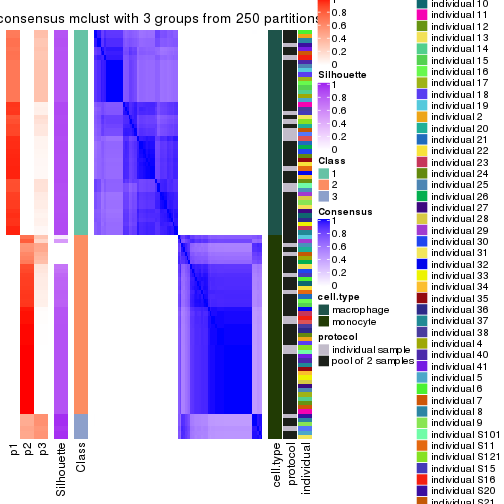</p>

</div>
<div id='tab-SD-mclust-consensus-heatmap-3'>
<pre><code class="r">consensus_heatmap(res, k = 4)
</code></pre>

<p></p>

</div>
<div id='tab-SD-mclust-consensus-heatmap-4'>
<pre><code class="r">consensus_heatmap(res, k = 5)
</code></pre>

<p></p>

</div>
<div id='tab-SD-mclust-consensus-heatmap-5'>
<pre><code class="r">consensus_heatmap(res, k = 6)
</code></pre>

<p></p>

</div>
</div>

Heatmaps for the membership of samples in all partitions to see how consistent they are:


<script>
$( function() {
	$( '#tabs-SD-mclust-membership-heatmap' ).tabs();
} );
</script>
<div id='tabs-SD-mclust-membership-heatmap'>
<ul>
<li><a href='#tab-SD-mclust-membership-heatmap-1'>k = 2</a></li>
<li><a href='#tab-SD-mclust-membership-heatmap-2'>k = 3</a></li>
<li><a href='#tab-SD-mclust-membership-heatmap-3'>k = 4</a></li>
<li><a href='#tab-SD-mclust-membership-heatmap-4'>k = 5</a></li>
<li><a href='#tab-SD-mclust-membership-heatmap-5'>k = 6</a></li>
</ul>
<div id='tab-SD-mclust-membership-heatmap-1'>
<pre><code class="r">membership_heatmap(res, k = 2)
</code></pre>

<p></p>

</div>
<div id='tab-SD-mclust-membership-heatmap-2'>
<pre><code class="r">membership_heatmap(res, k = 3)
</code></pre>

<p></p>

</div>
<div id='tab-SD-mclust-membership-heatmap-3'>
<pre><code class="r">membership_heatmap(res, k = 4)
</code></pre>

<p></p>

</div>
<div id='tab-SD-mclust-membership-heatmap-4'>
<pre><code class="r">membership_heatmap(res, k = 5)
</code></pre>

<p></p>

</div>
<div id='tab-SD-mclust-membership-heatmap-5'>
<pre><code class="r">membership_heatmap(res, k = 6)
</code></pre>

<p></p>

</div>
</div>

As soon as we have had the classes for columns, we can look for signatures
which are significantly different between classes which can be candidate marks
for certain classes. Following are the heatmaps for signatures.


Signature heatmaps where rows are scaled:


<script>
$( function() {
	$( '#tabs-SD-mclust-get-signatures' ).tabs();
} );
</script>
<div id='tabs-SD-mclust-get-signatures'>
<ul>
<li><a href='#tab-SD-mclust-get-signatures-1'>k = 2</a></li>
<li><a href='#tab-SD-mclust-get-signatures-2'>k = 3</a></li>
<li><a href='#tab-SD-mclust-get-signatures-3'>k = 4</a></li>
<li><a href='#tab-SD-mclust-get-signatures-4'>k = 5</a></li>
<li><a href='#tab-SD-mclust-get-signatures-5'>k = 6</a></li>
</ul>
<div id='tab-SD-mclust-get-signatures-1'>
<pre><code class="r">get_signatures(res, k = 2)
</code></pre>

<p></p>

</div>
<div id='tab-SD-mclust-get-signatures-2'>
<pre><code class="r">get_signatures(res, k = 3)
</code></pre>

<p></p>

</div>
<div id='tab-SD-mclust-get-signatures-3'>
<pre><code class="r">get_signatures(res, k = 4)
</code></pre>

<p></p>

</div>
<div id='tab-SD-mclust-get-signatures-4'>
<pre><code class="r">get_signatures(res, k = 5)
</code></pre>

<p></p>

</div>
<div id='tab-SD-mclust-get-signatures-5'>
<pre><code class="r">get_signatures(res, k = 6)
</code></pre>

<p></p>

</div>
</div>


Signature heatmaps where rows are not scaled:


<script>
$( function() {
	$( '#tabs-SD-mclust-get-signatures-no-scale' ).tabs();
} );
</script>
<div id='tabs-SD-mclust-get-signatures-no-scale'>
<ul>
<li><a href='#tab-SD-mclust-get-signatures-no-scale-1'>k = 2</a></li>
<li><a href='#tab-SD-mclust-get-signatures-no-scale-2'>k = 3</a></li>
<li><a href='#tab-SD-mclust-get-signatures-no-scale-3'>k = 4</a></li>
<li><a href='#tab-SD-mclust-get-signatures-no-scale-4'>k = 5</a></li>
<li><a href='#tab-SD-mclust-get-signatures-no-scale-5'>k = 6</a></li>
</ul>
<div id='tab-SD-mclust-get-signatures-no-scale-1'>
<pre><code class="r">get_signatures(res, k = 2, scale_rows = FALSE)
</code></pre>

<p></p>

</div>
<div id='tab-SD-mclust-get-signatures-no-scale-2'>
<pre><code class="r">get_signatures(res, k = 3, scale_rows = FALSE)
</code></pre>

<p>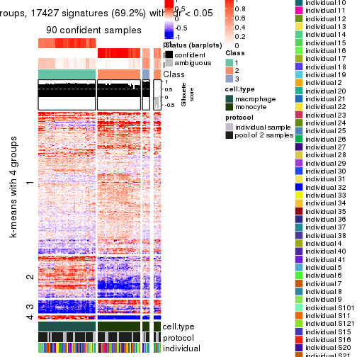</p>

</div>
<div id='tab-SD-mclust-get-signatures-no-scale-3'>
<pre><code class="r">get_signatures(res, k = 4, scale_rows = FALSE)
</code></pre>

<p></p>

</div>
<div id='tab-SD-mclust-get-signatures-no-scale-4'>
<pre><code class="r">get_signatures(res, k = 5, scale_rows = FALSE)
</code></pre>

<p></p>

</div>
<div id='tab-SD-mclust-get-signatures-no-scale-5'>
<pre><code class="r">get_signatures(res, k = 6, scale_rows = FALSE)
</code></pre>

<p></p>

</div>
</div>


Compare the overlap of signatures from different k:

```r
compare_signatures(res)
```


`get_signature()` returns a data frame invisibly. TO get the list of signatures, the function
call should be assigned to a variable explicitly. In following code, if `plot` argument is set
to `FALSE`, no heatmap is plotted while only the differential analysis is performed.

```r
# code only for demonstration
tb = get_signature(res, k = ..., plot = FALSE)
```

An example of the output of `tb` is:

```
#>   which_row         fdr    mean_1    mean_2 scaled_mean_1 scaled_mean_2 km
#> 1        38 0.042760348  8.373488  9.131774    -0.5533452     0.5164555  1
#> 2        40 0.018707592  7.106213  8.469186    -0.6173731     0.5762149  1
#> 3        55 0.019134737 10.221463 11.207825    -0.6159697     0.5749050  1
#> 4        59 0.006059896  5.921854  7.869574    -0.6899429     0.6439467  1
#> 5        60 0.018055526  8.928898 10.211722    -0.6204761     0.5791110  1
#> 6        98 0.009384629 15.714769 14.887706     0.6635654    -0.6193277  2
...
```

The columns in `tb` are:

1. `which_row`: row indices corresponding to the input matrix.
2. `fdr`: FDR for the differential test. 
3. `mean_x`: The mean value in group x.
4. `scaled_mean_x`: The mean value in group x after rows are scaled.
5. `km`: Row groups if k-means clustering is applied to rows.


UMAP plot which shows how samples are separated.


<script>
$( function() {
	$( '#tabs-SD-mclust-dimension-reduction' ).tabs();
} );
</script>
<div id='tabs-SD-mclust-dimension-reduction'>
<ul>
<li><a href='#tab-SD-mclust-dimension-reduction-1'>k = 2</a></li>
<li><a href='#tab-SD-mclust-dimension-reduction-2'>k = 3</a></li>
<li><a href='#tab-SD-mclust-dimension-reduction-3'>k = 4</a></li>
<li><a href='#tab-SD-mclust-dimension-reduction-4'>k = 5</a></li>
<li><a href='#tab-SD-mclust-dimension-reduction-5'>k = 6</a></li>
</ul>
<div id='tab-SD-mclust-dimension-reduction-1'>
<pre><code class="r">dimension_reduction(res, k = 2, method = &quot;UMAP&quot;)
</code></pre>

<p></p>

</div>
<div id='tab-SD-mclust-dimension-reduction-2'>
<pre><code class="r">dimension_reduction(res, k = 3, method = &quot;UMAP&quot;)
</code></pre>

<p></p>

</div>
<div id='tab-SD-mclust-dimension-reduction-3'>
<pre><code class="r">dimension_reduction(res, k = 4, method = &quot;UMAP&quot;)
</code></pre>

<p></p>

</div>
<div id='tab-SD-mclust-dimension-reduction-4'>
<pre><code class="r">dimension_reduction(res, k = 5, method = &quot;UMAP&quot;)
</code></pre>

<p></p>

</div>
<div id='tab-SD-mclust-dimension-reduction-5'>
<pre><code class="r">dimension_reduction(res, k = 6, method = &quot;UMAP&quot;)
</code></pre>

<p></p>

</div>
</div>


Following heatmap shows how subgroups are split when increasing `k`:

```r
collect_classes(res)
```


Test correlation between subgroups and known annotations. If the known
annotation is numeric, one-way ANOVA test is applied, and if the known
annotation is discrete, chi-squared contingency table test is applied.

```r
test_to_known_factors(res)
```

```
#>            n cell.type(p) protocol(p) individual(p) k
#> SD:mclust 96     8.49e-22       1.000         1.000 2
#> SD:mclust 90     2.86e-20       0.626         1.000 3
#> SD:mclust 94     3.03e-20       0.146         0.998 4
#> SD:mclust 73     5.28e-15       0.236         0.853 5
#> SD:mclust 72     8.58e-15       0.803         0.915 6
```


If matrix rows can be associated to genes, consider to use `functional_enrichment(res,
...)` to perform function enrichment for the signature genes. See [this vignette](http://bioconductor.org/packages/devel/bioc/vignettes/cola/inst/doc/functional_enrichment.html) for more detailed explanations.


 

---------------------------------------------------


### SD:NMF**


The object with results only for a single top-value method and a single partition method 
can be extracted as:

```r
res = res_list["SD", "NMF"]
# you can also extract it by
# res = res_list["SD:NMF"]
```

A summary of `res` and all the functions that can be applied to it:

```r
res
```

```
#> A 'ConsensusPartition' object with k = 2, 3, 4, 5, 6.
#>   On a matrix with 25171 rows and 96 columns.
#>   Top rows (1000, 2000, 3000, 4000, 5000) are extracted by 'SD' method.
#>   Subgroups are detected by 'NMF' method.
#>   Performed in total 1250 partitions by row resampling.
#>   Best k for subgroups seems to be 2.
#> 
#> Following methods can be applied to this 'ConsensusPartition' object:
#>  [1] "cola_report"             "collect_classes"         "collect_plots"          
#>  [4] "collect_stats"           "colnames"                "compare_signatures"     
#>  [7] "consensus_heatmap"       "dimension_reduction"     "functional_enrichment"  
#> [10] "get_anno_col"            "get_anno"                "get_classes"            
#> [13] "get_consensus"           "get_matrix"              "get_membership"         
#> [16] "get_param"               "get_signatures"          "get_stats"              
#> [19] "is_best_k"               "is_stable_k"             "membership_heatmap"     
#> [22] "ncol"                    "nrow"                    "plot_ecdf"              
#> [25] "rownames"                "select_partition_number" "show"                   
#> [28] "suggest_best_k"          "test_to_known_factors"
```

`collect_plots()` function collects all the plots made from `res` for all `k` (number of partitions)
into one single page to provide an easy and fast comparison between different `k`.

```r
collect_plots(res)
```


The plots are:

- The first row: a plot of the ECDF (empirical cumulative distribution
  function) curves of the consensus matrix for each `k` and the heatmap of
  predicted classes for each `k`.
- The second row: heatmaps of the consensus matrix for each `k`.
- The third row: heatmaps of the membership matrix for each `k`.
- The fouth row: heatmaps of the signatures for each `k`.

All the plots in panels can be made by individual functions and they are
plotted later in this section.

`select_partition_number()` produces several plots showing different
statistics for choosing "optimized" `k`. There are following statistics:

- ECDF curves of the consensus matrix for each `k`;
- 1-PAC. [The PAC
  score](https://en.wikipedia.org/wiki/Consensus_clustering#Over-interpretation_potential_of_consensus_clustering)
  measures the proportion of the ambiguous subgrouping.
- Mean silhouette score.
- Concordance. The mean probability of fiting the consensus class ids in all
  partitions.
- Area increased. Denote $A_k$ as the area under the ECDF curve for current
  `k`, the area increased is defined as $A_k - A_{k-1}$.
- Rand index. The percent of pairs of samples that are both in a same cluster
  or both are not in a same cluster in the partition of k and k-1.
- Jaccard index. The ratio of pairs of samples are both in a same cluster in
  the partition of k and k-1 and the pairs of samples are both in a same
  cluster in the partition k or k-1.

The detailed explanations of these statistics can be found in [the _cola_
vignette](http://bioconductor.org/packages/devel/bioc/vignettes/cola/inst/doc/cola.html#toc_13).

Generally speaking, lower PAC score, higher mean silhouette score or higher
concordance corresponds to better partition. Rand index and Jaccard index
measure how similar the current partition is compared to partition with `k-1`.
If they are too similar, we won't accept `k` is better than `k-1`.

```r
select_partition_number(res)
```


The numeric values for all these statistics can be obtained by `get_stats()`.

```r
get_stats(res)
```

```
#>   k 1-PAC mean_silhouette concordance area_increased  Rand Jaccard
#> 2 2 1.000           1.000       1.000         0.5058 0.495   0.495
#> 3 3 0.842           0.851       0.900         0.1962 0.879   0.756
#> 4 4 0.685           0.794       0.829         0.1043 0.930   0.827
#> 5 5 0.767           0.795       0.883         0.0935 0.868   0.652
#> 6 6 0.876           0.871       0.920         0.0340 0.973   0.902
```

`suggest_best_k()` suggests the best $k$ based on these statistics. The rules are as follows:

- All $k$ with Jaccard index larger than 0.95 are removed because increasing
  $k$ does not provide enough extra information. If all $k$ are removed, it is
  marked as no subgroup is detected.
- For all $k$ with 1-PAC score larger than 0.9, the maximal $k$ is taken as
  the best $k$, and other $k$ are marked as optional $k$.
- If it does not fit the second rule. The $k$ with the maximal vote of the
  highest 1-PAC score, highest mean silhouette, and highest concordance is
  taken as the best $k$.

```r
suggest_best_k(res)
```

```
#> [1] 2
```


Following shows the table of the partitions (You need to click the **show/hide
code output** link to see it). The membership matrix (columns with name `p*`)
is inferred by
[`clue::cl_consensus()`](https://www.rdocumentation.org/link/cl_consensus?package=clue)
function with the `SE` method. Basically the value in the membership matrix
represents the probability to belong to a certain group. The finall class
label for an item is determined with the group with highest probability it
belongs to.

In `get_classes()` function, the entropy is calculated from the membership
matrix and the silhouette score is calculated from the consensus matrix.


<script>
$( function() {
	$( '#tabs-SD-NMF-get-classes' ).tabs();
} );
</script>
<div id='tabs-SD-NMF-get-classes'>
<ul>
<li><a href='#tab-SD-NMF-get-classes-1'>k = 2</a></li>
<li><a href='#tab-SD-NMF-get-classes-2'>k = 3</a></li>
<li><a href='#tab-SD-NMF-get-classes-3'>k = 4</a></li>
<li><a href='#tab-SD-NMF-get-classes-4'>k = 5</a></li>
<li><a href='#tab-SD-NMF-get-classes-5'>k = 6</a></li>
</ul>

<div id='tab-SD-NMF-get-classes-1'>
<p><a id='tab-SD-NMF-get-classes-1-a' style='color:#0366d6' href='#'>show/hide code output</a></p>
<pre><code class="r">cbind(get_classes(res, k = 2), get_membership(res, k = 2))
</code></pre>

<pre><code>#&gt;           class entropy silhouette p1 p2
#&gt; GSM257886     1       0          1  1  0
#&gt; GSM257888     1       0          1  1  0
#&gt; GSM257890     1       0          1  1  0
#&gt; GSM257892     1       0          1  1  0
#&gt; GSM257894     1       0          1  1  0
#&gt; GSM257896     1       0          1  1  0
#&gt; GSM257898     1       0          1  1  0
#&gt; GSM257900     1       0          1  1  0
#&gt; GSM257902     1       0          1  1  0
#&gt; GSM257904     1       0          1  1  0
#&gt; GSM257906     1       0          1  1  0
#&gt; GSM257908     1       0          1  1  0
#&gt; GSM257910     1       0          1  1  0
#&gt; GSM257912     1       0          1  1  0
#&gt; GSM257914     1       0          1  1  0
#&gt; GSM257917     1       0          1  1  0
#&gt; GSM257919     1       0          1  1  0
#&gt; GSM257921     1       0          1  1  0
#&gt; GSM257923     1       0          1  1  0
#&gt; GSM257925     1       0          1  1  0
#&gt; GSM257927     1       0          1  1  0
#&gt; GSM257929     1       0          1  1  0
#&gt; GSM257937     1       0          1  1  0
#&gt; GSM257939     1       0          1  1  0
#&gt; GSM257941     1       0          1  1  0
#&gt; GSM257943     1       0          1  1  0
#&gt; GSM257945     1       0          1  1  0
#&gt; GSM257947     1       0          1  1  0
#&gt; GSM257949     1       0          1  1  0
#&gt; GSM257951     1       0          1  1  0
#&gt; GSM257953     1       0          1  1  0
#&gt; GSM257955     1       0          1  1  0
#&gt; GSM257958     1       0          1  1  0
#&gt; GSM257960     1       0          1  1  0
#&gt; GSM257962     1       0          1  1  0
#&gt; GSM257964     1       0          1  1  0
#&gt; GSM257966     1       0          1  1  0
#&gt; GSM257968     1       0          1  1  0
#&gt; GSM257970     1       0          1  1  0
#&gt; GSM257972     1       0          1  1  0
#&gt; GSM257977     1       0          1  1  0
#&gt; GSM257982     1       0          1  1  0
#&gt; GSM257984     1       0          1  1  0
#&gt; GSM257986     1       0          1  1  0
#&gt; GSM257990     1       0          1  1  0
#&gt; GSM257992     1       0          1  1  0
#&gt; GSM257996     1       0          1  1  0
#&gt; GSM258006     1       0          1  1  0
#&gt; GSM257887     2       0          1  0  1
#&gt; GSM257889     2       0          1  0  1
#&gt; GSM257891     2       0          1  0  1
#&gt; GSM257893     2       0          1  0  1
#&gt; GSM257895     2       0          1  0  1
#&gt; GSM257897     2       0          1  0  1
#&gt; GSM257899     2       0          1  0  1
#&gt; GSM257901     2       0          1  0  1
#&gt; GSM257903     2       0          1  0  1
#&gt; GSM257905     2       0          1  0  1
#&gt; GSM257907     2       0          1  0  1
#&gt; GSM257909     2       0          1  0  1
#&gt; GSM257911     2       0          1  0  1
#&gt; GSM257913     2       0          1  0  1
#&gt; GSM257916     2       0          1  0  1
#&gt; GSM257918     2       0          1  0  1
#&gt; GSM257920     2       0          1  0  1
#&gt; GSM257922     2       0          1  0  1
#&gt; GSM257924     2       0          1  0  1
#&gt; GSM257926     2       0          1  0  1
#&gt; GSM257928     2       0          1  0  1
#&gt; GSM257930     2       0          1  0  1
#&gt; GSM257938     2       0          1  0  1
#&gt; GSM257940     2       0          1  0  1
#&gt; GSM257942     2       0          1  0  1
#&gt; GSM257944     2       0          1  0  1
#&gt; GSM257946     2       0          1  0  1
#&gt; GSM257948     2       0          1  0  1
#&gt; GSM257950     2       0          1  0  1
#&gt; GSM257952     2       0          1  0  1
#&gt; GSM257954     2       0          1  0  1
#&gt; GSM257956     2       0          1  0  1
#&gt; GSM257959     2       0          1  0  1
#&gt; GSM257961     2       0          1  0  1
#&gt; GSM257963     2       0          1  0  1
#&gt; GSM257965     2       0          1  0  1
#&gt; GSM257967     2       0          1  0  1
#&gt; GSM257969     2       0          1  0  1
#&gt; GSM257971     2       0          1  0  1
#&gt; GSM257973     2       0          1  0  1
#&gt; GSM257981     2       0          1  0  1
#&gt; GSM257983     2       0          1  0  1
#&gt; GSM257985     2       0          1  0  1
#&gt; GSM257988     2       0          1  0  1
#&gt; GSM257991     2       0          1  0  1
#&gt; GSM257993     2       0          1  0  1
#&gt; GSM257994     2       0          1  0  1
#&gt; GSM257989     2       0          1  0  1
</code></pre>

<script>
$('#tab-SD-NMF-get-classes-1-a').parent().next().next().hide();
$('#tab-SD-NMF-get-classes-1-a').click(function(){
  $('#tab-SD-NMF-get-classes-1-a').parent().next().next().toggle();
  return(false);
});
</script>
</div>

<div id='tab-SD-NMF-get-classes-2'>
<p><a id='tab-SD-NMF-get-classes-2-a' style='color:#0366d6' href='#'>show/hide code output</a></p>
<pre><code class="r">cbind(get_classes(res, k = 3), get_membership(res, k = 3))
</code></pre>

<pre><code>#&gt;           class entropy silhouette    p1    p2    p3
#&gt; GSM257886     1  0.1860      0.965 0.948 0.000 0.052
#&gt; GSM257888     1  0.0000      0.989 1.000 0.000 0.000
#&gt; GSM257890     1  0.0237      0.987 0.996 0.000 0.004
#&gt; GSM257892     1  0.1860      0.965 0.948 0.000 0.052
#&gt; GSM257894     1  0.0000      0.989 1.000 0.000 0.000
#&gt; GSM257896     1  0.0000      0.989 1.000 0.000 0.000
#&gt; GSM257898     1  0.2796      0.934 0.908 0.000 0.092
#&gt; GSM257900     1  0.0592      0.984 0.988 0.000 0.012
#&gt; GSM257902     1  0.0000      0.989 1.000 0.000 0.000
#&gt; GSM257904     1  0.1860      0.965 0.948 0.000 0.052
#&gt; GSM257906     1  0.2261      0.955 0.932 0.000 0.068
#&gt; GSM257908     1  0.0000      0.989 1.000 0.000 0.000
#&gt; GSM257910     1  0.0000      0.989 1.000 0.000 0.000
#&gt; GSM257912     1  0.0000      0.989 1.000 0.000 0.000
#&gt; GSM257914     1  0.0000      0.989 1.000 0.000 0.000
#&gt; GSM257917     1  0.0237      0.987 0.996 0.000 0.004
#&gt; GSM257919     1  0.0000      0.989 1.000 0.000 0.000
#&gt; GSM257921     1  0.0000      0.989 1.000 0.000 0.000
#&gt; GSM257923     1  0.0000      0.989 1.000 0.000 0.000
#&gt; GSM257925     1  0.0000      0.989 1.000 0.000 0.000
#&gt; GSM257927     1  0.0237      0.987 0.996 0.000 0.004
#&gt; GSM257929     1  0.0000      0.989 1.000 0.000 0.000
#&gt; GSM257937     1  0.0000      0.989 1.000 0.000 0.000
#&gt; GSM257939     1  0.0000      0.989 1.000 0.000 0.000
#&gt; GSM257941     1  0.1529      0.971 0.960 0.000 0.040
#&gt; GSM257943     1  0.1860      0.965 0.948 0.000 0.052
#&gt; GSM257945     1  0.1860      0.965 0.948 0.000 0.052
#&gt; GSM257947     1  0.0000      0.989 1.000 0.000 0.000
#&gt; GSM257949     1  0.0000      0.989 1.000 0.000 0.000
#&gt; GSM257951     1  0.0000      0.989 1.000 0.000 0.000
#&gt; GSM257953     1  0.0000      0.989 1.000 0.000 0.000
#&gt; GSM257955     1  0.0000      0.989 1.000 0.000 0.000
#&gt; GSM257958     1  0.0000      0.989 1.000 0.000 0.000
#&gt; GSM257960     1  0.1529      0.971 0.960 0.000 0.040
#&gt; GSM257962     1  0.0424      0.986 0.992 0.000 0.008
#&gt; GSM257964     1  0.0000      0.989 1.000 0.000 0.000
#&gt; GSM257966     1  0.0000      0.989 1.000 0.000 0.000
#&gt; GSM257968     1  0.0000      0.989 1.000 0.000 0.000
#&gt; GSM257970     1  0.0000      0.989 1.000 0.000 0.000
#&gt; GSM257972     1  0.0000      0.989 1.000 0.000 0.000
#&gt; GSM257977     1  0.0000      0.989 1.000 0.000 0.000
#&gt; GSM257982     1  0.0000      0.989 1.000 0.000 0.000
#&gt; GSM257984     1  0.0000      0.989 1.000 0.000 0.000
#&gt; GSM257986     1  0.0000      0.989 1.000 0.000 0.000
#&gt; GSM257990     1  0.0000      0.989 1.000 0.000 0.000
#&gt; GSM257992     1  0.2261      0.955 0.932 0.000 0.068
#&gt; GSM257996     1  0.0000      0.989 1.000 0.000 0.000
#&gt; GSM258006     1  0.1860      0.965 0.948 0.000 0.052
#&gt; GSM257887     2  0.0237      0.837 0.000 0.996 0.004
#&gt; GSM257889     3  0.4702      0.824 0.000 0.212 0.788
#&gt; GSM257891     3  0.4235      0.781 0.000 0.176 0.824
#&gt; GSM257893     3  0.5465      0.857 0.000 0.288 0.712
#&gt; GSM257895     2  0.1860      0.824 0.000 0.948 0.052
#&gt; GSM257897     3  0.4750      0.829 0.000 0.216 0.784
#&gt; GSM257899     3  0.5254      0.862 0.000 0.264 0.736
#&gt; GSM257901     3  0.6307      0.587 0.000 0.488 0.512
#&gt; GSM257903     2  0.3038      0.768 0.000 0.896 0.104
#&gt; GSM257905     2  0.0237      0.839 0.000 0.996 0.004
#&gt; GSM257907     3  0.6026      0.784 0.000 0.376 0.624
#&gt; GSM257909     2  0.3267      0.750 0.000 0.884 0.116
#&gt; GSM257911     2  0.3686      0.739 0.000 0.860 0.140
#&gt; GSM257913     2  0.3752      0.714 0.000 0.856 0.144
#&gt; GSM257916     2  0.0237      0.839 0.000 0.996 0.004
#&gt; GSM257918     2  0.1163      0.825 0.000 0.972 0.028
#&gt; GSM257920     2  0.6299     -0.515 0.000 0.524 0.476
#&gt; GSM257922     3  0.4842      0.832 0.000 0.224 0.776
#&gt; GSM257924     2  0.6111     -0.218 0.000 0.604 0.396
#&gt; GSM257926     3  0.6260      0.685 0.000 0.448 0.552
#&gt; GSM257928     3  0.5926      0.804 0.000 0.356 0.644
#&gt; GSM257930     2  0.4121      0.661 0.000 0.832 0.168
#&gt; GSM257938     2  0.1753      0.827 0.000 0.952 0.048
#&gt; GSM257940     3  0.6274      0.670 0.000 0.456 0.544
#&gt; GSM257942     2  0.1964      0.810 0.000 0.944 0.056
#&gt; GSM257944     2  0.3482      0.742 0.000 0.872 0.128
#&gt; GSM257946     3  0.5327      0.862 0.000 0.272 0.728
#&gt; GSM257948     3  0.6274      0.670 0.000 0.456 0.544
#&gt; GSM257950     3  0.5560      0.851 0.000 0.300 0.700
#&gt; GSM257952     2  0.3879      0.699 0.000 0.848 0.152
#&gt; GSM257954     2  0.1163      0.837 0.000 0.972 0.028
#&gt; GSM257956     2  0.1163      0.837 0.000 0.972 0.028
#&gt; GSM257959     2  0.2796      0.776 0.000 0.908 0.092
#&gt; GSM257961     2  0.0237      0.839 0.000 0.996 0.004
#&gt; GSM257963     2  0.0592      0.834 0.000 0.988 0.012
#&gt; GSM257965     2  0.1411      0.835 0.000 0.964 0.036
#&gt; GSM257967     2  0.2537      0.786 0.000 0.920 0.080
#&gt; GSM257969     2  0.1289      0.835 0.000 0.968 0.032
#&gt; GSM257971     3  0.5216      0.860 0.000 0.260 0.740
#&gt; GSM257973     2  0.6291     -0.489 0.000 0.532 0.468
#&gt; GSM257981     2  0.1964      0.822 0.000 0.944 0.056
#&gt; GSM257983     3  0.5254      0.862 0.000 0.264 0.736
#&gt; GSM257985     3  0.5254      0.862 0.000 0.264 0.736
#&gt; GSM257988     3  0.6286      0.652 0.000 0.464 0.536
#&gt; GSM257991     2  0.1163      0.839 0.000 0.972 0.028
#&gt; GSM257993     2  0.0000      0.838 0.000 1.000 0.000
#&gt; GSM257994     2  0.1753      0.827 0.000 0.952 0.048
#&gt; GSM257989     3  0.5291      0.862 0.000 0.268 0.732
</code></pre>

<script>
$('#tab-SD-NMF-get-classes-2-a').parent().next().next().hide();
$('#tab-SD-NMF-get-classes-2-a').click(function(){
  $('#tab-SD-NMF-get-classes-2-a').parent().next().next().toggle();
  return(false);
});
</script>
</div>

<div id='tab-SD-NMF-get-classes-3'>
<p><a id='tab-SD-NMF-get-classes-3-a' style='color:#0366d6' href='#'>show/hide code output</a></p>
<pre><code class="r">cbind(get_classes(res, k = 4), get_membership(res, k = 4))
</code></pre>

<pre><code>#&gt;           class entropy silhouette    p1    p2    p3 p4
#&gt; GSM257886     1  0.4522     0.7751 0.680 0.000 0.000 NA
#&gt; GSM257888     1  0.0817     0.9160 0.976 0.000 0.000 NA
#&gt; GSM257890     1  0.4134     0.8164 0.740 0.000 0.000 NA
#&gt; GSM257892     1  0.4522     0.7751 0.680 0.000 0.000 NA
#&gt; GSM257894     1  0.0000     0.9202 1.000 0.000 0.000 NA
#&gt; GSM257896     1  0.0188     0.9196 0.996 0.000 0.000 NA
#&gt; GSM257898     1  0.5193     0.6688 0.580 0.000 0.008 NA
#&gt; GSM257900     1  0.2647     0.8823 0.880 0.000 0.000 NA
#&gt; GSM257902     1  0.0000     0.9202 1.000 0.000 0.000 NA
#&gt; GSM257904     1  0.4522     0.7751 0.680 0.000 0.000 NA
#&gt; GSM257906     1  0.4564     0.7690 0.672 0.000 0.000 NA
#&gt; GSM257908     1  0.0592     0.9171 0.984 0.000 0.000 NA
#&gt; GSM257910     1  0.0592     0.9171 0.984 0.000 0.000 NA
#&gt; GSM257912     1  0.1867     0.9034 0.928 0.000 0.000 NA
#&gt; GSM257914     1  0.1211     0.9123 0.960 0.000 0.000 NA
#&gt; GSM257917     1  0.4072     0.8225 0.748 0.000 0.000 NA
#&gt; GSM257919     1  0.1716     0.9063 0.936 0.000 0.000 NA
#&gt; GSM257921     1  0.2760     0.8856 0.872 0.000 0.000 NA
#&gt; GSM257923     1  0.0000     0.9202 1.000 0.000 0.000 NA
#&gt; GSM257925     1  0.0000     0.9202 1.000 0.000 0.000 NA
#&gt; GSM257927     1  0.1118     0.9131 0.964 0.000 0.000 NA
#&gt; GSM257929     1  0.0000     0.9202 1.000 0.000 0.000 NA
#&gt; GSM257937     1  0.1557     0.9085 0.944 0.000 0.000 NA
#&gt; GSM257939     1  0.0000     0.9202 1.000 0.000 0.000 NA
#&gt; GSM257941     1  0.3311     0.8577 0.828 0.000 0.000 NA
#&gt; GSM257943     1  0.4406     0.7800 0.700 0.000 0.000 NA
#&gt; GSM257945     1  0.3764     0.8339 0.784 0.000 0.000 NA
#&gt; GSM257947     1  0.0000     0.9202 1.000 0.000 0.000 NA
#&gt; GSM257949     1  0.0000     0.9202 1.000 0.000 0.000 NA
#&gt; GSM257951     1  0.0000     0.9202 1.000 0.000 0.000 NA
#&gt; GSM257953     1  0.0000     0.9202 1.000 0.000 0.000 NA
#&gt; GSM257955     1  0.0000     0.9202 1.000 0.000 0.000 NA
#&gt; GSM257958     1  0.0000     0.9202 1.000 0.000 0.000 NA
#&gt; GSM257960     1  0.3726     0.8372 0.788 0.000 0.000 NA
#&gt; GSM257962     1  0.1302     0.9109 0.956 0.000 0.000 NA
#&gt; GSM257964     1  0.0000     0.9202 1.000 0.000 0.000 NA
#&gt; GSM257966     1  0.1118     0.9136 0.964 0.000 0.000 NA
#&gt; GSM257968     1  0.0000     0.9202 1.000 0.000 0.000 NA
#&gt; GSM257970     1  0.0000     0.9202 1.000 0.000 0.000 NA
#&gt; GSM257972     1  0.0000     0.9202 1.000 0.000 0.000 NA
#&gt; GSM257977     1  0.0921     0.9165 0.972 0.000 0.000 NA
#&gt; GSM257982     1  0.0000     0.9202 1.000 0.000 0.000 NA
#&gt; GSM257984     1  0.0000     0.9202 1.000 0.000 0.000 NA
#&gt; GSM257986     1  0.0000     0.9202 1.000 0.000 0.000 NA
#&gt; GSM257990     1  0.0000     0.9202 1.000 0.000 0.000 NA
#&gt; GSM257992     1  0.5163     0.5893 0.516 0.000 0.004 NA
#&gt; GSM257996     1  0.0000     0.9202 1.000 0.000 0.000 NA
#&gt; GSM258006     1  0.4454     0.7792 0.692 0.000 0.000 NA
#&gt; GSM257887     2  0.2281     0.8255 0.000 0.904 0.096 NA
#&gt; GSM257889     3  0.3355     0.7268 0.000 0.004 0.836 NA
#&gt; GSM257891     3  0.1978     0.7673 0.000 0.004 0.928 NA
#&gt; GSM257893     3  0.6690     0.6042 0.000 0.144 0.608 NA
#&gt; GSM257895     2  0.3105     0.8131 0.000 0.868 0.120 NA
#&gt; GSM257897     3  0.3908     0.6893 0.000 0.004 0.784 NA
#&gt; GSM257899     3  0.4920     0.7365 0.000 0.052 0.756 NA
#&gt; GSM257901     3  0.3497     0.8064 0.000 0.104 0.860 NA
#&gt; GSM257903     2  0.6875     0.5600 0.000 0.520 0.112 NA
#&gt; GSM257905     2  0.3037     0.8230 0.000 0.880 0.100 NA
#&gt; GSM257907     3  0.3015     0.8111 0.000 0.092 0.884 NA
#&gt; GSM257909     2  0.5767     0.6704 0.000 0.660 0.060 NA
#&gt; GSM257911     3  0.7138     0.4088 0.000 0.164 0.540 NA
#&gt; GSM257913     3  0.5857     0.6446 0.000 0.196 0.696 NA
#&gt; GSM257916     2  0.4843     0.7875 0.000 0.784 0.112 NA
#&gt; GSM257918     2  0.5747     0.7405 0.000 0.704 0.100 NA
#&gt; GSM257920     3  0.3427     0.8040 0.000 0.112 0.860 NA
#&gt; GSM257922     3  0.4744     0.6790 0.000 0.024 0.736 NA
#&gt; GSM257924     3  0.4995     0.6857 0.000 0.248 0.720 NA
#&gt; GSM257926     3  0.2647     0.8071 0.000 0.120 0.880 NA
#&gt; GSM257928     2  0.6879     0.5331 0.000 0.596 0.216 NA
#&gt; GSM257930     2  0.3984     0.7890 0.000 0.828 0.132 NA
#&gt; GSM257938     2  0.3099     0.8201 0.000 0.876 0.104 NA
#&gt; GSM257940     3  0.3464     0.8050 0.000 0.108 0.860 NA
#&gt; GSM257942     2  0.7494     0.5007 0.000 0.460 0.188 NA
#&gt; GSM257944     2  0.5947     0.5094 0.000 0.572 0.044 NA
#&gt; GSM257946     3  0.3004     0.8053 0.000 0.060 0.892 NA
#&gt; GSM257948     3  0.3464     0.8050 0.000 0.108 0.860 NA
#&gt; GSM257950     3  0.1867     0.8133 0.000 0.072 0.928 NA
#&gt; GSM257952     3  0.4671     0.6960 0.000 0.220 0.752 NA
#&gt; GSM257954     2  0.2675     0.8245 0.000 0.892 0.100 NA
#&gt; GSM257956     2  0.2675     0.8245 0.000 0.892 0.100 NA
#&gt; GSM257959     2  0.2915     0.8189 0.000 0.892 0.080 NA
#&gt; GSM257961     2  0.2281     0.8255 0.000 0.904 0.096 NA
#&gt; GSM257963     2  0.2466     0.8255 0.000 0.900 0.096 NA
#&gt; GSM257965     2  0.7873     0.2948 0.000 0.388 0.320 NA
#&gt; GSM257967     2  0.3399     0.8177 0.000 0.868 0.092 NA
#&gt; GSM257969     2  0.2675     0.8245 0.000 0.892 0.100 NA
#&gt; GSM257971     3  0.4485     0.7533 0.000 0.052 0.796 NA
#&gt; GSM257973     3  0.3598     0.7967 0.000 0.124 0.848 NA
#&gt; GSM257981     2  0.6928     0.1325 0.000 0.456 0.436 NA
#&gt; GSM257983     3  0.1854     0.8098 0.000 0.048 0.940 NA
#&gt; GSM257985     3  0.2483     0.8066 0.000 0.052 0.916 NA
#&gt; GSM257988     3  0.3934     0.8013 0.000 0.116 0.836 NA
#&gt; GSM257991     3  0.7796     0.0119 0.000 0.248 0.392 NA
#&gt; GSM257993     2  0.2611     0.8246 0.000 0.896 0.096 NA
#&gt; GSM257994     2  0.3205     0.8188 0.000 0.872 0.104 NA
#&gt; GSM257989     3  0.1890     0.8120 0.000 0.056 0.936 NA
</code></pre>

<script>
$('#tab-SD-NMF-get-classes-3-a').parent().next().next().hide();
$('#tab-SD-NMF-get-classes-3-a').click(function(){
  $('#tab-SD-NMF-get-classes-3-a').parent().next().next().toggle();
  return(false);
});
</script>
</div>

<div id='tab-SD-NMF-get-classes-4'>
<p><a id='tab-SD-NMF-get-classes-4-a' style='color:#0366d6' href='#'>show/hide code output</a></p>
<pre><code class="r">cbind(get_classes(res, k = 5), get_membership(res, k = 5))
</code></pre>

<pre><code>#&gt;           class entropy silhouette    p1    p2    p3    p4    p5
#&gt; GSM257886     4  0.2813      0.872 0.168 0.000 0.000 0.832 0.000
#&gt; GSM257888     1  0.0000      0.940 1.000 0.000 0.000 0.000 0.000
#&gt; GSM257890     4  0.3366      0.839 0.232 0.000 0.000 0.768 0.000
#&gt; GSM257892     4  0.2813      0.872 0.168 0.000 0.000 0.832 0.000
#&gt; GSM257894     1  0.0000      0.940 1.000 0.000 0.000 0.000 0.000
#&gt; GSM257896     1  0.0000      0.940 1.000 0.000 0.000 0.000 0.000
#&gt; GSM257898     4  0.2732      0.867 0.160 0.000 0.000 0.840 0.000
#&gt; GSM257900     4  0.4304      0.426 0.484 0.000 0.000 0.516 0.000
#&gt; GSM257902     1  0.0000      0.940 1.000 0.000 0.000 0.000 0.000
#&gt; GSM257904     4  0.2813      0.872 0.168 0.000 0.000 0.832 0.000
#&gt; GSM257906     4  0.2732      0.867 0.160 0.000 0.000 0.840 0.000
#&gt; GSM257908     1  0.0000      0.940 1.000 0.000 0.000 0.000 0.000
#&gt; GSM257910     1  0.0000      0.940 1.000 0.000 0.000 0.000 0.000
#&gt; GSM257912     1  0.0609      0.923 0.980 0.000 0.000 0.020 0.000
#&gt; GSM257914     1  0.0162      0.937 0.996 0.000 0.000 0.004 0.000
#&gt; GSM257917     4  0.4201      0.614 0.408 0.000 0.000 0.592 0.000
#&gt; GSM257919     1  0.0290      0.934 0.992 0.000 0.000 0.008 0.000
#&gt; GSM257921     1  0.3074      0.664 0.804 0.000 0.000 0.196 0.000
#&gt; GSM257923     1  0.0000      0.940 1.000 0.000 0.000 0.000 0.000
#&gt; GSM257925     1  0.0000      0.940 1.000 0.000 0.000 0.000 0.000
#&gt; GSM257927     1  0.2280      0.794 0.880 0.000 0.000 0.120 0.000
#&gt; GSM257929     1  0.0000      0.940 1.000 0.000 0.000 0.000 0.000
#&gt; GSM257937     1  0.1732      0.857 0.920 0.000 0.000 0.080 0.000
#&gt; GSM257939     1  0.0000      0.940 1.000 0.000 0.000 0.000 0.000
#&gt; GSM257941     4  0.4350      0.614 0.408 0.000 0.000 0.588 0.004
#&gt; GSM257943     4  0.2773      0.870 0.164 0.000 0.000 0.836 0.000
#&gt; GSM257945     1  0.4542     -0.289 0.536 0.000 0.000 0.456 0.008
#&gt; GSM257947     1  0.0000      0.940 1.000 0.000 0.000 0.000 0.000
#&gt; GSM257949     1  0.0000      0.940 1.000 0.000 0.000 0.000 0.000
#&gt; GSM257951     1  0.0000      0.940 1.000 0.000 0.000 0.000 0.000
#&gt; GSM257953     1  0.0000      0.940 1.000 0.000 0.000 0.000 0.000
#&gt; GSM257955     1  0.0290      0.933 0.992 0.000 0.000 0.008 0.000
#&gt; GSM257958     1  0.0000      0.940 1.000 0.000 0.000 0.000 0.000
#&gt; GSM257960     1  0.4305     -0.386 0.512 0.000 0.000 0.488 0.000
#&gt; GSM257962     1  0.1410      0.878 0.940 0.000 0.000 0.060 0.000
#&gt; GSM257964     1  0.0000      0.940 1.000 0.000 0.000 0.000 0.000
#&gt; GSM257966     1  0.0000      0.940 1.000 0.000 0.000 0.000 0.000
#&gt; GSM257968     1  0.0000      0.940 1.000 0.000 0.000 0.000 0.000
#&gt; GSM257970     1  0.0162      0.936 0.996 0.000 0.000 0.004 0.000
#&gt; GSM257972     1  0.0000      0.940 1.000 0.000 0.000 0.000 0.000
#&gt; GSM257977     1  0.2329      0.795 0.876 0.000 0.000 0.124 0.000
#&gt; GSM257982     1  0.0000      0.940 1.000 0.000 0.000 0.000 0.000
#&gt; GSM257984     1  0.0000      0.940 1.000 0.000 0.000 0.000 0.000
#&gt; GSM257986     1  0.0000      0.940 1.000 0.000 0.000 0.000 0.000
#&gt; GSM257990     1  0.0000      0.940 1.000 0.000 0.000 0.000 0.000
#&gt; GSM257992     4  0.2561      0.845 0.144 0.000 0.000 0.856 0.000
#&gt; GSM257996     1  0.0000      0.940 1.000 0.000 0.000 0.000 0.000
#&gt; GSM258006     4  0.2852      0.872 0.172 0.000 0.000 0.828 0.000
#&gt; GSM257887     2  0.1331      0.894 0.000 0.952 0.040 0.000 0.008
#&gt; GSM257889     3  0.3527      0.740 0.000 0.000 0.804 0.024 0.172
#&gt; GSM257891     3  0.1461      0.831 0.000 0.004 0.952 0.028 0.016
#&gt; GSM257893     3  0.6123      0.535 0.000 0.164 0.616 0.016 0.204
#&gt; GSM257895     2  0.1341      0.883 0.000 0.944 0.056 0.000 0.000
#&gt; GSM257897     3  0.3812      0.720 0.000 0.004 0.780 0.020 0.196
#&gt; GSM257899     3  0.3921      0.759 0.000 0.044 0.784 0.000 0.172
#&gt; GSM257901     3  0.1668      0.843 0.000 0.032 0.940 0.000 0.028
#&gt; GSM257903     5  0.5114      0.583 0.000 0.340 0.052 0.000 0.608
#&gt; GSM257905     2  0.2074      0.884 0.000 0.920 0.036 0.000 0.044
#&gt; GSM257907     3  0.1168      0.848 0.000 0.032 0.960 0.000 0.008
#&gt; GSM257909     2  0.4718      0.283 0.000 0.628 0.028 0.000 0.344
#&gt; GSM257911     3  0.3477      0.759 0.000 0.040 0.824 0.000 0.136
#&gt; GSM257913     3  0.2946      0.806 0.000 0.044 0.868 0.000 0.088
#&gt; GSM257916     2  0.3297      0.809 0.000 0.848 0.084 0.000 0.068
#&gt; GSM257918     2  0.4049      0.724 0.000 0.780 0.056 0.000 0.164
#&gt; GSM257920     3  0.1267      0.851 0.000 0.024 0.960 0.004 0.012
#&gt; GSM257922     3  0.4534      0.697 0.000 0.016 0.732 0.028 0.224
#&gt; GSM257924     3  0.2921      0.759 0.000 0.148 0.844 0.004 0.004
#&gt; GSM257926     3  0.0992      0.850 0.000 0.024 0.968 0.000 0.008
#&gt; GSM257928     2  0.3853      0.677 0.000 0.804 0.008 0.036 0.152
#&gt; GSM257930     2  0.1547      0.886 0.000 0.948 0.032 0.016 0.004
#&gt; GSM257938     2  0.0798      0.886 0.000 0.976 0.016 0.008 0.000
#&gt; GSM257940     3  0.1399      0.847 0.000 0.020 0.952 0.000 0.028
#&gt; GSM257942     5  0.5832      0.669 0.000 0.248 0.152 0.000 0.600
#&gt; GSM257944     5  0.4455      0.611 0.000 0.260 0.036 0.000 0.704
#&gt; GSM257946     3  0.1623      0.847 0.000 0.016 0.948 0.020 0.016
#&gt; GSM257948     3  0.1787      0.847 0.000 0.016 0.940 0.012 0.032
#&gt; GSM257950     3  0.1413      0.847 0.000 0.012 0.956 0.020 0.012
#&gt; GSM257952     3  0.3304      0.757 0.000 0.128 0.840 0.004 0.028
#&gt; GSM257954     2  0.0963      0.893 0.000 0.964 0.036 0.000 0.000
#&gt; GSM257956     2  0.1430      0.889 0.000 0.944 0.052 0.000 0.004
#&gt; GSM257959     2  0.2171      0.869 0.000 0.912 0.024 0.000 0.064
#&gt; GSM257961     2  0.1568      0.896 0.000 0.944 0.036 0.000 0.020
#&gt; GSM257963     2  0.1725      0.883 0.000 0.936 0.020 0.000 0.044
#&gt; GSM257965     3  0.6884     -0.420 0.000 0.324 0.400 0.004 0.272
#&gt; GSM257967     2  0.2843      0.854 0.000 0.876 0.048 0.000 0.076
#&gt; GSM257969     2  0.1121      0.893 0.000 0.956 0.044 0.000 0.000
#&gt; GSM257971     3  0.3281      0.812 0.000 0.060 0.848 0.000 0.092
#&gt; GSM257973     3  0.1012      0.850 0.000 0.020 0.968 0.000 0.012
#&gt; GSM257981     3  0.4095      0.607 0.000 0.220 0.752 0.004 0.024
#&gt; GSM257983     3  0.0324      0.847 0.000 0.000 0.992 0.004 0.004
#&gt; GSM257985     3  0.1300      0.849 0.000 0.028 0.956 0.000 0.016
#&gt; GSM257988     3  0.1041      0.848 0.000 0.004 0.964 0.000 0.032
#&gt; GSM257991     5  0.5901      0.280 0.000 0.104 0.400 0.000 0.496
#&gt; GSM257993     2  0.0609      0.892 0.000 0.980 0.020 0.000 0.000
#&gt; GSM257994     2  0.1179      0.879 0.000 0.964 0.016 0.016 0.004
#&gt; GSM257989     3  0.0693      0.843 0.000 0.000 0.980 0.012 0.008
</code></pre>

<script>
$('#tab-SD-NMF-get-classes-4-a').parent().next().next().hide();
$('#tab-SD-NMF-get-classes-4-a').click(function(){
  $('#tab-SD-NMF-get-classes-4-a').parent().next().next().toggle();
  return(false);
});
</script>
</div>

<div id='tab-SD-NMF-get-classes-5'>
<p><a id='tab-SD-NMF-get-classes-5-a' style='color:#0366d6' href='#'>show/hide code output</a></p>
<pre><code class="r">cbind(get_classes(res, k = 6), get_membership(res, k = 6))
</code></pre>

<pre><code>#&gt;           class entropy silhouette    p1    p2    p3    p4 p5    p6
#&gt; GSM257886     6  0.0405      0.912 0.004 0.000 0.000 0.000 NA 0.988
#&gt; GSM257888     1  0.1082      0.919 0.956 0.000 0.000 0.000 NA 0.004
#&gt; GSM257890     6  0.2433      0.858 0.072 0.000 0.000 0.000 NA 0.884
#&gt; GSM257892     6  0.0405      0.912 0.004 0.000 0.000 0.000 NA 0.988
#&gt; GSM257894     1  0.0713      0.923 0.972 0.000 0.000 0.000 NA 0.000
#&gt; GSM257896     1  0.0865      0.921 0.964 0.000 0.000 0.000 NA 0.000
#&gt; GSM257898     6  0.0146      0.911 0.000 0.000 0.000 0.000 NA 0.996
#&gt; GSM257900     6  0.3261      0.690 0.204 0.000 0.000 0.000 NA 0.780
#&gt; GSM257902     1  0.0632      0.928 0.976 0.000 0.000 0.000 NA 0.000
#&gt; GSM257904     6  0.0146      0.913 0.004 0.000 0.000 0.000 NA 0.996
#&gt; GSM257906     6  0.0000      0.911 0.000 0.000 0.000 0.000 NA 1.000
#&gt; GSM257908     1  0.0547      0.926 0.980 0.000 0.000 0.000 NA 0.000
#&gt; GSM257910     1  0.0547      0.926 0.980 0.000 0.000 0.000 NA 0.000
#&gt; GSM257912     1  0.3024      0.833 0.844 0.000 0.000 0.116 NA 0.008
#&gt; GSM257914     1  0.1168      0.919 0.956 0.000 0.000 0.016 NA 0.000
#&gt; GSM257917     6  0.2088      0.874 0.068 0.000 0.000 0.000 NA 0.904
#&gt; GSM257919     1  0.2030      0.892 0.908 0.000 0.000 0.064 NA 0.000
#&gt; GSM257921     1  0.4144      0.425 0.620 0.000 0.000 0.000 NA 0.360
#&gt; GSM257923     1  0.0632      0.928 0.976 0.000 0.000 0.000 NA 0.000
#&gt; GSM257925     1  0.0865      0.925 0.964 0.000 0.000 0.000 NA 0.000
#&gt; GSM257927     1  0.4602      0.318 0.572 0.000 0.000 0.000 NA 0.384
#&gt; GSM257929     1  0.0790      0.926 0.968 0.000 0.000 0.000 NA 0.000
#&gt; GSM257937     1  0.1720      0.905 0.928 0.000 0.000 0.000 NA 0.032
#&gt; GSM257939     1  0.0632      0.928 0.976 0.000 0.000 0.000 NA 0.000
#&gt; GSM257941     6  0.2660      0.847 0.084 0.000 0.000 0.000 NA 0.868
#&gt; GSM257943     6  0.0458      0.910 0.000 0.000 0.000 0.000 NA 0.984
#&gt; GSM257945     6  0.3978      0.762 0.064 0.000 0.000 0.000 NA 0.744
#&gt; GSM257947     1  0.0713      0.927 0.972 0.000 0.000 0.000 NA 0.000
#&gt; GSM257949     1  0.0260      0.929 0.992 0.000 0.000 0.000 NA 0.000
#&gt; GSM257951     1  0.0713      0.927 0.972 0.000 0.000 0.000 NA 0.000
#&gt; GSM257953     1  0.0713      0.927 0.972 0.000 0.000 0.000 NA 0.000
#&gt; GSM257955     1  0.0713      0.927 0.972 0.000 0.000 0.000 NA 0.000
#&gt; GSM257958     1  0.1007      0.922 0.956 0.000 0.000 0.000 NA 0.000
#&gt; GSM257960     6  0.1908      0.881 0.056 0.000 0.000 0.000 NA 0.916
#&gt; GSM257962     1  0.5254      0.355 0.564 0.000 0.000 0.000 NA 0.316
#&gt; GSM257964     1  0.0260      0.929 0.992 0.000 0.000 0.000 NA 0.000
#&gt; GSM257966     1  0.0937      0.920 0.960 0.000 0.000 0.000 NA 0.000
#&gt; GSM257968     1  0.0458      0.926 0.984 0.000 0.000 0.000 NA 0.000
#&gt; GSM257970     1  0.0632      0.928 0.976 0.000 0.000 0.000 NA 0.000
#&gt; GSM257972     1  0.0291      0.929 0.992 0.000 0.000 0.000 NA 0.004
#&gt; GSM257977     1  0.1461      0.912 0.940 0.000 0.000 0.000 NA 0.016
#&gt; GSM257982     1  0.0632      0.925 0.976 0.000 0.000 0.000 NA 0.000
#&gt; GSM257984     1  0.0000      0.928 1.000 0.000 0.000 0.000 NA 0.000
#&gt; GSM257986     1  0.0146      0.928 0.996 0.000 0.000 0.000 NA 0.000
#&gt; GSM257990     1  0.2003      0.877 0.884 0.000 0.000 0.000 NA 0.000
#&gt; GSM257992     6  0.0146      0.911 0.000 0.000 0.000 0.000 NA 0.996
#&gt; GSM257996     1  0.1434      0.918 0.940 0.000 0.000 0.000 NA 0.012
#&gt; GSM258006     6  0.0146      0.913 0.004 0.000 0.000 0.000 NA 0.996
#&gt; GSM257887     2  0.1584      0.894 0.000 0.928 0.064 0.008 NA 0.000
#&gt; GSM257889     3  0.1370      0.915 0.000 0.012 0.948 0.004 NA 0.000
#&gt; GSM257891     3  0.0937      0.905 0.000 0.000 0.960 0.000 NA 0.000
#&gt; GSM257893     3  0.4207      0.647 0.000 0.232 0.720 0.020 NA 0.000
#&gt; GSM257895     2  0.2651      0.838 0.000 0.860 0.112 0.028 NA 0.000
#&gt; GSM257897     3  0.1845      0.910 0.000 0.028 0.920 0.000 NA 0.000
#&gt; GSM257899     3  0.1296      0.920 0.000 0.032 0.952 0.004 NA 0.000
#&gt; GSM257901     3  0.0405      0.923 0.000 0.008 0.988 0.004 NA 0.000
#&gt; GSM257903     4  0.2964      0.887 0.000 0.204 0.004 0.792 NA 0.000
#&gt; GSM257905     2  0.2046      0.892 0.000 0.908 0.060 0.032 NA 0.000
#&gt; GSM257907     3  0.0622      0.924 0.000 0.012 0.980 0.008 NA 0.000
#&gt; GSM257909     2  0.2358      0.841 0.000 0.876 0.016 0.108 NA 0.000
#&gt; GSM257911     3  0.0993      0.923 0.000 0.024 0.964 0.012 NA 0.000
#&gt; GSM257913     3  0.1970      0.897 0.000 0.060 0.912 0.028 NA 0.000
#&gt; GSM257916     2  0.2706      0.824 0.000 0.852 0.124 0.024 NA 0.000
#&gt; GSM257918     2  0.2747      0.859 0.000 0.860 0.096 0.044 NA 0.000
#&gt; GSM257920     3  0.0767      0.923 0.000 0.012 0.976 0.004 NA 0.000
#&gt; GSM257922     3  0.2402      0.903 0.000 0.020 0.904 0.032 NA 0.004
#&gt; GSM257924     3  0.3221      0.648 0.000 0.264 0.736 0.000 NA 0.000
#&gt; GSM257926     3  0.0632      0.923 0.000 0.024 0.976 0.000 NA 0.000
#&gt; GSM257928     2  0.2518      0.837 0.000 0.892 0.008 0.036 NA 0.004
#&gt; GSM257930     2  0.1492      0.881 0.000 0.940 0.024 0.036 NA 0.000
#&gt; GSM257938     2  0.1225      0.880 0.000 0.952 0.012 0.036 NA 0.000
#&gt; GSM257940     3  0.0665      0.921 0.000 0.004 0.980 0.008 NA 0.000
#&gt; GSM257942     4  0.4151      0.798 0.000 0.276 0.040 0.684 NA 0.000
#&gt; GSM257944     4  0.2703      0.873 0.000 0.172 0.004 0.824 NA 0.000
#&gt; GSM257946     3  0.0914      0.923 0.000 0.016 0.968 0.000 NA 0.000
#&gt; GSM257948     3  0.1269      0.918 0.000 0.012 0.956 0.020 NA 0.000
#&gt; GSM257950     3  0.1124      0.914 0.000 0.008 0.956 0.000 NA 0.000
#&gt; GSM257952     3  0.1923      0.903 0.000 0.064 0.916 0.016 NA 0.000
#&gt; GSM257954     2  0.0891      0.895 0.000 0.968 0.024 0.008 NA 0.000
#&gt; GSM257956     2  0.1753      0.883 0.000 0.912 0.084 0.004 NA 0.000
#&gt; GSM257959     2  0.1444      0.858 0.000 0.928 0.000 0.072 NA 0.000
#&gt; GSM257961     2  0.1408      0.889 0.000 0.944 0.020 0.036 NA 0.000
#&gt; GSM257963     2  0.1219      0.871 0.000 0.948 0.004 0.048 NA 0.000
#&gt; GSM257965     3  0.3929      0.600 0.000 0.272 0.700 0.028 NA 0.000
#&gt; GSM257967     2  0.2554      0.879 0.000 0.876 0.076 0.048 NA 0.000
#&gt; GSM257969     2  0.1556      0.885 0.000 0.920 0.080 0.000 NA 0.000
#&gt; GSM257971     3  0.1225      0.918 0.000 0.036 0.952 0.012 NA 0.000
#&gt; GSM257973     3  0.0603      0.924 0.000 0.016 0.980 0.004 NA 0.000
#&gt; GSM257981     3  0.1829      0.905 0.000 0.064 0.920 0.012 NA 0.000
#&gt; GSM257983     3  0.0291      0.923 0.000 0.000 0.992 0.004 NA 0.000
#&gt; GSM257985     3  0.0858      0.921 0.000 0.028 0.968 0.004 NA 0.000
#&gt; GSM257988     3  0.0717      0.920 0.000 0.000 0.976 0.008 NA 0.000
#&gt; GSM257991     3  0.4307      0.663 0.000 0.072 0.704 0.224 NA 0.000
#&gt; GSM257993     2  0.0717      0.887 0.000 0.976 0.008 0.016 NA 0.000
#&gt; GSM257994     2  0.1268      0.877 0.000 0.952 0.008 0.036 NA 0.004
#&gt; GSM257989     3  0.0363      0.920 0.000 0.000 0.988 0.000 NA 0.000
</code></pre>

<script>
$('#tab-SD-NMF-get-classes-5-a').parent().next().next().hide();
$('#tab-SD-NMF-get-classes-5-a').click(function(){
  $('#tab-SD-NMF-get-classes-5-a').parent().next().next().toggle();
  return(false);
});
</script>
</div>
</div>

Heatmaps for the consensus matrix. It visualizes the probability of two
samples to be in a same group.


<script>
$( function() {
	$( '#tabs-SD-NMF-consensus-heatmap' ).tabs();
} );
</script>
<div id='tabs-SD-NMF-consensus-heatmap'>
<ul>
<li><a href='#tab-SD-NMF-consensus-heatmap-1'>k = 2</a></li>
<li><a href='#tab-SD-NMF-consensus-heatmap-2'>k = 3</a></li>
<li><a href='#tab-SD-NMF-consensus-heatmap-3'>k = 4</a></li>
<li><a href='#tab-SD-NMF-consensus-heatmap-4'>k = 5</a></li>
<li><a href='#tab-SD-NMF-consensus-heatmap-5'>k = 6</a></li>
</ul>
<div id='tab-SD-NMF-consensus-heatmap-1'>
<pre><code class="r">consensus_heatmap(res, k = 2)
</code></pre>

<p></p>

</div>
<div id='tab-SD-NMF-consensus-heatmap-2'>
<pre><code class="r">consensus_heatmap(res, k = 3)
</code></pre>

<p></p>

</div>
<div id='tab-SD-NMF-consensus-heatmap-3'>
<pre><code class="r">consensus_heatmap(res, k = 4)
</code></pre>

<p></p>

</div>
<div id='tab-SD-NMF-consensus-heatmap-4'>
<pre><code class="r">consensus_heatmap(res, k = 5)
</code></pre>

<p></p>

</div>
<div id='tab-SD-NMF-consensus-heatmap-5'>
<pre><code class="r">consensus_heatmap(res, k = 6)
</code></pre>

<p></p>

</div>
</div>

Heatmaps for the membership of samples in all partitions to see how consistent they are:


<script>
$( function() {
	$( '#tabs-SD-NMF-membership-heatmap' ).tabs();
} );
</script>
<div id='tabs-SD-NMF-membership-heatmap'>
<ul>
<li><a href='#tab-SD-NMF-membership-heatmap-1'>k = 2</a></li>
<li><a href='#tab-SD-NMF-membership-heatmap-2'>k = 3</a></li>
<li><a href='#tab-SD-NMF-membership-heatmap-3'>k = 4</a></li>
<li><a href='#tab-SD-NMF-membership-heatmap-4'>k = 5</a></li>
<li><a href='#tab-SD-NMF-membership-heatmap-5'>k = 6</a></li>
</ul>
<div id='tab-SD-NMF-membership-heatmap-1'>
<pre><code class="r">membership_heatmap(res, k = 2)
</code></pre>

<p></p>

</div>
<div id='tab-SD-NMF-membership-heatmap-2'>
<pre><code class="r">membership_heatmap(res, k = 3)
</code></pre>

<p></p>

</div>
<div id='tab-SD-NMF-membership-heatmap-3'>
<pre><code class="r">membership_heatmap(res, k = 4)
</code></pre>

<p></p>

</div>
<div id='tab-SD-NMF-membership-heatmap-4'>
<pre><code class="r">membership_heatmap(res, k = 5)
</code></pre>

<p></p>

</div>
<div id='tab-SD-NMF-membership-heatmap-5'>
<pre><code class="r">membership_heatmap(res, k = 6)
</code></pre>

<p></p>

</div>
</div>

As soon as we have had the classes for columns, we can look for signatures
which are significantly different between classes which can be candidate marks
for certain classes. Following are the heatmaps for signatures.


Signature heatmaps where rows are scaled:


<script>
$( function() {
	$( '#tabs-SD-NMF-get-signatures' ).tabs();
} );
</script>
<div id='tabs-SD-NMF-get-signatures'>
<ul>
<li><a href='#tab-SD-NMF-get-signatures-1'>k = 2</a></li>
<li><a href='#tab-SD-NMF-get-signatures-2'>k = 3</a></li>
<li><a href='#tab-SD-NMF-get-signatures-3'>k = 4</a></li>
<li><a href='#tab-SD-NMF-get-signatures-4'>k = 5</a></li>
<li><a href='#tab-SD-NMF-get-signatures-5'>k = 6</a></li>
</ul>
<div id='tab-SD-NMF-get-signatures-1'>
<pre><code class="r">get_signatures(res, k = 2)
</code></pre>

<p></p>

</div>
<div id='tab-SD-NMF-get-signatures-2'>
<pre><code class="r">get_signatures(res, k = 3)
</code></pre>

<p></p>

</div>
<div id='tab-SD-NMF-get-signatures-3'>
<pre><code class="r">get_signatures(res, k = 4)
</code></pre>

<p></p>

</div>
<div id='tab-SD-NMF-get-signatures-4'>
<pre><code class="r">get_signatures(res, k = 5)
</code></pre>

<p></p>

</div>
<div id='tab-SD-NMF-get-signatures-5'>
<pre><code class="r">get_signatures(res, k = 6)
</code></pre>

<p></p>

</div>
</div>


Signature heatmaps where rows are not scaled:


<script>
$( function() {
	$( '#tabs-SD-NMF-get-signatures-no-scale' ).tabs();
} );
</script>
<div id='tabs-SD-NMF-get-signatures-no-scale'>
<ul>
<li><a href='#tab-SD-NMF-get-signatures-no-scale-1'>k = 2</a></li>
<li><a href='#tab-SD-NMF-get-signatures-no-scale-2'>k = 3</a></li>
<li><a href='#tab-SD-NMF-get-signatures-no-scale-3'>k = 4</a></li>
<li><a href='#tab-SD-NMF-get-signatures-no-scale-4'>k = 5</a></li>
<li><a href='#tab-SD-NMF-get-signatures-no-scale-5'>k = 6</a></li>
</ul>
<div id='tab-SD-NMF-get-signatures-no-scale-1'>
<pre><code class="r">get_signatures(res, k = 2, scale_rows = FALSE)
</code></pre>

<p></p>

</div>
<div id='tab-SD-NMF-get-signatures-no-scale-2'>
<pre><code class="r">get_signatures(res, k = 3, scale_rows = FALSE)
</code></pre>

<p></p>

</div>
<div id='tab-SD-NMF-get-signatures-no-scale-3'>
<pre><code class="r">get_signatures(res, k = 4, scale_rows = FALSE)
</code></pre>

<p></p>

</div>
<div id='tab-SD-NMF-get-signatures-no-scale-4'>
<pre><code class="r">get_signatures(res, k = 5, scale_rows = FALSE)
</code></pre>

<pre><code>#&gt; Error in mat[ceiling(1:nr/h_ratio), ceiling(1:nc/w_ratio), drop = FALSE]: subscript out of bounds
</code></pre>

<p></p>

</div>
<div id='tab-SD-NMF-get-signatures-no-scale-5'>
<pre><code class="r">get_signatures(res, k = 6, scale_rows = FALSE)
</code></pre>

<p></p>

</div>
</div>


Compare the overlap of signatures from different k:

```r
compare_signatures(res)
```


`get_signature()` returns a data frame invisibly. TO get the list of signatures, the function
call should be assigned to a variable explicitly. In following code, if `plot` argument is set
to `FALSE`, no heatmap is plotted while only the differential analysis is performed.

```r
# code only for demonstration
tb = get_signature(res, k = ..., plot = FALSE)
```

An example of the output of `tb` is:

```
#>   which_row         fdr    mean_1    mean_2 scaled_mean_1 scaled_mean_2 km
#> 1        38 0.042760348  8.373488  9.131774    -0.5533452     0.5164555  1
#> 2        40 0.018707592  7.106213  8.469186    -0.6173731     0.5762149  1
#> 3        55 0.019134737 10.221463 11.207825    -0.6159697     0.5749050  1
#> 4        59 0.006059896  5.921854  7.869574    -0.6899429     0.6439467  1
#> 5        60 0.018055526  8.928898 10.211722    -0.6204761     0.5791110  1
#> 6        98 0.009384629 15.714769 14.887706     0.6635654    -0.6193277  2
...
```

The columns in `tb` are:

1. `which_row`: row indices corresponding to the input matrix.
2. `fdr`: FDR for the differential test. 
3. `mean_x`: The mean value in group x.
4. `scaled_mean_x`: The mean value in group x after rows are scaled.
5. `km`: Row groups if k-means clustering is applied to rows.


UMAP plot which shows how samples are separated.


<script>
$( function() {
	$( '#tabs-SD-NMF-dimension-reduction' ).tabs();
} );
</script>
<div id='tabs-SD-NMF-dimension-reduction'>
<ul>
<li><a href='#tab-SD-NMF-dimension-reduction-1'>k = 2</a></li>
<li><a href='#tab-SD-NMF-dimension-reduction-2'>k = 3</a></li>
<li><a href='#tab-SD-NMF-dimension-reduction-3'>k = 4</a></li>
<li><a href='#tab-SD-NMF-dimension-reduction-4'>k = 5</a></li>
<li><a href='#tab-SD-NMF-dimension-reduction-5'>k = 6</a></li>
</ul>
<div id='tab-SD-NMF-dimension-reduction-1'>
<pre><code class="r">dimension_reduction(res, k = 2, method = &quot;UMAP&quot;)
</code></pre>

<p></p>

</div>
<div id='tab-SD-NMF-dimension-reduction-2'>
<pre><code class="r">dimension_reduction(res, k = 3, method = &quot;UMAP&quot;)
</code></pre>

<p></p>

</div>
<div id='tab-SD-NMF-dimension-reduction-3'>
<pre><code class="r">dimension_reduction(res, k = 4, method = &quot;UMAP&quot;)
</code></pre>

<p></p>

</div>
<div id='tab-SD-NMF-dimension-reduction-4'>
<pre><code class="r">dimension_reduction(res, k = 5, method = &quot;UMAP&quot;)
</code></pre>

<p></p>

</div>
<div id='tab-SD-NMF-dimension-reduction-5'>
<pre><code class="r">dimension_reduction(res, k = 6, method = &quot;UMAP&quot;)
</code></pre>

<p></p>

</div>
</div>


Following heatmap shows how subgroups are split when increasing `k`:

```r
collect_classes(res)
```


Test correlation between subgroups and known annotations. If the known
annotation is numeric, one-way ANOVA test is applied, and if the known
annotation is discrete, chi-squared contingency table test is applied.

```r
test_to_known_factors(res)
```

```
#>         n cell.type(p) protocol(p) individual(p) k
#> SD:NMF 96     8.49e-22       1.000         1.000 2
#> SD:NMF 93     6.39e-21       0.665         1.000 3
#> SD:NMF 92     1.05e-20       0.365         1.000 4
#> SD:NMF 90     1.32e-18       0.630         0.991 5
#> SD:NMF 93     3.03e-19       0.434         0.989 6
```


If matrix rows can be associated to genes, consider to use `functional_enrichment(res,
...)` to perform function enrichment for the signature genes. See [this vignette](http://bioconductor.org/packages/devel/bioc/vignettes/cola/inst/doc/functional_enrichment.html) for more detailed explanations.


 

---------------------------------------------------


### CV:hclust


The object with results only for a single top-value method and a single partition method 
can be extracted as:

```r
res = res_list["CV", "hclust"]
# you can also extract it by
# res = res_list["CV:hclust"]
```

A summary of `res` and all the functions that can be applied to it:

```r
res
```

```
#> A 'ConsensusPartition' object with k = 2, 3, 4, 5, 6.
#>   On a matrix with 25171 rows and 96 columns.
#>   Top rows (1000, 2000, 3000, 4000, 5000) are extracted by 'CV' method.
#>   Subgroups are detected by 'hclust' method.
#>   Performed in total 1250 partitions by row resampling.
#>   Best k for subgroups seems to be 5.
#> 
#> Following methods can be applied to this 'ConsensusPartition' object:
#>  [1] "cola_report"             "collect_classes"         "collect_plots"          
#>  [4] "collect_stats"           "colnames"                "compare_signatures"     
#>  [7] "consensus_heatmap"       "dimension_reduction"     "functional_enrichment"  
#> [10] "get_anno_col"            "get_anno"                "get_classes"            
#> [13] "get_consensus"           "get_matrix"              "get_membership"         
#> [16] "get_param"               "get_signatures"          "get_stats"              
#> [19] "is_best_k"               "is_stable_k"             "membership_heatmap"     
#> [22] "ncol"                    "nrow"                    "plot_ecdf"              
#> [25] "rownames"                "select_partition_number" "show"                   
#> [28] "suggest_best_k"          "test_to_known_factors"
```

`collect_plots()` function collects all the plots made from `res` for all `k` (number of partitions)
into one single page to provide an easy and fast comparison between different `k`.

```r
collect_plots(res)
```


The plots are:

- The first row: a plot of the ECDF (empirical cumulative distribution
  function) curves of the consensus matrix for each `k` and the heatmap of
  predicted classes for each `k`.
- The second row: heatmaps of the consensus matrix for each `k`.
- The third row: heatmaps of the membership matrix for each `k`.
- The fouth row: heatmaps of the signatures for each `k`.

All the plots in panels can be made by individual functions and they are
plotted later in this section.

`select_partition_number()` produces several plots showing different
statistics for choosing "optimized" `k`. There are following statistics:

- ECDF curves of the consensus matrix for each `k`;
- 1-PAC. [The PAC
  score](https://en.wikipedia.org/wiki/Consensus_clustering#Over-interpretation_potential_of_consensus_clustering)
  measures the proportion of the ambiguous subgrouping.
- Mean silhouette score.
- Concordance. The mean probability of fiting the consensus class ids in all
  partitions.
- Area increased. Denote $A_k$ as the area under the ECDF curve for current
  `k`, the area increased is defined as $A_k - A_{k-1}$.
- Rand index. The percent of pairs of samples that are both in a same cluster
  or both are not in a same cluster in the partition of k and k-1.
- Jaccard index. The ratio of pairs of samples are both in a same cluster in
  the partition of k and k-1 and the pairs of samples are both in a same
  cluster in the partition k or k-1.

The detailed explanations of these statistics can be found in [the _cola_
vignette](http://bioconductor.org/packages/devel/bioc/vignettes/cola/inst/doc/cola.html#toc_13).

Generally speaking, lower PAC score, higher mean silhouette score or higher
concordance corresponds to better partition. Rand index and Jaccard index
measure how similar the current partition is compared to partition with `k-1`.
If they are too similar, we won't accept `k` is better than `k-1`.

```r
select_partition_number(res)
```


The numeric values for all these statistics can be obtained by `get_stats()`.

```r
get_stats(res)
```

```
#>   k 1-PAC mean_silhouette concordance area_increased  Rand Jaccard
#> 2 2 0.434           0.795       0.870         0.4702 0.509   0.509
#> 3 3 0.440           0.598       0.710         0.2986 0.654   0.446
#> 4 4 0.751           0.873       0.886         0.1571 0.833   0.599
#> 5 5 0.810           0.868       0.898         0.0605 0.976   0.911
#> 6 6 0.783           0.843       0.846         0.0331 0.958   0.830
```

`suggest_best_k()` suggests the best $k$ based on these statistics. The rules are as follows:

- All $k$ with Jaccard index larger than 0.95 are removed because increasing
  $k$ does not provide enough extra information. If all $k$ are removed, it is
  marked as no subgroup is detected.
- For all $k$ with 1-PAC score larger than 0.9, the maximal $k$ is taken as
  the best $k$, and other $k$ are marked as optional $k$.
- If it does not fit the second rule. The $k$ with the maximal vote of the
  highest 1-PAC score, highest mean silhouette, and highest concordance is
  taken as the best $k$.

```r
suggest_best_k(res)
```

```
#> [1] 5
```


Following shows the table of the partitions (You need to click the **show/hide
code output** link to see it). The membership matrix (columns with name `p*`)
is inferred by
[`clue::cl_consensus()`](https://www.rdocumentation.org/link/cl_consensus?package=clue)
function with the `SE` method. Basically the value in the membership matrix
represents the probability to belong to a certain group. The finall class
label for an item is determined with the group with highest probability it
belongs to.

In `get_classes()` function, the entropy is calculated from the membership
matrix and the silhouette score is calculated from the consensus matrix.


<script>
$( function() {
	$( '#tabs-CV-hclust-get-classes' ).tabs();
} );
</script>
<div id='tabs-CV-hclust-get-classes'>
<ul>
<li><a href='#tab-CV-hclust-get-classes-1'>k = 2</a></li>
<li><a href='#tab-CV-hclust-get-classes-2'>k = 3</a></li>
<li><a href='#tab-CV-hclust-get-classes-3'>k = 4</a></li>
<li><a href='#tab-CV-hclust-get-classes-4'>k = 5</a></li>
<li><a href='#tab-CV-hclust-get-classes-5'>k = 6</a></li>
</ul>

<div id='tab-CV-hclust-get-classes-1'>
<p><a id='tab-CV-hclust-get-classes-1-a' style='color:#0366d6' href='#'>show/hide code output</a></p>
<pre><code class="r">cbind(get_classes(res, k = 2), get_membership(res, k = 2))
</code></pre>

<pre><code>#&gt;           class entropy silhouette    p1    p2
#&gt; GSM257886     2  0.9710      0.674 0.400 0.600
#&gt; GSM257888     2  0.9661      0.678 0.392 0.608
#&gt; GSM257890     2  0.9661      0.678 0.392 0.608
#&gt; GSM257892     2  0.9710      0.674 0.400 0.600
#&gt; GSM257894     2  0.9661      0.678 0.392 0.608
#&gt; GSM257896     2  0.9661      0.678 0.392 0.608
#&gt; GSM257898     1  0.0000      0.881 1.000 0.000
#&gt; GSM257900     1  0.0000      0.881 1.000 0.000
#&gt; GSM257902     1  0.1184      0.878 0.984 0.016
#&gt; GSM257904     1  0.0672      0.881 0.992 0.008
#&gt; GSM257906     1  0.0672      0.881 0.992 0.008
#&gt; GSM257908     1  0.4161      0.844 0.916 0.084
#&gt; GSM257910     1  0.4161      0.844 0.916 0.084
#&gt; GSM257912     1  0.4161      0.844 0.916 0.084
#&gt; GSM257914     1  0.4161      0.844 0.916 0.084
#&gt; GSM257917     1  0.4161      0.844 0.916 0.084
#&gt; GSM257919     1  0.4161      0.844 0.916 0.084
#&gt; GSM257921     1  0.3274      0.859 0.940 0.060
#&gt; GSM257923     1  0.0000      0.881 1.000 0.000
#&gt; GSM257925     1  0.0000      0.881 1.000 0.000
#&gt; GSM257927     1  0.0000      0.881 1.000 0.000
#&gt; GSM257929     1  0.0000      0.881 1.000 0.000
#&gt; GSM257937     2  0.9933      0.532 0.452 0.548
#&gt; GSM257939     1  0.0376      0.880 0.996 0.004
#&gt; GSM257941     1  0.0376      0.881 0.996 0.004
#&gt; GSM257943     1  0.0000      0.881 1.000 0.000
#&gt; GSM257945     1  0.0376      0.881 0.996 0.004
#&gt; GSM257947     1  0.0938      0.877 0.988 0.012
#&gt; GSM257949     1  0.0938      0.877 0.988 0.012
#&gt; GSM257951     1  0.0376      0.880 0.996 0.004
#&gt; GSM257953     1  0.0938      0.877 0.988 0.012
#&gt; GSM257955     1  0.0000      0.881 1.000 0.000
#&gt; GSM257958     1  0.0376      0.881 0.996 0.004
#&gt; GSM257960     1  0.0376      0.881 0.996 0.004
#&gt; GSM257962     1  0.0376      0.881 0.996 0.004
#&gt; GSM257964     1  0.0000      0.881 1.000 0.000
#&gt; GSM257966     2  0.9608      0.634 0.384 0.616
#&gt; GSM257968     2  0.9661      0.678 0.392 0.608
#&gt; GSM257970     1  0.0000      0.881 1.000 0.000
#&gt; GSM257972     1  0.0938      0.877 0.988 0.012
#&gt; GSM257977     2  0.9661      0.678 0.392 0.608
#&gt; GSM257982     1  0.1414      0.872 0.980 0.020
#&gt; GSM257984     1  0.2043      0.871 0.968 0.032
#&gt; GSM257986     1  0.2043      0.871 0.968 0.032
#&gt; GSM257990     1  0.0938      0.880 0.988 0.012
#&gt; GSM257992     1  0.0000      0.881 1.000 0.000
#&gt; GSM257996     1  0.3879      0.847 0.924 0.076
#&gt; GSM258006     1  0.0000      0.881 1.000 0.000
#&gt; GSM257887     2  0.9044      0.728 0.320 0.680
#&gt; GSM257889     1  0.7528      0.771 0.784 0.216
#&gt; GSM257891     1  0.7528      0.771 0.784 0.216
#&gt; GSM257893     1  0.7528      0.771 0.784 0.216
#&gt; GSM257895     2  0.8955      0.731 0.312 0.688
#&gt; GSM257897     1  0.7528      0.771 0.784 0.216
#&gt; GSM257899     1  0.7528      0.771 0.784 0.216
#&gt; GSM257901     2  0.0000      0.791 0.000 1.000
#&gt; GSM257903     2  0.0000      0.791 0.000 1.000
#&gt; GSM257905     2  0.0000      0.791 0.000 1.000
#&gt; GSM257907     2  0.0000      0.791 0.000 1.000
#&gt; GSM257909     2  0.0000      0.791 0.000 1.000
#&gt; GSM257911     2  0.0376      0.791 0.004 0.996
#&gt; GSM257913     1  0.8443      0.710 0.728 0.272
#&gt; GSM257916     2  0.0938      0.791 0.012 0.988
#&gt; GSM257918     2  0.0938      0.791 0.012 0.988
#&gt; GSM257920     1  0.7745      0.761 0.772 0.228
#&gt; GSM257922     1  0.7745      0.755 0.772 0.228
#&gt; GSM257924     1  0.7453      0.774 0.788 0.212
#&gt; GSM257926     1  0.7602      0.768 0.780 0.220
#&gt; GSM257928     2  0.9580      0.689 0.380 0.620
#&gt; GSM257930     2  0.9580      0.689 0.380 0.620
#&gt; GSM257938     2  0.9580      0.689 0.380 0.620
#&gt; GSM257940     2  0.0376      0.791 0.004 0.996
#&gt; GSM257942     2  0.0000      0.791 0.000 1.000
#&gt; GSM257944     2  0.0000      0.791 0.000 1.000
#&gt; GSM257946     1  0.7602      0.768 0.780 0.220
#&gt; GSM257948     1  0.7745      0.761 0.772 0.228
#&gt; GSM257950     1  0.7883      0.752 0.764 0.236
#&gt; GSM257952     2  0.2236      0.790 0.036 0.964
#&gt; GSM257954     2  0.7219      0.760 0.200 0.800
#&gt; GSM257956     2  0.9323      0.708 0.348 0.652
#&gt; GSM257959     2  0.0000      0.791 0.000 1.000
#&gt; GSM257961     2  0.0000      0.791 0.000 1.000
#&gt; GSM257963     2  0.0000      0.791 0.000 1.000
#&gt; GSM257965     2  0.0376      0.791 0.004 0.996
#&gt; GSM257967     2  0.0000      0.791 0.000 1.000
#&gt; GSM257969     2  0.7219      0.760 0.200 0.800
#&gt; GSM257971     2  0.7883      0.728 0.236 0.764
#&gt; GSM257973     1  0.7883      0.752 0.764 0.236
#&gt; GSM257981     2  0.2043      0.790 0.032 0.968
#&gt; GSM257983     1  0.7815      0.756 0.768 0.232
#&gt; GSM257985     1  0.7815      0.756 0.768 0.232
#&gt; GSM257988     1  0.7883      0.752 0.764 0.236
#&gt; GSM257991     2  0.0000      0.791 0.000 1.000
#&gt; GSM257993     2  0.9129      0.725 0.328 0.672
#&gt; GSM257994     2  0.9580      0.689 0.380 0.620
#&gt; GSM257989     1  0.7815      0.756 0.768 0.232
</code></pre>

<script>
$('#tab-CV-hclust-get-classes-1-a').parent().next().next().hide();
$('#tab-CV-hclust-get-classes-1-a').click(function(){
  $('#tab-CV-hclust-get-classes-1-a').parent().next().next().toggle();
  return(false);
});
</script>
</div>

<div id='tab-CV-hclust-get-classes-2'>
<p><a id='tab-CV-hclust-get-classes-2-a' style='color:#0366d6' href='#'>show/hide code output</a></p>
<pre><code class="r">cbind(get_classes(res, k = 3), get_membership(res, k = 3))
</code></pre>

<pre><code>#&gt;           class entropy silhouette    p1    p2    p3
#&gt; GSM257886     1  0.8128    -0.2209 0.492 0.440 0.068
#&gt; GSM257888     1  0.6869    -0.1394 0.560 0.424 0.016
#&gt; GSM257890     1  0.6869    -0.1394 0.560 0.424 0.016
#&gt; GSM257892     1  0.8128    -0.2209 0.492 0.440 0.068
#&gt; GSM257894     1  0.6869    -0.1394 0.560 0.424 0.016
#&gt; GSM257896     1  0.6869    -0.1394 0.560 0.424 0.016
#&gt; GSM257898     1  0.6715     0.6230 0.660 0.028 0.312
#&gt; GSM257900     1  0.6512     0.6377 0.676 0.024 0.300
#&gt; GSM257902     1  0.5098     0.6698 0.752 0.000 0.248
#&gt; GSM257904     1  0.5919     0.6685 0.724 0.016 0.260
#&gt; GSM257906     1  0.5919     0.6685 0.724 0.016 0.260
#&gt; GSM257908     1  0.8835     0.5309 0.576 0.180 0.244
#&gt; GSM257910     1  0.8835     0.5309 0.576 0.180 0.244
#&gt; GSM257912     1  0.8835     0.5309 0.576 0.180 0.244
#&gt; GSM257914     1  0.8835     0.5309 0.576 0.180 0.244
#&gt; GSM257917     1  0.8835     0.5309 0.576 0.180 0.244
#&gt; GSM257919     1  0.8835     0.5309 0.576 0.180 0.244
#&gt; GSM257921     1  0.6465     0.6483 0.724 0.044 0.232
#&gt; GSM257923     1  0.5216     0.6717 0.740 0.000 0.260
#&gt; GSM257925     1  0.5216     0.6717 0.740 0.000 0.260
#&gt; GSM257927     1  0.6357     0.6438 0.684 0.020 0.296
#&gt; GSM257929     1  0.5216     0.6717 0.740 0.000 0.260
#&gt; GSM257937     1  0.5926     0.0485 0.644 0.356 0.000
#&gt; GSM257939     1  0.5178     0.6727 0.744 0.000 0.256
#&gt; GSM257941     1  0.5986     0.6567 0.704 0.012 0.284
#&gt; GSM257943     1  0.6541     0.6345 0.672 0.024 0.304
#&gt; GSM257945     1  0.5919     0.6615 0.712 0.012 0.276
#&gt; GSM257947     1  0.5098     0.6732 0.752 0.000 0.248
#&gt; GSM257949     1  0.5098     0.6732 0.752 0.000 0.248
#&gt; GSM257951     1  0.5178     0.6727 0.744 0.000 0.256
#&gt; GSM257953     1  0.5098     0.6732 0.752 0.000 0.248
#&gt; GSM257955     1  0.5216     0.6717 0.740 0.000 0.260
#&gt; GSM257958     1  0.5216     0.6713 0.740 0.000 0.260
#&gt; GSM257960     1  0.5884     0.6641 0.716 0.012 0.272
#&gt; GSM257962     1  0.5884     0.6641 0.716 0.012 0.272
#&gt; GSM257964     1  0.5216     0.6717 0.740 0.000 0.260
#&gt; GSM257966     2  0.6302     0.1949 0.480 0.520 0.000
#&gt; GSM257968     1  0.6735    -0.1369 0.564 0.424 0.012
#&gt; GSM257970     1  0.5216     0.6717 0.740 0.000 0.260
#&gt; GSM257972     1  0.5098     0.6732 0.752 0.000 0.248
#&gt; GSM257977     1  0.6869    -0.1394 0.560 0.424 0.016
#&gt; GSM257982     1  0.5502     0.6721 0.744 0.008 0.248
#&gt; GSM257984     1  0.5578     0.6690 0.748 0.012 0.240
#&gt; GSM257986     1  0.5578     0.6690 0.748 0.012 0.240
#&gt; GSM257990     1  0.5541     0.6709 0.740 0.008 0.252
#&gt; GSM257992     1  0.6715     0.6230 0.660 0.028 0.312
#&gt; GSM257996     1  0.8748     0.5388 0.584 0.172 0.244
#&gt; GSM258006     1  0.6715     0.6230 0.660 0.028 0.312
#&gt; GSM257887     2  0.9527     0.4173 0.372 0.436 0.192
#&gt; GSM257889     3  0.0747     0.9764 0.016 0.000 0.984
#&gt; GSM257891     3  0.0747     0.9764 0.016 0.000 0.984
#&gt; GSM257893     3  0.0747     0.9764 0.016 0.000 0.984
#&gt; GSM257895     2  0.9573     0.4303 0.364 0.436 0.200
#&gt; GSM257897     3  0.0747     0.9764 0.016 0.000 0.984
#&gt; GSM257899     3  0.0747     0.9764 0.016 0.000 0.984
#&gt; GSM257901     2  0.4399     0.8296 0.000 0.812 0.188
#&gt; GSM257903     2  0.4235     0.8342 0.000 0.824 0.176
#&gt; GSM257905     2  0.4291     0.8338 0.000 0.820 0.180
#&gt; GSM257907     2  0.4399     0.8296 0.000 0.812 0.188
#&gt; GSM257909     2  0.4235     0.8342 0.000 0.824 0.176
#&gt; GSM257911     2  0.4504     0.8269 0.000 0.804 0.196
#&gt; GSM257913     3  0.2550     0.9271 0.012 0.056 0.932
#&gt; GSM257916     2  0.4399     0.8318 0.000 0.812 0.188
#&gt; GSM257918     2  0.4399     0.8318 0.000 0.812 0.188
#&gt; GSM257920     3  0.1182     0.9754 0.012 0.012 0.976
#&gt; GSM257922     3  0.3583     0.8619 0.056 0.044 0.900
#&gt; GSM257924     3  0.0892     0.9729 0.020 0.000 0.980
#&gt; GSM257926     3  0.0829     0.9772 0.012 0.004 0.984
#&gt; GSM257928     1  0.9264    -0.3371 0.432 0.412 0.156
#&gt; GSM257930     1  0.9264    -0.3371 0.432 0.412 0.156
#&gt; GSM257938     1  0.9264    -0.3371 0.432 0.412 0.156
#&gt; GSM257940     2  0.4504     0.8269 0.000 0.804 0.196
#&gt; GSM257942     2  0.4235     0.8342 0.000 0.824 0.176
#&gt; GSM257944     2  0.4235     0.8342 0.000 0.824 0.176
#&gt; GSM257946     3  0.0592     0.9773 0.012 0.000 0.988
#&gt; GSM257948     3  0.1182     0.9754 0.012 0.012 0.976
#&gt; GSM257950     3  0.1337     0.9745 0.012 0.016 0.972
#&gt; GSM257952     2  0.5202     0.8106 0.008 0.772 0.220
#&gt; GSM257954     2  0.9605     0.5634 0.264 0.476 0.260
#&gt; GSM257956     1  0.9507    -0.3892 0.432 0.380 0.188
#&gt; GSM257959     2  0.4235     0.8342 0.000 0.824 0.176
#&gt; GSM257961     2  0.4235     0.8342 0.000 0.824 0.176
#&gt; GSM257963     2  0.4235     0.8342 0.000 0.824 0.176
#&gt; GSM257965     2  0.4504     0.8269 0.000 0.804 0.196
#&gt; GSM257967     2  0.4235     0.8342 0.000 0.824 0.176
#&gt; GSM257969     2  0.9605     0.5634 0.264 0.476 0.260
#&gt; GSM257971     2  0.9842     0.4353 0.248 0.384 0.368
#&gt; GSM257973     3  0.1337     0.9745 0.012 0.016 0.972
#&gt; GSM257981     2  0.5070     0.8118 0.004 0.772 0.224
#&gt; GSM257983     3  0.1182     0.9762 0.012 0.012 0.976
#&gt; GSM257985     3  0.1182     0.9762 0.012 0.012 0.976
#&gt; GSM257988     3  0.1337     0.9745 0.012 0.016 0.972
#&gt; GSM257991     2  0.4291     0.8319 0.000 0.820 0.180
#&gt; GSM257993     2  0.9476     0.4012 0.380 0.436 0.184
#&gt; GSM257994     1  0.9264    -0.3371 0.432 0.412 0.156
#&gt; GSM257989     3  0.1182     0.9762 0.012 0.012 0.976
</code></pre>

<script>
$('#tab-CV-hclust-get-classes-2-a').parent().next().next().hide();
$('#tab-CV-hclust-get-classes-2-a').click(function(){
  $('#tab-CV-hclust-get-classes-2-a').parent().next().next().toggle();
  return(false);
});
</script>
</div>

<div id='tab-CV-hclust-get-classes-3'>
<p><a id='tab-CV-hclust-get-classes-3-a' style='color:#0366d6' href='#'>show/hide code output</a></p>
<pre><code class="r">cbind(get_classes(res, k = 4), get_membership(res, k = 4))
</code></pre>

<pre><code>#&gt;           class entropy silhouette    p1    p2    p3    p4
#&gt; GSM257886     4  0.6033      0.775 0.316 0.064 0.000 0.620
#&gt; GSM257888     4  0.6253      0.747 0.372 0.064 0.000 0.564
#&gt; GSM257890     4  0.6253      0.747 0.372 0.064 0.000 0.564
#&gt; GSM257892     4  0.6033      0.775 0.316 0.064 0.000 0.620
#&gt; GSM257894     4  0.6253      0.747 0.372 0.064 0.000 0.564
#&gt; GSM257896     4  0.6253      0.747 0.372 0.064 0.000 0.564
#&gt; GSM257898     1  0.2011      0.866 0.920 0.000 0.000 0.080
#&gt; GSM257900     1  0.1716      0.882 0.936 0.000 0.000 0.064
#&gt; GSM257902     1  0.0707      0.914 0.980 0.000 0.000 0.020
#&gt; GSM257904     1  0.1022      0.913 0.968 0.000 0.000 0.032
#&gt; GSM257906     1  0.1022      0.913 0.968 0.000 0.000 0.032
#&gt; GSM257908     1  0.3933      0.755 0.792 0.008 0.000 0.200
#&gt; GSM257910     1  0.3933      0.755 0.792 0.008 0.000 0.200
#&gt; GSM257912     1  0.3933      0.755 0.792 0.008 0.000 0.200
#&gt; GSM257914     1  0.3933      0.755 0.792 0.008 0.000 0.200
#&gt; GSM257917     1  0.3933      0.755 0.792 0.008 0.000 0.200
#&gt; GSM257919     1  0.3933      0.755 0.792 0.008 0.000 0.200
#&gt; GSM257921     1  0.1978      0.882 0.928 0.004 0.000 0.068
#&gt; GSM257923     1  0.0000      0.916 1.000 0.000 0.000 0.000
#&gt; GSM257925     1  0.0000      0.916 1.000 0.000 0.000 0.000
#&gt; GSM257927     1  0.1557      0.889 0.944 0.000 0.000 0.056
#&gt; GSM257929     1  0.0000      0.916 1.000 0.000 0.000 0.000
#&gt; GSM257937     4  0.6315      0.572 0.432 0.060 0.000 0.508
#&gt; GSM257939     1  0.0188      0.916 0.996 0.000 0.000 0.004
#&gt; GSM257941     1  0.1302      0.903 0.956 0.000 0.000 0.044
#&gt; GSM257943     1  0.1792      0.878 0.932 0.000 0.000 0.068
#&gt; GSM257945     1  0.1118      0.908 0.964 0.000 0.000 0.036
#&gt; GSM257947     1  0.0469      0.913 0.988 0.000 0.000 0.012
#&gt; GSM257949     1  0.0469      0.913 0.988 0.000 0.000 0.012
#&gt; GSM257951     1  0.0188      0.916 0.996 0.000 0.000 0.004
#&gt; GSM257953     1  0.0469      0.913 0.988 0.000 0.000 0.012
#&gt; GSM257955     1  0.0000      0.916 1.000 0.000 0.000 0.000
#&gt; GSM257958     1  0.0336      0.916 0.992 0.000 0.000 0.008
#&gt; GSM257960     1  0.1022      0.910 0.968 0.000 0.000 0.032
#&gt; GSM257962     1  0.1022      0.910 0.968 0.000 0.000 0.032
#&gt; GSM257964     1  0.0000      0.916 1.000 0.000 0.000 0.000
#&gt; GSM257966     4  0.5636      0.600 0.260 0.060 0.000 0.680
#&gt; GSM257968     4  0.6276      0.741 0.380 0.064 0.000 0.556
#&gt; GSM257970     1  0.0000      0.916 1.000 0.000 0.000 0.000
#&gt; GSM257972     1  0.0469      0.913 0.988 0.000 0.000 0.012
#&gt; GSM257977     4  0.6253      0.747 0.372 0.064 0.000 0.564
#&gt; GSM257982     1  0.0779      0.908 0.980 0.004 0.000 0.016
#&gt; GSM257984     1  0.1022      0.906 0.968 0.000 0.000 0.032
#&gt; GSM257986     1  0.1022      0.906 0.968 0.000 0.000 0.032
#&gt; GSM257990     1  0.0817      0.915 0.976 0.000 0.000 0.024
#&gt; GSM257992     1  0.2011      0.866 0.920 0.000 0.000 0.080
#&gt; GSM257996     1  0.3710      0.765 0.804 0.004 0.000 0.192
#&gt; GSM258006     1  0.2011      0.866 0.920 0.000 0.000 0.080
#&gt; GSM257887     4  0.6117      0.790 0.188 0.120 0.004 0.688
#&gt; GSM257889     3  0.0000      0.975 0.000 0.000 1.000 0.000
#&gt; GSM257891     3  0.0000      0.975 0.000 0.000 1.000 0.000
#&gt; GSM257893     3  0.0188      0.975 0.000 0.000 0.996 0.004
#&gt; GSM257895     4  0.6389      0.787 0.184 0.124 0.012 0.680
#&gt; GSM257897     3  0.0000      0.975 0.000 0.000 1.000 0.000
#&gt; GSM257899     3  0.0000      0.975 0.000 0.000 1.000 0.000
#&gt; GSM257901     2  0.1743      0.947 0.000 0.940 0.056 0.004
#&gt; GSM257903     2  0.0000      0.957 0.000 1.000 0.000 0.000
#&gt; GSM257905     2  0.0188      0.955 0.000 0.996 0.000 0.004
#&gt; GSM257907     2  0.1743      0.947 0.000 0.940 0.056 0.004
#&gt; GSM257909     2  0.0000      0.957 0.000 1.000 0.000 0.000
#&gt; GSM257911     2  0.2053      0.938 0.000 0.924 0.072 0.004
#&gt; GSM257913     3  0.1940      0.932 0.000 0.076 0.924 0.000
#&gt; GSM257916     2  0.1042      0.955 0.000 0.972 0.020 0.008
#&gt; GSM257918     2  0.1042      0.955 0.000 0.972 0.020 0.008
#&gt; GSM257920     3  0.0817      0.977 0.000 0.024 0.976 0.000
#&gt; GSM257922     3  0.2469      0.894 0.000 0.000 0.892 0.108
#&gt; GSM257924     3  0.0712      0.974 0.004 0.004 0.984 0.008
#&gt; GSM257926     3  0.0779      0.977 0.000 0.016 0.980 0.004
#&gt; GSM257928     4  0.3893      0.789 0.196 0.000 0.008 0.796
#&gt; GSM257930     4  0.3893      0.789 0.196 0.000 0.008 0.796
#&gt; GSM257938     4  0.3893      0.789 0.196 0.000 0.008 0.796
#&gt; GSM257940     2  0.2053      0.938 0.000 0.924 0.072 0.004
#&gt; GSM257942     2  0.0000      0.957 0.000 1.000 0.000 0.000
#&gt; GSM257944     2  0.0000      0.957 0.000 1.000 0.000 0.000
#&gt; GSM257946     3  0.0657      0.978 0.000 0.012 0.984 0.004
#&gt; GSM257948     3  0.0817      0.977 0.000 0.024 0.976 0.000
#&gt; GSM257950     3  0.0921      0.976 0.000 0.028 0.972 0.000
#&gt; GSM257952     2  0.3257      0.865 0.004 0.844 0.152 0.000
#&gt; GSM257954     4  0.5907      0.639 0.080 0.252 0.000 0.668
#&gt; GSM257956     4  0.5215      0.795 0.196 0.056 0.004 0.744
#&gt; GSM257959     2  0.0000      0.957 0.000 1.000 0.000 0.000
#&gt; GSM257961     2  0.0000      0.957 0.000 1.000 0.000 0.000
#&gt; GSM257963     2  0.0000      0.957 0.000 1.000 0.000 0.000
#&gt; GSM257965     2  0.2053      0.938 0.000 0.924 0.072 0.004
#&gt; GSM257967     2  0.0000      0.957 0.000 1.000 0.000 0.000
#&gt; GSM257969     4  0.5907      0.639 0.080 0.252 0.000 0.668
#&gt; GSM257971     4  0.4713      0.303 0.000 0.000 0.360 0.640
#&gt; GSM257973     3  0.1022      0.974 0.000 0.032 0.968 0.000
#&gt; GSM257981     2  0.3289      0.872 0.004 0.852 0.140 0.004
#&gt; GSM257983     3  0.0921      0.976 0.000 0.028 0.972 0.000
#&gt; GSM257985     3  0.0921      0.976 0.000 0.028 0.972 0.000
#&gt; GSM257988     3  0.1022      0.974 0.000 0.032 0.968 0.000
#&gt; GSM257991     2  0.1489      0.950 0.000 0.952 0.044 0.004
#&gt; GSM257993     4  0.6088      0.795 0.196 0.112 0.004 0.688
#&gt; GSM257994     4  0.3893      0.789 0.196 0.000 0.008 0.796
#&gt; GSM257989     3  0.0817      0.977 0.000 0.024 0.976 0.000
</code></pre>

<script>
$('#tab-CV-hclust-get-classes-3-a').parent().next().next().hide();
$('#tab-CV-hclust-get-classes-3-a').click(function(){
  $('#tab-CV-hclust-get-classes-3-a').parent().next().next().toggle();
  return(false);
});
</script>
</div>

<div id='tab-CV-hclust-get-classes-4'>
<p><a id='tab-CV-hclust-get-classes-4-a' style='color:#0366d6' href='#'>show/hide code output</a></p>
<pre><code class="r">cbind(get_classes(res, k = 5), get_membership(res, k = 5))
</code></pre>

<pre><code>#&gt;           class entropy silhouette    p1    p2    p3    p4    p5
#&gt; GSM257886     4  0.4318      0.799 0.292 0.000 0.000 0.688 0.020
#&gt; GSM257888     4  0.3999      0.895 0.344 0.000 0.000 0.656 0.000
#&gt; GSM257890     4  0.3999      0.895 0.344 0.000 0.000 0.656 0.000
#&gt; GSM257892     4  0.4318      0.799 0.292 0.000 0.000 0.688 0.020
#&gt; GSM257894     4  0.3999      0.895 0.344 0.000 0.000 0.656 0.000
#&gt; GSM257896     4  0.3999      0.895 0.344 0.000 0.000 0.656 0.000
#&gt; GSM257898     1  0.2304      0.809 0.892 0.000 0.000 0.100 0.008
#&gt; GSM257900     1  0.2077      0.825 0.908 0.000 0.000 0.084 0.008
#&gt; GSM257902     1  0.0880      0.869 0.968 0.000 0.000 0.032 0.000
#&gt; GSM257904     1  0.1357      0.863 0.948 0.000 0.000 0.048 0.004
#&gt; GSM257906     1  0.1357      0.863 0.948 0.000 0.000 0.048 0.004
#&gt; GSM257908     1  0.3957      0.612 0.712 0.008 0.000 0.280 0.000
#&gt; GSM257910     1  0.3957      0.612 0.712 0.008 0.000 0.280 0.000
#&gt; GSM257912     1  0.3957      0.612 0.712 0.008 0.000 0.280 0.000
#&gt; GSM257914     1  0.3957      0.612 0.712 0.008 0.000 0.280 0.000
#&gt; GSM257917     1  0.3957      0.612 0.712 0.008 0.000 0.280 0.000
#&gt; GSM257919     1  0.3957      0.612 0.712 0.008 0.000 0.280 0.000
#&gt; GSM257921     1  0.2488      0.794 0.872 0.004 0.000 0.124 0.000
#&gt; GSM257923     1  0.0162      0.873 0.996 0.000 0.000 0.004 0.000
#&gt; GSM257925     1  0.0162      0.873 0.996 0.000 0.000 0.004 0.000
#&gt; GSM257927     1  0.1764      0.842 0.928 0.000 0.000 0.064 0.008
#&gt; GSM257929     1  0.0162      0.873 0.996 0.000 0.000 0.004 0.000
#&gt; GSM257937     4  0.4367      0.745 0.372 0.008 0.000 0.620 0.000
#&gt; GSM257939     1  0.0290      0.872 0.992 0.000 0.000 0.008 0.000
#&gt; GSM257941     1  0.1571      0.857 0.936 0.000 0.000 0.060 0.004
#&gt; GSM257943     1  0.2136      0.821 0.904 0.000 0.000 0.088 0.008
#&gt; GSM257945     1  0.1282      0.864 0.952 0.000 0.000 0.044 0.004
#&gt; GSM257947     1  0.0510      0.869 0.984 0.000 0.000 0.016 0.000
#&gt; GSM257949     1  0.0510      0.869 0.984 0.000 0.000 0.016 0.000
#&gt; GSM257951     1  0.0162      0.873 0.996 0.000 0.000 0.004 0.000
#&gt; GSM257953     1  0.0510      0.869 0.984 0.000 0.000 0.016 0.000
#&gt; GSM257955     1  0.0000      0.873 1.000 0.000 0.000 0.000 0.000
#&gt; GSM257958     1  0.0404      0.874 0.988 0.000 0.000 0.012 0.000
#&gt; GSM257960     1  0.1282      0.866 0.952 0.000 0.000 0.044 0.004
#&gt; GSM257962     1  0.1282      0.866 0.952 0.000 0.000 0.044 0.004
#&gt; GSM257964     1  0.0162      0.873 0.996 0.000 0.000 0.004 0.000
#&gt; GSM257966     4  0.3209      0.607 0.180 0.008 0.000 0.812 0.000
#&gt; GSM257968     4  0.4060      0.882 0.360 0.000 0.000 0.640 0.000
#&gt; GSM257970     1  0.0000      0.873 1.000 0.000 0.000 0.000 0.000
#&gt; GSM257972     1  0.0510      0.869 0.984 0.000 0.000 0.016 0.000
#&gt; GSM257977     4  0.3999      0.895 0.344 0.000 0.000 0.656 0.000
#&gt; GSM257982     1  0.0703      0.865 0.976 0.000 0.000 0.024 0.000
#&gt; GSM257984     1  0.1043      0.859 0.960 0.000 0.000 0.040 0.000
#&gt; GSM257986     1  0.1043      0.859 0.960 0.000 0.000 0.040 0.000
#&gt; GSM257990     1  0.1124      0.871 0.960 0.000 0.000 0.036 0.004
#&gt; GSM257992     1  0.2304      0.809 0.892 0.000 0.000 0.100 0.008
#&gt; GSM257996     1  0.3715      0.640 0.736 0.004 0.000 0.260 0.000
#&gt; GSM258006     1  0.2304      0.809 0.892 0.000 0.000 0.100 0.008
#&gt; GSM257887     5  0.2782      0.869 0.000 0.072 0.000 0.048 0.880
#&gt; GSM257889     3  0.0000      0.971 0.000 0.000 1.000 0.000 0.000
#&gt; GSM257891     3  0.0000      0.971 0.000 0.000 1.000 0.000 0.000
#&gt; GSM257893     3  0.0162      0.971 0.000 0.000 0.996 0.000 0.004
#&gt; GSM257895     5  0.3126      0.868 0.000 0.076 0.008 0.048 0.868
#&gt; GSM257897     3  0.0000      0.971 0.000 0.000 1.000 0.000 0.000
#&gt; GSM257899     3  0.0000      0.971 0.000 0.000 1.000 0.000 0.000
#&gt; GSM257901     2  0.1739      0.944 0.000 0.940 0.032 0.024 0.004
#&gt; GSM257903     2  0.0162      0.955 0.000 0.996 0.000 0.000 0.004
#&gt; GSM257905     2  0.0290      0.953 0.000 0.992 0.000 0.000 0.008
#&gt; GSM257907     2  0.1739      0.944 0.000 0.940 0.032 0.024 0.004
#&gt; GSM257909     2  0.0162      0.955 0.000 0.996 0.000 0.000 0.004
#&gt; GSM257911     2  0.2053      0.936 0.000 0.924 0.048 0.024 0.004
#&gt; GSM257913     3  0.1671      0.923 0.000 0.076 0.924 0.000 0.000
#&gt; GSM257916     2  0.0798      0.953 0.000 0.976 0.016 0.000 0.008
#&gt; GSM257918     2  0.0798      0.953 0.000 0.976 0.016 0.000 0.008
#&gt; GSM257920     3  0.0703      0.973 0.000 0.024 0.976 0.000 0.000
#&gt; GSM257922     3  0.2233      0.877 0.000 0.000 0.892 0.004 0.104
#&gt; GSM257924     3  0.0566      0.970 0.000 0.004 0.984 0.000 0.012
#&gt; GSM257926     3  0.0671      0.974 0.000 0.016 0.980 0.000 0.004
#&gt; GSM257928     5  0.0324      0.872 0.000 0.000 0.004 0.004 0.992
#&gt; GSM257930     5  0.0324      0.872 0.000 0.000 0.004 0.004 0.992
#&gt; GSM257938     5  0.0324      0.872 0.000 0.000 0.004 0.004 0.992
#&gt; GSM257940     2  0.2053      0.936 0.000 0.924 0.048 0.024 0.004
#&gt; GSM257942     2  0.0162      0.955 0.000 0.996 0.000 0.000 0.004
#&gt; GSM257944     2  0.0162      0.955 0.000 0.996 0.000 0.000 0.004
#&gt; GSM257946     3  0.0566      0.974 0.000 0.012 0.984 0.000 0.004
#&gt; GSM257948     3  0.0703      0.973 0.000 0.024 0.976 0.000 0.000
#&gt; GSM257950     3  0.0992      0.972 0.000 0.024 0.968 0.008 0.000
#&gt; GSM257952     2  0.3022      0.856 0.000 0.848 0.136 0.012 0.004
#&gt; GSM257954     5  0.4270      0.787 0.000 0.204 0.000 0.048 0.748
#&gt; GSM257956     5  0.1270      0.876 0.000 0.052 0.000 0.000 0.948
#&gt; GSM257959     2  0.0162      0.955 0.000 0.996 0.000 0.000 0.004
#&gt; GSM257961     2  0.0162      0.955 0.000 0.996 0.000 0.000 0.004
#&gt; GSM257963     2  0.0162      0.955 0.000 0.996 0.000 0.000 0.004
#&gt; GSM257965     2  0.2053      0.936 0.000 0.924 0.048 0.024 0.004
#&gt; GSM257967     2  0.0162      0.955 0.000 0.996 0.000 0.000 0.004
#&gt; GSM257969     5  0.4270      0.787 0.000 0.204 0.000 0.048 0.748
#&gt; GSM257971     5  0.4211      0.431 0.000 0.000 0.360 0.004 0.636
#&gt; GSM257973     3  0.1082      0.970 0.000 0.028 0.964 0.008 0.000
#&gt; GSM257981     2  0.3005      0.863 0.000 0.856 0.124 0.012 0.008
#&gt; GSM257983     3  0.0992      0.971 0.000 0.024 0.968 0.008 0.000
#&gt; GSM257985     3  0.0992      0.971 0.000 0.024 0.968 0.008 0.000
#&gt; GSM257988     3  0.1082      0.970 0.000 0.028 0.964 0.008 0.000
#&gt; GSM257991     2  0.1372      0.948 0.000 0.956 0.024 0.016 0.004
#&gt; GSM257993     5  0.2654      0.870 0.000 0.064 0.000 0.048 0.888
#&gt; GSM257994     5  0.0324      0.872 0.000 0.000 0.004 0.004 0.992
#&gt; GSM257989     3  0.0898      0.973 0.000 0.020 0.972 0.008 0.000
</code></pre>

<script>
$('#tab-CV-hclust-get-classes-4-a').parent().next().next().hide();
$('#tab-CV-hclust-get-classes-4-a').click(function(){
  $('#tab-CV-hclust-get-classes-4-a').parent().next().next().toggle();
  return(false);
});
</script>
</div>

<div id='tab-CV-hclust-get-classes-5'>
<p><a id='tab-CV-hclust-get-classes-5-a' style='color:#0366d6' href='#'>show/hide code output</a></p>
<pre><code class="r">cbind(get_classes(res, k = 6), get_membership(res, k = 6))
</code></pre>

<pre><code>#&gt;           class entropy silhouette    p1    p2    p3    p4    p5    p6
#&gt; GSM257886     6  0.3630      0.753 0.212 0.000 0.000 0.032 0.000 0.756
#&gt; GSM257888     6  0.3390      0.862 0.296 0.000 0.000 0.000 0.000 0.704
#&gt; GSM257890     6  0.3390      0.862 0.296 0.000 0.000 0.000 0.000 0.704
#&gt; GSM257892     6  0.3630      0.753 0.212 0.000 0.000 0.032 0.000 0.756
#&gt; GSM257894     6  0.3390      0.862 0.296 0.000 0.000 0.000 0.000 0.704
#&gt; GSM257896     6  0.3390      0.862 0.296 0.000 0.000 0.000 0.000 0.704
#&gt; GSM257898     1  0.2822      0.768 0.852 0.000 0.000 0.040 0.000 0.108
#&gt; GSM257900     1  0.2487      0.800 0.876 0.000 0.000 0.032 0.000 0.092
#&gt; GSM257902     1  0.1588      0.813 0.924 0.000 0.000 0.072 0.000 0.004
#&gt; GSM257904     1  0.2647      0.801 0.868 0.000 0.000 0.088 0.000 0.044
#&gt; GSM257906     1  0.2647      0.801 0.868 0.000 0.000 0.088 0.000 0.044
#&gt; GSM257908     4  0.4852      1.000 0.452 0.000 0.000 0.492 0.000 0.056
#&gt; GSM257910     4  0.4852      1.000 0.452 0.000 0.000 0.492 0.000 0.056
#&gt; GSM257912     4  0.4852      1.000 0.452 0.000 0.000 0.492 0.000 0.056
#&gt; GSM257914     4  0.4852      1.000 0.452 0.000 0.000 0.492 0.000 0.056
#&gt; GSM257917     4  0.4852      1.000 0.452 0.000 0.000 0.492 0.000 0.056
#&gt; GSM257919     4  0.4852      1.000 0.452 0.000 0.000 0.492 0.000 0.056
#&gt; GSM257921     1  0.2846      0.680 0.856 0.000 0.000 0.084 0.000 0.060
#&gt; GSM257923     1  0.0146      0.872 0.996 0.000 0.000 0.000 0.000 0.004
#&gt; GSM257925     1  0.0146      0.872 0.996 0.000 0.000 0.000 0.000 0.004
#&gt; GSM257927     1  0.2039      0.826 0.904 0.000 0.000 0.020 0.000 0.076
#&gt; GSM257929     1  0.0146      0.872 0.996 0.000 0.000 0.000 0.000 0.004
#&gt; GSM257937     6  0.5219      0.641 0.340 0.000 0.000 0.108 0.000 0.552
#&gt; GSM257939     1  0.0260      0.871 0.992 0.000 0.000 0.000 0.000 0.008
#&gt; GSM257941     1  0.2129      0.836 0.904 0.000 0.000 0.040 0.000 0.056
#&gt; GSM257943     1  0.2609      0.790 0.868 0.000 0.000 0.036 0.000 0.096
#&gt; GSM257945     1  0.1713      0.851 0.928 0.000 0.000 0.028 0.000 0.044
#&gt; GSM257947     1  0.0547      0.866 0.980 0.000 0.000 0.000 0.000 0.020
#&gt; GSM257949     1  0.0547      0.866 0.980 0.000 0.000 0.000 0.000 0.020
#&gt; GSM257951     1  0.0146      0.873 0.996 0.000 0.000 0.000 0.000 0.004
#&gt; GSM257953     1  0.0692      0.867 0.976 0.000 0.000 0.004 0.000 0.020
#&gt; GSM257955     1  0.0000      0.872 1.000 0.000 0.000 0.000 0.000 0.000
#&gt; GSM257958     1  0.0363      0.871 0.988 0.000 0.000 0.012 0.000 0.000
#&gt; GSM257960     1  0.1649      0.855 0.932 0.000 0.000 0.032 0.000 0.036
#&gt; GSM257962     1  0.1649      0.855 0.932 0.000 0.000 0.032 0.000 0.036
#&gt; GSM257964     1  0.0146      0.872 0.996 0.000 0.000 0.000 0.000 0.004
#&gt; GSM257966     6  0.5283      0.455 0.148 0.000 0.000 0.264 0.000 0.588
#&gt; GSM257968     6  0.3742      0.810 0.348 0.000 0.000 0.004 0.000 0.648
#&gt; GSM257970     1  0.0000      0.872 1.000 0.000 0.000 0.000 0.000 0.000
#&gt; GSM257972     1  0.0547      0.866 0.980 0.000 0.000 0.000 0.000 0.020
#&gt; GSM257977     6  0.3390      0.862 0.296 0.000 0.000 0.000 0.000 0.704
#&gt; GSM257982     1  0.0790      0.859 0.968 0.000 0.000 0.000 0.000 0.032
#&gt; GSM257984     1  0.1082      0.850 0.956 0.000 0.000 0.004 0.000 0.040
#&gt; GSM257986     1  0.1082      0.850 0.956 0.000 0.000 0.004 0.000 0.040
#&gt; GSM257990     1  0.1151      0.863 0.956 0.000 0.000 0.032 0.000 0.012
#&gt; GSM257992     1  0.2822      0.768 0.852 0.000 0.000 0.040 0.000 0.108
#&gt; GSM257996     1  0.4808     -0.950 0.476 0.000 0.000 0.472 0.000 0.052
#&gt; GSM258006     1  0.2445      0.781 0.872 0.000 0.000 0.020 0.000 0.108
#&gt; GSM257887     5  0.2554      0.873 0.000 0.076 0.000 0.000 0.876 0.048
#&gt; GSM257889     3  0.0405      0.954 0.000 0.000 0.988 0.004 0.000 0.008
#&gt; GSM257891     3  0.0405      0.954 0.000 0.000 0.988 0.004 0.000 0.008
#&gt; GSM257893     3  0.0551      0.954 0.000 0.000 0.984 0.004 0.004 0.008
#&gt; GSM257895     5  0.2908      0.872 0.000 0.076 0.012 0.000 0.864 0.048
#&gt; GSM257897     3  0.0520      0.954 0.000 0.000 0.984 0.008 0.000 0.008
#&gt; GSM257899     3  0.0520      0.954 0.000 0.000 0.984 0.008 0.000 0.008
#&gt; GSM257901     2  0.4229      0.840 0.000 0.744 0.012 0.064 0.000 0.180
#&gt; GSM257903     2  0.0000      0.895 0.000 1.000 0.000 0.000 0.000 0.000
#&gt; GSM257905     2  0.0146      0.894 0.000 0.996 0.000 0.000 0.004 0.000
#&gt; GSM257907     2  0.4229      0.840 0.000 0.744 0.012 0.064 0.000 0.180
#&gt; GSM257909     2  0.0000      0.895 0.000 1.000 0.000 0.000 0.000 0.000
#&gt; GSM257911     2  0.4401      0.841 0.000 0.744 0.028 0.060 0.000 0.168
#&gt; GSM257913     3  0.1493      0.908 0.000 0.056 0.936 0.004 0.000 0.004
#&gt; GSM257916     2  0.0976      0.892 0.000 0.968 0.008 0.016 0.008 0.000
#&gt; GSM257918     2  0.0976      0.892 0.000 0.968 0.008 0.016 0.008 0.000
#&gt; GSM257920     3  0.0405      0.956 0.000 0.000 0.988 0.004 0.000 0.008
#&gt; GSM257922     3  0.5296      0.426 0.000 0.000 0.516 0.396 0.080 0.008
#&gt; GSM257924     3  0.0653      0.953 0.000 0.000 0.980 0.004 0.012 0.004
#&gt; GSM257926     3  0.0291      0.956 0.000 0.000 0.992 0.000 0.004 0.004
#&gt; GSM257928     5  0.0000      0.876 0.000 0.000 0.000 0.000 1.000 0.000
#&gt; GSM257930     5  0.0000      0.876 0.000 0.000 0.000 0.000 1.000 0.000
#&gt; GSM257938     5  0.0000      0.876 0.000 0.000 0.000 0.000 1.000 0.000
#&gt; GSM257940     2  0.4401      0.841 0.000 0.744 0.028 0.060 0.000 0.168
#&gt; GSM257942     2  0.0000      0.895 0.000 1.000 0.000 0.000 0.000 0.000
#&gt; GSM257944     2  0.0000      0.895 0.000 1.000 0.000 0.000 0.000 0.000
#&gt; GSM257946     3  0.0146      0.956 0.000 0.000 0.996 0.000 0.004 0.000
#&gt; GSM257948     3  0.0405      0.956 0.000 0.000 0.988 0.004 0.000 0.008
#&gt; GSM257950     3  0.0717      0.954 0.000 0.000 0.976 0.008 0.000 0.016
#&gt; GSM257952     2  0.4578      0.818 0.000 0.756 0.116 0.040 0.004 0.084
#&gt; GSM257954     5  0.3864      0.798 0.000 0.208 0.000 0.000 0.744 0.048
#&gt; GSM257956     5  0.1204      0.880 0.000 0.056 0.000 0.000 0.944 0.000
#&gt; GSM257959     2  0.0000      0.895 0.000 1.000 0.000 0.000 0.000 0.000
#&gt; GSM257961     2  0.0000      0.895 0.000 1.000 0.000 0.000 0.000 0.000
#&gt; GSM257963     2  0.0000      0.895 0.000 1.000 0.000 0.000 0.000 0.000
#&gt; GSM257965     2  0.4401      0.841 0.000 0.744 0.028 0.060 0.000 0.168
#&gt; GSM257967     2  0.0000      0.895 0.000 1.000 0.000 0.000 0.000 0.000
#&gt; GSM257969     5  0.3864      0.798 0.000 0.208 0.000 0.000 0.744 0.048
#&gt; GSM257971     5  0.4509      0.465 0.000 0.000 0.316 0.036 0.640 0.008
#&gt; GSM257973     3  0.0820      0.952 0.000 0.000 0.972 0.012 0.000 0.016
#&gt; GSM257981     2  0.4620      0.819 0.000 0.756 0.116 0.036 0.008 0.084
#&gt; GSM257983     3  0.0725      0.953 0.000 0.000 0.976 0.012 0.000 0.012
#&gt; GSM257985     3  0.0725      0.953 0.000 0.000 0.976 0.012 0.000 0.012
#&gt; GSM257988     3  0.0820      0.952 0.000 0.000 0.972 0.012 0.000 0.016
#&gt; GSM257991     2  0.3897      0.850 0.000 0.772 0.012 0.048 0.000 0.168
#&gt; GSM257993     5  0.2442      0.874 0.000 0.068 0.000 0.000 0.884 0.048
#&gt; GSM257994     5  0.0000      0.876 0.000 0.000 0.000 0.000 1.000 0.000
#&gt; GSM257989     3  0.0622      0.955 0.000 0.000 0.980 0.008 0.000 0.012
</code></pre>

<script>
$('#tab-CV-hclust-get-classes-5-a').parent().next().next().hide();
$('#tab-CV-hclust-get-classes-5-a').click(function(){
  $('#tab-CV-hclust-get-classes-5-a').parent().next().next().toggle();
  return(false);
});
</script>
</div>
</div>

Heatmaps for the consensus matrix. It visualizes the probability of two
samples to be in a same group.


<script>
$( function() {
	$( '#tabs-CV-hclust-consensus-heatmap' ).tabs();
} );
</script>
<div id='tabs-CV-hclust-consensus-heatmap'>
<ul>
<li><a href='#tab-CV-hclust-consensus-heatmap-1'>k = 2</a></li>
<li><a href='#tab-CV-hclust-consensus-heatmap-2'>k = 3</a></li>
<li><a href='#tab-CV-hclust-consensus-heatmap-3'>k = 4</a></li>
<li><a href='#tab-CV-hclust-consensus-heatmap-4'>k = 5</a></li>
<li><a href='#tab-CV-hclust-consensus-heatmap-5'>k = 6</a></li>
</ul>
<div id='tab-CV-hclust-consensus-heatmap-1'>
<pre><code class="r">consensus_heatmap(res, k = 2)
</code></pre>

<p></p>

</div>
<div id='tab-CV-hclust-consensus-heatmap-2'>
<pre><code class="r">consensus_heatmap(res, k = 3)
</code></pre>

<p></p>

</div>
<div id='tab-CV-hclust-consensus-heatmap-3'>
<pre><code class="r">consensus_heatmap(res, k = 4)
</code></pre>

<p></p>

</div>
<div id='tab-CV-hclust-consensus-heatmap-4'>
<pre><code class="r">consensus_heatmap(res, k = 5)
</code></pre>

<p></p>

</div>
<div id='tab-CV-hclust-consensus-heatmap-5'>
<pre><code class="r">consensus_heatmap(res, k = 6)
</code></pre>

<p></p>

</div>
</div>

Heatmaps for the membership of samples in all partitions to see how consistent they are:


<script>
$( function() {
	$( '#tabs-CV-hclust-membership-heatmap' ).tabs();
} );
</script>
<div id='tabs-CV-hclust-membership-heatmap'>
<ul>
<li><a href='#tab-CV-hclust-membership-heatmap-1'>k = 2</a></li>
<li><a href='#tab-CV-hclust-membership-heatmap-2'>k = 3</a></li>
<li><a href='#tab-CV-hclust-membership-heatmap-3'>k = 4</a></li>
<li><a href='#tab-CV-hclust-membership-heatmap-4'>k = 5</a></li>
<li><a href='#tab-CV-hclust-membership-heatmap-5'>k = 6</a></li>
</ul>
<div id='tab-CV-hclust-membership-heatmap-1'>
<pre><code class="r">membership_heatmap(res, k = 2)
</code></pre>

<p></p>

</div>
<div id='tab-CV-hclust-membership-heatmap-2'>
<pre><code class="r">membership_heatmap(res, k = 3)
</code></pre>

<p></p>

</div>
<div id='tab-CV-hclust-membership-heatmap-3'>
<pre><code class="r">membership_heatmap(res, k = 4)
</code></pre>

<p></p>

</div>
<div id='tab-CV-hclust-membership-heatmap-4'>
<pre><code class="r">membership_heatmap(res, k = 5)
</code></pre>

<p></p>

</div>
<div id='tab-CV-hclust-membership-heatmap-5'>
<pre><code class="r">membership_heatmap(res, k = 6)
</code></pre>

<p></p>

</div>
</div>

As soon as we have had the classes for columns, we can look for signatures
which are significantly different between classes which can be candidate marks
for certain classes. Following are the heatmaps for signatures.


Signature heatmaps where rows are scaled:


<script>
$( function() {
	$( '#tabs-CV-hclust-get-signatures' ).tabs();
} );
</script>
<div id='tabs-CV-hclust-get-signatures'>
<ul>
<li><a href='#tab-CV-hclust-get-signatures-1'>k = 2</a></li>
<li><a href='#tab-CV-hclust-get-signatures-2'>k = 3</a></li>
<li><a href='#tab-CV-hclust-get-signatures-3'>k = 4</a></li>
<li><a href='#tab-CV-hclust-get-signatures-4'>k = 5</a></li>
<li><a href='#tab-CV-hclust-get-signatures-5'>k = 6</a></li>
</ul>
<div id='tab-CV-hclust-get-signatures-1'>
<pre><code class="r">get_signatures(res, k = 2)
</code></pre>

<p></p>

</div>
<div id='tab-CV-hclust-get-signatures-2'>
<pre><code class="r">get_signatures(res, k = 3)
</code></pre>

<p></p>

</div>
<div id='tab-CV-hclust-get-signatures-3'>
<pre><code class="r">get_signatures(res, k = 4)
</code></pre>

<p></p>

</div>
<div id='tab-CV-hclust-get-signatures-4'>
<pre><code class="r">get_signatures(res, k = 5)
</code></pre>

<p></p>

</div>
<div id='tab-CV-hclust-get-signatures-5'>
<pre><code class="r">get_signatures(res, k = 6)
</code></pre>

<p></p>

</div>
</div>


Signature heatmaps where rows are not scaled:


<script>
$( function() {
	$( '#tabs-CV-hclust-get-signatures-no-scale' ).tabs();
} );
</script>
<div id='tabs-CV-hclust-get-signatures-no-scale'>
<ul>
<li><a href='#tab-CV-hclust-get-signatures-no-scale-1'>k = 2</a></li>
<li><a href='#tab-CV-hclust-get-signatures-no-scale-2'>k = 3</a></li>
<li><a href='#tab-CV-hclust-get-signatures-no-scale-3'>k = 4</a></li>
<li><a href='#tab-CV-hclust-get-signatures-no-scale-4'>k = 5</a></li>
<li><a href='#tab-CV-hclust-get-signatures-no-scale-5'>k = 6</a></li>
</ul>
<div id='tab-CV-hclust-get-signatures-no-scale-1'>
<pre><code class="r">get_signatures(res, k = 2, scale_rows = FALSE)
</code></pre>

<p></p>

</div>
<div id='tab-CV-hclust-get-signatures-no-scale-2'>
<pre><code class="r">get_signatures(res, k = 3, scale_rows = FALSE)
</code></pre>

<p></p>

</div>
<div id='tab-CV-hclust-get-signatures-no-scale-3'>
<pre><code class="r">get_signatures(res, k = 4, scale_rows = FALSE)
</code></pre>

<p></p>

</div>
<div id='tab-CV-hclust-get-signatures-no-scale-4'>
<pre><code class="r">get_signatures(res, k = 5, scale_rows = FALSE)
</code></pre>

<p></p>

</div>
<div id='tab-CV-hclust-get-signatures-no-scale-5'>
<pre><code class="r">get_signatures(res, k = 6, scale_rows = FALSE)
</code></pre>

<p></p>

</div>
</div>


Compare the overlap of signatures from different k:

```r
compare_signatures(res)
```


`get_signature()` returns a data frame invisibly. TO get the list of signatures, the function
call should be assigned to a variable explicitly. In following code, if `plot` argument is set
to `FALSE`, no heatmap is plotted while only the differential analysis is performed.

```r
# code only for demonstration
tb = get_signature(res, k = ..., plot = FALSE)
```

An example of the output of `tb` is:

```
#>   which_row         fdr    mean_1    mean_2 scaled_mean_1 scaled_mean_2 km
#> 1        38 0.042760348  8.373488  9.131774    -0.5533452     0.5164555  1
#> 2        40 0.018707592  7.106213  8.469186    -0.6173731     0.5762149  1
#> 3        55 0.019134737 10.221463 11.207825    -0.6159697     0.5749050  1
#> 4        59 0.006059896  5.921854  7.869574    -0.6899429     0.6439467  1
#> 5        60 0.018055526  8.928898 10.211722    -0.6204761     0.5791110  1
#> 6        98 0.009384629 15.714769 14.887706     0.6635654    -0.6193277  2
...
```

The columns in `tb` are:

1. `which_row`: row indices corresponding to the input matrix.
2. `fdr`: FDR for the differential test. 
3. `mean_x`: The mean value in group x.
4. `scaled_mean_x`: The mean value in group x after rows are scaled.
5. `km`: Row groups if k-means clustering is applied to rows.


UMAP plot which shows how samples are separated.


<script>
$( function() {
	$( '#tabs-CV-hclust-dimension-reduction' ).tabs();
} );
</script>
<div id='tabs-CV-hclust-dimension-reduction'>
<ul>
<li><a href='#tab-CV-hclust-dimension-reduction-1'>k = 2</a></li>
<li><a href='#tab-CV-hclust-dimension-reduction-2'>k = 3</a></li>
<li><a href='#tab-CV-hclust-dimension-reduction-3'>k = 4</a></li>
<li><a href='#tab-CV-hclust-dimension-reduction-4'>k = 5</a></li>
<li><a href='#tab-CV-hclust-dimension-reduction-5'>k = 6</a></li>
</ul>
<div id='tab-CV-hclust-dimension-reduction-1'>
<pre><code class="r">dimension_reduction(res, k = 2, method = &quot;UMAP&quot;)
</code></pre>

<p></p>

</div>
<div id='tab-CV-hclust-dimension-reduction-2'>
<pre><code class="r">dimension_reduction(res, k = 3, method = &quot;UMAP&quot;)
</code></pre>

<p></p>

</div>
<div id='tab-CV-hclust-dimension-reduction-3'>
<pre><code class="r">dimension_reduction(res, k = 4, method = &quot;UMAP&quot;)
</code></pre>

<p></p>

</div>
<div id='tab-CV-hclust-dimension-reduction-4'>
<pre><code class="r">dimension_reduction(res, k = 5, method = &quot;UMAP&quot;)
</code></pre>

<p></p>

</div>
<div id='tab-CV-hclust-dimension-reduction-5'>
<pre><code class="r">dimension_reduction(res, k = 6, method = &quot;UMAP&quot;)
</code></pre>

<p></p>

</div>
</div>


Following heatmap shows how subgroups are split when increasing `k`:

```r
collect_classes(res)
```


Test correlation between subgroups and known annotations. If the known
annotation is numeric, one-way ANOVA test is applied, and if the known
annotation is discrete, chi-squared contingency table test is applied.

```r
test_to_known_factors(res)
```

```
#>            n cell.type(p) protocol(p) individual(p) k
#> CV:hclust 96     8.38e-05       0.350         0.810 2
#> CV:hclust 77     1.90e-17       0.309         0.993 3
#> CV:hclust 95     3.63e-16       0.497         0.945 4
#> CV:hclust 95     1.14e-19       0.610         0.993 5
#> CV:hclust 92     2.55e-18       0.457         0.976 6
```


If matrix rows can be associated to genes, consider to use `functional_enrichment(res,
...)` to perform function enrichment for the signature genes. See [this vignette](http://bioconductor.org/packages/devel/bioc/vignettes/cola/inst/doc/functional_enrichment.html) for more detailed explanations.


 

---------------------------------------------------


### CV:kmeans**


The object with results only for a single top-value method and a single partition method 
can be extracted as:

```r
res = res_list["CV", "kmeans"]
# you can also extract it by
# res = res_list["CV:kmeans"]
```

A summary of `res` and all the functions that can be applied to it:

```r
res
```

```
#> A 'ConsensusPartition' object with k = 2, 3, 4, 5, 6.
#>   On a matrix with 25171 rows and 96 columns.
#>   Top rows (1000, 2000, 3000, 4000, 5000) are extracted by 'CV' method.
#>   Subgroups are detected by 'kmeans' method.
#>   Performed in total 1250 partitions by row resampling.
#>   Best k for subgroups seems to be 2.
#> 
#> Following methods can be applied to this 'ConsensusPartition' object:
#>  [1] "cola_report"             "collect_classes"         "collect_plots"          
#>  [4] "collect_stats"           "colnames"                "compare_signatures"     
#>  [7] "consensus_heatmap"       "dimension_reduction"     "functional_enrichment"  
#> [10] "get_anno_col"            "get_anno"                "get_classes"            
#> [13] "get_consensus"           "get_matrix"              "get_membership"         
#> [16] "get_param"               "get_signatures"          "get_stats"              
#> [19] "is_best_k"               "is_stable_k"             "membership_heatmap"     
#> [22] "ncol"                    "nrow"                    "plot_ecdf"              
#> [25] "rownames"                "select_partition_number" "show"                   
#> [28] "suggest_best_k"          "test_to_known_factors"
```

`collect_plots()` function collects all the plots made from `res` for all `k` (number of partitions)
into one single page to provide an easy and fast comparison between different `k`.

```r
collect_plots(res)
```


The plots are:

- The first row: a plot of the ECDF (empirical cumulative distribution
  function) curves of the consensus matrix for each `k` and the heatmap of
  predicted classes for each `k`.
- The second row: heatmaps of the consensus matrix for each `k`.
- The third row: heatmaps of the membership matrix for each `k`.
- The fouth row: heatmaps of the signatures for each `k`.

All the plots in panels can be made by individual functions and they are
plotted later in this section.

`select_partition_number()` produces several plots showing different
statistics for choosing "optimized" `k`. There are following statistics:

- ECDF curves of the consensus matrix for each `k`;
- 1-PAC. [The PAC
  score](https://en.wikipedia.org/wiki/Consensus_clustering#Over-interpretation_potential_of_consensus_clustering)
  measures the proportion of the ambiguous subgrouping.
- Mean silhouette score.
- Concordance. The mean probability of fiting the consensus class ids in all
  partitions.
- Area increased. Denote $A_k$ as the area under the ECDF curve for current
  `k`, the area increased is defined as $A_k - A_{k-1}$.
- Rand index. The percent of pairs of samples that are both in a same cluster
  or both are not in a same cluster in the partition of k and k-1.
- Jaccard index. The ratio of pairs of samples are both in a same cluster in
  the partition of k and k-1 and the pairs of samples are both in a same
  cluster in the partition k or k-1.

The detailed explanations of these statistics can be found in [the _cola_
vignette](http://bioconductor.org/packages/devel/bioc/vignettes/cola/inst/doc/cola.html#toc_13).

Generally speaking, lower PAC score, higher mean silhouette score or higher
concordance corresponds to better partition. Rand index and Jaccard index
measure how similar the current partition is compared to partition with `k-1`.
If they are too similar, we won't accept `k` is better than `k-1`.

```r
select_partition_number(res)
```

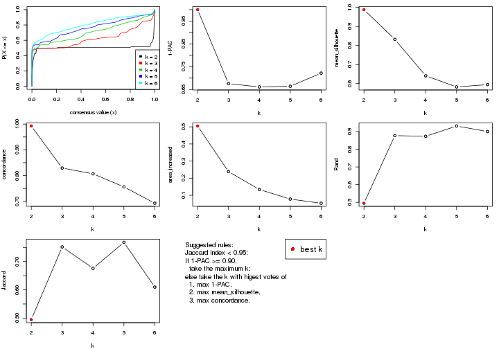

The numeric values for all these statistics can be obtained by `get_stats()`.

```r
get_stats(res)
```

```
#>   k 1-PAC mean_silhouette concordance area_increased  Rand Jaccard
#> 2 2 1.000           0.988       0.993         0.5050 0.495   0.495
#> 3 3 0.676           0.832       0.829         0.2385 0.877   0.752
#> 4 4 0.662           0.641       0.807         0.1337 0.873   0.676
#> 5 5 0.664           0.582       0.756         0.0777 0.932   0.768
#> 6 6 0.722           0.595       0.693         0.0534 0.900   0.610
```

`suggest_best_k()` suggests the best $k$ based on these statistics. The rules are as follows:

- All $k$ with Jaccard index larger than 0.95 are removed because increasing
  $k$ does not provide enough extra information. If all $k$ are removed, it is
  marked as no subgroup is detected.
- For all $k$ with 1-PAC score larger than 0.9, the maximal $k$ is taken as
  the best $k$, and other $k$ are marked as optional $k$.
- If it does not fit the second rule. The $k$ with the maximal vote of the
  highest 1-PAC score, highest mean silhouette, and highest concordance is
  taken as the best $k$.

```r
suggest_best_k(res)
```

```
#> [1] 2
```


Following shows the table of the partitions (You need to click the **show/hide
code output** link to see it). The membership matrix (columns with name `p*`)
is inferred by
[`clue::cl_consensus()`](https://www.rdocumentation.org/link/cl_consensus?package=clue)
function with the `SE` method. Basically the value in the membership matrix
represents the probability to belong to a certain group. The finall class
label for an item is determined with the group with highest probability it
belongs to.

In `get_classes()` function, the entropy is calculated from the membership
matrix and the silhouette score is calculated from the consensus matrix.


<script>
$( function() {
	$( '#tabs-CV-kmeans-get-classes' ).tabs();
} );
</script>
<div id='tabs-CV-kmeans-get-classes'>
<ul>
<li><a href='#tab-CV-kmeans-get-classes-1'>k = 2</a></li>
<li><a href='#tab-CV-kmeans-get-classes-2'>k = 3</a></li>
<li><a href='#tab-CV-kmeans-get-classes-3'>k = 4</a></li>
<li><a href='#tab-CV-kmeans-get-classes-4'>k = 5</a></li>
<li><a href='#tab-CV-kmeans-get-classes-5'>k = 6</a></li>
</ul>

<div id='tab-CV-kmeans-get-classes-1'>
<p><a id='tab-CV-kmeans-get-classes-1-a' style='color:#0366d6' href='#'>show/hide code output</a></p>
<pre><code class="r">cbind(get_classes(res, k = 2), get_membership(res, k = 2))
</code></pre>

<pre><code>#&gt;           class entropy silhouette    p1    p2
#&gt; GSM257886     1  0.0000      0.994 1.000 0.000
#&gt; GSM257888     1  0.0000      0.994 1.000 0.000
#&gt; GSM257890     1  0.0000      0.994 1.000 0.000
#&gt; GSM257892     1  0.7219      0.755 0.800 0.200
#&gt; GSM257894     1  0.0000      0.994 1.000 0.000
#&gt; GSM257896     1  0.0000      0.994 1.000 0.000
#&gt; GSM257898     1  0.0376      0.993 0.996 0.004
#&gt; GSM257900     1  0.0376      0.993 0.996 0.004
#&gt; GSM257902     1  0.0376      0.993 0.996 0.004
#&gt; GSM257904     1  0.0376      0.993 0.996 0.004
#&gt; GSM257906     1  0.0376      0.993 0.996 0.004
#&gt; GSM257908     1  0.0000      0.994 1.000 0.000
#&gt; GSM257910     1  0.0000      0.994 1.000 0.000
#&gt; GSM257912     1  0.0000      0.994 1.000 0.000
#&gt; GSM257914     1  0.0000      0.994 1.000 0.000
#&gt; GSM257917     1  0.0000      0.994 1.000 0.000
#&gt; GSM257919     1  0.0000      0.994 1.000 0.000
#&gt; GSM257921     1  0.0000      0.994 1.000 0.000
#&gt; GSM257923     1  0.0000      0.994 1.000 0.000
#&gt; GSM257925     1  0.0000      0.994 1.000 0.000
#&gt; GSM257927     1  0.0000      0.994 1.000 0.000
#&gt; GSM257929     1  0.0000      0.994 1.000 0.000
#&gt; GSM257937     1  0.0000      0.994 1.000 0.000
#&gt; GSM257939     1  0.0000      0.994 1.000 0.000
#&gt; GSM257941     1  0.0376      0.993 0.996 0.004
#&gt; GSM257943     1  0.0376      0.993 0.996 0.004
#&gt; GSM257945     1  0.0376      0.993 0.996 0.004
#&gt; GSM257947     1  0.0000      0.994 1.000 0.000
#&gt; GSM257949     1  0.0000      0.994 1.000 0.000
#&gt; GSM257951     1  0.0000      0.994 1.000 0.000
#&gt; GSM257953     1  0.0000      0.994 1.000 0.000
#&gt; GSM257955     1  0.0376      0.993 0.996 0.004
#&gt; GSM257958     1  0.0376      0.993 0.996 0.004
#&gt; GSM257960     1  0.0376      0.993 0.996 0.004
#&gt; GSM257962     1  0.0376      0.993 0.996 0.004
#&gt; GSM257964     1  0.0000      0.994 1.000 0.000
#&gt; GSM257966     1  0.0000      0.994 1.000 0.000
#&gt; GSM257968     1  0.0000      0.994 1.000 0.000
#&gt; GSM257970     1  0.0000      0.994 1.000 0.000
#&gt; GSM257972     1  0.0000      0.994 1.000 0.000
#&gt; GSM257977     1  0.0000      0.994 1.000 0.000
#&gt; GSM257982     1  0.0000      0.994 1.000 0.000
#&gt; GSM257984     1  0.0000      0.994 1.000 0.000
#&gt; GSM257986     1  0.0000      0.994 1.000 0.000
#&gt; GSM257990     1  0.0376      0.993 0.996 0.004
#&gt; GSM257992     1  0.0376      0.993 0.996 0.004
#&gt; GSM257996     1  0.0376      0.993 0.996 0.004
#&gt; GSM258006     1  0.0376      0.993 0.996 0.004
#&gt; GSM257887     2  0.0376      0.992 0.004 0.996
#&gt; GSM257889     2  0.2236      0.970 0.036 0.964
#&gt; GSM257891     2  0.2236      0.970 0.036 0.964
#&gt; GSM257893     2  0.0938      0.987 0.012 0.988
#&gt; GSM257895     2  0.0376      0.992 0.004 0.996
#&gt; GSM257897     2  0.2236      0.970 0.036 0.964
#&gt; GSM257899     2  0.2236      0.970 0.036 0.964
#&gt; GSM257901     2  0.0000      0.991 0.000 1.000
#&gt; GSM257903     2  0.0376      0.992 0.004 0.996
#&gt; GSM257905     2  0.0376      0.992 0.004 0.996
#&gt; GSM257907     2  0.0000      0.991 0.000 1.000
#&gt; GSM257909     2  0.0376      0.992 0.004 0.996
#&gt; GSM257911     2  0.0376      0.992 0.004 0.996
#&gt; GSM257913     2  0.0000      0.991 0.000 1.000
#&gt; GSM257916     2  0.0376      0.992 0.004 0.996
#&gt; GSM257918     2  0.0376      0.992 0.004 0.996
#&gt; GSM257920     2  0.0938      0.987 0.012 0.988
#&gt; GSM257922     2  0.2236      0.970 0.036 0.964
#&gt; GSM257924     2  0.0938      0.987 0.012 0.988
#&gt; GSM257926     2  0.0000      0.991 0.000 1.000
#&gt; GSM257928     2  0.0376      0.990 0.004 0.996
#&gt; GSM257930     2  0.0000      0.991 0.000 1.000
#&gt; GSM257938     2  0.0376      0.992 0.004 0.996
#&gt; GSM257940     2  0.0000      0.991 0.000 1.000
#&gt; GSM257942     2  0.0376      0.992 0.004 0.996
#&gt; GSM257944     2  0.0376      0.992 0.004 0.996
#&gt; GSM257946     2  0.0938      0.987 0.012 0.988
#&gt; GSM257948     2  0.0000      0.991 0.000 1.000
#&gt; GSM257950     2  0.2236      0.970 0.036 0.964
#&gt; GSM257952     2  0.0376      0.992 0.004 0.996
#&gt; GSM257954     2  0.0376      0.992 0.004 0.996
#&gt; GSM257956     2  0.0376      0.992 0.004 0.996
#&gt; GSM257959     2  0.0376      0.992 0.004 0.996
#&gt; GSM257961     2  0.0376      0.992 0.004 0.996
#&gt; GSM257963     2  0.0376      0.992 0.004 0.996
#&gt; GSM257965     2  0.0376      0.992 0.004 0.996
#&gt; GSM257967     2  0.0376      0.992 0.004 0.996
#&gt; GSM257969     2  0.0376      0.992 0.004 0.996
#&gt; GSM257971     2  0.0000      0.991 0.000 1.000
#&gt; GSM257973     2  0.0938      0.987 0.012 0.988
#&gt; GSM257981     2  0.0376      0.992 0.004 0.996
#&gt; GSM257983     2  0.2236      0.970 0.036 0.964
#&gt; GSM257985     2  0.0938      0.987 0.012 0.988
#&gt; GSM257988     2  0.0938      0.987 0.012 0.988
#&gt; GSM257991     2  0.0376      0.992 0.004 0.996
#&gt; GSM257993     2  0.0376      0.992 0.004 0.996
#&gt; GSM257994     2  0.0376      0.992 0.004 0.996
#&gt; GSM257989     2  0.0938      0.987 0.012 0.988
</code></pre>

<script>
$('#tab-CV-kmeans-get-classes-1-a').parent().next().next().hide();
$('#tab-CV-kmeans-get-classes-1-a').click(function(){
  $('#tab-CV-kmeans-get-classes-1-a').parent().next().next().toggle();
  return(false);
});
</script>
</div>

<div id='tab-CV-kmeans-get-classes-2'>
<p><a id='tab-CV-kmeans-get-classes-2-a' style='color:#0366d6' href='#'>show/hide code output</a></p>
<pre><code class="r">cbind(get_classes(res, k = 3), get_membership(res, k = 3))
</code></pre>

<pre><code>#&gt;           class entropy silhouette    p1    p2    p3
#&gt; GSM257886     1  0.4796     0.8619 0.780 0.000 0.220
#&gt; GSM257888     1  0.4605     0.8628 0.796 0.000 0.204
#&gt; GSM257890     1  0.4702     0.8633 0.788 0.000 0.212
#&gt; GSM257892     1  0.9326     0.1985 0.440 0.396 0.164
#&gt; GSM257894     1  0.3340     0.8952 0.880 0.000 0.120
#&gt; GSM257896     1  0.3116     0.8994 0.892 0.000 0.108
#&gt; GSM257898     1  0.1163     0.9180 0.972 0.000 0.028
#&gt; GSM257900     1  0.0747     0.9192 0.984 0.000 0.016
#&gt; GSM257902     1  0.0237     0.9219 0.996 0.000 0.004
#&gt; GSM257904     1  0.3879     0.8872 0.848 0.000 0.152
#&gt; GSM257906     1  0.1031     0.9192 0.976 0.000 0.024
#&gt; GSM257908     1  0.6416     0.8163 0.708 0.032 0.260
#&gt; GSM257910     1  0.6341     0.8199 0.716 0.032 0.252
#&gt; GSM257912     1  0.6341     0.8199 0.716 0.032 0.252
#&gt; GSM257914     1  0.6341     0.8199 0.716 0.032 0.252
#&gt; GSM257917     1  0.6341     0.8199 0.716 0.032 0.252
#&gt; GSM257919     1  0.6341     0.8199 0.716 0.032 0.252
#&gt; GSM257921     1  0.4291     0.8738 0.820 0.000 0.180
#&gt; GSM257923     1  0.0000     0.9220 1.000 0.000 0.000
#&gt; GSM257925     1  0.0000     0.9220 1.000 0.000 0.000
#&gt; GSM257927     1  0.0237     0.9216 0.996 0.000 0.004
#&gt; GSM257929     1  0.0000     0.9220 1.000 0.000 0.000
#&gt; GSM257937     1  0.5216     0.8354 0.740 0.000 0.260
#&gt; GSM257939     1  0.0000     0.9220 1.000 0.000 0.000
#&gt; GSM257941     1  0.1031     0.9192 0.976 0.000 0.024
#&gt; GSM257943     1  0.1031     0.9192 0.976 0.000 0.024
#&gt; GSM257945     1  0.0592     0.9215 0.988 0.000 0.012
#&gt; GSM257947     1  0.0000     0.9220 1.000 0.000 0.000
#&gt; GSM257949     1  0.0237     0.9217 0.996 0.000 0.004
#&gt; GSM257951     1  0.0000     0.9220 1.000 0.000 0.000
#&gt; GSM257953     1  0.0237     0.9216 0.996 0.000 0.004
#&gt; GSM257955     1  0.0000     0.9220 1.000 0.000 0.000
#&gt; GSM257958     1  0.0237     0.9219 0.996 0.000 0.004
#&gt; GSM257960     1  0.0424     0.9216 0.992 0.000 0.008
#&gt; GSM257962     1  0.0424     0.9216 0.992 0.000 0.008
#&gt; GSM257964     1  0.0000     0.9220 1.000 0.000 0.000
#&gt; GSM257966     1  0.6379     0.8158 0.712 0.032 0.256
#&gt; GSM257968     1  0.3038     0.8995 0.896 0.000 0.104
#&gt; GSM257970     1  0.0000     0.9220 1.000 0.000 0.000
#&gt; GSM257972     1  0.0424     0.9214 0.992 0.000 0.008
#&gt; GSM257977     1  0.3116     0.8994 0.892 0.000 0.108
#&gt; GSM257982     1  0.1031     0.9191 0.976 0.000 0.024
#&gt; GSM257984     1  0.0000     0.9220 1.000 0.000 0.000
#&gt; GSM257986     1  0.0237     0.9217 0.996 0.000 0.004
#&gt; GSM257990     1  0.0424     0.9216 0.992 0.000 0.008
#&gt; GSM257992     1  0.1031     0.9192 0.976 0.000 0.024
#&gt; GSM257996     1  0.4796     0.8544 0.780 0.000 0.220
#&gt; GSM258006     1  0.1031     0.9192 0.976 0.000 0.024
#&gt; GSM257887     2  0.1163     0.8040 0.000 0.972 0.028
#&gt; GSM257889     3  0.6339     0.8271 0.008 0.360 0.632
#&gt; GSM257891     3  0.5728     0.9133 0.008 0.272 0.720
#&gt; GSM257893     3  0.6008     0.8232 0.000 0.372 0.628
#&gt; GSM257895     2  0.1964     0.7915 0.000 0.944 0.056
#&gt; GSM257897     3  0.7378     0.7632 0.052 0.320 0.628
#&gt; GSM257899     3  0.6359     0.8217 0.008 0.364 0.628
#&gt; GSM257901     2  0.6305    -0.3210 0.000 0.516 0.484
#&gt; GSM257903     2  0.2796     0.8262 0.000 0.908 0.092
#&gt; GSM257905     2  0.2796     0.8262 0.000 0.908 0.092
#&gt; GSM257907     3  0.5621     0.9231 0.000 0.308 0.692
#&gt; GSM257909     2  0.2796     0.8262 0.000 0.908 0.092
#&gt; GSM257911     2  0.4931     0.7046 0.000 0.768 0.232
#&gt; GSM257913     3  0.5621     0.9231 0.000 0.308 0.692
#&gt; GSM257916     2  0.3340     0.8186 0.000 0.880 0.120
#&gt; GSM257918     2  0.3038     0.8244 0.000 0.896 0.104
#&gt; GSM257920     3  0.5621     0.9231 0.000 0.308 0.692
#&gt; GSM257922     3  0.6359     0.8217 0.008 0.364 0.628
#&gt; GSM257924     3  0.5621     0.9231 0.000 0.308 0.692
#&gt; GSM257926     3  0.5621     0.9231 0.000 0.308 0.692
#&gt; GSM257928     2  0.5905    -0.0198 0.000 0.648 0.352
#&gt; GSM257930     2  0.2066     0.7882 0.000 0.940 0.060
#&gt; GSM257938     2  0.2066     0.7882 0.000 0.940 0.060
#&gt; GSM257940     3  0.5621     0.9231 0.000 0.308 0.692
#&gt; GSM257942     2  0.2796     0.8262 0.000 0.908 0.092
#&gt; GSM257944     2  0.2796     0.8262 0.000 0.908 0.092
#&gt; GSM257946     3  0.5497     0.9218 0.000 0.292 0.708
#&gt; GSM257948     3  0.5621     0.9231 0.000 0.308 0.692
#&gt; GSM257950     3  0.5958     0.9189 0.008 0.300 0.692
#&gt; GSM257952     2  0.4842     0.7186 0.000 0.776 0.224
#&gt; GSM257954     2  0.1529     0.7987 0.000 0.960 0.040
#&gt; GSM257956     2  0.1964     0.7915 0.000 0.944 0.056
#&gt; GSM257959     2  0.2796     0.8262 0.000 0.908 0.092
#&gt; GSM257961     2  0.2796     0.8262 0.000 0.908 0.092
#&gt; GSM257963     2  0.2796     0.8262 0.000 0.908 0.092
#&gt; GSM257965     2  0.4842     0.7186 0.000 0.776 0.224
#&gt; GSM257967     2  0.2796     0.8262 0.000 0.908 0.092
#&gt; GSM257969     2  0.1163     0.8040 0.000 0.972 0.028
#&gt; GSM257971     2  0.5678     0.2688 0.000 0.684 0.316
#&gt; GSM257973     3  0.5621     0.9231 0.000 0.308 0.692
#&gt; GSM257981     2  0.4842     0.7186 0.000 0.776 0.224
#&gt; GSM257983     3  0.5728     0.9133 0.008 0.272 0.720
#&gt; GSM257985     3  0.5431     0.9186 0.000 0.284 0.716
#&gt; GSM257988     3  0.5621     0.9231 0.000 0.308 0.692
#&gt; GSM257991     2  0.4399     0.7409 0.000 0.812 0.188
#&gt; GSM257993     2  0.1753     0.7945 0.000 0.952 0.048
#&gt; GSM257994     2  0.2066     0.7882 0.000 0.940 0.060
#&gt; GSM257989     3  0.5690     0.9215 0.004 0.288 0.708
</code></pre>

<script>
$('#tab-CV-kmeans-get-classes-2-a').parent().next().next().hide();
$('#tab-CV-kmeans-get-classes-2-a').click(function(){
  $('#tab-CV-kmeans-get-classes-2-a').parent().next().next().toggle();
  return(false);
});
</script>
</div>

<div id='tab-CV-kmeans-get-classes-3'>
<p><a id='tab-CV-kmeans-get-classes-3-a' style='color:#0366d6' href='#'>show/hide code output</a></p>
<pre><code class="r">cbind(get_classes(res, k = 4), get_membership(res, k = 4))
</code></pre>

<pre><code>#&gt;           class entropy silhouette    p1    p2    p3    p4
#&gt; GSM257886     4  0.6197     0.5523 0.440 0.052 0.000 0.508
#&gt; GSM257888     1  0.5755    -0.6209 0.528 0.028 0.000 0.444
#&gt; GSM257890     1  0.6200    -0.5962 0.504 0.052 0.000 0.444
#&gt; GSM257892     2  0.7758    -0.2412 0.308 0.432 0.000 0.260
#&gt; GSM257894     1  0.5228    -0.0781 0.664 0.024 0.000 0.312
#&gt; GSM257896     1  0.4964     0.2101 0.716 0.028 0.000 0.256
#&gt; GSM257898     1  0.3367     0.7161 0.864 0.028 0.000 0.108
#&gt; GSM257900     1  0.2699     0.7481 0.904 0.028 0.000 0.068
#&gt; GSM257902     1  0.0000     0.7983 1.000 0.000 0.000 0.000
#&gt; GSM257904     1  0.5538     0.1027 0.644 0.036 0.000 0.320
#&gt; GSM257906     1  0.3497     0.7150 0.860 0.036 0.000 0.104
#&gt; GSM257908     4  0.4907     0.8950 0.420 0.000 0.000 0.580
#&gt; GSM257910     4  0.4933     0.8980 0.432 0.000 0.000 0.568
#&gt; GSM257912     4  0.4925     0.8994 0.428 0.000 0.000 0.572
#&gt; GSM257914     4  0.4925     0.8994 0.428 0.000 0.000 0.572
#&gt; GSM257917     4  0.4933     0.8980 0.432 0.000 0.000 0.568
#&gt; GSM257919     4  0.4925     0.8994 0.428 0.000 0.000 0.572
#&gt; GSM257921     1  0.5630    -0.4396 0.608 0.032 0.000 0.360
#&gt; GSM257923     1  0.0000     0.7983 1.000 0.000 0.000 0.000
#&gt; GSM257925     1  0.0000     0.7983 1.000 0.000 0.000 0.000
#&gt; GSM257927     1  0.1004     0.7914 0.972 0.004 0.000 0.024
#&gt; GSM257929     1  0.0000     0.7983 1.000 0.000 0.000 0.000
#&gt; GSM257937     4  0.5660     0.8299 0.396 0.028 0.000 0.576
#&gt; GSM257939     1  0.0000     0.7983 1.000 0.000 0.000 0.000
#&gt; GSM257941     1  0.2984     0.7377 0.888 0.028 0.000 0.084
#&gt; GSM257943     1  0.3182     0.7289 0.876 0.028 0.000 0.096
#&gt; GSM257945     1  0.1635     0.7811 0.948 0.008 0.000 0.044
#&gt; GSM257947     1  0.0000     0.7983 1.000 0.000 0.000 0.000
#&gt; GSM257949     1  0.0000     0.7983 1.000 0.000 0.000 0.000
#&gt; GSM257951     1  0.0000     0.7983 1.000 0.000 0.000 0.000
#&gt; GSM257953     1  0.0336     0.7972 0.992 0.000 0.000 0.008
#&gt; GSM257955     1  0.0000     0.7983 1.000 0.000 0.000 0.000
#&gt; GSM257958     1  0.0469     0.7959 0.988 0.000 0.000 0.012
#&gt; GSM257960     1  0.1677     0.7815 0.948 0.012 0.000 0.040
#&gt; GSM257962     1  0.1545     0.7826 0.952 0.008 0.000 0.040
#&gt; GSM257964     1  0.0000     0.7983 1.000 0.000 0.000 0.000
#&gt; GSM257966     4  0.5290     0.8319 0.404 0.012 0.000 0.584
#&gt; GSM257968     1  0.4661     0.2409 0.728 0.016 0.000 0.256
#&gt; GSM257970     1  0.0000     0.7983 1.000 0.000 0.000 0.000
#&gt; GSM257972     1  0.0188     0.7971 0.996 0.000 0.000 0.004
#&gt; GSM257977     1  0.4993     0.2064 0.712 0.028 0.000 0.260
#&gt; GSM257982     1  0.2861     0.6666 0.888 0.016 0.000 0.096
#&gt; GSM257984     1  0.0000     0.7983 1.000 0.000 0.000 0.000
#&gt; GSM257986     1  0.0000     0.7983 1.000 0.000 0.000 0.000
#&gt; GSM257990     1  0.1635     0.7811 0.948 0.008 0.000 0.044
#&gt; GSM257992     1  0.3367     0.7161 0.864 0.028 0.000 0.108
#&gt; GSM257996     4  0.5000     0.7398 0.500 0.000 0.000 0.500
#&gt; GSM258006     1  0.3245     0.7248 0.872 0.028 0.000 0.100
#&gt; GSM257887     2  0.1637     0.7353 0.000 0.940 0.060 0.000
#&gt; GSM257889     3  0.2775     0.7817 0.000 0.084 0.896 0.020
#&gt; GSM257891     3  0.0524     0.8393 0.000 0.008 0.988 0.004
#&gt; GSM257893     3  0.4483     0.7261 0.000 0.104 0.808 0.088
#&gt; GSM257895     2  0.2751     0.7221 0.000 0.904 0.056 0.040
#&gt; GSM257897     3  0.4999     0.7175 0.012 0.100 0.792 0.096
#&gt; GSM257899     3  0.4731     0.7223 0.004 0.100 0.800 0.096
#&gt; GSM257901     3  0.6065     0.5037 0.000 0.140 0.684 0.176
#&gt; GSM257903     2  0.5770     0.7517 0.000 0.712 0.140 0.148
#&gt; GSM257905     2  0.5630     0.7563 0.000 0.724 0.140 0.136
#&gt; GSM257907     3  0.3494     0.7330 0.000 0.004 0.824 0.172
#&gt; GSM257909     2  0.5630     0.7563 0.000 0.724 0.140 0.136
#&gt; GSM257911     3  0.7534    -0.2647 0.000 0.380 0.432 0.188
#&gt; GSM257913     3  0.2654     0.7742 0.000 0.004 0.888 0.108
#&gt; GSM257916     2  0.5480     0.7555 0.000 0.736 0.140 0.124
#&gt; GSM257918     2  0.5630     0.7563 0.000 0.724 0.140 0.136
#&gt; GSM257920     3  0.0376     0.8421 0.000 0.004 0.992 0.004
#&gt; GSM257922     3  0.4908     0.7142 0.004 0.100 0.788 0.108
#&gt; GSM257924     3  0.0188     0.8423 0.000 0.004 0.996 0.000
#&gt; GSM257926     3  0.0188     0.8423 0.000 0.004 0.996 0.000
#&gt; GSM257928     2  0.6654     0.3215 0.000 0.588 0.296 0.116
#&gt; GSM257930     2  0.4188     0.6800 0.000 0.824 0.064 0.112
#&gt; GSM257938     2  0.3935     0.6892 0.000 0.840 0.060 0.100
#&gt; GSM257940     3  0.3494     0.7330 0.000 0.004 0.824 0.172
#&gt; GSM257942     2  0.5770     0.7517 0.000 0.712 0.140 0.148
#&gt; GSM257944     2  0.5770     0.7517 0.000 0.712 0.140 0.148
#&gt; GSM257946     3  0.0000     0.8420 0.000 0.000 1.000 0.000
#&gt; GSM257948     3  0.0376     0.8421 0.000 0.004 0.992 0.004
#&gt; GSM257950     3  0.0376     0.8421 0.000 0.004 0.992 0.004
#&gt; GSM257952     2  0.7476     0.2849 0.000 0.416 0.408 0.176
#&gt; GSM257954     2  0.2142     0.7287 0.000 0.928 0.056 0.016
#&gt; GSM257956     2  0.2660     0.7236 0.000 0.908 0.056 0.036
#&gt; GSM257959     2  0.5630     0.7563 0.000 0.724 0.140 0.136
#&gt; GSM257961     2  0.5630     0.7563 0.000 0.724 0.140 0.136
#&gt; GSM257963     2  0.5630     0.7563 0.000 0.724 0.140 0.136
#&gt; GSM257965     2  0.7500     0.2846 0.000 0.412 0.408 0.180
#&gt; GSM257967     2  0.5630     0.7563 0.000 0.724 0.140 0.136
#&gt; GSM257969     2  0.1824     0.7347 0.000 0.936 0.060 0.004
#&gt; GSM257971     2  0.7443    -0.0312 0.000 0.436 0.392 0.172
#&gt; GSM257973     3  0.0376     0.8421 0.000 0.004 0.992 0.004
#&gt; GSM257981     3  0.7476    -0.3238 0.000 0.408 0.416 0.176
#&gt; GSM257983     3  0.0188     0.8411 0.000 0.004 0.996 0.000
#&gt; GSM257985     3  0.0336     0.8396 0.000 0.008 0.992 0.000
#&gt; GSM257988     3  0.0376     0.8421 0.000 0.004 0.992 0.004
#&gt; GSM257991     2  0.7586     0.4368 0.000 0.460 0.328 0.212
#&gt; GSM257993     2  0.2466     0.7256 0.000 0.916 0.056 0.028
#&gt; GSM257994     2  0.3996     0.6875 0.000 0.836 0.060 0.104
#&gt; GSM257989     3  0.0188     0.8423 0.000 0.000 0.996 0.004
</code></pre>

<script>
$('#tab-CV-kmeans-get-classes-3-a').parent().next().next().hide();
$('#tab-CV-kmeans-get-classes-3-a').click(function(){
  $('#tab-CV-kmeans-get-classes-3-a').parent().next().next().toggle();
  return(false);
});
</script>
</div>

<div id='tab-CV-kmeans-get-classes-4'>
<p><a id='tab-CV-kmeans-get-classes-4-a' style='color:#0366d6' href='#'>show/hide code output</a></p>
<pre><code class="r">cbind(get_classes(res, k = 5), get_membership(res, k = 5))
</code></pre>

<pre><code>#&gt;           class entropy silhouette    p1    p2    p3    p4    p5
#&gt; GSM257886     4  0.7000     0.4529 0.232 0.052 0.000 0.544 0.172
#&gt; GSM257888     4  0.6051     0.4369 0.384 0.020 0.000 0.524 0.072
#&gt; GSM257890     4  0.6898     0.4875 0.296 0.052 0.000 0.528 0.124
#&gt; GSM257892     5  0.8342    -0.2232 0.204 0.156 0.000 0.304 0.336
#&gt; GSM257894     1  0.6008    -0.2111 0.492 0.020 0.000 0.424 0.064
#&gt; GSM257896     1  0.6162    -0.1596 0.500 0.024 0.000 0.404 0.072
#&gt; GSM257898     1  0.5267     0.6533 0.724 0.032 0.000 0.088 0.156
#&gt; GSM257900     1  0.4745     0.6813 0.764 0.032 0.000 0.060 0.144
#&gt; GSM257902     1  0.0566     0.7740 0.984 0.004 0.000 0.012 0.000
#&gt; GSM257904     1  0.7052     0.3266 0.532 0.052 0.000 0.248 0.168
#&gt; GSM257906     1  0.5677     0.6290 0.696 0.052 0.000 0.084 0.168
#&gt; GSM257908     4  0.5174     0.8069 0.196 0.008 0.000 0.700 0.096
#&gt; GSM257910     4  0.5266     0.8100 0.208 0.008 0.000 0.688 0.096
#&gt; GSM257912     4  0.5266     0.8100 0.208 0.008 0.000 0.688 0.096
#&gt; GSM257914     4  0.5266     0.8100 0.208 0.008 0.000 0.688 0.096
#&gt; GSM257917     4  0.5266     0.8100 0.208 0.008 0.000 0.688 0.096
#&gt; GSM257919     4  0.5266     0.8100 0.208 0.008 0.000 0.688 0.096
#&gt; GSM257921     1  0.6374    -0.3018 0.460 0.032 0.000 0.432 0.076
#&gt; GSM257923     1  0.0404     0.7750 0.988 0.000 0.000 0.012 0.000
#&gt; GSM257925     1  0.0404     0.7750 0.988 0.000 0.000 0.012 0.000
#&gt; GSM257927     1  0.2012     0.7563 0.920 0.000 0.000 0.020 0.060
#&gt; GSM257929     1  0.0404     0.7750 0.988 0.000 0.000 0.012 0.000
#&gt; GSM257937     4  0.4043     0.7438 0.160 0.012 0.000 0.792 0.036
#&gt; GSM257939     1  0.0404     0.7750 0.988 0.000 0.000 0.012 0.000
#&gt; GSM257941     1  0.4901     0.6719 0.756 0.032 0.000 0.076 0.136
#&gt; GSM257943     1  0.5175     0.6591 0.732 0.032 0.000 0.084 0.152
#&gt; GSM257945     1  0.3043     0.7369 0.864 0.000 0.000 0.056 0.080
#&gt; GSM257947     1  0.0404     0.7750 0.988 0.000 0.000 0.012 0.000
#&gt; GSM257949     1  0.0510     0.7741 0.984 0.000 0.000 0.016 0.000
#&gt; GSM257951     1  0.0404     0.7750 0.988 0.000 0.000 0.012 0.000
#&gt; GSM257953     1  0.0404     0.7730 0.988 0.000 0.000 0.012 0.000
#&gt; GSM257955     1  0.0404     0.7750 0.988 0.000 0.000 0.012 0.000
#&gt; GSM257958     1  0.0290     0.7729 0.992 0.000 0.000 0.008 0.000
#&gt; GSM257960     1  0.3635     0.7231 0.836 0.016 0.000 0.040 0.108
#&gt; GSM257962     1  0.2754     0.7420 0.880 0.000 0.000 0.040 0.080
#&gt; GSM257964     1  0.0404     0.7750 0.988 0.000 0.000 0.012 0.000
#&gt; GSM257966     4  0.3132     0.7545 0.172 0.008 0.000 0.820 0.000
#&gt; GSM257968     1  0.5142    -0.0207 0.564 0.000 0.000 0.392 0.044
#&gt; GSM257970     1  0.0404     0.7750 0.988 0.000 0.000 0.012 0.000
#&gt; GSM257972     1  0.0609     0.7732 0.980 0.000 0.000 0.020 0.000
#&gt; GSM257977     1  0.6084    -0.1537 0.504 0.020 0.000 0.404 0.072
#&gt; GSM257982     1  0.4062     0.5258 0.764 0.000 0.000 0.196 0.040
#&gt; GSM257984     1  0.0404     0.7750 0.988 0.000 0.000 0.012 0.000
#&gt; GSM257986     1  0.0404     0.7750 0.988 0.000 0.000 0.012 0.000
#&gt; GSM257990     1  0.3047     0.7389 0.868 0.004 0.000 0.044 0.084
#&gt; GSM257992     1  0.5214     0.6564 0.728 0.032 0.000 0.084 0.156
#&gt; GSM257996     4  0.5600     0.7202 0.264 0.004 0.000 0.628 0.104
#&gt; GSM258006     1  0.5214     0.6564 0.728 0.032 0.000 0.084 0.156
#&gt; GSM257887     2  0.4415    -0.1355 0.000 0.604 0.008 0.000 0.388
#&gt; GSM257889     3  0.2505     0.7706 0.000 0.000 0.888 0.020 0.092
#&gt; GSM257891     3  0.0794     0.8373 0.000 0.000 0.972 0.028 0.000
#&gt; GSM257893     3  0.4181     0.6078 0.000 0.000 0.712 0.020 0.268
#&gt; GSM257895     5  0.4824     0.4143 0.000 0.468 0.020 0.000 0.512
#&gt; GSM257897     3  0.4360     0.5923 0.000 0.000 0.692 0.024 0.284
#&gt; GSM257899     3  0.4360     0.5923 0.000 0.000 0.692 0.024 0.284
#&gt; GSM257901     3  0.6467     0.3721 0.000 0.264 0.592 0.072 0.072
#&gt; GSM257903     2  0.1502     0.6590 0.000 0.940 0.056 0.000 0.004
#&gt; GSM257905     2  0.1740     0.6600 0.000 0.932 0.056 0.000 0.012
#&gt; GSM257907     3  0.5849     0.5788 0.000 0.172 0.684 0.072 0.072
#&gt; GSM257909     2  0.1740     0.6600 0.000 0.932 0.056 0.000 0.012
#&gt; GSM257911     2  0.6855     0.3322 0.000 0.488 0.364 0.072 0.076
#&gt; GSM257913     3  0.3167     0.7042 0.000 0.172 0.820 0.004 0.004
#&gt; GSM257916     2  0.2036     0.6516 0.000 0.920 0.056 0.000 0.024
#&gt; GSM257918     2  0.1341     0.6598 0.000 0.944 0.056 0.000 0.000
#&gt; GSM257920     3  0.0566     0.8470 0.000 0.012 0.984 0.004 0.000
#&gt; GSM257922     3  0.4437     0.5562 0.000 0.000 0.664 0.020 0.316
#&gt; GSM257924     3  0.0693     0.8468 0.000 0.012 0.980 0.008 0.000
#&gt; GSM257926     3  0.0404     0.8473 0.000 0.012 0.988 0.000 0.000
#&gt; GSM257928     5  0.5578     0.4885 0.000 0.176 0.180 0.000 0.644
#&gt; GSM257930     5  0.4585     0.5869 0.000 0.352 0.020 0.000 0.628
#&gt; GSM257938     5  0.4585     0.5869 0.000 0.352 0.020 0.000 0.628
#&gt; GSM257940     3  0.5849     0.5788 0.000 0.172 0.684 0.072 0.072
#&gt; GSM257942     2  0.1502     0.6590 0.000 0.940 0.056 0.000 0.004
#&gt; GSM257944     2  0.1502     0.6590 0.000 0.940 0.056 0.000 0.004
#&gt; GSM257946     3  0.0693     0.8468 0.000 0.012 0.980 0.008 0.000
#&gt; GSM257948     3  0.0566     0.8470 0.000 0.012 0.984 0.004 0.000
#&gt; GSM257950     3  0.0693     0.8473 0.000 0.012 0.980 0.008 0.000
#&gt; GSM257952     2  0.7047     0.3369 0.000 0.480 0.352 0.072 0.096
#&gt; GSM257954     2  0.4787    -0.3045 0.000 0.548 0.020 0.000 0.432
#&gt; GSM257956     5  0.4824     0.4143 0.000 0.468 0.020 0.000 0.512
#&gt; GSM257959     2  0.1740     0.6600 0.000 0.932 0.056 0.000 0.012
#&gt; GSM257961     2  0.1740     0.6600 0.000 0.932 0.056 0.000 0.012
#&gt; GSM257963     2  0.1740     0.6600 0.000 0.932 0.056 0.000 0.012
#&gt; GSM257965     2  0.7047     0.3369 0.000 0.480 0.352 0.072 0.096
#&gt; GSM257967     2  0.1740     0.6600 0.000 0.932 0.056 0.000 0.012
#&gt; GSM257969     2  0.4446    -0.1706 0.000 0.592 0.008 0.000 0.400
#&gt; GSM257971     5  0.6992     0.3168 0.000 0.148 0.244 0.060 0.548
#&gt; GSM257973     3  0.0566     0.8470 0.000 0.012 0.984 0.004 0.000
#&gt; GSM257981     2  0.6974     0.3357 0.000 0.480 0.360 0.068 0.092
#&gt; GSM257983     3  0.0162     0.8457 0.000 0.004 0.996 0.000 0.000
#&gt; GSM257985     3  0.0162     0.8430 0.000 0.000 0.996 0.004 0.000
#&gt; GSM257988     3  0.0566     0.8470 0.000 0.012 0.984 0.004 0.000
#&gt; GSM257991     2  0.5403     0.5042 0.000 0.720 0.156 0.052 0.072
#&gt; GSM257993     2  0.4824    -0.4028 0.000 0.512 0.020 0.000 0.468
#&gt; GSM257994     5  0.4585     0.5869 0.000 0.352 0.020 0.000 0.628
#&gt; GSM257989     3  0.0404     0.8473 0.000 0.012 0.988 0.000 0.000
</code></pre>

<script>
$('#tab-CV-kmeans-get-classes-4-a').parent().next().next().hide();
$('#tab-CV-kmeans-get-classes-4-a').click(function(){
  $('#tab-CV-kmeans-get-classes-4-a').parent().next().next().toggle();
  return(false);
});
</script>
</div>

<div id='tab-CV-kmeans-get-classes-5'>
<p><a id='tab-CV-kmeans-get-classes-5-a' style='color:#0366d6' href='#'>show/hide code output</a></p>
<pre><code class="r">cbind(get_classes(res, k = 6), get_membership(res, k = 6))
</code></pre>

<pre><code>#&gt;           class entropy silhouette    p1    p2    p3    p4    p5    p6
#&gt; GSM257886     4  0.3881     0.3396 0.000 0.000 0.000 0.600 0.004 0.396
#&gt; GSM257888     4  0.4459     0.4797 0.204 0.000 0.000 0.700 0.000 0.096
#&gt; GSM257890     4  0.4559     0.4359 0.060 0.000 0.000 0.664 0.004 0.272
#&gt; GSM257892     4  0.6711     0.2627 0.008 0.056 0.000 0.476 0.152 0.308
#&gt; GSM257894     4  0.5138     0.3581 0.268 0.000 0.000 0.604 0.000 0.128
#&gt; GSM257896     4  0.5303     0.3803 0.232 0.000 0.000 0.596 0.000 0.172
#&gt; GSM257898     6  0.0146     0.7610 0.000 0.000 0.000 0.000 0.004 0.996
#&gt; GSM257900     6  0.0508     0.7568 0.012 0.000 0.000 0.004 0.000 0.984
#&gt; GSM257902     1  0.3993     0.9345 0.520 0.000 0.000 0.000 0.004 0.476
#&gt; GSM257904     6  0.2544     0.5967 0.004 0.000 0.000 0.140 0.004 0.852
#&gt; GSM257906     6  0.1674     0.6873 0.004 0.000 0.000 0.068 0.004 0.924
#&gt; GSM257908     4  0.6890     0.5979 0.252 0.020 0.000 0.492 0.188 0.048
#&gt; GSM257910     4  0.6890     0.5979 0.252 0.020 0.000 0.492 0.188 0.048
#&gt; GSM257912     4  0.6890     0.5979 0.252 0.020 0.000 0.492 0.188 0.048
#&gt; GSM257914     4  0.6890     0.5979 0.252 0.020 0.000 0.492 0.188 0.048
#&gt; GSM257917     4  0.6890     0.5979 0.252 0.020 0.000 0.492 0.188 0.048
#&gt; GSM257919     4  0.6890     0.5979 0.252 0.020 0.000 0.492 0.188 0.048
#&gt; GSM257921     4  0.6686     0.3071 0.112 0.000 0.000 0.444 0.096 0.348
#&gt; GSM257923     1  0.3864     0.9460 0.520 0.000 0.000 0.000 0.000 0.480
#&gt; GSM257925     1  0.3864     0.9460 0.520 0.000 0.000 0.000 0.000 0.480
#&gt; GSM257927     6  0.3309     0.1469 0.280 0.000 0.000 0.000 0.000 0.720
#&gt; GSM257929     1  0.3864     0.9460 0.520 0.000 0.000 0.000 0.000 0.480
#&gt; GSM257937     4  0.3727     0.5846 0.076 0.000 0.000 0.816 0.076 0.032
#&gt; GSM257939     1  0.3864     0.9460 0.520 0.000 0.000 0.000 0.000 0.480
#&gt; GSM257941     6  0.1007     0.7378 0.044 0.000 0.000 0.000 0.000 0.956
#&gt; GSM257943     6  0.0146     0.7610 0.000 0.000 0.000 0.000 0.004 0.996
#&gt; GSM257945     6  0.2793     0.4949 0.200 0.000 0.000 0.000 0.000 0.800
#&gt; GSM257947     1  0.3864     0.9460 0.520 0.000 0.000 0.000 0.000 0.480
#&gt; GSM257949     1  0.3862     0.9415 0.524 0.000 0.000 0.000 0.000 0.476
#&gt; GSM257951     1  0.3864     0.9460 0.520 0.000 0.000 0.000 0.000 0.480
#&gt; GSM257953     1  0.3864     0.9460 0.520 0.000 0.000 0.000 0.000 0.480
#&gt; GSM257955     1  0.3864     0.9460 0.520 0.000 0.000 0.000 0.000 0.480
#&gt; GSM257958     1  0.3866     0.9371 0.516 0.000 0.000 0.000 0.000 0.484
#&gt; GSM257960     6  0.2527     0.5761 0.168 0.000 0.000 0.000 0.000 0.832
#&gt; GSM257962     6  0.2969     0.4187 0.224 0.000 0.000 0.000 0.000 0.776
#&gt; GSM257964     1  0.3864     0.9460 0.520 0.000 0.000 0.000 0.000 0.480
#&gt; GSM257966     4  0.5593     0.5938 0.136 0.020 0.000 0.672 0.140 0.032
#&gt; GSM257968     4  0.5791     0.0458 0.336 0.000 0.000 0.472 0.000 0.192
#&gt; GSM257970     1  0.3864     0.9460 0.520 0.000 0.000 0.000 0.000 0.480
#&gt; GSM257972     1  0.3993     0.9353 0.520 0.000 0.000 0.004 0.000 0.476
#&gt; GSM257977     4  0.5279     0.3727 0.244 0.000 0.000 0.596 0.000 0.160
#&gt; GSM257982     1  0.6078     0.2860 0.396 0.000 0.000 0.320 0.000 0.284
#&gt; GSM257984     1  0.3995     0.9412 0.516 0.000 0.000 0.004 0.000 0.480
#&gt; GSM257986     1  0.3862     0.9415 0.524 0.000 0.000 0.000 0.000 0.476
#&gt; GSM257990     6  0.2964     0.4970 0.204 0.000 0.000 0.000 0.004 0.792
#&gt; GSM257992     6  0.0146     0.7610 0.000 0.000 0.000 0.000 0.004 0.996
#&gt; GSM257996     4  0.7592     0.5519 0.252 0.016 0.000 0.412 0.188 0.132
#&gt; GSM258006     6  0.0291     0.7588 0.004 0.000 0.000 0.000 0.004 0.992
#&gt; GSM257887     2  0.4275    -0.1362 0.016 0.592 0.000 0.004 0.388 0.000
#&gt; GSM257889     3  0.2196     0.7643 0.016 0.000 0.908 0.020 0.056 0.000
#&gt; GSM257891     3  0.1320     0.8011 0.016 0.000 0.948 0.036 0.000 0.000
#&gt; GSM257893     3  0.4482     0.5002 0.016 0.000 0.644 0.024 0.316 0.000
#&gt; GSM257895     5  0.4389     0.3777 0.016 0.468 0.004 0.000 0.512 0.000
#&gt; GSM257897     3  0.4900     0.4853 0.016 0.000 0.628 0.024 0.316 0.016
#&gt; GSM257899     3  0.4900     0.4853 0.016 0.000 0.628 0.024 0.316 0.016
#&gt; GSM257901     3  0.6780     0.3572 0.236 0.180 0.516 0.020 0.048 0.000
#&gt; GSM257903     2  0.0748     0.6357 0.000 0.976 0.016 0.004 0.004 0.000
#&gt; GSM257905     2  0.0748     0.6345 0.004 0.976 0.016 0.004 0.000 0.000
#&gt; GSM257907     3  0.6380     0.4742 0.236 0.124 0.572 0.020 0.048 0.000
#&gt; GSM257909     2  0.0458     0.6369 0.000 0.984 0.016 0.000 0.000 0.000
#&gt; GSM257911     2  0.7214     0.2018 0.240 0.384 0.308 0.016 0.052 0.000
#&gt; GSM257913     3  0.3142     0.7179 0.032 0.124 0.836 0.004 0.004 0.000
#&gt; GSM257916     2  0.1078     0.6256 0.012 0.964 0.016 0.000 0.008 0.000
#&gt; GSM257918     2  0.0458     0.6369 0.000 0.984 0.016 0.000 0.000 0.000
#&gt; GSM257920     3  0.0777     0.8152 0.024 0.004 0.972 0.000 0.000 0.000
#&gt; GSM257922     3  0.4937     0.3873 0.016 0.000 0.564 0.024 0.388 0.008
#&gt; GSM257924     3  0.0146     0.8164 0.000 0.004 0.996 0.000 0.000 0.000
#&gt; GSM257926     3  0.0146     0.8164 0.000 0.004 0.996 0.000 0.000 0.000
#&gt; GSM257928     5  0.4350     0.6087 0.000 0.116 0.120 0.004 0.752 0.008
#&gt; GSM257930     5  0.3354     0.6970 0.000 0.240 0.004 0.004 0.752 0.000
#&gt; GSM257938     5  0.3240     0.6985 0.000 0.244 0.004 0.000 0.752 0.000
#&gt; GSM257940     3  0.6341     0.4697 0.244 0.124 0.568 0.016 0.048 0.000
#&gt; GSM257942     2  0.0603     0.6364 0.000 0.980 0.016 0.000 0.004 0.000
#&gt; GSM257944     2  0.0603     0.6364 0.000 0.980 0.016 0.000 0.004 0.000
#&gt; GSM257946     3  0.0146     0.8164 0.000 0.004 0.996 0.000 0.000 0.000
#&gt; GSM257948     3  0.0777     0.8152 0.024 0.004 0.972 0.000 0.000 0.000
#&gt; GSM257950     3  0.0777     0.8152 0.024 0.004 0.972 0.000 0.000 0.000
#&gt; GSM257952     2  0.7333     0.2514 0.240 0.396 0.284 0.020 0.060 0.000
#&gt; GSM257954     2  0.4268    -0.2504 0.012 0.556 0.004 0.000 0.428 0.000
#&gt; GSM257956     5  0.4310     0.3696 0.012 0.472 0.004 0.000 0.512 0.000
#&gt; GSM257959     2  0.0458     0.6369 0.000 0.984 0.016 0.000 0.000 0.000
#&gt; GSM257961     2  0.0458     0.6369 0.000 0.984 0.016 0.000 0.000 0.000
#&gt; GSM257963     2  0.0458     0.6369 0.000 0.984 0.016 0.000 0.000 0.000
#&gt; GSM257965     2  0.7290     0.2549 0.240 0.400 0.284 0.020 0.056 0.000
#&gt; GSM257967     2  0.0458     0.6369 0.000 0.984 0.016 0.000 0.000 0.000
#&gt; GSM257969     2  0.4109    -0.1891 0.012 0.576 0.000 0.000 0.412 0.000
#&gt; GSM257971     5  0.6774     0.2607 0.184 0.044 0.200 0.032 0.540 0.000
#&gt; GSM257973     3  0.1080     0.8131 0.032 0.004 0.960 0.004 0.000 0.000
#&gt; GSM257981     2  0.7041     0.2244 0.232 0.396 0.312 0.008 0.052 0.000
#&gt; GSM257983     3  0.0603     0.8146 0.016 0.000 0.980 0.004 0.000 0.000
#&gt; GSM257985     3  0.0508     0.8155 0.012 0.000 0.984 0.004 0.000 0.000
#&gt; GSM257988     3  0.1080     0.8131 0.032 0.004 0.960 0.004 0.000 0.000
#&gt; GSM257991     2  0.5829     0.4070 0.200 0.640 0.096 0.016 0.048 0.000
#&gt; GSM257993     2  0.4315    -0.4230 0.012 0.496 0.004 0.000 0.488 0.000
#&gt; GSM257994     5  0.3240     0.6985 0.000 0.244 0.004 0.000 0.752 0.000
#&gt; GSM257989     3  0.0436     0.8168 0.004 0.004 0.988 0.004 0.000 0.000
</code></pre>

<script>
$('#tab-CV-kmeans-get-classes-5-a').parent().next().next().hide();
$('#tab-CV-kmeans-get-classes-5-a').click(function(){
  $('#tab-CV-kmeans-get-classes-5-a').parent().next().next().toggle();
  return(false);
});
</script>
</div>
</div>

Heatmaps for the consensus matrix. It visualizes the probability of two
samples to be in a same group.


<script>
$( function() {
	$( '#tabs-CV-kmeans-consensus-heatmap' ).tabs();
} );
</script>
<div id='tabs-CV-kmeans-consensus-heatmap'>
<ul>
<li><a href='#tab-CV-kmeans-consensus-heatmap-1'>k = 2</a></li>
<li><a href='#tab-CV-kmeans-consensus-heatmap-2'>k = 3</a></li>
<li><a href='#tab-CV-kmeans-consensus-heatmap-3'>k = 4</a></li>
<li><a href='#tab-CV-kmeans-consensus-heatmap-4'>k = 5</a></li>
<li><a href='#tab-CV-kmeans-consensus-heatmap-5'>k = 6</a></li>
</ul>
<div id='tab-CV-kmeans-consensus-heatmap-1'>
<pre><code class="r">consensus_heatmap(res, k = 2)
</code></pre>

<p></p>

</div>
<div id='tab-CV-kmeans-consensus-heatmap-2'>
<pre><code class="r">consensus_heatmap(res, k = 3)
</code></pre>

<p></p>

</div>
<div id='tab-CV-kmeans-consensus-heatmap-3'>
<pre><code class="r">consensus_heatmap(res, k = 4)
</code></pre>

<p>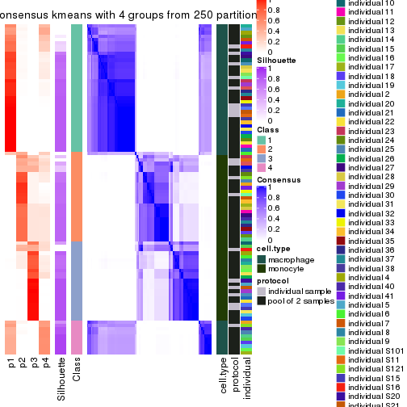</p>

</div>
<div id='tab-CV-kmeans-consensus-heatmap-4'>
<pre><code class="r">consensus_heatmap(res, k = 5)
</code></pre>

<p></p>

</div>
<div id='tab-CV-kmeans-consensus-heatmap-5'>
<pre><code class="r">consensus_heatmap(res, k = 6)
</code></pre>

<p></p>

</div>
</div>

Heatmaps for the membership of samples in all partitions to see how consistent they are:


<script>
$( function() {
	$( '#tabs-CV-kmeans-membership-heatmap' ).tabs();
} );
</script>
<div id='tabs-CV-kmeans-membership-heatmap'>
<ul>
<li><a href='#tab-CV-kmeans-membership-heatmap-1'>k = 2</a></li>
<li><a href='#tab-CV-kmeans-membership-heatmap-2'>k = 3</a></li>
<li><a href='#tab-CV-kmeans-membership-heatmap-3'>k = 4</a></li>
<li><a href='#tab-CV-kmeans-membership-heatmap-4'>k = 5</a></li>
<li><a href='#tab-CV-kmeans-membership-heatmap-5'>k = 6</a></li>
</ul>
<div id='tab-CV-kmeans-membership-heatmap-1'>
<pre><code class="r">membership_heatmap(res, k = 2)
</code></pre>

<p></p>

</div>
<div id='tab-CV-kmeans-membership-heatmap-2'>
<pre><code class="r">membership_heatmap(res, k = 3)
</code></pre>

<p></p>

</div>
<div id='tab-CV-kmeans-membership-heatmap-3'>
<pre><code class="r">membership_heatmap(res, k = 4)
</code></pre>

<p></p>

</div>
<div id='tab-CV-kmeans-membership-heatmap-4'>
<pre><code class="r">membership_heatmap(res, k = 5)
</code></pre>

<p></p>

</div>
<div id='tab-CV-kmeans-membership-heatmap-5'>
<pre><code class="r">membership_heatmap(res, k = 6)
</code></pre>

<p></p>

</div>
</div>

As soon as we have had the classes for columns, we can look for signatures
which are significantly different between classes which can be candidate marks
for certain classes. Following are the heatmaps for signatures.


Signature heatmaps where rows are scaled:


<script>
$( function() {
	$( '#tabs-CV-kmeans-get-signatures' ).tabs();
} );
</script>
<div id='tabs-CV-kmeans-get-signatures'>
<ul>
<li><a href='#tab-CV-kmeans-get-signatures-1'>k = 2</a></li>
<li><a href='#tab-CV-kmeans-get-signatures-2'>k = 3</a></li>
<li><a href='#tab-CV-kmeans-get-signatures-3'>k = 4</a></li>
<li><a href='#tab-CV-kmeans-get-signatures-4'>k = 5</a></li>
<li><a href='#tab-CV-kmeans-get-signatures-5'>k = 6</a></li>
</ul>
<div id='tab-CV-kmeans-get-signatures-1'>
<pre><code class="r">get_signatures(res, k = 2)
</code></pre>

<p></p>

</div>
<div id='tab-CV-kmeans-get-signatures-2'>
<pre><code class="r">get_signatures(res, k = 3)
</code></pre>

<p></p>

</div>
<div id='tab-CV-kmeans-get-signatures-3'>
<pre><code class="r">get_signatures(res, k = 4)
</code></pre>

<p></p>

</div>
<div id='tab-CV-kmeans-get-signatures-4'>
<pre><code class="r">get_signatures(res, k = 5)
</code></pre>

<p></p>

</div>
<div id='tab-CV-kmeans-get-signatures-5'>
<pre><code class="r">get_signatures(res, k = 6)
</code></pre>

<p></p>

</div>
</div>


Signature heatmaps where rows are not scaled:


<script>
$( function() {
	$( '#tabs-CV-kmeans-get-signatures-no-scale' ).tabs();
} );
</script>
<div id='tabs-CV-kmeans-get-signatures-no-scale'>
<ul>
<li><a href='#tab-CV-kmeans-get-signatures-no-scale-1'>k = 2</a></li>
<li><a href='#tab-CV-kmeans-get-signatures-no-scale-2'>k = 3</a></li>
<li><a href='#tab-CV-kmeans-get-signatures-no-scale-3'>k = 4</a></li>
<li><a href='#tab-CV-kmeans-get-signatures-no-scale-4'>k = 5</a></li>
<li><a href='#tab-CV-kmeans-get-signatures-no-scale-5'>k = 6</a></li>
</ul>
<div id='tab-CV-kmeans-get-signatures-no-scale-1'>
<pre><code class="r">get_signatures(res, k = 2, scale_rows = FALSE)
</code></pre>

<p></p>

</div>
<div id='tab-CV-kmeans-get-signatures-no-scale-2'>
<pre><code class="r">get_signatures(res, k = 3, scale_rows = FALSE)
</code></pre>

<p></p>

</div>
<div id='tab-CV-kmeans-get-signatures-no-scale-3'>
<pre><code class="r">get_signatures(res, k = 4, scale_rows = FALSE)
</code></pre>

<p></p>

</div>
<div id='tab-CV-kmeans-get-signatures-no-scale-4'>
<pre><code class="r">get_signatures(res, k = 5, scale_rows = FALSE)
</code></pre>

<p></p>

</div>
<div id='tab-CV-kmeans-get-signatures-no-scale-5'>
<pre><code class="r">get_signatures(res, k = 6, scale_rows = FALSE)
</code></pre>

<p></p>

</div>
</div>


Compare the overlap of signatures from different k:

```r
compare_signatures(res)
```


`get_signature()` returns a data frame invisibly. TO get the list of signatures, the function
call should be assigned to a variable explicitly. In following code, if `plot` argument is set
to `FALSE`, no heatmap is plotted while only the differential analysis is performed.

```r
# code only for demonstration
tb = get_signature(res, k = ..., plot = FALSE)
```

An example of the output of `tb` is:

```
#>   which_row         fdr    mean_1    mean_2 scaled_mean_1 scaled_mean_2 km
#> 1        38 0.042760348  8.373488  9.131774    -0.5533452     0.5164555  1
#> 2        40 0.018707592  7.106213  8.469186    -0.6173731     0.5762149  1
#> 3        55 0.019134737 10.221463 11.207825    -0.6159697     0.5749050  1
#> 4        59 0.006059896  5.921854  7.869574    -0.6899429     0.6439467  1
#> 5        60 0.018055526  8.928898 10.211722    -0.6204761     0.5791110  1
#> 6        98 0.009384629 15.714769 14.887706     0.6635654    -0.6193277  2
...
```

The columns in `tb` are:

1. `which_row`: row indices corresponding to the input matrix.
2. `fdr`: FDR for the differential test. 
3. `mean_x`: The mean value in group x.
4. `scaled_mean_x`: The mean value in group x after rows are scaled.
5. `km`: Row groups if k-means clustering is applied to rows.


UMAP plot which shows how samples are separated.


<script>
$( function() {
	$( '#tabs-CV-kmeans-dimension-reduction' ).tabs();
} );
</script>
<div id='tabs-CV-kmeans-dimension-reduction'>
<ul>
<li><a href='#tab-CV-kmeans-dimension-reduction-1'>k = 2</a></li>
<li><a href='#tab-CV-kmeans-dimension-reduction-2'>k = 3</a></li>
<li><a href='#tab-CV-kmeans-dimension-reduction-3'>k = 4</a></li>
<li><a href='#tab-CV-kmeans-dimension-reduction-4'>k = 5</a></li>
<li><a href='#tab-CV-kmeans-dimension-reduction-5'>k = 6</a></li>
</ul>
<div id='tab-CV-kmeans-dimension-reduction-1'>
<pre><code class="r">dimension_reduction(res, k = 2, method = &quot;UMAP&quot;)
</code></pre>

<p></p>

</div>
<div id='tab-CV-kmeans-dimension-reduction-2'>
<pre><code class="r">dimension_reduction(res, k = 3, method = &quot;UMAP&quot;)
</code></pre>

<p></p>

</div>
<div id='tab-CV-kmeans-dimension-reduction-3'>
<pre><code class="r">dimension_reduction(res, k = 4, method = &quot;UMAP&quot;)
</code></pre>

<p></p>

</div>
<div id='tab-CV-kmeans-dimension-reduction-4'>
<pre><code class="r">dimension_reduction(res, k = 5, method = &quot;UMAP&quot;)
</code></pre>

<p>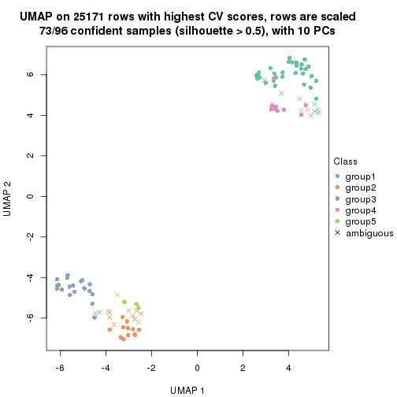</p>

</div>
<div id='tab-CV-kmeans-dimension-reduction-5'>
<pre><code class="r">dimension_reduction(res, k = 6, method = &quot;UMAP&quot;)
</code></pre>

<p></p>

</div>
</div>


Following heatmap shows how subgroups are split when increasing `k`:

```r
collect_classes(res)
```


Test correlation between subgroups and known annotations. If the known
annotation is numeric, one-way ANOVA test is applied, and if the known
annotation is discrete, chi-squared contingency table test is applied.

```r
test_to_known_factors(res)
```

```
#>            n cell.type(p) protocol(p) individual(p) k
#> CV:kmeans 96     8.49e-22       1.000         1.000 2
#> CV:kmeans 92     1.05e-20       0.751         1.000 3
#> CV:kmeans 80     3.07e-17       0.375         0.979 4
#> CV:kmeans 73     5.28e-15       0.593         0.981 5
#> CV:kmeans 64     1.81e-12       0.399         0.850 6
```


If matrix rows can be associated to genes, consider to use `functional_enrichment(res,
...)` to perform function enrichment for the signature genes. See [this vignette](http://bioconductor.org/packages/devel/bioc/vignettes/cola/inst/doc/functional_enrichment.html) for more detailed explanations.


 

---------------------------------------------------


### CV:skmeans**


The object with results only for a single top-value method and a single partition method 
can be extracted as:

```r
res = res_list["CV", "skmeans"]
# you can also extract it by
# res = res_list["CV:skmeans"]
```

A summary of `res` and all the functions that can be applied to it:

```r
res
```

```
#> A 'ConsensusPartition' object with k = 2, 3, 4, 5, 6.
#>   On a matrix with 25171 rows and 96 columns.
#>   Top rows (1000, 2000, 3000, 4000, 5000) are extracted by 'CV' method.
#>   Subgroups are detected by 'skmeans' method.
#>   Performed in total 1250 partitions by row resampling.
#>   Best k for subgroups seems to be 3.
#> 
#> Following methods can be applied to this 'ConsensusPartition' object:
#>  [1] "cola_report"             "collect_classes"         "collect_plots"          
#>  [4] "collect_stats"           "colnames"                "compare_signatures"     
#>  [7] "consensus_heatmap"       "dimension_reduction"     "functional_enrichment"  
#> [10] "get_anno_col"            "get_anno"                "get_classes"            
#> [13] "get_consensus"           "get_matrix"              "get_membership"         
#> [16] "get_param"               "get_signatures"          "get_stats"              
#> [19] "is_best_k"               "is_stable_k"             "membership_heatmap"     
#> [22] "ncol"                    "nrow"                    "plot_ecdf"              
#> [25] "rownames"                "select_partition_number" "show"                   
#> [28] "suggest_best_k"          "test_to_known_factors"
```

`collect_plots()` function collects all the plots made from `res` for all `k` (number of partitions)
into one single page to provide an easy and fast comparison between different `k`.

```r
collect_plots(res)
```


The plots are:

- The first row: a plot of the ECDF (empirical cumulative distribution
  function) curves of the consensus matrix for each `k` and the heatmap of
  predicted classes for each `k`.
- The second row: heatmaps of the consensus matrix for each `k`.
- The third row: heatmaps of the membership matrix for each `k`.
- The fouth row: heatmaps of the signatures for each `k`.

All the plots in panels can be made by individual functions and they are
plotted later in this section.

`select_partition_number()` produces several plots showing different
statistics for choosing "optimized" `k`. There are following statistics:

- ECDF curves of the consensus matrix for each `k`;
- 1-PAC. [The PAC
  score](https://en.wikipedia.org/wiki/Consensus_clustering#Over-interpretation_potential_of_consensus_clustering)
  measures the proportion of the ambiguous subgrouping.
- Mean silhouette score.
- Concordance. The mean probability of fiting the consensus class ids in all
  partitions.
- Area increased. Denote $A_k$ as the area under the ECDF curve for current
  `k`, the area increased is defined as $A_k - A_{k-1}$.
- Rand index. The percent of pairs of samples that are both in a same cluster
  or both are not in a same cluster in the partition of k and k-1.
- Jaccard index. The ratio of pairs of samples are both in a same cluster in
  the partition of k and k-1 and the pairs of samples are both in a same
  cluster in the partition k or k-1.

The detailed explanations of these statistics can be found in [the _cola_
vignette](http://bioconductor.org/packages/devel/bioc/vignettes/cola/inst/doc/cola.html#toc_13).

Generally speaking, lower PAC score, higher mean silhouette score or higher
concordance corresponds to better partition. Rand index and Jaccard index
measure how similar the current partition is compared to partition with `k-1`.
If they are too similar, we won't accept `k` is better than `k-1`.

```r
select_partition_number(res)
```


The numeric values for all these statistics can be obtained by `get_stats()`.

```r
get_stats(res)
```

```
#>   k 1-PAC mean_silhouette concordance area_increased  Rand Jaccard
#> 2 2 1.000           0.996       0.998         0.5057 0.495   0.495
#> 3 3 0.951           0.910       0.945         0.2500 0.859   0.717
#> 4 4 0.872           0.855       0.931         0.1751 0.876   0.663
#> 5 5 0.787           0.685       0.844         0.0479 0.950   0.815
#> 6 6 0.782           0.656       0.801         0.0458 0.934   0.737
```

`suggest_best_k()` suggests the best $k$ based on these statistics. The rules are as follows:

- All $k$ with Jaccard index larger than 0.95 are removed because increasing
  $k$ does not provide enough extra information. If all $k$ are removed, it is
  marked as no subgroup is detected.
- For all $k$ with 1-PAC score larger than 0.9, the maximal $k$ is taken as
  the best $k$, and other $k$ are marked as optional $k$.
- If it does not fit the second rule. The $k$ with the maximal vote of the
  highest 1-PAC score, highest mean silhouette, and highest concordance is
  taken as the best $k$.

```r
suggest_best_k(res)
```

```
#> [1] 3
#> attr(,"optional")
#> [1] 2
```

There is also optional best $k$ = 2 that is worth to check.

Following shows the table of the partitions (You need to click the **show/hide
code output** link to see it). The membership matrix (columns with name `p*`)
is inferred by
[`clue::cl_consensus()`](https://www.rdocumentation.org/link/cl_consensus?package=clue)
function with the `SE` method. Basically the value in the membership matrix
represents the probability to belong to a certain group. The finall class
label for an item is determined with the group with highest probability it
belongs to.

In `get_classes()` function, the entropy is calculated from the membership
matrix and the silhouette score is calculated from the consensus matrix.


<script>
$( function() {
	$( '#tabs-CV-skmeans-get-classes' ).tabs();
} );
</script>
<div id='tabs-CV-skmeans-get-classes'>
<ul>
<li><a href='#tab-CV-skmeans-get-classes-1'>k = 2</a></li>
<li><a href='#tab-CV-skmeans-get-classes-2'>k = 3</a></li>
<li><a href='#tab-CV-skmeans-get-classes-3'>k = 4</a></li>
<li><a href='#tab-CV-skmeans-get-classes-4'>k = 5</a></li>
<li><a href='#tab-CV-skmeans-get-classes-5'>k = 6</a></li>
</ul>

<div id='tab-CV-skmeans-get-classes-1'>
<p><a id='tab-CV-skmeans-get-classes-1-a' style='color:#0366d6' href='#'>show/hide code output</a></p>
<pre><code class="r">cbind(get_classes(res, k = 2), get_membership(res, k = 2))
</code></pre>

<pre><code>#&gt;           class entropy silhouette   p1   p2
#&gt; GSM257886     1   0.000      0.997 1.00 0.00
#&gt; GSM257888     1   0.000      0.997 1.00 0.00
#&gt; GSM257890     1   0.000      0.997 1.00 0.00
#&gt; GSM257892     1   0.634      0.810 0.84 0.16
#&gt; GSM257894     1   0.000      0.997 1.00 0.00
#&gt; GSM257896     1   0.000      0.997 1.00 0.00
#&gt; GSM257898     1   0.000      0.997 1.00 0.00
#&gt; GSM257900     1   0.000      0.997 1.00 0.00
#&gt; GSM257902     1   0.000      0.997 1.00 0.00
#&gt; GSM257904     1   0.000      0.997 1.00 0.00
#&gt; GSM257906     1   0.000      0.997 1.00 0.00
#&gt; GSM257908     1   0.000      0.997 1.00 0.00
#&gt; GSM257910     1   0.000      0.997 1.00 0.00
#&gt; GSM257912     1   0.000      0.997 1.00 0.00
#&gt; GSM257914     1   0.000      0.997 1.00 0.00
#&gt; GSM257917     1   0.000      0.997 1.00 0.00
#&gt; GSM257919     1   0.000      0.997 1.00 0.00
#&gt; GSM257921     1   0.000      0.997 1.00 0.00
#&gt; GSM257923     1   0.000      0.997 1.00 0.00
#&gt; GSM257925     1   0.000      0.997 1.00 0.00
#&gt; GSM257927     1   0.000      0.997 1.00 0.00
#&gt; GSM257929     1   0.000      0.997 1.00 0.00
#&gt; GSM257937     1   0.000      0.997 1.00 0.00
#&gt; GSM257939     1   0.000      0.997 1.00 0.00
#&gt; GSM257941     1   0.000      0.997 1.00 0.00
#&gt; GSM257943     1   0.000      0.997 1.00 0.00
#&gt; GSM257945     1   0.000      0.997 1.00 0.00
#&gt; GSM257947     1   0.000      0.997 1.00 0.00
#&gt; GSM257949     1   0.000      0.997 1.00 0.00
#&gt; GSM257951     1   0.000      0.997 1.00 0.00
#&gt; GSM257953     1   0.000      0.997 1.00 0.00
#&gt; GSM257955     1   0.000      0.997 1.00 0.00
#&gt; GSM257958     1   0.000      0.997 1.00 0.00
#&gt; GSM257960     1   0.000      0.997 1.00 0.00
#&gt; GSM257962     1   0.000      0.997 1.00 0.00
#&gt; GSM257964     1   0.000      0.997 1.00 0.00
#&gt; GSM257966     1   0.000      0.997 1.00 0.00
#&gt; GSM257968     1   0.000      0.997 1.00 0.00
#&gt; GSM257970     1   0.000      0.997 1.00 0.00
#&gt; GSM257972     1   0.000      0.997 1.00 0.00
#&gt; GSM257977     1   0.000      0.997 1.00 0.00
#&gt; GSM257982     1   0.000      0.997 1.00 0.00
#&gt; GSM257984     1   0.000      0.997 1.00 0.00
#&gt; GSM257986     1   0.000      0.997 1.00 0.00
#&gt; GSM257990     1   0.000      0.997 1.00 0.00
#&gt; GSM257992     1   0.000      0.997 1.00 0.00
#&gt; GSM257996     1   0.000      0.997 1.00 0.00
#&gt; GSM258006     1   0.000      0.997 1.00 0.00
#&gt; GSM257887     2   0.000      1.000 0.00 1.00
#&gt; GSM257889     2   0.000      1.000 0.00 1.00
#&gt; GSM257891     2   0.000      1.000 0.00 1.00
#&gt; GSM257893     2   0.000      1.000 0.00 1.00
#&gt; GSM257895     2   0.000      1.000 0.00 1.00
#&gt; GSM257897     2   0.000      1.000 0.00 1.00
#&gt; GSM257899     2   0.000      1.000 0.00 1.00
#&gt; GSM257901     2   0.000      1.000 0.00 1.00
#&gt; GSM257903     2   0.000      1.000 0.00 1.00
#&gt; GSM257905     2   0.000      1.000 0.00 1.00
#&gt; GSM257907     2   0.000      1.000 0.00 1.00
#&gt; GSM257909     2   0.000      1.000 0.00 1.00
#&gt; GSM257911     2   0.000      1.000 0.00 1.00
#&gt; GSM257913     2   0.000      1.000 0.00 1.00
#&gt; GSM257916     2   0.000      1.000 0.00 1.00
#&gt; GSM257918     2   0.000      1.000 0.00 1.00
#&gt; GSM257920     2   0.000      1.000 0.00 1.00
#&gt; GSM257922     2   0.000      1.000 0.00 1.00
#&gt; GSM257924     2   0.000      1.000 0.00 1.00
#&gt; GSM257926     2   0.000      1.000 0.00 1.00
#&gt; GSM257928     2   0.000      1.000 0.00 1.00
#&gt; GSM257930     2   0.000      1.000 0.00 1.00
#&gt; GSM257938     2   0.000      1.000 0.00 1.00
#&gt; GSM257940     2   0.000      1.000 0.00 1.00
#&gt; GSM257942     2   0.000      1.000 0.00 1.00
#&gt; GSM257944     2   0.000      1.000 0.00 1.00
#&gt; GSM257946     2   0.000      1.000 0.00 1.00
#&gt; GSM257948     2   0.000      1.000 0.00 1.00
#&gt; GSM257950     2   0.000      1.000 0.00 1.00
#&gt; GSM257952     2   0.000      1.000 0.00 1.00
#&gt; GSM257954     2   0.000      1.000 0.00 1.00
#&gt; GSM257956     2   0.000      1.000 0.00 1.00
#&gt; GSM257959     2   0.000      1.000 0.00 1.00
#&gt; GSM257961     2   0.000      1.000 0.00 1.00
#&gt; GSM257963     2   0.000      1.000 0.00 1.00
#&gt; GSM257965     2   0.000      1.000 0.00 1.00
#&gt; GSM257967     2   0.000      1.000 0.00 1.00
#&gt; GSM257969     2   0.000      1.000 0.00 1.00
#&gt; GSM257971     2   0.000      1.000 0.00 1.00
#&gt; GSM257973     2   0.000      1.000 0.00 1.00
#&gt; GSM257981     2   0.000      1.000 0.00 1.00
#&gt; GSM257983     2   0.000      1.000 0.00 1.00
#&gt; GSM257985     2   0.000      1.000 0.00 1.00
#&gt; GSM257988     2   0.000      1.000 0.00 1.00
#&gt; GSM257991     2   0.000      1.000 0.00 1.00
#&gt; GSM257993     2   0.000      1.000 0.00 1.00
#&gt; GSM257994     2   0.000      1.000 0.00 1.00
#&gt; GSM257989     2   0.000      1.000 0.00 1.00
</code></pre>

<script>
$('#tab-CV-skmeans-get-classes-1-a').parent().next().next().hide();
$('#tab-CV-skmeans-get-classes-1-a').click(function(){
  $('#tab-CV-skmeans-get-classes-1-a').parent().next().next().toggle();
  return(false);
});
</script>
</div>

<div id='tab-CV-skmeans-get-classes-2'>
<p><a id='tab-CV-skmeans-get-classes-2-a' style='color:#0366d6' href='#'>show/hide code output</a></p>
<pre><code class="r">cbind(get_classes(res, k = 3), get_membership(res, k = 3))
</code></pre>

<pre><code>#&gt;           class entropy silhouette    p1    p2    p3
#&gt; GSM257886     1  0.2066      0.964 0.940 0.060 0.000
#&gt; GSM257888     1  0.2066      0.964 0.940 0.060 0.000
#&gt; GSM257890     1  0.2066      0.964 0.940 0.060 0.000
#&gt; GSM257892     2  0.5859      0.393 0.344 0.656 0.000
#&gt; GSM257894     1  0.1529      0.971 0.960 0.040 0.000
#&gt; GSM257896     1  0.0237      0.983 0.996 0.004 0.000
#&gt; GSM257898     1  0.0000      0.984 1.000 0.000 0.000
#&gt; GSM257900     1  0.0000      0.984 1.000 0.000 0.000
#&gt; GSM257902     1  0.0000      0.984 1.000 0.000 0.000
#&gt; GSM257904     1  0.1964      0.965 0.944 0.056 0.000
#&gt; GSM257906     1  0.0000      0.984 1.000 0.000 0.000
#&gt; GSM257908     1  0.2066      0.964 0.940 0.060 0.000
#&gt; GSM257910     1  0.2066      0.964 0.940 0.060 0.000
#&gt; GSM257912     1  0.2066      0.964 0.940 0.060 0.000
#&gt; GSM257914     1  0.2066      0.964 0.940 0.060 0.000
#&gt; GSM257917     1  0.2066      0.964 0.940 0.060 0.000
#&gt; GSM257919     1  0.2066      0.964 0.940 0.060 0.000
#&gt; GSM257921     1  0.2066      0.964 0.940 0.060 0.000
#&gt; GSM257923     1  0.0000      0.984 1.000 0.000 0.000
#&gt; GSM257925     1  0.0000      0.984 1.000 0.000 0.000
#&gt; GSM257927     1  0.0000      0.984 1.000 0.000 0.000
#&gt; GSM257929     1  0.0000      0.984 1.000 0.000 0.000
#&gt; GSM257937     1  0.2066      0.964 0.940 0.060 0.000
#&gt; GSM257939     1  0.0000      0.984 1.000 0.000 0.000
#&gt; GSM257941     1  0.0000      0.984 1.000 0.000 0.000
#&gt; GSM257943     1  0.0000      0.984 1.000 0.000 0.000
#&gt; GSM257945     1  0.0000      0.984 1.000 0.000 0.000
#&gt; GSM257947     1  0.0000      0.984 1.000 0.000 0.000
#&gt; GSM257949     1  0.0000      0.984 1.000 0.000 0.000
#&gt; GSM257951     1  0.0000      0.984 1.000 0.000 0.000
#&gt; GSM257953     1  0.0000      0.984 1.000 0.000 0.000
#&gt; GSM257955     1  0.0000      0.984 1.000 0.000 0.000
#&gt; GSM257958     1  0.0000      0.984 1.000 0.000 0.000
#&gt; GSM257960     1  0.0000      0.984 1.000 0.000 0.000
#&gt; GSM257962     1  0.0000      0.984 1.000 0.000 0.000
#&gt; GSM257964     1  0.0000      0.984 1.000 0.000 0.000
#&gt; GSM257966     1  0.2066      0.964 0.940 0.060 0.000
#&gt; GSM257968     1  0.0237      0.983 0.996 0.004 0.000
#&gt; GSM257970     1  0.0000      0.984 1.000 0.000 0.000
#&gt; GSM257972     1  0.0000      0.984 1.000 0.000 0.000
#&gt; GSM257977     1  0.0237      0.983 0.996 0.004 0.000
#&gt; GSM257982     1  0.0000      0.984 1.000 0.000 0.000
#&gt; GSM257984     1  0.0000      0.984 1.000 0.000 0.000
#&gt; GSM257986     1  0.0000      0.984 1.000 0.000 0.000
#&gt; GSM257990     1  0.0000      0.984 1.000 0.000 0.000
#&gt; GSM257992     1  0.0000      0.984 1.000 0.000 0.000
#&gt; GSM257996     1  0.2066      0.964 0.940 0.060 0.000
#&gt; GSM258006     1  0.0000      0.984 1.000 0.000 0.000
#&gt; GSM257887     2  0.2066      0.893 0.000 0.940 0.060
#&gt; GSM257889     3  0.0000      0.963 0.000 0.000 1.000
#&gt; GSM257891     3  0.0000      0.963 0.000 0.000 1.000
#&gt; GSM257893     3  0.0000      0.963 0.000 0.000 1.000
#&gt; GSM257895     2  0.2066      0.893 0.000 0.940 0.060
#&gt; GSM257897     3  0.0237      0.958 0.004 0.000 0.996
#&gt; GSM257899     3  0.0237      0.958 0.004 0.000 0.996
#&gt; GSM257901     3  0.4887      0.626 0.000 0.228 0.772
#&gt; GSM257903     2  0.2066      0.893 0.000 0.940 0.060
#&gt; GSM257905     2  0.2066      0.893 0.000 0.940 0.060
#&gt; GSM257907     3  0.0000      0.963 0.000 0.000 1.000
#&gt; GSM257909     2  0.2066      0.893 0.000 0.940 0.060
#&gt; GSM257911     2  0.6140      0.473 0.000 0.596 0.404
#&gt; GSM257913     3  0.0000      0.963 0.000 0.000 1.000
#&gt; GSM257916     2  0.2066      0.893 0.000 0.940 0.060
#&gt; GSM257918     2  0.2066      0.893 0.000 0.940 0.060
#&gt; GSM257920     3  0.0000      0.963 0.000 0.000 1.000
#&gt; GSM257922     3  0.0000      0.963 0.000 0.000 1.000
#&gt; GSM257924     3  0.0000      0.963 0.000 0.000 1.000
#&gt; GSM257926     3  0.0000      0.963 0.000 0.000 1.000
#&gt; GSM257928     2  0.5926      0.503 0.000 0.644 0.356
#&gt; GSM257930     2  0.2066      0.893 0.000 0.940 0.060
#&gt; GSM257938     2  0.2066      0.893 0.000 0.940 0.060
#&gt; GSM257940     3  0.0237      0.959 0.000 0.004 0.996
#&gt; GSM257942     2  0.2066      0.893 0.000 0.940 0.060
#&gt; GSM257944     2  0.2066      0.893 0.000 0.940 0.060
#&gt; GSM257946     3  0.0000      0.963 0.000 0.000 1.000
#&gt; GSM257948     3  0.0000      0.963 0.000 0.000 1.000
#&gt; GSM257950     3  0.0000      0.963 0.000 0.000 1.000
#&gt; GSM257952     2  0.6045      0.526 0.000 0.620 0.380
#&gt; GSM257954     2  0.2066      0.893 0.000 0.940 0.060
#&gt; GSM257956     2  0.2066      0.893 0.000 0.940 0.060
#&gt; GSM257959     2  0.2066      0.893 0.000 0.940 0.060
#&gt; GSM257961     2  0.2066      0.893 0.000 0.940 0.060
#&gt; GSM257963     2  0.2066      0.893 0.000 0.940 0.060
#&gt; GSM257965     2  0.6045      0.526 0.000 0.620 0.380
#&gt; GSM257967     2  0.2066      0.893 0.000 0.940 0.060
#&gt; GSM257969     2  0.2066      0.893 0.000 0.940 0.060
#&gt; GSM257971     3  0.6111      0.161 0.000 0.396 0.604
#&gt; GSM257973     3  0.0000      0.963 0.000 0.000 1.000
#&gt; GSM257981     2  0.6026      0.533 0.000 0.624 0.376
#&gt; GSM257983     3  0.0000      0.963 0.000 0.000 1.000
#&gt; GSM257985     3  0.0000      0.963 0.000 0.000 1.000
#&gt; GSM257988     3  0.0000      0.963 0.000 0.000 1.000
#&gt; GSM257991     2  0.5968      0.554 0.000 0.636 0.364
#&gt; GSM257993     2  0.2066      0.893 0.000 0.940 0.060
#&gt; GSM257994     2  0.2066      0.893 0.000 0.940 0.060
#&gt; GSM257989     3  0.0000      0.963 0.000 0.000 1.000
</code></pre>

<script>
$('#tab-CV-skmeans-get-classes-2-a').parent().next().next().hide();
$('#tab-CV-skmeans-get-classes-2-a').click(function(){
  $('#tab-CV-skmeans-get-classes-2-a').parent().next().next().toggle();
  return(false);
});
</script>
</div>

<div id='tab-CV-skmeans-get-classes-3'>
<p><a id='tab-CV-skmeans-get-classes-3-a' style='color:#0366d6' href='#'>show/hide code output</a></p>
<pre><code class="r">cbind(get_classes(res, k = 4), get_membership(res, k = 4))
</code></pre>

<pre><code>#&gt;           class entropy silhouette    p1    p2    p3    p4
#&gt; GSM257886     4  0.0592      0.830 0.016 0.000 0.000 0.984
#&gt; GSM257888     4  0.0336      0.832 0.008 0.000 0.000 0.992
#&gt; GSM257890     4  0.0469      0.832 0.012 0.000 0.000 0.988
#&gt; GSM257892     4  0.5279      0.189 0.012 0.400 0.000 0.588
#&gt; GSM257894     4  0.3649      0.716 0.204 0.000 0.000 0.796
#&gt; GSM257896     4  0.4877      0.414 0.408 0.000 0.000 0.592
#&gt; GSM257898     1  0.0188      0.988 0.996 0.000 0.000 0.004
#&gt; GSM257900     1  0.0000      0.991 1.000 0.000 0.000 0.000
#&gt; GSM257902     1  0.0188      0.992 0.996 0.000 0.000 0.004
#&gt; GSM257904     4  0.4961      0.304 0.448 0.000 0.000 0.552
#&gt; GSM257906     1  0.0000      0.991 1.000 0.000 0.000 0.000
#&gt; GSM257908     4  0.0336      0.832 0.008 0.000 0.000 0.992
#&gt; GSM257910     4  0.0336      0.832 0.008 0.000 0.000 0.992
#&gt; GSM257912     4  0.0336      0.832 0.008 0.000 0.000 0.992
#&gt; GSM257914     4  0.0336      0.832 0.008 0.000 0.000 0.992
#&gt; GSM257917     4  0.0336      0.832 0.008 0.000 0.000 0.992
#&gt; GSM257919     4  0.0336      0.832 0.008 0.000 0.000 0.992
#&gt; GSM257921     4  0.3074      0.762 0.152 0.000 0.000 0.848
#&gt; GSM257923     1  0.0188      0.992 0.996 0.000 0.000 0.004
#&gt; GSM257925     1  0.0188      0.992 0.996 0.000 0.000 0.004
#&gt; GSM257927     1  0.0000      0.991 1.000 0.000 0.000 0.000
#&gt; GSM257929     1  0.0188      0.992 0.996 0.000 0.000 0.004
#&gt; GSM257937     4  0.0336      0.832 0.008 0.000 0.000 0.992
#&gt; GSM257939     1  0.0188      0.992 0.996 0.000 0.000 0.004
#&gt; GSM257941     1  0.0000      0.991 1.000 0.000 0.000 0.000
#&gt; GSM257943     1  0.0000      0.991 1.000 0.000 0.000 0.000
#&gt; GSM257945     1  0.0000      0.991 1.000 0.000 0.000 0.000
#&gt; GSM257947     1  0.0188      0.992 0.996 0.000 0.000 0.004
#&gt; GSM257949     1  0.0188      0.992 0.996 0.000 0.000 0.004
#&gt; GSM257951     1  0.0188      0.992 0.996 0.000 0.000 0.004
#&gt; GSM257953     1  0.0188      0.992 0.996 0.000 0.000 0.004
#&gt; GSM257955     1  0.0188      0.992 0.996 0.000 0.000 0.004
#&gt; GSM257958     1  0.0188      0.992 0.996 0.000 0.000 0.004
#&gt; GSM257960     1  0.0000      0.991 1.000 0.000 0.000 0.000
#&gt; GSM257962     1  0.0000      0.991 1.000 0.000 0.000 0.000
#&gt; GSM257964     1  0.0188      0.992 0.996 0.000 0.000 0.004
#&gt; GSM257966     4  0.0336      0.832 0.008 0.000 0.000 0.992
#&gt; GSM257968     4  0.4866      0.424 0.404 0.000 0.000 0.596
#&gt; GSM257970     1  0.0188      0.992 0.996 0.000 0.000 0.004
#&gt; GSM257972     1  0.0188      0.992 0.996 0.000 0.000 0.004
#&gt; GSM257977     4  0.4866      0.424 0.404 0.000 0.000 0.596
#&gt; GSM257982     1  0.2647      0.840 0.880 0.000 0.000 0.120
#&gt; GSM257984     1  0.0188      0.992 0.996 0.000 0.000 0.004
#&gt; GSM257986     1  0.0336      0.989 0.992 0.000 0.000 0.008
#&gt; GSM257990     1  0.0000      0.991 1.000 0.000 0.000 0.000
#&gt; GSM257992     1  0.0188      0.988 0.996 0.000 0.000 0.004
#&gt; GSM257996     4  0.4193      0.647 0.268 0.000 0.000 0.732
#&gt; GSM258006     1  0.0188      0.988 0.996 0.000 0.000 0.004
#&gt; GSM257887     2  0.0000      0.883 0.000 1.000 0.000 0.000
#&gt; GSM257889     3  0.1211      0.922 0.000 0.040 0.960 0.000
#&gt; GSM257891     3  0.0000      0.945 0.000 0.000 1.000 0.000
#&gt; GSM257893     3  0.1398      0.921 0.000 0.040 0.956 0.004
#&gt; GSM257895     2  0.0376      0.881 0.000 0.992 0.004 0.004
#&gt; GSM257897     3  0.1398      0.921 0.000 0.040 0.956 0.004
#&gt; GSM257899     3  0.1398      0.921 0.000 0.040 0.956 0.004
#&gt; GSM257901     3  0.4040      0.603 0.000 0.248 0.752 0.000
#&gt; GSM257903     2  0.1211      0.892 0.000 0.960 0.040 0.000
#&gt; GSM257905     2  0.1211      0.892 0.000 0.960 0.040 0.000
#&gt; GSM257907     3  0.0336      0.947 0.000 0.008 0.992 0.000
#&gt; GSM257909     2  0.1211      0.892 0.000 0.960 0.040 0.000
#&gt; GSM257911     2  0.4830      0.465 0.000 0.608 0.392 0.000
#&gt; GSM257913     3  0.0336      0.947 0.000 0.008 0.992 0.000
#&gt; GSM257916     2  0.1211      0.892 0.000 0.960 0.040 0.000
#&gt; GSM257918     2  0.1211      0.892 0.000 0.960 0.040 0.000
#&gt; GSM257920     3  0.0336      0.947 0.000 0.008 0.992 0.000
#&gt; GSM257922     3  0.1398      0.921 0.000 0.040 0.956 0.004
#&gt; GSM257924     3  0.0336      0.947 0.000 0.008 0.992 0.000
#&gt; GSM257926     3  0.0336      0.947 0.000 0.008 0.992 0.000
#&gt; GSM257928     2  0.4594      0.558 0.000 0.712 0.280 0.008
#&gt; GSM257930     2  0.0672      0.878 0.000 0.984 0.008 0.008
#&gt; GSM257938     2  0.0672      0.878 0.000 0.984 0.008 0.008
#&gt; GSM257940     3  0.0469      0.944 0.000 0.012 0.988 0.000
#&gt; GSM257942     2  0.1211      0.892 0.000 0.960 0.040 0.000
#&gt; GSM257944     2  0.1211      0.892 0.000 0.960 0.040 0.000
#&gt; GSM257946     3  0.0188      0.946 0.000 0.004 0.996 0.000
#&gt; GSM257948     3  0.0336      0.947 0.000 0.008 0.992 0.000
#&gt; GSM257950     3  0.0336      0.947 0.000 0.008 0.992 0.000
#&gt; GSM257952     2  0.4713      0.534 0.000 0.640 0.360 0.000
#&gt; GSM257954     2  0.0188      0.883 0.000 0.996 0.000 0.004
#&gt; GSM257956     2  0.0376      0.881 0.000 0.992 0.004 0.004
#&gt; GSM257959     2  0.1211      0.892 0.000 0.960 0.040 0.000
#&gt; GSM257961     2  0.1211      0.892 0.000 0.960 0.040 0.000
#&gt; GSM257963     2  0.1211      0.892 0.000 0.960 0.040 0.000
#&gt; GSM257965     2  0.4713      0.534 0.000 0.640 0.360 0.000
#&gt; GSM257967     2  0.1211      0.892 0.000 0.960 0.040 0.000
#&gt; GSM257969     2  0.0000      0.883 0.000 1.000 0.000 0.000
#&gt; GSM257971     3  0.5257      0.117 0.000 0.444 0.548 0.008
#&gt; GSM257973     3  0.0336      0.947 0.000 0.008 0.992 0.000
#&gt; GSM257981     2  0.4697      0.541 0.000 0.644 0.356 0.000
#&gt; GSM257983     3  0.0188      0.946 0.000 0.004 0.996 0.000
#&gt; GSM257985     3  0.0000      0.945 0.000 0.000 1.000 0.000
#&gt; GSM257988     3  0.0336      0.947 0.000 0.008 0.992 0.000
#&gt; GSM257991     2  0.4643      0.562 0.000 0.656 0.344 0.000
#&gt; GSM257993     2  0.0376      0.881 0.000 0.992 0.004 0.004
#&gt; GSM257994     2  0.0672      0.878 0.000 0.984 0.008 0.008
#&gt; GSM257989     3  0.0188      0.946 0.000 0.004 0.996 0.000
</code></pre>

<script>
$('#tab-CV-skmeans-get-classes-3-a').parent().next().next().hide();
$('#tab-CV-skmeans-get-classes-3-a').click(function(){
  $('#tab-CV-skmeans-get-classes-3-a').parent().next().next().toggle();
  return(false);
});
</script>
</div>

<div id='tab-CV-skmeans-get-classes-4'>
<p><a id='tab-CV-skmeans-get-classes-4-a' style='color:#0366d6' href='#'>show/hide code output</a></p>
<pre><code class="r">cbind(get_classes(res, k = 5), get_membership(res, k = 5))
</code></pre>

<pre><code>#&gt;           class entropy silhouette    p1    p2    p3    p4    p5
#&gt; GSM257886     5  0.4300   -0.38286 0.000 0.000 0.000 0.476 0.524
#&gt; GSM257888     4  0.4774    0.40622 0.028 0.000 0.000 0.612 0.360
#&gt; GSM257890     4  0.4510    0.33556 0.008 0.000 0.000 0.560 0.432
#&gt; GSM257892     5  0.6194   -0.10461 0.028 0.088 0.000 0.312 0.572
#&gt; GSM257894     5  0.6805   -0.13944 0.296 0.000 0.000 0.344 0.360
#&gt; GSM257896     1  0.6453   -0.04489 0.432 0.000 0.000 0.180 0.388
#&gt; GSM257898     1  0.2929    0.80727 0.820 0.000 0.000 0.000 0.180
#&gt; GSM257900     1  0.2929    0.80727 0.820 0.000 0.000 0.000 0.180
#&gt; GSM257902     1  0.0000    0.86711 1.000 0.000 0.000 0.000 0.000
#&gt; GSM257904     4  0.5917    0.29264 0.224 0.000 0.000 0.596 0.180
#&gt; GSM257906     1  0.3086    0.80410 0.816 0.000 0.000 0.004 0.180
#&gt; GSM257908     4  0.0000    0.79787 0.000 0.000 0.000 1.000 0.000
#&gt; GSM257910     4  0.0000    0.79787 0.000 0.000 0.000 1.000 0.000
#&gt; GSM257912     4  0.0000    0.79787 0.000 0.000 0.000 1.000 0.000
#&gt; GSM257914     4  0.0000    0.79787 0.000 0.000 0.000 1.000 0.000
#&gt; GSM257917     4  0.0000    0.79787 0.000 0.000 0.000 1.000 0.000
#&gt; GSM257919     4  0.0000    0.79787 0.000 0.000 0.000 1.000 0.000
#&gt; GSM257921     4  0.1331    0.76412 0.040 0.000 0.000 0.952 0.008
#&gt; GSM257923     1  0.0000    0.86711 1.000 0.000 0.000 0.000 0.000
#&gt; GSM257925     1  0.0000    0.86711 1.000 0.000 0.000 0.000 0.000
#&gt; GSM257927     1  0.1908    0.84762 0.908 0.000 0.000 0.000 0.092
#&gt; GSM257929     1  0.0000    0.86711 1.000 0.000 0.000 0.000 0.000
#&gt; GSM257937     4  0.2891    0.68710 0.000 0.000 0.000 0.824 0.176
#&gt; GSM257939     1  0.0000    0.86711 1.000 0.000 0.000 0.000 0.000
#&gt; GSM257941     1  0.2561    0.82520 0.856 0.000 0.000 0.000 0.144
#&gt; GSM257943     1  0.2929    0.80727 0.820 0.000 0.000 0.000 0.180
#&gt; GSM257945     1  0.2020    0.84553 0.900 0.000 0.000 0.000 0.100
#&gt; GSM257947     1  0.0000    0.86711 1.000 0.000 0.000 0.000 0.000
#&gt; GSM257949     1  0.0000    0.86711 1.000 0.000 0.000 0.000 0.000
#&gt; GSM257951     1  0.0000    0.86711 1.000 0.000 0.000 0.000 0.000
#&gt; GSM257953     1  0.0000    0.86711 1.000 0.000 0.000 0.000 0.000
#&gt; GSM257955     1  0.0000    0.86711 1.000 0.000 0.000 0.000 0.000
#&gt; GSM257958     1  0.0000    0.86711 1.000 0.000 0.000 0.000 0.000
#&gt; GSM257960     1  0.2127    0.84250 0.892 0.000 0.000 0.000 0.108
#&gt; GSM257962     1  0.1965    0.84663 0.904 0.000 0.000 0.000 0.096
#&gt; GSM257964     1  0.0000    0.86711 1.000 0.000 0.000 0.000 0.000
#&gt; GSM257966     4  0.2929    0.68357 0.000 0.000 0.000 0.820 0.180
#&gt; GSM257968     1  0.6445   -0.00894 0.456 0.000 0.000 0.184 0.360
#&gt; GSM257970     1  0.0000    0.86711 1.000 0.000 0.000 0.000 0.000
#&gt; GSM257972     1  0.0000    0.86711 1.000 0.000 0.000 0.000 0.000
#&gt; GSM257977     1  0.6453   -0.04489 0.432 0.000 0.000 0.180 0.388
#&gt; GSM257982     1  0.4774    0.36452 0.612 0.000 0.000 0.028 0.360
#&gt; GSM257984     1  0.0000    0.86711 1.000 0.000 0.000 0.000 0.000
#&gt; GSM257986     1  0.0162    0.86484 0.996 0.000 0.000 0.004 0.000
#&gt; GSM257990     1  0.2020    0.84553 0.900 0.000 0.000 0.000 0.100
#&gt; GSM257992     1  0.2929    0.80727 0.820 0.000 0.000 0.000 0.180
#&gt; GSM257996     4  0.2036    0.72430 0.056 0.000 0.000 0.920 0.024
#&gt; GSM258006     1  0.2929    0.80727 0.820 0.000 0.000 0.000 0.180
#&gt; GSM257887     2  0.2516    0.75074 0.000 0.860 0.000 0.000 0.140
#&gt; GSM257889     3  0.1965    0.82537 0.000 0.000 0.904 0.000 0.096
#&gt; GSM257891     3  0.0000    0.88394 0.000 0.000 1.000 0.000 0.000
#&gt; GSM257893     3  0.3730    0.66076 0.000 0.000 0.712 0.000 0.288
#&gt; GSM257895     2  0.2852    0.73696 0.000 0.828 0.000 0.000 0.172
#&gt; GSM257897     3  0.3707    0.66533 0.000 0.000 0.716 0.000 0.284
#&gt; GSM257899     3  0.3707    0.66533 0.000 0.000 0.716 0.000 0.284
#&gt; GSM257901     3  0.4382    0.50321 0.000 0.288 0.688 0.000 0.024
#&gt; GSM257903     2  0.0000    0.79659 0.000 1.000 0.000 0.000 0.000
#&gt; GSM257905     2  0.0000    0.79659 0.000 1.000 0.000 0.000 0.000
#&gt; GSM257907     3  0.2653    0.79903 0.000 0.096 0.880 0.000 0.024
#&gt; GSM257909     2  0.0000    0.79659 0.000 1.000 0.000 0.000 0.000
#&gt; GSM257911     2  0.4798    0.37870 0.000 0.580 0.396 0.000 0.024
#&gt; GSM257913     3  0.1965    0.81507 0.000 0.096 0.904 0.000 0.000
#&gt; GSM257916     2  0.0000    0.79659 0.000 1.000 0.000 0.000 0.000
#&gt; GSM257918     2  0.0000    0.79659 0.000 1.000 0.000 0.000 0.000
#&gt; GSM257920     3  0.0000    0.88394 0.000 0.000 1.000 0.000 0.000
#&gt; GSM257922     3  0.3730    0.66098 0.000 0.000 0.712 0.000 0.288
#&gt; GSM257924     3  0.0162    0.88181 0.000 0.004 0.996 0.000 0.000
#&gt; GSM257926     3  0.0000    0.88394 0.000 0.000 1.000 0.000 0.000
#&gt; GSM257928     5  0.6519   -0.19984 0.000 0.368 0.196 0.000 0.436
#&gt; GSM257930     2  0.4256    0.45799 0.000 0.564 0.000 0.000 0.436
#&gt; GSM257938     2  0.4256    0.45799 0.000 0.564 0.000 0.000 0.436
#&gt; GSM257940     3  0.3060    0.76329 0.000 0.128 0.848 0.000 0.024
#&gt; GSM257942     2  0.0000    0.79659 0.000 1.000 0.000 0.000 0.000
#&gt; GSM257944     2  0.0000    0.79659 0.000 1.000 0.000 0.000 0.000
#&gt; GSM257946     3  0.0000    0.88394 0.000 0.000 1.000 0.000 0.000
#&gt; GSM257948     3  0.0000    0.88394 0.000 0.000 1.000 0.000 0.000
#&gt; GSM257950     3  0.0000    0.88394 0.000 0.000 1.000 0.000 0.000
#&gt; GSM257952     2  0.4503    0.50367 0.000 0.664 0.312 0.000 0.024
#&gt; GSM257954     2  0.2648    0.74564 0.000 0.848 0.000 0.000 0.152
#&gt; GSM257956     2  0.2891    0.73511 0.000 0.824 0.000 0.000 0.176
#&gt; GSM257959     2  0.0000    0.79659 0.000 1.000 0.000 0.000 0.000
#&gt; GSM257961     2  0.0000    0.79659 0.000 1.000 0.000 0.000 0.000
#&gt; GSM257963     2  0.0000    0.79659 0.000 1.000 0.000 0.000 0.000
#&gt; GSM257965     2  0.4484    0.50885 0.000 0.668 0.308 0.000 0.024
#&gt; GSM257967     2  0.0000    0.79659 0.000 1.000 0.000 0.000 0.000
#&gt; GSM257969     2  0.2329    0.75539 0.000 0.876 0.000 0.000 0.124
#&gt; GSM257971     5  0.6728   -0.18715 0.000 0.336 0.260 0.000 0.404
#&gt; GSM257973     3  0.0000    0.88394 0.000 0.000 1.000 0.000 0.000
#&gt; GSM257981     2  0.4404    0.52691 0.000 0.684 0.292 0.000 0.024
#&gt; GSM257983     3  0.0000    0.88394 0.000 0.000 1.000 0.000 0.000
#&gt; GSM257985     3  0.0000    0.88394 0.000 0.000 1.000 0.000 0.000
#&gt; GSM257988     3  0.0000    0.88394 0.000 0.000 1.000 0.000 0.000
#&gt; GSM257991     2  0.3877    0.60602 0.000 0.764 0.212 0.000 0.024
#&gt; GSM257993     2  0.2773    0.74085 0.000 0.836 0.000 0.000 0.164
#&gt; GSM257994     2  0.4256    0.45799 0.000 0.564 0.000 0.000 0.436
#&gt; GSM257989     3  0.0000    0.88394 0.000 0.000 1.000 0.000 0.000
</code></pre>

<script>
$('#tab-CV-skmeans-get-classes-4-a').parent().next().next().hide();
$('#tab-CV-skmeans-get-classes-4-a').click(function(){
  $('#tab-CV-skmeans-get-classes-4-a').parent().next().next().toggle();
  return(false);
});
</script>
</div>

<div id='tab-CV-skmeans-get-classes-5'>
<p><a id='tab-CV-skmeans-get-classes-5-a' style='color:#0366d6' href='#'>show/hide code output</a></p>
<pre><code class="r">cbind(get_classes(res, k = 6), get_membership(res, k = 6))
</code></pre>

<pre><code>#&gt;           class entropy silhouette    p1    p2    p3    p4    p5    p6
#&gt; GSM257886     6  0.1606    0.53938 0.004 0.000 0.000 0.056 0.008 0.932
#&gt; GSM257888     6  0.4378    0.34067 0.040 0.000 0.000 0.328 0.000 0.632
#&gt; GSM257890     6  0.2793    0.47021 0.000 0.000 0.000 0.200 0.000 0.800
#&gt; GSM257892     6  0.2374    0.54173 0.004 0.016 0.000 0.028 0.048 0.904
#&gt; GSM257894     6  0.4524    0.66333 0.320 0.000 0.000 0.052 0.000 0.628
#&gt; GSM257896     6  0.4201    0.67707 0.300 0.000 0.000 0.036 0.000 0.664
#&gt; GSM257898     1  0.5276    0.52818 0.540 0.000 0.000 0.000 0.112 0.348
#&gt; GSM257900     1  0.5197    0.54861 0.560 0.000 0.000 0.000 0.108 0.332
#&gt; GSM257902     1  0.0000    0.80662 1.000 0.000 0.000 0.000 0.000 0.000
#&gt; GSM257904     6  0.7156    0.00533 0.172 0.000 0.000 0.336 0.112 0.380
#&gt; GSM257906     1  0.5334    0.48595 0.512 0.000 0.000 0.000 0.112 0.376
#&gt; GSM257908     4  0.0000    0.92007 0.000 0.000 0.000 1.000 0.000 0.000
#&gt; GSM257910     4  0.0000    0.92007 0.000 0.000 0.000 1.000 0.000 0.000
#&gt; GSM257912     4  0.0000    0.92007 0.000 0.000 0.000 1.000 0.000 0.000
#&gt; GSM257914     4  0.0000    0.92007 0.000 0.000 0.000 1.000 0.000 0.000
#&gt; GSM257917     4  0.0000    0.92007 0.000 0.000 0.000 1.000 0.000 0.000
#&gt; GSM257919     4  0.0000    0.92007 0.000 0.000 0.000 1.000 0.000 0.000
#&gt; GSM257921     4  0.1151    0.88924 0.012 0.000 0.000 0.956 0.000 0.032
#&gt; GSM257923     1  0.0000    0.80662 1.000 0.000 0.000 0.000 0.000 0.000
#&gt; GSM257925     1  0.0000    0.80662 1.000 0.000 0.000 0.000 0.000 0.000
#&gt; GSM257927     1  0.2537    0.76663 0.872 0.000 0.000 0.000 0.032 0.096
#&gt; GSM257929     1  0.0000    0.80662 1.000 0.000 0.000 0.000 0.000 0.000
#&gt; GSM257937     4  0.3198    0.63168 0.000 0.000 0.000 0.740 0.000 0.260
#&gt; GSM257939     1  0.0000    0.80662 1.000 0.000 0.000 0.000 0.000 0.000
#&gt; GSM257941     1  0.4913    0.59663 0.612 0.000 0.000 0.000 0.092 0.296
#&gt; GSM257943     1  0.5276    0.52818 0.540 0.000 0.000 0.000 0.112 0.348
#&gt; GSM257945     1  0.3492    0.73997 0.804 0.000 0.000 0.000 0.076 0.120
#&gt; GSM257947     1  0.0000    0.80662 1.000 0.000 0.000 0.000 0.000 0.000
#&gt; GSM257949     1  0.0146    0.80349 0.996 0.000 0.000 0.000 0.000 0.004
#&gt; GSM257951     1  0.0000    0.80662 1.000 0.000 0.000 0.000 0.000 0.000
#&gt; GSM257953     1  0.0000    0.80662 1.000 0.000 0.000 0.000 0.000 0.000
#&gt; GSM257955     1  0.0000    0.80662 1.000 0.000 0.000 0.000 0.000 0.000
#&gt; GSM257958     1  0.0000    0.80662 1.000 0.000 0.000 0.000 0.000 0.000
#&gt; GSM257960     1  0.4030    0.70521 0.748 0.000 0.000 0.000 0.080 0.172
#&gt; GSM257962     1  0.3544    0.73811 0.800 0.000 0.000 0.000 0.080 0.120
#&gt; GSM257964     1  0.0000    0.80662 1.000 0.000 0.000 0.000 0.000 0.000
#&gt; GSM257966     4  0.3023    0.67541 0.000 0.000 0.000 0.768 0.000 0.232
#&gt; GSM257968     6  0.4199    0.61813 0.380 0.000 0.000 0.020 0.000 0.600
#&gt; GSM257970     1  0.0000    0.80662 1.000 0.000 0.000 0.000 0.000 0.000
#&gt; GSM257972     1  0.0146    0.80349 0.996 0.000 0.000 0.000 0.000 0.004
#&gt; GSM257977     6  0.4201    0.67707 0.300 0.000 0.000 0.036 0.000 0.664
#&gt; GSM257982     6  0.3797    0.55971 0.420 0.000 0.000 0.000 0.000 0.580
#&gt; GSM257984     1  0.0000    0.80662 1.000 0.000 0.000 0.000 0.000 0.000
#&gt; GSM257986     1  0.0458    0.79196 0.984 0.000 0.000 0.000 0.000 0.016
#&gt; GSM257990     1  0.3595    0.73635 0.796 0.000 0.000 0.000 0.084 0.120
#&gt; GSM257992     1  0.5276    0.52818 0.540 0.000 0.000 0.000 0.112 0.348
#&gt; GSM257996     4  0.1080    0.88552 0.004 0.000 0.000 0.960 0.004 0.032
#&gt; GSM258006     1  0.5285    0.52284 0.536 0.000 0.000 0.000 0.112 0.352
#&gt; GSM257887     2  0.3405    0.55748 0.000 0.724 0.000 0.000 0.272 0.004
#&gt; GSM257889     3  0.2302    0.66776 0.000 0.000 0.872 0.000 0.120 0.008
#&gt; GSM257891     3  0.0405    0.80412 0.000 0.000 0.988 0.000 0.004 0.008
#&gt; GSM257893     3  0.4093   -0.22142 0.000 0.000 0.516 0.000 0.476 0.008
#&gt; GSM257895     2  0.3699    0.48288 0.000 0.660 0.000 0.000 0.336 0.004
#&gt; GSM257897     3  0.4097   -0.24567 0.000 0.000 0.504 0.000 0.488 0.008
#&gt; GSM257899     5  0.4097    0.11093 0.000 0.000 0.492 0.000 0.500 0.008
#&gt; GSM257901     3  0.5253    0.35451 0.000 0.324 0.584 0.000 0.076 0.016
#&gt; GSM257903     2  0.0260    0.75798 0.000 0.992 0.000 0.000 0.008 0.000
#&gt; GSM257905     2  0.0000    0.76028 0.000 1.000 0.000 0.000 0.000 0.000
#&gt; GSM257907     3  0.4732    0.55288 0.000 0.216 0.692 0.000 0.076 0.016
#&gt; GSM257909     2  0.0000    0.76028 0.000 1.000 0.000 0.000 0.000 0.000
#&gt; GSM257911     2  0.5396    0.24290 0.000 0.528 0.380 0.000 0.076 0.016
#&gt; GSM257913     3  0.3539    0.60105 0.000 0.220 0.756 0.000 0.024 0.000
#&gt; GSM257916     2  0.0000    0.76028 0.000 1.000 0.000 0.000 0.000 0.000
#&gt; GSM257918     2  0.0000    0.76028 0.000 1.000 0.000 0.000 0.000 0.000
#&gt; GSM257920     3  0.0146    0.80920 0.000 0.000 0.996 0.000 0.004 0.000
#&gt; GSM257922     5  0.4184    0.12215 0.000 0.000 0.488 0.000 0.500 0.012
#&gt; GSM257924     3  0.0146    0.80920 0.000 0.000 0.996 0.000 0.004 0.000
#&gt; GSM257926     3  0.0146    0.80920 0.000 0.000 0.996 0.000 0.004 0.000
#&gt; GSM257928     5  0.3367    0.68868 0.000 0.104 0.080 0.000 0.816 0.000
#&gt; GSM257930     5  0.2697    0.66043 0.000 0.188 0.000 0.000 0.812 0.000
#&gt; GSM257938     5  0.2902    0.65186 0.000 0.196 0.000 0.000 0.800 0.004
#&gt; GSM257940     3  0.4944    0.51097 0.000 0.252 0.656 0.000 0.076 0.016
#&gt; GSM257942     2  0.0260    0.75798 0.000 0.992 0.000 0.000 0.008 0.000
#&gt; GSM257944     2  0.0260    0.75798 0.000 0.992 0.000 0.000 0.008 0.000
#&gt; GSM257946     3  0.0146    0.80920 0.000 0.000 0.996 0.000 0.004 0.000
#&gt; GSM257948     3  0.0146    0.80920 0.000 0.000 0.996 0.000 0.004 0.000
#&gt; GSM257950     3  0.0146    0.80920 0.000 0.000 0.996 0.000 0.004 0.000
#&gt; GSM257952     2  0.5134    0.44934 0.000 0.616 0.292 0.000 0.076 0.016
#&gt; GSM257954     2  0.3636    0.50404 0.000 0.676 0.000 0.000 0.320 0.004
#&gt; GSM257956     2  0.3769    0.44930 0.000 0.640 0.000 0.000 0.356 0.004
#&gt; GSM257959     2  0.0000    0.76028 0.000 1.000 0.000 0.000 0.000 0.000
#&gt; GSM257961     2  0.0000    0.76028 0.000 1.000 0.000 0.000 0.000 0.000
#&gt; GSM257963     2  0.0000    0.76028 0.000 1.000 0.000 0.000 0.000 0.000
#&gt; GSM257965     2  0.5151    0.43914 0.000 0.612 0.296 0.000 0.076 0.016
#&gt; GSM257967     2  0.0000    0.76028 0.000 1.000 0.000 0.000 0.000 0.000
#&gt; GSM257969     2  0.3468    0.53854 0.000 0.712 0.000 0.000 0.284 0.004
#&gt; GSM257971     5  0.3645    0.65108 0.000 0.092 0.072 0.000 0.816 0.020
#&gt; GSM257973     3  0.0146    0.80849 0.000 0.000 0.996 0.000 0.000 0.004
#&gt; GSM257981     2  0.5082    0.46746 0.000 0.628 0.280 0.000 0.076 0.016
#&gt; GSM257983     3  0.0146    0.80849 0.000 0.000 0.996 0.000 0.000 0.004
#&gt; GSM257985     3  0.0146    0.80849 0.000 0.000 0.996 0.000 0.000 0.004
#&gt; GSM257988     3  0.0146    0.80849 0.000 0.000 0.996 0.000 0.000 0.004
#&gt; GSM257991     2  0.4322    0.56947 0.000 0.732 0.184 0.000 0.076 0.008
#&gt; GSM257993     2  0.3668    0.49421 0.000 0.668 0.000 0.000 0.328 0.004
#&gt; GSM257994     5  0.2762    0.65430 0.000 0.196 0.000 0.000 0.804 0.000
#&gt; GSM257989     3  0.0000    0.80897 0.000 0.000 1.000 0.000 0.000 0.000
</code></pre>

<script>
$('#tab-CV-skmeans-get-classes-5-a').parent().next().next().hide();
$('#tab-CV-skmeans-get-classes-5-a').click(function(){
  $('#tab-CV-skmeans-get-classes-5-a').parent().next().next().toggle();
  return(false);
});
</script>
</div>
</div>

Heatmaps for the consensus matrix. It visualizes the probability of two
samples to be in a same group.


<script>
$( function() {
	$( '#tabs-CV-skmeans-consensus-heatmap' ).tabs();
} );
</script>
<div id='tabs-CV-skmeans-consensus-heatmap'>
<ul>
<li><a href='#tab-CV-skmeans-consensus-heatmap-1'>k = 2</a></li>
<li><a href='#tab-CV-skmeans-consensus-heatmap-2'>k = 3</a></li>
<li><a href='#tab-CV-skmeans-consensus-heatmap-3'>k = 4</a></li>
<li><a href='#tab-CV-skmeans-consensus-heatmap-4'>k = 5</a></li>
<li><a href='#tab-CV-skmeans-consensus-heatmap-5'>k = 6</a></li>
</ul>
<div id='tab-CV-skmeans-consensus-heatmap-1'>
<pre><code class="r">consensus_heatmap(res, k = 2)
</code></pre>

<p></p>

</div>
<div id='tab-CV-skmeans-consensus-heatmap-2'>
<pre><code class="r">consensus_heatmap(res, k = 3)
</code></pre>

<p></p>

</div>
<div id='tab-CV-skmeans-consensus-heatmap-3'>
<pre><code class="r">consensus_heatmap(res, k = 4)
</code></pre>

<p></p>

</div>
<div id='tab-CV-skmeans-consensus-heatmap-4'>
<pre><code class="r">consensus_heatmap(res, k = 5)
</code></pre>

<p></p>

</div>
<div id='tab-CV-skmeans-consensus-heatmap-5'>
<pre><code class="r">consensus_heatmap(res, k = 6)
</code></pre>

<p></p>

</div>
</div>

Heatmaps for the membership of samples in all partitions to see how consistent they are:


<script>
$( function() {
	$( '#tabs-CV-skmeans-membership-heatmap' ).tabs();
} );
</script>
<div id='tabs-CV-skmeans-membership-heatmap'>
<ul>
<li><a href='#tab-CV-skmeans-membership-heatmap-1'>k = 2</a></li>
<li><a href='#tab-CV-skmeans-membership-heatmap-2'>k = 3</a></li>
<li><a href='#tab-CV-skmeans-membership-heatmap-3'>k = 4</a></li>
<li><a href='#tab-CV-skmeans-membership-heatmap-4'>k = 5</a></li>
<li><a href='#tab-CV-skmeans-membership-heatmap-5'>k = 6</a></li>
</ul>
<div id='tab-CV-skmeans-membership-heatmap-1'>
<pre><code class="r">membership_heatmap(res, k = 2)
</code></pre>

<p></p>

</div>
<div id='tab-CV-skmeans-membership-heatmap-2'>
<pre><code class="r">membership_heatmap(res, k = 3)
</code></pre>

<p>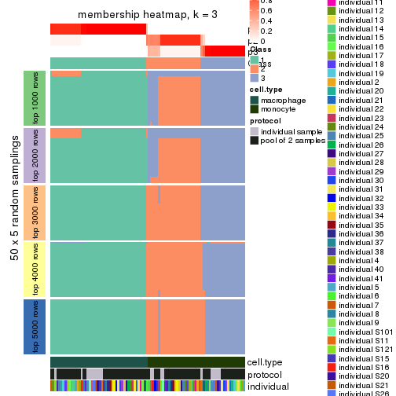</p>

</div>
<div id='tab-CV-skmeans-membership-heatmap-3'>
<pre><code class="r">membership_heatmap(res, k = 4)
</code></pre>

<p></p>

</div>
<div id='tab-CV-skmeans-membership-heatmap-4'>
<pre><code class="r">membership_heatmap(res, k = 5)
</code></pre>

<p></p>

</div>
<div id='tab-CV-skmeans-membership-heatmap-5'>
<pre><code class="r">membership_heatmap(res, k = 6)
</code></pre>

<p></p>

</div>
</div>

As soon as we have had the classes for columns, we can look for signatures
which are significantly different between classes which can be candidate marks
for certain classes. Following are the heatmaps for signatures.


Signature heatmaps where rows are scaled:


<script>
$( function() {
	$( '#tabs-CV-skmeans-get-signatures' ).tabs();
} );
</script>
<div id='tabs-CV-skmeans-get-signatures'>
<ul>
<li><a href='#tab-CV-skmeans-get-signatures-1'>k = 2</a></li>
<li><a href='#tab-CV-skmeans-get-signatures-2'>k = 3</a></li>
<li><a href='#tab-CV-skmeans-get-signatures-3'>k = 4</a></li>
<li><a href='#tab-CV-skmeans-get-signatures-4'>k = 5</a></li>
<li><a href='#tab-CV-skmeans-get-signatures-5'>k = 6</a></li>
</ul>
<div id='tab-CV-skmeans-get-signatures-1'>
<pre><code class="r">get_signatures(res, k = 2)
</code></pre>

<p></p>

</div>
<div id='tab-CV-skmeans-get-signatures-2'>
<pre><code class="r">get_signatures(res, k = 3)
</code></pre>

<p></p>

</div>
<div id='tab-CV-skmeans-get-signatures-3'>
<pre><code class="r">get_signatures(res, k = 4)
</code></pre>

<p></p>

</div>
<div id='tab-CV-skmeans-get-signatures-4'>
<pre><code class="r">get_signatures(res, k = 5)
</code></pre>

<p></p>

</div>
<div id='tab-CV-skmeans-get-signatures-5'>
<pre><code class="r">get_signatures(res, k = 6)
</code></pre>

<p></p>

</div>
</div>


Signature heatmaps where rows are not scaled:


<script>
$( function() {
	$( '#tabs-CV-skmeans-get-signatures-no-scale' ).tabs();
} );
</script>
<div id='tabs-CV-skmeans-get-signatures-no-scale'>
<ul>
<li><a href='#tab-CV-skmeans-get-signatures-no-scale-1'>k = 2</a></li>
<li><a href='#tab-CV-skmeans-get-signatures-no-scale-2'>k = 3</a></li>
<li><a href='#tab-CV-skmeans-get-signatures-no-scale-3'>k = 4</a></li>
<li><a href='#tab-CV-skmeans-get-signatures-no-scale-4'>k = 5</a></li>
<li><a href='#tab-CV-skmeans-get-signatures-no-scale-5'>k = 6</a></li>
</ul>
<div id='tab-CV-skmeans-get-signatures-no-scale-1'>
<pre><code class="r">get_signatures(res, k = 2, scale_rows = FALSE)
</code></pre>

<p></p>

</div>
<div id='tab-CV-skmeans-get-signatures-no-scale-2'>
<pre><code class="r">get_signatures(res, k = 3, scale_rows = FALSE)
</code></pre>

<p></p>

</div>
<div id='tab-CV-skmeans-get-signatures-no-scale-3'>
<pre><code class="r">get_signatures(res, k = 4, scale_rows = FALSE)
</code></pre>

<p></p>

</div>
<div id='tab-CV-skmeans-get-signatures-no-scale-4'>
<pre><code class="r">get_signatures(res, k = 5, scale_rows = FALSE)
</code></pre>

<p></p>

</div>
<div id='tab-CV-skmeans-get-signatures-no-scale-5'>
<pre><code class="r">get_signatures(res, k = 6, scale_rows = FALSE)
</code></pre>

<p></p>

</div>
</div>


Compare the overlap of signatures from different k:

```r
compare_signatures(res)
```


`get_signature()` returns a data frame invisibly. TO get the list of signatures, the function
call should be assigned to a variable explicitly. In following code, if `plot` argument is set
to `FALSE`, no heatmap is plotted while only the differential analysis is performed.

```r
# code only for demonstration
tb = get_signature(res, k = ..., plot = FALSE)
```

An example of the output of `tb` is:

```
#>   which_row         fdr    mean_1    mean_2 scaled_mean_1 scaled_mean_2 km
#> 1        38 0.042760348  8.373488  9.131774    -0.5533452     0.5164555  1
#> 2        40 0.018707592  7.106213  8.469186    -0.6173731     0.5762149  1
#> 3        55 0.019134737 10.221463 11.207825    -0.6159697     0.5749050  1
#> 4        59 0.006059896  5.921854  7.869574    -0.6899429     0.6439467  1
#> 5        60 0.018055526  8.928898 10.211722    -0.6204761     0.5791110  1
#> 6        98 0.009384629 15.714769 14.887706     0.6635654    -0.6193277  2
...
```

The columns in `tb` are:

1. `which_row`: row indices corresponding to the input matrix.
2. `fdr`: FDR for the differential test. 
3. `mean_x`: The mean value in group x.
4. `scaled_mean_x`: The mean value in group x after rows are scaled.
5. `km`: Row groups if k-means clustering is applied to rows.


UMAP plot which shows how samples are separated.


<script>
$( function() {
	$( '#tabs-CV-skmeans-dimension-reduction' ).tabs();
} );
</script>
<div id='tabs-CV-skmeans-dimension-reduction'>
<ul>
<li><a href='#tab-CV-skmeans-dimension-reduction-1'>k = 2</a></li>
<li><a href='#tab-CV-skmeans-dimension-reduction-2'>k = 3</a></li>
<li><a href='#tab-CV-skmeans-dimension-reduction-3'>k = 4</a></li>
<li><a href='#tab-CV-skmeans-dimension-reduction-4'>k = 5</a></li>
<li><a href='#tab-CV-skmeans-dimension-reduction-5'>k = 6</a></li>
</ul>
<div id='tab-CV-skmeans-dimension-reduction-1'>
<pre><code class="r">dimension_reduction(res, k = 2, method = &quot;UMAP&quot;)
</code></pre>

<p></p>

</div>
<div id='tab-CV-skmeans-dimension-reduction-2'>
<pre><code class="r">dimension_reduction(res, k = 3, method = &quot;UMAP&quot;)
</code></pre>

<p></p>

</div>
<div id='tab-CV-skmeans-dimension-reduction-3'>
<pre><code class="r">dimension_reduction(res, k = 4, method = &quot;UMAP&quot;)
</code></pre>

<p></p>

</div>
<div id='tab-CV-skmeans-dimension-reduction-4'>
<pre><code class="r">dimension_reduction(res, k = 5, method = &quot;UMAP&quot;)
</code></pre>

<p></p>

</div>
<div id='tab-CV-skmeans-dimension-reduction-5'>
<pre><code class="r">dimension_reduction(res, k = 6, method = &quot;UMAP&quot;)
</code></pre>

<p></p>

</div>
</div>


Following heatmap shows how subgroups are split when increasing `k`:

```r
collect_classes(res)
```


Test correlation between subgroups and known annotations. If the known
annotation is numeric, one-way ANOVA test is applied, and if the known
annotation is discrete, chi-squared contingency table test is applied.

```r
test_to_known_factors(res)
```

```
#>             n cell.type(p) protocol(p) individual(p) k
#> CV:skmeans 96     8.49e-22       1.000         1.000 2
#> CV:skmeans 93     6.39e-21       0.791         1.000 3
#> CV:skmeans 89     3.59e-19       0.407         0.993 4
#> CV:skmeans 80     3.07e-17       0.641         0.944 5
#> CV:skmeans 80     8.39e-16       0.420         0.879 6
```


If matrix rows can be associated to genes, consider to use `functional_enrichment(res,
...)` to perform function enrichment for the signature genes. See [this vignette](http://bioconductor.org/packages/devel/bioc/vignettes/cola/inst/doc/functional_enrichment.html) for more detailed explanations.


 

---------------------------------------------------


### CV:pam*


The object with results only for a single top-value method and a single partition method 
can be extracted as:

```r
res = res_list["CV", "pam"]
# you can also extract it by
# res = res_list["CV:pam"]
```

A summary of `res` and all the functions that can be applied to it:

```r
res
```

```
#> A 'ConsensusPartition' object with k = 2, 3, 4, 5, 6.
#>   On a matrix with 25171 rows and 96 columns.
#>   Top rows (1000, 2000, 3000, 4000, 5000) are extracted by 'CV' method.
#>   Subgroups are detected by 'pam' method.
#>   Performed in total 1250 partitions by row resampling.
#>   Best k for subgroups seems to be 4.
#> 
#> Following methods can be applied to this 'ConsensusPartition' object:
#>  [1] "cola_report"             "collect_classes"         "collect_plots"          
#>  [4] "collect_stats"           "colnames"                "compare_signatures"     
#>  [7] "consensus_heatmap"       "dimension_reduction"     "functional_enrichment"  
#> [10] "get_anno_col"            "get_anno"                "get_classes"            
#> [13] "get_consensus"           "get_matrix"              "get_membership"         
#> [16] "get_param"               "get_signatures"          "get_stats"              
#> [19] "is_best_k"               "is_stable_k"             "membership_heatmap"     
#> [22] "ncol"                    "nrow"                    "plot_ecdf"              
#> [25] "rownames"                "select_partition_number" "show"                   
#> [28] "suggest_best_k"          "test_to_known_factors"
```

`collect_plots()` function collects all the plots made from `res` for all `k` (number of partitions)
into one single page to provide an easy and fast comparison between different `k`.

```r
collect_plots(res)
```


The plots are:

- The first row: a plot of the ECDF (empirical cumulative distribution
  function) curves of the consensus matrix for each `k` and the heatmap of
  predicted classes for each `k`.
- The second row: heatmaps of the consensus matrix for each `k`.
- The third row: heatmaps of the membership matrix for each `k`.
- The fouth row: heatmaps of the signatures for each `k`.

All the plots in panels can be made by individual functions and they are
plotted later in this section.

`select_partition_number()` produces several plots showing different
statistics for choosing "optimized" `k`. There are following statistics:

- ECDF curves of the consensus matrix for each `k`;
- 1-PAC. [The PAC
  score](https://en.wikipedia.org/wiki/Consensus_clustering#Over-interpretation_potential_of_consensus_clustering)
  measures the proportion of the ambiguous subgrouping.
- Mean silhouette score.
- Concordance. The mean probability of fiting the consensus class ids in all
  partitions.
- Area increased. Denote $A_k$ as the area under the ECDF curve for current
  `k`, the area increased is defined as $A_k - A_{k-1}$.
- Rand index. The percent of pairs of samples that are both in a same cluster
  or both are not in a same cluster in the partition of k and k-1.
- Jaccard index. The ratio of pairs of samples are both in a same cluster in
  the partition of k and k-1 and the pairs of samples are both in a same
  cluster in the partition k or k-1.

The detailed explanations of these statistics can be found in [the _cola_
vignette](http://bioconductor.org/packages/devel/bioc/vignettes/cola/inst/doc/cola.html#toc_13).

Generally speaking, lower PAC score, higher mean silhouette score or higher
concordance corresponds to better partition. Rand index and Jaccard index
measure how similar the current partition is compared to partition with `k-1`.
If they are too similar, we won't accept `k` is better than `k-1`.

```r
select_partition_number(res)
```


The numeric values for all these statistics can be obtained by `get_stats()`.

```r
get_stats(res)
```

```
#>   k 1-PAC mean_silhouette concordance area_increased  Rand Jaccard
#> 2 2 0.978           0.931       0.970         0.4999 0.503   0.503
#> 3 3 0.965           0.937       0.970         0.2664 0.797   0.620
#> 4 4 0.900           0.893       0.950         0.1221 0.911   0.761
#> 5 5 0.766           0.700       0.824         0.0859 0.946   0.814
#> 6 6 0.807           0.742       0.875         0.0553 0.936   0.741
```

`suggest_best_k()` suggests the best $k$ based on these statistics. The rules are as follows:

- All $k$ with Jaccard index larger than 0.95 are removed because increasing
  $k$ does not provide enough extra information. If all $k$ are removed, it is
  marked as no subgroup is detected.
- For all $k$ with 1-PAC score larger than 0.9, the maximal $k$ is taken as
  the best $k$, and other $k$ are marked as optional $k$.
- If it does not fit the second rule. The $k$ with the maximal vote of the
  highest 1-PAC score, highest mean silhouette, and highest concordance is
  taken as the best $k$.

```r
suggest_best_k(res)
```

```
#> [1] 4
#> attr(,"optional")
#> [1] 2 3
```

There is also optional best $k$ = 2 3 that is worth to check.

Following shows the table of the partitions (You need to click the **show/hide
code output** link to see it). The membership matrix (columns with name `p*`)
is inferred by
[`clue::cl_consensus()`](https://www.rdocumentation.org/link/cl_consensus?package=clue)
function with the `SE` method. Basically the value in the membership matrix
represents the probability to belong to a certain group. The finall class
label for an item is determined with the group with highest probability it
belongs to.

In `get_classes()` function, the entropy is calculated from the membership
matrix and the silhouette score is calculated from the consensus matrix.


<script>
$( function() {
	$( '#tabs-CV-pam-get-classes' ).tabs();
} );
</script>
<div id='tabs-CV-pam-get-classes'>
<ul>
<li><a href='#tab-CV-pam-get-classes-1'>k = 2</a></li>
<li><a href='#tab-CV-pam-get-classes-2'>k = 3</a></li>
<li><a href='#tab-CV-pam-get-classes-3'>k = 4</a></li>
<li><a href='#tab-CV-pam-get-classes-4'>k = 5</a></li>
<li><a href='#tab-CV-pam-get-classes-5'>k = 6</a></li>
</ul>

<div id='tab-CV-pam-get-classes-1'>
<p><a id='tab-CV-pam-get-classes-1-a' style='color:#0366d6' href='#'>show/hide code output</a></p>
<pre><code class="r">cbind(get_classes(res, k = 2), get_membership(res, k = 2))
</code></pre>

<pre><code>#&gt;           class entropy silhouette    p1    p2
#&gt; GSM257886     1  0.0000      0.954 1.000 0.000
#&gt; GSM257888     1  0.1843      0.931 0.972 0.028
#&gt; GSM257890     1  0.0000      0.954 1.000 0.000
#&gt; GSM257892     1  0.3114      0.907 0.944 0.056
#&gt; GSM257894     1  0.0000      0.954 1.000 0.000
#&gt; GSM257896     1  0.0000      0.954 1.000 0.000
#&gt; GSM257898     1  0.0000      0.954 1.000 0.000
#&gt; GSM257900     1  0.0000      0.954 1.000 0.000
#&gt; GSM257902     1  0.0000      0.954 1.000 0.000
#&gt; GSM257904     1  0.0000      0.954 1.000 0.000
#&gt; GSM257906     1  0.0000      0.954 1.000 0.000
#&gt; GSM257908     1  0.0000      0.954 1.000 0.000
#&gt; GSM257910     1  0.0000      0.954 1.000 0.000
#&gt; GSM257912     1  0.1843      0.931 0.972 0.028
#&gt; GSM257914     1  0.0000      0.954 1.000 0.000
#&gt; GSM257917     1  0.0000      0.954 1.000 0.000
#&gt; GSM257919     1  0.0672      0.948 0.992 0.008
#&gt; GSM257921     1  0.0000      0.954 1.000 0.000
#&gt; GSM257923     1  0.0000      0.954 1.000 0.000
#&gt; GSM257925     1  0.0000      0.954 1.000 0.000
#&gt; GSM257927     1  0.0000      0.954 1.000 0.000
#&gt; GSM257929     1  0.0000      0.954 1.000 0.000
#&gt; GSM257937     1  0.0000      0.954 1.000 0.000
#&gt; GSM257939     1  0.0000      0.954 1.000 0.000
#&gt; GSM257941     1  0.0000      0.954 1.000 0.000
#&gt; GSM257943     1  0.0000      0.954 1.000 0.000
#&gt; GSM257945     1  0.0000      0.954 1.000 0.000
#&gt; GSM257947     1  0.0000      0.954 1.000 0.000
#&gt; GSM257949     1  0.0000      0.954 1.000 0.000
#&gt; GSM257951     1  0.0000      0.954 1.000 0.000
#&gt; GSM257953     1  0.0000      0.954 1.000 0.000
#&gt; GSM257955     1  0.0000      0.954 1.000 0.000
#&gt; GSM257958     1  0.0000      0.954 1.000 0.000
#&gt; GSM257960     1  0.0000      0.954 1.000 0.000
#&gt; GSM257962     1  0.0000      0.954 1.000 0.000
#&gt; GSM257964     1  0.0000      0.954 1.000 0.000
#&gt; GSM257966     1  0.0000      0.954 1.000 0.000
#&gt; GSM257968     1  0.0000      0.954 1.000 0.000
#&gt; GSM257970     1  0.0000      0.954 1.000 0.000
#&gt; GSM257972     1  0.0000      0.954 1.000 0.000
#&gt; GSM257977     1  0.0000      0.954 1.000 0.000
#&gt; GSM257982     1  0.0000      0.954 1.000 0.000
#&gt; GSM257984     1  0.0000      0.954 1.000 0.000
#&gt; GSM257986     1  0.0000      0.954 1.000 0.000
#&gt; GSM257990     1  0.0000      0.954 1.000 0.000
#&gt; GSM257992     1  0.0000      0.954 1.000 0.000
#&gt; GSM257996     1  0.0000      0.954 1.000 0.000
#&gt; GSM258006     1  0.0000      0.954 1.000 0.000
#&gt; GSM257887     2  0.0000      0.987 0.000 1.000
#&gt; GSM257889     2  0.3114      0.948 0.056 0.944
#&gt; GSM257891     2  0.3114      0.948 0.056 0.944
#&gt; GSM257893     2  0.3114      0.948 0.056 0.944
#&gt; GSM257895     2  0.0000      0.987 0.000 1.000
#&gt; GSM257897     1  0.9522      0.439 0.628 0.372
#&gt; GSM257899     1  0.9635      0.401 0.612 0.388
#&gt; GSM257901     2  0.0000      0.987 0.000 1.000
#&gt; GSM257903     2  0.0000      0.987 0.000 1.000
#&gt; GSM257905     2  0.0000      0.987 0.000 1.000
#&gt; GSM257907     2  0.0000      0.987 0.000 1.000
#&gt; GSM257909     2  0.0000      0.987 0.000 1.000
#&gt; GSM257911     2  0.0000      0.987 0.000 1.000
#&gt; GSM257913     2  0.0000      0.987 0.000 1.000
#&gt; GSM257916     2  0.0000      0.987 0.000 1.000
#&gt; GSM257918     2  0.0000      0.987 0.000 1.000
#&gt; GSM257920     2  0.0938      0.981 0.012 0.988
#&gt; GSM257922     1  0.9635      0.401 0.612 0.388
#&gt; GSM257924     2  0.2948      0.952 0.052 0.948
#&gt; GSM257926     2  0.0376      0.986 0.004 0.996
#&gt; GSM257928     1  0.9460      0.460 0.636 0.364
#&gt; GSM257930     2  0.3879      0.927 0.076 0.924
#&gt; GSM257938     1  0.9954      0.230 0.540 0.460
#&gt; GSM257940     2  0.0000      0.987 0.000 1.000
#&gt; GSM257942     2  0.0000      0.987 0.000 1.000
#&gt; GSM257944     2  0.0000      0.987 0.000 1.000
#&gt; GSM257946     2  0.2948      0.952 0.052 0.948
#&gt; GSM257948     2  0.0376      0.986 0.004 0.996
#&gt; GSM257950     2  0.3114      0.948 0.056 0.944
#&gt; GSM257952     2  0.0000      0.987 0.000 1.000
#&gt; GSM257954     2  0.0000      0.987 0.000 1.000
#&gt; GSM257956     2  0.0938      0.980 0.012 0.988
#&gt; GSM257959     2  0.0000      0.987 0.000 1.000
#&gt; GSM257961     2  0.0000      0.987 0.000 1.000
#&gt; GSM257963     2  0.0000      0.987 0.000 1.000
#&gt; GSM257965     2  0.0000      0.987 0.000 1.000
#&gt; GSM257967     2  0.0000      0.987 0.000 1.000
#&gt; GSM257969     2  0.0000      0.987 0.000 1.000
#&gt; GSM257971     2  0.0000      0.987 0.000 1.000
#&gt; GSM257973     2  0.0376      0.986 0.004 0.996
#&gt; GSM257981     2  0.0000      0.987 0.000 1.000
#&gt; GSM257983     2  0.3114      0.948 0.056 0.944
#&gt; GSM257985     2  0.0376      0.986 0.004 0.996
#&gt; GSM257988     2  0.0376      0.986 0.004 0.996
#&gt; GSM257991     2  0.0000      0.987 0.000 1.000
#&gt; GSM257993     2  0.0000      0.987 0.000 1.000
#&gt; GSM257994     1  0.8443      0.651 0.728 0.272
#&gt; GSM257989     2  0.0376      0.986 0.004 0.996
</code></pre>

<script>
$('#tab-CV-pam-get-classes-1-a').parent().next().next().hide();
$('#tab-CV-pam-get-classes-1-a').click(function(){
  $('#tab-CV-pam-get-classes-1-a').parent().next().next().toggle();
  return(false);
});
</script>
</div>

<div id='tab-CV-pam-get-classes-2'>
<p><a id='tab-CV-pam-get-classes-2-a' style='color:#0366d6' href='#'>show/hide code output</a></p>
<pre><code class="r">cbind(get_classes(res, k = 3), get_membership(res, k = 3))
</code></pre>

<pre><code>#&gt;           class entropy silhouette    p1    p2    p3
#&gt; GSM257886     1  0.0000      0.999 1.000 0.000 0.000
#&gt; GSM257888     1  0.0000      0.999 1.000 0.000 0.000
#&gt; GSM257890     1  0.0000      0.999 1.000 0.000 0.000
#&gt; GSM257892     2  0.6299      0.140 0.476 0.524 0.000
#&gt; GSM257894     1  0.0000      0.999 1.000 0.000 0.000
#&gt; GSM257896     1  0.0000      0.999 1.000 0.000 0.000
#&gt; GSM257898     1  0.0000      0.999 1.000 0.000 0.000
#&gt; GSM257900     1  0.0000      0.999 1.000 0.000 0.000
#&gt; GSM257902     1  0.0000      0.999 1.000 0.000 0.000
#&gt; GSM257904     1  0.0000      0.999 1.000 0.000 0.000
#&gt; GSM257906     1  0.0000      0.999 1.000 0.000 0.000
#&gt; GSM257908     1  0.0237      0.996 0.996 0.000 0.004
#&gt; GSM257910     1  0.0237      0.996 0.996 0.000 0.004
#&gt; GSM257912     1  0.0237      0.996 0.996 0.000 0.004
#&gt; GSM257914     1  0.0237      0.996 0.996 0.000 0.004
#&gt; GSM257917     1  0.0237      0.996 0.996 0.000 0.004
#&gt; GSM257919     1  0.0237      0.996 0.996 0.000 0.004
#&gt; GSM257921     1  0.0000      0.999 1.000 0.000 0.000
#&gt; GSM257923     1  0.0000      0.999 1.000 0.000 0.000
#&gt; GSM257925     1  0.0000      0.999 1.000 0.000 0.000
#&gt; GSM257927     1  0.0000      0.999 1.000 0.000 0.000
#&gt; GSM257929     1  0.0000      0.999 1.000 0.000 0.000
#&gt; GSM257937     1  0.0237      0.996 0.996 0.000 0.004
#&gt; GSM257939     1  0.0000      0.999 1.000 0.000 0.000
#&gt; GSM257941     1  0.0000      0.999 1.000 0.000 0.000
#&gt; GSM257943     1  0.0000      0.999 1.000 0.000 0.000
#&gt; GSM257945     1  0.0000      0.999 1.000 0.000 0.000
#&gt; GSM257947     1  0.0000      0.999 1.000 0.000 0.000
#&gt; GSM257949     1  0.0000      0.999 1.000 0.000 0.000
#&gt; GSM257951     1  0.0000      0.999 1.000 0.000 0.000
#&gt; GSM257953     1  0.0000      0.999 1.000 0.000 0.000
#&gt; GSM257955     1  0.0000      0.999 1.000 0.000 0.000
#&gt; GSM257958     1  0.0000      0.999 1.000 0.000 0.000
#&gt; GSM257960     1  0.0000      0.999 1.000 0.000 0.000
#&gt; GSM257962     1  0.0000      0.999 1.000 0.000 0.000
#&gt; GSM257964     1  0.0000      0.999 1.000 0.000 0.000
#&gt; GSM257966     1  0.1647      0.959 0.960 0.036 0.004
#&gt; GSM257968     1  0.0000      0.999 1.000 0.000 0.000
#&gt; GSM257970     1  0.0000      0.999 1.000 0.000 0.000
#&gt; GSM257972     1  0.0000      0.999 1.000 0.000 0.000
#&gt; GSM257977     1  0.0000      0.999 1.000 0.000 0.000
#&gt; GSM257982     1  0.0000      0.999 1.000 0.000 0.000
#&gt; GSM257984     1  0.0000      0.999 1.000 0.000 0.000
#&gt; GSM257986     1  0.0000      0.999 1.000 0.000 0.000
#&gt; GSM257990     1  0.0000      0.999 1.000 0.000 0.000
#&gt; GSM257992     1  0.0000      0.999 1.000 0.000 0.000
#&gt; GSM257996     1  0.0237      0.996 0.996 0.000 0.004
#&gt; GSM258006     1  0.0000      0.999 1.000 0.000 0.000
#&gt; GSM257887     2  0.0000      0.894 0.000 1.000 0.000
#&gt; GSM257889     3  0.0237      0.992 0.000 0.004 0.996
#&gt; GSM257891     3  0.0237      0.992 0.000 0.004 0.996
#&gt; GSM257893     3  0.0237      0.992 0.000 0.004 0.996
#&gt; GSM257895     2  0.0000      0.894 0.000 1.000 0.000
#&gt; GSM257897     3  0.0237      0.988 0.004 0.000 0.996
#&gt; GSM257899     3  0.0237      0.988 0.004 0.000 0.996
#&gt; GSM257901     3  0.0237      0.992 0.000 0.004 0.996
#&gt; GSM257903     2  0.5760      0.566 0.000 0.672 0.328
#&gt; GSM257905     2  0.4555      0.741 0.000 0.800 0.200
#&gt; GSM257907     3  0.0237      0.992 0.000 0.004 0.996
#&gt; GSM257909     2  0.0000      0.894 0.000 1.000 0.000
#&gt; GSM257911     2  0.6299      0.242 0.000 0.524 0.476
#&gt; GSM257913     3  0.0237      0.992 0.000 0.004 0.996
#&gt; GSM257916     2  0.0000      0.894 0.000 1.000 0.000
#&gt; GSM257918     2  0.0000      0.894 0.000 1.000 0.000
#&gt; GSM257920     3  0.0237      0.992 0.000 0.004 0.996
#&gt; GSM257922     3  0.0237      0.988 0.004 0.000 0.996
#&gt; GSM257924     3  0.0237      0.992 0.000 0.004 0.996
#&gt; GSM257926     3  0.0237      0.992 0.000 0.004 0.996
#&gt; GSM257928     2  0.2774      0.858 0.008 0.920 0.072
#&gt; GSM257930     2  0.2448      0.857 0.000 0.924 0.076
#&gt; GSM257938     2  0.0237      0.892 0.004 0.996 0.000
#&gt; GSM257940     3  0.0237      0.992 0.000 0.004 0.996
#&gt; GSM257942     2  0.0000      0.894 0.000 1.000 0.000
#&gt; GSM257944     2  0.0000      0.894 0.000 1.000 0.000
#&gt; GSM257946     3  0.0237      0.992 0.000 0.004 0.996
#&gt; GSM257948     3  0.0237      0.992 0.000 0.004 0.996
#&gt; GSM257950     3  0.0237      0.992 0.000 0.004 0.996
#&gt; GSM257952     2  0.2878      0.844 0.000 0.904 0.096
#&gt; GSM257954     2  0.0000      0.894 0.000 1.000 0.000
#&gt; GSM257956     2  0.0000      0.894 0.000 1.000 0.000
#&gt; GSM257959     2  0.0000      0.894 0.000 1.000 0.000
#&gt; GSM257961     2  0.0000      0.894 0.000 1.000 0.000
#&gt; GSM257963     2  0.0000      0.894 0.000 1.000 0.000
#&gt; GSM257965     2  0.3116      0.837 0.000 0.892 0.108
#&gt; GSM257967     2  0.0000      0.894 0.000 1.000 0.000
#&gt; GSM257969     2  0.0000      0.894 0.000 1.000 0.000
#&gt; GSM257971     2  0.5785      0.578 0.000 0.668 0.332
#&gt; GSM257973     3  0.0237      0.992 0.000 0.004 0.996
#&gt; GSM257981     2  0.5650      0.598 0.000 0.688 0.312
#&gt; GSM257983     3  0.0237      0.992 0.000 0.004 0.996
#&gt; GSM257985     3  0.0237      0.992 0.000 0.004 0.996
#&gt; GSM257988     3  0.0237      0.992 0.000 0.004 0.996
#&gt; GSM257991     3  0.3686      0.829 0.000 0.140 0.860
#&gt; GSM257993     2  0.0000      0.894 0.000 1.000 0.000
#&gt; GSM257994     2  0.3042      0.856 0.040 0.920 0.040
#&gt; GSM257989     3  0.0237      0.992 0.000 0.004 0.996
</code></pre>

<script>
$('#tab-CV-pam-get-classes-2-a').parent().next().next().hide();
$('#tab-CV-pam-get-classes-2-a').click(function(){
  $('#tab-CV-pam-get-classes-2-a').parent().next().next().toggle();
  return(false);
});
</script>
</div>

<div id='tab-CV-pam-get-classes-3'>
<p><a id='tab-CV-pam-get-classes-3-a' style='color:#0366d6' href='#'>show/hide code output</a></p>
<pre><code class="r">cbind(get_classes(res, k = 4), get_membership(res, k = 4))
</code></pre>

<pre><code>#&gt;           class entropy silhouette    p1    p2    p3    p4
#&gt; GSM257886     1  0.1389      0.944 0.952 0.000 0.000 0.048
#&gt; GSM257888     1  0.4406      0.596 0.700 0.000 0.000 0.300
#&gt; GSM257890     1  0.1557      0.940 0.944 0.000 0.000 0.056
#&gt; GSM257892     1  0.6070      0.265 0.548 0.404 0.000 0.048
#&gt; GSM257894     1  0.1211      0.946 0.960 0.000 0.000 0.040
#&gt; GSM257896     1  0.1211      0.946 0.960 0.000 0.000 0.040
#&gt; GSM257898     1  0.0921      0.949 0.972 0.000 0.000 0.028
#&gt; GSM257900     1  0.1389      0.944 0.952 0.000 0.000 0.048
#&gt; GSM257902     1  0.0707      0.950 0.980 0.000 0.000 0.020
#&gt; GSM257904     1  0.4817      0.352 0.612 0.000 0.000 0.388
#&gt; GSM257906     1  0.1022      0.948 0.968 0.000 0.000 0.032
#&gt; GSM257908     4  0.0000      0.907 0.000 0.000 0.000 1.000
#&gt; GSM257910     4  0.0707      0.915 0.020 0.000 0.000 0.980
#&gt; GSM257912     4  0.0592      0.916 0.016 0.000 0.000 0.984
#&gt; GSM257914     4  0.0592      0.916 0.016 0.000 0.000 0.984
#&gt; GSM257917     4  0.0707      0.915 0.020 0.000 0.000 0.980
#&gt; GSM257919     4  0.0592      0.916 0.016 0.000 0.000 0.984
#&gt; GSM257921     1  0.1118      0.945 0.964 0.000 0.000 0.036
#&gt; GSM257923     1  0.0000      0.949 1.000 0.000 0.000 0.000
#&gt; GSM257925     1  0.0188      0.950 0.996 0.000 0.000 0.004
#&gt; GSM257927     1  0.0336      0.950 0.992 0.000 0.000 0.008
#&gt; GSM257929     1  0.0000      0.949 1.000 0.000 0.000 0.000
#&gt; GSM257937     4  0.4761      0.357 0.372 0.000 0.000 0.628
#&gt; GSM257939     1  0.0000      0.949 1.000 0.000 0.000 0.000
#&gt; GSM257941     1  0.0921      0.949 0.972 0.000 0.000 0.028
#&gt; GSM257943     1  0.0817      0.950 0.976 0.000 0.000 0.024
#&gt; GSM257945     1  0.0921      0.949 0.972 0.000 0.000 0.028
#&gt; GSM257947     1  0.0000      0.949 1.000 0.000 0.000 0.000
#&gt; GSM257949     1  0.0592      0.945 0.984 0.000 0.000 0.016
#&gt; GSM257951     1  0.0000      0.949 1.000 0.000 0.000 0.000
#&gt; GSM257953     1  0.0000      0.949 1.000 0.000 0.000 0.000
#&gt; GSM257955     1  0.0000      0.949 1.000 0.000 0.000 0.000
#&gt; GSM257958     1  0.0707      0.951 0.980 0.000 0.000 0.020
#&gt; GSM257960     1  0.0921      0.949 0.972 0.000 0.000 0.028
#&gt; GSM257962     1  0.0921      0.949 0.972 0.000 0.000 0.028
#&gt; GSM257964     1  0.0000      0.949 1.000 0.000 0.000 0.000
#&gt; GSM257966     4  0.0000      0.907 0.000 0.000 0.000 1.000
#&gt; GSM257968     1  0.0707      0.944 0.980 0.000 0.000 0.020
#&gt; GSM257970     1  0.0000      0.949 1.000 0.000 0.000 0.000
#&gt; GSM257972     1  0.0707      0.944 0.980 0.000 0.000 0.020
#&gt; GSM257977     1  0.1211      0.946 0.960 0.000 0.000 0.040
#&gt; GSM257982     1  0.0707      0.944 0.980 0.000 0.000 0.020
#&gt; GSM257984     1  0.0707      0.950 0.980 0.000 0.000 0.020
#&gt; GSM257986     1  0.0592      0.945 0.984 0.000 0.000 0.016
#&gt; GSM257990     1  0.0921      0.949 0.972 0.000 0.000 0.028
#&gt; GSM257992     1  0.0921      0.949 0.972 0.000 0.000 0.028
#&gt; GSM257996     4  0.2814      0.828 0.132 0.000 0.000 0.868
#&gt; GSM258006     1  0.0469      0.950 0.988 0.000 0.000 0.012
#&gt; GSM257887     2  0.0000      0.898 0.000 1.000 0.000 0.000
#&gt; GSM257889     3  0.0000      0.989 0.000 0.000 1.000 0.000
#&gt; GSM257891     3  0.0000      0.989 0.000 0.000 1.000 0.000
#&gt; GSM257893     3  0.0000      0.989 0.000 0.000 1.000 0.000
#&gt; GSM257895     2  0.0000      0.898 0.000 1.000 0.000 0.000
#&gt; GSM257897     3  0.0000      0.989 0.000 0.000 1.000 0.000
#&gt; GSM257899     3  0.0469      0.973 0.012 0.000 0.988 0.000
#&gt; GSM257901     3  0.0000      0.989 0.000 0.000 1.000 0.000
#&gt; GSM257903     2  0.4382      0.634 0.000 0.704 0.296 0.000
#&gt; GSM257905     2  0.3356      0.777 0.000 0.824 0.176 0.000
#&gt; GSM257907     3  0.0000      0.989 0.000 0.000 1.000 0.000
#&gt; GSM257909     2  0.0000      0.898 0.000 1.000 0.000 0.000
#&gt; GSM257911     2  0.4994      0.245 0.000 0.520 0.480 0.000
#&gt; GSM257913     3  0.0000      0.989 0.000 0.000 1.000 0.000
#&gt; GSM257916     2  0.0000      0.898 0.000 1.000 0.000 0.000
#&gt; GSM257918     2  0.0000      0.898 0.000 1.000 0.000 0.000
#&gt; GSM257920     3  0.0000      0.989 0.000 0.000 1.000 0.000
#&gt; GSM257922     3  0.0000      0.989 0.000 0.000 1.000 0.000
#&gt; GSM257924     3  0.0000      0.989 0.000 0.000 1.000 0.000
#&gt; GSM257926     3  0.0000      0.989 0.000 0.000 1.000 0.000
#&gt; GSM257928     2  0.3320      0.821 0.068 0.876 0.056 0.000
#&gt; GSM257930     2  0.2704      0.821 0.000 0.876 0.124 0.000
#&gt; GSM257938     2  0.0000      0.898 0.000 1.000 0.000 0.000
#&gt; GSM257940     3  0.0000      0.989 0.000 0.000 1.000 0.000
#&gt; GSM257942     2  0.0000      0.898 0.000 1.000 0.000 0.000
#&gt; GSM257944     2  0.0000      0.898 0.000 1.000 0.000 0.000
#&gt; GSM257946     3  0.0000      0.989 0.000 0.000 1.000 0.000
#&gt; GSM257948     3  0.0000      0.989 0.000 0.000 1.000 0.000
#&gt; GSM257950     3  0.0000      0.989 0.000 0.000 1.000 0.000
#&gt; GSM257952     2  0.2216      0.850 0.000 0.908 0.092 0.000
#&gt; GSM257954     2  0.0000      0.898 0.000 1.000 0.000 0.000
#&gt; GSM257956     2  0.0000      0.898 0.000 1.000 0.000 0.000
#&gt; GSM257959     2  0.0000      0.898 0.000 1.000 0.000 0.000
#&gt; GSM257961     2  0.0000      0.898 0.000 1.000 0.000 0.000
#&gt; GSM257963     2  0.0000      0.898 0.000 1.000 0.000 0.000
#&gt; GSM257965     2  0.2345      0.846 0.000 0.900 0.100 0.000
#&gt; GSM257967     2  0.0000      0.898 0.000 1.000 0.000 0.000
#&gt; GSM257969     2  0.0000      0.898 0.000 1.000 0.000 0.000
#&gt; GSM257971     2  0.5527      0.520 0.028 0.616 0.356 0.000
#&gt; GSM257973     3  0.0000      0.989 0.000 0.000 1.000 0.000
#&gt; GSM257981     2  0.4193      0.681 0.000 0.732 0.268 0.000
#&gt; GSM257983     3  0.0000      0.989 0.000 0.000 1.000 0.000
#&gt; GSM257985     3  0.0000      0.989 0.000 0.000 1.000 0.000
#&gt; GSM257988     3  0.0000      0.989 0.000 0.000 1.000 0.000
#&gt; GSM257991     3  0.3444      0.754 0.000 0.184 0.816 0.000
#&gt; GSM257993     2  0.0000      0.898 0.000 1.000 0.000 0.000
#&gt; GSM257994     2  0.2704      0.775 0.124 0.876 0.000 0.000
#&gt; GSM257989     3  0.0000      0.989 0.000 0.000 1.000 0.000
</code></pre>

<script>
$('#tab-CV-pam-get-classes-3-a').parent().next().next().hide();
$('#tab-CV-pam-get-classes-3-a').click(function(){
  $('#tab-CV-pam-get-classes-3-a').parent().next().next().toggle();
  return(false);
});
</script>
</div>

<div id='tab-CV-pam-get-classes-4'>
<p><a id='tab-CV-pam-get-classes-4-a' style='color:#0366d6' href='#'>show/hide code output</a></p>
<pre><code class="r">cbind(get_classes(res, k = 5), get_membership(res, k = 5))
</code></pre>

<pre><code>#&gt;           class entropy silhouette    p1    p2    p3    p4    p5
#&gt; GSM257886     1  0.4305    0.04898 0.512 0.000 0.000 0.488 0.000
#&gt; GSM257888     4  0.3671    0.86466 0.236 0.000 0.000 0.756 0.008
#&gt; GSM257890     4  0.3336    0.86881 0.228 0.000 0.000 0.772 0.000
#&gt; GSM257892     4  0.3700    0.85102 0.240 0.008 0.000 0.752 0.000
#&gt; GSM257894     4  0.3895    0.80220 0.320 0.000 0.000 0.680 0.000
#&gt; GSM257896     4  0.3336    0.86881 0.228 0.000 0.000 0.772 0.000
#&gt; GSM257898     1  0.4273    0.17551 0.552 0.000 0.000 0.448 0.000
#&gt; GSM257900     1  0.4297    0.10474 0.528 0.000 0.000 0.472 0.000
#&gt; GSM257902     4  0.4138    0.73805 0.384 0.000 0.000 0.616 0.000
#&gt; GSM257904     1  0.4961    0.11205 0.524 0.000 0.000 0.448 0.028
#&gt; GSM257906     1  0.4297    0.10474 0.528 0.000 0.000 0.472 0.000
#&gt; GSM257908     5  0.0000    0.88537 0.000 0.000 0.000 0.000 1.000
#&gt; GSM257910     5  0.0000    0.88537 0.000 0.000 0.000 0.000 1.000
#&gt; GSM257912     5  0.0000    0.88537 0.000 0.000 0.000 0.000 1.000
#&gt; GSM257914     5  0.0000    0.88537 0.000 0.000 0.000 0.000 1.000
#&gt; GSM257917     5  0.0000    0.88537 0.000 0.000 0.000 0.000 1.000
#&gt; GSM257919     5  0.0000    0.88537 0.000 0.000 0.000 0.000 1.000
#&gt; GSM257921     1  0.3336    0.54431 0.772 0.000 0.000 0.228 0.000
#&gt; GSM257923     1  0.0000    0.63650 1.000 0.000 0.000 0.000 0.000
#&gt; GSM257925     1  0.1121    0.63588 0.956 0.000 0.000 0.044 0.000
#&gt; GSM257927     1  0.2516    0.60941 0.860 0.000 0.000 0.140 0.000
#&gt; GSM257929     1  0.0000    0.63650 1.000 0.000 0.000 0.000 0.000
#&gt; GSM257937     5  0.6281   -0.01962 0.152 0.000 0.000 0.388 0.460
#&gt; GSM257939     1  0.0000    0.63650 1.000 0.000 0.000 0.000 0.000
#&gt; GSM257941     1  0.2966    0.58384 0.816 0.000 0.000 0.184 0.000
#&gt; GSM257943     1  0.4273    0.17551 0.552 0.000 0.000 0.448 0.000
#&gt; GSM257945     1  0.4030    0.35981 0.648 0.000 0.000 0.352 0.000
#&gt; GSM257947     1  0.0000    0.63650 1.000 0.000 0.000 0.000 0.000
#&gt; GSM257949     1  0.0404    0.62832 0.988 0.000 0.000 0.012 0.000
#&gt; GSM257951     1  0.0000    0.63650 1.000 0.000 0.000 0.000 0.000
#&gt; GSM257953     1  0.0000    0.63650 1.000 0.000 0.000 0.000 0.000
#&gt; GSM257955     1  0.0000    0.63650 1.000 0.000 0.000 0.000 0.000
#&gt; GSM257958     1  0.1965    0.62621 0.904 0.000 0.000 0.096 0.000
#&gt; GSM257960     1  0.4262    0.19234 0.560 0.000 0.000 0.440 0.000
#&gt; GSM257962     1  0.2516    0.60941 0.860 0.000 0.000 0.140 0.000
#&gt; GSM257964     1  0.0000    0.63650 1.000 0.000 0.000 0.000 0.000
#&gt; GSM257966     5  0.2329    0.81152 0.000 0.000 0.000 0.124 0.876
#&gt; GSM257968     1  0.4150   -0.13821 0.612 0.000 0.000 0.388 0.000
#&gt; GSM257970     1  0.0000    0.63650 1.000 0.000 0.000 0.000 0.000
#&gt; GSM257972     1  0.1965    0.59831 0.904 0.000 0.000 0.096 0.000
#&gt; GSM257977     4  0.3336    0.86881 0.228 0.000 0.000 0.772 0.000
#&gt; GSM257982     1  0.3999    0.00249 0.656 0.000 0.000 0.344 0.000
#&gt; GSM257984     4  0.4268    0.64247 0.444 0.000 0.000 0.556 0.000
#&gt; GSM257986     1  0.3774    0.10346 0.704 0.000 0.000 0.296 0.000
#&gt; GSM257990     1  0.2516    0.60941 0.860 0.000 0.000 0.140 0.000
#&gt; GSM257992     1  0.4273    0.17551 0.552 0.000 0.000 0.448 0.000
#&gt; GSM257996     5  0.4054    0.66714 0.072 0.000 0.000 0.140 0.788
#&gt; GSM258006     1  0.4201    0.25868 0.592 0.000 0.000 0.408 0.000
#&gt; GSM257887     2  0.0000    0.84112 0.000 1.000 0.000 0.000 0.000
#&gt; GSM257889     3  0.0000    0.97389 0.000 0.000 1.000 0.000 0.000
#&gt; GSM257891     3  0.0000    0.97389 0.000 0.000 1.000 0.000 0.000
#&gt; GSM257893     3  0.0000    0.97389 0.000 0.000 1.000 0.000 0.000
#&gt; GSM257895     2  0.0000    0.84112 0.000 1.000 0.000 0.000 0.000
#&gt; GSM257897     3  0.0000    0.97389 0.000 0.000 1.000 0.000 0.000
#&gt; GSM257899     3  0.0404    0.96197 0.000 0.000 0.988 0.012 0.000
#&gt; GSM257901     3  0.0000    0.97389 0.000 0.000 1.000 0.000 0.000
#&gt; GSM257903     2  0.5911    0.68446 0.000 0.596 0.176 0.228 0.000
#&gt; GSM257905     2  0.4201    0.74112 0.000 0.752 0.204 0.044 0.000
#&gt; GSM257907     3  0.0000    0.97389 0.000 0.000 1.000 0.000 0.000
#&gt; GSM257909     2  0.3336    0.80976 0.000 0.772 0.000 0.228 0.000
#&gt; GSM257911     2  0.5178    0.24493 0.000 0.480 0.480 0.040 0.000
#&gt; GSM257913     3  0.0000    0.97389 0.000 0.000 1.000 0.000 0.000
#&gt; GSM257916     2  0.0000    0.84112 0.000 1.000 0.000 0.000 0.000
#&gt; GSM257918     2  0.3336    0.80976 0.000 0.772 0.000 0.228 0.000
#&gt; GSM257920     3  0.0000    0.97389 0.000 0.000 1.000 0.000 0.000
#&gt; GSM257922     3  0.0000    0.97389 0.000 0.000 1.000 0.000 0.000
#&gt; GSM257924     3  0.0000    0.97389 0.000 0.000 1.000 0.000 0.000
#&gt; GSM257926     3  0.0000    0.97389 0.000 0.000 1.000 0.000 0.000
#&gt; GSM257928     2  0.1661    0.82190 0.036 0.940 0.024 0.000 0.000
#&gt; GSM257930     2  0.1410    0.82361 0.000 0.940 0.060 0.000 0.000
#&gt; GSM257938     2  0.0000    0.84112 0.000 1.000 0.000 0.000 0.000
#&gt; GSM257940     3  0.2813    0.80434 0.000 0.000 0.832 0.168 0.000
#&gt; GSM257942     2  0.3336    0.80976 0.000 0.772 0.000 0.228 0.000
#&gt; GSM257944     2  0.3336    0.80976 0.000 0.772 0.000 0.228 0.000
#&gt; GSM257946     3  0.0000    0.97389 0.000 0.000 1.000 0.000 0.000
#&gt; GSM257948     3  0.0000    0.97389 0.000 0.000 1.000 0.000 0.000
#&gt; GSM257950     3  0.0000    0.97389 0.000 0.000 1.000 0.000 0.000
#&gt; GSM257952     2  0.2179    0.81169 0.000 0.888 0.112 0.000 0.000
#&gt; GSM257954     2  0.0000    0.84112 0.000 1.000 0.000 0.000 0.000
#&gt; GSM257956     2  0.0000    0.84112 0.000 1.000 0.000 0.000 0.000
#&gt; GSM257959     2  0.3336    0.80976 0.000 0.772 0.000 0.228 0.000
#&gt; GSM257961     2  0.3109    0.81872 0.000 0.800 0.000 0.200 0.000
#&gt; GSM257963     2  0.3003    0.82178 0.000 0.812 0.000 0.188 0.000
#&gt; GSM257965     2  0.2329    0.80489 0.000 0.876 0.124 0.000 0.000
#&gt; GSM257967     2  0.2929    0.82253 0.000 0.820 0.000 0.180 0.000
#&gt; GSM257969     2  0.0000    0.84112 0.000 1.000 0.000 0.000 0.000
#&gt; GSM257971     2  0.4805    0.59848 0.000 0.648 0.312 0.040 0.000
#&gt; GSM257973     3  0.0000    0.97389 0.000 0.000 1.000 0.000 0.000
#&gt; GSM257981     2  0.3895    0.62044 0.000 0.680 0.320 0.000 0.000
#&gt; GSM257983     3  0.0000    0.97389 0.000 0.000 1.000 0.000 0.000
#&gt; GSM257985     3  0.0000    0.97389 0.000 0.000 1.000 0.000 0.000
#&gt; GSM257988     3  0.0000    0.97389 0.000 0.000 1.000 0.000 0.000
#&gt; GSM257991     3  0.5408    0.54835 0.000 0.120 0.652 0.228 0.000
#&gt; GSM257993     2  0.0000    0.84112 0.000 1.000 0.000 0.000 0.000
#&gt; GSM257994     2  0.1648    0.82087 0.040 0.940 0.020 0.000 0.000
#&gt; GSM257989     3  0.0000    0.97389 0.000 0.000 1.000 0.000 0.000
</code></pre>

<script>
$('#tab-CV-pam-get-classes-4-a').parent().next().next().hide();
$('#tab-CV-pam-get-classes-4-a').click(function(){
  $('#tab-CV-pam-get-classes-4-a').parent().next().next().toggle();
  return(false);
});
</script>
</div>

<div id='tab-CV-pam-get-classes-5'>
<p><a id='tab-CV-pam-get-classes-5-a' style='color:#0366d6' href='#'>show/hide code output</a></p>
<pre><code class="r">cbind(get_classes(res, k = 6), get_membership(res, k = 6))
</code></pre>

<pre><code>#&gt;           class entropy silhouette    p1    p2    p3    p4    p5    p6
#&gt; GSM257886     1  0.3868      0.477 0.504 0.000 0.000 0.000 0.000 0.496
#&gt; GSM257888     6  0.0458      0.754 0.016 0.000 0.000 0.000 0.000 0.984
#&gt; GSM257890     6  0.0000      0.750 0.000 0.000 0.000 0.000 0.000 1.000
#&gt; GSM257892     6  0.2234      0.606 0.124 0.004 0.000 0.000 0.000 0.872
#&gt; GSM257894     6  0.1814      0.745 0.100 0.000 0.000 0.000 0.000 0.900
#&gt; GSM257896     6  0.0000      0.750 0.000 0.000 0.000 0.000 0.000 1.000
#&gt; GSM257898     1  0.3847      0.530 0.544 0.000 0.000 0.000 0.000 0.456
#&gt; GSM257900     1  0.3864      0.500 0.520 0.000 0.000 0.000 0.000 0.480
#&gt; GSM257902     6  0.2597      0.718 0.176 0.000 0.000 0.000 0.000 0.824
#&gt; GSM257904     1  0.4463      0.502 0.516 0.000 0.000 0.028 0.000 0.456
#&gt; GSM257906     1  0.3864      0.500 0.520 0.000 0.000 0.000 0.000 0.480
#&gt; GSM257908     4  0.0000      0.931 0.000 0.000 0.000 1.000 0.000 0.000
#&gt; GSM257910     4  0.0000      0.931 0.000 0.000 0.000 1.000 0.000 0.000
#&gt; GSM257912     4  0.0000      0.931 0.000 0.000 0.000 1.000 0.000 0.000
#&gt; GSM257914     4  0.0000      0.931 0.000 0.000 0.000 1.000 0.000 0.000
#&gt; GSM257917     4  0.0000      0.931 0.000 0.000 0.000 1.000 0.000 0.000
#&gt; GSM257919     4  0.0000      0.931 0.000 0.000 0.000 1.000 0.000 0.000
#&gt; GSM257921     1  0.3050      0.687 0.764 0.000 0.000 0.000 0.000 0.236
#&gt; GSM257923     1  0.0000      0.706 1.000 0.000 0.000 0.000 0.000 0.000
#&gt; GSM257925     1  0.1204      0.715 0.944 0.000 0.000 0.000 0.000 0.056
#&gt; GSM257927     1  0.2491      0.709 0.836 0.000 0.000 0.000 0.000 0.164
#&gt; GSM257929     1  0.0000      0.706 1.000 0.000 0.000 0.000 0.000 0.000
#&gt; GSM257937     6  0.3979      0.252 0.012 0.000 0.000 0.360 0.000 0.628
#&gt; GSM257939     1  0.0000      0.706 1.000 0.000 0.000 0.000 0.000 0.000
#&gt; GSM257941     1  0.2793      0.701 0.800 0.000 0.000 0.000 0.000 0.200
#&gt; GSM257943     1  0.3847      0.530 0.544 0.000 0.000 0.000 0.000 0.456
#&gt; GSM257945     1  0.3659      0.606 0.636 0.000 0.000 0.000 0.000 0.364
#&gt; GSM257947     1  0.0000      0.706 1.000 0.000 0.000 0.000 0.000 0.000
#&gt; GSM257949     1  0.0458      0.696 0.984 0.000 0.000 0.000 0.000 0.016
#&gt; GSM257951     1  0.0000      0.706 1.000 0.000 0.000 0.000 0.000 0.000
#&gt; GSM257953     1  0.0000      0.706 1.000 0.000 0.000 0.000 0.000 0.000
#&gt; GSM257955     1  0.0000      0.706 1.000 0.000 0.000 0.000 0.000 0.000
#&gt; GSM257958     1  0.2048      0.715 0.880 0.000 0.000 0.000 0.000 0.120
#&gt; GSM257960     1  0.3838      0.537 0.552 0.000 0.000 0.000 0.000 0.448
#&gt; GSM257962     1  0.2491      0.709 0.836 0.000 0.000 0.000 0.000 0.164
#&gt; GSM257964     1  0.0000      0.706 1.000 0.000 0.000 0.000 0.000 0.000
#&gt; GSM257966     4  0.2092      0.820 0.000 0.000 0.000 0.876 0.000 0.124
#&gt; GSM257968     6  0.3747      0.485 0.396 0.000 0.000 0.000 0.000 0.604
#&gt; GSM257970     1  0.0000      0.706 1.000 0.000 0.000 0.000 0.000 0.000
#&gt; GSM257972     1  0.1610      0.688 0.916 0.000 0.000 0.000 0.000 0.084
#&gt; GSM257977     6  0.0000      0.750 0.000 0.000 0.000 0.000 0.000 1.000
#&gt; GSM257982     1  0.3868     -0.370 0.504 0.000 0.000 0.000 0.000 0.496
#&gt; GSM257984     6  0.3101      0.666 0.244 0.000 0.000 0.000 0.000 0.756
#&gt; GSM257986     6  0.3866      0.355 0.484 0.000 0.000 0.000 0.000 0.516
#&gt; GSM257990     1  0.2491      0.709 0.836 0.000 0.000 0.000 0.000 0.164
#&gt; GSM257992     1  0.3847      0.530 0.544 0.000 0.000 0.000 0.000 0.456
#&gt; GSM257996     4  0.4108      0.574 0.092 0.000 0.000 0.744 0.000 0.164
#&gt; GSM258006     1  0.3782      0.570 0.588 0.000 0.000 0.000 0.000 0.412
#&gt; GSM257887     2  0.0000      0.843 0.000 1.000 0.000 0.000 0.000 0.000
#&gt; GSM257889     3  0.0000      0.985 0.000 0.000 1.000 0.000 0.000 0.000
#&gt; GSM257891     3  0.0000      0.985 0.000 0.000 1.000 0.000 0.000 0.000
#&gt; GSM257893     3  0.0000      0.985 0.000 0.000 1.000 0.000 0.000 0.000
#&gt; GSM257895     2  0.0000      0.843 0.000 1.000 0.000 0.000 0.000 0.000
#&gt; GSM257897     3  0.0000      0.985 0.000 0.000 1.000 0.000 0.000 0.000
#&gt; GSM257899     3  0.0363      0.972 0.000 0.000 0.988 0.000 0.000 0.012
#&gt; GSM257901     3  0.2996      0.665 0.000 0.000 0.772 0.000 0.228 0.000
#&gt; GSM257903     5  0.0000      0.853 0.000 0.000 0.000 0.000 1.000 0.000
#&gt; GSM257905     5  0.5528      0.470 0.000 0.252 0.192 0.000 0.556 0.000
#&gt; GSM257907     3  0.0260      0.978 0.000 0.000 0.992 0.000 0.008 0.000
#&gt; GSM257909     5  0.0000      0.853 0.000 0.000 0.000 0.000 1.000 0.000
#&gt; GSM257911     5  0.3756      0.351 0.000 0.000 0.400 0.000 0.600 0.000
#&gt; GSM257913     3  0.0000      0.985 0.000 0.000 1.000 0.000 0.000 0.000
#&gt; GSM257916     2  0.0000      0.843 0.000 1.000 0.000 0.000 0.000 0.000
#&gt; GSM257918     5  0.0000      0.853 0.000 0.000 0.000 0.000 1.000 0.000
#&gt; GSM257920     3  0.0000      0.985 0.000 0.000 1.000 0.000 0.000 0.000
#&gt; GSM257922     3  0.0000      0.985 0.000 0.000 1.000 0.000 0.000 0.000
#&gt; GSM257924     3  0.0000      0.985 0.000 0.000 1.000 0.000 0.000 0.000
#&gt; GSM257926     3  0.0000      0.985 0.000 0.000 1.000 0.000 0.000 0.000
#&gt; GSM257928     2  0.0000      0.843 0.000 1.000 0.000 0.000 0.000 0.000
#&gt; GSM257930     2  0.0000      0.843 0.000 1.000 0.000 0.000 0.000 0.000
#&gt; GSM257938     2  0.0000      0.843 0.000 1.000 0.000 0.000 0.000 0.000
#&gt; GSM257940     5  0.2793      0.692 0.000 0.000 0.200 0.000 0.800 0.000
#&gt; GSM257942     5  0.0000      0.853 0.000 0.000 0.000 0.000 1.000 0.000
#&gt; GSM257944     5  0.0000      0.853 0.000 0.000 0.000 0.000 1.000 0.000
#&gt; GSM257946     3  0.0000      0.985 0.000 0.000 1.000 0.000 0.000 0.000
#&gt; GSM257948     3  0.0000      0.985 0.000 0.000 1.000 0.000 0.000 0.000
#&gt; GSM257950     3  0.0000      0.985 0.000 0.000 1.000 0.000 0.000 0.000
#&gt; GSM257952     2  0.2697      0.713 0.000 0.812 0.188 0.000 0.000 0.000
#&gt; GSM257954     2  0.0000      0.843 0.000 1.000 0.000 0.000 0.000 0.000
#&gt; GSM257956     2  0.0000      0.843 0.000 1.000 0.000 0.000 0.000 0.000
#&gt; GSM257959     5  0.0000      0.853 0.000 0.000 0.000 0.000 1.000 0.000
#&gt; GSM257961     2  0.3823      0.379 0.000 0.564 0.000 0.000 0.436 0.000
#&gt; GSM257963     2  0.3717      0.478 0.000 0.616 0.000 0.000 0.384 0.000
#&gt; GSM257965     2  0.2793      0.702 0.000 0.800 0.200 0.000 0.000 0.000
#&gt; GSM257967     2  0.3672      0.445 0.000 0.632 0.000 0.000 0.368 0.000
#&gt; GSM257969     2  0.0000      0.843 0.000 1.000 0.000 0.000 0.000 0.000
#&gt; GSM257971     2  0.4219      0.570 0.000 0.660 0.304 0.000 0.000 0.036
#&gt; GSM257973     3  0.0000      0.985 0.000 0.000 1.000 0.000 0.000 0.000
#&gt; GSM257981     2  0.3717      0.458 0.000 0.616 0.384 0.000 0.000 0.000
#&gt; GSM257983     3  0.0000      0.985 0.000 0.000 1.000 0.000 0.000 0.000
#&gt; GSM257985     3  0.0000      0.985 0.000 0.000 1.000 0.000 0.000 0.000
#&gt; GSM257988     3  0.0000      0.985 0.000 0.000 1.000 0.000 0.000 0.000
#&gt; GSM257991     5  0.0000      0.853 0.000 0.000 0.000 0.000 1.000 0.000
#&gt; GSM257993     2  0.0000      0.843 0.000 1.000 0.000 0.000 0.000 0.000
#&gt; GSM257994     2  0.0000      0.843 0.000 1.000 0.000 0.000 0.000 0.000
#&gt; GSM257989     3  0.0000      0.985 0.000 0.000 1.000 0.000 0.000 0.000
</code></pre>

<script>
$('#tab-CV-pam-get-classes-5-a').parent().next().next().hide();
$('#tab-CV-pam-get-classes-5-a').click(function(){
  $('#tab-CV-pam-get-classes-5-a').parent().next().next().toggle();
  return(false);
});
</script>
</div>
</div>

Heatmaps for the consensus matrix. It visualizes the probability of two
samples to be in a same group.


<script>
$( function() {
	$( '#tabs-CV-pam-consensus-heatmap' ).tabs();
} );
</script>
<div id='tabs-CV-pam-consensus-heatmap'>
<ul>
<li><a href='#tab-CV-pam-consensus-heatmap-1'>k = 2</a></li>
<li><a href='#tab-CV-pam-consensus-heatmap-2'>k = 3</a></li>
<li><a href='#tab-CV-pam-consensus-heatmap-3'>k = 4</a></li>
<li><a href='#tab-CV-pam-consensus-heatmap-4'>k = 5</a></li>
<li><a href='#tab-CV-pam-consensus-heatmap-5'>k = 6</a></li>
</ul>
<div id='tab-CV-pam-consensus-heatmap-1'>
<pre><code class="r">consensus_heatmap(res, k = 2)
</code></pre>

<p></p>

</div>
<div id='tab-CV-pam-consensus-heatmap-2'>
<pre><code class="r">consensus_heatmap(res, k = 3)
</code></pre>

<p></p>

</div>
<div id='tab-CV-pam-consensus-heatmap-3'>
<pre><code class="r">consensus_heatmap(res, k = 4)
</code></pre>

<p></p>

</div>
<div id='tab-CV-pam-consensus-heatmap-4'>
<pre><code class="r">consensus_heatmap(res, k = 5)
</code></pre>

<p></p>

</div>
<div id='tab-CV-pam-consensus-heatmap-5'>
<pre><code class="r">consensus_heatmap(res, k = 6)
</code></pre>

<p></p>

</div>
</div>

Heatmaps for the membership of samples in all partitions to see how consistent they are:


<script>
$( function() {
	$( '#tabs-CV-pam-membership-heatmap' ).tabs();
} );
</script>
<div id='tabs-CV-pam-membership-heatmap'>
<ul>
<li><a href='#tab-CV-pam-membership-heatmap-1'>k = 2</a></li>
<li><a href='#tab-CV-pam-membership-heatmap-2'>k = 3</a></li>
<li><a href='#tab-CV-pam-membership-heatmap-3'>k = 4</a></li>
<li><a href='#tab-CV-pam-membership-heatmap-4'>k = 5</a></li>
<li><a href='#tab-CV-pam-membership-heatmap-5'>k = 6</a></li>
</ul>
<div id='tab-CV-pam-membership-heatmap-1'>
<pre><code class="r">membership_heatmap(res, k = 2)
</code></pre>

<p></p>

</div>
<div id='tab-CV-pam-membership-heatmap-2'>
<pre><code class="r">membership_heatmap(res, k = 3)
</code></pre>

<p></p>

</div>
<div id='tab-CV-pam-membership-heatmap-3'>
<pre><code class="r">membership_heatmap(res, k = 4)
</code></pre>

<p></p>

</div>
<div id='tab-CV-pam-membership-heatmap-4'>
<pre><code class="r">membership_heatmap(res, k = 5)
</code></pre>

<p></p>

</div>
<div id='tab-CV-pam-membership-heatmap-5'>
<pre><code class="r">membership_heatmap(res, k = 6)
</code></pre>

<p></p>

</div>
</div>

As soon as we have had the classes for columns, we can look for signatures
which are significantly different between classes which can be candidate marks
for certain classes. Following are the heatmaps for signatures.


Signature heatmaps where rows are scaled:


<script>
$( function() {
	$( '#tabs-CV-pam-get-signatures' ).tabs();
} );
</script>
<div id='tabs-CV-pam-get-signatures'>
<ul>
<li><a href='#tab-CV-pam-get-signatures-1'>k = 2</a></li>
<li><a href='#tab-CV-pam-get-signatures-2'>k = 3</a></li>
<li><a href='#tab-CV-pam-get-signatures-3'>k = 4</a></li>
<li><a href='#tab-CV-pam-get-signatures-4'>k = 5</a></li>
<li><a href='#tab-CV-pam-get-signatures-5'>k = 6</a></li>
</ul>
<div id='tab-CV-pam-get-signatures-1'>
<pre><code class="r">get_signatures(res, k = 2)
</code></pre>

<p></p>

</div>
<div id='tab-CV-pam-get-signatures-2'>
<pre><code class="r">get_signatures(res, k = 3)
</code></pre>

<p></p>

</div>
<div id='tab-CV-pam-get-signatures-3'>
<pre><code class="r">get_signatures(res, k = 4)
</code></pre>

<p></p>

</div>
<div id='tab-CV-pam-get-signatures-4'>
<pre><code class="r">get_signatures(res, k = 5)
</code></pre>

<p></p>

</div>
<div id='tab-CV-pam-get-signatures-5'>
<pre><code class="r">get_signatures(res, k = 6)
</code></pre>

<p></p>

</div>
</div>


Signature heatmaps where rows are not scaled:


<script>
$( function() {
	$( '#tabs-CV-pam-get-signatures-no-scale' ).tabs();
} );
</script>
<div id='tabs-CV-pam-get-signatures-no-scale'>
<ul>
<li><a href='#tab-CV-pam-get-signatures-no-scale-1'>k = 2</a></li>
<li><a href='#tab-CV-pam-get-signatures-no-scale-2'>k = 3</a></li>
<li><a href='#tab-CV-pam-get-signatures-no-scale-3'>k = 4</a></li>
<li><a href='#tab-CV-pam-get-signatures-no-scale-4'>k = 5</a></li>
<li><a href='#tab-CV-pam-get-signatures-no-scale-5'>k = 6</a></li>
</ul>
<div id='tab-CV-pam-get-signatures-no-scale-1'>
<pre><code class="r">get_signatures(res, k = 2, scale_rows = FALSE)
</code></pre>

<p></p>

</div>
<div id='tab-CV-pam-get-signatures-no-scale-2'>
<pre><code class="r">get_signatures(res, k = 3, scale_rows = FALSE)
</code></pre>

<p></p>

</div>
<div id='tab-CV-pam-get-signatures-no-scale-3'>
<pre><code class="r">get_signatures(res, k = 4, scale_rows = FALSE)
</code></pre>

<p></p>

</div>
<div id='tab-CV-pam-get-signatures-no-scale-4'>
<pre><code class="r">get_signatures(res, k = 5, scale_rows = FALSE)
</code></pre>

<p>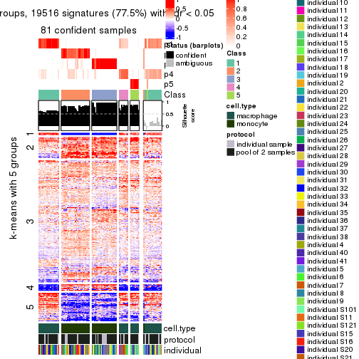</p>

</div>
<div id='tab-CV-pam-get-signatures-no-scale-5'>
<pre><code class="r">get_signatures(res, k = 6, scale_rows = FALSE)
</code></pre>

<p></p>

</div>
</div>


Compare the overlap of signatures from different k:

```r
compare_signatures(res)
```


`get_signature()` returns a data frame invisibly. TO get the list of signatures, the function
call should be assigned to a variable explicitly. In following code, if `plot` argument is set
to `FALSE`, no heatmap is plotted while only the differential analysis is performed.

```r
# code only for demonstration
tb = get_signature(res, k = ..., plot = FALSE)
```

An example of the output of `tb` is:

```
#>   which_row         fdr    mean_1    mean_2 scaled_mean_1 scaled_mean_2 km
#> 1        38 0.042760348  8.373488  9.131774    -0.5533452     0.5164555  1
#> 2        40 0.018707592  7.106213  8.469186    -0.6173731     0.5762149  1
#> 3        55 0.019134737 10.221463 11.207825    -0.6159697     0.5749050  1
#> 4        59 0.006059896  5.921854  7.869574    -0.6899429     0.6439467  1
#> 5        60 0.018055526  8.928898 10.211722    -0.6204761     0.5791110  1
#> 6        98 0.009384629 15.714769 14.887706     0.6635654    -0.6193277  2
...
```

The columns in `tb` are:

1. `which_row`: row indices corresponding to the input matrix.
2. `fdr`: FDR for the differential test. 
3. `mean_x`: The mean value in group x.
4. `scaled_mean_x`: The mean value in group x after rows are scaled.
5. `km`: Row groups if k-means clustering is applied to rows.


UMAP plot which shows how samples are separated.


<script>
$( function() {
	$( '#tabs-CV-pam-dimension-reduction' ).tabs();
} );
</script>
<div id='tabs-CV-pam-dimension-reduction'>
<ul>
<li><a href='#tab-CV-pam-dimension-reduction-1'>k = 2</a></li>
<li><a href='#tab-CV-pam-dimension-reduction-2'>k = 3</a></li>
<li><a href='#tab-CV-pam-dimension-reduction-3'>k = 4</a></li>
<li><a href='#tab-CV-pam-dimension-reduction-4'>k = 5</a></li>
<li><a href='#tab-CV-pam-dimension-reduction-5'>k = 6</a></li>
</ul>
<div id='tab-CV-pam-dimension-reduction-1'>
<pre><code class="r">dimension_reduction(res, k = 2, method = &quot;UMAP&quot;)
</code></pre>

<p></p>

</div>
<div id='tab-CV-pam-dimension-reduction-2'>
<pre><code class="r">dimension_reduction(res, k = 3, method = &quot;UMAP&quot;)
</code></pre>

<p></p>

</div>
<div id='tab-CV-pam-dimension-reduction-3'>
<pre><code class="r">dimension_reduction(res, k = 4, method = &quot;UMAP&quot;)
</code></pre>

<p></p>

</div>
<div id='tab-CV-pam-dimension-reduction-4'>
<pre><code class="r">dimension_reduction(res, k = 5, method = &quot;UMAP&quot;)
</code></pre>

<p></p>

</div>
<div id='tab-CV-pam-dimension-reduction-5'>
<pre><code class="r">dimension_reduction(res, k = 6, method = &quot;UMAP&quot;)
</code></pre>

<p></p>

</div>
</div>


Following heatmap shows how subgroups are split when increasing `k`:

```r
collect_classes(res)
```


Test correlation between subgroups and known annotations. If the known
annotation is numeric, one-way ANOVA test is applied, and if the known
annotation is discrete, chi-squared contingency table test is applied.

```r
test_to_known_factors(res)
```

```
#>         n cell.type(p) protocol(p) individual(p) k
#> CV:pam 91     7.48e-20       1.000         1.000 2
#> CV:pam 94     3.87e-21       0.642         1.000 3
#> CV:pam 92     8.15e-20       0.699         0.992 4
#> CV:pam 81     1.07e-16       0.823         0.979 5
#> CV:pam 85     7.53e-17       0.958         0.929 6
```


If matrix rows can be associated to genes, consider to use `functional_enrichment(res,
...)` to perform function enrichment for the signature genes. See [this vignette](http://bioconductor.org/packages/devel/bioc/vignettes/cola/inst/doc/functional_enrichment.html) for more detailed explanations.


 

---------------------------------------------------


### CV:mclust**


The object with results only for a single top-value method and a single partition method 
can be extracted as:

```r
res = res_list["CV", "mclust"]
# you can also extract it by
# res = res_list["CV:mclust"]
```

A summary of `res` and all the functions that can be applied to it:

```r
res
```

```
#> A 'ConsensusPartition' object with k = 2, 3, 4, 5, 6.
#>   On a matrix with 25171 rows and 96 columns.
#>   Top rows (1000, 2000, 3000, 4000, 5000) are extracted by 'CV' method.
#>   Subgroups are detected by 'mclust' method.
#>   Performed in total 1250 partitions by row resampling.
#>   Best k for subgroups seems to be 3.
#> 
#> Following methods can be applied to this 'ConsensusPartition' object:
#>  [1] "cola_report"             "collect_classes"         "collect_plots"          
#>  [4] "collect_stats"           "colnames"                "compare_signatures"     
#>  [7] "consensus_heatmap"       "dimension_reduction"     "functional_enrichment"  
#> [10] "get_anno_col"            "get_anno"                "get_classes"            
#> [13] "get_consensus"           "get_matrix"              "get_membership"         
#> [16] "get_param"               "get_signatures"          "get_stats"              
#> [19] "is_best_k"               "is_stable_k"             "membership_heatmap"     
#> [22] "ncol"                    "nrow"                    "plot_ecdf"              
#> [25] "rownames"                "select_partition_number" "show"                   
#> [28] "suggest_best_k"          "test_to_known_factors"
```

`collect_plots()` function collects all the plots made from `res` for all `k` (number of partitions)
into one single page to provide an easy and fast comparison between different `k`.

```r
collect_plots(res)
```


The plots are:

- The first row: a plot of the ECDF (empirical cumulative distribution
  function) curves of the consensus matrix for each `k` and the heatmap of
  predicted classes for each `k`.
- The second row: heatmaps of the consensus matrix for each `k`.
- The third row: heatmaps of the membership matrix for each `k`.
- The fouth row: heatmaps of the signatures for each `k`.

All the plots in panels can be made by individual functions and they are
plotted later in this section.

`select_partition_number()` produces several plots showing different
statistics for choosing "optimized" `k`. There are following statistics:

- ECDF curves of the consensus matrix for each `k`;
- 1-PAC. [The PAC
  score](https://en.wikipedia.org/wiki/Consensus_clustering#Over-interpretation_potential_of_consensus_clustering)
  measures the proportion of the ambiguous subgrouping.
- Mean silhouette score.
- Concordance. The mean probability of fiting the consensus class ids in all
  partitions.
- Area increased. Denote $A_k$ as the area under the ECDF curve for current
  `k`, the area increased is defined as $A_k - A_{k-1}$.
- Rand index. The percent of pairs of samples that are both in a same cluster
  or both are not in a same cluster in the partition of k and k-1.
- Jaccard index. The ratio of pairs of samples are both in a same cluster in
  the partition of k and k-1 and the pairs of samples are both in a same
  cluster in the partition k or k-1.

The detailed explanations of these statistics can be found in [the _cola_
vignette](http://bioconductor.org/packages/devel/bioc/vignettes/cola/inst/doc/cola.html#toc_13).

Generally speaking, lower PAC score, higher mean silhouette score or higher
concordance corresponds to better partition. Rand index and Jaccard index
measure how similar the current partition is compared to partition with `k-1`.
If they are too similar, we won't accept `k` is better than `k-1`.

```r
select_partition_number(res)
```


The numeric values for all these statistics can be obtained by `get_stats()`.

```r
get_stats(res)
```

```
#>   k 1-PAC mean_silhouette concordance area_increased  Rand Jaccard
#> 2 2 1.000           1.000       1.000        0.50576 0.495   0.495
#> 3 3 0.980           0.934       0.959        0.24029 0.876   0.749
#> 4 4 0.862           0.851       0.938        0.17127 0.880   0.684
#> 5 5 0.808           0.681       0.871        0.00937 0.898   0.682
#> 6 6 0.811           0.638       0.866        0.05341 0.971   0.895
```

`suggest_best_k()` suggests the best $k$ based on these statistics. The rules are as follows:

- All $k$ with Jaccard index larger than 0.95 are removed because increasing
  $k$ does not provide enough extra information. If all $k$ are removed, it is
  marked as no subgroup is detected.
- For all $k$ with 1-PAC score larger than 0.9, the maximal $k$ is taken as
  the best $k$, and other $k$ are marked as optional $k$.
- If it does not fit the second rule. The $k$ with the maximal vote of the
  highest 1-PAC score, highest mean silhouette, and highest concordance is
  taken as the best $k$.

```r
suggest_best_k(res)
```

```
#> [1] 3
#> attr(,"optional")
#> [1] 2
```

There is also optional best $k$ = 2 that is worth to check.

Following shows the table of the partitions (You need to click the **show/hide
code output** link to see it). The membership matrix (columns with name `p*`)
is inferred by
[`clue::cl_consensus()`](https://www.rdocumentation.org/link/cl_consensus?package=clue)
function with the `SE` method. Basically the value in the membership matrix
represents the probability to belong to a certain group. The finall class
label for an item is determined with the group with highest probability it
belongs to.

In `get_classes()` function, the entropy is calculated from the membership
matrix and the silhouette score is calculated from the consensus matrix.


<script>
$( function() {
	$( '#tabs-CV-mclust-get-classes' ).tabs();
} );
</script>
<div id='tabs-CV-mclust-get-classes'>
<ul>
<li><a href='#tab-CV-mclust-get-classes-1'>k = 2</a></li>
<li><a href='#tab-CV-mclust-get-classes-2'>k = 3</a></li>
<li><a href='#tab-CV-mclust-get-classes-3'>k = 4</a></li>
<li><a href='#tab-CV-mclust-get-classes-4'>k = 5</a></li>
<li><a href='#tab-CV-mclust-get-classes-5'>k = 6</a></li>
</ul>

<div id='tab-CV-mclust-get-classes-1'>
<p><a id='tab-CV-mclust-get-classes-1-a' style='color:#0366d6' href='#'>show/hide code output</a></p>
<pre><code class="r">cbind(get_classes(res, k = 2), get_membership(res, k = 2))
</code></pre>

<pre><code>#&gt;           class entropy silhouette p1 p2
#&gt; GSM257886     1       0          1  1  0
#&gt; GSM257888     1       0          1  1  0
#&gt; GSM257890     1       0          1  1  0
#&gt; GSM257892     1       0          1  1  0
#&gt; GSM257894     1       0          1  1  0
#&gt; GSM257896     1       0          1  1  0
#&gt; GSM257898     1       0          1  1  0
#&gt; GSM257900     1       0          1  1  0
#&gt; GSM257902     1       0          1  1  0
#&gt; GSM257904     1       0          1  1  0
#&gt; GSM257906     1       0          1  1  0
#&gt; GSM257908     1       0          1  1  0
#&gt; GSM257910     1       0          1  1  0
#&gt; GSM257912     1       0          1  1  0
#&gt; GSM257914     1       0          1  1  0
#&gt; GSM257917     1       0          1  1  0
#&gt; GSM257919     1       0          1  1  0
#&gt; GSM257921     1       0          1  1  0
#&gt; GSM257923     1       0          1  1  0
#&gt; GSM257925     1       0          1  1  0
#&gt; GSM257927     1       0          1  1  0
#&gt; GSM257929     1       0          1  1  0
#&gt; GSM257937     1       0          1  1  0
#&gt; GSM257939     1       0          1  1  0
#&gt; GSM257941     1       0          1  1  0
#&gt; GSM257943     1       0          1  1  0
#&gt; GSM257945     1       0          1  1  0
#&gt; GSM257947     1       0          1  1  0
#&gt; GSM257949     1       0          1  1  0
#&gt; GSM257951     1       0          1  1  0
#&gt; GSM257953     1       0          1  1  0
#&gt; GSM257955     1       0          1  1  0
#&gt; GSM257958     1       0          1  1  0
#&gt; GSM257960     1       0          1  1  0
#&gt; GSM257962     1       0          1  1  0
#&gt; GSM257964     1       0          1  1  0
#&gt; GSM257966     1       0          1  1  0
#&gt; GSM257968     1       0          1  1  0
#&gt; GSM257970     1       0          1  1  0
#&gt; GSM257972     1       0          1  1  0
#&gt; GSM257977     1       0          1  1  0
#&gt; GSM257982     1       0          1  1  0
#&gt; GSM257984     1       0          1  1  0
#&gt; GSM257986     1       0          1  1  0
#&gt; GSM257990     1       0          1  1  0
#&gt; GSM257992     1       0          1  1  0
#&gt; GSM257996     1       0          1  1  0
#&gt; GSM258006     1       0          1  1  0
#&gt; GSM257887     2       0          1  0  1
#&gt; GSM257889     2       0          1  0  1
#&gt; GSM257891     2       0          1  0  1
#&gt; GSM257893     2       0          1  0  1
#&gt; GSM257895     2       0          1  0  1
#&gt; GSM257897     2       0          1  0  1
#&gt; GSM257899     2       0          1  0  1
#&gt; GSM257901     2       0          1  0  1
#&gt; GSM257903     2       0          1  0  1
#&gt; GSM257905     2       0          1  0  1
#&gt; GSM257907     2       0          1  0  1
#&gt; GSM257909     2       0          1  0  1
#&gt; GSM257911     2       0          1  0  1
#&gt; GSM257913     2       0          1  0  1
#&gt; GSM257916     2       0          1  0  1
#&gt; GSM257918     2       0          1  0  1
#&gt; GSM257920     2       0          1  0  1
#&gt; GSM257922     2       0          1  0  1
#&gt; GSM257924     2       0          1  0  1
#&gt; GSM257926     2       0          1  0  1
#&gt; GSM257928     2       0          1  0  1
#&gt; GSM257930     2       0          1  0  1
#&gt; GSM257938     2       0          1  0  1
#&gt; GSM257940     2       0          1  0  1
#&gt; GSM257942     2       0          1  0  1
#&gt; GSM257944     2       0          1  0  1
#&gt; GSM257946     2       0          1  0  1
#&gt; GSM257948     2       0          1  0  1
#&gt; GSM257950     2       0          1  0  1
#&gt; GSM257952     2       0          1  0  1
#&gt; GSM257954     2       0          1  0  1
#&gt; GSM257956     2       0          1  0  1
#&gt; GSM257959     2       0          1  0  1
#&gt; GSM257961     2       0          1  0  1
#&gt; GSM257963     2       0          1  0  1
#&gt; GSM257965     2       0          1  0  1
#&gt; GSM257967     2       0          1  0  1
#&gt; GSM257969     2       0          1  0  1
#&gt; GSM257971     2       0          1  0  1
#&gt; GSM257973     2       0          1  0  1
#&gt; GSM257981     2       0          1  0  1
#&gt; GSM257983     2       0          1  0  1
#&gt; GSM257985     2       0          1  0  1
#&gt; GSM257988     2       0          1  0  1
#&gt; GSM257991     2       0          1  0  1
#&gt; GSM257993     2       0          1  0  1
#&gt; GSM257994     2       0          1  0  1
#&gt; GSM257989     2       0          1  0  1
</code></pre>

<script>
$('#tab-CV-mclust-get-classes-1-a').parent().next().next().hide();
$('#tab-CV-mclust-get-classes-1-a').click(function(){
  $('#tab-CV-mclust-get-classes-1-a').parent().next().next().toggle();
  return(false);
});
</script>
</div>

<div id='tab-CV-mclust-get-classes-2'>
<p><a id='tab-CV-mclust-get-classes-2-a' style='color:#0366d6' href='#'>show/hide code output</a></p>
<pre><code class="r">cbind(get_classes(res, k = 3), get_membership(res, k = 3))
</code></pre>

<pre><code>#&gt;           class entropy silhouette    p1    p2    p3
#&gt; GSM257886     1  0.0237      0.993 0.996 0.000 0.004
#&gt; GSM257888     1  0.0000      0.994 1.000 0.000 0.000
#&gt; GSM257890     1  0.0237      0.993 0.996 0.000 0.004
#&gt; GSM257892     1  0.1015      0.982 0.980 0.012 0.008
#&gt; GSM257894     1  0.0000      0.994 1.000 0.000 0.000
#&gt; GSM257896     1  0.0237      0.993 0.996 0.000 0.004
#&gt; GSM257898     1  0.0237      0.993 0.996 0.000 0.004
#&gt; GSM257900     1  0.0000      0.994 1.000 0.000 0.000
#&gt; GSM257902     1  0.0000      0.994 1.000 0.000 0.000
#&gt; GSM257904     1  0.0237      0.993 0.996 0.000 0.004
#&gt; GSM257906     1  0.0237      0.993 0.996 0.000 0.004
#&gt; GSM257908     1  0.1529      0.972 0.960 0.000 0.040
#&gt; GSM257910     1  0.1529      0.972 0.960 0.000 0.040
#&gt; GSM257912     1  0.1643      0.969 0.956 0.000 0.044
#&gt; GSM257914     1  0.1643      0.969 0.956 0.000 0.044
#&gt; GSM257917     1  0.1529      0.972 0.960 0.000 0.040
#&gt; GSM257919     1  0.1643      0.969 0.956 0.000 0.044
#&gt; GSM257921     1  0.0000      0.994 1.000 0.000 0.000
#&gt; GSM257923     1  0.0000      0.994 1.000 0.000 0.000
#&gt; GSM257925     1  0.0000      0.994 1.000 0.000 0.000
#&gt; GSM257927     1  0.0000      0.994 1.000 0.000 0.000
#&gt; GSM257929     1  0.0000      0.994 1.000 0.000 0.000
#&gt; GSM257937     1  0.0237      0.993 0.996 0.000 0.004
#&gt; GSM257939     1  0.0000      0.994 1.000 0.000 0.000
#&gt; GSM257941     1  0.0000      0.994 1.000 0.000 0.000
#&gt; GSM257943     1  0.0000      0.994 1.000 0.000 0.000
#&gt; GSM257945     1  0.0000      0.994 1.000 0.000 0.000
#&gt; GSM257947     1  0.0000      0.994 1.000 0.000 0.000
#&gt; GSM257949     1  0.0000      0.994 1.000 0.000 0.000
#&gt; GSM257951     1  0.0000      0.994 1.000 0.000 0.000
#&gt; GSM257953     1  0.0000      0.994 1.000 0.000 0.000
#&gt; GSM257955     1  0.0000      0.994 1.000 0.000 0.000
#&gt; GSM257958     1  0.0000      0.994 1.000 0.000 0.000
#&gt; GSM257960     1  0.0000      0.994 1.000 0.000 0.000
#&gt; GSM257962     1  0.0000      0.994 1.000 0.000 0.000
#&gt; GSM257964     1  0.0000      0.994 1.000 0.000 0.000
#&gt; GSM257966     1  0.1529      0.972 0.960 0.000 0.040
#&gt; GSM257968     1  0.0000      0.994 1.000 0.000 0.000
#&gt; GSM257970     1  0.0000      0.994 1.000 0.000 0.000
#&gt; GSM257972     1  0.0000      0.994 1.000 0.000 0.000
#&gt; GSM257977     1  0.0237      0.993 0.996 0.000 0.004
#&gt; GSM257982     1  0.0237      0.993 0.996 0.000 0.004
#&gt; GSM257984     1  0.0000      0.994 1.000 0.000 0.000
#&gt; GSM257986     1  0.0000      0.994 1.000 0.000 0.000
#&gt; GSM257990     1  0.0000      0.994 1.000 0.000 0.000
#&gt; GSM257992     1  0.0237      0.993 0.996 0.000 0.004
#&gt; GSM257996     1  0.0000      0.994 1.000 0.000 0.000
#&gt; GSM258006     1  0.0237      0.993 0.996 0.000 0.004
#&gt; GSM257887     2  0.0000      0.914 0.000 1.000 0.000
#&gt; GSM257889     3  0.1643      0.979 0.000 0.044 0.956
#&gt; GSM257891     3  0.1643      0.979 0.000 0.044 0.956
#&gt; GSM257893     3  0.1643      0.979 0.000 0.044 0.956
#&gt; GSM257895     2  0.0000      0.914 0.000 1.000 0.000
#&gt; GSM257897     3  0.1643      0.979 0.000 0.044 0.956
#&gt; GSM257899     3  0.1643      0.979 0.000 0.044 0.956
#&gt; GSM257901     3  0.5882      0.445 0.000 0.348 0.652
#&gt; GSM257903     2  0.0000      0.914 0.000 1.000 0.000
#&gt; GSM257905     2  0.0000      0.914 0.000 1.000 0.000
#&gt; GSM257907     3  0.1753      0.976 0.000 0.048 0.952
#&gt; GSM257909     2  0.0000      0.914 0.000 1.000 0.000
#&gt; GSM257911     2  0.5926      0.487 0.000 0.644 0.356
#&gt; GSM257913     3  0.1753      0.976 0.000 0.048 0.952
#&gt; GSM257916     2  0.0000      0.914 0.000 1.000 0.000
#&gt; GSM257918     2  0.0000      0.914 0.000 1.000 0.000
#&gt; GSM257920     3  0.1643      0.979 0.000 0.044 0.956
#&gt; GSM257922     3  0.1643      0.979 0.000 0.044 0.956
#&gt; GSM257924     3  0.2356      0.950 0.000 0.072 0.928
#&gt; GSM257926     3  0.1643      0.979 0.000 0.044 0.956
#&gt; GSM257928     2  0.0000      0.914 0.000 1.000 0.000
#&gt; GSM257930     2  0.0000      0.914 0.000 1.000 0.000
#&gt; GSM257938     2  0.0000      0.914 0.000 1.000 0.000
#&gt; GSM257940     3  0.1753      0.976 0.000 0.048 0.952
#&gt; GSM257942     2  0.0000      0.914 0.000 1.000 0.000
#&gt; GSM257944     2  0.0000      0.914 0.000 1.000 0.000
#&gt; GSM257946     3  0.1643      0.979 0.000 0.044 0.956
#&gt; GSM257948     3  0.1643      0.979 0.000 0.044 0.956
#&gt; GSM257950     3  0.1643      0.979 0.000 0.044 0.956
#&gt; GSM257952     2  0.5926      0.487 0.000 0.644 0.356
#&gt; GSM257954     2  0.0000      0.914 0.000 1.000 0.000
#&gt; GSM257956     2  0.0000      0.914 0.000 1.000 0.000
#&gt; GSM257959     2  0.0000      0.914 0.000 1.000 0.000
#&gt; GSM257961     2  0.0000      0.914 0.000 1.000 0.000
#&gt; GSM257963     2  0.0000      0.914 0.000 1.000 0.000
#&gt; GSM257965     2  0.4702      0.716 0.000 0.788 0.212
#&gt; GSM257967     2  0.0000      0.914 0.000 1.000 0.000
#&gt; GSM257969     2  0.0000      0.914 0.000 1.000 0.000
#&gt; GSM257971     2  0.6295      0.151 0.000 0.528 0.472
#&gt; GSM257973     3  0.1643      0.979 0.000 0.044 0.956
#&gt; GSM257981     2  0.5706      0.557 0.000 0.680 0.320
#&gt; GSM257983     3  0.1643      0.979 0.000 0.044 0.956
#&gt; GSM257985     3  0.1643      0.979 0.000 0.044 0.956
#&gt; GSM257988     3  0.1643      0.979 0.000 0.044 0.956
#&gt; GSM257991     2  0.5591      0.584 0.000 0.696 0.304
#&gt; GSM257993     2  0.0000      0.914 0.000 1.000 0.000
#&gt; GSM257994     2  0.0000      0.914 0.000 1.000 0.000
#&gt; GSM257989     3  0.1643      0.979 0.000 0.044 0.956
</code></pre>

<script>
$('#tab-CV-mclust-get-classes-2-a').parent().next().next().hide();
$('#tab-CV-mclust-get-classes-2-a').click(function(){
  $('#tab-CV-mclust-get-classes-2-a').parent().next().next().toggle();
  return(false);
});
</script>
</div>

<div id='tab-CV-mclust-get-classes-3'>
<p><a id='tab-CV-mclust-get-classes-3-a' style='color:#0366d6' href='#'>show/hide code output</a></p>
<pre><code class="r">cbind(get_classes(res, k = 4), get_membership(res, k = 4))
</code></pre>

<pre><code>#&gt;           class entropy silhouette    p1    p2    p3    p4
#&gt; GSM257886     1  0.1211    0.90601 0.960 0.000 0.000 0.040
#&gt; GSM257888     4  0.0469    0.93414 0.012 0.000 0.000 0.988
#&gt; GSM257890     4  0.3266    0.80891 0.168 0.000 0.000 0.832
#&gt; GSM257892     1  0.3764    0.72252 0.784 0.000 0.000 0.216
#&gt; GSM257894     4  0.0592    0.93529 0.016 0.000 0.000 0.984
#&gt; GSM257896     1  0.3024    0.80766 0.852 0.000 0.000 0.148
#&gt; GSM257898     1  0.0000    0.93604 1.000 0.000 0.000 0.000
#&gt; GSM257900     1  0.0000    0.93604 1.000 0.000 0.000 0.000
#&gt; GSM257902     1  0.4907    0.23788 0.580 0.000 0.000 0.420
#&gt; GSM257904     1  0.0000    0.93604 1.000 0.000 0.000 0.000
#&gt; GSM257906     1  0.0000    0.93604 1.000 0.000 0.000 0.000
#&gt; GSM257908     4  0.0921    0.94238 0.028 0.000 0.000 0.972
#&gt; GSM257910     4  0.1389    0.94612 0.048 0.000 0.000 0.952
#&gt; GSM257912     4  0.1389    0.94612 0.048 0.000 0.000 0.952
#&gt; GSM257914     4  0.1389    0.94612 0.048 0.000 0.000 0.952
#&gt; GSM257917     4  0.1716    0.93749 0.064 0.000 0.000 0.936
#&gt; GSM257919     4  0.1389    0.94612 0.048 0.000 0.000 0.952
#&gt; GSM257921     1  0.4996    0.00608 0.516 0.000 0.000 0.484
#&gt; GSM257923     1  0.0000    0.93604 1.000 0.000 0.000 0.000
#&gt; GSM257925     1  0.0000    0.93604 1.000 0.000 0.000 0.000
#&gt; GSM257927     1  0.0000    0.93604 1.000 0.000 0.000 0.000
#&gt; GSM257929     1  0.0000    0.93604 1.000 0.000 0.000 0.000
#&gt; GSM257937     4  0.0592    0.93529 0.016 0.000 0.000 0.984
#&gt; GSM257939     1  0.0000    0.93604 1.000 0.000 0.000 0.000
#&gt; GSM257941     1  0.0000    0.93604 1.000 0.000 0.000 0.000
#&gt; GSM257943     1  0.0000    0.93604 1.000 0.000 0.000 0.000
#&gt; GSM257945     1  0.0000    0.93604 1.000 0.000 0.000 0.000
#&gt; GSM257947     1  0.0000    0.93604 1.000 0.000 0.000 0.000
#&gt; GSM257949     1  0.0000    0.93604 1.000 0.000 0.000 0.000
#&gt; GSM257951     1  0.0000    0.93604 1.000 0.000 0.000 0.000
#&gt; GSM257953     1  0.0000    0.93604 1.000 0.000 0.000 0.000
#&gt; GSM257955     1  0.0000    0.93604 1.000 0.000 0.000 0.000
#&gt; GSM257958     1  0.0000    0.93604 1.000 0.000 0.000 0.000
#&gt; GSM257960     1  0.0000    0.93604 1.000 0.000 0.000 0.000
#&gt; GSM257962     1  0.0000    0.93604 1.000 0.000 0.000 0.000
#&gt; GSM257964     1  0.0188    0.93320 0.996 0.000 0.000 0.004
#&gt; GSM257966     4  0.0000    0.92735 0.000 0.000 0.000 1.000
#&gt; GSM257968     4  0.3356    0.79497 0.176 0.000 0.000 0.824
#&gt; GSM257970     1  0.0000    0.93604 1.000 0.000 0.000 0.000
#&gt; GSM257972     1  0.0000    0.93604 1.000 0.000 0.000 0.000
#&gt; GSM257977     1  0.3764    0.72252 0.784 0.000 0.000 0.216
#&gt; GSM257982     1  0.0000    0.93604 1.000 0.000 0.000 0.000
#&gt; GSM257984     1  0.4331    0.57550 0.712 0.000 0.000 0.288
#&gt; GSM257986     1  0.3311    0.76484 0.828 0.000 0.000 0.172
#&gt; GSM257990     1  0.0000    0.93604 1.000 0.000 0.000 0.000
#&gt; GSM257992     1  0.0000    0.93604 1.000 0.000 0.000 0.000
#&gt; GSM257996     4  0.1940    0.92844 0.076 0.000 0.000 0.924
#&gt; GSM258006     1  0.0000    0.93604 1.000 0.000 0.000 0.000
#&gt; GSM257887     2  0.0000    0.89592 0.000 1.000 0.000 0.000
#&gt; GSM257889     3  0.0000    0.94323 0.000 0.000 1.000 0.000
#&gt; GSM257891     3  0.0000    0.94323 0.000 0.000 1.000 0.000
#&gt; GSM257893     3  0.0000    0.94323 0.000 0.000 1.000 0.000
#&gt; GSM257895     2  0.0000    0.89592 0.000 1.000 0.000 0.000
#&gt; GSM257897     3  0.0000    0.94323 0.000 0.000 1.000 0.000
#&gt; GSM257899     3  0.0000    0.94323 0.000 0.000 1.000 0.000
#&gt; GSM257901     3  0.2647    0.84617 0.000 0.120 0.880 0.000
#&gt; GSM257903     2  0.0000    0.89592 0.000 1.000 0.000 0.000
#&gt; GSM257905     2  0.0000    0.89592 0.000 1.000 0.000 0.000
#&gt; GSM257907     3  0.1792    0.89921 0.000 0.068 0.932 0.000
#&gt; GSM257909     2  0.0000    0.89592 0.000 1.000 0.000 0.000
#&gt; GSM257911     3  0.4999   -0.05608 0.000 0.492 0.508 0.000
#&gt; GSM257913     3  0.2011    0.88938 0.000 0.080 0.920 0.000
#&gt; GSM257916     2  0.0000    0.89592 0.000 1.000 0.000 0.000
#&gt; GSM257918     2  0.0000    0.89592 0.000 1.000 0.000 0.000
#&gt; GSM257920     3  0.0000    0.94323 0.000 0.000 1.000 0.000
#&gt; GSM257922     3  0.0000    0.94323 0.000 0.000 1.000 0.000
#&gt; GSM257924     3  0.0336    0.93839 0.000 0.008 0.992 0.000
#&gt; GSM257926     3  0.0336    0.93961 0.000 0.008 0.992 0.000
#&gt; GSM257928     2  0.4500    0.52496 0.000 0.684 0.316 0.000
#&gt; GSM257930     2  0.3172    0.75654 0.000 0.840 0.160 0.000
#&gt; GSM257938     2  0.0000    0.89592 0.000 1.000 0.000 0.000
#&gt; GSM257940     3  0.2011    0.88938 0.000 0.080 0.920 0.000
#&gt; GSM257942     2  0.0000    0.89592 0.000 1.000 0.000 0.000
#&gt; GSM257944     2  0.0000    0.89592 0.000 1.000 0.000 0.000
#&gt; GSM257946     3  0.0000    0.94323 0.000 0.000 1.000 0.000
#&gt; GSM257948     3  0.0336    0.93961 0.000 0.008 0.992 0.000
#&gt; GSM257950     3  0.0000    0.94323 0.000 0.000 1.000 0.000
#&gt; GSM257952     2  0.4948    0.23106 0.000 0.560 0.440 0.000
#&gt; GSM257954     2  0.0000    0.89592 0.000 1.000 0.000 0.000
#&gt; GSM257956     2  0.0336    0.89070 0.000 0.992 0.008 0.000
#&gt; GSM257959     2  0.0000    0.89592 0.000 1.000 0.000 0.000
#&gt; GSM257961     2  0.0000    0.89592 0.000 1.000 0.000 0.000
#&gt; GSM257963     2  0.0000    0.89592 0.000 1.000 0.000 0.000
#&gt; GSM257965     2  0.4855    0.34328 0.000 0.600 0.400 0.000
#&gt; GSM257967     2  0.0000    0.89592 0.000 1.000 0.000 0.000
#&gt; GSM257969     2  0.0000    0.89592 0.000 1.000 0.000 0.000
#&gt; GSM257971     3  0.3942    0.66246 0.000 0.236 0.764 0.000
#&gt; GSM257973     3  0.0000    0.94323 0.000 0.000 1.000 0.000
#&gt; GSM257981     2  0.4855    0.34328 0.000 0.600 0.400 0.000
#&gt; GSM257983     3  0.0000    0.94323 0.000 0.000 1.000 0.000
#&gt; GSM257985     3  0.0000    0.94323 0.000 0.000 1.000 0.000
#&gt; GSM257988     3  0.0000    0.94323 0.000 0.000 1.000 0.000
#&gt; GSM257991     2  0.4855    0.34328 0.000 0.600 0.400 0.000
#&gt; GSM257993     2  0.0000    0.89592 0.000 1.000 0.000 0.000
#&gt; GSM257994     2  0.0336    0.89070 0.000 0.992 0.008 0.000
#&gt; GSM257989     3  0.0000    0.94323 0.000 0.000 1.000 0.000
</code></pre>

<script>
$('#tab-CV-mclust-get-classes-3-a').parent().next().next().hide();
$('#tab-CV-mclust-get-classes-3-a').click(function(){
  $('#tab-CV-mclust-get-classes-3-a').parent().next().next().toggle();
  return(false);
});
</script>
</div>

<div id='tab-CV-mclust-get-classes-4'>
<p><a id='tab-CV-mclust-get-classes-4-a' style='color:#0366d6' href='#'>show/hide code output</a></p>
<pre><code class="r">cbind(get_classes(res, k = 5), get_membership(res, k = 5))
</code></pre>

<pre><code>#&gt;           class entropy silhouette    p1    p2    p3    p4    p5
#&gt; GSM257886     1  0.4252     0.4961 0.652 0.000 0.000 0.340 0.008
#&gt; GSM257888     1  0.4273     0.2882 0.552 0.000 0.000 0.448 0.000
#&gt; GSM257890     1  0.4262     0.3058 0.560 0.000 0.000 0.440 0.000
#&gt; GSM257892     1  0.5588     0.4421 0.604 0.000 0.000 0.292 0.104
#&gt; GSM257894     1  0.4273     0.2882 0.552 0.000 0.000 0.448 0.000
#&gt; GSM257896     1  0.4511     0.4582 0.628 0.000 0.000 0.356 0.016
#&gt; GSM257898     1  0.0794     0.8620 0.972 0.000 0.000 0.000 0.028
#&gt; GSM257900     1  0.0000     0.8739 1.000 0.000 0.000 0.000 0.000
#&gt; GSM257902     1  0.0963     0.8555 0.964 0.000 0.000 0.036 0.000
#&gt; GSM257904     1  0.0162     0.8725 0.996 0.000 0.000 0.000 0.004
#&gt; GSM257906     1  0.0794     0.8620 0.972 0.000 0.000 0.000 0.028
#&gt; GSM257908     4  0.1341     0.8311 0.056 0.000 0.000 0.944 0.000
#&gt; GSM257910     4  0.0404     0.8646 0.012 0.000 0.000 0.988 0.000
#&gt; GSM257912     4  0.0000     0.8657 0.000 0.000 0.000 1.000 0.000
#&gt; GSM257914     4  0.0000     0.8657 0.000 0.000 0.000 1.000 0.000
#&gt; GSM257917     4  0.0703     0.8564 0.024 0.000 0.000 0.976 0.000
#&gt; GSM257919     4  0.0000     0.8657 0.000 0.000 0.000 1.000 0.000
#&gt; GSM257921     1  0.1197     0.8467 0.952 0.000 0.000 0.048 0.000
#&gt; GSM257923     1  0.0000     0.8739 1.000 0.000 0.000 0.000 0.000
#&gt; GSM257925     1  0.0000     0.8739 1.000 0.000 0.000 0.000 0.000
#&gt; GSM257927     1  0.0000     0.8739 1.000 0.000 0.000 0.000 0.000
#&gt; GSM257929     1  0.0000     0.8739 1.000 0.000 0.000 0.000 0.000
#&gt; GSM257937     1  0.4268     0.2971 0.556 0.000 0.000 0.444 0.000
#&gt; GSM257939     1  0.0000     0.8739 1.000 0.000 0.000 0.000 0.000
#&gt; GSM257941     1  0.0000     0.8739 1.000 0.000 0.000 0.000 0.000
#&gt; GSM257943     1  0.0404     0.8693 0.988 0.000 0.000 0.000 0.012
#&gt; GSM257945     1  0.0000     0.8739 1.000 0.000 0.000 0.000 0.000
#&gt; GSM257947     1  0.0000     0.8739 1.000 0.000 0.000 0.000 0.000
#&gt; GSM257949     1  0.0000     0.8739 1.000 0.000 0.000 0.000 0.000
#&gt; GSM257951     1  0.0000     0.8739 1.000 0.000 0.000 0.000 0.000
#&gt; GSM257953     1  0.0000     0.8739 1.000 0.000 0.000 0.000 0.000
#&gt; GSM257955     1  0.0000     0.8739 1.000 0.000 0.000 0.000 0.000
#&gt; GSM257958     1  0.0000     0.8739 1.000 0.000 0.000 0.000 0.000
#&gt; GSM257960     1  0.0000     0.8739 1.000 0.000 0.000 0.000 0.000
#&gt; GSM257962     1  0.0000     0.8739 1.000 0.000 0.000 0.000 0.000
#&gt; GSM257964     1  0.0000     0.8739 1.000 0.000 0.000 0.000 0.000
#&gt; GSM257966     4  0.4114     0.2224 0.376 0.000 0.000 0.624 0.000
#&gt; GSM257968     1  0.4268     0.2971 0.556 0.000 0.000 0.444 0.000
#&gt; GSM257970     1  0.0000     0.8739 1.000 0.000 0.000 0.000 0.000
#&gt; GSM257972     1  0.0000     0.8739 1.000 0.000 0.000 0.000 0.000
#&gt; GSM257977     1  0.4211     0.4609 0.636 0.000 0.000 0.360 0.004
#&gt; GSM257982     1  0.1117     0.8611 0.964 0.000 0.000 0.016 0.020
#&gt; GSM257984     1  0.0880     0.8573 0.968 0.000 0.000 0.032 0.000
#&gt; GSM257986     1  0.0510     0.8669 0.984 0.000 0.000 0.016 0.000
#&gt; GSM257990     1  0.0000     0.8739 1.000 0.000 0.000 0.000 0.000
#&gt; GSM257992     1  0.0794     0.8620 0.972 0.000 0.000 0.000 0.028
#&gt; GSM257996     1  0.4150     0.3739 0.612 0.000 0.000 0.388 0.000
#&gt; GSM258006     1  0.0794     0.8620 0.972 0.000 0.000 0.000 0.028
#&gt; GSM257887     2  0.4235    -0.1275 0.000 0.576 0.000 0.000 0.424
#&gt; GSM257889     3  0.0609     0.8366 0.000 0.000 0.980 0.000 0.020
#&gt; GSM257891     3  0.0000     0.8459 0.000 0.000 1.000 0.000 0.000
#&gt; GSM257893     3  0.3210     0.7113 0.000 0.000 0.788 0.000 0.212
#&gt; GSM257895     5  0.4268     0.4108 0.000 0.444 0.000 0.000 0.556
#&gt; GSM257897     3  0.3366     0.6959 0.000 0.000 0.768 0.000 0.232
#&gt; GSM257899     3  0.3366     0.6959 0.000 0.000 0.768 0.000 0.232
#&gt; GSM257901     3  0.4182     0.2137 0.000 0.400 0.600 0.000 0.000
#&gt; GSM257903     2  0.0000     0.7365 0.000 1.000 0.000 0.000 0.000
#&gt; GSM257905     2  0.0000     0.7365 0.000 1.000 0.000 0.000 0.000
#&gt; GSM257907     3  0.4088     0.3060 0.000 0.368 0.632 0.000 0.000
#&gt; GSM257909     2  0.0162     0.7335 0.000 0.996 0.000 0.000 0.004
#&gt; GSM257911     2  0.4242     0.3090 0.000 0.572 0.428 0.000 0.000
#&gt; GSM257913     3  0.4138     0.2614 0.000 0.384 0.616 0.000 0.000
#&gt; GSM257916     2  0.0000     0.7365 0.000 1.000 0.000 0.000 0.000
#&gt; GSM257918     2  0.0000     0.7365 0.000 1.000 0.000 0.000 0.000
#&gt; GSM257920     3  0.0000     0.8459 0.000 0.000 1.000 0.000 0.000
#&gt; GSM257922     3  0.3366     0.6959 0.000 0.000 0.768 0.000 0.232
#&gt; GSM257924     3  0.0290     0.8414 0.000 0.008 0.992 0.000 0.000
#&gt; GSM257926     3  0.0000     0.8459 0.000 0.000 1.000 0.000 0.000
#&gt; GSM257928     5  0.0880     0.6591 0.000 0.032 0.000 0.000 0.968
#&gt; GSM257930     5  0.0963     0.6611 0.000 0.036 0.000 0.000 0.964
#&gt; GSM257938     5  0.1270     0.6648 0.000 0.052 0.000 0.000 0.948
#&gt; GSM257940     3  0.4101     0.2956 0.000 0.372 0.628 0.000 0.000
#&gt; GSM257942     2  0.0000     0.7365 0.000 1.000 0.000 0.000 0.000
#&gt; GSM257944     2  0.0000     0.7365 0.000 1.000 0.000 0.000 0.000
#&gt; GSM257946     3  0.0000     0.8459 0.000 0.000 1.000 0.000 0.000
#&gt; GSM257948     3  0.0000     0.8459 0.000 0.000 1.000 0.000 0.000
#&gt; GSM257950     3  0.0162     0.8446 0.000 0.000 0.996 0.000 0.004
#&gt; GSM257952     2  0.4242     0.3090 0.000 0.572 0.428 0.000 0.000
#&gt; GSM257954     5  0.4242     0.4251 0.000 0.428 0.000 0.000 0.572
#&gt; GSM257956     5  0.3074     0.6303 0.000 0.196 0.000 0.000 0.804
#&gt; GSM257959     2  0.0000     0.7365 0.000 1.000 0.000 0.000 0.000
#&gt; GSM257961     2  0.0000     0.7365 0.000 1.000 0.000 0.000 0.000
#&gt; GSM257963     2  0.0000     0.7365 0.000 1.000 0.000 0.000 0.000
#&gt; GSM257965     2  0.4171     0.3771 0.000 0.604 0.396 0.000 0.000
#&gt; GSM257967     2  0.0000     0.7365 0.000 1.000 0.000 0.000 0.000
#&gt; GSM257969     5  0.4297     0.3462 0.000 0.472 0.000 0.000 0.528
#&gt; GSM257971     5  0.4331    -0.0708 0.000 0.004 0.400 0.000 0.596
#&gt; GSM257973     3  0.0000     0.8459 0.000 0.000 1.000 0.000 0.000
#&gt; GSM257981     2  0.4649     0.3448 0.000 0.580 0.404 0.000 0.016
#&gt; GSM257983     3  0.0000     0.8459 0.000 0.000 1.000 0.000 0.000
#&gt; GSM257985     3  0.0000     0.8459 0.000 0.000 1.000 0.000 0.000
#&gt; GSM257988     3  0.0290     0.8429 0.000 0.000 0.992 0.000 0.008
#&gt; GSM257991     2  0.4620     0.3654 0.000 0.592 0.392 0.000 0.016
#&gt; GSM257993     5  0.4171     0.4592 0.000 0.396 0.000 0.000 0.604
#&gt; GSM257994     5  0.1121     0.6644 0.000 0.044 0.000 0.000 0.956
#&gt; GSM257989     3  0.0000     0.8459 0.000 0.000 1.000 0.000 0.000
</code></pre>

<script>
$('#tab-CV-mclust-get-classes-4-a').parent().next().next().hide();
$('#tab-CV-mclust-get-classes-4-a').click(function(){
  $('#tab-CV-mclust-get-classes-4-a').parent().next().next().toggle();
  return(false);
});
</script>
</div>

<div id='tab-CV-mclust-get-classes-5'>
<p><a id='tab-CV-mclust-get-classes-5-a' style='color:#0366d6' href='#'>show/hide code output</a></p>
<pre><code class="r">cbind(get_classes(res, k = 6), get_membership(res, k = 6))
</code></pre>

<pre><code>#&gt;           class entropy silhouette    p1    p2    p3    p4    p5    p6
#&gt; GSM257886     1  0.3756     0.1597 0.600 0.000 0.000 0.000 0.000 0.400
#&gt; GSM257888     6  0.4594    -0.0680 0.476 0.000 0.000 0.036 0.000 0.488
#&gt; GSM257890     1  0.3867    -0.1904 0.512 0.000 0.000 0.000 0.000 0.488
#&gt; GSM257892     6  0.2401     0.2439 0.036 0.044 0.000 0.000 0.020 0.900
#&gt; GSM257894     1  0.3867    -0.1904 0.512 0.000 0.000 0.000 0.000 0.488
#&gt; GSM257896     1  0.3868    -0.1581 0.508 0.000 0.000 0.000 0.000 0.492
#&gt; GSM257898     1  0.3868     0.1847 0.508 0.000 0.000 0.000 0.000 0.492
#&gt; GSM257900     1  0.0146     0.7840 0.996 0.000 0.000 0.000 0.000 0.004
#&gt; GSM257902     1  0.0000     0.7854 1.000 0.000 0.000 0.000 0.000 0.000
#&gt; GSM257904     1  0.1204     0.7498 0.944 0.000 0.000 0.000 0.000 0.056
#&gt; GSM257906     1  0.3868     0.1847 0.508 0.000 0.000 0.000 0.000 0.492
#&gt; GSM257908     4  0.1408     0.9025 0.020 0.000 0.000 0.944 0.000 0.036
#&gt; GSM257910     4  0.0547     0.9271 0.020 0.000 0.000 0.980 0.000 0.000
#&gt; GSM257912     4  0.0000     0.9385 0.000 0.000 0.000 1.000 0.000 0.000
#&gt; GSM257914     4  0.0000     0.9385 0.000 0.000 0.000 1.000 0.000 0.000
#&gt; GSM257917     4  0.0000     0.9385 0.000 0.000 0.000 1.000 0.000 0.000
#&gt; GSM257919     4  0.0000     0.9385 0.000 0.000 0.000 1.000 0.000 0.000
#&gt; GSM257921     1  0.0000     0.7854 1.000 0.000 0.000 0.000 0.000 0.000
#&gt; GSM257923     1  0.0260     0.7833 0.992 0.000 0.000 0.000 0.000 0.008
#&gt; GSM257925     1  0.0547     0.7779 0.980 0.000 0.000 0.000 0.000 0.020
#&gt; GSM257927     1  0.0000     0.7854 1.000 0.000 0.000 0.000 0.000 0.000
#&gt; GSM257929     1  0.0547     0.7779 0.980 0.000 0.000 0.000 0.000 0.020
#&gt; GSM257937     1  0.4184    -0.2261 0.500 0.000 0.000 0.012 0.000 0.488
#&gt; GSM257939     1  0.0363     0.7817 0.988 0.000 0.000 0.000 0.000 0.012
#&gt; GSM257941     1  0.0000     0.7854 1.000 0.000 0.000 0.000 0.000 0.000
#&gt; GSM257943     1  0.2562     0.6369 0.828 0.000 0.000 0.000 0.000 0.172
#&gt; GSM257945     1  0.0260     0.7823 0.992 0.000 0.000 0.000 0.000 0.008
#&gt; GSM257947     1  0.0547     0.7779 0.980 0.000 0.000 0.000 0.000 0.020
#&gt; GSM257949     1  0.0000     0.7854 1.000 0.000 0.000 0.000 0.000 0.000
#&gt; GSM257951     1  0.0547     0.7779 0.980 0.000 0.000 0.000 0.000 0.020
#&gt; GSM257953     1  0.0547     0.7779 0.980 0.000 0.000 0.000 0.000 0.020
#&gt; GSM257955     1  0.0000     0.7854 1.000 0.000 0.000 0.000 0.000 0.000
#&gt; GSM257958     1  0.0000     0.7854 1.000 0.000 0.000 0.000 0.000 0.000
#&gt; GSM257960     1  0.0000     0.7854 1.000 0.000 0.000 0.000 0.000 0.000
#&gt; GSM257962     1  0.0000     0.7854 1.000 0.000 0.000 0.000 0.000 0.000
#&gt; GSM257964     1  0.0000     0.7854 1.000 0.000 0.000 0.000 0.000 0.000
#&gt; GSM257966     6  0.4594    -0.1518 0.036 0.000 0.000 0.476 0.000 0.488
#&gt; GSM257968     1  0.3867    -0.1904 0.512 0.000 0.000 0.000 0.000 0.488
#&gt; GSM257970     1  0.0000     0.7854 1.000 0.000 0.000 0.000 0.000 0.000
#&gt; GSM257972     1  0.0260     0.7833 0.992 0.000 0.000 0.000 0.000 0.008
#&gt; GSM257977     1  0.3847    -0.0976 0.544 0.000 0.000 0.000 0.000 0.456
#&gt; GSM257982     1  0.2631     0.6383 0.820 0.000 0.000 0.000 0.000 0.180
#&gt; GSM257984     1  0.0000     0.7854 1.000 0.000 0.000 0.000 0.000 0.000
#&gt; GSM257986     1  0.0000     0.7854 1.000 0.000 0.000 0.000 0.000 0.000
#&gt; GSM257990     1  0.0000     0.7854 1.000 0.000 0.000 0.000 0.000 0.000
#&gt; GSM257992     1  0.3868     0.1847 0.508 0.000 0.000 0.000 0.000 0.492
#&gt; GSM257996     4  0.2260     0.7272 0.140 0.000 0.000 0.860 0.000 0.000
#&gt; GSM258006     1  0.3868     0.1847 0.508 0.000 0.000 0.000 0.000 0.492
#&gt; GSM257887     2  0.3810     0.1150 0.000 0.572 0.000 0.000 0.428 0.000
#&gt; GSM257889     3  0.0000     0.8692 0.000 0.000 1.000 0.000 0.000 0.000
#&gt; GSM257891     3  0.0000     0.8692 0.000 0.000 1.000 0.000 0.000 0.000
#&gt; GSM257893     3  0.2378     0.7743 0.000 0.000 0.848 0.000 0.152 0.000
#&gt; GSM257895     5  0.2048     0.8425 0.000 0.120 0.000 0.000 0.880 0.000
#&gt; GSM257897     3  0.2793     0.7500 0.000 0.000 0.800 0.000 0.200 0.000
#&gt; GSM257899     3  0.2793     0.7500 0.000 0.000 0.800 0.000 0.200 0.000
#&gt; GSM257901     3  0.3789     0.2353 0.000 0.416 0.584 0.000 0.000 0.000
#&gt; GSM257903     2  0.0000     0.8175 0.000 1.000 0.000 0.000 0.000 0.000
#&gt; GSM257905     2  0.0000     0.8175 0.000 1.000 0.000 0.000 0.000 0.000
#&gt; GSM257907     3  0.3578     0.4330 0.000 0.340 0.660 0.000 0.000 0.000
#&gt; GSM257909     2  0.0000     0.8175 0.000 1.000 0.000 0.000 0.000 0.000
#&gt; GSM257911     2  0.3797     0.2756 0.000 0.580 0.420 0.000 0.000 0.000
#&gt; GSM257913     3  0.3672     0.3692 0.000 0.368 0.632 0.000 0.000 0.000
#&gt; GSM257916     2  0.0000     0.8175 0.000 1.000 0.000 0.000 0.000 0.000
#&gt; GSM257918     2  0.0000     0.8175 0.000 1.000 0.000 0.000 0.000 0.000
#&gt; GSM257920     3  0.0000     0.8692 0.000 0.000 1.000 0.000 0.000 0.000
#&gt; GSM257922     3  0.2793     0.7500 0.000 0.000 0.800 0.000 0.200 0.000
#&gt; GSM257924     3  0.0000     0.8692 0.000 0.000 1.000 0.000 0.000 0.000
#&gt; GSM257926     3  0.0000     0.8692 0.000 0.000 1.000 0.000 0.000 0.000
#&gt; GSM257928     5  0.1007     0.8363 0.000 0.044 0.000 0.000 0.956 0.000
#&gt; GSM257930     5  0.1007     0.8363 0.000 0.044 0.000 0.000 0.956 0.000
#&gt; GSM257938     5  0.1007     0.8363 0.000 0.044 0.000 0.000 0.956 0.000
#&gt; GSM257940     3  0.3592     0.4252 0.000 0.344 0.656 0.000 0.000 0.000
#&gt; GSM257942     2  0.0000     0.8175 0.000 1.000 0.000 0.000 0.000 0.000
#&gt; GSM257944     2  0.0000     0.8175 0.000 1.000 0.000 0.000 0.000 0.000
#&gt; GSM257946     3  0.0000     0.8692 0.000 0.000 1.000 0.000 0.000 0.000
#&gt; GSM257948     3  0.0000     0.8692 0.000 0.000 1.000 0.000 0.000 0.000
#&gt; GSM257950     3  0.0000     0.8692 0.000 0.000 1.000 0.000 0.000 0.000
#&gt; GSM257952     2  0.3756     0.3271 0.000 0.600 0.400 0.000 0.000 0.000
#&gt; GSM257954     5  0.2048     0.8425 0.000 0.120 0.000 0.000 0.880 0.000
#&gt; GSM257956     5  0.2003     0.8442 0.000 0.116 0.000 0.000 0.884 0.000
#&gt; GSM257959     2  0.0000     0.8175 0.000 1.000 0.000 0.000 0.000 0.000
#&gt; GSM257961     2  0.0000     0.8175 0.000 1.000 0.000 0.000 0.000 0.000
#&gt; GSM257963     2  0.0000     0.8175 0.000 1.000 0.000 0.000 0.000 0.000
#&gt; GSM257965     2  0.3756     0.3271 0.000 0.600 0.400 0.000 0.000 0.000
#&gt; GSM257967     2  0.0000     0.8175 0.000 1.000 0.000 0.000 0.000 0.000
#&gt; GSM257969     5  0.3659     0.4371 0.000 0.364 0.000 0.000 0.636 0.000
#&gt; GSM257971     5  0.4634     0.0847 0.000 0.044 0.400 0.000 0.556 0.000
#&gt; GSM257973     3  0.0000     0.8692 0.000 0.000 1.000 0.000 0.000 0.000
#&gt; GSM257981     2  0.3756     0.3271 0.000 0.600 0.400 0.000 0.000 0.000
#&gt; GSM257983     3  0.0000     0.8692 0.000 0.000 1.000 0.000 0.000 0.000
#&gt; GSM257985     3  0.0000     0.8692 0.000 0.000 1.000 0.000 0.000 0.000
#&gt; GSM257988     3  0.0000     0.8692 0.000 0.000 1.000 0.000 0.000 0.000
#&gt; GSM257991     2  0.0547     0.8048 0.000 0.980 0.020 0.000 0.000 0.000
#&gt; GSM257993     5  0.2003     0.8441 0.000 0.116 0.000 0.000 0.884 0.000
#&gt; GSM257994     5  0.1007     0.8363 0.000 0.044 0.000 0.000 0.956 0.000
#&gt; GSM257989     3  0.0000     0.8692 0.000 0.000 1.000 0.000 0.000 0.000
</code></pre>

<script>
$('#tab-CV-mclust-get-classes-5-a').parent().next().next().hide();
$('#tab-CV-mclust-get-classes-5-a').click(function(){
  $('#tab-CV-mclust-get-classes-5-a').parent().next().next().toggle();
  return(false);
});
</script>
</div>
</div>

Heatmaps for the consensus matrix. It visualizes the probability of two
samples to be in a same group.


<script>
$( function() {
	$( '#tabs-CV-mclust-consensus-heatmap' ).tabs();
} );
</script>
<div id='tabs-CV-mclust-consensus-heatmap'>
<ul>
<li><a href='#tab-CV-mclust-consensus-heatmap-1'>k = 2</a></li>
<li><a href='#tab-CV-mclust-consensus-heatmap-2'>k = 3</a></li>
<li><a href='#tab-CV-mclust-consensus-heatmap-3'>k = 4</a></li>
<li><a href='#tab-CV-mclust-consensus-heatmap-4'>k = 5</a></li>
<li><a href='#tab-CV-mclust-consensus-heatmap-5'>k = 6</a></li>
</ul>
<div id='tab-CV-mclust-consensus-heatmap-1'>
<pre><code class="r">consensus_heatmap(res, k = 2)
</code></pre>

<p></p>

</div>
<div id='tab-CV-mclust-consensus-heatmap-2'>
<pre><code class="r">consensus_heatmap(res, k = 3)
</code></pre>

<p></p>

</div>
<div id='tab-CV-mclust-consensus-heatmap-3'>
<pre><code class="r">consensus_heatmap(res, k = 4)
</code></pre>

<p></p>

</div>
<div id='tab-CV-mclust-consensus-heatmap-4'>
<pre><code class="r">consensus_heatmap(res, k = 5)
</code></pre>

<p></p>

</div>
<div id='tab-CV-mclust-consensus-heatmap-5'>
<pre><code class="r">consensus_heatmap(res, k = 6)
</code></pre>

<p></p>

</div>
</div>

Heatmaps for the membership of samples in all partitions to see how consistent they are:


<script>
$( function() {
	$( '#tabs-CV-mclust-membership-heatmap' ).tabs();
} );
</script>
<div id='tabs-CV-mclust-membership-heatmap'>
<ul>
<li><a href='#tab-CV-mclust-membership-heatmap-1'>k = 2</a></li>
<li><a href='#tab-CV-mclust-membership-heatmap-2'>k = 3</a></li>
<li><a href='#tab-CV-mclust-membership-heatmap-3'>k = 4</a></li>
<li><a href='#tab-CV-mclust-membership-heatmap-4'>k = 5</a></li>
<li><a href='#tab-CV-mclust-membership-heatmap-5'>k = 6</a></li>
</ul>
<div id='tab-CV-mclust-membership-heatmap-1'>
<pre><code class="r">membership_heatmap(res, k = 2)
</code></pre>

<p></p>

</div>
<div id='tab-CV-mclust-membership-heatmap-2'>
<pre><code class="r">membership_heatmap(res, k = 3)
</code></pre>

<p></p>

</div>
<div id='tab-CV-mclust-membership-heatmap-3'>
<pre><code class="r">membership_heatmap(res, k = 4)
</code></pre>

<p>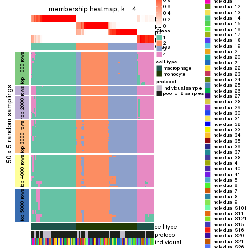</p>

</div>
<div id='tab-CV-mclust-membership-heatmap-4'>
<pre><code class="r">membership_heatmap(res, k = 5)
</code></pre>

<p></p>

</div>
<div id='tab-CV-mclust-membership-heatmap-5'>
<pre><code class="r">membership_heatmap(res, k = 6)
</code></pre>

<p>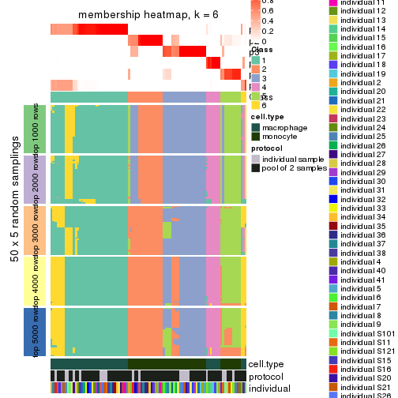</p>

</div>
</div>

As soon as we have had the classes for columns, we can look for signatures
which are significantly different between classes which can be candidate marks
for certain classes. Following are the heatmaps for signatures.


Signature heatmaps where rows are scaled:


<script>
$( function() {
	$( '#tabs-CV-mclust-get-signatures' ).tabs();
} );
</script>
<div id='tabs-CV-mclust-get-signatures'>
<ul>
<li><a href='#tab-CV-mclust-get-signatures-1'>k = 2</a></li>
<li><a href='#tab-CV-mclust-get-signatures-2'>k = 3</a></li>
<li><a href='#tab-CV-mclust-get-signatures-3'>k = 4</a></li>
<li><a href='#tab-CV-mclust-get-signatures-4'>k = 5</a></li>
<li><a href='#tab-CV-mclust-get-signatures-5'>k = 6</a></li>
</ul>
<div id='tab-CV-mclust-get-signatures-1'>
<pre><code class="r">get_signatures(res, k = 2)
</code></pre>

<p></p>

</div>
<div id='tab-CV-mclust-get-signatures-2'>
<pre><code class="r">get_signatures(res, k = 3)
</code></pre>

<p></p>

</div>
<div id='tab-CV-mclust-get-signatures-3'>
<pre><code class="r">get_signatures(res, k = 4)
</code></pre>

<p></p>

</div>
<div id='tab-CV-mclust-get-signatures-4'>
<pre><code class="r">get_signatures(res, k = 5)
</code></pre>

<p></p>

</div>
<div id='tab-CV-mclust-get-signatures-5'>
<pre><code class="r">get_signatures(res, k = 6)
</code></pre>

<p></p>

</div>
</div>


Signature heatmaps where rows are not scaled:


<script>
$( function() {
	$( '#tabs-CV-mclust-get-signatures-no-scale' ).tabs();
} );
</script>
<div id='tabs-CV-mclust-get-signatures-no-scale'>
<ul>
<li><a href='#tab-CV-mclust-get-signatures-no-scale-1'>k = 2</a></li>
<li><a href='#tab-CV-mclust-get-signatures-no-scale-2'>k = 3</a></li>
<li><a href='#tab-CV-mclust-get-signatures-no-scale-3'>k = 4</a></li>
<li><a href='#tab-CV-mclust-get-signatures-no-scale-4'>k = 5</a></li>
<li><a href='#tab-CV-mclust-get-signatures-no-scale-5'>k = 6</a></li>
</ul>
<div id='tab-CV-mclust-get-signatures-no-scale-1'>
<pre><code class="r">get_signatures(res, k = 2, scale_rows = FALSE)
</code></pre>

<p></p>

</div>
<div id='tab-CV-mclust-get-signatures-no-scale-2'>
<pre><code class="r">get_signatures(res, k = 3, scale_rows = FALSE)
</code></pre>

<p></p>

</div>
<div id='tab-CV-mclust-get-signatures-no-scale-3'>
<pre><code class="r">get_signatures(res, k = 4, scale_rows = FALSE)
</code></pre>

<p></p>

</div>
<div id='tab-CV-mclust-get-signatures-no-scale-4'>
<pre><code class="r">get_signatures(res, k = 5, scale_rows = FALSE)
</code></pre>

<p></p>

</div>
<div id='tab-CV-mclust-get-signatures-no-scale-5'>
<pre><code class="r">get_signatures(res, k = 6, scale_rows = FALSE)
</code></pre>

<p></p>

</div>
</div>


Compare the overlap of signatures from different k:

```r
compare_signatures(res)
```


`get_signature()` returns a data frame invisibly. TO get the list of signatures, the function
call should be assigned to a variable explicitly. In following code, if `plot` argument is set
to `FALSE`, no heatmap is plotted while only the differential analysis is performed.

```r
# code only for demonstration
tb = get_signature(res, k = ..., plot = FALSE)
```

An example of the output of `tb` is:

```
#>   which_row         fdr    mean_1    mean_2 scaled_mean_1 scaled_mean_2 km
#> 1        38 0.042760348  8.373488  9.131774    -0.5533452     0.5164555  1
#> 2        40 0.018707592  7.106213  8.469186    -0.6173731     0.5762149  1
#> 3        55 0.019134737 10.221463 11.207825    -0.6159697     0.5749050  1
#> 4        59 0.006059896  5.921854  7.869574    -0.6899429     0.6439467  1
#> 5        60 0.018055526  8.928898 10.211722    -0.6204761     0.5791110  1
#> 6        98 0.009384629 15.714769 14.887706     0.6635654    -0.6193277  2
...
```

The columns in `tb` are:

1. `which_row`: row indices corresponding to the input matrix.
2. `fdr`: FDR for the differential test. 
3. `mean_x`: The mean value in group x.
4. `scaled_mean_x`: The mean value in group x after rows are scaled.
5. `km`: Row groups if k-means clustering is applied to rows.


UMAP plot which shows how samples are separated.


<script>
$( function() {
	$( '#tabs-CV-mclust-dimension-reduction' ).tabs();
} );
</script>
<div id='tabs-CV-mclust-dimension-reduction'>
<ul>
<li><a href='#tab-CV-mclust-dimension-reduction-1'>k = 2</a></li>
<li><a href='#tab-CV-mclust-dimension-reduction-2'>k = 3</a></li>
<li><a href='#tab-CV-mclust-dimension-reduction-3'>k = 4</a></li>
<li><a href='#tab-CV-mclust-dimension-reduction-4'>k = 5</a></li>
<li><a href='#tab-CV-mclust-dimension-reduction-5'>k = 6</a></li>
</ul>
<div id='tab-CV-mclust-dimension-reduction-1'>
<pre><code class="r">dimension_reduction(res, k = 2, method = &quot;UMAP&quot;)
</code></pre>

<p></p>

</div>
<div id='tab-CV-mclust-dimension-reduction-2'>
<pre><code class="r">dimension_reduction(res, k = 3, method = &quot;UMAP&quot;)
</code></pre>

<p></p>

</div>
<div id='tab-CV-mclust-dimension-reduction-3'>
<pre><code class="r">dimension_reduction(res, k = 4, method = &quot;UMAP&quot;)
</code></pre>

<p></p>

</div>
<div id='tab-CV-mclust-dimension-reduction-4'>
<pre><code class="r">dimension_reduction(res, k = 5, method = &quot;UMAP&quot;)
</code></pre>

<p></p>

</div>
<div id='tab-CV-mclust-dimension-reduction-5'>
<pre><code class="r">dimension_reduction(res, k = 6, method = &quot;UMAP&quot;)
</code></pre>

<p>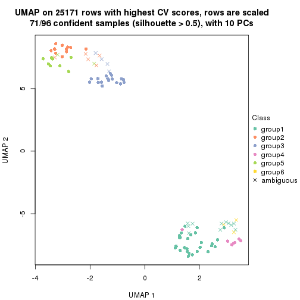</p>

</div>
</div>


Following heatmap shows how subgroups are split when increasing `k`:

```r
collect_classes(res)
```


Test correlation between subgroups and known annotations. If the known
annotation is numeric, one-way ANOVA test is applied, and if the known
annotation is discrete, chi-squared contingency table test is applied.

```r
test_to_known_factors(res)
```

```
#>            n cell.type(p) protocol(p) individual(p) k
#> CV:mclust 96     8.49e-22       1.000         1.000 2
#> CV:mclust 92     1.05e-20       0.793         1.000 3
#> CV:mclust 89     3.59e-19       0.217         0.994 4
#> CV:mclust 70     2.27e-14       0.211         0.858 5
#> CV:mclust 71     1.40e-14       0.705         0.861 6
```


If matrix rows can be associated to genes, consider to use `functional_enrichment(res,
...)` to perform function enrichment for the signature genes. See [this vignette](http://bioconductor.org/packages/devel/bioc/vignettes/cola/inst/doc/functional_enrichment.html) for more detailed explanations.


 

---------------------------------------------------


### CV:NMF**


The object with results only for a single top-value method and a single partition method 
can be extracted as:

```r
res = res_list["CV", "NMF"]
# you can also extract it by
# res = res_list["CV:NMF"]
```

A summary of `res` and all the functions that can be applied to it:

```r
res
```

```
#> A 'ConsensusPartition' object with k = 2, 3, 4, 5, 6.
#>   On a matrix with 25171 rows and 96 columns.
#>   Top rows (1000, 2000, 3000, 4000, 5000) are extracted by 'CV' method.
#>   Subgroups are detected by 'NMF' method.
#>   Performed in total 1250 partitions by row resampling.
#>   Best k for subgroups seems to be 2.
#> 
#> Following methods can be applied to this 'ConsensusPartition' object:
#>  [1] "cola_report"             "collect_classes"         "collect_plots"          
#>  [4] "collect_stats"           "colnames"                "compare_signatures"     
#>  [7] "consensus_heatmap"       "dimension_reduction"     "functional_enrichment"  
#> [10] "get_anno_col"            "get_anno"                "get_classes"            
#> [13] "get_consensus"           "get_matrix"              "get_membership"         
#> [16] "get_param"               "get_signatures"          "get_stats"              
#> [19] "is_best_k"               "is_stable_k"             "membership_heatmap"     
#> [22] "ncol"                    "nrow"                    "plot_ecdf"              
#> [25] "rownames"                "select_partition_number" "show"                   
#> [28] "suggest_best_k"          "test_to_known_factors"
```

`collect_plots()` function collects all the plots made from `res` for all `k` (number of partitions)
into one single page to provide an easy and fast comparison between different `k`.

```r
collect_plots(res)
```


The plots are:

- The first row: a plot of the ECDF (empirical cumulative distribution
  function) curves of the consensus matrix for each `k` and the heatmap of
  predicted classes for each `k`.
- The second row: heatmaps of the consensus matrix for each `k`.
- The third row: heatmaps of the membership matrix for each `k`.
- The fouth row: heatmaps of the signatures for each `k`.

All the plots in panels can be made by individual functions and they are
plotted later in this section.

`select_partition_number()` produces several plots showing different
statistics for choosing "optimized" `k`. There are following statistics:

- ECDF curves of the consensus matrix for each `k`;
- 1-PAC. [The PAC
  score](https://en.wikipedia.org/wiki/Consensus_clustering#Over-interpretation_potential_of_consensus_clustering)
  measures the proportion of the ambiguous subgrouping.
- Mean silhouette score.
- Concordance. The mean probability of fiting the consensus class ids in all
  partitions.
- Area increased. Denote $A_k$ as the area under the ECDF curve for current
  `k`, the area increased is defined as $A_k - A_{k-1}$.
- Rand index. The percent of pairs of samples that are both in a same cluster
  or both are not in a same cluster in the partition of k and k-1.
- Jaccard index. The ratio of pairs of samples are both in a same cluster in
  the partition of k and k-1 and the pairs of samples are both in a same
  cluster in the partition k or k-1.

The detailed explanations of these statistics can be found in [the _cola_
vignette](http://bioconductor.org/packages/devel/bioc/vignettes/cola/inst/doc/cola.html#toc_13).

Generally speaking, lower PAC score, higher mean silhouette score or higher
concordance corresponds to better partition. Rand index and Jaccard index
measure how similar the current partition is compared to partition with `k-1`.
If they are too similar, we won't accept `k` is better than `k-1`.

```r
select_partition_number(res)
```


The numeric values for all these statistics can be obtained by `get_stats()`.

```r
get_stats(res)
```

```
#>   k 1-PAC mean_silhouette concordance area_increased  Rand Jaccard
#> 2 2 1.000           0.978       0.991         0.5057 0.495   0.495
#> 3 3 0.811           0.855       0.926         0.2722 0.858   0.716
#> 4 4 0.778           0.785       0.877         0.0895 0.893   0.719
#> 5 5 0.621           0.543       0.756         0.0873 0.928   0.775
#> 6 6 0.653           0.580       0.751         0.0583 0.895   0.651
```

`suggest_best_k()` suggests the best $k$ based on these statistics. The rules are as follows:

- All $k$ with Jaccard index larger than 0.95 are removed because increasing
  $k$ does not provide enough extra information. If all $k$ are removed, it is
  marked as no subgroup is detected.
- For all $k$ with 1-PAC score larger than 0.9, the maximal $k$ is taken as
  the best $k$, and other $k$ are marked as optional $k$.
- If it does not fit the second rule. The $k$ with the maximal vote of the
  highest 1-PAC score, highest mean silhouette, and highest concordance is
  taken as the best $k$.

```r
suggest_best_k(res)
```

```
#> [1] 2
```


Following shows the table of the partitions (You need to click the **show/hide
code output** link to see it). The membership matrix (columns with name `p*`)
is inferred by
[`clue::cl_consensus()`](https://www.rdocumentation.org/link/cl_consensus?package=clue)
function with the `SE` method. Basically the value in the membership matrix
represents the probability to belong to a certain group. The finall class
label for an item is determined with the group with highest probability it
belongs to.

In `get_classes()` function, the entropy is calculated from the membership
matrix and the silhouette score is calculated from the consensus matrix.


<script>
$( function() {
	$( '#tabs-CV-NMF-get-classes' ).tabs();
} );
</script>
<div id='tabs-CV-NMF-get-classes'>
<ul>
<li><a href='#tab-CV-NMF-get-classes-1'>k = 2</a></li>
<li><a href='#tab-CV-NMF-get-classes-2'>k = 3</a></li>
<li><a href='#tab-CV-NMF-get-classes-3'>k = 4</a></li>
<li><a href='#tab-CV-NMF-get-classes-4'>k = 5</a></li>
<li><a href='#tab-CV-NMF-get-classes-5'>k = 6</a></li>
</ul>

<div id='tab-CV-NMF-get-classes-1'>
<p><a id='tab-CV-NMF-get-classes-1-a' style='color:#0366d6' href='#'>show/hide code output</a></p>
<pre><code class="r">cbind(get_classes(res, k = 2), get_membership(res, k = 2))
</code></pre>

<pre><code>#&gt;           class entropy silhouette    p1    p2
#&gt; GSM257886     1  0.0000      0.993 1.000 0.000
#&gt; GSM257888     1  0.0000      0.993 1.000 0.000
#&gt; GSM257890     1  0.0000      0.993 1.000 0.000
#&gt; GSM257892     1  0.9209      0.490 0.664 0.336
#&gt; GSM257894     1  0.0000      0.993 1.000 0.000
#&gt; GSM257896     1  0.0000      0.993 1.000 0.000
#&gt; GSM257898     1  0.0000      0.993 1.000 0.000
#&gt; GSM257900     1  0.0000      0.993 1.000 0.000
#&gt; GSM257902     1  0.0000      0.993 1.000 0.000
#&gt; GSM257904     1  0.0000      0.993 1.000 0.000
#&gt; GSM257906     1  0.0000      0.993 1.000 0.000
#&gt; GSM257908     1  0.0000      0.993 1.000 0.000
#&gt; GSM257910     1  0.0000      0.993 1.000 0.000
#&gt; GSM257912     1  0.0000      0.993 1.000 0.000
#&gt; GSM257914     1  0.0000      0.993 1.000 0.000
#&gt; GSM257917     1  0.0000      0.993 1.000 0.000
#&gt; GSM257919     1  0.0000      0.993 1.000 0.000
#&gt; GSM257921     1  0.0000      0.993 1.000 0.000
#&gt; GSM257923     1  0.0000      0.993 1.000 0.000
#&gt; GSM257925     1  0.0000      0.993 1.000 0.000
#&gt; GSM257927     1  0.0000      0.993 1.000 0.000
#&gt; GSM257929     1  0.0000      0.993 1.000 0.000
#&gt; GSM257937     1  0.0000      0.993 1.000 0.000
#&gt; GSM257939     1  0.0000      0.993 1.000 0.000
#&gt; GSM257941     1  0.0000      0.993 1.000 0.000
#&gt; GSM257943     1  0.0000      0.993 1.000 0.000
#&gt; GSM257945     1  0.0000      0.993 1.000 0.000
#&gt; GSM257947     1  0.0000      0.993 1.000 0.000
#&gt; GSM257949     1  0.0000      0.993 1.000 0.000
#&gt; GSM257951     1  0.0000      0.993 1.000 0.000
#&gt; GSM257953     1  0.0000      0.993 1.000 0.000
#&gt; GSM257955     1  0.0000      0.993 1.000 0.000
#&gt; GSM257958     1  0.0000      0.993 1.000 0.000
#&gt; GSM257960     1  0.0000      0.993 1.000 0.000
#&gt; GSM257962     1  0.0000      0.993 1.000 0.000
#&gt; GSM257964     1  0.0000      0.993 1.000 0.000
#&gt; GSM257966     1  0.0000      0.993 1.000 0.000
#&gt; GSM257968     1  0.0000      0.993 1.000 0.000
#&gt; GSM257970     1  0.0000      0.993 1.000 0.000
#&gt; GSM257972     1  0.0000      0.993 1.000 0.000
#&gt; GSM257977     1  0.0000      0.993 1.000 0.000
#&gt; GSM257982     1  0.0000      0.993 1.000 0.000
#&gt; GSM257984     1  0.0000      0.993 1.000 0.000
#&gt; GSM257986     1  0.0000      0.993 1.000 0.000
#&gt; GSM257990     1  0.0000      0.993 1.000 0.000
#&gt; GSM257992     1  0.0000      0.993 1.000 0.000
#&gt; GSM257996     1  0.0000      0.993 1.000 0.000
#&gt; GSM258006     1  0.0000      0.993 1.000 0.000
#&gt; GSM257887     2  0.0000      0.988 0.000 1.000
#&gt; GSM257889     2  0.0000      0.988 0.000 1.000
#&gt; GSM257891     2  0.0000      0.988 0.000 1.000
#&gt; GSM257893     2  0.0000      0.988 0.000 1.000
#&gt; GSM257895     2  0.0000      0.988 0.000 1.000
#&gt; GSM257897     2  0.9129      0.518 0.328 0.672
#&gt; GSM257899     2  0.1633      0.966 0.024 0.976
#&gt; GSM257901     2  0.0000      0.988 0.000 1.000
#&gt; GSM257903     2  0.0000      0.988 0.000 1.000
#&gt; GSM257905     2  0.0000      0.988 0.000 1.000
#&gt; GSM257907     2  0.0000      0.988 0.000 1.000
#&gt; GSM257909     2  0.0000      0.988 0.000 1.000
#&gt; GSM257911     2  0.0000      0.988 0.000 1.000
#&gt; GSM257913     2  0.0000      0.988 0.000 1.000
#&gt; GSM257916     2  0.0000      0.988 0.000 1.000
#&gt; GSM257918     2  0.0000      0.988 0.000 1.000
#&gt; GSM257920     2  0.0000      0.988 0.000 1.000
#&gt; GSM257922     2  0.7056      0.762 0.192 0.808
#&gt; GSM257924     2  0.0000      0.988 0.000 1.000
#&gt; GSM257926     2  0.0000      0.988 0.000 1.000
#&gt; GSM257928     2  0.0376      0.985 0.004 0.996
#&gt; GSM257930     2  0.0000      0.988 0.000 1.000
#&gt; GSM257938     2  0.0000      0.988 0.000 1.000
#&gt; GSM257940     2  0.0000      0.988 0.000 1.000
#&gt; GSM257942     2  0.0000      0.988 0.000 1.000
#&gt; GSM257944     2  0.0000      0.988 0.000 1.000
#&gt; GSM257946     2  0.0000      0.988 0.000 1.000
#&gt; GSM257948     2  0.0000      0.988 0.000 1.000
#&gt; GSM257950     2  0.0000      0.988 0.000 1.000
#&gt; GSM257952     2  0.0000      0.988 0.000 1.000
#&gt; GSM257954     2  0.0000      0.988 0.000 1.000
#&gt; GSM257956     2  0.0000      0.988 0.000 1.000
#&gt; GSM257959     2  0.0000      0.988 0.000 1.000
#&gt; GSM257961     2  0.0000      0.988 0.000 1.000
#&gt; GSM257963     2  0.0000      0.988 0.000 1.000
#&gt; GSM257965     2  0.0000      0.988 0.000 1.000
#&gt; GSM257967     2  0.0000      0.988 0.000 1.000
#&gt; GSM257969     2  0.0000      0.988 0.000 1.000
#&gt; GSM257971     2  0.0000      0.988 0.000 1.000
#&gt; GSM257973     2  0.0000      0.988 0.000 1.000
#&gt; GSM257981     2  0.0000      0.988 0.000 1.000
#&gt; GSM257983     2  0.0000      0.988 0.000 1.000
#&gt; GSM257985     2  0.0000      0.988 0.000 1.000
#&gt; GSM257988     2  0.0000      0.988 0.000 1.000
#&gt; GSM257991     2  0.0000      0.988 0.000 1.000
#&gt; GSM257993     2  0.0000      0.988 0.000 1.000
#&gt; GSM257994     2  0.0000      0.988 0.000 1.000
#&gt; GSM257989     2  0.0000      0.988 0.000 1.000
</code></pre>

<script>
$('#tab-CV-NMF-get-classes-1-a').parent().next().next().hide();
$('#tab-CV-NMF-get-classes-1-a').click(function(){
  $('#tab-CV-NMF-get-classes-1-a').parent().next().next().toggle();
  return(false);
});
</script>
</div>

<div id='tab-CV-NMF-get-classes-2'>
<p><a id='tab-CV-NMF-get-classes-2-a' style='color:#0366d6' href='#'>show/hide code output</a></p>
<pre><code class="r">cbind(get_classes(res, k = 3), get_membership(res, k = 3))
</code></pre>

<pre><code>#&gt;           class entropy silhouette    p1    p2    p3
#&gt; GSM257886     1  0.0000      0.942 1.000 0.000 0.000
#&gt; GSM257888     1  0.6026      0.396 0.624 0.376 0.000
#&gt; GSM257890     1  0.5678      0.534 0.684 0.316 0.000
#&gt; GSM257892     2  0.6373      0.264 0.408 0.588 0.004
#&gt; GSM257894     1  0.0237      0.941 0.996 0.004 0.000
#&gt; GSM257896     1  0.0592      0.939 0.988 0.012 0.000
#&gt; GSM257898     1  0.2590      0.898 0.924 0.004 0.072
#&gt; GSM257900     1  0.0237      0.942 0.996 0.000 0.004
#&gt; GSM257902     1  0.0000      0.942 1.000 0.000 0.000
#&gt; GSM257904     1  0.0747      0.936 0.984 0.000 0.016
#&gt; GSM257906     1  0.2878      0.878 0.904 0.000 0.096
#&gt; GSM257908     1  0.0592      0.938 0.988 0.012 0.000
#&gt; GSM257910     1  0.0661      0.938 0.988 0.004 0.008
#&gt; GSM257912     1  0.5219      0.739 0.788 0.016 0.196
#&gt; GSM257914     1  0.4063      0.840 0.868 0.020 0.112
#&gt; GSM257917     1  0.2590      0.892 0.924 0.004 0.072
#&gt; GSM257919     1  0.6541      0.544 0.672 0.024 0.304
#&gt; GSM257921     1  0.0000      0.942 1.000 0.000 0.000
#&gt; GSM257923     1  0.0237      0.942 0.996 0.000 0.004
#&gt; GSM257925     1  0.0237      0.942 0.996 0.000 0.004
#&gt; GSM257927     1  0.0237      0.942 0.996 0.000 0.004
#&gt; GSM257929     1  0.0237      0.942 0.996 0.000 0.004
#&gt; GSM257937     1  0.0892      0.933 0.980 0.020 0.000
#&gt; GSM257939     1  0.0475      0.942 0.992 0.004 0.004
#&gt; GSM257941     1  0.0424      0.941 0.992 0.000 0.008
#&gt; GSM257943     1  0.0592      0.940 0.988 0.000 0.012
#&gt; GSM257945     1  0.0237      0.942 0.996 0.000 0.004
#&gt; GSM257947     1  0.0237      0.942 0.996 0.000 0.004
#&gt; GSM257949     1  0.0475      0.942 0.992 0.004 0.004
#&gt; GSM257951     1  0.0237      0.942 0.996 0.000 0.004
#&gt; GSM257953     1  0.0475      0.942 0.992 0.004 0.004
#&gt; GSM257955     1  0.0237      0.942 0.996 0.000 0.004
#&gt; GSM257958     1  0.0000      0.942 1.000 0.000 0.000
#&gt; GSM257960     1  0.0000      0.942 1.000 0.000 0.000
#&gt; GSM257962     1  0.0000      0.942 1.000 0.000 0.000
#&gt; GSM257964     1  0.0000      0.942 1.000 0.000 0.000
#&gt; GSM257966     1  0.6280      0.164 0.540 0.460 0.000
#&gt; GSM257968     1  0.4842      0.706 0.776 0.224 0.000
#&gt; GSM257970     1  0.0237      0.942 0.996 0.000 0.004
#&gt; GSM257972     1  0.0237      0.942 0.996 0.000 0.004
#&gt; GSM257977     1  0.1753      0.913 0.952 0.048 0.000
#&gt; GSM257982     1  0.0661      0.940 0.988 0.008 0.004
#&gt; GSM257984     1  0.0000      0.942 1.000 0.000 0.000
#&gt; GSM257986     1  0.0000      0.942 1.000 0.000 0.000
#&gt; GSM257990     1  0.0000      0.942 1.000 0.000 0.000
#&gt; GSM257992     1  0.2096      0.913 0.944 0.004 0.052
#&gt; GSM257996     1  0.0000      0.942 1.000 0.000 0.000
#&gt; GSM258006     1  0.0747      0.938 0.984 0.000 0.016
#&gt; GSM257887     2  0.0424      0.896 0.000 0.992 0.008
#&gt; GSM257889     3  0.1163      0.898 0.000 0.028 0.972
#&gt; GSM257891     3  0.0747      0.907 0.000 0.016 0.984
#&gt; GSM257893     3  0.3116      0.852 0.000 0.108 0.892
#&gt; GSM257895     2  0.1031      0.893 0.000 0.976 0.024
#&gt; GSM257897     3  0.2878      0.862 0.000 0.096 0.904
#&gt; GSM257899     3  0.2711      0.868 0.000 0.088 0.912
#&gt; GSM257901     3  0.2448      0.901 0.000 0.076 0.924
#&gt; GSM257903     2  0.3816      0.805 0.000 0.852 0.148
#&gt; GSM257905     2  0.1163      0.894 0.000 0.972 0.028
#&gt; GSM257907     3  0.1753      0.913 0.000 0.048 0.952
#&gt; GSM257909     2  0.0747      0.896 0.000 0.984 0.016
#&gt; GSM257911     3  0.6260      0.131 0.000 0.448 0.552
#&gt; GSM257913     3  0.3267      0.874 0.000 0.116 0.884
#&gt; GSM257916     2  0.0747      0.898 0.000 0.984 0.016
#&gt; GSM257918     2  0.1289      0.894 0.000 0.968 0.032
#&gt; GSM257920     3  0.1753      0.912 0.000 0.048 0.952
#&gt; GSM257922     3  0.1964      0.888 0.000 0.056 0.944
#&gt; GSM257924     3  0.4291      0.815 0.000 0.180 0.820
#&gt; GSM257926     3  0.2165      0.912 0.000 0.064 0.936
#&gt; GSM257928     2  0.3941      0.818 0.000 0.844 0.156
#&gt; GSM257930     2  0.3116      0.854 0.000 0.892 0.108
#&gt; GSM257938     2  0.1753      0.882 0.000 0.952 0.048
#&gt; GSM257940     3  0.2165      0.907 0.000 0.064 0.936
#&gt; GSM257942     2  0.2796      0.859 0.000 0.908 0.092
#&gt; GSM257944     2  0.2165      0.877 0.000 0.936 0.064
#&gt; GSM257946     3  0.1031      0.908 0.000 0.024 0.976
#&gt; GSM257948     3  0.1860      0.911 0.000 0.052 0.948
#&gt; GSM257950     3  0.1289      0.912 0.000 0.032 0.968
#&gt; GSM257952     2  0.5397      0.635 0.000 0.720 0.280
#&gt; GSM257954     2  0.0237      0.894 0.000 0.996 0.004
#&gt; GSM257956     2  0.0237      0.896 0.000 0.996 0.004
#&gt; GSM257959     2  0.0892      0.896 0.000 0.980 0.020
#&gt; GSM257961     2  0.0592      0.897 0.000 0.988 0.012
#&gt; GSM257963     2  0.0592      0.897 0.000 0.988 0.012
#&gt; GSM257965     2  0.4654      0.739 0.000 0.792 0.208
#&gt; GSM257967     2  0.0592      0.897 0.000 0.988 0.012
#&gt; GSM257969     2  0.0000      0.895 0.000 1.000 0.000
#&gt; GSM257971     2  0.5650      0.612 0.000 0.688 0.312
#&gt; GSM257973     3  0.1643      0.912 0.000 0.044 0.956
#&gt; GSM257981     2  0.5327      0.635 0.000 0.728 0.272
#&gt; GSM257983     3  0.0892      0.908 0.000 0.020 0.980
#&gt; GSM257985     3  0.0892      0.908 0.000 0.020 0.980
#&gt; GSM257988     3  0.1643      0.912 0.000 0.044 0.956
#&gt; GSM257991     3  0.6079      0.446 0.000 0.388 0.612
#&gt; GSM257993     2  0.0424      0.893 0.000 0.992 0.008
#&gt; GSM257994     2  0.2165      0.873 0.000 0.936 0.064
#&gt; GSM257989     3  0.1163      0.911 0.000 0.028 0.972
</code></pre>

<script>
$('#tab-CV-NMF-get-classes-2-a').parent().next().next().hide();
$('#tab-CV-NMF-get-classes-2-a').click(function(){
  $('#tab-CV-NMF-get-classes-2-a').parent().next().next().toggle();
  return(false);
});
</script>
</div>

<div id='tab-CV-NMF-get-classes-3'>
<p><a id='tab-CV-NMF-get-classes-3-a' style='color:#0366d6' href='#'>show/hide code output</a></p>
<pre><code class="r">cbind(get_classes(res, k = 4), get_membership(res, k = 4))
</code></pre>

<pre><code>#&gt;           class entropy silhouette    p1    p2    p3    p4
#&gt; GSM257886     1  0.0524      0.962 0.988 0.000 0.004 0.008
#&gt; GSM257888     1  0.0672      0.961 0.984 0.008 0.000 0.008
#&gt; GSM257890     1  0.0712      0.961 0.984 0.004 0.004 0.008
#&gt; GSM257892     2  0.6212      0.409 0.304 0.624 0.004 0.068
#&gt; GSM257894     1  0.0000      0.963 1.000 0.000 0.000 0.000
#&gt; GSM257896     1  0.0336      0.962 0.992 0.000 0.000 0.008
#&gt; GSM257898     4  0.2593      0.609 0.104 0.000 0.004 0.892
#&gt; GSM257900     1  0.0592      0.961 0.984 0.000 0.000 0.016
#&gt; GSM257902     1  0.0000      0.963 1.000 0.000 0.000 0.000
#&gt; GSM257904     1  0.0336      0.962 0.992 0.000 0.000 0.008
#&gt; GSM257906     4  0.4459      0.577 0.188 0.000 0.032 0.780
#&gt; GSM257908     1  0.0469      0.961 0.988 0.000 0.012 0.000
#&gt; GSM257910     1  0.0336      0.963 0.992 0.000 0.008 0.000
#&gt; GSM257912     1  0.3142      0.836 0.860 0.000 0.132 0.008
#&gt; GSM257914     1  0.3401      0.810 0.840 0.000 0.152 0.008
#&gt; GSM257917     1  0.1151      0.950 0.968 0.000 0.024 0.008
#&gt; GSM257919     1  0.4973      0.484 0.644 0.000 0.348 0.008
#&gt; GSM257921     1  0.0336      0.962 0.992 0.000 0.000 0.008
#&gt; GSM257923     1  0.0336      0.964 0.992 0.000 0.000 0.008
#&gt; GSM257925     1  0.0336      0.964 0.992 0.000 0.000 0.008
#&gt; GSM257927     1  0.0707      0.959 0.980 0.000 0.000 0.020
#&gt; GSM257929     1  0.0469      0.963 0.988 0.000 0.000 0.012
#&gt; GSM257937     1  0.0336      0.962 0.992 0.000 0.000 0.008
#&gt; GSM257939     1  0.2469      0.879 0.892 0.000 0.000 0.108
#&gt; GSM257941     1  0.2868      0.823 0.864 0.000 0.000 0.136
#&gt; GSM257943     4  0.4955      0.242 0.444 0.000 0.000 0.556
#&gt; GSM257945     1  0.1022      0.949 0.968 0.000 0.000 0.032
#&gt; GSM257947     1  0.0469      0.963 0.988 0.000 0.000 0.012
#&gt; GSM257949     1  0.0817      0.958 0.976 0.000 0.000 0.024
#&gt; GSM257951     1  0.0707      0.960 0.980 0.000 0.000 0.020
#&gt; GSM257953     1  0.2081      0.905 0.916 0.000 0.000 0.084
#&gt; GSM257955     1  0.0336      0.964 0.992 0.000 0.000 0.008
#&gt; GSM257958     1  0.0336      0.964 0.992 0.000 0.000 0.008
#&gt; GSM257960     1  0.0000      0.963 1.000 0.000 0.000 0.000
#&gt; GSM257962     1  0.0469      0.963 0.988 0.000 0.000 0.012
#&gt; GSM257964     1  0.0188      0.963 0.996 0.000 0.000 0.004
#&gt; GSM257966     1  0.1297      0.946 0.964 0.016 0.020 0.000
#&gt; GSM257968     1  0.0524      0.963 0.988 0.008 0.000 0.004
#&gt; GSM257970     1  0.0469      0.963 0.988 0.000 0.000 0.012
#&gt; GSM257972     1  0.0592      0.961 0.984 0.000 0.000 0.016
#&gt; GSM257977     1  0.0524      0.962 0.988 0.004 0.000 0.008
#&gt; GSM257982     1  0.0336      0.963 0.992 0.000 0.000 0.008
#&gt; GSM257984     1  0.0000      0.963 1.000 0.000 0.000 0.000
#&gt; GSM257986     1  0.0000      0.963 1.000 0.000 0.000 0.000
#&gt; GSM257990     1  0.0336      0.964 0.992 0.000 0.000 0.008
#&gt; GSM257992     4  0.4277      0.528 0.280 0.000 0.000 0.720
#&gt; GSM257996     1  0.0000      0.963 1.000 0.000 0.000 0.000
#&gt; GSM258006     4  0.4998      0.116 0.488 0.000 0.000 0.512
#&gt; GSM257887     2  0.0336      0.882 0.000 0.992 0.000 0.008
#&gt; GSM257889     4  0.2973      0.496 0.000 0.000 0.144 0.856
#&gt; GSM257891     3  0.4877      0.636 0.000 0.000 0.592 0.408
#&gt; GSM257893     4  0.3320      0.579 0.000 0.068 0.056 0.876
#&gt; GSM257895     2  0.0592      0.881 0.000 0.984 0.000 0.016
#&gt; GSM257897     4  0.1557      0.588 0.000 0.000 0.056 0.944
#&gt; GSM257899     4  0.2011      0.576 0.000 0.000 0.080 0.920
#&gt; GSM257901     3  0.2814      0.754 0.000 0.000 0.868 0.132
#&gt; GSM257903     3  0.4406      0.364 0.000 0.300 0.700 0.000
#&gt; GSM257905     2  0.1305      0.881 0.000 0.960 0.036 0.004
#&gt; GSM257907     3  0.3975      0.776 0.000 0.000 0.760 0.240
#&gt; GSM257909     2  0.2081      0.868 0.000 0.916 0.084 0.000
#&gt; GSM257911     3  0.7064      0.499 0.000 0.280 0.556 0.164
#&gt; GSM257913     3  0.3836      0.761 0.000 0.016 0.816 0.168
#&gt; GSM257916     2  0.0817      0.883 0.000 0.976 0.024 0.000
#&gt; GSM257918     2  0.3444      0.809 0.000 0.816 0.184 0.000
#&gt; GSM257920     3  0.3610      0.776 0.000 0.000 0.800 0.200
#&gt; GSM257922     4  0.2408      0.555 0.000 0.000 0.104 0.896
#&gt; GSM257924     3  0.5950      0.670 0.000 0.156 0.696 0.148
#&gt; GSM257926     3  0.4331      0.762 0.000 0.000 0.712 0.288
#&gt; GSM257928     4  0.4511      0.429 0.000 0.268 0.008 0.724
#&gt; GSM257930     2  0.4391      0.661 0.000 0.740 0.008 0.252
#&gt; GSM257938     2  0.1867      0.855 0.000 0.928 0.000 0.072
#&gt; GSM257940     3  0.2216      0.726 0.000 0.000 0.908 0.092
#&gt; GSM257942     3  0.4730      0.118 0.000 0.364 0.636 0.000
#&gt; GSM257944     2  0.4522      0.675 0.000 0.680 0.320 0.000
#&gt; GSM257946     3  0.4888      0.634 0.000 0.000 0.588 0.412
#&gt; GSM257948     3  0.3837      0.778 0.000 0.000 0.776 0.224
#&gt; GSM257950     3  0.4406      0.754 0.000 0.000 0.700 0.300
#&gt; GSM257952     2  0.6547      0.488 0.000 0.616 0.260 0.124
#&gt; GSM257954     2  0.0469      0.882 0.000 0.988 0.000 0.012
#&gt; GSM257956     2  0.0336      0.882 0.000 0.992 0.000 0.008
#&gt; GSM257959     2  0.1940      0.871 0.000 0.924 0.076 0.000
#&gt; GSM257961     2  0.1022      0.882 0.000 0.968 0.032 0.000
#&gt; GSM257963     2  0.0817      0.883 0.000 0.976 0.024 0.000
#&gt; GSM257965     2  0.4644      0.757 0.000 0.748 0.228 0.024
#&gt; GSM257967     2  0.1557      0.877 0.000 0.944 0.056 0.000
#&gt; GSM257969     2  0.0188      0.882 0.000 0.996 0.000 0.004
#&gt; GSM257971     4  0.2742      0.573 0.000 0.024 0.076 0.900
#&gt; GSM257973     3  0.4193      0.769 0.000 0.000 0.732 0.268
#&gt; GSM257981     2  0.3647      0.811 0.000 0.852 0.108 0.040
#&gt; GSM257983     4  0.4790     -0.176 0.000 0.000 0.380 0.620
#&gt; GSM257985     3  0.4679      0.708 0.000 0.000 0.648 0.352
#&gt; GSM257988     3  0.3688      0.777 0.000 0.000 0.792 0.208
#&gt; GSM257991     3  0.2149      0.597 0.000 0.088 0.912 0.000
#&gt; GSM257993     2  0.0921      0.877 0.000 0.972 0.000 0.028
#&gt; GSM257994     2  0.2469      0.832 0.000 0.892 0.000 0.108
#&gt; GSM257989     3  0.4304      0.763 0.000 0.000 0.716 0.284
</code></pre>

<script>
$('#tab-CV-NMF-get-classes-3-a').parent().next().next().hide();
$('#tab-CV-NMF-get-classes-3-a').click(function(){
  $('#tab-CV-NMF-get-classes-3-a').parent().next().next().toggle();
  return(false);
});
</script>
</div>

<div id='tab-CV-NMF-get-classes-4'>
<p><a id='tab-CV-NMF-get-classes-4-a' style='color:#0366d6' href='#'>show/hide code output</a></p>
<pre><code class="r">cbind(get_classes(res, k = 5), get_membership(res, k = 5))
</code></pre>

<pre><code>#&gt;           class entropy silhouette    p1    p2    p3    p4    p5
#&gt; GSM257886     4  0.6875   -0.12379 0.344 0.004 0.000 0.392 0.260
#&gt; GSM257888     1  0.4985    0.65965 0.748 0.032 0.000 0.144 0.076
#&gt; GSM257890     1  0.7188    0.10211 0.424 0.024 0.000 0.320 0.232
#&gt; GSM257892     4  0.7359    0.14504 0.020 0.316 0.004 0.392 0.268
#&gt; GSM257894     1  0.1012    0.79681 0.968 0.000 0.000 0.020 0.012
#&gt; GSM257896     1  0.3700    0.73474 0.832 0.008 0.000 0.076 0.084
#&gt; GSM257898     5  0.4616    0.52051 0.028 0.000 0.152 0.052 0.768
#&gt; GSM257900     1  0.4840    0.62057 0.724 0.000 0.000 0.152 0.124
#&gt; GSM257902     1  0.0000    0.79859 1.000 0.000 0.000 0.000 0.000
#&gt; GSM257904     1  0.7621    0.26667 0.512 0.000 0.140 0.176 0.172
#&gt; GSM257906     5  0.7909    0.26068 0.084 0.000 0.316 0.220 0.380
#&gt; GSM257908     1  0.2890    0.73607 0.836 0.004 0.000 0.160 0.000
#&gt; GSM257910     1  0.0703    0.79926 0.976 0.000 0.000 0.024 0.000
#&gt; GSM257912     1  0.4567    0.51536 0.628 0.000 0.012 0.356 0.004
#&gt; GSM257914     1  0.4444    0.50413 0.624 0.000 0.012 0.364 0.000
#&gt; GSM257917     1  0.3743    0.73216 0.824 0.000 0.004 0.076 0.096
#&gt; GSM257919     1  0.5238    0.22272 0.480 0.000 0.044 0.476 0.000
#&gt; GSM257921     1  0.3267    0.73690 0.844 0.000 0.000 0.044 0.112
#&gt; GSM257923     1  0.3333    0.70977 0.788 0.000 0.000 0.004 0.208
#&gt; GSM257925     1  0.3661    0.64256 0.724 0.000 0.000 0.000 0.276
#&gt; GSM257927     1  0.2813    0.74569 0.832 0.000 0.000 0.000 0.168
#&gt; GSM257929     1  0.3913    0.57878 0.676 0.000 0.000 0.000 0.324
#&gt; GSM257937     1  0.1469    0.79117 0.948 0.000 0.000 0.036 0.016
#&gt; GSM257939     1  0.4321    0.45865 0.600 0.004 0.000 0.000 0.396
#&gt; GSM257941     1  0.4193    0.53009 0.684 0.000 0.000 0.012 0.304
#&gt; GSM257943     5  0.5892    0.07238 0.372 0.000 0.000 0.108 0.520
#&gt; GSM257945     1  0.3003    0.72416 0.812 0.000 0.000 0.000 0.188
#&gt; GSM257947     1  0.2852    0.74325 0.828 0.000 0.000 0.000 0.172
#&gt; GSM257949     1  0.1121    0.79780 0.956 0.000 0.000 0.000 0.044
#&gt; GSM257951     1  0.2424    0.76724 0.868 0.000 0.000 0.000 0.132
#&gt; GSM257953     1  0.2179    0.77569 0.888 0.000 0.000 0.000 0.112
#&gt; GSM257955     1  0.1410    0.79477 0.940 0.000 0.000 0.000 0.060
#&gt; GSM257958     1  0.0703    0.79838 0.976 0.000 0.000 0.000 0.024
#&gt; GSM257960     1  0.0000    0.79859 1.000 0.000 0.000 0.000 0.000
#&gt; GSM257962     1  0.0703    0.79838 0.976 0.000 0.000 0.000 0.024
#&gt; GSM257964     1  0.0290    0.79874 0.992 0.000 0.000 0.000 0.008
#&gt; GSM257966     1  0.1787    0.79338 0.936 0.016 0.000 0.044 0.004
#&gt; GSM257968     1  0.0324    0.79882 0.992 0.004 0.000 0.004 0.000
#&gt; GSM257970     1  0.2605    0.75659 0.852 0.000 0.000 0.000 0.148
#&gt; GSM257972     1  0.0162    0.79960 0.996 0.000 0.000 0.000 0.004
#&gt; GSM257977     1  0.6249    0.35766 0.556 0.016 0.000 0.312 0.116
#&gt; GSM257982     1  0.0613    0.79924 0.984 0.004 0.000 0.004 0.008
#&gt; GSM257984     1  0.0162    0.79842 0.996 0.000 0.000 0.004 0.000
#&gt; GSM257986     1  0.0162    0.79877 0.996 0.000 0.000 0.000 0.004
#&gt; GSM257990     1  0.2280    0.77608 0.880 0.000 0.000 0.000 0.120
#&gt; GSM257992     5  0.3904    0.47903 0.116 0.000 0.020 0.044 0.820
#&gt; GSM257996     1  0.0162    0.79842 0.996 0.000 0.000 0.004 0.000
#&gt; GSM258006     1  0.6320   -0.00411 0.440 0.000 0.000 0.156 0.404
#&gt; GSM257887     2  0.1444    0.75642 0.000 0.948 0.000 0.040 0.012
#&gt; GSM257889     3  0.4425    0.09911 0.000 0.000 0.600 0.008 0.392
#&gt; GSM257891     3  0.2139    0.64900 0.000 0.000 0.916 0.032 0.052
#&gt; GSM257893     5  0.4380    0.39419 0.004 0.016 0.292 0.000 0.688
#&gt; GSM257895     2  0.4184    0.53836 0.000 0.764 0.004 0.192 0.040
#&gt; GSM257897     5  0.4397    0.23599 0.000 0.000 0.432 0.004 0.564
#&gt; GSM257899     3  0.5071   -0.07479 0.000 0.000 0.540 0.036 0.424
#&gt; GSM257901     3  0.4586    0.51244 0.000 0.004 0.644 0.336 0.016
#&gt; GSM257903     4  0.6066    0.12457 0.000 0.368 0.128 0.504 0.000
#&gt; GSM257905     2  0.3759    0.60011 0.000 0.764 0.016 0.220 0.000
#&gt; GSM257907     3  0.2813    0.64225 0.000 0.000 0.832 0.168 0.000
#&gt; GSM257909     2  0.3266    0.66566 0.000 0.796 0.004 0.200 0.000
#&gt; GSM257911     3  0.7362    0.05730 0.000 0.240 0.400 0.328 0.032
#&gt; GSM257913     3  0.5616    0.31077 0.000 0.084 0.552 0.364 0.000
#&gt; GSM257916     2  0.1329    0.76283 0.000 0.956 0.004 0.032 0.008
#&gt; GSM257918     2  0.3492    0.65887 0.000 0.796 0.016 0.188 0.000
#&gt; GSM257920     3  0.3715    0.57722 0.000 0.004 0.736 0.260 0.000
#&gt; GSM257922     5  0.5450    0.14678 0.000 0.000 0.444 0.060 0.496
#&gt; GSM257924     3  0.5602    0.41740 0.000 0.096 0.636 0.260 0.008
#&gt; GSM257926     3  0.3639    0.62237 0.000 0.020 0.808 0.164 0.008
#&gt; GSM257928     5  0.4270    0.22381 0.000 0.320 0.012 0.000 0.668
#&gt; GSM257930     2  0.4478    0.43280 0.000 0.628 0.008 0.004 0.360
#&gt; GSM257938     2  0.2446    0.73931 0.000 0.900 0.000 0.044 0.056
#&gt; GSM257940     3  0.4234    0.59198 0.000 0.004 0.724 0.252 0.020
#&gt; GSM257942     4  0.5884    0.15966 0.000 0.352 0.112 0.536 0.000
#&gt; GSM257944     4  0.5243    0.03371 0.000 0.412 0.048 0.540 0.000
#&gt; GSM257946     3  0.1990    0.65648 0.000 0.004 0.920 0.008 0.068
#&gt; GSM257948     3  0.3734    0.59621 0.000 0.004 0.752 0.240 0.004
#&gt; GSM257950     3  0.1877    0.67620 0.000 0.000 0.924 0.064 0.012
#&gt; GSM257952     4  0.7901    0.15744 0.000 0.292 0.200 0.412 0.096
#&gt; GSM257954     2  0.0693    0.76951 0.000 0.980 0.000 0.008 0.012
#&gt; GSM257956     2  0.0579    0.76941 0.000 0.984 0.000 0.008 0.008
#&gt; GSM257959     2  0.3491    0.63102 0.000 0.768 0.004 0.228 0.000
#&gt; GSM257961     2  0.1831    0.75407 0.000 0.920 0.004 0.076 0.000
#&gt; GSM257963     2  0.2488    0.72878 0.000 0.872 0.004 0.124 0.000
#&gt; GSM257965     4  0.7099    0.08511 0.000 0.380 0.088 0.452 0.080
#&gt; GSM257967     2  0.2338    0.73883 0.000 0.884 0.004 0.112 0.000
#&gt; GSM257969     2  0.0404    0.76951 0.000 0.988 0.000 0.012 0.000
#&gt; GSM257971     3  0.6942    0.19417 0.000 0.052 0.468 0.372 0.108
#&gt; GSM257973     3  0.1205    0.67874 0.000 0.004 0.956 0.040 0.000
#&gt; GSM257981     2  0.7146   -0.09976 0.000 0.448 0.188 0.332 0.032
#&gt; GSM257983     3  0.2654    0.63659 0.000 0.000 0.888 0.048 0.064
#&gt; GSM257985     3  0.2171    0.65248 0.000 0.000 0.912 0.064 0.024
#&gt; GSM257988     3  0.1851    0.67572 0.000 0.000 0.912 0.088 0.000
#&gt; GSM257991     4  0.4982   -0.14822 0.000 0.032 0.412 0.556 0.000
#&gt; GSM257993     2  0.1568    0.75755 0.000 0.944 0.000 0.036 0.020
#&gt; GSM257994     2  0.3596    0.63416 0.000 0.776 0.000 0.012 0.212
#&gt; GSM257989     3  0.0566    0.67225 0.000 0.000 0.984 0.004 0.012
</code></pre>

<script>
$('#tab-CV-NMF-get-classes-4-a').parent().next().next().hide();
$('#tab-CV-NMF-get-classes-4-a').click(function(){
  $('#tab-CV-NMF-get-classes-4-a').parent().next().next().toggle();
  return(false);
});
</script>
</div>

<div id='tab-CV-NMF-get-classes-5'>
<p><a id='tab-CV-NMF-get-classes-5-a' style='color:#0366d6' href='#'>show/hide code output</a></p>
<pre><code class="r">cbind(get_classes(res, k = 6), get_membership(res, k = 6))
</code></pre>

<pre><code>#&gt;           class entropy silhouette    p1    p2    p3    p4    p5    p6
#&gt; GSM257886     6  0.4932     0.5845 0.040 0.000 0.000 0.080 0.176 0.704
#&gt; GSM257888     1  0.5052     0.5674 0.648 0.020 0.000 0.012 0.276 0.044
#&gt; GSM257890     6  0.6711     0.4598 0.140 0.028 0.000 0.032 0.320 0.480
#&gt; GSM257892     6  0.5523     0.3303 0.000 0.116 0.000 0.008 0.340 0.536
#&gt; GSM257894     1  0.1949     0.7802 0.904 0.000 0.000 0.004 0.088 0.004
#&gt; GSM257896     1  0.3664     0.7165 0.792 0.012 0.000 0.004 0.164 0.028
#&gt; GSM257898     6  0.3736     0.5354 0.016 0.000 0.028 0.028 0.108 0.820
#&gt; GSM257900     6  0.4724     0.4249 0.332 0.000 0.000 0.012 0.040 0.616
#&gt; GSM257902     1  0.0767     0.7900 0.976 0.000 0.000 0.004 0.008 0.012
#&gt; GSM257904     6  0.5513     0.5798 0.176 0.000 0.048 0.076 0.020 0.680
#&gt; GSM257906     6  0.4194     0.6116 0.032 0.000 0.080 0.052 0.032 0.804
#&gt; GSM257908     1  0.4470     0.5212 0.656 0.012 0.000 0.300 0.000 0.032
#&gt; GSM257910     1  0.4216     0.6266 0.720 0.000 0.000 0.228 0.012 0.040
#&gt; GSM257912     4  0.5095     0.5392 0.164 0.000 0.012 0.700 0.020 0.104
#&gt; GSM257914     4  0.4644     0.5532 0.160 0.000 0.004 0.728 0.016 0.092
#&gt; GSM257917     4  0.6133     0.0976 0.172 0.000 0.000 0.480 0.020 0.328
#&gt; GSM257919     4  0.4697     0.5769 0.136 0.004 0.016 0.752 0.020 0.072
#&gt; GSM257921     1  0.5577     0.2979 0.568 0.000 0.000 0.088 0.028 0.316
#&gt; GSM257923     1  0.2009     0.7855 0.908 0.000 0.000 0.024 0.068 0.000
#&gt; GSM257925     1  0.2864     0.7690 0.860 0.000 0.000 0.028 0.100 0.012
#&gt; GSM257927     1  0.5924     0.4346 0.580 0.000 0.000 0.032 0.208 0.180
#&gt; GSM257929     1  0.3140     0.7589 0.840 0.000 0.000 0.028 0.116 0.016
#&gt; GSM257937     1  0.4671     0.6210 0.720 0.000 0.000 0.084 0.024 0.172
#&gt; GSM257939     1  0.3993     0.7256 0.788 0.000 0.000 0.060 0.124 0.028
#&gt; GSM257941     6  0.5027     0.5601 0.160 0.000 0.000 0.016 0.144 0.680
#&gt; GSM257943     6  0.2190     0.6303 0.060 0.000 0.000 0.000 0.040 0.900
#&gt; GSM257945     1  0.6276     0.2883 0.524 0.000 0.000 0.036 0.224 0.216
#&gt; GSM257947     1  0.2046     0.7857 0.908 0.000 0.000 0.032 0.060 0.000
#&gt; GSM257949     1  0.1562     0.7946 0.940 0.000 0.000 0.032 0.024 0.004
#&gt; GSM257951     1  0.2136     0.7852 0.904 0.000 0.000 0.048 0.048 0.000
#&gt; GSM257953     1  0.2216     0.7898 0.908 0.000 0.000 0.052 0.024 0.016
#&gt; GSM257955     1  0.1564     0.7917 0.936 0.000 0.000 0.040 0.024 0.000
#&gt; GSM257958     1  0.0779     0.7938 0.976 0.000 0.000 0.008 0.008 0.008
#&gt; GSM257960     1  0.4265     0.5373 0.680 0.000 0.000 0.020 0.016 0.284
#&gt; GSM257962     1  0.5008     0.6066 0.692 0.000 0.000 0.024 0.128 0.156
#&gt; GSM257964     1  0.0000     0.7914 1.000 0.000 0.000 0.000 0.000 0.000
#&gt; GSM257966     1  0.3395     0.7559 0.852 0.032 0.000 0.064 0.016 0.036
#&gt; GSM257968     1  0.1490     0.7903 0.948 0.016 0.000 0.004 0.024 0.008
#&gt; GSM257970     1  0.2250     0.7823 0.896 0.000 0.000 0.040 0.064 0.000
#&gt; GSM257972     1  0.0806     0.7902 0.972 0.000 0.000 0.000 0.020 0.008
#&gt; GSM257977     1  0.5179     0.4992 0.612 0.036 0.000 0.000 0.304 0.048
#&gt; GSM257982     1  0.1644     0.7852 0.920 0.004 0.000 0.000 0.076 0.000
#&gt; GSM257984     1  0.0984     0.7892 0.968 0.000 0.000 0.008 0.012 0.012
#&gt; GSM257986     1  0.0653     0.7915 0.980 0.000 0.000 0.004 0.012 0.004
#&gt; GSM257990     1  0.5417     0.5322 0.628 0.000 0.000 0.024 0.232 0.116
#&gt; GSM257992     6  0.2338     0.5831 0.016 0.000 0.004 0.012 0.068 0.900
#&gt; GSM257996     1  0.5518     0.3480 0.564 0.000 0.000 0.116 0.012 0.308
#&gt; GSM258006     6  0.3350     0.6389 0.156 0.000 0.004 0.012 0.016 0.812
#&gt; GSM257887     2  0.1814     0.7390 0.000 0.900 0.000 0.000 0.100 0.000
#&gt; GSM257889     3  0.3536     0.6633 0.000 0.000 0.832 0.052 0.072 0.044
#&gt; GSM257891     3  0.0972     0.7340 0.000 0.000 0.964 0.000 0.008 0.028
#&gt; GSM257893     5  0.7536     0.0466 0.008 0.024 0.336 0.104 0.408 0.120
#&gt; GSM257895     2  0.3861     0.4146 0.000 0.672 0.004 0.000 0.316 0.008
#&gt; GSM257897     3  0.7253    -0.2138 0.008 0.000 0.364 0.092 0.360 0.176
#&gt; GSM257899     3  0.6459     0.1581 0.000 0.000 0.536 0.072 0.164 0.228
#&gt; GSM257901     3  0.2342     0.7051 0.000 0.000 0.888 0.020 0.088 0.004
#&gt; GSM257903     4  0.4161     0.2982 0.000 0.372 0.008 0.612 0.008 0.000
#&gt; GSM257905     2  0.3141     0.6894 0.000 0.788 0.000 0.200 0.012 0.000
#&gt; GSM257907     3  0.1434     0.7349 0.000 0.000 0.948 0.020 0.024 0.008
#&gt; GSM257909     2  0.2941     0.6833 0.000 0.780 0.000 0.220 0.000 0.000
#&gt; GSM257911     3  0.4348     0.5731 0.000 0.064 0.748 0.024 0.164 0.000
#&gt; GSM257913     3  0.4255     0.5782 0.000 0.064 0.732 0.196 0.008 0.000
#&gt; GSM257916     2  0.1643     0.7600 0.000 0.924 0.000 0.008 0.068 0.000
#&gt; GSM257918     2  0.2265     0.7728 0.000 0.896 0.004 0.076 0.024 0.000
#&gt; GSM257920     3  0.3438     0.6280 0.000 0.000 0.764 0.220 0.008 0.008
#&gt; GSM257922     6  0.7311    -0.2960 0.000 0.000 0.268 0.100 0.296 0.336
#&gt; GSM257924     3  0.6710     0.1722 0.000 0.124 0.484 0.304 0.084 0.004
#&gt; GSM257926     3  0.2278     0.7247 0.000 0.008 0.908 0.052 0.024 0.008
#&gt; GSM257928     5  0.7614     0.0894 0.012 0.276 0.004 0.104 0.388 0.216
#&gt; GSM257930     2  0.5847     0.3840 0.000 0.604 0.000 0.068 0.236 0.092
#&gt; GSM257938     2  0.4489     0.6172 0.000 0.744 0.000 0.024 0.140 0.092
#&gt; GSM257940     3  0.4440     0.6173 0.000 0.000 0.752 0.132 0.088 0.028
#&gt; GSM257942     4  0.3714     0.3773 0.000 0.340 0.004 0.656 0.000 0.000
#&gt; GSM257944     4  0.3330     0.4593 0.000 0.284 0.000 0.716 0.000 0.000
#&gt; GSM257946     3  0.1649     0.7266 0.000 0.000 0.936 0.008 0.040 0.016
#&gt; GSM257948     3  0.2558     0.6974 0.000 0.000 0.840 0.156 0.004 0.000
#&gt; GSM257950     3  0.3533     0.5931 0.000 0.000 0.748 0.236 0.004 0.012
#&gt; GSM257952     5  0.7138     0.3329 0.000 0.256 0.260 0.008 0.412 0.064
#&gt; GSM257954     2  0.0935     0.7723 0.000 0.964 0.000 0.004 0.032 0.000
#&gt; GSM257956     2  0.0547     0.7743 0.000 0.980 0.000 0.000 0.020 0.000
#&gt; GSM257959     2  0.3742     0.4389 0.000 0.648 0.000 0.348 0.004 0.000
#&gt; GSM257961     2  0.2092     0.7582 0.000 0.876 0.000 0.124 0.000 0.000
#&gt; GSM257963     2  0.2491     0.7358 0.000 0.836 0.000 0.164 0.000 0.000
#&gt; GSM257965     5  0.6917     0.3333 0.000 0.304 0.272 0.024 0.384 0.016
#&gt; GSM257967     2  0.1765     0.7680 0.000 0.904 0.000 0.096 0.000 0.000
#&gt; GSM257969     2  0.0820     0.7773 0.000 0.972 0.000 0.016 0.012 0.000
#&gt; GSM257971     3  0.6268     0.0713 0.000 0.052 0.504 0.004 0.336 0.104
#&gt; GSM257973     3  0.0551     0.7373 0.000 0.000 0.984 0.008 0.004 0.004
#&gt; GSM257981     3  0.4482     0.5096 0.000 0.096 0.712 0.000 0.188 0.004
#&gt; GSM257983     3  0.0508     0.7363 0.000 0.000 0.984 0.004 0.000 0.012
#&gt; GSM257985     3  0.0291     0.7367 0.000 0.000 0.992 0.000 0.004 0.004
#&gt; GSM257988     3  0.0458     0.7378 0.000 0.000 0.984 0.016 0.000 0.000
#&gt; GSM257991     4  0.4229     0.4447 0.000 0.048 0.192 0.744 0.012 0.004
#&gt; GSM257993     2  0.2113     0.7397 0.000 0.896 0.000 0.004 0.092 0.008
#&gt; GSM257994     2  0.5371     0.5295 0.000 0.676 0.000 0.056 0.152 0.116
#&gt; GSM257989     3  0.0551     0.7381 0.000 0.000 0.984 0.008 0.004 0.004
</code></pre>

<script>
$('#tab-CV-NMF-get-classes-5-a').parent().next().next().hide();
$('#tab-CV-NMF-get-classes-5-a').click(function(){
  $('#tab-CV-NMF-get-classes-5-a').parent().next().next().toggle();
  return(false);
});
</script>
</div>
</div>

Heatmaps for the consensus matrix. It visualizes the probability of two
samples to be in a same group.


<script>
$( function() {
	$( '#tabs-CV-NMF-consensus-heatmap' ).tabs();
} );
</script>
<div id='tabs-CV-NMF-consensus-heatmap'>
<ul>
<li><a href='#tab-CV-NMF-consensus-heatmap-1'>k = 2</a></li>
<li><a href='#tab-CV-NMF-consensus-heatmap-2'>k = 3</a></li>
<li><a href='#tab-CV-NMF-consensus-heatmap-3'>k = 4</a></li>
<li><a href='#tab-CV-NMF-consensus-heatmap-4'>k = 5</a></li>
<li><a href='#tab-CV-NMF-consensus-heatmap-5'>k = 6</a></li>
</ul>
<div id='tab-CV-NMF-consensus-heatmap-1'>
<pre><code class="r">consensus_heatmap(res, k = 2)
</code></pre>

<p></p>

</div>
<div id='tab-CV-NMF-consensus-heatmap-2'>
<pre><code class="r">consensus_heatmap(res, k = 3)
</code></pre>

<p></p>

</div>
<div id='tab-CV-NMF-consensus-heatmap-3'>
<pre><code class="r">consensus_heatmap(res, k = 4)
</code></pre>

<p></p>

</div>
<div id='tab-CV-NMF-consensus-heatmap-4'>
<pre><code class="r">consensus_heatmap(res, k = 5)
</code></pre>

<p></p>

</div>
<div id='tab-CV-NMF-consensus-heatmap-5'>
<pre><code class="r">consensus_heatmap(res, k = 6)
</code></pre>

<p></p>

</div>
</div>

Heatmaps for the membership of samples in all partitions to see how consistent they are:


<script>
$( function() {
	$( '#tabs-CV-NMF-membership-heatmap' ).tabs();
} );
</script>
<div id='tabs-CV-NMF-membership-heatmap'>
<ul>
<li><a href='#tab-CV-NMF-membership-heatmap-1'>k = 2</a></li>
<li><a href='#tab-CV-NMF-membership-heatmap-2'>k = 3</a></li>
<li><a href='#tab-CV-NMF-membership-heatmap-3'>k = 4</a></li>
<li><a href='#tab-CV-NMF-membership-heatmap-4'>k = 5</a></li>
<li><a href='#tab-CV-NMF-membership-heatmap-5'>k = 6</a></li>
</ul>
<div id='tab-CV-NMF-membership-heatmap-1'>
<pre><code class="r">membership_heatmap(res, k = 2)
</code></pre>

<p></p>

</div>
<div id='tab-CV-NMF-membership-heatmap-2'>
<pre><code class="r">membership_heatmap(res, k = 3)
</code></pre>

<p></p>

</div>
<div id='tab-CV-NMF-membership-heatmap-3'>
<pre><code class="r">membership_heatmap(res, k = 4)
</code></pre>

<p></p>

</div>
<div id='tab-CV-NMF-membership-heatmap-4'>
<pre><code class="r">membership_heatmap(res, k = 5)
</code></pre>

<p></p>

</div>
<div id='tab-CV-NMF-membership-heatmap-5'>
<pre><code class="r">membership_heatmap(res, k = 6)
</code></pre>

<p></p>

</div>
</div>

As soon as we have had the classes for columns, we can look for signatures
which are significantly different between classes which can be candidate marks
for certain classes. Following are the heatmaps for signatures.


Signature heatmaps where rows are scaled:


<script>
$( function() {
	$( '#tabs-CV-NMF-get-signatures' ).tabs();
} );
</script>
<div id='tabs-CV-NMF-get-signatures'>
<ul>
<li><a href='#tab-CV-NMF-get-signatures-1'>k = 2</a></li>
<li><a href='#tab-CV-NMF-get-signatures-2'>k = 3</a></li>
<li><a href='#tab-CV-NMF-get-signatures-3'>k = 4</a></li>
<li><a href='#tab-CV-NMF-get-signatures-4'>k = 5</a></li>
<li><a href='#tab-CV-NMF-get-signatures-5'>k = 6</a></li>
</ul>
<div id='tab-CV-NMF-get-signatures-1'>
<pre><code class="r">get_signatures(res, k = 2)
</code></pre>

<p></p>

</div>
<div id='tab-CV-NMF-get-signatures-2'>
<pre><code class="r">get_signatures(res, k = 3)
</code></pre>

<p></p>

</div>
<div id='tab-CV-NMF-get-signatures-3'>
<pre><code class="r">get_signatures(res, k = 4)
</code></pre>

<p></p>

</div>
<div id='tab-CV-NMF-get-signatures-4'>
<pre><code class="r">get_signatures(res, k = 5)
</code></pre>

<p>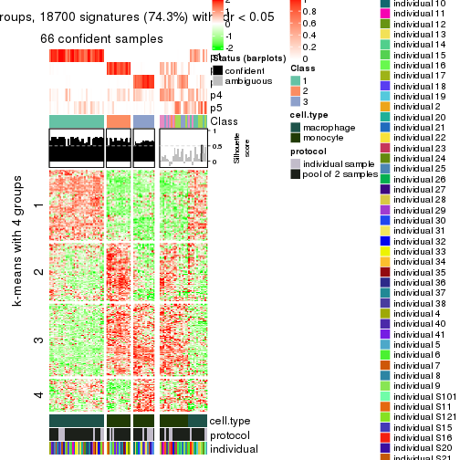</p>

</div>
<div id='tab-CV-NMF-get-signatures-5'>
<pre><code class="r">get_signatures(res, k = 6)
</code></pre>

<p></p>

</div>
</div>


Signature heatmaps where rows are not scaled:


<script>
$( function() {
	$( '#tabs-CV-NMF-get-signatures-no-scale' ).tabs();
} );
</script>
<div id='tabs-CV-NMF-get-signatures-no-scale'>
<ul>
<li><a href='#tab-CV-NMF-get-signatures-no-scale-1'>k = 2</a></li>
<li><a href='#tab-CV-NMF-get-signatures-no-scale-2'>k = 3</a></li>
<li><a href='#tab-CV-NMF-get-signatures-no-scale-3'>k = 4</a></li>
<li><a href='#tab-CV-NMF-get-signatures-no-scale-4'>k = 5</a></li>
<li><a href='#tab-CV-NMF-get-signatures-no-scale-5'>k = 6</a></li>
</ul>
<div id='tab-CV-NMF-get-signatures-no-scale-1'>
<pre><code class="r">get_signatures(res, k = 2, scale_rows = FALSE)
</code></pre>

<p></p>

</div>
<div id='tab-CV-NMF-get-signatures-no-scale-2'>
<pre><code class="r">get_signatures(res, k = 3, scale_rows = FALSE)
</code></pre>

<p></p>

</div>
<div id='tab-CV-NMF-get-signatures-no-scale-3'>
<pre><code class="r">get_signatures(res, k = 4, scale_rows = FALSE)
</code></pre>

<p></p>

</div>
<div id='tab-CV-NMF-get-signatures-no-scale-4'>
<pre><code class="r">get_signatures(res, k = 5, scale_rows = FALSE)
</code></pre>

<p></p>

</div>
<div id='tab-CV-NMF-get-signatures-no-scale-5'>
<pre><code class="r">get_signatures(res, k = 6, scale_rows = FALSE)
</code></pre>

<p></p>

</div>
</div>


Compare the overlap of signatures from different k:

```r
compare_signatures(res)
```


`get_signature()` returns a data frame invisibly. TO get the list of signatures, the function
call should be assigned to a variable explicitly. In following code, if `plot` argument is set
to `FALSE`, no heatmap is plotted while only the differential analysis is performed.

```r
# code only for demonstration
tb = get_signature(res, k = ..., plot = FALSE)
```

An example of the output of `tb` is:

```
#>   which_row         fdr    mean_1    mean_2 scaled_mean_1 scaled_mean_2 km
#> 1        38 0.042760348  8.373488  9.131774    -0.5533452     0.5164555  1
#> 2        40 0.018707592  7.106213  8.469186    -0.6173731     0.5762149  1
#> 3        55 0.019134737 10.221463 11.207825    -0.6159697     0.5749050  1
#> 4        59 0.006059896  5.921854  7.869574    -0.6899429     0.6439467  1
#> 5        60 0.018055526  8.928898 10.211722    -0.6204761     0.5791110  1
#> 6        98 0.009384629 15.714769 14.887706     0.6635654    -0.6193277  2
...
```

The columns in `tb` are:

1. `which_row`: row indices corresponding to the input matrix.
2. `fdr`: FDR for the differential test. 
3. `mean_x`: The mean value in group x.
4. `scaled_mean_x`: The mean value in group x after rows are scaled.
5. `km`: Row groups if k-means clustering is applied to rows.


UMAP plot which shows how samples are separated.


<script>
$( function() {
	$( '#tabs-CV-NMF-dimension-reduction' ).tabs();
} );
</script>
<div id='tabs-CV-NMF-dimension-reduction'>
<ul>
<li><a href='#tab-CV-NMF-dimension-reduction-1'>k = 2</a></li>
<li><a href='#tab-CV-NMF-dimension-reduction-2'>k = 3</a></li>
<li><a href='#tab-CV-NMF-dimension-reduction-3'>k = 4</a></li>
<li><a href='#tab-CV-NMF-dimension-reduction-4'>k = 5</a></li>
<li><a href='#tab-CV-NMF-dimension-reduction-5'>k = 6</a></li>
</ul>
<div id='tab-CV-NMF-dimension-reduction-1'>
<pre><code class="r">dimension_reduction(res, k = 2, method = &quot;UMAP&quot;)
</code></pre>

<p></p>

</div>
<div id='tab-CV-NMF-dimension-reduction-2'>
<pre><code class="r">dimension_reduction(res, k = 3, method = &quot;UMAP&quot;)
</code></pre>

<p></p>

</div>
<div id='tab-CV-NMF-dimension-reduction-3'>
<pre><code class="r">dimension_reduction(res, k = 4, method = &quot;UMAP&quot;)
</code></pre>

<p></p>

</div>
<div id='tab-CV-NMF-dimension-reduction-4'>
<pre><code class="r">dimension_reduction(res, k = 5, method = &quot;UMAP&quot;)
</code></pre>

<p></p>

</div>
<div id='tab-CV-NMF-dimension-reduction-5'>
<pre><code class="r">dimension_reduction(res, k = 6, method = &quot;UMAP&quot;)
</code></pre>

<p></p>

</div>
</div>


Following heatmap shows how subgroups are split when increasing `k`:

```r
collect_classes(res)
```


Test correlation between subgroups and known annotations. If the known
annotation is numeric, one-way ANOVA test is applied, and if the known
annotation is discrete, chi-squared contingency table test is applied.

```r
test_to_known_factors(res)
```

```
#>         n cell.type(p) protocol(p) individual(p) k
#> CV:NMF 95     1.41e-21       1.000         1.000 2
#> CV:NMF 91     1.74e-20       0.772         1.000 3
#> CV:NMF 85     1.06e-16       0.667         0.942 4
#> CV:NMF 67     1.87e-14       0.415         0.489 5
#> CV:NMF 71     1.40e-14       0.615         0.955 6
```


If matrix rows can be associated to genes, consider to use `functional_enrichment(res,
...)` to perform function enrichment for the signature genes. See [this vignette](http://bioconductor.org/packages/devel/bioc/vignettes/cola/inst/doc/functional_enrichment.html) for more detailed explanations.


 

---------------------------------------------------


### MAD:hclust**


The object with results only for a single top-value method and a single partition method 
can be extracted as:

```r
res = res_list["MAD", "hclust"]
# you can also extract it by
# res = res_list["MAD:hclust"]
```

A summary of `res` and all the functions that can be applied to it:

```r
res
```

```
#> A 'ConsensusPartition' object with k = 2, 3, 4, 5, 6.
#>   On a matrix with 25171 rows and 96 columns.
#>   Top rows (1000, 2000, 3000, 4000, 5000) are extracted by 'MAD' method.
#>   Subgroups are detected by 'hclust' method.
#>   Performed in total 1250 partitions by row resampling.
#>   Best k for subgroups seems to be 2.
#> 
#> Following methods can be applied to this 'ConsensusPartition' object:
#>  [1] "cola_report"             "collect_classes"         "collect_plots"          
#>  [4] "collect_stats"           "colnames"                "compare_signatures"     
#>  [7] "consensus_heatmap"       "dimension_reduction"     "functional_enrichment"  
#> [10] "get_anno_col"            "get_anno"                "get_classes"            
#> [13] "get_consensus"           "get_matrix"              "get_membership"         
#> [16] "get_param"               "get_signatures"          "get_stats"              
#> [19] "is_best_k"               "is_stable_k"             "membership_heatmap"     
#> [22] "ncol"                    "nrow"                    "plot_ecdf"              
#> [25] "rownames"                "select_partition_number" "show"                   
#> [28] "suggest_best_k"          "test_to_known_factors"
```

`collect_plots()` function collects all the plots made from `res` for all `k` (number of partitions)
into one single page to provide an easy and fast comparison between different `k`.

```r
collect_plots(res)
```

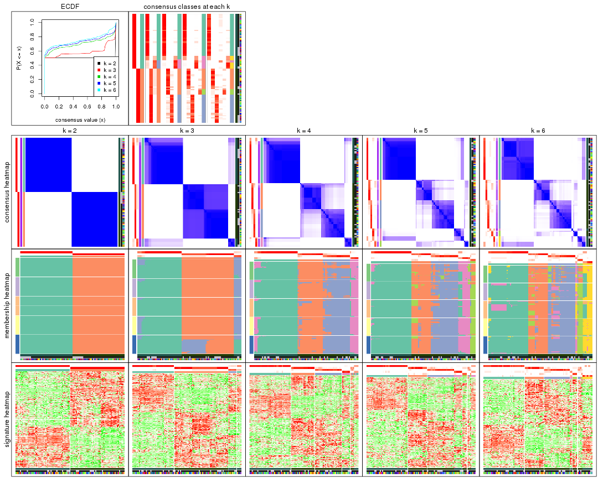

The plots are:

- The first row: a plot of the ECDF (empirical cumulative distribution
  function) curves of the consensus matrix for each `k` and the heatmap of
  predicted classes for each `k`.
- The second row: heatmaps of the consensus matrix for each `k`.
- The third row: heatmaps of the membership matrix for each `k`.
- The fouth row: heatmaps of the signatures for each `k`.

All the plots in panels can be made by individual functions and they are
plotted later in this section.

`select_partition_number()` produces several plots showing different
statistics for choosing "optimized" `k`. There are following statistics:

- ECDF curves of the consensus matrix for each `k`;
- 1-PAC. [The PAC
  score](https://en.wikipedia.org/wiki/Consensus_clustering#Over-interpretation_potential_of_consensus_clustering)
  measures the proportion of the ambiguous subgrouping.
- Mean silhouette score.
- Concordance. The mean probability of fiting the consensus class ids in all
  partitions.
- Area increased. Denote $A_k$ as the area under the ECDF curve for current
  `k`, the area increased is defined as $A_k - A_{k-1}$.
- Rand index. The percent of pairs of samples that are both in a same cluster
  or both are not in a same cluster in the partition of k and k-1.
- Jaccard index. The ratio of pairs of samples are both in a same cluster in
  the partition of k and k-1 and the pairs of samples are both in a same
  cluster in the partition k or k-1.

The detailed explanations of these statistics can be found in [the _cola_
vignette](http://bioconductor.org/packages/devel/bioc/vignettes/cola/inst/doc/cola.html#toc_13).

Generally speaking, lower PAC score, higher mean silhouette score or higher
concordance corresponds to better partition. Rand index and Jaccard index
measure how similar the current partition is compared to partition with `k-1`.
If they are too similar, we won't accept `k` is better than `k-1`.

```r
select_partition_number(res)
```


The numeric values for all these statistics can be obtained by `get_stats()`.

```r
get_stats(res)
```

```
#>   k 1-PAC mean_silhouette concordance area_increased  Rand Jaccard
#> 2 2 1.000           1.000       1.000         0.5058 0.495   0.495
#> 3 3 0.787           0.905       0.932         0.1611 0.937   0.873
#> 4 4 0.824           0.842       0.921         0.1914 0.864   0.685
#> 5 5 0.835           0.808       0.901         0.0400 0.951   0.838
#> 6 6 0.750           0.758       0.868         0.0328 0.996   0.985
```

`suggest_best_k()` suggests the best $k$ based on these statistics. The rules are as follows:

- All $k$ with Jaccard index larger than 0.95 are removed because increasing
  $k$ does not provide enough extra information. If all $k$ are removed, it is
  marked as no subgroup is detected.
- For all $k$ with 1-PAC score larger than 0.9, the maximal $k$ is taken as
  the best $k$, and other $k$ are marked as optional $k$.
- If it does not fit the second rule. The $k$ with the maximal vote of the
  highest 1-PAC score, highest mean silhouette, and highest concordance is
  taken as the best $k$.

```r
suggest_best_k(res)
```

```
#> [1] 2
```


Following shows the table of the partitions (You need to click the **show/hide
code output** link to see it). The membership matrix (columns with name `p*`)
is inferred by
[`clue::cl_consensus()`](https://www.rdocumentation.org/link/cl_consensus?package=clue)
function with the `SE` method. Basically the value in the membership matrix
represents the probability to belong to a certain group. The finall class
label for an item is determined with the group with highest probability it
belongs to.

In `get_classes()` function, the entropy is calculated from the membership
matrix and the silhouette score is calculated from the consensus matrix.


<script>
$( function() {
	$( '#tabs-MAD-hclust-get-classes' ).tabs();
} );
</script>
<div id='tabs-MAD-hclust-get-classes'>
<ul>
<li><a href='#tab-MAD-hclust-get-classes-1'>k = 2</a></li>
<li><a href='#tab-MAD-hclust-get-classes-2'>k = 3</a></li>
<li><a href='#tab-MAD-hclust-get-classes-3'>k = 4</a></li>
<li><a href='#tab-MAD-hclust-get-classes-4'>k = 5</a></li>
<li><a href='#tab-MAD-hclust-get-classes-5'>k = 6</a></li>
</ul>

<div id='tab-MAD-hclust-get-classes-1'>
<p><a id='tab-MAD-hclust-get-classes-1-a' style='color:#0366d6' href='#'>show/hide code output</a></p>
<pre><code class="r">cbind(get_classes(res, k = 2), get_membership(res, k = 2))
</code></pre>

<pre><code>#&gt;           class entropy silhouette p1 p2
#&gt; GSM257886     1       0          1  1  0
#&gt; GSM257888     1       0          1  1  0
#&gt; GSM257890     1       0          1  1  0
#&gt; GSM257892     1       0          1  1  0
#&gt; GSM257894     1       0          1  1  0
#&gt; GSM257896     1       0          1  1  0
#&gt; GSM257898     1       0          1  1  0
#&gt; GSM257900     1       0          1  1  0
#&gt; GSM257902     1       0          1  1  0
#&gt; GSM257904     1       0          1  1  0
#&gt; GSM257906     1       0          1  1  0
#&gt; GSM257908     1       0          1  1  0
#&gt; GSM257910     1       0          1  1  0
#&gt; GSM257912     1       0          1  1  0
#&gt; GSM257914     1       0          1  1  0
#&gt; GSM257917     1       0          1  1  0
#&gt; GSM257919     1       0          1  1  0
#&gt; GSM257921     1       0          1  1  0
#&gt; GSM257923     1       0          1  1  0
#&gt; GSM257925     1       0          1  1  0
#&gt; GSM257927     1       0          1  1  0
#&gt; GSM257929     1       0          1  1  0
#&gt; GSM257937     1       0          1  1  0
#&gt; GSM257939     1       0          1  1  0
#&gt; GSM257941     1       0          1  1  0
#&gt; GSM257943     1       0          1  1  0
#&gt; GSM257945     1       0          1  1  0
#&gt; GSM257947     1       0          1  1  0
#&gt; GSM257949     1       0          1  1  0
#&gt; GSM257951     1       0          1  1  0
#&gt; GSM257953     1       0          1  1  0
#&gt; GSM257955     1       0          1  1  0
#&gt; GSM257958     1       0          1  1  0
#&gt; GSM257960     1       0          1  1  0
#&gt; GSM257962     1       0          1  1  0
#&gt; GSM257964     1       0          1  1  0
#&gt; GSM257966     1       0          1  1  0
#&gt; GSM257968     1       0          1  1  0
#&gt; GSM257970     1       0          1  1  0
#&gt; GSM257972     1       0          1  1  0
#&gt; GSM257977     1       0          1  1  0
#&gt; GSM257982     1       0          1  1  0
#&gt; GSM257984     1       0          1  1  0
#&gt; GSM257986     1       0          1  1  0
#&gt; GSM257990     1       0          1  1  0
#&gt; GSM257992     1       0          1  1  0
#&gt; GSM257996     1       0          1  1  0
#&gt; GSM258006     1       0          1  1  0
#&gt; GSM257887     2       0          1  0  1
#&gt; GSM257889     2       0          1  0  1
#&gt; GSM257891     2       0          1  0  1
#&gt; GSM257893     2       0          1  0  1
#&gt; GSM257895     2       0          1  0  1
#&gt; GSM257897     2       0          1  0  1
#&gt; GSM257899     2       0          1  0  1
#&gt; GSM257901     2       0          1  0  1
#&gt; GSM257903     2       0          1  0  1
#&gt; GSM257905     2       0          1  0  1
#&gt; GSM257907     2       0          1  0  1
#&gt; GSM257909     2       0          1  0  1
#&gt; GSM257911     2       0          1  0  1
#&gt; GSM257913     2       0          1  0  1
#&gt; GSM257916     2       0          1  0  1
#&gt; GSM257918     2       0          1  0  1
#&gt; GSM257920     2       0          1  0  1
#&gt; GSM257922     2       0          1  0  1
#&gt; GSM257924     2       0          1  0  1
#&gt; GSM257926     2       0          1  0  1
#&gt; GSM257928     2       0          1  0  1
#&gt; GSM257930     2       0          1  0  1
#&gt; GSM257938     2       0          1  0  1
#&gt; GSM257940     2       0          1  0  1
#&gt; GSM257942     2       0          1  0  1
#&gt; GSM257944     2       0          1  0  1
#&gt; GSM257946     2       0          1  0  1
#&gt; GSM257948     2       0          1  0  1
#&gt; GSM257950     2       0          1  0  1
#&gt; GSM257952     2       0          1  0  1
#&gt; GSM257954     2       0          1  0  1
#&gt; GSM257956     2       0          1  0  1
#&gt; GSM257959     2       0          1  0  1
#&gt; GSM257961     2       0          1  0  1
#&gt; GSM257963     2       0          1  0  1
#&gt; GSM257965     2       0          1  0  1
#&gt; GSM257967     2       0          1  0  1
#&gt; GSM257969     2       0          1  0  1
#&gt; GSM257971     2       0          1  0  1
#&gt; GSM257973     2       0          1  0  1
#&gt; GSM257981     2       0          1  0  1
#&gt; GSM257983     2       0          1  0  1
#&gt; GSM257985     2       0          1  0  1
#&gt; GSM257988     2       0          1  0  1
#&gt; GSM257991     2       0          1  0  1
#&gt; GSM257993     2       0          1  0  1
#&gt; GSM257994     2       0          1  0  1
#&gt; GSM257989     2       0          1  0  1
</code></pre>

<script>
$('#tab-MAD-hclust-get-classes-1-a').parent().next().next().hide();
$('#tab-MAD-hclust-get-classes-1-a').click(function(){
  $('#tab-MAD-hclust-get-classes-1-a').parent().next().next().toggle();
  return(false);
});
</script>
</div>

<div id='tab-MAD-hclust-get-classes-2'>
<p><a id='tab-MAD-hclust-get-classes-2-a' style='color:#0366d6' href='#'>show/hide code output</a></p>
<pre><code class="r">cbind(get_classes(res, k = 3), get_membership(res, k = 3))
</code></pre>

<pre><code>#&gt;           class entropy silhouette    p1    p2    p3
#&gt; GSM257886     3  0.3941      0.946 0.156 0.000 0.844
#&gt; GSM257888     1  0.0000      0.941 1.000 0.000 0.000
#&gt; GSM257890     1  0.0237      0.938 0.996 0.000 0.004
#&gt; GSM257892     3  0.3941      0.946 0.156 0.000 0.844
#&gt; GSM257894     1  0.0000      0.941 1.000 0.000 0.000
#&gt; GSM257896     1  0.0000      0.941 1.000 0.000 0.000
#&gt; GSM257898     3  0.4750      0.955 0.216 0.000 0.784
#&gt; GSM257900     1  0.5926      0.314 0.644 0.000 0.356
#&gt; GSM257902     1  0.0000      0.941 1.000 0.000 0.000
#&gt; GSM257904     3  0.4796      0.952 0.220 0.000 0.780
#&gt; GSM257906     3  0.4796      0.952 0.220 0.000 0.780
#&gt; GSM257908     1  0.0000      0.941 1.000 0.000 0.000
#&gt; GSM257910     1  0.0000      0.941 1.000 0.000 0.000
#&gt; GSM257912     1  0.0000      0.941 1.000 0.000 0.000
#&gt; GSM257914     1  0.0000      0.941 1.000 0.000 0.000
#&gt; GSM257917     1  0.0000      0.941 1.000 0.000 0.000
#&gt; GSM257919     1  0.0000      0.941 1.000 0.000 0.000
#&gt; GSM257921     1  0.0424      0.935 0.992 0.000 0.008
#&gt; GSM257923     1  0.0000      0.941 1.000 0.000 0.000
#&gt; GSM257925     1  0.0000      0.941 1.000 0.000 0.000
#&gt; GSM257927     1  0.4178      0.736 0.828 0.000 0.172
#&gt; GSM257929     1  0.0000      0.941 1.000 0.000 0.000
#&gt; GSM257937     1  0.0000      0.941 1.000 0.000 0.000
#&gt; GSM257939     1  0.0000      0.941 1.000 0.000 0.000
#&gt; GSM257941     1  0.5835      0.365 0.660 0.000 0.340
#&gt; GSM257943     1  0.5926      0.314 0.644 0.000 0.356
#&gt; GSM257945     1  0.5810      0.376 0.664 0.000 0.336
#&gt; GSM257947     1  0.0000      0.941 1.000 0.000 0.000
#&gt; GSM257949     1  0.0000      0.941 1.000 0.000 0.000
#&gt; GSM257951     1  0.0000      0.941 1.000 0.000 0.000
#&gt; GSM257953     1  0.0747      0.928 0.984 0.000 0.016
#&gt; GSM257955     1  0.0000      0.941 1.000 0.000 0.000
#&gt; GSM257958     1  0.0000      0.941 1.000 0.000 0.000
#&gt; GSM257960     1  0.3340      0.812 0.880 0.000 0.120
#&gt; GSM257962     1  0.3340      0.812 0.880 0.000 0.120
#&gt; GSM257964     1  0.0000      0.941 1.000 0.000 0.000
#&gt; GSM257966     1  0.0000      0.941 1.000 0.000 0.000
#&gt; GSM257968     1  0.0000      0.941 1.000 0.000 0.000
#&gt; GSM257970     1  0.0000      0.941 1.000 0.000 0.000
#&gt; GSM257972     1  0.0237      0.938 0.996 0.000 0.004
#&gt; GSM257977     1  0.0000      0.941 1.000 0.000 0.000
#&gt; GSM257982     1  0.0000      0.941 1.000 0.000 0.000
#&gt; GSM257984     1  0.0000      0.941 1.000 0.000 0.000
#&gt; GSM257986     1  0.0000      0.941 1.000 0.000 0.000
#&gt; GSM257990     1  0.0237      0.938 0.996 0.000 0.004
#&gt; GSM257992     3  0.4235      0.957 0.176 0.000 0.824
#&gt; GSM257996     1  0.0237      0.938 0.996 0.000 0.004
#&gt; GSM258006     3  0.4504      0.960 0.196 0.000 0.804
#&gt; GSM257887     2  0.3879      0.919 0.000 0.848 0.152
#&gt; GSM257889     2  0.0237      0.934 0.000 0.996 0.004
#&gt; GSM257891     2  0.0237      0.934 0.000 0.996 0.004
#&gt; GSM257893     2  0.0237      0.934 0.000 0.996 0.004
#&gt; GSM257895     2  0.3879      0.919 0.000 0.848 0.152
#&gt; GSM257897     2  0.0237      0.934 0.000 0.996 0.004
#&gt; GSM257899     2  0.0237      0.934 0.000 0.996 0.004
#&gt; GSM257901     2  0.0237      0.934 0.000 0.996 0.004
#&gt; GSM257903     2  0.3816      0.921 0.000 0.852 0.148
#&gt; GSM257905     2  0.3816      0.921 0.000 0.852 0.148
#&gt; GSM257907     2  0.0237      0.934 0.000 0.996 0.004
#&gt; GSM257909     2  0.3816      0.921 0.000 0.852 0.148
#&gt; GSM257911     2  0.0237      0.934 0.000 0.996 0.004
#&gt; GSM257913     2  0.0000      0.934 0.000 1.000 0.000
#&gt; GSM257916     2  0.3686      0.923 0.000 0.860 0.140
#&gt; GSM257918     2  0.3686      0.923 0.000 0.860 0.140
#&gt; GSM257920     2  0.0000      0.934 0.000 1.000 0.000
#&gt; GSM257922     2  0.3340      0.926 0.000 0.880 0.120
#&gt; GSM257924     2  0.0000      0.934 0.000 1.000 0.000
#&gt; GSM257926     2  0.0000      0.934 0.000 1.000 0.000
#&gt; GSM257928     2  0.3619      0.924 0.000 0.864 0.136
#&gt; GSM257930     2  0.3619      0.924 0.000 0.864 0.136
#&gt; GSM257938     2  0.3619      0.924 0.000 0.864 0.136
#&gt; GSM257940     2  0.0237      0.934 0.000 0.996 0.004
#&gt; GSM257942     2  0.3816      0.921 0.000 0.852 0.148
#&gt; GSM257944     2  0.3816      0.921 0.000 0.852 0.148
#&gt; GSM257946     2  0.0237      0.934 0.000 0.996 0.004
#&gt; GSM257948     2  0.0000      0.934 0.000 1.000 0.000
#&gt; GSM257950     2  0.0237      0.934 0.000 0.996 0.004
#&gt; GSM257952     2  0.0747      0.934 0.000 0.984 0.016
#&gt; GSM257954     2  0.3879      0.919 0.000 0.848 0.152
#&gt; GSM257956     2  0.3879      0.919 0.000 0.848 0.152
#&gt; GSM257959     2  0.3816      0.921 0.000 0.852 0.148
#&gt; GSM257961     2  0.3816      0.921 0.000 0.852 0.148
#&gt; GSM257963     2  0.3816      0.921 0.000 0.852 0.148
#&gt; GSM257965     2  0.0237      0.934 0.000 0.996 0.004
#&gt; GSM257967     2  0.3816      0.921 0.000 0.852 0.148
#&gt; GSM257969     2  0.3879      0.919 0.000 0.848 0.152
#&gt; GSM257971     2  0.0237      0.934 0.000 0.996 0.004
#&gt; GSM257973     2  0.0237      0.934 0.000 0.996 0.004
#&gt; GSM257981     2  0.0747      0.934 0.000 0.984 0.016
#&gt; GSM257983     2  0.0237      0.934 0.000 0.996 0.004
#&gt; GSM257985     2  0.0237      0.934 0.000 0.996 0.004
#&gt; GSM257988     2  0.0237      0.934 0.000 0.996 0.004
#&gt; GSM257991     2  0.1964      0.932 0.000 0.944 0.056
#&gt; GSM257993     2  0.3879      0.919 0.000 0.848 0.152
#&gt; GSM257994     2  0.3619      0.924 0.000 0.864 0.136
#&gt; GSM257989     2  0.0237      0.934 0.000 0.996 0.004
</code></pre>

<script>
$('#tab-MAD-hclust-get-classes-2-a').parent().next().next().hide();
$('#tab-MAD-hclust-get-classes-2-a').click(function(){
  $('#tab-MAD-hclust-get-classes-2-a').parent().next().next().toggle();
  return(false);
});
</script>
</div>

<div id='tab-MAD-hclust-get-classes-3'>
<p><a id='tab-MAD-hclust-get-classes-3-a' style='color:#0366d6' href='#'>show/hide code output</a></p>
<pre><code class="r">cbind(get_classes(res, k = 4), get_membership(res, k = 4))
</code></pre>

<pre><code>#&gt;           class entropy silhouette    p1    p2    p3    p4
#&gt; GSM257886     4  0.0707     0.8593 0.000 0.000 0.020 0.980
#&gt; GSM257888     1  0.0188     0.9392 0.996 0.000 0.000 0.004
#&gt; GSM257890     1  0.0336     0.9378 0.992 0.000 0.000 0.008
#&gt; GSM257892     4  0.0707     0.8593 0.000 0.000 0.020 0.980
#&gt; GSM257894     1  0.0188     0.9392 0.996 0.000 0.000 0.004
#&gt; GSM257896     1  0.0188     0.9392 0.996 0.000 0.000 0.004
#&gt; GSM257898     4  0.1637     0.8790 0.060 0.000 0.000 0.940
#&gt; GSM257900     1  0.4999    -0.0576 0.508 0.000 0.000 0.492
#&gt; GSM257902     1  0.0000     0.9406 1.000 0.000 0.000 0.000
#&gt; GSM257904     4  0.1792     0.8750 0.068 0.000 0.000 0.932
#&gt; GSM257906     4  0.1716     0.8777 0.064 0.000 0.000 0.936
#&gt; GSM257908     1  0.0000     0.9406 1.000 0.000 0.000 0.000
#&gt; GSM257910     1  0.0000     0.9406 1.000 0.000 0.000 0.000
#&gt; GSM257912     1  0.0000     0.9406 1.000 0.000 0.000 0.000
#&gt; GSM257914     1  0.0000     0.9406 1.000 0.000 0.000 0.000
#&gt; GSM257917     1  0.0000     0.9406 1.000 0.000 0.000 0.000
#&gt; GSM257919     1  0.0000     0.9406 1.000 0.000 0.000 0.000
#&gt; GSM257921     1  0.0469     0.9341 0.988 0.000 0.000 0.012
#&gt; GSM257923     1  0.0000     0.9406 1.000 0.000 0.000 0.000
#&gt; GSM257925     1  0.0000     0.9406 1.000 0.000 0.000 0.000
#&gt; GSM257927     1  0.3528     0.7307 0.808 0.000 0.000 0.192
#&gt; GSM257929     1  0.0000     0.9406 1.000 0.000 0.000 0.000
#&gt; GSM257937     1  0.0188     0.9392 0.996 0.000 0.000 0.004
#&gt; GSM257939     1  0.0000     0.9406 1.000 0.000 0.000 0.000
#&gt; GSM257941     1  0.4999    -0.0576 0.508 0.000 0.000 0.492
#&gt; GSM257943     4  0.4999    -0.0293 0.492 0.000 0.000 0.508
#&gt; GSM257945     1  0.4994    -0.0109 0.520 0.000 0.000 0.480
#&gt; GSM257947     1  0.0000     0.9406 1.000 0.000 0.000 0.000
#&gt; GSM257949     1  0.0000     0.9406 1.000 0.000 0.000 0.000
#&gt; GSM257951     1  0.0000     0.9406 1.000 0.000 0.000 0.000
#&gt; GSM257953     1  0.0921     0.9221 0.972 0.000 0.000 0.028
#&gt; GSM257955     1  0.0000     0.9406 1.000 0.000 0.000 0.000
#&gt; GSM257958     1  0.0000     0.9406 1.000 0.000 0.000 0.000
#&gt; GSM257960     1  0.2814     0.8128 0.868 0.000 0.000 0.132
#&gt; GSM257962     1  0.2814     0.8128 0.868 0.000 0.000 0.132
#&gt; GSM257964     1  0.0000     0.9406 1.000 0.000 0.000 0.000
#&gt; GSM257966     1  0.0188     0.9392 0.996 0.000 0.000 0.004
#&gt; GSM257968     1  0.0188     0.9392 0.996 0.000 0.000 0.004
#&gt; GSM257970     1  0.0000     0.9406 1.000 0.000 0.000 0.000
#&gt; GSM257972     1  0.0336     0.9365 0.992 0.000 0.000 0.008
#&gt; GSM257977     1  0.0188     0.9392 0.996 0.000 0.000 0.004
#&gt; GSM257982     1  0.0188     0.9392 0.996 0.000 0.000 0.004
#&gt; GSM257984     1  0.0000     0.9406 1.000 0.000 0.000 0.000
#&gt; GSM257986     1  0.0000     0.9406 1.000 0.000 0.000 0.000
#&gt; GSM257990     1  0.0592     0.9312 0.984 0.000 0.000 0.016
#&gt; GSM257992     4  0.0469     0.8710 0.012 0.000 0.000 0.988
#&gt; GSM257996     1  0.0592     0.9312 0.984 0.000 0.000 0.016
#&gt; GSM258006     4  0.1022     0.8784 0.032 0.000 0.000 0.968
#&gt; GSM257887     2  0.0000     0.9175 0.000 1.000 0.000 0.000
#&gt; GSM257889     3  0.2408     0.8833 0.000 0.104 0.896 0.000
#&gt; GSM257891     3  0.0707     0.8745 0.000 0.020 0.980 0.000
#&gt; GSM257893     3  0.2760     0.8697 0.000 0.128 0.872 0.000
#&gt; GSM257895     2  0.0000     0.9175 0.000 1.000 0.000 0.000
#&gt; GSM257897     3  0.0707     0.8745 0.000 0.020 0.980 0.000
#&gt; GSM257899     3  0.0707     0.8745 0.000 0.020 0.980 0.000
#&gt; GSM257901     3  0.3123     0.8476 0.000 0.156 0.844 0.000
#&gt; GSM257903     2  0.1211     0.9254 0.000 0.960 0.040 0.000
#&gt; GSM257905     2  0.1211     0.9254 0.000 0.960 0.040 0.000
#&gt; GSM257907     3  0.3123     0.8476 0.000 0.156 0.844 0.000
#&gt; GSM257909     2  0.1211     0.9254 0.000 0.960 0.040 0.000
#&gt; GSM257911     3  0.4661     0.6118 0.000 0.348 0.652 0.000
#&gt; GSM257913     3  0.2345     0.8896 0.000 0.100 0.900 0.000
#&gt; GSM257916     2  0.3486     0.7543 0.000 0.812 0.188 0.000
#&gt; GSM257918     2  0.3486     0.7543 0.000 0.812 0.188 0.000
#&gt; GSM257920     3  0.1792     0.8943 0.000 0.068 0.932 0.000
#&gt; GSM257922     2  0.4624     0.4763 0.000 0.660 0.340 0.000
#&gt; GSM257924     3  0.2469     0.8817 0.000 0.108 0.892 0.000
#&gt; GSM257926     3  0.2345     0.8896 0.000 0.100 0.900 0.000
#&gt; GSM257928     2  0.0707     0.9191 0.000 0.980 0.020 0.000
#&gt; GSM257930     2  0.0707     0.9191 0.000 0.980 0.020 0.000
#&gt; GSM257938     2  0.0707     0.9191 0.000 0.980 0.020 0.000
#&gt; GSM257940     3  0.3266     0.8442 0.000 0.168 0.832 0.000
#&gt; GSM257942     2  0.1211     0.9254 0.000 0.960 0.040 0.000
#&gt; GSM257944     2  0.1211     0.9254 0.000 0.960 0.040 0.000
#&gt; GSM257946     3  0.1474     0.8905 0.000 0.052 0.948 0.000
#&gt; GSM257948     3  0.1867     0.8943 0.000 0.072 0.928 0.000
#&gt; GSM257950     3  0.1716     0.8943 0.000 0.064 0.936 0.000
#&gt; GSM257952     3  0.4866     0.4454 0.000 0.404 0.596 0.000
#&gt; GSM257954     2  0.0336     0.9218 0.000 0.992 0.008 0.000
#&gt; GSM257956     2  0.0188     0.9199 0.000 0.996 0.004 0.000
#&gt; GSM257959     2  0.1211     0.9254 0.000 0.960 0.040 0.000
#&gt; GSM257961     2  0.1118     0.9259 0.000 0.964 0.036 0.000
#&gt; GSM257963     2  0.1118     0.9259 0.000 0.964 0.036 0.000
#&gt; GSM257965     3  0.4661     0.6118 0.000 0.348 0.652 0.000
#&gt; GSM257967     2  0.1211     0.9254 0.000 0.960 0.040 0.000
#&gt; GSM257969     2  0.0336     0.9218 0.000 0.992 0.008 0.000
#&gt; GSM257971     3  0.3528     0.8162 0.000 0.192 0.808 0.000
#&gt; GSM257973     3  0.1716     0.8943 0.000 0.064 0.936 0.000
#&gt; GSM257981     3  0.4697     0.5628 0.000 0.356 0.644 0.000
#&gt; GSM257983     3  0.0707     0.8745 0.000 0.020 0.980 0.000
#&gt; GSM257985     3  0.1389     0.8890 0.000 0.048 0.952 0.000
#&gt; GSM257988     3  0.1716     0.8943 0.000 0.064 0.936 0.000
#&gt; GSM257991     2  0.4605     0.4309 0.000 0.664 0.336 0.000
#&gt; GSM257993     2  0.0000     0.9175 0.000 1.000 0.000 0.000
#&gt; GSM257994     2  0.0707     0.9191 0.000 0.980 0.020 0.000
#&gt; GSM257989     3  0.1716     0.8943 0.000 0.064 0.936 0.000
</code></pre>

<script>
$('#tab-MAD-hclust-get-classes-3-a').parent().next().next().hide();
$('#tab-MAD-hclust-get-classes-3-a').click(function(){
  $('#tab-MAD-hclust-get-classes-3-a').parent().next().next().toggle();
  return(false);
});
</script>
</div>

<div id='tab-MAD-hclust-get-classes-4'>
<p><a id='tab-MAD-hclust-get-classes-4-a' style='color:#0366d6' href='#'>show/hide code output</a></p>
<pre><code class="r">cbind(get_classes(res, k = 5), get_membership(res, k = 5))
</code></pre>

<pre><code>#&gt;           class entropy silhouette    p1    p2    p3    p4    p5
#&gt; GSM257886     4  0.2605      0.527 0.000 0.000 0.000 0.852 0.148
#&gt; GSM257888     1  0.0162      0.974 0.996 0.000 0.000 0.004 0.000
#&gt; GSM257890     1  0.0290      0.973 0.992 0.000 0.000 0.008 0.000
#&gt; GSM257892     4  0.2648      0.524 0.000 0.000 0.000 0.848 0.152
#&gt; GSM257894     1  0.0162      0.974 0.996 0.000 0.000 0.004 0.000
#&gt; GSM257896     1  0.0162      0.974 0.996 0.000 0.000 0.004 0.000
#&gt; GSM257898     4  0.0880      0.617 0.032 0.000 0.000 0.968 0.000
#&gt; GSM257900     4  0.4302      0.316 0.480 0.000 0.000 0.520 0.000
#&gt; GSM257902     1  0.0000      0.976 1.000 0.000 0.000 0.000 0.000
#&gt; GSM257904     4  0.1043      0.618 0.040 0.000 0.000 0.960 0.000
#&gt; GSM257906     4  0.0963      0.618 0.036 0.000 0.000 0.964 0.000
#&gt; GSM257908     1  0.0000      0.976 1.000 0.000 0.000 0.000 0.000
#&gt; GSM257910     1  0.0000      0.976 1.000 0.000 0.000 0.000 0.000
#&gt; GSM257912     1  0.0000      0.976 1.000 0.000 0.000 0.000 0.000
#&gt; GSM257914     1  0.0000      0.976 1.000 0.000 0.000 0.000 0.000
#&gt; GSM257917     1  0.0000      0.976 1.000 0.000 0.000 0.000 0.000
#&gt; GSM257919     1  0.0000      0.976 1.000 0.000 0.000 0.000 0.000
#&gt; GSM257921     1  0.0404      0.968 0.988 0.000 0.000 0.012 0.000
#&gt; GSM257923     1  0.0000      0.976 1.000 0.000 0.000 0.000 0.000
#&gt; GSM257925     1  0.0000      0.976 1.000 0.000 0.000 0.000 0.000
#&gt; GSM257927     1  0.3274      0.657 0.780 0.000 0.000 0.220 0.000
#&gt; GSM257929     1  0.0000      0.976 1.000 0.000 0.000 0.000 0.000
#&gt; GSM257937     1  0.0162      0.974 0.996 0.000 0.000 0.004 0.000
#&gt; GSM257939     1  0.0000      0.976 1.000 0.000 0.000 0.000 0.000
#&gt; GSM257941     4  0.4302      0.317 0.480 0.000 0.000 0.520 0.000
#&gt; GSM257943     4  0.4291      0.352 0.464 0.000 0.000 0.536 0.000
#&gt; GSM257945     4  0.4306      0.281 0.492 0.000 0.000 0.508 0.000
#&gt; GSM257947     1  0.0000      0.976 1.000 0.000 0.000 0.000 0.000
#&gt; GSM257949     1  0.0000      0.976 1.000 0.000 0.000 0.000 0.000
#&gt; GSM257951     1  0.0000      0.976 1.000 0.000 0.000 0.000 0.000
#&gt; GSM257953     1  0.1121      0.935 0.956 0.000 0.000 0.044 0.000
#&gt; GSM257955     1  0.0000      0.976 1.000 0.000 0.000 0.000 0.000
#&gt; GSM257958     1  0.0000      0.976 1.000 0.000 0.000 0.000 0.000
#&gt; GSM257960     1  0.2732      0.773 0.840 0.000 0.000 0.160 0.000
#&gt; GSM257962     1  0.2732      0.773 0.840 0.000 0.000 0.160 0.000
#&gt; GSM257964     1  0.0000      0.976 1.000 0.000 0.000 0.000 0.000
#&gt; GSM257966     1  0.0162      0.974 0.996 0.000 0.000 0.004 0.000
#&gt; GSM257968     1  0.0162      0.974 0.996 0.000 0.000 0.004 0.000
#&gt; GSM257970     1  0.0000      0.976 1.000 0.000 0.000 0.000 0.000
#&gt; GSM257972     1  0.0290      0.971 0.992 0.000 0.000 0.008 0.000
#&gt; GSM257977     1  0.0162      0.974 0.996 0.000 0.000 0.004 0.000
#&gt; GSM257982     1  0.0162      0.974 0.996 0.000 0.000 0.004 0.000
#&gt; GSM257984     1  0.0000      0.976 1.000 0.000 0.000 0.000 0.000
#&gt; GSM257986     1  0.0000      0.976 1.000 0.000 0.000 0.000 0.000
#&gt; GSM257990     1  0.0703      0.957 0.976 0.000 0.000 0.024 0.000
#&gt; GSM257992     4  0.0771      0.590 0.004 0.000 0.000 0.976 0.020
#&gt; GSM257996     1  0.0609      0.960 0.980 0.000 0.000 0.020 0.000
#&gt; GSM258006     4  0.0693      0.601 0.012 0.000 0.000 0.980 0.008
#&gt; GSM257887     2  0.3305      0.676 0.000 0.776 0.000 0.000 0.224
#&gt; GSM257889     3  0.1952      0.853 0.000 0.084 0.912 0.000 0.004
#&gt; GSM257891     3  0.0404      0.839 0.000 0.000 0.988 0.000 0.012
#&gt; GSM257893     3  0.2470      0.835 0.000 0.104 0.884 0.000 0.012
#&gt; GSM257895     2  0.3305      0.676 0.000 0.776 0.000 0.000 0.224
#&gt; GSM257897     3  0.1121      0.830 0.000 0.000 0.956 0.000 0.044
#&gt; GSM257899     3  0.1121      0.830 0.000 0.000 0.956 0.000 0.044
#&gt; GSM257901     3  0.2813      0.804 0.000 0.168 0.832 0.000 0.000
#&gt; GSM257903     2  0.0162      0.824 0.000 0.996 0.004 0.000 0.000
#&gt; GSM257905     2  0.0162      0.824 0.000 0.996 0.004 0.000 0.000
#&gt; GSM257907     3  0.2813      0.804 0.000 0.168 0.832 0.000 0.000
#&gt; GSM257909     2  0.0162      0.824 0.000 0.996 0.004 0.000 0.000
#&gt; GSM257911     3  0.4114      0.569 0.000 0.376 0.624 0.000 0.000
#&gt; GSM257913     3  0.1792      0.861 0.000 0.084 0.916 0.000 0.000
#&gt; GSM257916     2  0.2648      0.660 0.000 0.848 0.152 0.000 0.000
#&gt; GSM257918     2  0.2648      0.660 0.000 0.848 0.152 0.000 0.000
#&gt; GSM257920     3  0.1197      0.866 0.000 0.048 0.952 0.000 0.000
#&gt; GSM257922     5  0.5552      0.446 0.000 0.088 0.328 0.000 0.584
#&gt; GSM257924     3  0.2011      0.851 0.000 0.088 0.908 0.000 0.004
#&gt; GSM257926     3  0.1792      0.861 0.000 0.084 0.916 0.000 0.000
#&gt; GSM257928     5  0.3109      0.859 0.000 0.200 0.000 0.000 0.800
#&gt; GSM257930     5  0.3109      0.859 0.000 0.200 0.000 0.000 0.800
#&gt; GSM257938     5  0.3109      0.859 0.000 0.200 0.000 0.000 0.800
#&gt; GSM257940     3  0.2929      0.802 0.000 0.180 0.820 0.000 0.000
#&gt; GSM257942     2  0.0162      0.824 0.000 0.996 0.004 0.000 0.000
#&gt; GSM257944     2  0.0162      0.824 0.000 0.996 0.004 0.000 0.000
#&gt; GSM257946     3  0.0880      0.861 0.000 0.032 0.968 0.000 0.000
#&gt; GSM257948     3  0.1270      0.866 0.000 0.052 0.948 0.000 0.000
#&gt; GSM257950     3  0.1121      0.866 0.000 0.044 0.956 0.000 0.000
#&gt; GSM257952     3  0.4582      0.434 0.000 0.416 0.572 0.000 0.012
#&gt; GSM257954     2  0.3039      0.715 0.000 0.808 0.000 0.000 0.192
#&gt; GSM257956     2  0.3109      0.707 0.000 0.800 0.000 0.000 0.200
#&gt; GSM257959     2  0.0162      0.824 0.000 0.996 0.004 0.000 0.000
#&gt; GSM257961     2  0.0566      0.824 0.000 0.984 0.004 0.000 0.012
#&gt; GSM257963     2  0.0566      0.824 0.000 0.984 0.004 0.000 0.012
#&gt; GSM257965     3  0.4114      0.569 0.000 0.376 0.624 0.000 0.000
#&gt; GSM257967     2  0.0671      0.823 0.000 0.980 0.004 0.000 0.016
#&gt; GSM257969     2  0.3039      0.715 0.000 0.808 0.000 0.000 0.192
#&gt; GSM257971     3  0.3946      0.769 0.000 0.120 0.800 0.000 0.080
#&gt; GSM257973     3  0.1121      0.866 0.000 0.044 0.956 0.000 0.000
#&gt; GSM257981     3  0.4088      0.562 0.000 0.368 0.632 0.000 0.000
#&gt; GSM257983     3  0.1121      0.830 0.000 0.000 0.956 0.000 0.044
#&gt; GSM257985     3  0.0794      0.859 0.000 0.028 0.972 0.000 0.000
#&gt; GSM257988     3  0.1121      0.866 0.000 0.044 0.956 0.000 0.000
#&gt; GSM257991     2  0.3837      0.398 0.000 0.692 0.308 0.000 0.000
#&gt; GSM257993     2  0.3508      0.631 0.000 0.748 0.000 0.000 0.252
#&gt; GSM257994     5  0.3109      0.859 0.000 0.200 0.000 0.000 0.800
#&gt; GSM257989     3  0.1121      0.866 0.000 0.044 0.956 0.000 0.000
</code></pre>

<script>
$('#tab-MAD-hclust-get-classes-4-a').parent().next().next().hide();
$('#tab-MAD-hclust-get-classes-4-a').click(function(){
  $('#tab-MAD-hclust-get-classes-4-a').parent().next().next().toggle();
  return(false);
});
</script>
</div>

<div id='tab-MAD-hclust-get-classes-5'>
<p><a id='tab-MAD-hclust-get-classes-5-a' style='color:#0366d6' href='#'>show/hide code output</a></p>
<pre><code class="r">cbind(get_classes(res, k = 6), get_membership(res, k = 6))
</code></pre>

<pre><code>#&gt;           class entropy silhouette    p1    p2    p3    p4    p5    p6
#&gt; GSM257886     4  0.3881     0.9939 0.000 0.000 0.000 0.600 0.004 0.396
#&gt; GSM257888     1  0.1863     0.9004 0.896 0.000 0.000 0.104 0.000 0.000
#&gt; GSM257890     1  0.2006     0.8989 0.892 0.000 0.000 0.104 0.000 0.004
#&gt; GSM257892     4  0.3872     0.9939 0.000 0.000 0.000 0.604 0.004 0.392
#&gt; GSM257894     1  0.1765     0.9038 0.904 0.000 0.000 0.096 0.000 0.000
#&gt; GSM257896     1  0.1863     0.9004 0.896 0.000 0.000 0.104 0.000 0.000
#&gt; GSM257898     6  0.0363     0.1878 0.012 0.000 0.000 0.000 0.000 0.988
#&gt; GSM257900     6  0.3979     0.4578 0.456 0.000 0.000 0.004 0.000 0.540
#&gt; GSM257902     1  0.0146     0.9192 0.996 0.000 0.000 0.004 0.000 0.000
#&gt; GSM257904     6  0.0547     0.2023 0.020 0.000 0.000 0.000 0.000 0.980
#&gt; GSM257906     6  0.0458     0.1978 0.016 0.000 0.000 0.000 0.000 0.984
#&gt; GSM257908     1  0.1814     0.9022 0.900 0.000 0.000 0.100 0.000 0.000
#&gt; GSM257910     1  0.1814     0.9022 0.900 0.000 0.000 0.100 0.000 0.000
#&gt; GSM257912     1  0.1814     0.9022 0.900 0.000 0.000 0.100 0.000 0.000
#&gt; GSM257914     1  0.1814     0.9022 0.900 0.000 0.000 0.100 0.000 0.000
#&gt; GSM257917     1  0.1814     0.9022 0.900 0.000 0.000 0.100 0.000 0.000
#&gt; GSM257919     1  0.1814     0.9022 0.900 0.000 0.000 0.100 0.000 0.000
#&gt; GSM257921     1  0.1151     0.9173 0.956 0.000 0.000 0.032 0.000 0.012
#&gt; GSM257923     1  0.0146     0.9192 0.996 0.000 0.000 0.004 0.000 0.000
#&gt; GSM257925     1  0.0146     0.9192 0.996 0.000 0.000 0.004 0.000 0.000
#&gt; GSM257927     1  0.3163     0.5777 0.764 0.000 0.000 0.004 0.000 0.232
#&gt; GSM257929     1  0.0146     0.9192 0.996 0.000 0.000 0.004 0.000 0.000
#&gt; GSM257937     1  0.1863     0.9004 0.896 0.000 0.000 0.104 0.000 0.000
#&gt; GSM257939     1  0.0146     0.9192 0.996 0.000 0.000 0.004 0.000 0.000
#&gt; GSM257941     6  0.3979     0.4582 0.456 0.000 0.000 0.004 0.000 0.540
#&gt; GSM257943     6  0.3961     0.4839 0.440 0.000 0.000 0.004 0.000 0.556
#&gt; GSM257945     6  0.3991     0.4195 0.472 0.000 0.000 0.004 0.000 0.524
#&gt; GSM257947     1  0.0146     0.9192 0.996 0.000 0.000 0.004 0.000 0.000
#&gt; GSM257949     1  0.0146     0.9202 0.996 0.000 0.000 0.004 0.000 0.000
#&gt; GSM257951     1  0.0146     0.9192 0.996 0.000 0.000 0.004 0.000 0.000
#&gt; GSM257953     1  0.1152     0.8894 0.952 0.000 0.000 0.004 0.000 0.044
#&gt; GSM257955     1  0.0146     0.9192 0.996 0.000 0.000 0.004 0.000 0.000
#&gt; GSM257958     1  0.0146     0.9192 0.996 0.000 0.000 0.004 0.000 0.000
#&gt; GSM257960     1  0.2703     0.7064 0.824 0.000 0.000 0.004 0.000 0.172
#&gt; GSM257962     1  0.2703     0.7064 0.824 0.000 0.000 0.004 0.000 0.172
#&gt; GSM257964     1  0.0146     0.9202 0.996 0.000 0.000 0.004 0.000 0.000
#&gt; GSM257966     1  0.1863     0.9004 0.896 0.000 0.000 0.104 0.000 0.000
#&gt; GSM257968     1  0.0790     0.9184 0.968 0.000 0.000 0.032 0.000 0.000
#&gt; GSM257970     1  0.0146     0.9192 0.996 0.000 0.000 0.004 0.000 0.000
#&gt; GSM257972     1  0.0405     0.9187 0.988 0.000 0.000 0.004 0.000 0.008
#&gt; GSM257977     1  0.1863     0.9004 0.896 0.000 0.000 0.104 0.000 0.000
#&gt; GSM257982     1  0.1863     0.9004 0.896 0.000 0.000 0.104 0.000 0.000
#&gt; GSM257984     1  0.0146     0.9202 0.996 0.000 0.000 0.004 0.000 0.000
#&gt; GSM257986     1  0.0146     0.9202 0.996 0.000 0.000 0.004 0.000 0.000
#&gt; GSM257990     1  0.0935     0.8995 0.964 0.000 0.000 0.004 0.000 0.032
#&gt; GSM257992     6  0.0865     0.0771 0.000 0.000 0.000 0.036 0.000 0.964
#&gt; GSM257996     1  0.1010     0.8964 0.960 0.000 0.000 0.004 0.000 0.036
#&gt; GSM258006     6  0.2212    -0.0893 0.008 0.000 0.000 0.112 0.000 0.880
#&gt; GSM257887     2  0.3175     0.6623 0.000 0.744 0.000 0.000 0.256 0.000
#&gt; GSM257889     3  0.2136     0.8136 0.000 0.064 0.908 0.012 0.016 0.000
#&gt; GSM257891     3  0.1320     0.8054 0.000 0.000 0.948 0.036 0.016 0.000
#&gt; GSM257893     3  0.2663     0.7971 0.000 0.084 0.876 0.012 0.028 0.000
#&gt; GSM257895     2  0.3175     0.6623 0.000 0.744 0.000 0.000 0.256 0.000
#&gt; GSM257897     3  0.3206     0.7477 0.000 0.000 0.828 0.068 0.104 0.000
#&gt; GSM257899     3  0.3206     0.7477 0.000 0.000 0.828 0.068 0.104 0.000
#&gt; GSM257901     3  0.4094     0.7105 0.000 0.080 0.740 0.180 0.000 0.000
#&gt; GSM257903     2  0.0260     0.8236 0.000 0.992 0.008 0.000 0.000 0.000
#&gt; GSM257905     2  0.0260     0.8236 0.000 0.992 0.008 0.000 0.000 0.000
#&gt; GSM257907     3  0.4094     0.7105 0.000 0.080 0.740 0.180 0.000 0.000
#&gt; GSM257909     2  0.0260     0.8236 0.000 0.992 0.008 0.000 0.000 0.000
#&gt; GSM257911     3  0.5600     0.5064 0.000 0.296 0.528 0.176 0.000 0.000
#&gt; GSM257913     3  0.1349     0.8227 0.000 0.056 0.940 0.000 0.004 0.000
#&gt; GSM257916     2  0.3396     0.6646 0.000 0.812 0.116 0.072 0.000 0.000
#&gt; GSM257918     2  0.3396     0.6646 0.000 0.812 0.116 0.072 0.000 0.000
#&gt; GSM257920     3  0.0632     0.8269 0.000 0.024 0.976 0.000 0.000 0.000
#&gt; GSM257922     5  0.5415     0.4025 0.000 0.044 0.280 0.064 0.612 0.000
#&gt; GSM257924     3  0.2195     0.8121 0.000 0.068 0.904 0.012 0.016 0.000
#&gt; GSM257926     3  0.1349     0.8227 0.000 0.056 0.940 0.000 0.004 0.000
#&gt; GSM257928     5  0.1957     0.8621 0.000 0.112 0.000 0.000 0.888 0.000
#&gt; GSM257930     5  0.1957     0.8621 0.000 0.112 0.000 0.000 0.888 0.000
#&gt; GSM257938     5  0.1957     0.8621 0.000 0.112 0.000 0.000 0.888 0.000
#&gt; GSM257940     3  0.4238     0.7126 0.000 0.092 0.728 0.180 0.000 0.000
#&gt; GSM257942     2  0.0260     0.8236 0.000 0.992 0.008 0.000 0.000 0.000
#&gt; GSM257944     2  0.0260     0.8236 0.000 0.992 0.008 0.000 0.000 0.000
#&gt; GSM257946     3  0.0964     0.8237 0.000 0.016 0.968 0.012 0.004 0.000
#&gt; GSM257948     3  0.0777     0.8267 0.000 0.024 0.972 0.000 0.004 0.000
#&gt; GSM257950     3  0.0603     0.8263 0.000 0.016 0.980 0.004 0.000 0.000
#&gt; GSM257952     3  0.5799     0.3574 0.000 0.372 0.496 0.112 0.020 0.000
#&gt; GSM257954     2  0.2854     0.7159 0.000 0.792 0.000 0.000 0.208 0.000
#&gt; GSM257956     2  0.2941     0.7048 0.000 0.780 0.000 0.000 0.220 0.000
#&gt; GSM257959     2  0.0260     0.8236 0.000 0.992 0.008 0.000 0.000 0.000
#&gt; GSM257961     2  0.0508     0.8226 0.000 0.984 0.004 0.000 0.012 0.000
#&gt; GSM257963     2  0.0508     0.8226 0.000 0.984 0.004 0.000 0.012 0.000
#&gt; GSM257965     3  0.5600     0.5064 0.000 0.296 0.528 0.176 0.000 0.000
#&gt; GSM257967     2  0.0692     0.8208 0.000 0.976 0.004 0.000 0.020 0.000
#&gt; GSM257969     2  0.2854     0.7159 0.000 0.792 0.000 0.000 0.208 0.000
#&gt; GSM257971     3  0.5227     0.6776 0.000 0.060 0.692 0.148 0.100 0.000
#&gt; GSM257973     3  0.0603     0.8263 0.000 0.016 0.980 0.004 0.000 0.000
#&gt; GSM257981     3  0.5209     0.4828 0.000 0.324 0.564 0.112 0.000 0.000
#&gt; GSM257983     3  0.3206     0.7477 0.000 0.000 0.828 0.068 0.104 0.000
#&gt; GSM257985     3  0.0820     0.8238 0.000 0.016 0.972 0.012 0.000 0.000
#&gt; GSM257988     3  0.0603     0.8263 0.000 0.016 0.980 0.004 0.000 0.000
#&gt; GSM257991     2  0.4849     0.4194 0.000 0.648 0.240 0.112 0.000 0.000
#&gt; GSM257993     2  0.3482     0.5628 0.000 0.684 0.000 0.000 0.316 0.000
#&gt; GSM257994     5  0.1957     0.8621 0.000 0.112 0.000 0.000 0.888 0.000
#&gt; GSM257989     3  0.0603     0.8263 0.000 0.016 0.980 0.004 0.000 0.000
</code></pre>

<script>
$('#tab-MAD-hclust-get-classes-5-a').parent().next().next().hide();
$('#tab-MAD-hclust-get-classes-5-a').click(function(){
  $('#tab-MAD-hclust-get-classes-5-a').parent().next().next().toggle();
  return(false);
});
</script>
</div>
</div>

Heatmaps for the consensus matrix. It visualizes the probability of two
samples to be in a same group.


<script>
$( function() {
	$( '#tabs-MAD-hclust-consensus-heatmap' ).tabs();
} );
</script>
<div id='tabs-MAD-hclust-consensus-heatmap'>
<ul>
<li><a href='#tab-MAD-hclust-consensus-heatmap-1'>k = 2</a></li>
<li><a href='#tab-MAD-hclust-consensus-heatmap-2'>k = 3</a></li>
<li><a href='#tab-MAD-hclust-consensus-heatmap-3'>k = 4</a></li>
<li><a href='#tab-MAD-hclust-consensus-heatmap-4'>k = 5</a></li>
<li><a href='#tab-MAD-hclust-consensus-heatmap-5'>k = 6</a></li>
</ul>
<div id='tab-MAD-hclust-consensus-heatmap-1'>
<pre><code class="r">consensus_heatmap(res, k = 2)
</code></pre>

<p></p>

</div>
<div id='tab-MAD-hclust-consensus-heatmap-2'>
<pre><code class="r">consensus_heatmap(res, k = 3)
</code></pre>

<p>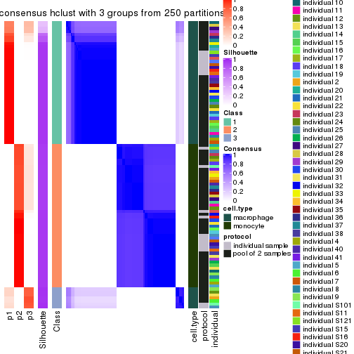</p>

</div>
<div id='tab-MAD-hclust-consensus-heatmap-3'>
<pre><code class="r">consensus_heatmap(res, k = 4)
</code></pre>

<p></p>

</div>
<div id='tab-MAD-hclust-consensus-heatmap-4'>
<pre><code class="r">consensus_heatmap(res, k = 5)
</code></pre>

<p></p>

</div>
<div id='tab-MAD-hclust-consensus-heatmap-5'>
<pre><code class="r">consensus_heatmap(res, k = 6)
</code></pre>

<p></p>

</div>
</div>

Heatmaps for the membership of samples in all partitions to see how consistent they are:


<script>
$( function() {
	$( '#tabs-MAD-hclust-membership-heatmap' ).tabs();
} );
</script>
<div id='tabs-MAD-hclust-membership-heatmap'>
<ul>
<li><a href='#tab-MAD-hclust-membership-heatmap-1'>k = 2</a></li>
<li><a href='#tab-MAD-hclust-membership-heatmap-2'>k = 3</a></li>
<li><a href='#tab-MAD-hclust-membership-heatmap-3'>k = 4</a></li>
<li><a href='#tab-MAD-hclust-membership-heatmap-4'>k = 5</a></li>
<li><a href='#tab-MAD-hclust-membership-heatmap-5'>k = 6</a></li>
</ul>
<div id='tab-MAD-hclust-membership-heatmap-1'>
<pre><code class="r">membership_heatmap(res, k = 2)
</code></pre>

<p></p>

</div>
<div id='tab-MAD-hclust-membership-heatmap-2'>
<pre><code class="r">membership_heatmap(res, k = 3)
</code></pre>

<p></p>

</div>
<div id='tab-MAD-hclust-membership-heatmap-3'>
<pre><code class="r">membership_heatmap(res, k = 4)
</code></pre>

<p></p>

</div>
<div id='tab-MAD-hclust-membership-heatmap-4'>
<pre><code class="r">membership_heatmap(res, k = 5)
</code></pre>

<p></p>

</div>
<div id='tab-MAD-hclust-membership-heatmap-5'>
<pre><code class="r">membership_heatmap(res, k = 6)
</code></pre>

<p></p>

</div>
</div>

As soon as we have had the classes for columns, we can look for signatures
which are significantly different between classes which can be candidate marks
for certain classes. Following are the heatmaps for signatures.


Signature heatmaps where rows are scaled:


<script>
$( function() {
	$( '#tabs-MAD-hclust-get-signatures' ).tabs();
} );
</script>
<div id='tabs-MAD-hclust-get-signatures'>
<ul>
<li><a href='#tab-MAD-hclust-get-signatures-1'>k = 2</a></li>
<li><a href='#tab-MAD-hclust-get-signatures-2'>k = 3</a></li>
<li><a href='#tab-MAD-hclust-get-signatures-3'>k = 4</a></li>
<li><a href='#tab-MAD-hclust-get-signatures-4'>k = 5</a></li>
<li><a href='#tab-MAD-hclust-get-signatures-5'>k = 6</a></li>
</ul>
<div id='tab-MAD-hclust-get-signatures-1'>
<pre><code class="r">get_signatures(res, k = 2)
</code></pre>

<p></p>

</div>
<div id='tab-MAD-hclust-get-signatures-2'>
<pre><code class="r">get_signatures(res, k = 3)
</code></pre>

<p></p>

</div>
<div id='tab-MAD-hclust-get-signatures-3'>
<pre><code class="r">get_signatures(res, k = 4)
</code></pre>

<p></p>

</div>
<div id='tab-MAD-hclust-get-signatures-4'>
<pre><code class="r">get_signatures(res, k = 5)
</code></pre>

<p></p>

</div>
<div id='tab-MAD-hclust-get-signatures-5'>
<pre><code class="r">get_signatures(res, k = 6)
</code></pre>

<p>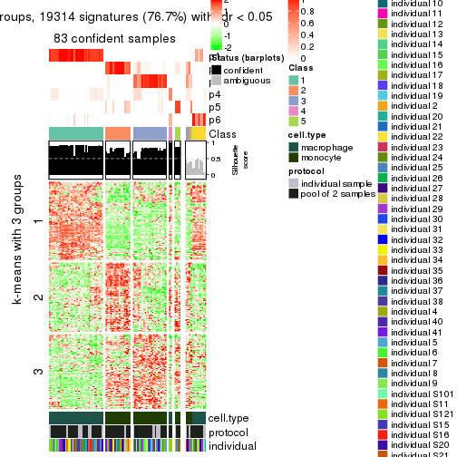</p>

</div>
</div>


Signature heatmaps where rows are not scaled:


<script>
$( function() {
	$( '#tabs-MAD-hclust-get-signatures-no-scale' ).tabs();
} );
</script>
<div id='tabs-MAD-hclust-get-signatures-no-scale'>
<ul>
<li><a href='#tab-MAD-hclust-get-signatures-no-scale-1'>k = 2</a></li>
<li><a href='#tab-MAD-hclust-get-signatures-no-scale-2'>k = 3</a></li>
<li><a href='#tab-MAD-hclust-get-signatures-no-scale-3'>k = 4</a></li>
<li><a href='#tab-MAD-hclust-get-signatures-no-scale-4'>k = 5</a></li>
<li><a href='#tab-MAD-hclust-get-signatures-no-scale-5'>k = 6</a></li>
</ul>
<div id='tab-MAD-hclust-get-signatures-no-scale-1'>
<pre><code class="r">get_signatures(res, k = 2, scale_rows = FALSE)
</code></pre>

<p></p>

</div>
<div id='tab-MAD-hclust-get-signatures-no-scale-2'>
<pre><code class="r">get_signatures(res, k = 3, scale_rows = FALSE)
</code></pre>

<p></p>

</div>
<div id='tab-MAD-hclust-get-signatures-no-scale-3'>
<pre><code class="r">get_signatures(res, k = 4, scale_rows = FALSE)
</code></pre>

<p></p>

</div>
<div id='tab-MAD-hclust-get-signatures-no-scale-4'>
<pre><code class="r">get_signatures(res, k = 5, scale_rows = FALSE)
</code></pre>

<p></p>

</div>
<div id='tab-MAD-hclust-get-signatures-no-scale-5'>
<pre><code class="r">get_signatures(res, k = 6, scale_rows = FALSE)
</code></pre>

<p></p>

</div>
</div>


Compare the overlap of signatures from different k:

```r
compare_signatures(res)
```


`get_signature()` returns a data frame invisibly. TO get the list of signatures, the function
call should be assigned to a variable explicitly. In following code, if `plot` argument is set
to `FALSE`, no heatmap is plotted while only the differential analysis is performed.

```r
# code only for demonstration
tb = get_signature(res, k = ..., plot = FALSE)
```

An example of the output of `tb` is:

```
#>   which_row         fdr    mean_1    mean_2 scaled_mean_1 scaled_mean_2 km
#> 1        38 0.042760348  8.373488  9.131774    -0.5533452     0.5164555  1
#> 2        40 0.018707592  7.106213  8.469186    -0.6173731     0.5762149  1
#> 3        55 0.019134737 10.221463 11.207825    -0.6159697     0.5749050  1
#> 4        59 0.006059896  5.921854  7.869574    -0.6899429     0.6439467  1
#> 5        60 0.018055526  8.928898 10.211722    -0.6204761     0.5791110  1
#> 6        98 0.009384629 15.714769 14.887706     0.6635654    -0.6193277  2
...
```

The columns in `tb` are:

1. `which_row`: row indices corresponding to the input matrix.
2. `fdr`: FDR for the differential test. 
3. `mean_x`: The mean value in group x.
4. `scaled_mean_x`: The mean value in group x after rows are scaled.
5. `km`: Row groups if k-means clustering is applied to rows.


UMAP plot which shows how samples are separated.


<script>
$( function() {
	$( '#tabs-MAD-hclust-dimension-reduction' ).tabs();
} );
</script>
<div id='tabs-MAD-hclust-dimension-reduction'>
<ul>
<li><a href='#tab-MAD-hclust-dimension-reduction-1'>k = 2</a></li>
<li><a href='#tab-MAD-hclust-dimension-reduction-2'>k = 3</a></li>
<li><a href='#tab-MAD-hclust-dimension-reduction-3'>k = 4</a></li>
<li><a href='#tab-MAD-hclust-dimension-reduction-4'>k = 5</a></li>
<li><a href='#tab-MAD-hclust-dimension-reduction-5'>k = 6</a></li>
</ul>
<div id='tab-MAD-hclust-dimension-reduction-1'>
<pre><code class="r">dimension_reduction(res, k = 2, method = &quot;UMAP&quot;)
</code></pre>

<p></p>

</div>
<div id='tab-MAD-hclust-dimension-reduction-2'>
<pre><code class="r">dimension_reduction(res, k = 3, method = &quot;UMAP&quot;)
</code></pre>

<p></p>

</div>
<div id='tab-MAD-hclust-dimension-reduction-3'>
<pre><code class="r">dimension_reduction(res, k = 4, method = &quot;UMAP&quot;)
</code></pre>

<p></p>

</div>
<div id='tab-MAD-hclust-dimension-reduction-4'>
<pre><code class="r">dimension_reduction(res, k = 5, method = &quot;UMAP&quot;)
</code></pre>

<p></p>

</div>
<div id='tab-MAD-hclust-dimension-reduction-5'>
<pre><code class="r">dimension_reduction(res, k = 6, method = &quot;UMAP&quot;)
</code></pre>

<p></p>

</div>
</div>


Following heatmap shows how subgroups are split when increasing `k`:

```r
collect_classes(res)
```


Test correlation between subgroups and known annotations. If the known
annotation is numeric, one-way ANOVA test is applied, and if the known
annotation is discrete, chi-squared contingency table test is applied.

```r
test_to_known_factors(res)
```

```
#>             n cell.type(p) protocol(p) individual(p) k
#> MAD:hclust 96     8.49e-22       1.000         1.000 2
#> MAD:hclust 92     1.05e-20       0.898         1.000 3
#> MAD:hclust 89     3.59e-19       0.417         0.996 4
#> MAD:hclust 89     2.15e-18       0.471         0.990 5
#> MAD:hclust 83     4.03e-17       0.503         0.986 6
```


If matrix rows can be associated to genes, consider to use `functional_enrichment(res,
...)` to perform function enrichment for the signature genes. See [this vignette](http://bioconductor.org/packages/devel/bioc/vignettes/cola/inst/doc/functional_enrichment.html) for more detailed explanations.


 

---------------------------------------------------


### MAD:kmeans**


The object with results only for a single top-value method and a single partition method 
can be extracted as:

```r
res = res_list["MAD", "kmeans"]
# you can also extract it by
# res = res_list["MAD:kmeans"]
```

A summary of `res` and all the functions that can be applied to it:

```r
res
```

```
#> A 'ConsensusPartition' object with k = 2, 3, 4, 5, 6.
#>   On a matrix with 25171 rows and 96 columns.
#>   Top rows (1000, 2000, 3000, 4000, 5000) are extracted by 'MAD' method.
#>   Subgroups are detected by 'kmeans' method.
#>   Performed in total 1250 partitions by row resampling.
#>   Best k for subgroups seems to be 2.
#> 
#> Following methods can be applied to this 'ConsensusPartition' object:
#>  [1] "cola_report"             "collect_classes"         "collect_plots"          
#>  [4] "collect_stats"           "colnames"                "compare_signatures"     
#>  [7] "consensus_heatmap"       "dimension_reduction"     "functional_enrichment"  
#> [10] "get_anno_col"            "get_anno"                "get_classes"            
#> [13] "get_consensus"           "get_matrix"              "get_membership"         
#> [16] "get_param"               "get_signatures"          "get_stats"              
#> [19] "is_best_k"               "is_stable_k"             "membership_heatmap"     
#> [22] "ncol"                    "nrow"                    "plot_ecdf"              
#> [25] "rownames"                "select_partition_number" "show"                   
#> [28] "suggest_best_k"          "test_to_known_factors"
```

`collect_plots()` function collects all the plots made from `res` for all `k` (number of partitions)
into one single page to provide an easy and fast comparison between different `k`.

```r
collect_plots(res)
```


The plots are:

- The first row: a plot of the ECDF (empirical cumulative distribution
  function) curves of the consensus matrix for each `k` and the heatmap of
  predicted classes for each `k`.
- The second row: heatmaps of the consensus matrix for each `k`.
- The third row: heatmaps of the membership matrix for each `k`.
- The fouth row: heatmaps of the signatures for each `k`.

All the plots in panels can be made by individual functions and they are
plotted later in this section.

`select_partition_number()` produces several plots showing different
statistics for choosing "optimized" `k`. There are following statistics:

- ECDF curves of the consensus matrix for each `k`;
- 1-PAC. [The PAC
  score](https://en.wikipedia.org/wiki/Consensus_clustering#Over-interpretation_potential_of_consensus_clustering)
  measures the proportion of the ambiguous subgrouping.
- Mean silhouette score.
- Concordance. The mean probability of fiting the consensus class ids in all
  partitions.
- Area increased. Denote $A_k$ as the area under the ECDF curve for current
  `k`, the area increased is defined as $A_k - A_{k-1}$.
- Rand index. The percent of pairs of samples that are both in a same cluster
  or both are not in a same cluster in the partition of k and k-1.
- Jaccard index. The ratio of pairs of samples are both in a same cluster in
  the partition of k and k-1 and the pairs of samples are both in a same
  cluster in the partition k or k-1.

The detailed explanations of these statistics can be found in [the _cola_
vignette](http://bioconductor.org/packages/devel/bioc/vignettes/cola/inst/doc/cola.html#toc_13).

Generally speaking, lower PAC score, higher mean silhouette score or higher
concordance corresponds to better partition. Rand index and Jaccard index
measure how similar the current partition is compared to partition with `k-1`.
If they are too similar, we won't accept `k` is better than `k-1`.

```r
select_partition_number(res)
```


The numeric values for all these statistics can be obtained by `get_stats()`.

```r
get_stats(res)
```

```
#>   k 1-PAC mean_silhouette concordance area_increased  Rand Jaccard
#> 2 2 1.000           1.000       1.000         0.5058 0.495   0.495
#> 3 3 0.693           0.866       0.798         0.2369 0.874   0.745
#> 4 4 0.622           0.626       0.680         0.1109 0.910   0.761
#> 5 5 0.581           0.680       0.722         0.0762 0.910   0.703
#> 6 6 0.584           0.591       0.729         0.0581 0.974   0.882
```

`suggest_best_k()` suggests the best $k$ based on these statistics. The rules are as follows:

- All $k$ with Jaccard index larger than 0.95 are removed because increasing
  $k$ does not provide enough extra information. If all $k$ are removed, it is
  marked as no subgroup is detected.
- For all $k$ with 1-PAC score larger than 0.9, the maximal $k$ is taken as
  the best $k$, and other $k$ are marked as optional $k$.
- If it does not fit the second rule. The $k$ with the maximal vote of the
  highest 1-PAC score, highest mean silhouette, and highest concordance is
  taken as the best $k$.

```r
suggest_best_k(res)
```

```
#> [1] 2
```


Following shows the table of the partitions (You need to click the **show/hide
code output** link to see it). The membership matrix (columns with name `p*`)
is inferred by
[`clue::cl_consensus()`](https://www.rdocumentation.org/link/cl_consensus?package=clue)
function with the `SE` method. Basically the value in the membership matrix
represents the probability to belong to a certain group. The finall class
label for an item is determined with the group with highest probability it
belongs to.

In `get_classes()` function, the entropy is calculated from the membership
matrix and the silhouette score is calculated from the consensus matrix.


<script>
$( function() {
	$( '#tabs-MAD-kmeans-get-classes' ).tabs();
} );
</script>
<div id='tabs-MAD-kmeans-get-classes'>
<ul>
<li><a href='#tab-MAD-kmeans-get-classes-1'>k = 2</a></li>
<li><a href='#tab-MAD-kmeans-get-classes-2'>k = 3</a></li>
<li><a href='#tab-MAD-kmeans-get-classes-3'>k = 4</a></li>
<li><a href='#tab-MAD-kmeans-get-classes-4'>k = 5</a></li>
<li><a href='#tab-MAD-kmeans-get-classes-5'>k = 6</a></li>
</ul>

<div id='tab-MAD-kmeans-get-classes-1'>
<p><a id='tab-MAD-kmeans-get-classes-1-a' style='color:#0366d6' href='#'>show/hide code output</a></p>
<pre><code class="r">cbind(get_classes(res, k = 2), get_membership(res, k = 2))
</code></pre>

<pre><code>#&gt;           class entropy silhouette p1 p2
#&gt; GSM257886     1       0          1  1  0
#&gt; GSM257888     1       0          1  1  0
#&gt; GSM257890     1       0          1  1  0
#&gt; GSM257892     1       0          1  1  0
#&gt; GSM257894     1       0          1  1  0
#&gt; GSM257896     1       0          1  1  0
#&gt; GSM257898     1       0          1  1  0
#&gt; GSM257900     1       0          1  1  0
#&gt; GSM257902     1       0          1  1  0
#&gt; GSM257904     1       0          1  1  0
#&gt; GSM257906     1       0          1  1  0
#&gt; GSM257908     1       0          1  1  0
#&gt; GSM257910     1       0          1  1  0
#&gt; GSM257912     1       0          1  1  0
#&gt; GSM257914     1       0          1  1  0
#&gt; GSM257917     1       0          1  1  0
#&gt; GSM257919     1       0          1  1  0
#&gt; GSM257921     1       0          1  1  0
#&gt; GSM257923     1       0          1  1  0
#&gt; GSM257925     1       0          1  1  0
#&gt; GSM257927     1       0          1  1  0
#&gt; GSM257929     1       0          1  1  0
#&gt; GSM257937     1       0          1  1  0
#&gt; GSM257939     1       0          1  1  0
#&gt; GSM257941     1       0          1  1  0
#&gt; GSM257943     1       0          1  1  0
#&gt; GSM257945     1       0          1  1  0
#&gt; GSM257947     1       0          1  1  0
#&gt; GSM257949     1       0          1  1  0
#&gt; GSM257951     1       0          1  1  0
#&gt; GSM257953     1       0          1  1  0
#&gt; GSM257955     1       0          1  1  0
#&gt; GSM257958     1       0          1  1  0
#&gt; GSM257960     1       0          1  1  0
#&gt; GSM257962     1       0          1  1  0
#&gt; GSM257964     1       0          1  1  0
#&gt; GSM257966     1       0          1  1  0
#&gt; GSM257968     1       0          1  1  0
#&gt; GSM257970     1       0          1  1  0
#&gt; GSM257972     1       0          1  1  0
#&gt; GSM257977     1       0          1  1  0
#&gt; GSM257982     1       0          1  1  0
#&gt; GSM257984     1       0          1  1  0
#&gt; GSM257986     1       0          1  1  0
#&gt; GSM257990     1       0          1  1  0
#&gt; GSM257992     1       0          1  1  0
#&gt; GSM257996     1       0          1  1  0
#&gt; GSM258006     1       0          1  1  0
#&gt; GSM257887     2       0          1  0  1
#&gt; GSM257889     2       0          1  0  1
#&gt; GSM257891     2       0          1  0  1
#&gt; GSM257893     2       0          1  0  1
#&gt; GSM257895     2       0          1  0  1
#&gt; GSM257897     2       0          1  0  1
#&gt; GSM257899     2       0          1  0  1
#&gt; GSM257901     2       0          1  0  1
#&gt; GSM257903     2       0          1  0  1
#&gt; GSM257905     2       0          1  0  1
#&gt; GSM257907     2       0          1  0  1
#&gt; GSM257909     2       0          1  0  1
#&gt; GSM257911     2       0          1  0  1
#&gt; GSM257913     2       0          1  0  1
#&gt; GSM257916     2       0          1  0  1
#&gt; GSM257918     2       0          1  0  1
#&gt; GSM257920     2       0          1  0  1
#&gt; GSM257922     2       0          1  0  1
#&gt; GSM257924     2       0          1  0  1
#&gt; GSM257926     2       0          1  0  1
#&gt; GSM257928     2       0          1  0  1
#&gt; GSM257930     2       0          1  0  1
#&gt; GSM257938     2       0          1  0  1
#&gt; GSM257940     2       0          1  0  1
#&gt; GSM257942     2       0          1  0  1
#&gt; GSM257944     2       0          1  0  1
#&gt; GSM257946     2       0          1  0  1
#&gt; GSM257948     2       0          1  0  1
#&gt; GSM257950     2       0          1  0  1
#&gt; GSM257952     2       0          1  0  1
#&gt; GSM257954     2       0          1  0  1
#&gt; GSM257956     2       0          1  0  1
#&gt; GSM257959     2       0          1  0  1
#&gt; GSM257961     2       0          1  0  1
#&gt; GSM257963     2       0          1  0  1
#&gt; GSM257965     2       0          1  0  1
#&gt; GSM257967     2       0          1  0  1
#&gt; GSM257969     2       0          1  0  1
#&gt; GSM257971     2       0          1  0  1
#&gt; GSM257973     2       0          1  0  1
#&gt; GSM257981     2       0          1  0  1
#&gt; GSM257983     2       0          1  0  1
#&gt; GSM257985     2       0          1  0  1
#&gt; GSM257988     2       0          1  0  1
#&gt; GSM257991     2       0          1  0  1
#&gt; GSM257993     2       0          1  0  1
#&gt; GSM257994     2       0          1  0  1
#&gt; GSM257989     2       0          1  0  1
</code></pre>

<script>
$('#tab-MAD-kmeans-get-classes-1-a').parent().next().next().hide();
$('#tab-MAD-kmeans-get-classes-1-a').click(function(){
  $('#tab-MAD-kmeans-get-classes-1-a').parent().next().next().toggle();
  return(false);
});
</script>
</div>

<div id='tab-MAD-kmeans-get-classes-2'>
<p><a id='tab-MAD-kmeans-get-classes-2-a' style='color:#0366d6' href='#'>show/hide code output</a></p>
<pre><code class="r">cbind(get_classes(res, k = 3), get_membership(res, k = 3))
</code></pre>

<pre><code>#&gt;           class entropy silhouette    p1    p2    p3
#&gt; GSM257886     1  0.6168      0.812 0.588 0.412 0.000
#&gt; GSM257888     1  0.4702      0.865 0.788 0.212 0.000
#&gt; GSM257890     1  0.6126      0.817 0.600 0.400 0.000
#&gt; GSM257892     1  0.6168      0.812 0.588 0.412 0.000
#&gt; GSM257894     1  0.4452      0.867 0.808 0.192 0.000
#&gt; GSM257896     1  0.5098      0.866 0.752 0.248 0.000
#&gt; GSM257898     1  0.5016      0.851 0.760 0.240 0.000
#&gt; GSM257900     1  0.3686      0.882 0.860 0.140 0.000
#&gt; GSM257902     1  0.0000      0.890 1.000 0.000 0.000
#&gt; GSM257904     1  0.5785      0.840 0.668 0.332 0.000
#&gt; GSM257906     1  0.5785      0.840 0.668 0.332 0.000
#&gt; GSM257908     1  0.4346      0.868 0.816 0.184 0.000
#&gt; GSM257910     1  0.4346      0.868 0.816 0.184 0.000
#&gt; GSM257912     1  0.5497      0.862 0.708 0.292 0.000
#&gt; GSM257914     1  0.5465      0.862 0.712 0.288 0.000
#&gt; GSM257917     1  0.5497      0.862 0.708 0.292 0.000
#&gt; GSM257919     1  0.5497      0.862 0.708 0.292 0.000
#&gt; GSM257921     1  0.4796      0.882 0.780 0.220 0.000
#&gt; GSM257923     1  0.0000      0.890 1.000 0.000 0.000
#&gt; GSM257925     1  0.0000      0.890 1.000 0.000 0.000
#&gt; GSM257927     1  0.3340      0.883 0.880 0.120 0.000
#&gt; GSM257929     1  0.0000      0.890 1.000 0.000 0.000
#&gt; GSM257937     1  0.5560      0.859 0.700 0.300 0.000
#&gt; GSM257939     1  0.0000      0.890 1.000 0.000 0.000
#&gt; GSM257941     1  0.3412      0.883 0.876 0.124 0.000
#&gt; GSM257943     1  0.4750      0.852 0.784 0.216 0.000
#&gt; GSM257945     1  0.3686      0.879 0.860 0.140 0.000
#&gt; GSM257947     1  0.0000      0.890 1.000 0.000 0.000
#&gt; GSM257949     1  0.0000      0.890 1.000 0.000 0.000
#&gt; GSM257951     1  0.0000      0.890 1.000 0.000 0.000
#&gt; GSM257953     1  0.0000      0.890 1.000 0.000 0.000
#&gt; GSM257955     1  0.0000      0.890 1.000 0.000 0.000
#&gt; GSM257958     1  0.0000      0.890 1.000 0.000 0.000
#&gt; GSM257960     1  0.3551      0.882 0.868 0.132 0.000
#&gt; GSM257962     1  0.3340      0.883 0.880 0.120 0.000
#&gt; GSM257964     1  0.0000      0.890 1.000 0.000 0.000
#&gt; GSM257966     1  0.4974      0.867 0.764 0.236 0.000
#&gt; GSM257968     1  0.3941      0.874 0.844 0.156 0.000
#&gt; GSM257970     1  0.0000      0.890 1.000 0.000 0.000
#&gt; GSM257972     1  0.0237      0.890 0.996 0.004 0.000
#&gt; GSM257977     1  0.5291      0.864 0.732 0.268 0.000
#&gt; GSM257982     1  0.4605      0.865 0.796 0.204 0.000
#&gt; GSM257984     1  0.0000      0.890 1.000 0.000 0.000
#&gt; GSM257986     1  0.0000      0.890 1.000 0.000 0.000
#&gt; GSM257990     1  0.0237      0.890 0.996 0.004 0.000
#&gt; GSM257992     1  0.5016      0.851 0.760 0.240 0.000
#&gt; GSM257996     1  0.2711      0.888 0.912 0.088 0.000
#&gt; GSM258006     1  0.5785      0.840 0.668 0.332 0.000
#&gt; GSM257887     2  0.6180      0.962 0.000 0.584 0.416
#&gt; GSM257889     3  0.1289      0.891 0.000 0.032 0.968
#&gt; GSM257891     3  0.0592      0.905 0.000 0.012 0.988
#&gt; GSM257893     3  0.1289      0.891 0.000 0.032 0.968
#&gt; GSM257895     2  0.6180      0.957 0.000 0.584 0.416
#&gt; GSM257897     3  0.1289      0.891 0.000 0.032 0.968
#&gt; GSM257899     3  0.1289      0.891 0.000 0.032 0.968
#&gt; GSM257901     3  0.0237      0.907 0.000 0.004 0.996
#&gt; GSM257903     2  0.6252      0.971 0.000 0.556 0.444
#&gt; GSM257905     2  0.6252      0.971 0.000 0.556 0.444
#&gt; GSM257907     3  0.0237      0.907 0.000 0.004 0.996
#&gt; GSM257909     2  0.6252      0.971 0.000 0.556 0.444
#&gt; GSM257911     3  0.0237      0.907 0.000 0.004 0.996
#&gt; GSM257913     3  0.0237      0.907 0.000 0.004 0.996
#&gt; GSM257916     2  0.6252      0.971 0.000 0.556 0.444
#&gt; GSM257918     2  0.6252      0.971 0.000 0.556 0.444
#&gt; GSM257920     3  0.0237      0.907 0.000 0.004 0.996
#&gt; GSM257922     3  0.1289      0.891 0.000 0.032 0.968
#&gt; GSM257924     3  0.1031      0.897 0.000 0.024 0.976
#&gt; GSM257926     3  0.0237      0.907 0.000 0.004 0.996
#&gt; GSM257928     2  0.6260      0.913 0.000 0.552 0.448
#&gt; GSM257930     2  0.6180      0.957 0.000 0.584 0.416
#&gt; GSM257938     2  0.6180      0.957 0.000 0.584 0.416
#&gt; GSM257940     3  0.0237      0.907 0.000 0.004 0.996
#&gt; GSM257942     2  0.6252      0.971 0.000 0.556 0.444
#&gt; GSM257944     2  0.6252      0.971 0.000 0.556 0.444
#&gt; GSM257946     3  0.0592      0.905 0.000 0.012 0.988
#&gt; GSM257948     3  0.0237      0.907 0.000 0.004 0.996
#&gt; GSM257950     3  0.0000      0.907 0.000 0.000 1.000
#&gt; GSM257952     3  0.6302     -0.827 0.000 0.480 0.520
#&gt; GSM257954     2  0.6168      0.960 0.000 0.588 0.412
#&gt; GSM257956     2  0.6168      0.960 0.000 0.588 0.412
#&gt; GSM257959     2  0.6252      0.971 0.000 0.556 0.444
#&gt; GSM257961     2  0.6252      0.971 0.000 0.556 0.444
#&gt; GSM257963     2  0.6252      0.971 0.000 0.556 0.444
#&gt; GSM257965     2  0.6252      0.971 0.000 0.556 0.444
#&gt; GSM257967     2  0.6252      0.971 0.000 0.556 0.444
#&gt; GSM257969     2  0.6168      0.960 0.000 0.588 0.412
#&gt; GSM257971     3  0.1289      0.891 0.000 0.032 0.968
#&gt; GSM257973     3  0.0237      0.907 0.000 0.004 0.996
#&gt; GSM257981     3  0.6286     -0.787 0.000 0.464 0.536
#&gt; GSM257983     3  0.0237      0.906 0.000 0.004 0.996
#&gt; GSM257985     3  0.0592      0.905 0.000 0.012 0.988
#&gt; GSM257988     3  0.0237      0.907 0.000 0.004 0.996
#&gt; GSM257991     2  0.6252      0.971 0.000 0.556 0.444
#&gt; GSM257993     2  0.6168      0.960 0.000 0.588 0.412
#&gt; GSM257994     2  0.6180      0.957 0.000 0.584 0.416
#&gt; GSM257989     3  0.0000      0.907 0.000 0.000 1.000
</code></pre>

<script>
$('#tab-MAD-kmeans-get-classes-2-a').parent().next().next().hide();
$('#tab-MAD-kmeans-get-classes-2-a').click(function(){
  $('#tab-MAD-kmeans-get-classes-2-a').parent().next().next().toggle();
  return(false);
});
</script>
</div>

<div id='tab-MAD-kmeans-get-classes-3'>
<p><a id='tab-MAD-kmeans-get-classes-3-a' style='color:#0366d6' href='#'>show/hide code output</a></p>
<pre><code class="r">cbind(get_classes(res, k = 4), get_membership(res, k = 4))
</code></pre>

<pre><code>#&gt;           class entropy silhouette    p1    p2    p3    p4
#&gt; GSM257886     4  0.5522     0.6814 0.288 0.000 0.044 0.668
#&gt; GSM257888     1  0.7427     0.2765 0.500 0.000 0.300 0.200
#&gt; GSM257890     1  0.7910    -0.0494 0.352 0.000 0.304 0.344
#&gt; GSM257892     4  0.5522     0.6814 0.288 0.000 0.044 0.668
#&gt; GSM257894     1  0.7205     0.3013 0.532 0.000 0.296 0.172
#&gt; GSM257896     1  0.7606     0.2471 0.468 0.000 0.304 0.228
#&gt; GSM257898     4  0.4948     0.7837 0.440 0.000 0.000 0.560
#&gt; GSM257900     1  0.4914    -0.1263 0.676 0.000 0.012 0.312
#&gt; GSM257902     1  0.0000     0.5212 1.000 0.000 0.000 0.000
#&gt; GSM257904     4  0.4790     0.8280 0.380 0.000 0.000 0.620
#&gt; GSM257906     4  0.4790     0.8280 0.380 0.000 0.000 0.620
#&gt; GSM257908     1  0.7222     0.3046 0.528 0.000 0.300 0.172
#&gt; GSM257910     1  0.7222     0.3046 0.528 0.000 0.300 0.172
#&gt; GSM257912     1  0.7689     0.2237 0.452 0.000 0.300 0.248
#&gt; GSM257914     1  0.7671     0.2304 0.456 0.000 0.300 0.244
#&gt; GSM257917     1  0.7722     0.2067 0.444 0.000 0.300 0.256
#&gt; GSM257919     1  0.7689     0.2237 0.452 0.000 0.300 0.248
#&gt; GSM257921     1  0.7093     0.2185 0.556 0.000 0.272 0.172
#&gt; GSM257923     1  0.0000     0.5212 1.000 0.000 0.000 0.000
#&gt; GSM257925     1  0.0188     0.5186 0.996 0.000 0.004 0.000
#&gt; GSM257927     1  0.4606     0.0454 0.724 0.000 0.012 0.264
#&gt; GSM257929     1  0.0188     0.5186 0.996 0.000 0.004 0.000
#&gt; GSM257937     1  0.7700     0.2164 0.448 0.000 0.304 0.248
#&gt; GSM257939     1  0.0000     0.5212 1.000 0.000 0.000 0.000
#&gt; GSM257941     1  0.4891    -0.1150 0.680 0.000 0.012 0.308
#&gt; GSM257943     4  0.5161     0.7037 0.476 0.000 0.004 0.520
#&gt; GSM257945     1  0.4999    -0.1976 0.660 0.000 0.012 0.328
#&gt; GSM257947     1  0.0000     0.5212 1.000 0.000 0.000 0.000
#&gt; GSM257949     1  0.0000     0.5212 1.000 0.000 0.000 0.000
#&gt; GSM257951     1  0.0000     0.5212 1.000 0.000 0.000 0.000
#&gt; GSM257953     1  0.0188     0.5186 0.996 0.000 0.004 0.000
#&gt; GSM257955     1  0.0000     0.5212 1.000 0.000 0.000 0.000
#&gt; GSM257958     1  0.0188     0.5186 0.996 0.000 0.004 0.000
#&gt; GSM257960     1  0.4868    -0.0993 0.684 0.000 0.012 0.304
#&gt; GSM257962     1  0.4606     0.0454 0.724 0.000 0.012 0.264
#&gt; GSM257964     1  0.0000     0.5212 1.000 0.000 0.000 0.000
#&gt; GSM257966     1  0.7531     0.2605 0.476 0.000 0.316 0.208
#&gt; GSM257968     1  0.5247     0.3880 0.752 0.000 0.100 0.148
#&gt; GSM257970     1  0.0000     0.5212 1.000 0.000 0.000 0.000
#&gt; GSM257972     1  0.0469     0.5165 0.988 0.000 0.012 0.000
#&gt; GSM257977     1  0.7626     0.2415 0.464 0.000 0.304 0.232
#&gt; GSM257982     1  0.7344     0.2854 0.512 0.000 0.300 0.188
#&gt; GSM257984     1  0.0000     0.5212 1.000 0.000 0.000 0.000
#&gt; GSM257986     1  0.0000     0.5212 1.000 0.000 0.000 0.000
#&gt; GSM257990     1  0.2048     0.4504 0.928 0.000 0.008 0.064
#&gt; GSM257992     4  0.4948     0.7837 0.440 0.000 0.000 0.560
#&gt; GSM257996     1  0.3552     0.3715 0.848 0.000 0.024 0.128
#&gt; GSM258006     4  0.5189     0.8197 0.372 0.000 0.012 0.616
#&gt; GSM257887     2  0.2021     0.8714 0.000 0.936 0.024 0.040
#&gt; GSM257889     3  0.4957     0.9084 0.000 0.320 0.668 0.012
#&gt; GSM257891     3  0.4917     0.9185 0.000 0.336 0.656 0.008
#&gt; GSM257893     3  0.5619     0.8924 0.000 0.320 0.640 0.040
#&gt; GSM257895     2  0.3384     0.8452 0.000 0.860 0.024 0.116
#&gt; GSM257897     3  0.5698     0.8916 0.000 0.320 0.636 0.044
#&gt; GSM257899     3  0.5698     0.8916 0.000 0.320 0.636 0.044
#&gt; GSM257901     3  0.6773     0.8826 0.000 0.348 0.544 0.108
#&gt; GSM257903     2  0.0469     0.8806 0.000 0.988 0.000 0.012
#&gt; GSM257905     2  0.0000     0.8835 0.000 1.000 0.000 0.000
#&gt; GSM257907     3  0.6773     0.8826 0.000 0.348 0.544 0.108
#&gt; GSM257909     2  0.0188     0.8828 0.000 0.996 0.000 0.004
#&gt; GSM257911     3  0.6888     0.7355 0.000 0.448 0.448 0.104
#&gt; GSM257913     3  0.6426     0.8622 0.000 0.392 0.536 0.072
#&gt; GSM257916     2  0.0336     0.8819 0.000 0.992 0.000 0.008
#&gt; GSM257918     2  0.0336     0.8819 0.000 0.992 0.000 0.008
#&gt; GSM257920     3  0.6171     0.9056 0.000 0.348 0.588 0.064
#&gt; GSM257922     3  0.6179     0.8668 0.000 0.320 0.608 0.072
#&gt; GSM257924     3  0.4761     0.9176 0.000 0.332 0.664 0.004
#&gt; GSM257926     3  0.5093     0.9204 0.000 0.348 0.640 0.012
#&gt; GSM257928     2  0.6058     0.6427 0.000 0.684 0.136 0.180
#&gt; GSM257930     2  0.4238     0.7981 0.000 0.796 0.028 0.176
#&gt; GSM257938     2  0.4238     0.7981 0.000 0.796 0.028 0.176
#&gt; GSM257940     3  0.6725     0.8825 0.000 0.348 0.548 0.104
#&gt; GSM257942     2  0.0469     0.8806 0.000 0.988 0.000 0.012
#&gt; GSM257944     2  0.0469     0.8806 0.000 0.988 0.000 0.012
#&gt; GSM257946     3  0.4605     0.9195 0.000 0.336 0.664 0.000
#&gt; GSM257948     3  0.6171     0.9056 0.000 0.348 0.588 0.064
#&gt; GSM257950     3  0.5075     0.9209 0.000 0.344 0.644 0.012
#&gt; GSM257952     2  0.4424     0.6873 0.000 0.812 0.088 0.100
#&gt; GSM257954     2  0.3384     0.8452 0.000 0.860 0.024 0.116
#&gt; GSM257956     2  0.3015     0.8559 0.000 0.884 0.024 0.092
#&gt; GSM257959     2  0.0000     0.8835 0.000 1.000 0.000 0.000
#&gt; GSM257961     2  0.0000     0.8835 0.000 1.000 0.000 0.000
#&gt; GSM257963     2  0.0000     0.8835 0.000 1.000 0.000 0.000
#&gt; GSM257965     2  0.2281     0.8166 0.000 0.904 0.000 0.096
#&gt; GSM257967     2  0.0000     0.8835 0.000 1.000 0.000 0.000
#&gt; GSM257969     2  0.3015     0.8559 0.000 0.884 0.024 0.092
#&gt; GSM257971     3  0.6519     0.8682 0.000 0.320 0.584 0.096
#&gt; GSM257973     3  0.5823     0.9145 0.000 0.348 0.608 0.044
#&gt; GSM257981     2  0.4608     0.6609 0.000 0.800 0.104 0.096
#&gt; GSM257983     3  0.5075     0.9206 0.000 0.344 0.644 0.012
#&gt; GSM257985     3  0.4917     0.9203 0.000 0.336 0.656 0.008
#&gt; GSM257988     3  0.6171     0.9065 0.000 0.348 0.588 0.064
#&gt; GSM257991     2  0.2593     0.8045 0.000 0.892 0.004 0.104
#&gt; GSM257993     2  0.3384     0.8452 0.000 0.860 0.024 0.116
#&gt; GSM257994     2  0.4238     0.7981 0.000 0.796 0.028 0.176
#&gt; GSM257989     3  0.5186     0.9210 0.000 0.344 0.640 0.016
</code></pre>

<script>
$('#tab-MAD-kmeans-get-classes-3-a').parent().next().next().hide();
$('#tab-MAD-kmeans-get-classes-3-a').click(function(){
  $('#tab-MAD-kmeans-get-classes-3-a').parent().next().next().toggle();
  return(false);
});
</script>
</div>

<div id='tab-MAD-kmeans-get-classes-4'>
<p><a id='tab-MAD-kmeans-get-classes-4-a' style='color:#0366d6' href='#'>show/hide code output</a></p>
<pre><code class="r">cbind(get_classes(res, k = 5), get_membership(res, k = 5))
</code></pre>

<pre><code>#&gt;           class entropy silhouette    p1    p2    p3    p4    p5
#&gt; GSM257886     5  0.6943     0.3801 0.164 0.028 0.000 0.336 0.472
#&gt; GSM257888     4  0.4366     0.8235 0.320 0.000 0.000 0.664 0.016
#&gt; GSM257890     4  0.5950     0.6530 0.192 0.020 0.000 0.644 0.144
#&gt; GSM257892     5  0.6943     0.3801 0.164 0.028 0.000 0.336 0.472
#&gt; GSM257894     4  0.4444     0.7894 0.364 0.000 0.000 0.624 0.012
#&gt; GSM257896     4  0.4546     0.8288 0.304 0.000 0.000 0.668 0.028
#&gt; GSM257898     5  0.4823     0.7087 0.316 0.000 0.000 0.040 0.644
#&gt; GSM257900     1  0.5456     0.0981 0.556 0.048 0.000 0.008 0.388
#&gt; GSM257902     1  0.0451     0.7445 0.988 0.004 0.000 0.008 0.000
#&gt; GSM257904     5  0.5334     0.7658 0.244 0.000 0.000 0.104 0.652
#&gt; GSM257906     5  0.5379     0.7664 0.244 0.000 0.000 0.108 0.648
#&gt; GSM257908     4  0.6552     0.7986 0.332 0.124 0.000 0.520 0.024
#&gt; GSM257910     4  0.6552     0.7986 0.332 0.124 0.000 0.520 0.024
#&gt; GSM257912     4  0.7216     0.8001 0.256 0.132 0.000 0.528 0.084
#&gt; GSM257914     4  0.7216     0.8001 0.256 0.132 0.000 0.528 0.084
#&gt; GSM257917     4  0.7216     0.8001 0.256 0.132 0.000 0.528 0.084
#&gt; GSM257919     4  0.7216     0.8001 0.256 0.132 0.000 0.528 0.084
#&gt; GSM257921     1  0.7399    -0.3749 0.420 0.060 0.000 0.364 0.156
#&gt; GSM257923     1  0.0290     0.7449 0.992 0.000 0.000 0.008 0.000
#&gt; GSM257925     1  0.0794     0.7369 0.972 0.028 0.000 0.000 0.000
#&gt; GSM257927     1  0.5292     0.1801 0.580 0.048 0.000 0.004 0.368
#&gt; GSM257929     1  0.0290     0.7420 0.992 0.008 0.000 0.000 0.000
#&gt; GSM257937     4  0.5156     0.8014 0.256 0.004 0.000 0.668 0.072
#&gt; GSM257939     1  0.0290     0.7449 0.992 0.000 0.000 0.008 0.000
#&gt; GSM257941     1  0.5324     0.1422 0.568 0.048 0.000 0.004 0.380
#&gt; GSM257943     5  0.5303     0.5243 0.372 0.048 0.000 0.004 0.576
#&gt; GSM257945     1  0.5343     0.1128 0.560 0.048 0.000 0.004 0.388
#&gt; GSM257947     1  0.0290     0.7449 0.992 0.000 0.000 0.008 0.000
#&gt; GSM257949     1  0.0290     0.7449 0.992 0.000 0.000 0.008 0.000
#&gt; GSM257951     1  0.0451     0.7445 0.988 0.004 0.000 0.008 0.000
#&gt; GSM257953     1  0.0794     0.7369 0.972 0.028 0.000 0.000 0.000
#&gt; GSM257955     1  0.0451     0.7445 0.988 0.004 0.000 0.008 0.000
#&gt; GSM257958     1  0.0794     0.7369 0.972 0.028 0.000 0.000 0.000
#&gt; GSM257960     1  0.5437     0.1281 0.564 0.048 0.000 0.008 0.380
#&gt; GSM257962     1  0.5292     0.1801 0.580 0.048 0.000 0.004 0.368
#&gt; GSM257964     1  0.0290     0.7449 0.992 0.000 0.000 0.008 0.000
#&gt; GSM257966     4  0.5246     0.8412 0.300 0.024 0.000 0.644 0.032
#&gt; GSM257968     1  0.4182    -0.0947 0.644 0.000 0.000 0.352 0.004
#&gt; GSM257970     1  0.0451     0.7445 0.988 0.004 0.000 0.008 0.000
#&gt; GSM257972     1  0.1124     0.7321 0.960 0.036 0.000 0.004 0.000
#&gt; GSM257977     4  0.4853     0.8243 0.296 0.008 0.000 0.664 0.032
#&gt; GSM257982     4  0.4339     0.8132 0.336 0.000 0.000 0.652 0.012
#&gt; GSM257984     1  0.0290     0.7449 0.992 0.000 0.000 0.008 0.000
#&gt; GSM257986     1  0.0290     0.7449 0.992 0.000 0.000 0.008 0.000
#&gt; GSM257990     1  0.4184     0.5518 0.772 0.048 0.000 0.004 0.176
#&gt; GSM257992     5  0.4956     0.7158 0.312 0.004 0.000 0.040 0.644
#&gt; GSM257996     1  0.5444     0.3426 0.644 0.048 0.000 0.024 0.284
#&gt; GSM258006     5  0.6093     0.7309 0.224 0.012 0.000 0.156 0.608
#&gt; GSM257887     2  0.5354     0.8066 0.000 0.696 0.208 0.068 0.028
#&gt; GSM257889     3  0.2869     0.8158 0.000 0.016 0.888 0.040 0.056
#&gt; GSM257891     3  0.2278     0.8277 0.000 0.000 0.908 0.032 0.060
#&gt; GSM257893     3  0.3700     0.7901 0.000 0.020 0.840 0.080 0.060
#&gt; GSM257895     2  0.7082     0.7532 0.000 0.540 0.212 0.192 0.056
#&gt; GSM257897     3  0.3624     0.7939 0.000 0.020 0.844 0.052 0.084
#&gt; GSM257899     3  0.3692     0.7914 0.000 0.020 0.840 0.056 0.084
#&gt; GSM257901     3  0.4234     0.7501 0.000 0.012 0.776 0.040 0.172
#&gt; GSM257903     2  0.3858     0.8177 0.000 0.760 0.224 0.008 0.008
#&gt; GSM257905     2  0.3305     0.8219 0.000 0.776 0.224 0.000 0.000
#&gt; GSM257907     3  0.4234     0.7501 0.000 0.012 0.776 0.040 0.172
#&gt; GSM257909     2  0.3461     0.8212 0.000 0.772 0.224 0.000 0.004
#&gt; GSM257911     3  0.5474     0.6605 0.000 0.084 0.708 0.040 0.168
#&gt; GSM257913     3  0.3674     0.7888 0.000 0.064 0.844 0.024 0.068
#&gt; GSM257916     2  0.3966     0.8168 0.000 0.756 0.224 0.008 0.012
#&gt; GSM257918     2  0.3966     0.8168 0.000 0.756 0.224 0.008 0.012
#&gt; GSM257920     3  0.2696     0.8171 0.000 0.012 0.892 0.024 0.072
#&gt; GSM257922     3  0.4383     0.7583 0.000 0.020 0.792 0.108 0.080
#&gt; GSM257924     3  0.2523     0.8341 0.000 0.024 0.908 0.028 0.040
#&gt; GSM257926     3  0.1299     0.8410 0.000 0.012 0.960 0.008 0.020
#&gt; GSM257928     2  0.8112     0.5215 0.000 0.336 0.300 0.268 0.096
#&gt; GSM257930     2  0.7720     0.6959 0.000 0.460 0.212 0.240 0.088
#&gt; GSM257938     2  0.7720     0.6959 0.000 0.460 0.212 0.240 0.088
#&gt; GSM257940     3  0.4196     0.7501 0.000 0.012 0.780 0.040 0.168
#&gt; GSM257942     2  0.4025     0.8123 0.000 0.748 0.232 0.008 0.012
#&gt; GSM257944     2  0.3996     0.8146 0.000 0.752 0.228 0.008 0.012
#&gt; GSM257946     3  0.1106     0.8408 0.000 0.000 0.964 0.012 0.024
#&gt; GSM257948     3  0.2633     0.8184 0.000 0.012 0.896 0.024 0.068
#&gt; GSM257950     3  0.0451     0.8411 0.000 0.008 0.988 0.004 0.000
#&gt; GSM257952     2  0.7296     0.3916 0.000 0.404 0.372 0.040 0.184
#&gt; GSM257954     2  0.6887     0.7665 0.000 0.564 0.212 0.172 0.052
#&gt; GSM257956     2  0.6425     0.7863 0.000 0.612 0.212 0.132 0.044
#&gt; GSM257959     2  0.3305     0.8219 0.000 0.776 0.224 0.000 0.000
#&gt; GSM257961     2  0.3305     0.8219 0.000 0.776 0.224 0.000 0.000
#&gt; GSM257963     2  0.3305     0.8219 0.000 0.776 0.224 0.000 0.000
#&gt; GSM257965     2  0.6840     0.6636 0.000 0.544 0.244 0.036 0.176
#&gt; GSM257967     2  0.3461     0.8220 0.000 0.772 0.224 0.000 0.004
#&gt; GSM257969     2  0.6425     0.7863 0.000 0.612 0.212 0.132 0.044
#&gt; GSM257971     3  0.5341     0.7360 0.000 0.020 0.708 0.108 0.164
#&gt; GSM257973     3  0.1483     0.8367 0.000 0.008 0.952 0.012 0.028
#&gt; GSM257981     3  0.7218    -0.3786 0.000 0.384 0.408 0.040 0.168
#&gt; GSM257983     3  0.2299     0.8311 0.000 0.004 0.912 0.032 0.052
#&gt; GSM257985     3  0.1117     0.8403 0.000 0.000 0.964 0.016 0.020
#&gt; GSM257988     3  0.1836     0.8323 0.000 0.008 0.936 0.016 0.040
#&gt; GSM257991     2  0.6847     0.6371 0.000 0.536 0.264 0.036 0.164
#&gt; GSM257993     2  0.6916     0.7657 0.000 0.560 0.212 0.176 0.052
#&gt; GSM257994     2  0.7720     0.6959 0.000 0.460 0.212 0.240 0.088
#&gt; GSM257989     3  0.0579     0.8411 0.000 0.008 0.984 0.008 0.000
</code></pre>

<script>
$('#tab-MAD-kmeans-get-classes-4-a').parent().next().next().hide();
$('#tab-MAD-kmeans-get-classes-4-a').click(function(){
  $('#tab-MAD-kmeans-get-classes-4-a').parent().next().next().toggle();
  return(false);
});
</script>
</div>

<div id='tab-MAD-kmeans-get-classes-5'>
<p><a id='tab-MAD-kmeans-get-classes-5-a' style='color:#0366d6' href='#'>show/hide code output</a></p>
<pre><code class="r">cbind(get_classes(res, k = 6), get_membership(res, k = 6))
</code></pre>

<pre><code>#&gt;           class entropy silhouette    p1    p2    p3    p4    p5    p6
#&gt; GSM257886     6  0.6441     0.4608 0.080 0.052 0.000 0.288 0.032 0.548
#&gt; GSM257888     4  0.3590     0.7791 0.188 0.004 0.000 0.776 0.000 0.032
#&gt; GSM257890     4  0.4287     0.7200 0.104 0.008 0.000 0.764 0.008 0.116
#&gt; GSM257892     6  0.6441     0.4608 0.080 0.052 0.000 0.288 0.032 0.548
#&gt; GSM257894     4  0.3852     0.7482 0.240 0.012 0.000 0.732 0.000 0.016
#&gt; GSM257896     4  0.3637     0.7838 0.164 0.000 0.000 0.780 0.000 0.056
#&gt; GSM257898     6  0.3103     0.7567 0.208 0.000 0.000 0.008 0.000 0.784
#&gt; GSM257900     1  0.5754     0.0779 0.456 0.000 0.000 0.012 0.120 0.412
#&gt; GSM257902     1  0.0692     0.7431 0.976 0.020 0.000 0.004 0.000 0.000
#&gt; GSM257904     6  0.3765     0.7910 0.164 0.000 0.000 0.048 0.008 0.780
#&gt; GSM257906     6  0.4298     0.7951 0.164 0.012 0.000 0.048 0.016 0.760
#&gt; GSM257908     4  0.6040     0.7610 0.208 0.016 0.000 0.572 0.192 0.012
#&gt; GSM257910     4  0.6040     0.7610 0.208 0.016 0.000 0.572 0.192 0.012
#&gt; GSM257912     4  0.6534     0.7709 0.148 0.016 0.000 0.572 0.196 0.068
#&gt; GSM257914     4  0.6534     0.7709 0.148 0.016 0.000 0.572 0.196 0.068
#&gt; GSM257917     4  0.6550     0.7672 0.144 0.016 0.000 0.572 0.196 0.072
#&gt; GSM257919     4  0.6534     0.7709 0.148 0.016 0.000 0.572 0.196 0.068
#&gt; GSM257921     4  0.7486     0.0701 0.304 0.000 0.000 0.336 0.152 0.208
#&gt; GSM257923     1  0.0405     0.7432 0.988 0.008 0.000 0.004 0.000 0.000
#&gt; GSM257925     1  0.1196     0.7363 0.952 0.008 0.000 0.000 0.040 0.000
#&gt; GSM257927     1  0.5641     0.1653 0.488 0.000 0.000 0.008 0.120 0.384
#&gt; GSM257929     1  0.0806     0.7409 0.972 0.008 0.000 0.000 0.020 0.000
#&gt; GSM257937     4  0.4274     0.7817 0.144 0.008 0.000 0.764 0.012 0.072
#&gt; GSM257939     1  0.0405     0.7432 0.988 0.008 0.000 0.004 0.000 0.000
#&gt; GSM257941     1  0.5655     0.1321 0.476 0.000 0.000 0.008 0.120 0.396
#&gt; GSM257943     6  0.4956     0.6015 0.228 0.000 0.000 0.004 0.116 0.652
#&gt; GSM257945     1  0.5703     0.0582 0.452 0.004 0.000 0.004 0.120 0.420
#&gt; GSM257947     1  0.0405     0.7432 0.988 0.008 0.000 0.004 0.000 0.000
#&gt; GSM257949     1  0.0405     0.7431 0.988 0.008 0.000 0.004 0.000 0.000
#&gt; GSM257951     1  0.0692     0.7431 0.976 0.020 0.000 0.004 0.000 0.000
#&gt; GSM257953     1  0.1196     0.7363 0.952 0.008 0.000 0.000 0.040 0.000
#&gt; GSM257955     1  0.0692     0.7431 0.976 0.020 0.000 0.004 0.000 0.000
#&gt; GSM257958     1  0.1196     0.7363 0.952 0.008 0.000 0.000 0.040 0.000
#&gt; GSM257960     1  0.5741     0.1196 0.472 0.000 0.000 0.012 0.120 0.396
#&gt; GSM257962     1  0.5641     0.1653 0.488 0.000 0.000 0.008 0.120 0.384
#&gt; GSM257964     1  0.0508     0.7432 0.984 0.012 0.000 0.004 0.000 0.000
#&gt; GSM257966     4  0.4954     0.8017 0.164 0.016 0.000 0.724 0.052 0.044
#&gt; GSM257968     1  0.4417    -0.0314 0.588 0.024 0.000 0.384 0.000 0.004
#&gt; GSM257970     1  0.0692     0.7431 0.976 0.020 0.000 0.004 0.000 0.000
#&gt; GSM257972     1  0.2026     0.7229 0.916 0.008 0.000 0.012 0.060 0.004
#&gt; GSM257977     4  0.3961     0.7790 0.156 0.004 0.000 0.772 0.004 0.064
#&gt; GSM257982     4  0.3374     0.7700 0.208 0.000 0.000 0.772 0.000 0.020
#&gt; GSM257984     1  0.0692     0.7431 0.976 0.020 0.000 0.004 0.000 0.000
#&gt; GSM257986     1  0.0692     0.7431 0.976 0.020 0.000 0.004 0.000 0.000
#&gt; GSM257990     1  0.5088     0.4956 0.672 0.012 0.000 0.004 0.116 0.196
#&gt; GSM257992     6  0.3939     0.7728 0.204 0.012 0.000 0.008 0.020 0.756
#&gt; GSM257996     1  0.6132     0.2709 0.528 0.004 0.000 0.032 0.132 0.304
#&gt; GSM258006     6  0.5288     0.7668 0.156 0.032 0.000 0.092 0.020 0.700
#&gt; GSM257887     2  0.4441     0.4811 0.000 0.768 0.108 0.008 0.088 0.028
#&gt; GSM257889     3  0.3476     0.7604 0.000 0.016 0.844 0.020 0.048 0.072
#&gt; GSM257891     3  0.3216     0.7661 0.000 0.000 0.852 0.032 0.052 0.064
#&gt; GSM257893     3  0.3748     0.7410 0.000 0.016 0.824 0.020 0.088 0.052
#&gt; GSM257895     2  0.6245    -0.4024 0.000 0.508 0.112 0.012 0.336 0.032
#&gt; GSM257897     3  0.4498     0.7178 0.000 0.016 0.772 0.032 0.108 0.072
#&gt; GSM257899     3  0.4444     0.7184 0.000 0.016 0.776 0.032 0.108 0.068
#&gt; GSM257901     3  0.5876     0.6444 0.000 0.012 0.656 0.144 0.100 0.088
#&gt; GSM257903     2  0.2346     0.6571 0.000 0.868 0.124 0.000 0.008 0.000
#&gt; GSM257905     2  0.2092     0.6571 0.000 0.876 0.124 0.000 0.000 0.000
#&gt; GSM257907     3  0.5917     0.6440 0.000 0.012 0.652 0.144 0.104 0.088
#&gt; GSM257909     2  0.2092     0.6571 0.000 0.876 0.124 0.000 0.000 0.000
#&gt; GSM257911     3  0.7053     0.5466 0.000 0.092 0.572 0.152 0.100 0.084
#&gt; GSM257913     3  0.4416     0.7288 0.000 0.060 0.792 0.060 0.060 0.028
#&gt; GSM257916     2  0.2791     0.6539 0.000 0.852 0.124 0.016 0.008 0.000
#&gt; GSM257918     2  0.2791     0.6539 0.000 0.852 0.124 0.016 0.008 0.000
#&gt; GSM257920     3  0.3663     0.7539 0.000 0.016 0.836 0.056 0.060 0.032
#&gt; GSM257922     3  0.4669     0.6648 0.000 0.016 0.720 0.016 0.200 0.048
#&gt; GSM257924     3  0.2460     0.7859 0.000 0.020 0.904 0.012 0.040 0.024
#&gt; GSM257926     3  0.1325     0.7911 0.000 0.012 0.956 0.016 0.004 0.012
#&gt; GSM257928     5  0.5756     0.6834 0.000 0.264 0.200 0.000 0.532 0.004
#&gt; GSM257930     5  0.5341     0.8756 0.000 0.380 0.112 0.000 0.508 0.000
#&gt; GSM257938     5  0.5341     0.8756 0.000 0.380 0.112 0.000 0.508 0.000
#&gt; GSM257940     3  0.5909     0.6422 0.000 0.012 0.652 0.148 0.100 0.088
#&gt; GSM257942     2  0.2643     0.6533 0.000 0.856 0.128 0.008 0.008 0.000
#&gt; GSM257944     2  0.2643     0.6533 0.000 0.856 0.128 0.008 0.008 0.000
#&gt; GSM257946     3  0.1148     0.7890 0.000 0.000 0.960 0.004 0.016 0.020
#&gt; GSM257948     3  0.3663     0.7539 0.000 0.016 0.836 0.056 0.060 0.032
#&gt; GSM257950     3  0.0603     0.7899 0.000 0.000 0.980 0.004 0.000 0.016
#&gt; GSM257952     2  0.8357     0.0562 0.000 0.328 0.300 0.156 0.108 0.108
#&gt; GSM257954     2  0.5938    -0.3216 0.000 0.532 0.108 0.004 0.328 0.028
#&gt; GSM257956     2  0.5852     0.0347 0.000 0.608 0.108 0.012 0.240 0.032
#&gt; GSM257959     2  0.2092     0.6571 0.000 0.876 0.124 0.000 0.000 0.000
#&gt; GSM257961     2  0.2346     0.6557 0.000 0.868 0.124 0.000 0.000 0.008
#&gt; GSM257963     2  0.2346     0.6557 0.000 0.868 0.124 0.000 0.000 0.008
#&gt; GSM257965     2  0.7694     0.2513 0.000 0.496 0.144 0.164 0.100 0.096
#&gt; GSM257967     2  0.2346     0.6557 0.000 0.868 0.124 0.000 0.000 0.008
#&gt; GSM257969     2  0.5852     0.0347 0.000 0.608 0.108 0.012 0.240 0.032
#&gt; GSM257971     3  0.6531     0.5976 0.000 0.016 0.588 0.100 0.172 0.124
#&gt; GSM257973     3  0.1307     0.7888 0.000 0.000 0.952 0.008 0.032 0.008
#&gt; GSM257981     3  0.8248    -0.1373 0.000 0.308 0.340 0.148 0.100 0.104
#&gt; GSM257983     3  0.3225     0.7676 0.000 0.000 0.852 0.036 0.048 0.064
#&gt; GSM257985     3  0.1448     0.7897 0.000 0.000 0.948 0.012 0.016 0.024
#&gt; GSM257988     3  0.2136     0.7804 0.000 0.000 0.908 0.016 0.064 0.012
#&gt; GSM257991     2  0.7604     0.2533 0.000 0.504 0.168 0.144 0.100 0.084
#&gt; GSM257993     2  0.5938    -0.3216 0.000 0.532 0.108 0.004 0.328 0.028
#&gt; GSM257994     5  0.5341     0.8756 0.000 0.380 0.112 0.000 0.508 0.000
#&gt; GSM257989     3  0.0508     0.7901 0.000 0.000 0.984 0.004 0.000 0.012
</code></pre>

<script>
$('#tab-MAD-kmeans-get-classes-5-a').parent().next().next().hide();
$('#tab-MAD-kmeans-get-classes-5-a').click(function(){
  $('#tab-MAD-kmeans-get-classes-5-a').parent().next().next().toggle();
  return(false);
});
</script>
</div>
</div>

Heatmaps for the consensus matrix. It visualizes the probability of two
samples to be in a same group.


<script>
$( function() {
	$( '#tabs-MAD-kmeans-consensus-heatmap' ).tabs();
} );
</script>
<div id='tabs-MAD-kmeans-consensus-heatmap'>
<ul>
<li><a href='#tab-MAD-kmeans-consensus-heatmap-1'>k = 2</a></li>
<li><a href='#tab-MAD-kmeans-consensus-heatmap-2'>k = 3</a></li>
<li><a href='#tab-MAD-kmeans-consensus-heatmap-3'>k = 4</a></li>
<li><a href='#tab-MAD-kmeans-consensus-heatmap-4'>k = 5</a></li>
<li><a href='#tab-MAD-kmeans-consensus-heatmap-5'>k = 6</a></li>
</ul>
<div id='tab-MAD-kmeans-consensus-heatmap-1'>
<pre><code class="r">consensus_heatmap(res, k = 2)
</code></pre>

<p></p>

</div>
<div id='tab-MAD-kmeans-consensus-heatmap-2'>
<pre><code class="r">consensus_heatmap(res, k = 3)
</code></pre>

<p></p>

</div>
<div id='tab-MAD-kmeans-consensus-heatmap-3'>
<pre><code class="r">consensus_heatmap(res, k = 4)
</code></pre>

<p></p>

</div>
<div id='tab-MAD-kmeans-consensus-heatmap-4'>
<pre><code class="r">consensus_heatmap(res, k = 5)
</code></pre>

<p></p>

</div>
<div id='tab-MAD-kmeans-consensus-heatmap-5'>
<pre><code class="r">consensus_heatmap(res, k = 6)
</code></pre>

<p></p>

</div>
</div>

Heatmaps for the membership of samples in all partitions to see how consistent they are:


<script>
$( function() {
	$( '#tabs-MAD-kmeans-membership-heatmap' ).tabs();
} );
</script>
<div id='tabs-MAD-kmeans-membership-heatmap'>
<ul>
<li><a href='#tab-MAD-kmeans-membership-heatmap-1'>k = 2</a></li>
<li><a href='#tab-MAD-kmeans-membership-heatmap-2'>k = 3</a></li>
<li><a href='#tab-MAD-kmeans-membership-heatmap-3'>k = 4</a></li>
<li><a href='#tab-MAD-kmeans-membership-heatmap-4'>k = 5</a></li>
<li><a href='#tab-MAD-kmeans-membership-heatmap-5'>k = 6</a></li>
</ul>
<div id='tab-MAD-kmeans-membership-heatmap-1'>
<pre><code class="r">membership_heatmap(res, k = 2)
</code></pre>

<p></p>

</div>
<div id='tab-MAD-kmeans-membership-heatmap-2'>
<pre><code class="r">membership_heatmap(res, k = 3)
</code></pre>

<p></p>

</div>
<div id='tab-MAD-kmeans-membership-heatmap-3'>
<pre><code class="r">membership_heatmap(res, k = 4)
</code></pre>

<p></p>

</div>
<div id='tab-MAD-kmeans-membership-heatmap-4'>
<pre><code class="r">membership_heatmap(res, k = 5)
</code></pre>

<p>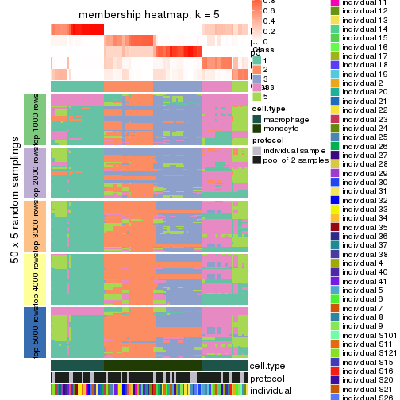</p>

</div>
<div id='tab-MAD-kmeans-membership-heatmap-5'>
<pre><code class="r">membership_heatmap(res, k = 6)
</code></pre>

<p></p>

</div>
</div>

As soon as we have had the classes for columns, we can look for signatures
which are significantly different between classes which can be candidate marks
for certain classes. Following are the heatmaps for signatures.


Signature heatmaps where rows are scaled:


<script>
$( function() {
	$( '#tabs-MAD-kmeans-get-signatures' ).tabs();
} );
</script>
<div id='tabs-MAD-kmeans-get-signatures'>
<ul>
<li><a href='#tab-MAD-kmeans-get-signatures-1'>k = 2</a></li>
<li><a href='#tab-MAD-kmeans-get-signatures-2'>k = 3</a></li>
<li><a href='#tab-MAD-kmeans-get-signatures-3'>k = 4</a></li>
<li><a href='#tab-MAD-kmeans-get-signatures-4'>k = 5</a></li>
<li><a href='#tab-MAD-kmeans-get-signatures-5'>k = 6</a></li>
</ul>
<div id='tab-MAD-kmeans-get-signatures-1'>
<pre><code class="r">get_signatures(res, k = 2)
</code></pre>

<p></p>

</div>
<div id='tab-MAD-kmeans-get-signatures-2'>
<pre><code class="r">get_signatures(res, k = 3)
</code></pre>

<p></p>

</div>
<div id='tab-MAD-kmeans-get-signatures-3'>
<pre><code class="r">get_signatures(res, k = 4)
</code></pre>

<p></p>

</div>
<div id='tab-MAD-kmeans-get-signatures-4'>
<pre><code class="r">get_signatures(res, k = 5)
</code></pre>

<p></p>

</div>
<div id='tab-MAD-kmeans-get-signatures-5'>
<pre><code class="r">get_signatures(res, k = 6)
</code></pre>

<p></p>

</div>
</div>


Signature heatmaps where rows are not scaled:


<script>
$( function() {
	$( '#tabs-MAD-kmeans-get-signatures-no-scale' ).tabs();
} );
</script>
<div id='tabs-MAD-kmeans-get-signatures-no-scale'>
<ul>
<li><a href='#tab-MAD-kmeans-get-signatures-no-scale-1'>k = 2</a></li>
<li><a href='#tab-MAD-kmeans-get-signatures-no-scale-2'>k = 3</a></li>
<li><a href='#tab-MAD-kmeans-get-signatures-no-scale-3'>k = 4</a></li>
<li><a href='#tab-MAD-kmeans-get-signatures-no-scale-4'>k = 5</a></li>
<li><a href='#tab-MAD-kmeans-get-signatures-no-scale-5'>k = 6</a></li>
</ul>
<div id='tab-MAD-kmeans-get-signatures-no-scale-1'>
<pre><code class="r">get_signatures(res, k = 2, scale_rows = FALSE)
</code></pre>

<p></p>

</div>
<div id='tab-MAD-kmeans-get-signatures-no-scale-2'>
<pre><code class="r">get_signatures(res, k = 3, scale_rows = FALSE)
</code></pre>

<p></p>

</div>
<div id='tab-MAD-kmeans-get-signatures-no-scale-3'>
<pre><code class="r">get_signatures(res, k = 4, scale_rows = FALSE)
</code></pre>

<p></p>

</div>
<div id='tab-MAD-kmeans-get-signatures-no-scale-4'>
<pre><code class="r">get_signatures(res, k = 5, scale_rows = FALSE)
</code></pre>

<p></p>

</div>
<div id='tab-MAD-kmeans-get-signatures-no-scale-5'>
<pre><code class="r">get_signatures(res, k = 6, scale_rows = FALSE)
</code></pre>

<p></p>

</div>
</div>


Compare the overlap of signatures from different k:

```r
compare_signatures(res)
```


`get_signature()` returns a data frame invisibly. TO get the list of signatures, the function
call should be assigned to a variable explicitly. In following code, if `plot` argument is set
to `FALSE`, no heatmap is plotted while only the differential analysis is performed.

```r
# code only for demonstration
tb = get_signature(res, k = ..., plot = FALSE)
```

An example of the output of `tb` is:

```
#>   which_row         fdr    mean_1    mean_2 scaled_mean_1 scaled_mean_2 km
#> 1        38 0.042760348  8.373488  9.131774    -0.5533452     0.5164555  1
#> 2        40 0.018707592  7.106213  8.469186    -0.6173731     0.5762149  1
#> 3        55 0.019134737 10.221463 11.207825    -0.6159697     0.5749050  1
#> 4        59 0.006059896  5.921854  7.869574    -0.6899429     0.6439467  1
#> 5        60 0.018055526  8.928898 10.211722    -0.6204761     0.5791110  1
#> 6        98 0.009384629 15.714769 14.887706     0.6635654    -0.6193277  2
...
```

The columns in `tb` are:

1. `which_row`: row indices corresponding to the input matrix.
2. `fdr`: FDR for the differential test. 
3. `mean_x`: The mean value in group x.
4. `scaled_mean_x`: The mean value in group x after rows are scaled.
5. `km`: Row groups if k-means clustering is applied to rows.


UMAP plot which shows how samples are separated.


<script>
$( function() {
	$( '#tabs-MAD-kmeans-dimension-reduction' ).tabs();
} );
</script>
<div id='tabs-MAD-kmeans-dimension-reduction'>
<ul>
<li><a href='#tab-MAD-kmeans-dimension-reduction-1'>k = 2</a></li>
<li><a href='#tab-MAD-kmeans-dimension-reduction-2'>k = 3</a></li>
<li><a href='#tab-MAD-kmeans-dimension-reduction-3'>k = 4</a></li>
<li><a href='#tab-MAD-kmeans-dimension-reduction-4'>k = 5</a></li>
<li><a href='#tab-MAD-kmeans-dimension-reduction-5'>k = 6</a></li>
</ul>
<div id='tab-MAD-kmeans-dimension-reduction-1'>
<pre><code class="r">dimension_reduction(res, k = 2, method = &quot;UMAP&quot;)
</code></pre>

<p></p>

</div>
<div id='tab-MAD-kmeans-dimension-reduction-2'>
<pre><code class="r">dimension_reduction(res, k = 3, method = &quot;UMAP&quot;)
</code></pre>

<p></p>

</div>
<div id='tab-MAD-kmeans-dimension-reduction-3'>
<pre><code class="r">dimension_reduction(res, k = 4, method = &quot;UMAP&quot;)
</code></pre>

<p></p>

</div>
<div id='tab-MAD-kmeans-dimension-reduction-4'>
<pre><code class="r">dimension_reduction(res, k = 5, method = &quot;UMAP&quot;)
</code></pre>

<p></p>

</div>
<div id='tab-MAD-kmeans-dimension-reduction-5'>
<pre><code class="r">dimension_reduction(res, k = 6, method = &quot;UMAP&quot;)
</code></pre>

<p></p>

</div>
</div>


Following heatmap shows how subgroups are split when increasing `k`:

```r
collect_classes(res)
```


Test correlation between subgroups and known annotations. If the known
annotation is numeric, one-way ANOVA test is applied, and if the known
annotation is discrete, chi-squared contingency table test is applied.

```r
test_to_known_factors(res)
```

```
#>             n cell.type(p) protocol(p) individual(p) k
#> MAD:kmeans 96     8.49e-22       1.000         1.000 2
#> MAD:kmeans 94     3.87e-21       0.539         1.000 3
#> MAD:kmeans 72     1.59e-15       0.834         0.983 4
#> MAD:kmeans 83     4.03e-17       0.591         0.982 5
#> MAD:kmeans 74     1.50e-14       0.480         0.777 6
```


If matrix rows can be associated to genes, consider to use `functional_enrichment(res,
...)` to perform function enrichment for the signature genes. See [this vignette](http://bioconductor.org/packages/devel/bioc/vignettes/cola/inst/doc/functional_enrichment.html) for more detailed explanations.


 

---------------------------------------------------


### MAD:skmeans**


The object with results only for a single top-value method and a single partition method 
can be extracted as:

```r
res = res_list["MAD", "skmeans"]
# you can also extract it by
# res = res_list["MAD:skmeans"]
```

A summary of `res` and all the functions that can be applied to it:

```r
res
```

```
#> A 'ConsensusPartition' object with k = 2, 3, 4, 5, 6.
#>   On a matrix with 25171 rows and 96 columns.
#>   Top rows (1000, 2000, 3000, 4000, 5000) are extracted by 'MAD' method.
#>   Subgroups are detected by 'skmeans' method.
#>   Performed in total 1250 partitions by row resampling.
#>   Best k for subgroups seems to be 2.
#> 
#> Following methods can be applied to this 'ConsensusPartition' object:
#>  [1] "cola_report"             "collect_classes"         "collect_plots"          
#>  [4] "collect_stats"           "colnames"                "compare_signatures"     
#>  [7] "consensus_heatmap"       "dimension_reduction"     "functional_enrichment"  
#> [10] "get_anno_col"            "get_anno"                "get_classes"            
#> [13] "get_consensus"           "get_matrix"              "get_membership"         
#> [16] "get_param"               "get_signatures"          "get_stats"              
#> [19] "is_best_k"               "is_stable_k"             "membership_heatmap"     
#> [22] "ncol"                    "nrow"                    "plot_ecdf"              
#> [25] "rownames"                "select_partition_number" "show"                   
#> [28] "suggest_best_k"          "test_to_known_factors"
```

`collect_plots()` function collects all the plots made from `res` for all `k` (number of partitions)
into one single page to provide an easy and fast comparison between different `k`.

```r
collect_plots(res)
```


The plots are:

- The first row: a plot of the ECDF (empirical cumulative distribution
  function) curves of the consensus matrix for each `k` and the heatmap of
  predicted classes for each `k`.
- The second row: heatmaps of the consensus matrix for each `k`.
- The third row: heatmaps of the membership matrix for each `k`.
- The fouth row: heatmaps of the signatures for each `k`.

All the plots in panels can be made by individual functions and they are
plotted later in this section.

`select_partition_number()` produces several plots showing different
statistics for choosing "optimized" `k`. There are following statistics:

- ECDF curves of the consensus matrix for each `k`;
- 1-PAC. [The PAC
  score](https://en.wikipedia.org/wiki/Consensus_clustering#Over-interpretation_potential_of_consensus_clustering)
  measures the proportion of the ambiguous subgrouping.
- Mean silhouette score.
- Concordance. The mean probability of fiting the consensus class ids in all
  partitions.
- Area increased. Denote $A_k$ as the area under the ECDF curve for current
  `k`, the area increased is defined as $A_k - A_{k-1}$.
- Rand index. The percent of pairs of samples that are both in a same cluster
  or both are not in a same cluster in the partition of k and k-1.
- Jaccard index. The ratio of pairs of samples are both in a same cluster in
  the partition of k and k-1 and the pairs of samples are both in a same
  cluster in the partition k or k-1.

The detailed explanations of these statistics can be found in [the _cola_
vignette](http://bioconductor.org/packages/devel/bioc/vignettes/cola/inst/doc/cola.html#toc_13).

Generally speaking, lower PAC score, higher mean silhouette score or higher
concordance corresponds to better partition. Rand index and Jaccard index
measure how similar the current partition is compared to partition with `k-1`.
If they are too similar, we won't accept `k` is better than `k-1`.

```r
select_partition_number(res)
```


The numeric values for all these statistics can be obtained by `get_stats()`.

```r
get_stats(res)
```

```
#>   k 1-PAC mean_silhouette concordance area_increased  Rand Jaccard
#> 2 2 1.000           1.000       1.000         0.5058 0.495   0.495
#> 3 3 0.814           0.972       0.927         0.2268 0.874   0.745
#> 4 4 0.842           0.758       0.861         0.1697 0.923   0.791
#> 5 5 0.872           0.897       0.928         0.0723 0.911   0.705
#> 6 6 0.826           0.769       0.862         0.0347 0.976   0.898
```

`suggest_best_k()` suggests the best $k$ based on these statistics. The rules are as follows:

- All $k$ with Jaccard index larger than 0.95 are removed because increasing
  $k$ does not provide enough extra information. If all $k$ are removed, it is
  marked as no subgroup is detected.
- For all $k$ with 1-PAC score larger than 0.9, the maximal $k$ is taken as
  the best $k$, and other $k$ are marked as optional $k$.
- If it does not fit the second rule. The $k$ with the maximal vote of the
  highest 1-PAC score, highest mean silhouette, and highest concordance is
  taken as the best $k$.

```r
suggest_best_k(res)
```

```
#> [1] 2
```


Following shows the table of the partitions (You need to click the **show/hide
code output** link to see it). The membership matrix (columns with name `p*`)
is inferred by
[`clue::cl_consensus()`](https://www.rdocumentation.org/link/cl_consensus?package=clue)
function with the `SE` method. Basically the value in the membership matrix
represents the probability to belong to a certain group. The finall class
label for an item is determined with the group with highest probability it
belongs to.

In `get_classes()` function, the entropy is calculated from the membership
matrix and the silhouette score is calculated from the consensus matrix.


<script>
$( function() {
	$( '#tabs-MAD-skmeans-get-classes' ).tabs();
} );
</script>
<div id='tabs-MAD-skmeans-get-classes'>
<ul>
<li><a href='#tab-MAD-skmeans-get-classes-1'>k = 2</a></li>
<li><a href='#tab-MAD-skmeans-get-classes-2'>k = 3</a></li>
<li><a href='#tab-MAD-skmeans-get-classes-3'>k = 4</a></li>
<li><a href='#tab-MAD-skmeans-get-classes-4'>k = 5</a></li>
<li><a href='#tab-MAD-skmeans-get-classes-5'>k = 6</a></li>
</ul>

<div id='tab-MAD-skmeans-get-classes-1'>
<p><a id='tab-MAD-skmeans-get-classes-1-a' style='color:#0366d6' href='#'>show/hide code output</a></p>
<pre><code class="r">cbind(get_classes(res, k = 2), get_membership(res, k = 2))
</code></pre>

<pre><code>#&gt;           class entropy silhouette p1 p2
#&gt; GSM257886     1       0          1  1  0
#&gt; GSM257888     1       0          1  1  0
#&gt; GSM257890     1       0          1  1  0
#&gt; GSM257892     1       0          1  1  0
#&gt; GSM257894     1       0          1  1  0
#&gt; GSM257896     1       0          1  1  0
#&gt; GSM257898     1       0          1  1  0
#&gt; GSM257900     1       0          1  1  0
#&gt; GSM257902     1       0          1  1  0
#&gt; GSM257904     1       0          1  1  0
#&gt; GSM257906     1       0          1  1  0
#&gt; GSM257908     1       0          1  1  0
#&gt; GSM257910     1       0          1  1  0
#&gt; GSM257912     1       0          1  1  0
#&gt; GSM257914     1       0          1  1  0
#&gt; GSM257917     1       0          1  1  0
#&gt; GSM257919     1       0          1  1  0
#&gt; GSM257921     1       0          1  1  0
#&gt; GSM257923     1       0          1  1  0
#&gt; GSM257925     1       0          1  1  0
#&gt; GSM257927     1       0          1  1  0
#&gt; GSM257929     1       0          1  1  0
#&gt; GSM257937     1       0          1  1  0
#&gt; GSM257939     1       0          1  1  0
#&gt; GSM257941     1       0          1  1  0
#&gt; GSM257943     1       0          1  1  0
#&gt; GSM257945     1       0          1  1  0
#&gt; GSM257947     1       0          1  1  0
#&gt; GSM257949     1       0          1  1  0
#&gt; GSM257951     1       0          1  1  0
#&gt; GSM257953     1       0          1  1  0
#&gt; GSM257955     1       0          1  1  0
#&gt; GSM257958     1       0          1  1  0
#&gt; GSM257960     1       0          1  1  0
#&gt; GSM257962     1       0          1  1  0
#&gt; GSM257964     1       0          1  1  0
#&gt; GSM257966     1       0          1  1  0
#&gt; GSM257968     1       0          1  1  0
#&gt; GSM257970     1       0          1  1  0
#&gt; GSM257972     1       0          1  1  0
#&gt; GSM257977     1       0          1  1  0
#&gt; GSM257982     1       0          1  1  0
#&gt; GSM257984     1       0          1  1  0
#&gt; GSM257986     1       0          1  1  0
#&gt; GSM257990     1       0          1  1  0
#&gt; GSM257992     1       0          1  1  0
#&gt; GSM257996     1       0          1  1  0
#&gt; GSM258006     1       0          1  1  0
#&gt; GSM257887     2       0          1  0  1
#&gt; GSM257889     2       0          1  0  1
#&gt; GSM257891     2       0          1  0  1
#&gt; GSM257893     2       0          1  0  1
#&gt; GSM257895     2       0          1  0  1
#&gt; GSM257897     2       0          1  0  1
#&gt; GSM257899     2       0          1  0  1
#&gt; GSM257901     2       0          1  0  1
#&gt; GSM257903     2       0          1  0  1
#&gt; GSM257905     2       0          1  0  1
#&gt; GSM257907     2       0          1  0  1
#&gt; GSM257909     2       0          1  0  1
#&gt; GSM257911     2       0          1  0  1
#&gt; GSM257913     2       0          1  0  1
#&gt; GSM257916     2       0          1  0  1
#&gt; GSM257918     2       0          1  0  1
#&gt; GSM257920     2       0          1  0  1
#&gt; GSM257922     2       0          1  0  1
#&gt; GSM257924     2       0          1  0  1
#&gt; GSM257926     2       0          1  0  1
#&gt; GSM257928     2       0          1  0  1
#&gt; GSM257930     2       0          1  0  1
#&gt; GSM257938     2       0          1  0  1
#&gt; GSM257940     2       0          1  0  1
#&gt; GSM257942     2       0          1  0  1
#&gt; GSM257944     2       0          1  0  1
#&gt; GSM257946     2       0          1  0  1
#&gt; GSM257948     2       0          1  0  1
#&gt; GSM257950     2       0          1  0  1
#&gt; GSM257952     2       0          1  0  1
#&gt; GSM257954     2       0          1  0  1
#&gt; GSM257956     2       0          1  0  1
#&gt; GSM257959     2       0          1  0  1
#&gt; GSM257961     2       0          1  0  1
#&gt; GSM257963     2       0          1  0  1
#&gt; GSM257965     2       0          1  0  1
#&gt; GSM257967     2       0          1  0  1
#&gt; GSM257969     2       0          1  0  1
#&gt; GSM257971     2       0          1  0  1
#&gt; GSM257973     2       0          1  0  1
#&gt; GSM257981     2       0          1  0  1
#&gt; GSM257983     2       0          1  0  1
#&gt; GSM257985     2       0          1  0  1
#&gt; GSM257988     2       0          1  0  1
#&gt; GSM257991     2       0          1  0  1
#&gt; GSM257993     2       0          1  0  1
#&gt; GSM257994     2       0          1  0  1
#&gt; GSM257989     2       0          1  0  1
</code></pre>

<script>
$('#tab-MAD-skmeans-get-classes-1-a').parent().next().next().hide();
$('#tab-MAD-skmeans-get-classes-1-a').click(function(){
  $('#tab-MAD-skmeans-get-classes-1-a').parent().next().next().toggle();
  return(false);
});
</script>
</div>

<div id='tab-MAD-skmeans-get-classes-2'>
<p><a id='tab-MAD-skmeans-get-classes-2-a' style='color:#0366d6' href='#'>show/hide code output</a></p>
<pre><code class="r">cbind(get_classes(res, k = 3), get_membership(res, k = 3))
</code></pre>

<pre><code>#&gt;           class entropy silhouette    p1    p2    p3
#&gt; GSM257886     1  0.4750      0.841 0.784 0.000 0.216
#&gt; GSM257888     1  0.0592      0.965 0.988 0.000 0.012
#&gt; GSM257890     1  0.1860      0.947 0.948 0.000 0.052
#&gt; GSM257892     1  0.4750      0.841 0.784 0.000 0.216
#&gt; GSM257894     1  0.0592      0.965 0.988 0.000 0.012
#&gt; GSM257896     1  0.0592      0.965 0.988 0.000 0.012
#&gt; GSM257898     1  0.4605      0.843 0.796 0.000 0.204
#&gt; GSM257900     1  0.0000      0.967 1.000 0.000 0.000
#&gt; GSM257902     1  0.0000      0.967 1.000 0.000 0.000
#&gt; GSM257904     1  0.4605      0.843 0.796 0.000 0.204
#&gt; GSM257906     1  0.4605      0.843 0.796 0.000 0.204
#&gt; GSM257908     1  0.0592      0.965 0.988 0.000 0.012
#&gt; GSM257910     1  0.0592      0.965 0.988 0.000 0.012
#&gt; GSM257912     1  0.0592      0.965 0.988 0.000 0.012
#&gt; GSM257914     1  0.0592      0.965 0.988 0.000 0.012
#&gt; GSM257917     1  0.0592      0.965 0.988 0.000 0.012
#&gt; GSM257919     1  0.0592      0.965 0.988 0.000 0.012
#&gt; GSM257921     1  0.0000      0.967 1.000 0.000 0.000
#&gt; GSM257923     1  0.0000      0.967 1.000 0.000 0.000
#&gt; GSM257925     1  0.0000      0.967 1.000 0.000 0.000
#&gt; GSM257927     1  0.0000      0.967 1.000 0.000 0.000
#&gt; GSM257929     1  0.0000      0.967 1.000 0.000 0.000
#&gt; GSM257937     1  0.0592      0.965 0.988 0.000 0.012
#&gt; GSM257939     1  0.0000      0.967 1.000 0.000 0.000
#&gt; GSM257941     1  0.0000      0.967 1.000 0.000 0.000
#&gt; GSM257943     1  0.4605      0.843 0.796 0.000 0.204
#&gt; GSM257945     1  0.0592      0.963 0.988 0.000 0.012
#&gt; GSM257947     1  0.0000      0.967 1.000 0.000 0.000
#&gt; GSM257949     1  0.0000      0.967 1.000 0.000 0.000
#&gt; GSM257951     1  0.0000      0.967 1.000 0.000 0.000
#&gt; GSM257953     1  0.0000      0.967 1.000 0.000 0.000
#&gt; GSM257955     1  0.0000      0.967 1.000 0.000 0.000
#&gt; GSM257958     1  0.0000      0.967 1.000 0.000 0.000
#&gt; GSM257960     1  0.0000      0.967 1.000 0.000 0.000
#&gt; GSM257962     1  0.0000      0.967 1.000 0.000 0.000
#&gt; GSM257964     1  0.0000      0.967 1.000 0.000 0.000
#&gt; GSM257966     1  0.0592      0.965 0.988 0.000 0.012
#&gt; GSM257968     1  0.0592      0.965 0.988 0.000 0.012
#&gt; GSM257970     1  0.0000      0.967 1.000 0.000 0.000
#&gt; GSM257972     1  0.0000      0.967 1.000 0.000 0.000
#&gt; GSM257977     1  0.0592      0.965 0.988 0.000 0.012
#&gt; GSM257982     1  0.0592      0.965 0.988 0.000 0.012
#&gt; GSM257984     1  0.0000      0.967 1.000 0.000 0.000
#&gt; GSM257986     1  0.0000      0.967 1.000 0.000 0.000
#&gt; GSM257990     1  0.0000      0.967 1.000 0.000 0.000
#&gt; GSM257992     1  0.4605      0.843 0.796 0.000 0.204
#&gt; GSM257996     1  0.0000      0.967 1.000 0.000 0.000
#&gt; GSM258006     1  0.4605      0.843 0.796 0.000 0.204
#&gt; GSM257887     2  0.0000      1.000 0.000 1.000 0.000
#&gt; GSM257889     3  0.4750      1.000 0.000 0.216 0.784
#&gt; GSM257891     3  0.4750      1.000 0.000 0.216 0.784
#&gt; GSM257893     3  0.4750      1.000 0.000 0.216 0.784
#&gt; GSM257895     2  0.0000      1.000 0.000 1.000 0.000
#&gt; GSM257897     3  0.4750      1.000 0.000 0.216 0.784
#&gt; GSM257899     3  0.4750      1.000 0.000 0.216 0.784
#&gt; GSM257901     3  0.4750      1.000 0.000 0.216 0.784
#&gt; GSM257903     2  0.0000      1.000 0.000 1.000 0.000
#&gt; GSM257905     2  0.0000      1.000 0.000 1.000 0.000
#&gt; GSM257907     3  0.4750      1.000 0.000 0.216 0.784
#&gt; GSM257909     2  0.0000      1.000 0.000 1.000 0.000
#&gt; GSM257911     3  0.4750      1.000 0.000 0.216 0.784
#&gt; GSM257913     3  0.4750      1.000 0.000 0.216 0.784
#&gt; GSM257916     2  0.0000      1.000 0.000 1.000 0.000
#&gt; GSM257918     2  0.0000      1.000 0.000 1.000 0.000
#&gt; GSM257920     3  0.4750      1.000 0.000 0.216 0.784
#&gt; GSM257922     3  0.4750      1.000 0.000 0.216 0.784
#&gt; GSM257924     3  0.4750      1.000 0.000 0.216 0.784
#&gt; GSM257926     3  0.4750      1.000 0.000 0.216 0.784
#&gt; GSM257928     2  0.0000      1.000 0.000 1.000 0.000
#&gt; GSM257930     2  0.0000      1.000 0.000 1.000 0.000
#&gt; GSM257938     2  0.0000      1.000 0.000 1.000 0.000
#&gt; GSM257940     3  0.4750      1.000 0.000 0.216 0.784
#&gt; GSM257942     2  0.0000      1.000 0.000 1.000 0.000
#&gt; GSM257944     2  0.0000      1.000 0.000 1.000 0.000
#&gt; GSM257946     3  0.4750      1.000 0.000 0.216 0.784
#&gt; GSM257948     3  0.4750      1.000 0.000 0.216 0.784
#&gt; GSM257950     3  0.4750      1.000 0.000 0.216 0.784
#&gt; GSM257952     2  0.0237      0.995 0.000 0.996 0.004
#&gt; GSM257954     2  0.0000      1.000 0.000 1.000 0.000
#&gt; GSM257956     2  0.0000      1.000 0.000 1.000 0.000
#&gt; GSM257959     2  0.0000      1.000 0.000 1.000 0.000
#&gt; GSM257961     2  0.0000      1.000 0.000 1.000 0.000
#&gt; GSM257963     2  0.0000      1.000 0.000 1.000 0.000
#&gt; GSM257965     2  0.0000      1.000 0.000 1.000 0.000
#&gt; GSM257967     2  0.0000      1.000 0.000 1.000 0.000
#&gt; GSM257969     2  0.0000      1.000 0.000 1.000 0.000
#&gt; GSM257971     3  0.4750      1.000 0.000 0.216 0.784
#&gt; GSM257973     3  0.4750      1.000 0.000 0.216 0.784
#&gt; GSM257981     2  0.0237      0.995 0.000 0.996 0.004
#&gt; GSM257983     3  0.4750      1.000 0.000 0.216 0.784
#&gt; GSM257985     3  0.4750      1.000 0.000 0.216 0.784
#&gt; GSM257988     3  0.4750      1.000 0.000 0.216 0.784
#&gt; GSM257991     2  0.0000      1.000 0.000 1.000 0.000
#&gt; GSM257993     2  0.0000      1.000 0.000 1.000 0.000
#&gt; GSM257994     2  0.0000      1.000 0.000 1.000 0.000
#&gt; GSM257989     3  0.4750      1.000 0.000 0.216 0.784
</code></pre>

<script>
$('#tab-MAD-skmeans-get-classes-2-a').parent().next().next().hide();
$('#tab-MAD-skmeans-get-classes-2-a').click(function(){
  $('#tab-MAD-skmeans-get-classes-2-a').parent().next().next().toggle();
  return(false);
});
</script>
</div>

<div id='tab-MAD-skmeans-get-classes-3'>
<p><a id='tab-MAD-skmeans-get-classes-3-a' style='color:#0366d6' href='#'>show/hide code output</a></p>
<pre><code class="r">cbind(get_classes(res, k = 4), get_membership(res, k = 4))
</code></pre>

<pre><code>#&gt;           class entropy silhouette    p1    p2    p3    p4
#&gt; GSM257886     4  0.1042      0.374 0.020 0.000 0.008 0.972
#&gt; GSM257888     1  0.4977      0.441 0.540 0.000 0.000 0.460
#&gt; GSM257890     4  0.5088     -0.332 0.424 0.000 0.004 0.572
#&gt; GSM257892     4  0.1042      0.374 0.020 0.000 0.008 0.972
#&gt; GSM257894     1  0.4977      0.441 0.540 0.000 0.000 0.460
#&gt; GSM257896     1  0.4977      0.441 0.540 0.000 0.000 0.460
#&gt; GSM257898     4  0.5288      0.649 0.472 0.000 0.008 0.520
#&gt; GSM257900     1  0.2530      0.516 0.888 0.000 0.000 0.112
#&gt; GSM257902     1  0.0000      0.653 1.000 0.000 0.000 0.000
#&gt; GSM257904     4  0.5288      0.649 0.472 0.000 0.008 0.520
#&gt; GSM257906     4  0.5288      0.649 0.472 0.000 0.008 0.520
#&gt; GSM257908     1  0.5137      0.446 0.544 0.000 0.004 0.452
#&gt; GSM257910     1  0.5137      0.446 0.544 0.000 0.004 0.452
#&gt; GSM257912     1  0.5143      0.444 0.540 0.000 0.004 0.456
#&gt; GSM257914     1  0.5143      0.444 0.540 0.000 0.004 0.456
#&gt; GSM257917     1  0.5143      0.444 0.540 0.000 0.004 0.456
#&gt; GSM257919     1  0.5143      0.444 0.540 0.000 0.004 0.456
#&gt; GSM257921     1  0.1209      0.640 0.964 0.000 0.004 0.032
#&gt; GSM257923     1  0.0000      0.653 1.000 0.000 0.000 0.000
#&gt; GSM257925     1  0.0000      0.653 1.000 0.000 0.000 0.000
#&gt; GSM257927     1  0.2469      0.523 0.892 0.000 0.000 0.108
#&gt; GSM257929     1  0.0000      0.653 1.000 0.000 0.000 0.000
#&gt; GSM257937     1  0.5151      0.437 0.532 0.000 0.004 0.464
#&gt; GSM257939     1  0.0000      0.653 1.000 0.000 0.000 0.000
#&gt; GSM257941     1  0.2530      0.516 0.888 0.000 0.000 0.112
#&gt; GSM257943     4  0.5161      0.644 0.476 0.000 0.004 0.520
#&gt; GSM257945     1  0.2868      0.467 0.864 0.000 0.000 0.136
#&gt; GSM257947     1  0.0000      0.653 1.000 0.000 0.000 0.000
#&gt; GSM257949     1  0.0000      0.653 1.000 0.000 0.000 0.000
#&gt; GSM257951     1  0.0000      0.653 1.000 0.000 0.000 0.000
#&gt; GSM257953     1  0.0000      0.653 1.000 0.000 0.000 0.000
#&gt; GSM257955     1  0.0000      0.653 1.000 0.000 0.000 0.000
#&gt; GSM257958     1  0.0000      0.653 1.000 0.000 0.000 0.000
#&gt; GSM257960     1  0.2469      0.523 0.892 0.000 0.000 0.108
#&gt; GSM257962     1  0.2469      0.523 0.892 0.000 0.000 0.108
#&gt; GSM257964     1  0.0000      0.653 1.000 0.000 0.000 0.000
#&gt; GSM257966     1  0.5147      0.439 0.536 0.000 0.004 0.460
#&gt; GSM257968     1  0.4955      0.449 0.556 0.000 0.000 0.444
#&gt; GSM257970     1  0.0000      0.653 1.000 0.000 0.000 0.000
#&gt; GSM257972     1  0.0000      0.653 1.000 0.000 0.000 0.000
#&gt; GSM257977     1  0.4977      0.441 0.540 0.000 0.000 0.460
#&gt; GSM257982     1  0.4955      0.449 0.556 0.000 0.000 0.444
#&gt; GSM257984     1  0.0000      0.653 1.000 0.000 0.000 0.000
#&gt; GSM257986     1  0.0000      0.653 1.000 0.000 0.000 0.000
#&gt; GSM257990     1  0.2011      0.560 0.920 0.000 0.000 0.080
#&gt; GSM257992     4  0.5288      0.649 0.472 0.000 0.008 0.520
#&gt; GSM257996     1  0.0895      0.634 0.976 0.000 0.004 0.020
#&gt; GSM258006     4  0.5281      0.646 0.464 0.000 0.008 0.528
#&gt; GSM257887     2  0.0000      0.977 0.000 1.000 0.000 0.000
#&gt; GSM257889     3  0.0817      0.987 0.000 0.024 0.976 0.000
#&gt; GSM257891     3  0.0469      0.992 0.000 0.012 0.988 0.000
#&gt; GSM257893     3  0.1004      0.986 0.000 0.024 0.972 0.004
#&gt; GSM257895     2  0.0469      0.975 0.000 0.988 0.000 0.012
#&gt; GSM257897     3  0.1004      0.986 0.000 0.024 0.972 0.004
#&gt; GSM257899     3  0.1004      0.986 0.000 0.024 0.972 0.004
#&gt; GSM257901     3  0.0657      0.991 0.000 0.012 0.984 0.004
#&gt; GSM257903     2  0.0469      0.978 0.000 0.988 0.012 0.000
#&gt; GSM257905     2  0.0469      0.978 0.000 0.988 0.012 0.000
#&gt; GSM257907     3  0.0657      0.991 0.000 0.012 0.984 0.004
#&gt; GSM257909     2  0.0469      0.978 0.000 0.988 0.012 0.000
#&gt; GSM257911     3  0.1109      0.980 0.000 0.028 0.968 0.004
#&gt; GSM257913     3  0.1305      0.972 0.000 0.036 0.960 0.004
#&gt; GSM257916     2  0.0469      0.978 0.000 0.988 0.012 0.000
#&gt; GSM257918     2  0.0469      0.978 0.000 0.988 0.012 0.000
#&gt; GSM257920     3  0.0469      0.992 0.000 0.012 0.988 0.000
#&gt; GSM257922     3  0.1004      0.986 0.000 0.024 0.972 0.004
#&gt; GSM257924     3  0.1022      0.983 0.000 0.032 0.968 0.000
#&gt; GSM257926     3  0.0469      0.992 0.000 0.012 0.988 0.000
#&gt; GSM257928     2  0.0779      0.972 0.000 0.980 0.004 0.016
#&gt; GSM257930     2  0.0592      0.973 0.000 0.984 0.000 0.016
#&gt; GSM257938     2  0.0592      0.973 0.000 0.984 0.000 0.016
#&gt; GSM257940     3  0.0657      0.991 0.000 0.012 0.984 0.004
#&gt; GSM257942     2  0.0469      0.978 0.000 0.988 0.012 0.000
#&gt; GSM257944     2  0.0469      0.978 0.000 0.988 0.012 0.000
#&gt; GSM257946     3  0.0469      0.992 0.000 0.012 0.988 0.000
#&gt; GSM257948     3  0.0469      0.992 0.000 0.012 0.988 0.000
#&gt; GSM257950     3  0.0469      0.992 0.000 0.012 0.988 0.000
#&gt; GSM257952     2  0.2999      0.856 0.000 0.864 0.132 0.004
#&gt; GSM257954     2  0.0469      0.975 0.000 0.988 0.000 0.012
#&gt; GSM257956     2  0.0188      0.976 0.000 0.996 0.000 0.004
#&gt; GSM257959     2  0.0469      0.978 0.000 0.988 0.012 0.000
#&gt; GSM257961     2  0.0188      0.978 0.000 0.996 0.004 0.000
#&gt; GSM257963     2  0.0336      0.978 0.000 0.992 0.008 0.000
#&gt; GSM257965     2  0.0657      0.977 0.000 0.984 0.012 0.004
#&gt; GSM257967     2  0.0469      0.978 0.000 0.988 0.012 0.000
#&gt; GSM257969     2  0.0188      0.976 0.000 0.996 0.000 0.004
#&gt; GSM257971     3  0.1151      0.986 0.000 0.024 0.968 0.008
#&gt; GSM257973     3  0.0657      0.991 0.000 0.012 0.984 0.004
#&gt; GSM257981     2  0.3157      0.842 0.000 0.852 0.144 0.004
#&gt; GSM257983     3  0.0657      0.991 0.000 0.012 0.984 0.004
#&gt; GSM257985     3  0.0657      0.991 0.000 0.012 0.984 0.004
#&gt; GSM257988     3  0.0657      0.991 0.000 0.012 0.984 0.004
#&gt; GSM257991     2  0.0895      0.972 0.000 0.976 0.020 0.004
#&gt; GSM257993     2  0.0469      0.975 0.000 0.988 0.000 0.012
#&gt; GSM257994     2  0.0592      0.973 0.000 0.984 0.000 0.016
#&gt; GSM257989     3  0.0469      0.992 0.000 0.012 0.988 0.000
</code></pre>

<script>
$('#tab-MAD-skmeans-get-classes-3-a').parent().next().next().hide();
$('#tab-MAD-skmeans-get-classes-3-a').click(function(){
  $('#tab-MAD-skmeans-get-classes-3-a').parent().next().next().toggle();
  return(false);
});
</script>
</div>

<div id='tab-MAD-skmeans-get-classes-4'>
<p><a id='tab-MAD-skmeans-get-classes-4-a' style='color:#0366d6' href='#'>show/hide code output</a></p>
<pre><code class="r">cbind(get_classes(res, k = 5), get_membership(res, k = 5))
</code></pre>

<pre><code>#&gt;           class entropy silhouette    p1    p2    p3    p4    p5
#&gt; GSM257886     5  0.2127     0.8184 0.000 0.000 0.000 0.108 0.892
#&gt; GSM257888     4  0.3565     0.8559 0.144 0.000 0.000 0.816 0.040
#&gt; GSM257890     4  0.2719     0.8466 0.048 0.000 0.000 0.884 0.068
#&gt; GSM257892     5  0.2074     0.8226 0.000 0.000 0.000 0.104 0.896
#&gt; GSM257894     4  0.3922     0.8382 0.180 0.000 0.000 0.780 0.040
#&gt; GSM257896     4  0.3771     0.8467 0.164 0.000 0.000 0.796 0.040
#&gt; GSM257898     5  0.2127     0.9227 0.108 0.000 0.000 0.000 0.892
#&gt; GSM257900     1  0.2900     0.8590 0.864 0.000 0.000 0.028 0.108
#&gt; GSM257902     1  0.0000     0.9174 1.000 0.000 0.000 0.000 0.000
#&gt; GSM257904     5  0.2286     0.9204 0.108 0.000 0.000 0.004 0.888
#&gt; GSM257906     5  0.2127     0.9227 0.108 0.000 0.000 0.000 0.892
#&gt; GSM257908     4  0.1908     0.8748 0.092 0.000 0.000 0.908 0.000
#&gt; GSM257910     4  0.1908     0.8748 0.092 0.000 0.000 0.908 0.000
#&gt; GSM257912     4  0.1768     0.8715 0.072 0.000 0.000 0.924 0.004
#&gt; GSM257914     4  0.1768     0.8715 0.072 0.000 0.000 0.924 0.004
#&gt; GSM257917     4  0.1768     0.8715 0.072 0.000 0.000 0.924 0.004
#&gt; GSM257919     4  0.1768     0.8715 0.072 0.000 0.000 0.924 0.004
#&gt; GSM257921     1  0.4384     0.4930 0.660 0.000 0.000 0.324 0.016
#&gt; GSM257923     1  0.0000     0.9174 1.000 0.000 0.000 0.000 0.000
#&gt; GSM257925     1  0.0324     0.9164 0.992 0.000 0.000 0.004 0.004
#&gt; GSM257927     1  0.2740     0.8665 0.876 0.000 0.000 0.028 0.096
#&gt; GSM257929     1  0.0162     0.9167 0.996 0.000 0.000 0.000 0.004
#&gt; GSM257937     4  0.2569     0.8670 0.068 0.000 0.000 0.892 0.040
#&gt; GSM257939     1  0.0000     0.9174 1.000 0.000 0.000 0.000 0.000
#&gt; GSM257941     1  0.2900     0.8582 0.864 0.000 0.000 0.028 0.108
#&gt; GSM257943     1  0.4829     0.0265 0.500 0.000 0.000 0.020 0.480
#&gt; GSM257945     1  0.3002     0.8506 0.856 0.000 0.000 0.028 0.116
#&gt; GSM257947     1  0.0000     0.9174 1.000 0.000 0.000 0.000 0.000
#&gt; GSM257949     1  0.0000     0.9174 1.000 0.000 0.000 0.000 0.000
#&gt; GSM257951     1  0.0000     0.9174 1.000 0.000 0.000 0.000 0.000
#&gt; GSM257953     1  0.0162     0.9167 0.996 0.000 0.000 0.000 0.004
#&gt; GSM257955     1  0.0000     0.9174 1.000 0.000 0.000 0.000 0.000
#&gt; GSM257958     1  0.0451     0.9153 0.988 0.000 0.000 0.008 0.004
#&gt; GSM257960     1  0.2848     0.8611 0.868 0.000 0.000 0.028 0.104
#&gt; GSM257962     1  0.2740     0.8665 0.876 0.000 0.000 0.028 0.096
#&gt; GSM257964     1  0.0000     0.9174 1.000 0.000 0.000 0.000 0.000
#&gt; GSM257966     4  0.2136     0.8755 0.088 0.000 0.000 0.904 0.008
#&gt; GSM257968     4  0.5103     0.4497 0.452 0.000 0.000 0.512 0.036
#&gt; GSM257970     1  0.0000     0.9174 1.000 0.000 0.000 0.000 0.000
#&gt; GSM257972     1  0.0290     0.9158 0.992 0.000 0.000 0.008 0.000
#&gt; GSM257977     4  0.3810     0.8444 0.168 0.000 0.000 0.792 0.040
#&gt; GSM257982     4  0.5161     0.4609 0.444 0.000 0.000 0.516 0.040
#&gt; GSM257984     1  0.0000     0.9174 1.000 0.000 0.000 0.000 0.000
#&gt; GSM257986     1  0.0000     0.9174 1.000 0.000 0.000 0.000 0.000
#&gt; GSM257990     1  0.2124     0.8879 0.916 0.000 0.000 0.028 0.056
#&gt; GSM257992     5  0.2127     0.9227 0.108 0.000 0.000 0.000 0.892
#&gt; GSM257996     1  0.3471     0.8322 0.836 0.000 0.000 0.092 0.072
#&gt; GSM258006     5  0.1608     0.9107 0.072 0.000 0.000 0.000 0.928
#&gt; GSM257887     2  0.0566     0.9548 0.000 0.984 0.000 0.012 0.004
#&gt; GSM257889     3  0.0324     0.9756 0.000 0.000 0.992 0.004 0.004
#&gt; GSM257891     3  0.0162     0.9763 0.000 0.000 0.996 0.004 0.000
#&gt; GSM257893     3  0.1710     0.9528 0.000 0.012 0.944 0.020 0.024
#&gt; GSM257895     2  0.2278     0.9316 0.000 0.908 0.000 0.060 0.032
#&gt; GSM257897     3  0.0693     0.9722 0.000 0.000 0.980 0.008 0.012
#&gt; GSM257899     3  0.0693     0.9722 0.000 0.000 0.980 0.008 0.012
#&gt; GSM257901     3  0.0451     0.9757 0.000 0.004 0.988 0.000 0.008
#&gt; GSM257903     2  0.0000     0.9572 0.000 1.000 0.000 0.000 0.000
#&gt; GSM257905     2  0.0000     0.9572 0.000 1.000 0.000 0.000 0.000
#&gt; GSM257907     3  0.0451     0.9757 0.000 0.004 0.988 0.000 0.008
#&gt; GSM257909     2  0.0000     0.9572 0.000 1.000 0.000 0.000 0.000
#&gt; GSM257911     3  0.2077     0.9094 0.000 0.084 0.908 0.000 0.008
#&gt; GSM257913     3  0.2074     0.8904 0.000 0.104 0.896 0.000 0.000
#&gt; GSM257916     2  0.0000     0.9572 0.000 1.000 0.000 0.000 0.000
#&gt; GSM257918     2  0.0000     0.9572 0.000 1.000 0.000 0.000 0.000
#&gt; GSM257920     3  0.0404     0.9753 0.000 0.012 0.988 0.000 0.000
#&gt; GSM257922     3  0.1493     0.9543 0.000 0.000 0.948 0.024 0.028
#&gt; GSM257924     3  0.1365     0.9537 0.000 0.040 0.952 0.004 0.004
#&gt; GSM257926     3  0.0404     0.9753 0.000 0.012 0.988 0.000 0.000
#&gt; GSM257928     2  0.3145     0.9102 0.000 0.868 0.008 0.064 0.060
#&gt; GSM257930     2  0.2863     0.9147 0.000 0.876 0.000 0.064 0.060
#&gt; GSM257938     2  0.2863     0.9147 0.000 0.876 0.000 0.064 0.060
#&gt; GSM257940     3  0.0451     0.9757 0.000 0.004 0.988 0.000 0.008
#&gt; GSM257942     2  0.0000     0.9572 0.000 1.000 0.000 0.000 0.000
#&gt; GSM257944     2  0.0000     0.9572 0.000 1.000 0.000 0.000 0.000
#&gt; GSM257946     3  0.0000     0.9767 0.000 0.000 1.000 0.000 0.000
#&gt; GSM257948     3  0.0404     0.9753 0.000 0.012 0.988 0.000 0.000
#&gt; GSM257950     3  0.0000     0.9767 0.000 0.000 1.000 0.000 0.000
#&gt; GSM257952     2  0.2352     0.8780 0.000 0.896 0.092 0.004 0.008
#&gt; GSM257954     2  0.1915     0.9394 0.000 0.928 0.000 0.040 0.032
#&gt; GSM257956     2  0.1493     0.9464 0.000 0.948 0.000 0.024 0.028
#&gt; GSM257959     2  0.0000     0.9572 0.000 1.000 0.000 0.000 0.000
#&gt; GSM257961     2  0.0000     0.9572 0.000 1.000 0.000 0.000 0.000
#&gt; GSM257963     2  0.0000     0.9572 0.000 1.000 0.000 0.000 0.000
#&gt; GSM257965     2  0.0290     0.9544 0.000 0.992 0.000 0.000 0.008
#&gt; GSM257967     2  0.0000     0.9572 0.000 1.000 0.000 0.000 0.000
#&gt; GSM257969     2  0.1493     0.9464 0.000 0.948 0.000 0.024 0.028
#&gt; GSM257971     3  0.1471     0.9609 0.000 0.004 0.952 0.024 0.020
#&gt; GSM257973     3  0.0162     0.9767 0.000 0.004 0.996 0.000 0.000
#&gt; GSM257981     2  0.2660     0.8350 0.000 0.864 0.128 0.000 0.008
#&gt; GSM257983     3  0.0162     0.9763 0.000 0.000 0.996 0.004 0.000
#&gt; GSM257985     3  0.0000     0.9767 0.000 0.000 1.000 0.000 0.000
#&gt; GSM257988     3  0.0162     0.9767 0.000 0.004 0.996 0.000 0.000
#&gt; GSM257991     2  0.0451     0.9525 0.000 0.988 0.004 0.000 0.008
#&gt; GSM257993     2  0.2067     0.9365 0.000 0.920 0.000 0.048 0.032
#&gt; GSM257994     2  0.2863     0.9147 0.000 0.876 0.000 0.064 0.060
#&gt; GSM257989     3  0.0000     0.9767 0.000 0.000 1.000 0.000 0.000
</code></pre>

<script>
$('#tab-MAD-skmeans-get-classes-4-a').parent().next().next().hide();
$('#tab-MAD-skmeans-get-classes-4-a').click(function(){
  $('#tab-MAD-skmeans-get-classes-4-a').parent().next().next().toggle();
  return(false);
});
</script>
</div>

<div id='tab-MAD-skmeans-get-classes-5'>
<p><a id='tab-MAD-skmeans-get-classes-5-a' style='color:#0366d6' href='#'>show/hide code output</a></p>
<pre><code class="r">cbind(get_classes(res, k = 6), get_membership(res, k = 6))
</code></pre>

<pre><code>#&gt;           class entropy silhouette    p1    p2    p3    p4 p5    p6
#&gt; GSM257886     6  0.2704      0.747 0.000 0.000 0.000 0.016 NA 0.844
#&gt; GSM257888     4  0.6053      0.681 0.168 0.000 0.000 0.480 NA 0.016
#&gt; GSM257890     4  0.4405      0.724 0.008 0.000 0.000 0.604 NA 0.020
#&gt; GSM257892     6  0.2744      0.744 0.000 0.000 0.000 0.016 NA 0.840
#&gt; GSM257894     4  0.6189      0.659 0.200 0.000 0.000 0.464 NA 0.016
#&gt; GSM257896     4  0.6126      0.671 0.184 0.000 0.000 0.472 NA 0.016
#&gt; GSM257898     6  0.0993      0.832 0.024 0.000 0.000 0.000 NA 0.964
#&gt; GSM257900     1  0.3529      0.713 0.764 0.000 0.000 0.000 NA 0.208
#&gt; GSM257902     1  0.0146      0.846 0.996 0.000 0.000 0.000 NA 0.000
#&gt; GSM257904     6  0.1088      0.830 0.024 0.000 0.000 0.000 NA 0.960
#&gt; GSM257906     6  0.0632      0.834 0.024 0.000 0.000 0.000 NA 0.976
#&gt; GSM257908     4  0.0363      0.749 0.012 0.000 0.000 0.988 NA 0.000
#&gt; GSM257910     4  0.0363      0.749 0.012 0.000 0.000 0.988 NA 0.000
#&gt; GSM257912     4  0.0363      0.749 0.012 0.000 0.000 0.988 NA 0.000
#&gt; GSM257914     4  0.0363      0.749 0.012 0.000 0.000 0.988 NA 0.000
#&gt; GSM257917     4  0.0363      0.749 0.012 0.000 0.000 0.988 NA 0.000
#&gt; GSM257919     4  0.0363      0.749 0.012 0.000 0.000 0.988 NA 0.000
#&gt; GSM257921     1  0.4734      0.564 0.660 0.000 0.000 0.272 NA 0.052
#&gt; GSM257923     1  0.0146      0.846 0.996 0.000 0.000 0.000 NA 0.000
#&gt; GSM257925     1  0.0458      0.843 0.984 0.000 0.000 0.000 NA 0.000
#&gt; GSM257927     1  0.3377      0.732 0.784 0.000 0.000 0.000 NA 0.188
#&gt; GSM257929     1  0.0363      0.844 0.988 0.000 0.000 0.000 NA 0.000
#&gt; GSM257937     4  0.4179      0.739 0.008 0.000 0.000 0.652 NA 0.016
#&gt; GSM257939     1  0.0146      0.846 0.996 0.000 0.000 0.000 NA 0.000
#&gt; GSM257941     1  0.3500      0.717 0.768 0.000 0.000 0.000 NA 0.204
#&gt; GSM257943     6  0.4473     -0.178 0.480 0.000 0.000 0.000 NA 0.492
#&gt; GSM257945     1  0.3440      0.725 0.776 0.000 0.000 0.000 NA 0.196
#&gt; GSM257947     1  0.0146      0.846 0.996 0.000 0.000 0.000 NA 0.000
#&gt; GSM257949     1  0.0146      0.846 0.996 0.000 0.000 0.000 NA 0.000
#&gt; GSM257951     1  0.0146      0.846 0.996 0.000 0.000 0.000 NA 0.000
#&gt; GSM257953     1  0.0260      0.845 0.992 0.000 0.000 0.000 NA 0.000
#&gt; GSM257955     1  0.0146      0.846 0.996 0.000 0.000 0.000 NA 0.000
#&gt; GSM257958     1  0.0458      0.843 0.984 0.000 0.000 0.000 NA 0.000
#&gt; GSM257960     1  0.3440      0.725 0.776 0.000 0.000 0.000 NA 0.196
#&gt; GSM257962     1  0.3377      0.732 0.784 0.000 0.000 0.000 NA 0.188
#&gt; GSM257964     1  0.0146      0.846 0.996 0.000 0.000 0.000 NA 0.000
#&gt; GSM257966     4  0.3820      0.747 0.008 0.000 0.000 0.700 NA 0.008
#&gt; GSM257968     1  0.6439     -0.396 0.392 0.000 0.000 0.288 NA 0.016
#&gt; GSM257970     1  0.0146      0.846 0.996 0.000 0.000 0.000 NA 0.000
#&gt; GSM257972     1  0.0000      0.846 1.000 0.000 0.000 0.000 NA 0.000
#&gt; GSM257977     4  0.6075      0.675 0.168 0.000 0.000 0.468 NA 0.016
#&gt; GSM257982     1  0.6484     -0.478 0.352 0.000 0.000 0.320 NA 0.016
#&gt; GSM257984     1  0.0146      0.846 0.996 0.000 0.000 0.000 NA 0.000
#&gt; GSM257986     1  0.0146      0.846 0.996 0.000 0.000 0.000 NA 0.000
#&gt; GSM257990     1  0.2740      0.780 0.852 0.000 0.000 0.000 NA 0.120
#&gt; GSM257992     6  0.1633      0.829 0.024 0.000 0.000 0.000 NA 0.932
#&gt; GSM257996     1  0.4617      0.689 0.736 0.000 0.000 0.100 NA 0.136
#&gt; GSM258006     6  0.0820      0.831 0.012 0.000 0.000 0.000 NA 0.972
#&gt; GSM257887     2  0.1141      0.853 0.000 0.948 0.000 0.000 NA 0.000
#&gt; GSM257889     3  0.0937      0.912 0.000 0.000 0.960 0.000 NA 0.000
#&gt; GSM257891     3  0.0458      0.915 0.000 0.000 0.984 0.000 NA 0.000
#&gt; GSM257893     3  0.3110      0.820 0.000 0.012 0.792 0.000 NA 0.000
#&gt; GSM257895     2  0.3464      0.739 0.000 0.688 0.000 0.000 NA 0.000
#&gt; GSM257897     3  0.2146      0.881 0.000 0.000 0.880 0.004 NA 0.000
#&gt; GSM257899     3  0.2482      0.862 0.000 0.000 0.848 0.004 NA 0.000
#&gt; GSM257901     3  0.1628      0.904 0.000 0.012 0.940 0.004 NA 0.008
#&gt; GSM257903     2  0.0260      0.859 0.000 0.992 0.000 0.000 NA 0.000
#&gt; GSM257905     2  0.0146      0.860 0.000 0.996 0.000 0.000 NA 0.000
#&gt; GSM257907     3  0.1526      0.906 0.000 0.008 0.944 0.004 NA 0.008
#&gt; GSM257909     2  0.0000      0.860 0.000 1.000 0.000 0.000 NA 0.000
#&gt; GSM257911     3  0.4467      0.624 0.000 0.276 0.676 0.004 NA 0.008
#&gt; GSM257913     3  0.3393      0.761 0.000 0.192 0.784 0.000 NA 0.004
#&gt; GSM257916     2  0.0260      0.859 0.000 0.992 0.000 0.000 NA 0.000
#&gt; GSM257918     2  0.0260      0.859 0.000 0.992 0.000 0.000 NA 0.000
#&gt; GSM257920     3  0.0870      0.916 0.000 0.012 0.972 0.000 NA 0.004
#&gt; GSM257922     3  0.3198      0.771 0.000 0.000 0.740 0.000 NA 0.000
#&gt; GSM257924     3  0.1789      0.907 0.000 0.032 0.924 0.000 NA 0.000
#&gt; GSM257926     3  0.0909      0.917 0.000 0.012 0.968 0.000 NA 0.000
#&gt; GSM257928     2  0.4338      0.579 0.000 0.496 0.020 0.000 NA 0.000
#&gt; GSM257930     2  0.3860      0.609 0.000 0.528 0.000 0.000 NA 0.000
#&gt; GSM257938     2  0.3854      0.618 0.000 0.536 0.000 0.000 NA 0.000
#&gt; GSM257940     3  0.1628      0.904 0.000 0.012 0.940 0.004 NA 0.008
#&gt; GSM257942     2  0.0520      0.857 0.000 0.984 0.008 0.000 NA 0.000
#&gt; GSM257944     2  0.0520      0.857 0.000 0.984 0.008 0.000 NA 0.000
#&gt; GSM257946     3  0.0777      0.916 0.000 0.004 0.972 0.000 NA 0.000
#&gt; GSM257948     3  0.1138      0.913 0.000 0.024 0.960 0.000 NA 0.004
#&gt; GSM257950     3  0.0405      0.916 0.000 0.004 0.988 0.000 NA 0.000
#&gt; GSM257952     2  0.3170      0.781 0.000 0.844 0.104 0.004 NA 0.008
#&gt; GSM257954     2  0.3198      0.770 0.000 0.740 0.000 0.000 NA 0.000
#&gt; GSM257956     2  0.2340      0.824 0.000 0.852 0.000 0.000 NA 0.000
#&gt; GSM257959     2  0.0146      0.860 0.000 0.996 0.000 0.000 NA 0.000
#&gt; GSM257961     2  0.0260      0.860 0.000 0.992 0.000 0.000 NA 0.000
#&gt; GSM257963     2  0.0260      0.860 0.000 0.992 0.000 0.000 NA 0.000
#&gt; GSM257965     2  0.1628      0.839 0.000 0.940 0.012 0.004 NA 0.008
#&gt; GSM257967     2  0.0146      0.860 0.000 0.996 0.000 0.000 NA 0.000
#&gt; GSM257969     2  0.2300      0.826 0.000 0.856 0.000 0.000 NA 0.000
#&gt; GSM257971     3  0.3512      0.788 0.000 0.000 0.740 0.004 NA 0.008
#&gt; GSM257973     3  0.0508      0.916 0.000 0.004 0.984 0.000 NA 0.000
#&gt; GSM257981     2  0.3392      0.755 0.000 0.824 0.124 0.004 NA 0.008
#&gt; GSM257983     3  0.1010      0.909 0.000 0.000 0.960 0.004 NA 0.000
#&gt; GSM257985     3  0.0508      0.917 0.000 0.004 0.984 0.000 NA 0.000
#&gt; GSM257988     3  0.0603      0.916 0.000 0.000 0.980 0.000 NA 0.004
#&gt; GSM257991     2  0.2050      0.827 0.000 0.920 0.032 0.004 NA 0.008
#&gt; GSM257993     2  0.3266      0.763 0.000 0.728 0.000 0.000 NA 0.000
#&gt; GSM257994     2  0.3854      0.618 0.000 0.536 0.000 0.000 NA 0.000
#&gt; GSM257989     3  0.0405      0.916 0.000 0.004 0.988 0.000 NA 0.000
</code></pre>

<script>
$('#tab-MAD-skmeans-get-classes-5-a').parent().next().next().hide();
$('#tab-MAD-skmeans-get-classes-5-a').click(function(){
  $('#tab-MAD-skmeans-get-classes-5-a').parent().next().next().toggle();
  return(false);
});
</script>
</div>
</div>

Heatmaps for the consensus matrix. It visualizes the probability of two
samples to be in a same group.


<script>
$( function() {
	$( '#tabs-MAD-skmeans-consensus-heatmap' ).tabs();
} );
</script>
<div id='tabs-MAD-skmeans-consensus-heatmap'>
<ul>
<li><a href='#tab-MAD-skmeans-consensus-heatmap-1'>k = 2</a></li>
<li><a href='#tab-MAD-skmeans-consensus-heatmap-2'>k = 3</a></li>
<li><a href='#tab-MAD-skmeans-consensus-heatmap-3'>k = 4</a></li>
<li><a href='#tab-MAD-skmeans-consensus-heatmap-4'>k = 5</a></li>
<li><a href='#tab-MAD-skmeans-consensus-heatmap-5'>k = 6</a></li>
</ul>
<div id='tab-MAD-skmeans-consensus-heatmap-1'>
<pre><code class="r">consensus_heatmap(res, k = 2)
</code></pre>

<p></p>

</div>
<div id='tab-MAD-skmeans-consensus-heatmap-2'>
<pre><code class="r">consensus_heatmap(res, k = 3)
</code></pre>

<p></p>

</div>
<div id='tab-MAD-skmeans-consensus-heatmap-3'>
<pre><code class="r">consensus_heatmap(res, k = 4)
</code></pre>

<p></p>

</div>
<div id='tab-MAD-skmeans-consensus-heatmap-4'>
<pre><code class="r">consensus_heatmap(res, k = 5)
</code></pre>

<p></p>

</div>
<div id='tab-MAD-skmeans-consensus-heatmap-5'>
<pre><code class="r">consensus_heatmap(res, k = 6)
</code></pre>

<p></p>

</div>
</div>

Heatmaps for the membership of samples in all partitions to see how consistent they are:


<script>
$( function() {
	$( '#tabs-MAD-skmeans-membership-heatmap' ).tabs();
} );
</script>
<div id='tabs-MAD-skmeans-membership-heatmap'>
<ul>
<li><a href='#tab-MAD-skmeans-membership-heatmap-1'>k = 2</a></li>
<li><a href='#tab-MAD-skmeans-membership-heatmap-2'>k = 3</a></li>
<li><a href='#tab-MAD-skmeans-membership-heatmap-3'>k = 4</a></li>
<li><a href='#tab-MAD-skmeans-membership-heatmap-4'>k = 5</a></li>
<li><a href='#tab-MAD-skmeans-membership-heatmap-5'>k = 6</a></li>
</ul>
<div id='tab-MAD-skmeans-membership-heatmap-1'>
<pre><code class="r">membership_heatmap(res, k = 2)
</code></pre>

<p></p>

</div>
<div id='tab-MAD-skmeans-membership-heatmap-2'>
<pre><code class="r">membership_heatmap(res, k = 3)
</code></pre>

<p></p>

</div>
<div id='tab-MAD-skmeans-membership-heatmap-3'>
<pre><code class="r">membership_heatmap(res, k = 4)
</code></pre>

<p></p>

</div>
<div id='tab-MAD-skmeans-membership-heatmap-4'>
<pre><code class="r">membership_heatmap(res, k = 5)
</code></pre>

<p></p>

</div>
<div id='tab-MAD-skmeans-membership-heatmap-5'>
<pre><code class="r">membership_heatmap(res, k = 6)
</code></pre>

<p></p>

</div>
</div>

As soon as we have had the classes for columns, we can look for signatures
which are significantly different between classes which can be candidate marks
for certain classes. Following are the heatmaps for signatures.


Signature heatmaps where rows are scaled:


<script>
$( function() {
	$( '#tabs-MAD-skmeans-get-signatures' ).tabs();
} );
</script>
<div id='tabs-MAD-skmeans-get-signatures'>
<ul>
<li><a href='#tab-MAD-skmeans-get-signatures-1'>k = 2</a></li>
<li><a href='#tab-MAD-skmeans-get-signatures-2'>k = 3</a></li>
<li><a href='#tab-MAD-skmeans-get-signatures-3'>k = 4</a></li>
<li><a href='#tab-MAD-skmeans-get-signatures-4'>k = 5</a></li>
<li><a href='#tab-MAD-skmeans-get-signatures-5'>k = 6</a></li>
</ul>
<div id='tab-MAD-skmeans-get-signatures-1'>
<pre><code class="r">get_signatures(res, k = 2)
</code></pre>

<p></p>

</div>
<div id='tab-MAD-skmeans-get-signatures-2'>
<pre><code class="r">get_signatures(res, k = 3)
</code></pre>

<p></p>

</div>
<div id='tab-MAD-skmeans-get-signatures-3'>
<pre><code class="r">get_signatures(res, k = 4)
</code></pre>

<p></p>

</div>
<div id='tab-MAD-skmeans-get-signatures-4'>
<pre><code class="r">get_signatures(res, k = 5)
</code></pre>

<p></p>

</div>
<div id='tab-MAD-skmeans-get-signatures-5'>
<pre><code class="r">get_signatures(res, k = 6)
</code></pre>

<p></p>

</div>
</div>


Signature heatmaps where rows are not scaled:


<script>
$( function() {
	$( '#tabs-MAD-skmeans-get-signatures-no-scale' ).tabs();
} );
</script>
<div id='tabs-MAD-skmeans-get-signatures-no-scale'>
<ul>
<li><a href='#tab-MAD-skmeans-get-signatures-no-scale-1'>k = 2</a></li>
<li><a href='#tab-MAD-skmeans-get-signatures-no-scale-2'>k = 3</a></li>
<li><a href='#tab-MAD-skmeans-get-signatures-no-scale-3'>k = 4</a></li>
<li><a href='#tab-MAD-skmeans-get-signatures-no-scale-4'>k = 5</a></li>
<li><a href='#tab-MAD-skmeans-get-signatures-no-scale-5'>k = 6</a></li>
</ul>
<div id='tab-MAD-skmeans-get-signatures-no-scale-1'>
<pre><code class="r">get_signatures(res, k = 2, scale_rows = FALSE)
</code></pre>

<p></p>

</div>
<div id='tab-MAD-skmeans-get-signatures-no-scale-2'>
<pre><code class="r">get_signatures(res, k = 3, scale_rows = FALSE)
</code></pre>

<p></p>

</div>
<div id='tab-MAD-skmeans-get-signatures-no-scale-3'>
<pre><code class="r">get_signatures(res, k = 4, scale_rows = FALSE)
</code></pre>

<p></p>

</div>
<div id='tab-MAD-skmeans-get-signatures-no-scale-4'>
<pre><code class="r">get_signatures(res, k = 5, scale_rows = FALSE)
</code></pre>

<p></p>

</div>
<div id='tab-MAD-skmeans-get-signatures-no-scale-5'>
<pre><code class="r">get_signatures(res, k = 6, scale_rows = FALSE)
</code></pre>

<p></p>

</div>
</div>


Compare the overlap of signatures from different k:

```r
compare_signatures(res)
```


`get_signature()` returns a data frame invisibly. TO get the list of signatures, the function
call should be assigned to a variable explicitly. In following code, if `plot` argument is set
to `FALSE`, no heatmap is plotted while only the differential analysis is performed.

```r
# code only for demonstration
tb = get_signature(res, k = ..., plot = FALSE)
```

An example of the output of `tb` is:

```
#>   which_row         fdr    mean_1    mean_2 scaled_mean_1 scaled_mean_2 km
#> 1        38 0.042760348  8.373488  9.131774    -0.5533452     0.5164555  1
#> 2        40 0.018707592  7.106213  8.469186    -0.6173731     0.5762149  1
#> 3        55 0.019134737 10.221463 11.207825    -0.6159697     0.5749050  1
#> 4        59 0.006059896  5.921854  7.869574    -0.6899429     0.6439467  1
#> 5        60 0.018055526  8.928898 10.211722    -0.6204761     0.5791110  1
#> 6        98 0.009384629 15.714769 14.887706     0.6635654    -0.6193277  2
...
```

The columns in `tb` are:

1. `which_row`: row indices corresponding to the input matrix.
2. `fdr`: FDR for the differential test. 
3. `mean_x`: The mean value in group x.
4. `scaled_mean_x`: The mean value in group x after rows are scaled.
5. `km`: Row groups if k-means clustering is applied to rows.


UMAP plot which shows how samples are separated.


<script>
$( function() {
	$( '#tabs-MAD-skmeans-dimension-reduction' ).tabs();
} );
</script>
<div id='tabs-MAD-skmeans-dimension-reduction'>
<ul>
<li><a href='#tab-MAD-skmeans-dimension-reduction-1'>k = 2</a></li>
<li><a href='#tab-MAD-skmeans-dimension-reduction-2'>k = 3</a></li>
<li><a href='#tab-MAD-skmeans-dimension-reduction-3'>k = 4</a></li>
<li><a href='#tab-MAD-skmeans-dimension-reduction-4'>k = 5</a></li>
<li><a href='#tab-MAD-skmeans-dimension-reduction-5'>k = 6</a></li>
</ul>
<div id='tab-MAD-skmeans-dimension-reduction-1'>
<pre><code class="r">dimension_reduction(res, k = 2, method = &quot;UMAP&quot;)
</code></pre>

<p></p>

</div>
<div id='tab-MAD-skmeans-dimension-reduction-2'>
<pre><code class="r">dimension_reduction(res, k = 3, method = &quot;UMAP&quot;)
</code></pre>

<p></p>

</div>
<div id='tab-MAD-skmeans-dimension-reduction-3'>
<pre><code class="r">dimension_reduction(res, k = 4, method = &quot;UMAP&quot;)
</code></pre>

<p></p>

</div>
<div id='tab-MAD-skmeans-dimension-reduction-4'>
<pre><code class="r">dimension_reduction(res, k = 5, method = &quot;UMAP&quot;)
</code></pre>

<p></p>

</div>
<div id='tab-MAD-skmeans-dimension-reduction-5'>
<pre><code class="r">dimension_reduction(res, k = 6, method = &quot;UMAP&quot;)
</code></pre>

<p></p>

</div>
</div>


Following heatmap shows how subgroups are split when increasing `k`:

```r
collect_classes(res)
```


Test correlation between subgroups and known annotations. If the known
annotation is numeric, one-way ANOVA test is applied, and if the known
annotation is discrete, chi-squared contingency table test is applied.

```r
test_to_known_factors(res)
```

```
#>              n cell.type(p) protocol(p) individual(p) k
#> MAD:skmeans 96     8.49e-22       1.000         1.000 2
#> MAD:skmeans 96     1.43e-21       0.691         1.000 3
#> MAD:skmeans 78     8.24e-17       0.746         0.984 4
#> MAD:skmeans 92     4.95e-19       0.623         0.990 5
#> MAD:skmeans 93     3.03e-19       0.639         0.991 6
```


If matrix rows can be associated to genes, consider to use `functional_enrichment(res,
...)` to perform function enrichment for the signature genes. See [this vignette](http://bioconductor.org/packages/devel/bioc/vignettes/cola/inst/doc/functional_enrichment.html) for more detailed explanations.


 

---------------------------------------------------


### MAD:pam**


The object with results only for a single top-value method and a single partition method 
can be extracted as:

```r
res = res_list["MAD", "pam"]
# you can also extract it by
# res = res_list["MAD:pam"]
```

A summary of `res` and all the functions that can be applied to it:

```r
res
```

```
#> A 'ConsensusPartition' object with k = 2, 3, 4, 5, 6.
#>   On a matrix with 25171 rows and 96 columns.
#>   Top rows (1000, 2000, 3000, 4000, 5000) are extracted by 'MAD' method.
#>   Subgroups are detected by 'pam' method.
#>   Performed in total 1250 partitions by row resampling.
#>   Best k for subgroups seems to be 2.
#> 
#> Following methods can be applied to this 'ConsensusPartition' object:
#>  [1] "cola_report"             "collect_classes"         "collect_plots"          
#>  [4] "collect_stats"           "colnames"                "compare_signatures"     
#>  [7] "consensus_heatmap"       "dimension_reduction"     "functional_enrichment"  
#> [10] "get_anno_col"            "get_anno"                "get_classes"            
#> [13] "get_consensus"           "get_matrix"              "get_membership"         
#> [16] "get_param"               "get_signatures"          "get_stats"              
#> [19] "is_best_k"               "is_stable_k"             "membership_heatmap"     
#> [22] "ncol"                    "nrow"                    "plot_ecdf"              
#> [25] "rownames"                "select_partition_number" "show"                   
#> [28] "suggest_best_k"          "test_to_known_factors"
```

`collect_plots()` function collects all the plots made from `res` for all `k` (number of partitions)
into one single page to provide an easy and fast comparison between different `k`.

```r
collect_plots(res)
```


The plots are:

- The first row: a plot of the ECDF (empirical cumulative distribution
  function) curves of the consensus matrix for each `k` and the heatmap of
  predicted classes for each `k`.
- The second row: heatmaps of the consensus matrix for each `k`.
- The third row: heatmaps of the membership matrix for each `k`.
- The fouth row: heatmaps of the signatures for each `k`.

All the plots in panels can be made by individual functions and they are
plotted later in this section.

`select_partition_number()` produces several plots showing different
statistics for choosing "optimized" `k`. There are following statistics:

- ECDF curves of the consensus matrix for each `k`;
- 1-PAC. [The PAC
  score](https://en.wikipedia.org/wiki/Consensus_clustering#Over-interpretation_potential_of_consensus_clustering)
  measures the proportion of the ambiguous subgrouping.
- Mean silhouette score.
- Concordance. The mean probability of fiting the consensus class ids in all
  partitions.
- Area increased. Denote $A_k$ as the area under the ECDF curve for current
  `k`, the area increased is defined as $A_k - A_{k-1}$.
- Rand index. The percent of pairs of samples that are both in a same cluster
  or both are not in a same cluster in the partition of k and k-1.
- Jaccard index. The ratio of pairs of samples are both in a same cluster in
  the partition of k and k-1 and the pairs of samples are both in a same
  cluster in the partition k or k-1.

The detailed explanations of these statistics can be found in [the _cola_
vignette](http://bioconductor.org/packages/devel/bioc/vignettes/cola/inst/doc/cola.html#toc_13).

Generally speaking, lower PAC score, higher mean silhouette score or higher
concordance corresponds to better partition. Rand index and Jaccard index
measure how similar the current partition is compared to partition with `k-1`.
If they are too similar, we won't accept `k` is better than `k-1`.

```r
select_partition_number(res)
```


The numeric values for all these statistics can be obtained by `get_stats()`.

```r
get_stats(res)
```

```
#>   k 1-PAC mean_silhouette concordance area_increased  Rand Jaccard
#> 2 2 1.000           1.000       1.000         0.5058 0.495   0.495
#> 3 3 0.750           0.910       0.901         0.2480 0.874   0.745
#> 4 4 0.772           0.673       0.847         0.1859 0.874   0.663
#> 5 5 0.849           0.791       0.907         0.0561 0.913   0.682
#> 6 6 0.844           0.776       0.836         0.0336 0.938   0.727
```

`suggest_best_k()` suggests the best $k$ based on these statistics. The rules are as follows:

- All $k$ with Jaccard index larger than 0.95 are removed because increasing
  $k$ does not provide enough extra information. If all $k$ are removed, it is
  marked as no subgroup is detected.
- For all $k$ with 1-PAC score larger than 0.9, the maximal $k$ is taken as
  the best $k$, and other $k$ are marked as optional $k$.
- If it does not fit the second rule. The $k$ with the maximal vote of the
  highest 1-PAC score, highest mean silhouette, and highest concordance is
  taken as the best $k$.

```r
suggest_best_k(res)
```

```
#> [1] 2
```


Following shows the table of the partitions (You need to click the **show/hide
code output** link to see it). The membership matrix (columns with name `p*`)
is inferred by
[`clue::cl_consensus()`](https://www.rdocumentation.org/link/cl_consensus?package=clue)
function with the `SE` method. Basically the value in the membership matrix
represents the probability to belong to a certain group. The finall class
label for an item is determined with the group with highest probability it
belongs to.

In `get_classes()` function, the entropy is calculated from the membership
matrix and the silhouette score is calculated from the consensus matrix.


<script>
$( function() {
	$( '#tabs-MAD-pam-get-classes' ).tabs();
} );
</script>
<div id='tabs-MAD-pam-get-classes'>
<ul>
<li><a href='#tab-MAD-pam-get-classes-1'>k = 2</a></li>
<li><a href='#tab-MAD-pam-get-classes-2'>k = 3</a></li>
<li><a href='#tab-MAD-pam-get-classes-3'>k = 4</a></li>
<li><a href='#tab-MAD-pam-get-classes-4'>k = 5</a></li>
<li><a href='#tab-MAD-pam-get-classes-5'>k = 6</a></li>
</ul>

<div id='tab-MAD-pam-get-classes-1'>
<p><a id='tab-MAD-pam-get-classes-1-a' style='color:#0366d6' href='#'>show/hide code output</a></p>
<pre><code class="r">cbind(get_classes(res, k = 2), get_membership(res, k = 2))
</code></pre>

<pre><code>#&gt;           class entropy silhouette p1 p2
#&gt; GSM257886     1       0          1  1  0
#&gt; GSM257888     1       0          1  1  0
#&gt; GSM257890     1       0          1  1  0
#&gt; GSM257892     1       0          1  1  0
#&gt; GSM257894     1       0          1  1  0
#&gt; GSM257896     1       0          1  1  0
#&gt; GSM257898     1       0          1  1  0
#&gt; GSM257900     1       0          1  1  0
#&gt; GSM257902     1       0          1  1  0
#&gt; GSM257904     1       0          1  1  0
#&gt; GSM257906     1       0          1  1  0
#&gt; GSM257908     1       0          1  1  0
#&gt; GSM257910     1       0          1  1  0
#&gt; GSM257912     1       0          1  1  0
#&gt; GSM257914     1       0          1  1  0
#&gt; GSM257917     1       0          1  1  0
#&gt; GSM257919     1       0          1  1  0
#&gt; GSM257921     1       0          1  1  0
#&gt; GSM257923     1       0          1  1  0
#&gt; GSM257925     1       0          1  1  0
#&gt; GSM257927     1       0          1  1  0
#&gt; GSM257929     1       0          1  1  0
#&gt; GSM257937     1       0          1  1  0
#&gt; GSM257939     1       0          1  1  0
#&gt; GSM257941     1       0          1  1  0
#&gt; GSM257943     1       0          1  1  0
#&gt; GSM257945     1       0          1  1  0
#&gt; GSM257947     1       0          1  1  0
#&gt; GSM257949     1       0          1  1  0
#&gt; GSM257951     1       0          1  1  0
#&gt; GSM257953     1       0          1  1  0
#&gt; GSM257955     1       0          1  1  0
#&gt; GSM257958     1       0          1  1  0
#&gt; GSM257960     1       0          1  1  0
#&gt; GSM257962     1       0          1  1  0
#&gt; GSM257964     1       0          1  1  0
#&gt; GSM257966     1       0          1  1  0
#&gt; GSM257968     1       0          1  1  0
#&gt; GSM257970     1       0          1  1  0
#&gt; GSM257972     1       0          1  1  0
#&gt; GSM257977     1       0          1  1  0
#&gt; GSM257982     1       0          1  1  0
#&gt; GSM257984     1       0          1  1  0
#&gt; GSM257986     1       0          1  1  0
#&gt; GSM257990     1       0          1  1  0
#&gt; GSM257992     1       0          1  1  0
#&gt; GSM257996     1       0          1  1  0
#&gt; GSM258006     1       0          1  1  0
#&gt; GSM257887     2       0          1  0  1
#&gt; GSM257889     2       0          1  0  1
#&gt; GSM257891     2       0          1  0  1
#&gt; GSM257893     2       0          1  0  1
#&gt; GSM257895     2       0          1  0  1
#&gt; GSM257897     2       0          1  0  1
#&gt; GSM257899     2       0          1  0  1
#&gt; GSM257901     2       0          1  0  1
#&gt; GSM257903     2       0          1  0  1
#&gt; GSM257905     2       0          1  0  1
#&gt; GSM257907     2       0          1  0  1
#&gt; GSM257909     2       0          1  0  1
#&gt; GSM257911     2       0          1  0  1
#&gt; GSM257913     2       0          1  0  1
#&gt; GSM257916     2       0          1  0  1
#&gt; GSM257918     2       0          1  0  1
#&gt; GSM257920     2       0          1  0  1
#&gt; GSM257922     2       0          1  0  1
#&gt; GSM257924     2       0          1  0  1
#&gt; GSM257926     2       0          1  0  1
#&gt; GSM257928     2       0          1  0  1
#&gt; GSM257930     2       0          1  0  1
#&gt; GSM257938     2       0          1  0  1
#&gt; GSM257940     2       0          1  0  1
#&gt; GSM257942     2       0          1  0  1
#&gt; GSM257944     2       0          1  0  1
#&gt; GSM257946     2       0          1  0  1
#&gt; GSM257948     2       0          1  0  1
#&gt; GSM257950     2       0          1  0  1
#&gt; GSM257952     2       0          1  0  1
#&gt; GSM257954     2       0          1  0  1
#&gt; GSM257956     2       0          1  0  1
#&gt; GSM257959     2       0          1  0  1
#&gt; GSM257961     2       0          1  0  1
#&gt; GSM257963     2       0          1  0  1
#&gt; GSM257965     2       0          1  0  1
#&gt; GSM257967     2       0          1  0  1
#&gt; GSM257969     2       0          1  0  1
#&gt; GSM257971     2       0          1  0  1
#&gt; GSM257973     2       0          1  0  1
#&gt; GSM257981     2       0          1  0  1
#&gt; GSM257983     2       0          1  0  1
#&gt; GSM257985     2       0          1  0  1
#&gt; GSM257988     2       0          1  0  1
#&gt; GSM257991     2       0          1  0  1
#&gt; GSM257993     2       0          1  0  1
#&gt; GSM257994     2       0          1  0  1
#&gt; GSM257989     2       0          1  0  1
</code></pre>

<script>
$('#tab-MAD-pam-get-classes-1-a').parent().next().next().hide();
$('#tab-MAD-pam-get-classes-1-a').click(function(){
  $('#tab-MAD-pam-get-classes-1-a').parent().next().next().toggle();
  return(false);
});
</script>
</div>

<div id='tab-MAD-pam-get-classes-2'>
<p><a id='tab-MAD-pam-get-classes-2-a' style='color:#0366d6' href='#'>show/hide code output</a></p>
<pre><code class="r">cbind(get_classes(res, k = 3), get_membership(res, k = 3))
</code></pre>

<pre><code>#&gt;           class entropy silhouette    p1    p2    p3
#&gt; GSM257886     1  0.0000      0.939 1.000 0.000 0.000
#&gt; GSM257888     1  0.4235      0.919 0.824 0.176 0.000
#&gt; GSM257890     1  0.3482      0.924 0.872 0.128 0.000
#&gt; GSM257892     1  0.0000      0.939 1.000 0.000 0.000
#&gt; GSM257894     1  0.4291      0.918 0.820 0.180 0.000
#&gt; GSM257896     1  0.3482      0.924 0.872 0.128 0.000
#&gt; GSM257898     1  0.0000      0.939 1.000 0.000 0.000
#&gt; GSM257900     1  0.0000      0.939 1.000 0.000 0.000
#&gt; GSM257902     1  0.4291      0.918 0.820 0.180 0.000
#&gt; GSM257904     1  0.0000      0.939 1.000 0.000 0.000
#&gt; GSM257906     1  0.0000      0.939 1.000 0.000 0.000
#&gt; GSM257908     1  0.4121      0.920 0.832 0.168 0.000
#&gt; GSM257910     1  0.4291      0.918 0.820 0.180 0.000
#&gt; GSM257912     1  0.2448      0.935 0.924 0.076 0.000
#&gt; GSM257914     1  0.3192      0.929 0.888 0.112 0.000
#&gt; GSM257917     1  0.0000      0.939 1.000 0.000 0.000
#&gt; GSM257919     1  0.2959      0.931 0.900 0.100 0.000
#&gt; GSM257921     1  0.0000      0.939 1.000 0.000 0.000
#&gt; GSM257923     1  0.1860      0.937 0.948 0.052 0.000
#&gt; GSM257925     1  0.1860      0.937 0.948 0.052 0.000
#&gt; GSM257927     1  0.0000      0.939 1.000 0.000 0.000
#&gt; GSM257929     1  0.1860      0.937 0.948 0.052 0.000
#&gt; GSM257937     1  0.0000      0.939 1.000 0.000 0.000
#&gt; GSM257939     1  0.1860      0.937 0.948 0.052 0.000
#&gt; GSM257941     1  0.0000      0.939 1.000 0.000 0.000
#&gt; GSM257943     1  0.0000      0.939 1.000 0.000 0.000
#&gt; GSM257945     1  0.0000      0.939 1.000 0.000 0.000
#&gt; GSM257947     1  0.1860      0.937 0.948 0.052 0.000
#&gt; GSM257949     1  0.4291      0.918 0.820 0.180 0.000
#&gt; GSM257951     1  0.4002      0.924 0.840 0.160 0.000
#&gt; GSM257953     1  0.1860      0.937 0.948 0.052 0.000
#&gt; GSM257955     1  0.4291      0.918 0.820 0.180 0.000
#&gt; GSM257958     1  0.1860      0.937 0.948 0.052 0.000
#&gt; GSM257960     1  0.0000      0.939 1.000 0.000 0.000
#&gt; GSM257962     1  0.0000      0.939 1.000 0.000 0.000
#&gt; GSM257964     1  0.4291      0.918 0.820 0.180 0.000
#&gt; GSM257966     1  0.4062      0.921 0.836 0.164 0.000
#&gt; GSM257968     1  0.4291      0.918 0.820 0.180 0.000
#&gt; GSM257970     1  0.4291      0.918 0.820 0.180 0.000
#&gt; GSM257972     1  0.0000      0.939 1.000 0.000 0.000
#&gt; GSM257977     1  0.3482      0.924 0.872 0.128 0.000
#&gt; GSM257982     1  0.4291      0.918 0.820 0.180 0.000
#&gt; GSM257984     1  0.4291      0.918 0.820 0.180 0.000
#&gt; GSM257986     1  0.4291      0.918 0.820 0.180 0.000
#&gt; GSM257990     1  0.0747      0.939 0.984 0.016 0.000
#&gt; GSM257992     1  0.0000      0.939 1.000 0.000 0.000
#&gt; GSM257996     1  0.0000      0.939 1.000 0.000 0.000
#&gt; GSM258006     1  0.0000      0.939 1.000 0.000 0.000
#&gt; GSM257887     2  0.4291      0.966 0.000 0.820 0.180
#&gt; GSM257889     3  0.0000      0.940 0.000 0.000 1.000
#&gt; GSM257891     3  0.0000      0.940 0.000 0.000 1.000
#&gt; GSM257893     3  0.0000      0.940 0.000 0.000 1.000
#&gt; GSM257895     2  0.4654      0.943 0.000 0.792 0.208
#&gt; GSM257897     3  0.0000      0.940 0.000 0.000 1.000
#&gt; GSM257899     3  0.0000      0.940 0.000 0.000 1.000
#&gt; GSM257901     3  0.0000      0.940 0.000 0.000 1.000
#&gt; GSM257903     2  0.5254      0.870 0.000 0.736 0.264
#&gt; GSM257905     2  0.4291      0.966 0.000 0.820 0.180
#&gt; GSM257907     3  0.1163      0.910 0.000 0.028 0.972
#&gt; GSM257909     2  0.4291      0.966 0.000 0.820 0.180
#&gt; GSM257911     3  0.6140     -0.014 0.000 0.404 0.596
#&gt; GSM257913     3  0.0000      0.940 0.000 0.000 1.000
#&gt; GSM257916     2  0.4291      0.966 0.000 0.820 0.180
#&gt; GSM257918     2  0.4291      0.966 0.000 0.820 0.180
#&gt; GSM257920     3  0.0000      0.940 0.000 0.000 1.000
#&gt; GSM257922     3  0.0000      0.940 0.000 0.000 1.000
#&gt; GSM257924     3  0.0000      0.940 0.000 0.000 1.000
#&gt; GSM257926     3  0.0000      0.940 0.000 0.000 1.000
#&gt; GSM257928     3  0.5363      0.481 0.000 0.276 0.724
#&gt; GSM257930     3  0.6140      0.059 0.000 0.404 0.596
#&gt; GSM257938     2  0.4504      0.954 0.000 0.804 0.196
#&gt; GSM257940     3  0.0000      0.940 0.000 0.000 1.000
#&gt; GSM257942     2  0.4346      0.964 0.000 0.816 0.184
#&gt; GSM257944     2  0.4291      0.966 0.000 0.820 0.180
#&gt; GSM257946     3  0.0000      0.940 0.000 0.000 1.000
#&gt; GSM257948     3  0.0000      0.940 0.000 0.000 1.000
#&gt; GSM257950     3  0.0000      0.940 0.000 0.000 1.000
#&gt; GSM257952     2  0.4291      0.966 0.000 0.820 0.180
#&gt; GSM257954     2  0.4291      0.966 0.000 0.820 0.180
#&gt; GSM257956     2  0.4291      0.966 0.000 0.820 0.180
#&gt; GSM257959     2  0.4291      0.966 0.000 0.820 0.180
#&gt; GSM257961     2  0.4291      0.966 0.000 0.820 0.180
#&gt; GSM257963     2  0.4291      0.966 0.000 0.820 0.180
#&gt; GSM257965     2  0.4291      0.966 0.000 0.820 0.180
#&gt; GSM257967     2  0.4291      0.966 0.000 0.820 0.180
#&gt; GSM257969     2  0.4291      0.966 0.000 0.820 0.180
#&gt; GSM257971     3  0.0000      0.940 0.000 0.000 1.000
#&gt; GSM257973     3  0.0000      0.940 0.000 0.000 1.000
#&gt; GSM257981     2  0.5733      0.774 0.000 0.676 0.324
#&gt; GSM257983     3  0.0000      0.940 0.000 0.000 1.000
#&gt; GSM257985     3  0.0000      0.940 0.000 0.000 1.000
#&gt; GSM257988     3  0.0000      0.940 0.000 0.000 1.000
#&gt; GSM257991     2  0.6215      0.547 0.000 0.572 0.428
#&gt; GSM257993     2  0.4291      0.966 0.000 0.820 0.180
#&gt; GSM257994     2  0.4654      0.943 0.000 0.792 0.208
#&gt; GSM257989     3  0.0000      0.940 0.000 0.000 1.000
</code></pre>

<script>
$('#tab-MAD-pam-get-classes-2-a').parent().next().next().hide();
$('#tab-MAD-pam-get-classes-2-a').click(function(){
  $('#tab-MAD-pam-get-classes-2-a').parent().next().next().toggle();
  return(false);
});
</script>
</div>

<div id='tab-MAD-pam-get-classes-3'>
<p><a id='tab-MAD-pam-get-classes-3-a' style='color:#0366d6' href='#'>show/hide code output</a></p>
<pre><code class="r">cbind(get_classes(res, k = 4), get_membership(res, k = 4))
</code></pre>

<pre><code>#&gt;           class entropy silhouette    p1    p2    p3    p4
#&gt; GSM257886     1  0.4996     0.6397 0.516 0.000 0.000 0.484
#&gt; GSM257888     4  0.3219     0.5660 0.164 0.000 0.000 0.836
#&gt; GSM257890     4  0.0000     0.5127 0.000 0.000 0.000 1.000
#&gt; GSM257892     1  0.4996     0.6397 0.516 0.000 0.000 0.484
#&gt; GSM257894     4  0.4992     0.4940 0.476 0.000 0.000 0.524
#&gt; GSM257896     4  0.0000     0.5127 0.000 0.000 0.000 1.000
#&gt; GSM257898     1  0.4996     0.6397 0.516 0.000 0.000 0.484
#&gt; GSM257900     1  0.4996     0.6397 0.516 0.000 0.000 0.484
#&gt; GSM257902     4  0.4996     0.4893 0.484 0.000 0.000 0.516
#&gt; GSM257904     1  0.4996     0.6397 0.516 0.000 0.000 0.484
#&gt; GSM257906     1  0.4996     0.6397 0.516 0.000 0.000 0.484
#&gt; GSM257908     4  0.2149     0.5582 0.088 0.000 0.000 0.912
#&gt; GSM257910     4  0.4134     0.5561 0.260 0.000 0.000 0.740
#&gt; GSM257912     4  0.4040    -0.0208 0.248 0.000 0.000 0.752
#&gt; GSM257914     4  0.3528     0.1599 0.192 0.000 0.000 0.808
#&gt; GSM257917     1  0.4996     0.6397 0.516 0.000 0.000 0.484
#&gt; GSM257919     4  0.3610     0.1388 0.200 0.000 0.000 0.800
#&gt; GSM257921     1  0.4996     0.6397 0.516 0.000 0.000 0.484
#&gt; GSM257923     1  0.0000     0.3730 1.000 0.000 0.000 0.000
#&gt; GSM257925     1  0.3172     0.4373 0.840 0.000 0.000 0.160
#&gt; GSM257927     1  0.4996     0.6397 0.516 0.000 0.000 0.484
#&gt; GSM257929     1  0.0000     0.3730 1.000 0.000 0.000 0.000
#&gt; GSM257937     4  0.2868     0.2991 0.136 0.000 0.000 0.864
#&gt; GSM257939     1  0.0000     0.3730 1.000 0.000 0.000 0.000
#&gt; GSM257941     1  0.4996     0.6397 0.516 0.000 0.000 0.484
#&gt; GSM257943     1  0.4996     0.6397 0.516 0.000 0.000 0.484
#&gt; GSM257945     1  0.4996     0.6397 0.516 0.000 0.000 0.484
#&gt; GSM257947     1  0.0000     0.3730 1.000 0.000 0.000 0.000
#&gt; GSM257949     1  0.4454    -0.2294 0.692 0.000 0.000 0.308
#&gt; GSM257951     1  0.2647     0.2022 0.880 0.000 0.000 0.120
#&gt; GSM257953     1  0.0817     0.3893 0.976 0.000 0.000 0.024
#&gt; GSM257955     1  0.2868     0.1741 0.864 0.000 0.000 0.136
#&gt; GSM257958     1  0.0817     0.3893 0.976 0.000 0.000 0.024
#&gt; GSM257960     1  0.4996     0.6397 0.516 0.000 0.000 0.484
#&gt; GSM257962     1  0.4996     0.6397 0.516 0.000 0.000 0.484
#&gt; GSM257964     1  0.2868     0.1741 0.864 0.000 0.000 0.136
#&gt; GSM257966     4  0.1867     0.5530 0.072 0.000 0.000 0.928
#&gt; GSM257968     4  0.4996     0.4893 0.484 0.000 0.000 0.516
#&gt; GSM257970     1  0.2868     0.1741 0.864 0.000 0.000 0.136
#&gt; GSM257972     1  0.4830     0.5844 0.608 0.000 0.000 0.392
#&gt; GSM257977     4  0.0000     0.5127 0.000 0.000 0.000 1.000
#&gt; GSM257982     4  0.4643     0.5336 0.344 0.000 0.000 0.656
#&gt; GSM257984     4  0.4992     0.4940 0.476 0.000 0.000 0.524
#&gt; GSM257986     4  0.4996     0.4893 0.484 0.000 0.000 0.516
#&gt; GSM257990     1  0.4981     0.6270 0.536 0.000 0.000 0.464
#&gt; GSM257992     1  0.4996     0.6397 0.516 0.000 0.000 0.484
#&gt; GSM257996     1  0.4996     0.6397 0.516 0.000 0.000 0.484
#&gt; GSM258006     1  0.4996     0.6397 0.516 0.000 0.000 0.484
#&gt; GSM257887     2  0.0000     0.9238 0.000 1.000 0.000 0.000
#&gt; GSM257889     3  0.0000     0.9563 0.000 0.000 1.000 0.000
#&gt; GSM257891     3  0.0000     0.9563 0.000 0.000 1.000 0.000
#&gt; GSM257893     3  0.0000     0.9563 0.000 0.000 1.000 0.000
#&gt; GSM257895     2  0.3074     0.8114 0.000 0.848 0.152 0.000
#&gt; GSM257897     3  0.0000     0.9563 0.000 0.000 1.000 0.000
#&gt; GSM257899     3  0.0000     0.9563 0.000 0.000 1.000 0.000
#&gt; GSM257901     3  0.0000     0.9563 0.000 0.000 1.000 0.000
#&gt; GSM257903     2  0.2149     0.8662 0.000 0.912 0.088 0.000
#&gt; GSM257905     2  0.0188     0.9239 0.000 0.996 0.004 0.000
#&gt; GSM257907     3  0.3074     0.7894 0.000 0.152 0.848 0.000
#&gt; GSM257909     2  0.0188     0.9239 0.000 0.996 0.004 0.000
#&gt; GSM257911     2  0.4994     0.1149 0.000 0.520 0.480 0.000
#&gt; GSM257913     3  0.0000     0.9563 0.000 0.000 1.000 0.000
#&gt; GSM257916     2  0.0188     0.9239 0.000 0.996 0.004 0.000
#&gt; GSM257918     2  0.0188     0.9239 0.000 0.996 0.004 0.000
#&gt; GSM257920     3  0.0000     0.9563 0.000 0.000 1.000 0.000
#&gt; GSM257922     3  0.0000     0.9563 0.000 0.000 1.000 0.000
#&gt; GSM257924     3  0.0000     0.9563 0.000 0.000 1.000 0.000
#&gt; GSM257926     3  0.0000     0.9563 0.000 0.000 1.000 0.000
#&gt; GSM257928     3  0.4277     0.5733 0.000 0.280 0.720 0.000
#&gt; GSM257930     3  0.4977     0.0941 0.000 0.460 0.540 0.000
#&gt; GSM257938     2  0.2345     0.8602 0.000 0.900 0.100 0.000
#&gt; GSM257940     3  0.0000     0.9563 0.000 0.000 1.000 0.000
#&gt; GSM257942     2  0.0336     0.9223 0.000 0.992 0.008 0.000
#&gt; GSM257944     2  0.0188     0.9239 0.000 0.996 0.004 0.000
#&gt; GSM257946     3  0.0000     0.9563 0.000 0.000 1.000 0.000
#&gt; GSM257948     3  0.0000     0.9563 0.000 0.000 1.000 0.000
#&gt; GSM257950     3  0.0000     0.9563 0.000 0.000 1.000 0.000
#&gt; GSM257952     2  0.0188     0.9234 0.000 0.996 0.004 0.000
#&gt; GSM257954     2  0.0000     0.9238 0.000 1.000 0.000 0.000
#&gt; GSM257956     2  0.0188     0.9234 0.000 0.996 0.004 0.000
#&gt; GSM257959     2  0.0000     0.9238 0.000 1.000 0.000 0.000
#&gt; GSM257961     2  0.0000     0.9238 0.000 1.000 0.000 0.000
#&gt; GSM257963     2  0.0000     0.9238 0.000 1.000 0.000 0.000
#&gt; GSM257965     2  0.0000     0.9238 0.000 1.000 0.000 0.000
#&gt; GSM257967     2  0.0000     0.9238 0.000 1.000 0.000 0.000
#&gt; GSM257969     2  0.0000     0.9238 0.000 1.000 0.000 0.000
#&gt; GSM257971     3  0.0188     0.9529 0.000 0.004 0.996 0.000
#&gt; GSM257973     3  0.0000     0.9563 0.000 0.000 1.000 0.000
#&gt; GSM257981     2  0.4250     0.6408 0.000 0.724 0.276 0.000
#&gt; GSM257983     3  0.0336     0.9496 0.000 0.008 0.992 0.000
#&gt; GSM257985     3  0.0000     0.9563 0.000 0.000 1.000 0.000
#&gt; GSM257988     3  0.0000     0.9563 0.000 0.000 1.000 0.000
#&gt; GSM257991     2  0.4406     0.5986 0.000 0.700 0.300 0.000
#&gt; GSM257993     2  0.0000     0.9238 0.000 1.000 0.000 0.000
#&gt; GSM257994     2  0.3074     0.8114 0.000 0.848 0.152 0.000
#&gt; GSM257989     3  0.0000     0.9563 0.000 0.000 1.000 0.000
</code></pre>

<script>
$('#tab-MAD-pam-get-classes-3-a').parent().next().next().hide();
$('#tab-MAD-pam-get-classes-3-a').click(function(){
  $('#tab-MAD-pam-get-classes-3-a').parent().next().next().toggle();
  return(false);
});
</script>
</div>

<div id='tab-MAD-pam-get-classes-4'>
<p><a id='tab-MAD-pam-get-classes-4-a' style='color:#0366d6' href='#'>show/hide code output</a></p>
<pre><code class="r">cbind(get_classes(res, k = 5), get_membership(res, k = 5))
</code></pre>

<pre><code>#&gt;           class entropy silhouette    p1    p2    p3    p4    p5
#&gt; GSM257886     1  0.4420     0.0384 0.548 0.000 0.000 0.448 0.004
#&gt; GSM257888     4  0.1908     0.7027 0.000 0.000 0.000 0.908 0.092
#&gt; GSM257890     4  0.2488     0.7329 0.124 0.000 0.000 0.872 0.004
#&gt; GSM257892     1  0.4420     0.0384 0.548 0.000 0.000 0.448 0.004
#&gt; GSM257894     4  0.2280     0.6856 0.000 0.000 0.000 0.880 0.120
#&gt; GSM257896     4  0.1557     0.7381 0.052 0.000 0.000 0.940 0.008
#&gt; GSM257898     1  0.0000     0.8886 1.000 0.000 0.000 0.000 0.000
#&gt; GSM257900     1  0.0000     0.8886 1.000 0.000 0.000 0.000 0.000
#&gt; GSM257902     5  0.4150     0.3691 0.000 0.000 0.000 0.388 0.612
#&gt; GSM257904     1  0.0000     0.8886 1.000 0.000 0.000 0.000 0.000
#&gt; GSM257906     1  0.0162     0.8868 0.996 0.000 0.000 0.000 0.004
#&gt; GSM257908     4  0.5286     0.1006 0.448 0.000 0.000 0.504 0.048
#&gt; GSM257910     4  0.5492     0.1341 0.432 0.000 0.000 0.504 0.064
#&gt; GSM257912     1  0.3242     0.7718 0.844 0.000 0.000 0.116 0.040
#&gt; GSM257914     1  0.3386     0.7593 0.832 0.000 0.000 0.128 0.040
#&gt; GSM257917     1  0.3192     0.7745 0.848 0.000 0.000 0.112 0.040
#&gt; GSM257919     1  0.3339     0.7639 0.836 0.000 0.000 0.124 0.040
#&gt; GSM257921     1  0.0000     0.8886 1.000 0.000 0.000 0.000 0.000
#&gt; GSM257923     5  0.1410     0.8607 0.060 0.000 0.000 0.000 0.940
#&gt; GSM257925     5  0.4210     0.3690 0.412 0.000 0.000 0.000 0.588
#&gt; GSM257927     1  0.0000     0.8886 1.000 0.000 0.000 0.000 0.000
#&gt; GSM257929     5  0.2648     0.7710 0.152 0.000 0.000 0.000 0.848
#&gt; GSM257937     4  0.4192     0.3046 0.404 0.000 0.000 0.596 0.000
#&gt; GSM257939     5  0.1410     0.8607 0.060 0.000 0.000 0.000 0.940
#&gt; GSM257941     1  0.0000     0.8886 1.000 0.000 0.000 0.000 0.000
#&gt; GSM257943     1  0.0000     0.8886 1.000 0.000 0.000 0.000 0.000
#&gt; GSM257945     1  0.0000     0.8886 1.000 0.000 0.000 0.000 0.000
#&gt; GSM257947     5  0.1410     0.8607 0.060 0.000 0.000 0.000 0.940
#&gt; GSM257949     5  0.1549     0.8606 0.040 0.000 0.000 0.016 0.944
#&gt; GSM257951     5  0.1626     0.8613 0.044 0.000 0.000 0.016 0.940
#&gt; GSM257953     5  0.1732     0.8476 0.080 0.000 0.000 0.000 0.920
#&gt; GSM257955     5  0.1549     0.8606 0.040 0.000 0.000 0.016 0.944
#&gt; GSM257958     5  0.1410     0.8607 0.060 0.000 0.000 0.000 0.940
#&gt; GSM257960     1  0.0000     0.8886 1.000 0.000 0.000 0.000 0.000
#&gt; GSM257962     1  0.0000     0.8886 1.000 0.000 0.000 0.000 0.000
#&gt; GSM257964     5  0.1549     0.8606 0.040 0.000 0.000 0.016 0.944
#&gt; GSM257966     4  0.0703     0.7099 0.000 0.000 0.000 0.976 0.024
#&gt; GSM257968     4  0.3305     0.5684 0.000 0.000 0.000 0.776 0.224
#&gt; GSM257970     5  0.1549     0.8606 0.040 0.000 0.000 0.016 0.944
#&gt; GSM257972     1  0.3274     0.6161 0.780 0.000 0.000 0.000 0.220
#&gt; GSM257977     4  0.2389     0.7353 0.116 0.000 0.000 0.880 0.004
#&gt; GSM257982     4  0.2685     0.7347 0.092 0.000 0.000 0.880 0.028
#&gt; GSM257984     5  0.4504     0.2615 0.008 0.000 0.000 0.428 0.564
#&gt; GSM257986     5  0.2648     0.7445 0.000 0.000 0.000 0.152 0.848
#&gt; GSM257990     1  0.0963     0.8600 0.964 0.000 0.000 0.000 0.036
#&gt; GSM257992     1  0.0162     0.8868 0.996 0.000 0.000 0.000 0.004
#&gt; GSM257996     1  0.0000     0.8886 1.000 0.000 0.000 0.000 0.000
#&gt; GSM258006     1  0.0000     0.8886 1.000 0.000 0.000 0.000 0.000
#&gt; GSM257887     2  0.0000     0.9139 0.000 1.000 0.000 0.000 0.000
#&gt; GSM257889     3  0.0000     0.9525 0.000 0.000 1.000 0.000 0.000
#&gt; GSM257891     3  0.0000     0.9525 0.000 0.000 1.000 0.000 0.000
#&gt; GSM257893     3  0.0000     0.9525 0.000 0.000 1.000 0.000 0.000
#&gt; GSM257895     2  0.3080     0.8120 0.000 0.844 0.140 0.008 0.008
#&gt; GSM257897     3  0.0000     0.9525 0.000 0.000 1.000 0.000 0.000
#&gt; GSM257899     3  0.0000     0.9525 0.000 0.000 1.000 0.000 0.000
#&gt; GSM257901     3  0.0000     0.9525 0.000 0.000 1.000 0.000 0.000
#&gt; GSM257903     2  0.1851     0.8536 0.000 0.912 0.088 0.000 0.000
#&gt; GSM257905     2  0.0324     0.9145 0.000 0.992 0.004 0.004 0.000
#&gt; GSM257907     3  0.2516     0.8002 0.000 0.140 0.860 0.000 0.000
#&gt; GSM257909     2  0.0162     0.9140 0.000 0.996 0.004 0.000 0.000
#&gt; GSM257911     2  0.4300     0.1248 0.000 0.524 0.476 0.000 0.000
#&gt; GSM257913     3  0.0000     0.9525 0.000 0.000 1.000 0.000 0.000
#&gt; GSM257916     2  0.0162     0.9140 0.000 0.996 0.004 0.000 0.000
#&gt; GSM257918     2  0.0162     0.9140 0.000 0.996 0.004 0.000 0.000
#&gt; GSM257920     3  0.0000     0.9525 0.000 0.000 1.000 0.000 0.000
#&gt; GSM257922     3  0.0000     0.9525 0.000 0.000 1.000 0.000 0.000
#&gt; GSM257924     3  0.0000     0.9525 0.000 0.000 1.000 0.000 0.000
#&gt; GSM257926     3  0.0000     0.9525 0.000 0.000 1.000 0.000 0.000
#&gt; GSM257928     3  0.4336     0.5423 0.000 0.280 0.700 0.008 0.012
#&gt; GSM257930     3  0.4895     0.0684 0.000 0.452 0.528 0.008 0.012
#&gt; GSM257938     2  0.2532     0.8569 0.000 0.892 0.088 0.008 0.012
#&gt; GSM257940     3  0.0000     0.9525 0.000 0.000 1.000 0.000 0.000
#&gt; GSM257942     2  0.0290     0.9128 0.000 0.992 0.008 0.000 0.000
#&gt; GSM257944     2  0.0162     0.9140 0.000 0.996 0.004 0.000 0.000
#&gt; GSM257946     3  0.0000     0.9525 0.000 0.000 1.000 0.000 0.000
#&gt; GSM257948     3  0.0000     0.9525 0.000 0.000 1.000 0.000 0.000
#&gt; GSM257950     3  0.0000     0.9525 0.000 0.000 1.000 0.000 0.000
#&gt; GSM257952     2  0.0854     0.9120 0.000 0.976 0.004 0.008 0.012
#&gt; GSM257954     2  0.0693     0.9120 0.000 0.980 0.000 0.008 0.012
#&gt; GSM257956     2  0.0854     0.9120 0.000 0.976 0.004 0.008 0.012
#&gt; GSM257959     2  0.0579     0.9128 0.000 0.984 0.000 0.008 0.008
#&gt; GSM257961     2  0.0000     0.9139 0.000 1.000 0.000 0.000 0.000
#&gt; GSM257963     2  0.0000     0.9139 0.000 1.000 0.000 0.000 0.000
#&gt; GSM257965     2  0.0566     0.9129 0.000 0.984 0.000 0.004 0.012
#&gt; GSM257967     2  0.0000     0.9139 0.000 1.000 0.000 0.000 0.000
#&gt; GSM257969     2  0.0693     0.9120 0.000 0.980 0.000 0.008 0.012
#&gt; GSM257971     3  0.0162     0.9488 0.000 0.004 0.996 0.000 0.000
#&gt; GSM257973     3  0.0000     0.9525 0.000 0.000 1.000 0.000 0.000
#&gt; GSM257981     2  0.3661     0.6437 0.000 0.724 0.276 0.000 0.000
#&gt; GSM257983     3  0.0290     0.9454 0.000 0.008 0.992 0.000 0.000
#&gt; GSM257985     3  0.0000     0.9525 0.000 0.000 1.000 0.000 0.000
#&gt; GSM257988     3  0.0000     0.9525 0.000 0.000 1.000 0.000 0.000
#&gt; GSM257991     2  0.3752     0.6070 0.000 0.708 0.292 0.000 0.000
#&gt; GSM257993     2  0.0693     0.9120 0.000 0.980 0.000 0.008 0.012
#&gt; GSM257994     2  0.3190     0.8109 0.000 0.840 0.140 0.008 0.012
#&gt; GSM257989     3  0.0000     0.9525 0.000 0.000 1.000 0.000 0.000
</code></pre>

<script>
$('#tab-MAD-pam-get-classes-4-a').parent().next().next().hide();
$('#tab-MAD-pam-get-classes-4-a').click(function(){
  $('#tab-MAD-pam-get-classes-4-a').parent().next().next().toggle();
  return(false);
});
</script>
</div>

<div id='tab-MAD-pam-get-classes-5'>
<p><a id='tab-MAD-pam-get-classes-5-a' style='color:#0366d6' href='#'>show/hide code output</a></p>
<pre><code class="r">cbind(get_classes(res, k = 6), get_membership(res, k = 6))
</code></pre>

<pre><code>#&gt;           class entropy silhouette    p1    p2    p3    p4    p5    p6
#&gt; GSM257886     4  0.4255      0.450 0.004 0.000 0.000 0.712 0.228 0.056
#&gt; GSM257888     4  0.2728      0.685 0.100 0.000 0.000 0.860 0.040 0.000
#&gt; GSM257890     4  0.0653      0.712 0.004 0.000 0.000 0.980 0.012 0.004
#&gt; GSM257892     4  0.4255      0.450 0.004 0.000 0.000 0.712 0.228 0.056
#&gt; GSM257894     4  0.2260      0.675 0.140 0.000 0.000 0.860 0.000 0.000
#&gt; GSM257896     4  0.2377      0.701 0.008 0.000 0.000 0.892 0.076 0.024
#&gt; GSM257898     6  0.4993      0.960 0.004 0.000 0.000 0.072 0.344 0.580
#&gt; GSM257900     6  0.5345      0.968 0.020 0.000 0.000 0.072 0.344 0.564
#&gt; GSM257902     1  0.3050      0.609 0.764 0.000 0.000 0.236 0.000 0.000
#&gt; GSM257904     6  0.4993      0.960 0.004 0.000 0.000 0.072 0.344 0.580
#&gt; GSM257906     6  0.5593      0.884 0.004 0.000 0.000 0.140 0.332 0.524
#&gt; GSM257908     5  0.3189      0.587 0.004 0.000 0.000 0.236 0.760 0.000
#&gt; GSM257910     5  0.3298      0.582 0.008 0.000 0.000 0.236 0.756 0.000
#&gt; GSM257912     5  0.0000      0.816 0.000 0.000 0.000 0.000 1.000 0.000
#&gt; GSM257914     5  0.0146      0.819 0.004 0.000 0.000 0.000 0.996 0.000
#&gt; GSM257917     5  0.0000      0.816 0.000 0.000 0.000 0.000 1.000 0.000
#&gt; GSM257919     5  0.0146      0.819 0.004 0.000 0.000 0.000 0.996 0.000
#&gt; GSM257921     6  0.5128      0.961 0.008 0.000 0.000 0.072 0.356 0.564
#&gt; GSM257923     1  0.0146      0.844 0.996 0.000 0.000 0.000 0.004 0.000
#&gt; GSM257925     1  0.5868     -0.161 0.448 0.000 0.000 0.052 0.064 0.436
#&gt; GSM257927     6  0.5345      0.968 0.020 0.000 0.000 0.072 0.344 0.564
#&gt; GSM257929     1  0.4882      0.159 0.540 0.000 0.000 0.052 0.004 0.404
#&gt; GSM257937     4  0.4650      0.493 0.004 0.000 0.000 0.688 0.212 0.096
#&gt; GSM257939     1  0.0146      0.844 0.996 0.000 0.000 0.000 0.004 0.000
#&gt; GSM257941     6  0.5345      0.968 0.020 0.000 0.000 0.072 0.344 0.564
#&gt; GSM257943     6  0.5345      0.968 0.020 0.000 0.000 0.072 0.344 0.564
#&gt; GSM257945     6  0.5345      0.968 0.020 0.000 0.000 0.072 0.344 0.564
#&gt; GSM257947     1  0.0146      0.844 0.996 0.000 0.000 0.000 0.004 0.000
#&gt; GSM257949     1  0.0146      0.844 0.996 0.000 0.000 0.004 0.000 0.000
#&gt; GSM257951     1  0.0000      0.844 1.000 0.000 0.000 0.000 0.000 0.000
#&gt; GSM257953     1  0.0922      0.825 0.968 0.000 0.000 0.004 0.004 0.024
#&gt; GSM257955     1  0.0146      0.844 0.996 0.000 0.000 0.004 0.000 0.000
#&gt; GSM257958     1  0.0146      0.844 0.996 0.000 0.000 0.000 0.004 0.000
#&gt; GSM257960     6  0.5345      0.968 0.020 0.000 0.000 0.072 0.344 0.564
#&gt; GSM257962     6  0.5345      0.968 0.020 0.000 0.000 0.072 0.344 0.564
#&gt; GSM257964     1  0.0146      0.844 0.996 0.000 0.000 0.004 0.000 0.000
#&gt; GSM257966     4  0.3290      0.539 0.004 0.000 0.000 0.744 0.252 0.000
#&gt; GSM257968     4  0.3634      0.378 0.356 0.000 0.000 0.644 0.000 0.000
#&gt; GSM257970     1  0.0146      0.844 0.996 0.000 0.000 0.004 0.000 0.000
#&gt; GSM257972     6  0.5979      0.906 0.072 0.000 0.000 0.072 0.308 0.548
#&gt; GSM257977     4  0.1555      0.711 0.004 0.000 0.000 0.932 0.004 0.060
#&gt; GSM257982     4  0.2052      0.718 0.028 0.000 0.000 0.912 0.004 0.056
#&gt; GSM257984     1  0.3468      0.530 0.712 0.000 0.000 0.284 0.000 0.004
#&gt; GSM257986     1  0.1765      0.776 0.904 0.000 0.000 0.096 0.000 0.000
#&gt; GSM257990     6  0.5738      0.933 0.052 0.000 0.000 0.068 0.324 0.556
#&gt; GSM257992     6  0.5593      0.884 0.004 0.000 0.000 0.140 0.332 0.524
#&gt; GSM257996     6  0.5345      0.968 0.020 0.000 0.000 0.072 0.344 0.564
#&gt; GSM258006     6  0.4993      0.960 0.004 0.000 0.000 0.072 0.344 0.580
#&gt; GSM257887     2  0.2664      0.781 0.000 0.816 0.000 0.000 0.000 0.184
#&gt; GSM257889     3  0.0000      0.956 0.000 0.000 1.000 0.000 0.000 0.000
#&gt; GSM257891     3  0.0000      0.956 0.000 0.000 1.000 0.000 0.000 0.000
#&gt; GSM257893     3  0.0000      0.956 0.000 0.000 1.000 0.000 0.000 0.000
#&gt; GSM257895     2  0.2618      0.720 0.000 0.872 0.076 0.000 0.000 0.052
#&gt; GSM257897     3  0.0000      0.956 0.000 0.000 1.000 0.000 0.000 0.000
#&gt; GSM257899     3  0.0000      0.956 0.000 0.000 1.000 0.000 0.000 0.000
#&gt; GSM257901     3  0.0000      0.956 0.000 0.000 1.000 0.000 0.000 0.000
#&gt; GSM257903     2  0.5086      0.678 0.000 0.532 0.084 0.000 0.000 0.384
#&gt; GSM257905     2  0.3023      0.781 0.000 0.784 0.004 0.000 0.000 0.212
#&gt; GSM257907     3  0.1757      0.866 0.000 0.076 0.916 0.000 0.000 0.008
#&gt; GSM257909     2  0.3862      0.736 0.000 0.608 0.004 0.000 0.000 0.388
#&gt; GSM257911     3  0.6125     -0.349 0.000 0.320 0.356 0.000 0.000 0.324
#&gt; GSM257913     3  0.0000      0.956 0.000 0.000 1.000 0.000 0.000 0.000
#&gt; GSM257916     2  0.3769      0.748 0.000 0.640 0.004 0.000 0.000 0.356
#&gt; GSM257918     2  0.3862      0.736 0.000 0.608 0.004 0.000 0.000 0.388
#&gt; GSM257920     3  0.0000      0.956 0.000 0.000 1.000 0.000 0.000 0.000
#&gt; GSM257922     3  0.0000      0.956 0.000 0.000 1.000 0.000 0.000 0.000
#&gt; GSM257924     3  0.0000      0.956 0.000 0.000 1.000 0.000 0.000 0.000
#&gt; GSM257926     3  0.0000      0.956 0.000 0.000 1.000 0.000 0.000 0.000
#&gt; GSM257928     2  0.4241      0.293 0.000 0.608 0.368 0.000 0.000 0.024
#&gt; GSM257930     2  0.4045      0.418 0.000 0.664 0.312 0.000 0.000 0.024
#&gt; GSM257938     2  0.1633      0.729 0.000 0.932 0.044 0.000 0.000 0.024
#&gt; GSM257940     3  0.2378      0.808 0.000 0.000 0.848 0.000 0.000 0.152
#&gt; GSM257942     2  0.3862      0.736 0.000 0.608 0.004 0.000 0.000 0.388
#&gt; GSM257944     2  0.3862      0.736 0.000 0.608 0.004 0.000 0.000 0.388
#&gt; GSM257946     3  0.0000      0.956 0.000 0.000 1.000 0.000 0.000 0.000
#&gt; GSM257948     3  0.0000      0.956 0.000 0.000 1.000 0.000 0.000 0.000
#&gt; GSM257950     3  0.0000      0.956 0.000 0.000 1.000 0.000 0.000 0.000
#&gt; GSM257952     2  0.0935      0.766 0.000 0.964 0.004 0.000 0.000 0.032
#&gt; GSM257954     2  0.0146      0.758 0.000 0.996 0.000 0.000 0.000 0.004
#&gt; GSM257956     2  0.0935      0.766 0.000 0.964 0.004 0.000 0.000 0.032
#&gt; GSM257959     2  0.3101      0.775 0.000 0.756 0.000 0.000 0.000 0.244
#&gt; GSM257961     2  0.3023      0.780 0.000 0.768 0.000 0.000 0.000 0.232
#&gt; GSM257963     2  0.3151      0.777 0.000 0.748 0.000 0.000 0.000 0.252
#&gt; GSM257965     2  0.1141      0.769 0.000 0.948 0.000 0.000 0.000 0.052
#&gt; GSM257967     2  0.3428      0.767 0.000 0.696 0.000 0.000 0.000 0.304
#&gt; GSM257969     2  0.0146      0.758 0.000 0.996 0.000 0.000 0.000 0.004
#&gt; GSM257971     3  0.0146      0.952 0.000 0.004 0.996 0.000 0.000 0.000
#&gt; GSM257973     3  0.0000      0.956 0.000 0.000 1.000 0.000 0.000 0.000
#&gt; GSM257981     2  0.4170      0.579 0.000 0.660 0.308 0.000 0.000 0.032
#&gt; GSM257983     3  0.0000      0.956 0.000 0.000 1.000 0.000 0.000 0.000
#&gt; GSM257985     3  0.0000      0.956 0.000 0.000 1.000 0.000 0.000 0.000
#&gt; GSM257988     3  0.0000      0.956 0.000 0.000 1.000 0.000 0.000 0.000
#&gt; GSM257991     2  0.5930      0.540 0.000 0.404 0.212 0.000 0.000 0.384
#&gt; GSM257993     2  0.0000      0.757 0.000 1.000 0.000 0.000 0.000 0.000
#&gt; GSM257994     2  0.2122      0.707 0.000 0.900 0.076 0.000 0.000 0.024
#&gt; GSM257989     3  0.0000      0.956 0.000 0.000 1.000 0.000 0.000 0.000
</code></pre>

<script>
$('#tab-MAD-pam-get-classes-5-a').parent().next().next().hide();
$('#tab-MAD-pam-get-classes-5-a').click(function(){
  $('#tab-MAD-pam-get-classes-5-a').parent().next().next().toggle();
  return(false);
});
</script>
</div>
</div>

Heatmaps for the consensus matrix. It visualizes the probability of two
samples to be in a same group.


<script>
$( function() {
	$( '#tabs-MAD-pam-consensus-heatmap' ).tabs();
} );
</script>
<div id='tabs-MAD-pam-consensus-heatmap'>
<ul>
<li><a href='#tab-MAD-pam-consensus-heatmap-1'>k = 2</a></li>
<li><a href='#tab-MAD-pam-consensus-heatmap-2'>k = 3</a></li>
<li><a href='#tab-MAD-pam-consensus-heatmap-3'>k = 4</a></li>
<li><a href='#tab-MAD-pam-consensus-heatmap-4'>k = 5</a></li>
<li><a href='#tab-MAD-pam-consensus-heatmap-5'>k = 6</a></li>
</ul>
<div id='tab-MAD-pam-consensus-heatmap-1'>
<pre><code class="r">consensus_heatmap(res, k = 2)
</code></pre>

<p></p>

</div>
<div id='tab-MAD-pam-consensus-heatmap-2'>
<pre><code class="r">consensus_heatmap(res, k = 3)
</code></pre>

<p></p>

</div>
<div id='tab-MAD-pam-consensus-heatmap-3'>
<pre><code class="r">consensus_heatmap(res, k = 4)
</code></pre>

<p></p>

</div>
<div id='tab-MAD-pam-consensus-heatmap-4'>
<pre><code class="r">consensus_heatmap(res, k = 5)
</code></pre>

<p></p>

</div>
<div id='tab-MAD-pam-consensus-heatmap-5'>
<pre><code class="r">consensus_heatmap(res, k = 6)
</code></pre>

<p></p>

</div>
</div>

Heatmaps for the membership of samples in all partitions to see how consistent they are:


<script>
$( function() {
	$( '#tabs-MAD-pam-membership-heatmap' ).tabs();
} );
</script>
<div id='tabs-MAD-pam-membership-heatmap'>
<ul>
<li><a href='#tab-MAD-pam-membership-heatmap-1'>k = 2</a></li>
<li><a href='#tab-MAD-pam-membership-heatmap-2'>k = 3</a></li>
<li><a href='#tab-MAD-pam-membership-heatmap-3'>k = 4</a></li>
<li><a href='#tab-MAD-pam-membership-heatmap-4'>k = 5</a></li>
<li><a href='#tab-MAD-pam-membership-heatmap-5'>k = 6</a></li>
</ul>
<div id='tab-MAD-pam-membership-heatmap-1'>
<pre><code class="r">membership_heatmap(res, k = 2)
</code></pre>

<p></p>

</div>
<div id='tab-MAD-pam-membership-heatmap-2'>
<pre><code class="r">membership_heatmap(res, k = 3)
</code></pre>

<p></p>

</div>
<div id='tab-MAD-pam-membership-heatmap-3'>
<pre><code class="r">membership_heatmap(res, k = 4)
</code></pre>

<p></p>

</div>
<div id='tab-MAD-pam-membership-heatmap-4'>
<pre><code class="r">membership_heatmap(res, k = 5)
</code></pre>

<p>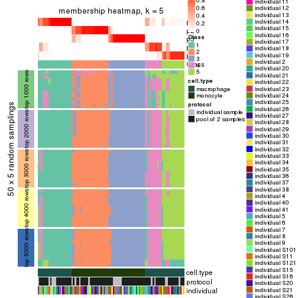</p>

</div>
<div id='tab-MAD-pam-membership-heatmap-5'>
<pre><code class="r">membership_heatmap(res, k = 6)
</code></pre>

<p></p>

</div>
</div>

As soon as we have had the classes for columns, we can look for signatures
which are significantly different between classes which can be candidate marks
for certain classes. Following are the heatmaps for signatures.


Signature heatmaps where rows are scaled:


<script>
$( function() {
	$( '#tabs-MAD-pam-get-signatures' ).tabs();
} );
</script>
<div id='tabs-MAD-pam-get-signatures'>
<ul>
<li><a href='#tab-MAD-pam-get-signatures-1'>k = 2</a></li>
<li><a href='#tab-MAD-pam-get-signatures-2'>k = 3</a></li>
<li><a href='#tab-MAD-pam-get-signatures-3'>k = 4</a></li>
<li><a href='#tab-MAD-pam-get-signatures-4'>k = 5</a></li>
<li><a href='#tab-MAD-pam-get-signatures-5'>k = 6</a></li>
</ul>
<div id='tab-MAD-pam-get-signatures-1'>
<pre><code class="r">get_signatures(res, k = 2)
</code></pre>

<p></p>

</div>
<div id='tab-MAD-pam-get-signatures-2'>
<pre><code class="r">get_signatures(res, k = 3)
</code></pre>

<p></p>

</div>
<div id='tab-MAD-pam-get-signatures-3'>
<pre><code class="r">get_signatures(res, k = 4)
</code></pre>

<p></p>

</div>
<div id='tab-MAD-pam-get-signatures-4'>
<pre><code class="r">get_signatures(res, k = 5)
</code></pre>

<p></p>

</div>
<div id='tab-MAD-pam-get-signatures-5'>
<pre><code class="r">get_signatures(res, k = 6)
</code></pre>

<p></p>

</div>
</div>


Signature heatmaps where rows are not scaled:


<script>
$( function() {
	$( '#tabs-MAD-pam-get-signatures-no-scale' ).tabs();
} );
</script>
<div id='tabs-MAD-pam-get-signatures-no-scale'>
<ul>
<li><a href='#tab-MAD-pam-get-signatures-no-scale-1'>k = 2</a></li>
<li><a href='#tab-MAD-pam-get-signatures-no-scale-2'>k = 3</a></li>
<li><a href='#tab-MAD-pam-get-signatures-no-scale-3'>k = 4</a></li>
<li><a href='#tab-MAD-pam-get-signatures-no-scale-4'>k = 5</a></li>
<li><a href='#tab-MAD-pam-get-signatures-no-scale-5'>k = 6</a></li>
</ul>
<div id='tab-MAD-pam-get-signatures-no-scale-1'>
<pre><code class="r">get_signatures(res, k = 2, scale_rows = FALSE)
</code></pre>

<p></p>

</div>
<div id='tab-MAD-pam-get-signatures-no-scale-2'>
<pre><code class="r">get_signatures(res, k = 3, scale_rows = FALSE)
</code></pre>

<p></p>

</div>
<div id='tab-MAD-pam-get-signatures-no-scale-3'>
<pre><code class="r">get_signatures(res, k = 4, scale_rows = FALSE)
</code></pre>

<p></p>

</div>
<div id='tab-MAD-pam-get-signatures-no-scale-4'>
<pre><code class="r">get_signatures(res, k = 5, scale_rows = FALSE)
</code></pre>

<p></p>

</div>
<div id='tab-MAD-pam-get-signatures-no-scale-5'>
<pre><code class="r">get_signatures(res, k = 6, scale_rows = FALSE)
</code></pre>

<p></p>

</div>
</div>


Compare the overlap of signatures from different k:

```r
compare_signatures(res)
```


`get_signature()` returns a data frame invisibly. TO get the list of signatures, the function
call should be assigned to a variable explicitly. In following code, if `plot` argument is set
to `FALSE`, no heatmap is plotted while only the differential analysis is performed.

```r
# code only for demonstration
tb = get_signature(res, k = ..., plot = FALSE)
```

An example of the output of `tb` is:

```
#>   which_row         fdr    mean_1    mean_2 scaled_mean_1 scaled_mean_2 km
#> 1        38 0.042760348  8.373488  9.131774    -0.5533452     0.5164555  1
#> 2        40 0.018707592  7.106213  8.469186    -0.6173731     0.5762149  1
#> 3        55 0.019134737 10.221463 11.207825    -0.6159697     0.5749050  1
#> 4        59 0.006059896  5.921854  7.869574    -0.6899429     0.6439467  1
#> 5        60 0.018055526  8.928898 10.211722    -0.6204761     0.5791110  1
#> 6        98 0.009384629 15.714769 14.887706     0.6635654    -0.6193277  2
...
```

The columns in `tb` are:

1. `which_row`: row indices corresponding to the input matrix.
2. `fdr`: FDR for the differential test. 
3. `mean_x`: The mean value in group x.
4. `scaled_mean_x`: The mean value in group x after rows are scaled.
5. `km`: Row groups if k-means clustering is applied to rows.


UMAP plot which shows how samples are separated.


<script>
$( function() {
	$( '#tabs-MAD-pam-dimension-reduction' ).tabs();
} );
</script>
<div id='tabs-MAD-pam-dimension-reduction'>
<ul>
<li><a href='#tab-MAD-pam-dimension-reduction-1'>k = 2</a></li>
<li><a href='#tab-MAD-pam-dimension-reduction-2'>k = 3</a></li>
<li><a href='#tab-MAD-pam-dimension-reduction-3'>k = 4</a></li>
<li><a href='#tab-MAD-pam-dimension-reduction-4'>k = 5</a></li>
<li><a href='#tab-MAD-pam-dimension-reduction-5'>k = 6</a></li>
</ul>
<div id='tab-MAD-pam-dimension-reduction-1'>
<pre><code class="r">dimension_reduction(res, k = 2, method = &quot;UMAP&quot;)
</code></pre>

<p></p>

</div>
<div id='tab-MAD-pam-dimension-reduction-2'>
<pre><code class="r">dimension_reduction(res, k = 3, method = &quot;UMAP&quot;)
</code></pre>

<p></p>

</div>
<div id='tab-MAD-pam-dimension-reduction-3'>
<pre><code class="r">dimension_reduction(res, k = 4, method = &quot;UMAP&quot;)
</code></pre>

<p></p>

</div>
<div id='tab-MAD-pam-dimension-reduction-4'>
<pre><code class="r">dimension_reduction(res, k = 5, method = &quot;UMAP&quot;)
</code></pre>

<p></p>

</div>
<div id='tab-MAD-pam-dimension-reduction-5'>
<pre><code class="r">dimension_reduction(res, k = 6, method = &quot;UMAP&quot;)
</code></pre>

<p></p>

</div>
</div>


Following heatmap shows how subgroups are split when increasing `k`:

```r
collect_classes(res)
```


Test correlation between subgroups and known annotations. If the known
annotation is numeric, one-way ANOVA test is applied, and if the known
annotation is discrete, chi-squared contingency table test is applied.

```r
test_to_known_factors(res)
```

```
#>          n cell.type(p) protocol(p) individual(p) k
#> MAD:pam 96     8.49e-22       1.000         1.000 2
#> MAD:pam 93     6.39e-21       0.713         1.000 3
#> MAD:pam 73     9.72e-16       0.883         0.966 4
#> MAD:pam 86     9.31e-18       0.931         0.983 5
#> MAD:pam 87     2.87e-17       0.674         0.961 6
```


If matrix rows can be associated to genes, consider to use `functional_enrichment(res,
...)` to perform function enrichment for the signature genes. See [this vignette](http://bioconductor.org/packages/devel/bioc/vignettes/cola/inst/doc/functional_enrichment.html) for more detailed explanations.


 

---------------------------------------------------


### MAD:mclust**


The object with results only for a single top-value method and a single partition method 
can be extracted as:

```r
res = res_list["MAD", "mclust"]
# you can also extract it by
# res = res_list["MAD:mclust"]
```

A summary of `res` and all the functions that can be applied to it:

```r
res
```

```
#> A 'ConsensusPartition' object with k = 2, 3, 4, 5, 6.
#>   On a matrix with 25171 rows and 96 columns.
#>   Top rows (1000, 2000, 3000, 4000, 5000) are extracted by 'MAD' method.
#>   Subgroups are detected by 'mclust' method.
#>   Performed in total 1250 partitions by row resampling.
#>   Best k for subgroups seems to be 2.
#> 
#> Following methods can be applied to this 'ConsensusPartition' object:
#>  [1] "cola_report"             "collect_classes"         "collect_plots"          
#>  [4] "collect_stats"           "colnames"                "compare_signatures"     
#>  [7] "consensus_heatmap"       "dimension_reduction"     "functional_enrichment"  
#> [10] "get_anno_col"            "get_anno"                "get_classes"            
#> [13] "get_consensus"           "get_matrix"              "get_membership"         
#> [16] "get_param"               "get_signatures"          "get_stats"              
#> [19] "is_best_k"               "is_stable_k"             "membership_heatmap"     
#> [22] "ncol"                    "nrow"                    "plot_ecdf"              
#> [25] "rownames"                "select_partition_number" "show"                   
#> [28] "suggest_best_k"          "test_to_known_factors"
```

`collect_plots()` function collects all the plots made from `res` for all `k` (number of partitions)
into one single page to provide an easy and fast comparison between different `k`.

```r
collect_plots(res)
```


The plots are:

- The first row: a plot of the ECDF (empirical cumulative distribution
  function) curves of the consensus matrix for each `k` and the heatmap of
  predicted classes for each `k`.
- The second row: heatmaps of the consensus matrix for each `k`.
- The third row: heatmaps of the membership matrix for each `k`.
- The fouth row: heatmaps of the signatures for each `k`.

All the plots in panels can be made by individual functions and they are
plotted later in this section.

`select_partition_number()` produces several plots showing different
statistics for choosing "optimized" `k`. There are following statistics:

- ECDF curves of the consensus matrix for each `k`;
- 1-PAC. [The PAC
  score](https://en.wikipedia.org/wiki/Consensus_clustering#Over-interpretation_potential_of_consensus_clustering)
  measures the proportion of the ambiguous subgrouping.
- Mean silhouette score.
- Concordance. The mean probability of fiting the consensus class ids in all
  partitions.
- Area increased. Denote $A_k$ as the area under the ECDF curve for current
  `k`, the area increased is defined as $A_k - A_{k-1}$.
- Rand index. The percent of pairs of samples that are both in a same cluster
  or both are not in a same cluster in the partition of k and k-1.
- Jaccard index. The ratio of pairs of samples are both in a same cluster in
  the partition of k and k-1 and the pairs of samples are both in a same
  cluster in the partition k or k-1.

The detailed explanations of these statistics can be found in [the _cola_
vignette](http://bioconductor.org/packages/devel/bioc/vignettes/cola/inst/doc/cola.html#toc_13).

Generally speaking, lower PAC score, higher mean silhouette score or higher
concordance corresponds to better partition. Rand index and Jaccard index
measure how similar the current partition is compared to partition with `k-1`.
If they are too similar, we won't accept `k` is better than `k-1`.

```r
select_partition_number(res)
```


The numeric values for all these statistics can be obtained by `get_stats()`.

```r
get_stats(res)
```

```
#>   k 1-PAC mean_silhouette concordance area_increased  Rand Jaccard
#> 2 2 1.000           1.000       1.000         0.5058 0.495   0.495
#> 3 3 0.829           0.940       0.886         0.1963 0.884   0.766
#> 4 4 0.766           0.895       0.882         0.1830 0.884   0.695
#> 5 5 0.678           0.761       0.821         0.0704 0.948   0.805
#> 6 6 0.694           0.639       0.752         0.0543 0.895   0.587
```

`suggest_best_k()` suggests the best $k$ based on these statistics. The rules are as follows:

- All $k$ with Jaccard index larger than 0.95 are removed because increasing
  $k$ does not provide enough extra information. If all $k$ are removed, it is
  marked as no subgroup is detected.
- For all $k$ with 1-PAC score larger than 0.9, the maximal $k$ is taken as
  the best $k$, and other $k$ are marked as optional $k$.
- If it does not fit the second rule. The $k$ with the maximal vote of the
  highest 1-PAC score, highest mean silhouette, and highest concordance is
  taken as the best $k$.

```r
suggest_best_k(res)
```

```
#> [1] 2
```


Following shows the table of the partitions (You need to click the **show/hide
code output** link to see it). The membership matrix (columns with name `p*`)
is inferred by
[`clue::cl_consensus()`](https://www.rdocumentation.org/link/cl_consensus?package=clue)
function with the `SE` method. Basically the value in the membership matrix
represents the probability to belong to a certain group. The finall class
label for an item is determined with the group with highest probability it
belongs to.

In `get_classes()` function, the entropy is calculated from the membership
matrix and the silhouette score is calculated from the consensus matrix.


<script>
$( function() {
	$( '#tabs-MAD-mclust-get-classes' ).tabs();
} );
</script>
<div id='tabs-MAD-mclust-get-classes'>
<ul>
<li><a href='#tab-MAD-mclust-get-classes-1'>k = 2</a></li>
<li><a href='#tab-MAD-mclust-get-classes-2'>k = 3</a></li>
<li><a href='#tab-MAD-mclust-get-classes-3'>k = 4</a></li>
<li><a href='#tab-MAD-mclust-get-classes-4'>k = 5</a></li>
<li><a href='#tab-MAD-mclust-get-classes-5'>k = 6</a></li>
</ul>

<div id='tab-MAD-mclust-get-classes-1'>
<p><a id='tab-MAD-mclust-get-classes-1-a' style='color:#0366d6' href='#'>show/hide code output</a></p>
<pre><code class="r">cbind(get_classes(res, k = 2), get_membership(res, k = 2))
</code></pre>

<pre><code>#&gt;           class entropy silhouette p1 p2
#&gt; GSM257886     1       0          1  1  0
#&gt; GSM257888     1       0          1  1  0
#&gt; GSM257890     1       0          1  1  0
#&gt; GSM257892     1       0          1  1  0
#&gt; GSM257894     1       0          1  1  0
#&gt; GSM257896     1       0          1  1  0
#&gt; GSM257898     1       0          1  1  0
#&gt; GSM257900     1       0          1  1  0
#&gt; GSM257902     1       0          1  1  0
#&gt; GSM257904     1       0          1  1  0
#&gt; GSM257906     1       0          1  1  0
#&gt; GSM257908     1       0          1  1  0
#&gt; GSM257910     1       0          1  1  0
#&gt; GSM257912     1       0          1  1  0
#&gt; GSM257914     1       0          1  1  0
#&gt; GSM257917     1       0          1  1  0
#&gt; GSM257919     1       0          1  1  0
#&gt; GSM257921     1       0          1  1  0
#&gt; GSM257923     1       0          1  1  0
#&gt; GSM257925     1       0          1  1  0
#&gt; GSM257927     1       0          1  1  0
#&gt; GSM257929     1       0          1  1  0
#&gt; GSM257937     1       0          1  1  0
#&gt; GSM257939     1       0          1  1  0
#&gt; GSM257941     1       0          1  1  0
#&gt; GSM257943     1       0          1  1  0
#&gt; GSM257945     1       0          1  1  0
#&gt; GSM257947     1       0          1  1  0
#&gt; GSM257949     1       0          1  1  0
#&gt; GSM257951     1       0          1  1  0
#&gt; GSM257953     1       0          1  1  0
#&gt; GSM257955     1       0          1  1  0
#&gt; GSM257958     1       0          1  1  0
#&gt; GSM257960     1       0          1  1  0
#&gt; GSM257962     1       0          1  1  0
#&gt; GSM257964     1       0          1  1  0
#&gt; GSM257966     1       0          1  1  0
#&gt; GSM257968     1       0          1  1  0
#&gt; GSM257970     1       0          1  1  0
#&gt; GSM257972     1       0          1  1  0
#&gt; GSM257977     1       0          1  1  0
#&gt; GSM257982     1       0          1  1  0
#&gt; GSM257984     1       0          1  1  0
#&gt; GSM257986     1       0          1  1  0
#&gt; GSM257990     1       0          1  1  0
#&gt; GSM257992     1       0          1  1  0
#&gt; GSM257996     1       0          1  1  0
#&gt; GSM258006     1       0          1  1  0
#&gt; GSM257887     2       0          1  0  1
#&gt; GSM257889     2       0          1  0  1
#&gt; GSM257891     2       0          1  0  1
#&gt; GSM257893     2       0          1  0  1
#&gt; GSM257895     2       0          1  0  1
#&gt; GSM257897     2       0          1  0  1
#&gt; GSM257899     2       0          1  0  1
#&gt; GSM257901     2       0          1  0  1
#&gt; GSM257903     2       0          1  0  1
#&gt; GSM257905     2       0          1  0  1
#&gt; GSM257907     2       0          1  0  1
#&gt; GSM257909     2       0          1  0  1
#&gt; GSM257911     2       0          1  0  1
#&gt; GSM257913     2       0          1  0  1
#&gt; GSM257916     2       0          1  0  1
#&gt; GSM257918     2       0          1  0  1
#&gt; GSM257920     2       0          1  0  1
#&gt; GSM257922     2       0          1  0  1
#&gt; GSM257924     2       0          1  0  1
#&gt; GSM257926     2       0          1  0  1
#&gt; GSM257928     2       0          1  0  1
#&gt; GSM257930     2       0          1  0  1
#&gt; GSM257938     2       0          1  0  1
#&gt; GSM257940     2       0          1  0  1
#&gt; GSM257942     2       0          1  0  1
#&gt; GSM257944     2       0          1  0  1
#&gt; GSM257946     2       0          1  0  1
#&gt; GSM257948     2       0          1  0  1
#&gt; GSM257950     2       0          1  0  1
#&gt; GSM257952     2       0          1  0  1
#&gt; GSM257954     2       0          1  0  1
#&gt; GSM257956     2       0          1  0  1
#&gt; GSM257959     2       0          1  0  1
#&gt; GSM257961     2       0          1  0  1
#&gt; GSM257963     2       0          1  0  1
#&gt; GSM257965     2       0          1  0  1
#&gt; GSM257967     2       0          1  0  1
#&gt; GSM257969     2       0          1  0  1
#&gt; GSM257971     2       0          1  0  1
#&gt; GSM257973     2       0          1  0  1
#&gt; GSM257981     2       0          1  0  1
#&gt; GSM257983     2       0          1  0  1
#&gt; GSM257985     2       0          1  0  1
#&gt; GSM257988     2       0          1  0  1
#&gt; GSM257991     2       0          1  0  1
#&gt; GSM257993     2       0          1  0  1
#&gt; GSM257994     2       0          1  0  1
#&gt; GSM257989     2       0          1  0  1
</code></pre>

<script>
$('#tab-MAD-mclust-get-classes-1-a').parent().next().next().hide();
$('#tab-MAD-mclust-get-classes-1-a').click(function(){
  $('#tab-MAD-mclust-get-classes-1-a').parent().next().next().toggle();
  return(false);
});
</script>
</div>

<div id='tab-MAD-mclust-get-classes-2'>
<p><a id='tab-MAD-mclust-get-classes-2-a' style='color:#0366d6' href='#'>show/hide code output</a></p>
<pre><code class="r">cbind(get_classes(res, k = 3), get_membership(res, k = 3))
</code></pre>

<pre><code>#&gt;           class entropy silhouette    p1    p2    p3
#&gt; GSM257886     3  0.6140      0.970 0.404 0.000 0.596
#&gt; GSM257888     3  0.6079      0.987 0.388 0.000 0.612
#&gt; GSM257890     3  0.6154      0.969 0.408 0.000 0.592
#&gt; GSM257892     3  0.6140      0.970 0.404 0.000 0.596
#&gt; GSM257894     3  0.6111      0.982 0.396 0.000 0.604
#&gt; GSM257896     3  0.6062      0.986 0.384 0.000 0.616
#&gt; GSM257898     1  0.0237      0.969 0.996 0.000 0.004
#&gt; GSM257900     1  0.0892      0.967 0.980 0.000 0.020
#&gt; GSM257902     1  0.1753      0.943 0.952 0.000 0.048
#&gt; GSM257904     1  0.1860      0.943 0.948 0.000 0.052
#&gt; GSM257906     1  0.0892      0.969 0.980 0.000 0.020
#&gt; GSM257908     3  0.6062      0.986 0.384 0.000 0.616
#&gt; GSM257910     3  0.6062      0.986 0.384 0.000 0.616
#&gt; GSM257912     3  0.6062      0.986 0.384 0.000 0.616
#&gt; GSM257914     3  0.6062      0.986 0.384 0.000 0.616
#&gt; GSM257917     3  0.6062      0.986 0.384 0.000 0.616
#&gt; GSM257919     3  0.6062      0.986 0.384 0.000 0.616
#&gt; GSM257921     1  0.1860      0.938 0.948 0.000 0.052
#&gt; GSM257923     1  0.0000      0.972 1.000 0.000 0.000
#&gt; GSM257925     1  0.0000      0.972 1.000 0.000 0.000
#&gt; GSM257927     1  0.0424      0.972 0.992 0.000 0.008
#&gt; GSM257929     1  0.0000      0.972 1.000 0.000 0.000
#&gt; GSM257937     3  0.6079      0.987 0.388 0.000 0.612
#&gt; GSM257939     1  0.0000      0.972 1.000 0.000 0.000
#&gt; GSM257941     1  0.0000      0.972 1.000 0.000 0.000
#&gt; GSM257943     1  0.0237      0.969 0.996 0.000 0.004
#&gt; GSM257945     1  0.0237      0.969 0.996 0.000 0.004
#&gt; GSM257947     1  0.0000      0.972 1.000 0.000 0.000
#&gt; GSM257949     1  0.1860      0.938 0.948 0.000 0.052
#&gt; GSM257951     1  0.0000      0.972 1.000 0.000 0.000
#&gt; GSM257953     1  0.0237      0.969 0.996 0.000 0.004
#&gt; GSM257955     1  0.0000      0.972 1.000 0.000 0.000
#&gt; GSM257958     1  0.0000      0.972 1.000 0.000 0.000
#&gt; GSM257960     1  0.0892      0.967 0.980 0.000 0.020
#&gt; GSM257962     1  0.0592      0.971 0.988 0.000 0.012
#&gt; GSM257964     1  0.0892      0.967 0.980 0.000 0.020
#&gt; GSM257966     3  0.6079      0.987 0.388 0.000 0.612
#&gt; GSM257968     3  0.6154      0.969 0.408 0.000 0.592
#&gt; GSM257970     1  0.0000      0.972 1.000 0.000 0.000
#&gt; GSM257972     1  0.1643      0.947 0.956 0.000 0.044
#&gt; GSM257977     3  0.6062      0.986 0.384 0.000 0.616
#&gt; GSM257982     3  0.6062      0.986 0.384 0.000 0.616
#&gt; GSM257984     1  0.1860      0.938 0.948 0.000 0.052
#&gt; GSM257986     1  0.1753      0.943 0.952 0.000 0.048
#&gt; GSM257990     1  0.0000      0.972 1.000 0.000 0.000
#&gt; GSM257992     1  0.0747      0.970 0.984 0.000 0.016
#&gt; GSM257996     1  0.1860      0.938 0.948 0.000 0.052
#&gt; GSM258006     1  0.0747      0.970 0.984 0.000 0.016
#&gt; GSM257887     2  0.1964      0.935 0.000 0.944 0.056
#&gt; GSM257889     2  0.2959      0.926 0.000 0.900 0.100
#&gt; GSM257891     2  0.5785      0.762 0.000 0.668 0.332
#&gt; GSM257893     2  0.2537      0.931 0.000 0.920 0.080
#&gt; GSM257895     2  0.2537      0.931 0.000 0.920 0.080
#&gt; GSM257897     2  0.6062      0.725 0.000 0.616 0.384
#&gt; GSM257899     2  0.6062      0.725 0.000 0.616 0.384
#&gt; GSM257901     2  0.0000      0.940 0.000 1.000 0.000
#&gt; GSM257903     2  0.0000      0.940 0.000 1.000 0.000
#&gt; GSM257905     2  0.1031      0.939 0.000 0.976 0.024
#&gt; GSM257907     2  0.0000      0.940 0.000 1.000 0.000
#&gt; GSM257909     2  0.0000      0.940 0.000 1.000 0.000
#&gt; GSM257911     2  0.0000      0.940 0.000 1.000 0.000
#&gt; GSM257913     2  0.0000      0.940 0.000 1.000 0.000
#&gt; GSM257916     2  0.0000      0.940 0.000 1.000 0.000
#&gt; GSM257918     2  0.0000      0.940 0.000 1.000 0.000
#&gt; GSM257920     2  0.0592      0.938 0.000 0.988 0.012
#&gt; GSM257922     2  0.4796      0.861 0.000 0.780 0.220
#&gt; GSM257924     2  0.1411      0.938 0.000 0.964 0.036
#&gt; GSM257926     2  0.0237      0.940 0.000 0.996 0.004
#&gt; GSM257928     2  0.2537      0.931 0.000 0.920 0.080
#&gt; GSM257930     2  0.2537      0.931 0.000 0.920 0.080
#&gt; GSM257938     2  0.2537      0.931 0.000 0.920 0.080
#&gt; GSM257940     2  0.2261      0.917 0.000 0.932 0.068
#&gt; GSM257942     2  0.0000      0.940 0.000 1.000 0.000
#&gt; GSM257944     2  0.0000      0.940 0.000 1.000 0.000
#&gt; GSM257946     2  0.1031      0.939 0.000 0.976 0.024
#&gt; GSM257948     2  0.0000      0.940 0.000 1.000 0.000
#&gt; GSM257950     2  0.5138      0.815 0.000 0.748 0.252
#&gt; GSM257952     2  0.0237      0.940 0.000 0.996 0.004
#&gt; GSM257954     2  0.2448      0.932 0.000 0.924 0.076
#&gt; GSM257956     2  0.2537      0.931 0.000 0.920 0.080
#&gt; GSM257959     2  0.0000      0.940 0.000 1.000 0.000
#&gt; GSM257961     2  0.2165      0.934 0.000 0.936 0.064
#&gt; GSM257963     2  0.0892      0.939 0.000 0.980 0.020
#&gt; GSM257965     2  0.0000      0.940 0.000 1.000 0.000
#&gt; GSM257967     2  0.0000      0.940 0.000 1.000 0.000
#&gt; GSM257969     2  0.2537      0.931 0.000 0.920 0.080
#&gt; GSM257971     2  0.2537      0.931 0.000 0.920 0.080
#&gt; GSM257973     2  0.0000      0.940 0.000 1.000 0.000
#&gt; GSM257981     2  0.0000      0.940 0.000 1.000 0.000
#&gt; GSM257983     2  0.5988      0.727 0.000 0.632 0.368
#&gt; GSM257985     2  0.2711      0.907 0.000 0.912 0.088
#&gt; GSM257988     2  0.5058      0.816 0.000 0.756 0.244
#&gt; GSM257991     2  0.0000      0.940 0.000 1.000 0.000
#&gt; GSM257993     2  0.2537      0.931 0.000 0.920 0.080
#&gt; GSM257994     2  0.2537      0.931 0.000 0.920 0.080
#&gt; GSM257989     2  0.4121      0.857 0.000 0.832 0.168
</code></pre>

<script>
$('#tab-MAD-mclust-get-classes-2-a').parent().next().next().hide();
$('#tab-MAD-mclust-get-classes-2-a').click(function(){
  $('#tab-MAD-mclust-get-classes-2-a').parent().next().next().toggle();
  return(false);
});
</script>
</div>

<div id='tab-MAD-mclust-get-classes-3'>
<p><a id='tab-MAD-mclust-get-classes-3-a' style='color:#0366d6' href='#'>show/hide code output</a></p>
<pre><code class="r">cbind(get_classes(res, k = 4), get_membership(res, k = 4))
</code></pre>

<pre><code>#&gt;           class entropy silhouette    p1    p2    p3    p4
#&gt; GSM257886     4  0.2868      0.878 0.136 0.000 0.000 0.864
#&gt; GSM257888     4  0.0188      0.959 0.004 0.000 0.000 0.996
#&gt; GSM257890     4  0.2704      0.889 0.124 0.000 0.000 0.876
#&gt; GSM257892     4  0.2868      0.878 0.136 0.000 0.000 0.864
#&gt; GSM257894     4  0.1211      0.933 0.040 0.000 0.000 0.960
#&gt; GSM257896     4  0.0817      0.952 0.024 0.000 0.000 0.976
#&gt; GSM257898     1  0.2281      0.917 0.904 0.000 0.000 0.096
#&gt; GSM257900     1  0.1474      0.928 0.948 0.000 0.000 0.052
#&gt; GSM257902     1  0.2281      0.916 0.904 0.000 0.000 0.096
#&gt; GSM257904     1  0.2281      0.917 0.904 0.000 0.000 0.096
#&gt; GSM257906     1  0.2281      0.917 0.904 0.000 0.000 0.096
#&gt; GSM257908     4  0.0188      0.959 0.004 0.000 0.000 0.996
#&gt; GSM257910     4  0.0188      0.959 0.004 0.000 0.000 0.996
#&gt; GSM257912     4  0.0188      0.959 0.004 0.000 0.000 0.996
#&gt; GSM257914     4  0.0188      0.959 0.004 0.000 0.000 0.996
#&gt; GSM257917     4  0.1557      0.927 0.056 0.000 0.000 0.944
#&gt; GSM257919     4  0.0188      0.959 0.004 0.000 0.000 0.996
#&gt; GSM257921     1  0.2081      0.921 0.916 0.000 0.000 0.084
#&gt; GSM257923     1  0.2081      0.915 0.916 0.000 0.000 0.084
#&gt; GSM257925     1  0.2345      0.926 0.900 0.000 0.000 0.100
#&gt; GSM257927     1  0.1302      0.928 0.956 0.000 0.000 0.044
#&gt; GSM257929     1  0.2011      0.922 0.920 0.000 0.000 0.080
#&gt; GSM257937     4  0.0188      0.959 0.004 0.000 0.000 0.996
#&gt; GSM257939     1  0.2081      0.915 0.916 0.000 0.000 0.084
#&gt; GSM257941     1  0.1211      0.927 0.960 0.000 0.000 0.040
#&gt; GSM257943     1  0.1867      0.923 0.928 0.000 0.000 0.072
#&gt; GSM257945     1  0.2149      0.921 0.912 0.000 0.000 0.088
#&gt; GSM257947     1  0.2081      0.915 0.916 0.000 0.000 0.084
#&gt; GSM257949     1  0.2345      0.916 0.900 0.000 0.000 0.100
#&gt; GSM257951     1  0.2081      0.915 0.916 0.000 0.000 0.084
#&gt; GSM257953     1  0.3074      0.914 0.848 0.000 0.000 0.152
#&gt; GSM257955     1  0.2081      0.915 0.916 0.000 0.000 0.084
#&gt; GSM257958     1  0.1022      0.926 0.968 0.000 0.000 0.032
#&gt; GSM257960     1  0.1867      0.926 0.928 0.000 0.000 0.072
#&gt; GSM257962     1  0.1474      0.928 0.948 0.000 0.000 0.052
#&gt; GSM257964     1  0.2281      0.916 0.904 0.000 0.000 0.096
#&gt; GSM257966     4  0.0188      0.959 0.004 0.000 0.000 0.996
#&gt; GSM257968     4  0.2345      0.899 0.100 0.000 0.000 0.900
#&gt; GSM257970     1  0.2081      0.915 0.916 0.000 0.000 0.084
#&gt; GSM257972     1  0.2216      0.931 0.908 0.000 0.000 0.092
#&gt; GSM257977     4  0.0336      0.958 0.008 0.000 0.000 0.992
#&gt; GSM257982     4  0.1118      0.944 0.036 0.000 0.000 0.964
#&gt; GSM257984     1  0.2408      0.917 0.896 0.000 0.000 0.104
#&gt; GSM257986     1  0.2345      0.916 0.900 0.000 0.000 0.100
#&gt; GSM257990     1  0.1211      0.927 0.960 0.000 0.000 0.040
#&gt; GSM257992     1  0.2281      0.917 0.904 0.000 0.000 0.096
#&gt; GSM257996     1  0.2081      0.921 0.916 0.000 0.000 0.084
#&gt; GSM258006     1  0.2281      0.917 0.904 0.000 0.000 0.096
#&gt; GSM257887     2  0.0469      0.955 0.000 0.988 0.012 0.000
#&gt; GSM257889     3  0.4356      0.825 0.000 0.292 0.708 0.000
#&gt; GSM257891     3  0.2345      0.768 0.000 0.100 0.900 0.000
#&gt; GSM257893     2  0.2647      0.826 0.000 0.880 0.120 0.000
#&gt; GSM257895     2  0.0336      0.954 0.000 0.992 0.008 0.000
#&gt; GSM257897     3  0.0188      0.679 0.000 0.004 0.996 0.000
#&gt; GSM257899     3  0.0188      0.679 0.000 0.004 0.996 0.000
#&gt; GSM257901     3  0.4790      0.775 0.000 0.380 0.620 0.000
#&gt; GSM257903     2  0.0336      0.955 0.000 0.992 0.008 0.000
#&gt; GSM257905     2  0.0336      0.955 0.000 0.992 0.008 0.000
#&gt; GSM257907     3  0.4790      0.775 0.000 0.380 0.620 0.000
#&gt; GSM257909     2  0.0336      0.955 0.000 0.992 0.008 0.000
#&gt; GSM257911     2  0.1389      0.912 0.000 0.952 0.048 0.000
#&gt; GSM257913     2  0.0921      0.939 0.000 0.972 0.028 0.000
#&gt; GSM257916     2  0.0188      0.956 0.000 0.996 0.004 0.000
#&gt; GSM257918     2  0.0188      0.956 0.000 0.996 0.004 0.000
#&gt; GSM257920     3  0.4776      0.780 0.000 0.376 0.624 0.000
#&gt; GSM257922     3  0.3649      0.818 0.000 0.204 0.796 0.000
#&gt; GSM257924     2  0.2345      0.841 0.000 0.900 0.100 0.000
#&gt; GSM257926     2  0.4661      0.122 0.000 0.652 0.348 0.000
#&gt; GSM257928     2  0.1118      0.936 0.000 0.964 0.036 0.000
#&gt; GSM257930     2  0.0707      0.948 0.000 0.980 0.020 0.000
#&gt; GSM257938     2  0.0707      0.948 0.000 0.980 0.020 0.000
#&gt; GSM257940     3  0.4761      0.784 0.000 0.372 0.628 0.000
#&gt; GSM257942     2  0.0336      0.955 0.000 0.992 0.008 0.000
#&gt; GSM257944     2  0.0336      0.955 0.000 0.992 0.008 0.000
#&gt; GSM257946     3  0.4500      0.820 0.000 0.316 0.684 0.000
#&gt; GSM257948     3  0.4790      0.775 0.000 0.380 0.620 0.000
#&gt; GSM257950     3  0.3569      0.816 0.000 0.196 0.804 0.000
#&gt; GSM257952     2  0.0188      0.955 0.000 0.996 0.004 0.000
#&gt; GSM257954     2  0.0188      0.955 0.000 0.996 0.004 0.000
#&gt; GSM257956     2  0.0469      0.953 0.000 0.988 0.012 0.000
#&gt; GSM257959     2  0.0336      0.955 0.000 0.992 0.008 0.000
#&gt; GSM257961     2  0.0336      0.956 0.000 0.992 0.008 0.000
#&gt; GSM257963     2  0.0336      0.955 0.000 0.992 0.008 0.000
#&gt; GSM257965     2  0.0000      0.955 0.000 1.000 0.000 0.000
#&gt; GSM257967     2  0.0336      0.955 0.000 0.992 0.008 0.000
#&gt; GSM257969     2  0.0336      0.954 0.000 0.992 0.008 0.000
#&gt; GSM257971     2  0.2814      0.820 0.000 0.868 0.132 0.000
#&gt; GSM257973     3  0.4761      0.780 0.000 0.372 0.628 0.000
#&gt; GSM257981     2  0.0188      0.956 0.000 0.996 0.004 0.000
#&gt; GSM257983     3  0.0000      0.674 0.000 0.000 1.000 0.000
#&gt; GSM257985     3  0.4431      0.824 0.000 0.304 0.696 0.000
#&gt; GSM257988     3  0.3649      0.817 0.000 0.204 0.796 0.000
#&gt; GSM257991     2  0.0000      0.955 0.000 1.000 0.000 0.000
#&gt; GSM257993     2  0.0469      0.953 0.000 0.988 0.012 0.000
#&gt; GSM257994     2  0.0707      0.948 0.000 0.980 0.020 0.000
#&gt; GSM257989     3  0.4304      0.827 0.000 0.284 0.716 0.000
</code></pre>

<script>
$('#tab-MAD-mclust-get-classes-3-a').parent().next().next().hide();
$('#tab-MAD-mclust-get-classes-3-a').click(function(){
  $('#tab-MAD-mclust-get-classes-3-a').parent().next().next().toggle();
  return(false);
});
</script>
</div>

<div id='tab-MAD-mclust-get-classes-4'>
<p><a id='tab-MAD-mclust-get-classes-4-a' style='color:#0366d6' href='#'>show/hide code output</a></p>
<pre><code class="r">cbind(get_classes(res, k = 5), get_membership(res, k = 5))
</code></pre>

<pre><code>#&gt;           class entropy silhouette    p1    p2    p3    p4    p5
#&gt; GSM257886     4  0.4013     0.8368 0.084 0.000 0.004 0.804 0.108
#&gt; GSM257888     4  0.0865     0.9199 0.004 0.000 0.000 0.972 0.024
#&gt; GSM257890     4  0.2992     0.8669 0.068 0.000 0.000 0.868 0.064
#&gt; GSM257892     4  0.4006     0.8388 0.080 0.000 0.004 0.804 0.112
#&gt; GSM257894     4  0.2370     0.8933 0.040 0.000 0.000 0.904 0.056
#&gt; GSM257896     4  0.1211     0.9188 0.016 0.000 0.000 0.960 0.024
#&gt; GSM257898     1  0.4425     0.8175 0.772 0.000 0.004 0.116 0.108
#&gt; GSM257900     1  0.2654     0.8739 0.888 0.000 0.000 0.048 0.064
#&gt; GSM257902     1  0.1894     0.8685 0.920 0.000 0.000 0.008 0.072
#&gt; GSM257904     1  0.4425     0.8175 0.772 0.000 0.004 0.116 0.108
#&gt; GSM257906     1  0.4425     0.8175 0.772 0.000 0.004 0.116 0.108
#&gt; GSM257908     4  0.2020     0.9128 0.000 0.000 0.000 0.900 0.100
#&gt; GSM257910     4  0.2020     0.9128 0.000 0.000 0.000 0.900 0.100
#&gt; GSM257912     4  0.1851     0.9125 0.000 0.000 0.000 0.912 0.088
#&gt; GSM257914     4  0.1851     0.9125 0.000 0.000 0.000 0.912 0.088
#&gt; GSM257917     4  0.1965     0.9120 0.000 0.000 0.000 0.904 0.096
#&gt; GSM257919     4  0.1851     0.9125 0.000 0.000 0.000 0.912 0.088
#&gt; GSM257921     1  0.5198     0.7615 0.688 0.000 0.000 0.164 0.148
#&gt; GSM257923     1  0.1894     0.8685 0.920 0.000 0.000 0.008 0.072
#&gt; GSM257925     1  0.0865     0.8834 0.972 0.000 0.000 0.024 0.004
#&gt; GSM257927     1  0.2580     0.8747 0.892 0.000 0.000 0.044 0.064
#&gt; GSM257929     1  0.0798     0.8808 0.976 0.000 0.000 0.008 0.016
#&gt; GSM257937     4  0.0290     0.9203 0.008 0.000 0.000 0.992 0.000
#&gt; GSM257939     1  0.1768     0.8698 0.924 0.000 0.000 0.004 0.072
#&gt; GSM257941     1  0.3234     0.8636 0.852 0.000 0.000 0.084 0.064
#&gt; GSM257943     1  0.4295     0.8232 0.780 0.000 0.004 0.132 0.084
#&gt; GSM257945     1  0.3649     0.8344 0.808 0.000 0.000 0.152 0.040
#&gt; GSM257947     1  0.1768     0.8698 0.924 0.000 0.000 0.004 0.072
#&gt; GSM257949     1  0.1894     0.8685 0.920 0.000 0.000 0.008 0.072
#&gt; GSM257951     1  0.1830     0.8699 0.924 0.000 0.000 0.008 0.068
#&gt; GSM257953     1  0.1740     0.8842 0.932 0.000 0.000 0.056 0.012
#&gt; GSM257955     1  0.1894     0.8685 0.920 0.000 0.000 0.008 0.072
#&gt; GSM257958     1  0.0992     0.8839 0.968 0.000 0.000 0.024 0.008
#&gt; GSM257960     1  0.3558     0.8522 0.828 0.000 0.000 0.108 0.064
#&gt; GSM257962     1  0.2853     0.8722 0.876 0.000 0.000 0.072 0.052
#&gt; GSM257964     1  0.1894     0.8685 0.920 0.000 0.000 0.008 0.072
#&gt; GSM257966     4  0.0290     0.9202 0.000 0.000 0.000 0.992 0.008
#&gt; GSM257968     4  0.3828     0.8192 0.120 0.000 0.000 0.808 0.072
#&gt; GSM257970     1  0.1764     0.8714 0.928 0.000 0.000 0.008 0.064
#&gt; GSM257972     1  0.1205     0.8838 0.956 0.000 0.000 0.040 0.004
#&gt; GSM257977     4  0.0693     0.9199 0.012 0.000 0.000 0.980 0.008
#&gt; GSM257982     4  0.1403     0.9178 0.024 0.000 0.000 0.952 0.024
#&gt; GSM257984     1  0.2971     0.8255 0.836 0.000 0.000 0.008 0.156
#&gt; GSM257986     1  0.2660     0.8439 0.864 0.000 0.000 0.008 0.128
#&gt; GSM257990     1  0.1997     0.8805 0.924 0.000 0.000 0.040 0.036
#&gt; GSM257992     1  0.4473     0.8164 0.768 0.000 0.004 0.116 0.112
#&gt; GSM257996     1  0.4017     0.8378 0.788 0.000 0.000 0.064 0.148
#&gt; GSM258006     1  0.3997     0.8327 0.804 0.000 0.004 0.116 0.076
#&gt; GSM257887     2  0.2300     0.8462 0.000 0.904 0.024 0.000 0.072
#&gt; GSM257889     5  0.6456     0.3751 0.000 0.184 0.368 0.000 0.448
#&gt; GSM257891     3  0.2130     0.6223 0.000 0.080 0.908 0.000 0.012
#&gt; GSM257893     5  0.6455     0.4063 0.000 0.188 0.352 0.000 0.460
#&gt; GSM257895     5  0.4651     0.6109 0.000 0.372 0.020 0.000 0.608
#&gt; GSM257897     3  0.0880     0.5527 0.000 0.000 0.968 0.000 0.032
#&gt; GSM257899     3  0.0880     0.5527 0.000 0.000 0.968 0.000 0.032
#&gt; GSM257901     3  0.5697     0.3530 0.000 0.404 0.512 0.000 0.084
#&gt; GSM257903     2  0.0162     0.8972 0.000 0.996 0.004 0.000 0.000
#&gt; GSM257905     2  0.0324     0.8970 0.000 0.992 0.004 0.000 0.004
#&gt; GSM257907     3  0.6030     0.4562 0.000 0.224 0.580 0.000 0.196
#&gt; GSM257909     2  0.0324     0.8970 0.000 0.992 0.004 0.000 0.004
#&gt; GSM257911     2  0.2660     0.7710 0.000 0.864 0.128 0.000 0.008
#&gt; GSM257913     2  0.4693     0.4304 0.000 0.700 0.244 0.000 0.056
#&gt; GSM257916     2  0.0451     0.8961 0.000 0.988 0.004 0.000 0.008
#&gt; GSM257918     2  0.0451     0.8961 0.000 0.988 0.004 0.000 0.008
#&gt; GSM257920     3  0.5958     0.4611 0.000 0.208 0.592 0.000 0.200
#&gt; GSM257922     3  0.4162     0.6669 0.000 0.176 0.768 0.000 0.056
#&gt; GSM257924     5  0.6543     0.3765 0.000 0.212 0.332 0.000 0.456
#&gt; GSM257926     5  0.6543     0.3765 0.000 0.212 0.332 0.000 0.456
#&gt; GSM257928     5  0.4452     0.6643 0.000 0.272 0.032 0.000 0.696
#&gt; GSM257930     5  0.4275     0.6693 0.000 0.284 0.020 0.000 0.696
#&gt; GSM257938     5  0.4275     0.6693 0.000 0.284 0.020 0.000 0.696
#&gt; GSM257940     3  0.4585     0.5252 0.000 0.352 0.628 0.000 0.020
#&gt; GSM257942     2  0.0771     0.8908 0.000 0.976 0.020 0.000 0.004
#&gt; GSM257944     2  0.0324     0.8970 0.000 0.992 0.004 0.000 0.004
#&gt; GSM257946     3  0.6570    -0.0792 0.000 0.212 0.440 0.000 0.348
#&gt; GSM257948     3  0.6575    -0.1417 0.000 0.208 0.424 0.000 0.368
#&gt; GSM257950     3  0.3171     0.6807 0.000 0.176 0.816 0.000 0.008
#&gt; GSM257952     2  0.2676     0.8086 0.000 0.884 0.080 0.000 0.036
#&gt; GSM257954     2  0.3264     0.7639 0.000 0.820 0.016 0.000 0.164
#&gt; GSM257956     2  0.3016     0.7940 0.000 0.848 0.020 0.000 0.132
#&gt; GSM257959     2  0.0324     0.8970 0.000 0.992 0.004 0.000 0.004
#&gt; GSM257961     2  0.2583     0.7482 0.000 0.864 0.004 0.000 0.132
#&gt; GSM257963     2  0.0324     0.8975 0.000 0.992 0.004 0.000 0.004
#&gt; GSM257965     2  0.0451     0.8973 0.000 0.988 0.004 0.000 0.008
#&gt; GSM257967     2  0.0324     0.8970 0.000 0.992 0.004 0.000 0.004
#&gt; GSM257969     5  0.4686     0.5980 0.000 0.384 0.020 0.000 0.596
#&gt; GSM257971     5  0.6439     0.4098 0.000 0.184 0.356 0.000 0.460
#&gt; GSM257973     3  0.3993     0.6732 0.000 0.216 0.756 0.000 0.028
#&gt; GSM257981     2  0.1764     0.8564 0.000 0.928 0.064 0.000 0.008
#&gt; GSM257983     3  0.0771     0.5565 0.000 0.004 0.976 0.000 0.020
#&gt; GSM257985     3  0.4042     0.6711 0.000 0.212 0.756 0.000 0.032
#&gt; GSM257988     3  0.3123     0.6808 0.000 0.184 0.812 0.000 0.004
#&gt; GSM257991     2  0.0771     0.8880 0.000 0.976 0.020 0.000 0.004
#&gt; GSM257993     2  0.3194     0.7781 0.000 0.832 0.020 0.000 0.148
#&gt; GSM257994     5  0.4275     0.6693 0.000 0.284 0.020 0.000 0.696
#&gt; GSM257989     3  0.3977     0.6766 0.000 0.204 0.764 0.000 0.032
</code></pre>

<script>
$('#tab-MAD-mclust-get-classes-4-a').parent().next().next().hide();
$('#tab-MAD-mclust-get-classes-4-a').click(function(){
  $('#tab-MAD-mclust-get-classes-4-a').parent().next().next().toggle();
  return(false);
});
</script>
</div>

<div id='tab-MAD-mclust-get-classes-5'>
<p><a id='tab-MAD-mclust-get-classes-5-a' style='color:#0366d6' href='#'>show/hide code output</a></p>
<pre><code class="r">cbind(get_classes(res, k = 6), get_membership(res, k = 6))
</code></pre>

<pre><code>#&gt;           class entropy silhouette    p1    p2    p3    p4    p5    p6
#&gt; GSM257886     4  0.3595     0.7938 0.004 0.000 0.124 0.808 0.060 0.004
#&gt; GSM257888     4  0.1265     0.8694 0.008 0.000 0.000 0.948 0.000 0.044
#&gt; GSM257890     4  0.2925     0.8322 0.104 0.000 0.000 0.856 0.016 0.024
#&gt; GSM257892     4  0.3595     0.7938 0.004 0.000 0.124 0.808 0.060 0.004
#&gt; GSM257894     4  0.2309     0.8312 0.028 0.000 0.000 0.888 0.000 0.084
#&gt; GSM257896     4  0.0603     0.8730 0.016 0.000 0.000 0.980 0.000 0.004
#&gt; GSM257898     1  0.4493     0.7048 0.760 0.000 0.124 0.076 0.036 0.004
#&gt; GSM257900     1  0.1515     0.7904 0.944 0.000 0.000 0.008 0.020 0.028
#&gt; GSM257902     1  0.3163     0.7605 0.764 0.000 0.000 0.004 0.000 0.232
#&gt; GSM257904     1  0.4542     0.7092 0.760 0.000 0.116 0.076 0.044 0.004
#&gt; GSM257906     1  0.4811     0.6955 0.740 0.000 0.124 0.072 0.060 0.004
#&gt; GSM257908     6  0.3714     0.6009 0.000 0.000 0.000 0.340 0.004 0.656
#&gt; GSM257910     6  0.3699     0.6030 0.000 0.000 0.000 0.336 0.004 0.660
#&gt; GSM257912     6  0.3887     0.6064 0.008 0.000 0.000 0.360 0.000 0.632
#&gt; GSM257914     6  0.3887     0.6064 0.008 0.000 0.000 0.360 0.000 0.632
#&gt; GSM257917     6  0.3887     0.6064 0.008 0.000 0.000 0.360 0.000 0.632
#&gt; GSM257919     6  0.3887     0.6064 0.008 0.000 0.000 0.360 0.000 0.632
#&gt; GSM257921     6  0.5521     0.3752 0.384 0.000 0.000 0.080 0.020 0.516
#&gt; GSM257923     1  0.3714     0.6563 0.656 0.000 0.000 0.004 0.000 0.340
#&gt; GSM257925     1  0.2346     0.7731 0.868 0.000 0.000 0.008 0.000 0.124
#&gt; GSM257927     1  0.0260     0.7855 0.992 0.000 0.000 0.008 0.000 0.000
#&gt; GSM257929     1  0.3136     0.7567 0.768 0.000 0.000 0.004 0.000 0.228
#&gt; GSM257937     4  0.1176     0.8698 0.024 0.000 0.000 0.956 0.000 0.020
#&gt; GSM257939     1  0.3489     0.7242 0.708 0.000 0.000 0.004 0.000 0.288
#&gt; GSM257941     1  0.0622     0.7855 0.980 0.000 0.000 0.008 0.012 0.000
#&gt; GSM257943     1  0.3416     0.7379 0.840 0.000 0.072 0.064 0.020 0.004
#&gt; GSM257945     1  0.2451     0.7405 0.892 0.000 0.016 0.076 0.012 0.004
#&gt; GSM257947     1  0.3426     0.7331 0.720 0.000 0.000 0.004 0.000 0.276
#&gt; GSM257949     1  0.3468     0.7293 0.712 0.000 0.000 0.004 0.000 0.284
#&gt; GSM257951     1  0.3314     0.7467 0.740 0.000 0.000 0.004 0.000 0.256
#&gt; GSM257953     1  0.2513     0.7869 0.896 0.000 0.016 0.020 0.008 0.060
#&gt; GSM257955     1  0.3265     0.7530 0.748 0.000 0.000 0.004 0.000 0.248
#&gt; GSM257958     1  0.1584     0.7942 0.928 0.000 0.000 0.008 0.000 0.064
#&gt; GSM257960     1  0.1498     0.7780 0.940 0.000 0.000 0.032 0.028 0.000
#&gt; GSM257962     1  0.0260     0.7855 0.992 0.000 0.000 0.008 0.000 0.000
#&gt; GSM257964     1  0.3986     0.3720 0.532 0.000 0.000 0.004 0.000 0.464
#&gt; GSM257966     4  0.1349     0.8617 0.000 0.000 0.000 0.940 0.004 0.056
#&gt; GSM257968     4  0.3422     0.7260 0.040 0.000 0.000 0.792 0.000 0.168
#&gt; GSM257970     1  0.3426     0.7319 0.720 0.000 0.000 0.004 0.000 0.276
#&gt; GSM257972     1  0.2389     0.7615 0.864 0.000 0.000 0.008 0.000 0.128
#&gt; GSM257977     4  0.1588     0.8560 0.072 0.000 0.000 0.924 0.000 0.004
#&gt; GSM257982     4  0.0725     0.8764 0.012 0.000 0.000 0.976 0.000 0.012
#&gt; GSM257984     6  0.3668     0.2884 0.328 0.000 0.000 0.004 0.000 0.668
#&gt; GSM257986     6  0.3684     0.2776 0.332 0.000 0.000 0.004 0.000 0.664
#&gt; GSM257990     1  0.0260     0.7855 0.992 0.000 0.000 0.008 0.000 0.000
#&gt; GSM257992     1  0.4856     0.6906 0.736 0.000 0.124 0.080 0.056 0.004
#&gt; GSM257996     6  0.5169     0.3358 0.416 0.000 0.000 0.052 0.016 0.516
#&gt; GSM258006     1  0.4220     0.7059 0.776 0.000 0.112 0.088 0.020 0.004
#&gt; GSM257887     2  0.3838    -0.0527 0.000 0.552 0.000 0.000 0.448 0.000
#&gt; GSM257889     3  0.6498     0.6756 0.000 0.104 0.552 0.000 0.144 0.200
#&gt; GSM257891     3  0.5533     0.6853 0.000 0.060 0.648 0.000 0.092 0.200
#&gt; GSM257893     3  0.7035     0.6065 0.000 0.120 0.468 0.000 0.212 0.200
#&gt; GSM257895     5  0.2048     0.9226 0.000 0.120 0.000 0.000 0.880 0.000
#&gt; GSM257897     3  0.4991     0.6448 0.000 0.004 0.656 0.000 0.136 0.204
#&gt; GSM257899     3  0.4991     0.6448 0.000 0.004 0.656 0.000 0.136 0.204
#&gt; GSM257901     2  0.3756     0.3789 0.000 0.644 0.352 0.000 0.004 0.000
#&gt; GSM257903     2  0.0363     0.6796 0.000 0.988 0.000 0.000 0.012 0.000
#&gt; GSM257905     2  0.1141     0.6646 0.000 0.948 0.000 0.000 0.052 0.000
#&gt; GSM257907     2  0.3911     0.3502 0.000 0.624 0.368 0.000 0.008 0.000
#&gt; GSM257909     2  0.0547     0.6796 0.000 0.980 0.000 0.000 0.020 0.000
#&gt; GSM257911     2  0.2805     0.5782 0.000 0.812 0.184 0.000 0.004 0.000
#&gt; GSM257913     2  0.3426     0.4879 0.000 0.720 0.276 0.000 0.004 0.000
#&gt; GSM257916     2  0.3717     0.1797 0.000 0.616 0.000 0.000 0.384 0.000
#&gt; GSM257918     2  0.3774     0.1145 0.000 0.592 0.000 0.000 0.408 0.000
#&gt; GSM257920     3  0.4080     0.0730 0.000 0.456 0.536 0.000 0.008 0.000
#&gt; GSM257922     3  0.6243     0.6909 0.000 0.092 0.580 0.000 0.124 0.204
#&gt; GSM257924     2  0.5604     0.1402 0.000 0.524 0.368 0.000 0.084 0.024
#&gt; GSM257926     2  0.4529     0.0345 0.000 0.508 0.460 0.000 0.032 0.000
#&gt; GSM257928     5  0.4026     0.7790 0.000 0.088 0.000 0.000 0.752 0.160
#&gt; GSM257930     5  0.1556     0.9223 0.000 0.080 0.000 0.000 0.920 0.000
#&gt; GSM257938     5  0.1610     0.9229 0.000 0.084 0.000 0.000 0.916 0.000
#&gt; GSM257940     3  0.2969     0.6337 0.000 0.224 0.776 0.000 0.000 0.000
#&gt; GSM257942     2  0.0363     0.6792 0.000 0.988 0.000 0.000 0.012 0.000
#&gt; GSM257944     2  0.0363     0.6798 0.000 0.988 0.000 0.000 0.012 0.000
#&gt; GSM257946     3  0.5101     0.6726 0.000 0.220 0.664 0.000 0.024 0.092
#&gt; GSM257948     2  0.4004     0.3436 0.000 0.620 0.368 0.000 0.012 0.000
#&gt; GSM257950     3  0.3219     0.6691 0.000 0.192 0.792 0.000 0.004 0.012
#&gt; GSM257952     2  0.2896     0.5992 0.000 0.824 0.160 0.000 0.016 0.000
#&gt; GSM257954     5  0.2135     0.9222 0.000 0.128 0.000 0.000 0.872 0.000
#&gt; GSM257956     5  0.2941     0.8110 0.000 0.220 0.000 0.000 0.780 0.000
#&gt; GSM257959     2  0.3482     0.3387 0.000 0.684 0.000 0.000 0.316 0.000
#&gt; GSM257961     2  0.3867    -0.1154 0.000 0.512 0.000 0.000 0.488 0.000
#&gt; GSM257963     2  0.3804     0.0784 0.000 0.576 0.000 0.000 0.424 0.000
#&gt; GSM257965     2  0.0146     0.6769 0.000 0.996 0.004 0.000 0.000 0.000
#&gt; GSM257967     2  0.0547     0.6796 0.000 0.980 0.000 0.000 0.020 0.000
#&gt; GSM257969     5  0.2219     0.9158 0.000 0.136 0.000 0.000 0.864 0.000
#&gt; GSM257971     3  0.7149     0.6075 0.000 0.144 0.456 0.000 0.200 0.200
#&gt; GSM257973     3  0.3126     0.6142 0.000 0.248 0.752 0.000 0.000 0.000
#&gt; GSM257981     2  0.1204     0.6598 0.000 0.944 0.056 0.000 0.000 0.000
#&gt; GSM257983     3  0.5025     0.6607 0.000 0.016 0.672 0.000 0.112 0.200
#&gt; GSM257985     3  0.3827     0.6667 0.000 0.212 0.752 0.000 0.012 0.024
#&gt; GSM257988     3  0.2762     0.6591 0.000 0.196 0.804 0.000 0.000 0.000
#&gt; GSM257991     2  0.0363     0.6792 0.000 0.988 0.000 0.000 0.012 0.000
#&gt; GSM257993     5  0.2048     0.9241 0.000 0.120 0.000 0.000 0.880 0.000
#&gt; GSM257994     5  0.1556     0.9223 0.000 0.080 0.000 0.000 0.920 0.000
#&gt; GSM257989     3  0.2854     0.6526 0.000 0.208 0.792 0.000 0.000 0.000
</code></pre>

<script>
$('#tab-MAD-mclust-get-classes-5-a').parent().next().next().hide();
$('#tab-MAD-mclust-get-classes-5-a').click(function(){
  $('#tab-MAD-mclust-get-classes-5-a').parent().next().next().toggle();
  return(false);
});
</script>
</div>
</div>

Heatmaps for the consensus matrix. It visualizes the probability of two
samples to be in a same group.


<script>
$( function() {
	$( '#tabs-MAD-mclust-consensus-heatmap' ).tabs();
} );
</script>
<div id='tabs-MAD-mclust-consensus-heatmap'>
<ul>
<li><a href='#tab-MAD-mclust-consensus-heatmap-1'>k = 2</a></li>
<li><a href='#tab-MAD-mclust-consensus-heatmap-2'>k = 3</a></li>
<li><a href='#tab-MAD-mclust-consensus-heatmap-3'>k = 4</a></li>
<li><a href='#tab-MAD-mclust-consensus-heatmap-4'>k = 5</a></li>
<li><a href='#tab-MAD-mclust-consensus-heatmap-5'>k = 6</a></li>
</ul>
<div id='tab-MAD-mclust-consensus-heatmap-1'>
<pre><code class="r">consensus_heatmap(res, k = 2)
</code></pre>

<p></p>

</div>
<div id='tab-MAD-mclust-consensus-heatmap-2'>
<pre><code class="r">consensus_heatmap(res, k = 3)
</code></pre>

<p></p>

</div>
<div id='tab-MAD-mclust-consensus-heatmap-3'>
<pre><code class="r">consensus_heatmap(res, k = 4)
</code></pre>

<p></p>

</div>
<div id='tab-MAD-mclust-consensus-heatmap-4'>
<pre><code class="r">consensus_heatmap(res, k = 5)
</code></pre>

<p></p>

</div>
<div id='tab-MAD-mclust-consensus-heatmap-5'>
<pre><code class="r">consensus_heatmap(res, k = 6)
</code></pre>

<p></p>

</div>
</div>

Heatmaps for the membership of samples in all partitions to see how consistent they are:


<script>
$( function() {
	$( '#tabs-MAD-mclust-membership-heatmap' ).tabs();
} );
</script>
<div id='tabs-MAD-mclust-membership-heatmap'>
<ul>
<li><a href='#tab-MAD-mclust-membership-heatmap-1'>k = 2</a></li>
<li><a href='#tab-MAD-mclust-membership-heatmap-2'>k = 3</a></li>
<li><a href='#tab-MAD-mclust-membership-heatmap-3'>k = 4</a></li>
<li><a href='#tab-MAD-mclust-membership-heatmap-4'>k = 5</a></li>
<li><a href='#tab-MAD-mclust-membership-heatmap-5'>k = 6</a></li>
</ul>
<div id='tab-MAD-mclust-membership-heatmap-1'>
<pre><code class="r">membership_heatmap(res, k = 2)
</code></pre>

<p></p>

</div>
<div id='tab-MAD-mclust-membership-heatmap-2'>
<pre><code class="r">membership_heatmap(res, k = 3)
</code></pre>

<p></p>

</div>
<div id='tab-MAD-mclust-membership-heatmap-3'>
<pre><code class="r">membership_heatmap(res, k = 4)
</code></pre>

<p></p>

</div>
<div id='tab-MAD-mclust-membership-heatmap-4'>
<pre><code class="r">membership_heatmap(res, k = 5)
</code></pre>

<p></p>

</div>
<div id='tab-MAD-mclust-membership-heatmap-5'>
<pre><code class="r">membership_heatmap(res, k = 6)
</code></pre>

<p></p>

</div>
</div>

As soon as we have had the classes for columns, we can look for signatures
which are significantly different between classes which can be candidate marks
for certain classes. Following are the heatmaps for signatures.


Signature heatmaps where rows are scaled:


<script>
$( function() {
	$( '#tabs-MAD-mclust-get-signatures' ).tabs();
} );
</script>
<div id='tabs-MAD-mclust-get-signatures'>
<ul>
<li><a href='#tab-MAD-mclust-get-signatures-1'>k = 2</a></li>
<li><a href='#tab-MAD-mclust-get-signatures-2'>k = 3</a></li>
<li><a href='#tab-MAD-mclust-get-signatures-3'>k = 4</a></li>
<li><a href='#tab-MAD-mclust-get-signatures-4'>k = 5</a></li>
<li><a href='#tab-MAD-mclust-get-signatures-5'>k = 6</a></li>
</ul>
<div id='tab-MAD-mclust-get-signatures-1'>
<pre><code class="r">get_signatures(res, k = 2)
</code></pre>

<p></p>

</div>
<div id='tab-MAD-mclust-get-signatures-2'>
<pre><code class="r">get_signatures(res, k = 3)
</code></pre>

<p></p>

</div>
<div id='tab-MAD-mclust-get-signatures-3'>
<pre><code class="r">get_signatures(res, k = 4)
</code></pre>

<p>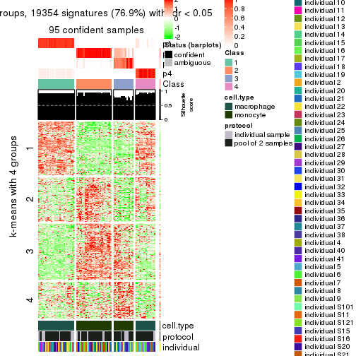</p>

</div>
<div id='tab-MAD-mclust-get-signatures-4'>
<pre><code class="r">get_signatures(res, k = 5)
</code></pre>

<p></p>

</div>
<div id='tab-MAD-mclust-get-signatures-5'>
<pre><code class="r">get_signatures(res, k = 6)
</code></pre>

<p></p>

</div>
</div>


Signature heatmaps where rows are not scaled:


<script>
$( function() {
	$( '#tabs-MAD-mclust-get-signatures-no-scale' ).tabs();
} );
</script>
<div id='tabs-MAD-mclust-get-signatures-no-scale'>
<ul>
<li><a href='#tab-MAD-mclust-get-signatures-no-scale-1'>k = 2</a></li>
<li><a href='#tab-MAD-mclust-get-signatures-no-scale-2'>k = 3</a></li>
<li><a href='#tab-MAD-mclust-get-signatures-no-scale-3'>k = 4</a></li>
<li><a href='#tab-MAD-mclust-get-signatures-no-scale-4'>k = 5</a></li>
<li><a href='#tab-MAD-mclust-get-signatures-no-scale-5'>k = 6</a></li>
</ul>
<div id='tab-MAD-mclust-get-signatures-no-scale-1'>
<pre><code class="r">get_signatures(res, k = 2, scale_rows = FALSE)
</code></pre>

<p></p>

</div>
<div id='tab-MAD-mclust-get-signatures-no-scale-2'>
<pre><code class="r">get_signatures(res, k = 3, scale_rows = FALSE)
</code></pre>

<p></p>

</div>
<div id='tab-MAD-mclust-get-signatures-no-scale-3'>
<pre><code class="r">get_signatures(res, k = 4, scale_rows = FALSE)
</code></pre>

<p></p>

</div>
<div id='tab-MAD-mclust-get-signatures-no-scale-4'>
<pre><code class="r">get_signatures(res, k = 5, scale_rows = FALSE)
</code></pre>

<p></p>

</div>
<div id='tab-MAD-mclust-get-signatures-no-scale-5'>
<pre><code class="r">get_signatures(res, k = 6, scale_rows = FALSE)
</code></pre>

<p></p>

</div>
</div>


Compare the overlap of signatures from different k:

```r
compare_signatures(res)
```


`get_signature()` returns a data frame invisibly. TO get the list of signatures, the function
call should be assigned to a variable explicitly. In following code, if `plot` argument is set
to `FALSE`, no heatmap is plotted while only the differential analysis is performed.

```r
# code only for demonstration
tb = get_signature(res, k = ..., plot = FALSE)
```

An example of the output of `tb` is:

```
#>   which_row         fdr    mean_1    mean_2 scaled_mean_1 scaled_mean_2 km
#> 1        38 0.042760348  8.373488  9.131774    -0.5533452     0.5164555  1
#> 2        40 0.018707592  7.106213  8.469186    -0.6173731     0.5762149  1
#> 3        55 0.019134737 10.221463 11.207825    -0.6159697     0.5749050  1
#> 4        59 0.006059896  5.921854  7.869574    -0.6899429     0.6439467  1
#> 5        60 0.018055526  8.928898 10.211722    -0.6204761     0.5791110  1
#> 6        98 0.009384629 15.714769 14.887706     0.6635654    -0.6193277  2
...
```

The columns in `tb` are:

1. `which_row`: row indices corresponding to the input matrix.
2. `fdr`: FDR for the differential test. 
3. `mean_x`: The mean value in group x.
4. `scaled_mean_x`: The mean value in group x after rows are scaled.
5. `km`: Row groups if k-means clustering is applied to rows.


UMAP plot which shows how samples are separated.


<script>
$( function() {
	$( '#tabs-MAD-mclust-dimension-reduction' ).tabs();
} );
</script>
<div id='tabs-MAD-mclust-dimension-reduction'>
<ul>
<li><a href='#tab-MAD-mclust-dimension-reduction-1'>k = 2</a></li>
<li><a href='#tab-MAD-mclust-dimension-reduction-2'>k = 3</a></li>
<li><a href='#tab-MAD-mclust-dimension-reduction-3'>k = 4</a></li>
<li><a href='#tab-MAD-mclust-dimension-reduction-4'>k = 5</a></li>
<li><a href='#tab-MAD-mclust-dimension-reduction-5'>k = 6</a></li>
</ul>
<div id='tab-MAD-mclust-dimension-reduction-1'>
<pre><code class="r">dimension_reduction(res, k = 2, method = &quot;UMAP&quot;)
</code></pre>

<p></p>

</div>
<div id='tab-MAD-mclust-dimension-reduction-2'>
<pre><code class="r">dimension_reduction(res, k = 3, method = &quot;UMAP&quot;)
</code></pre>

<p></p>

</div>
<div id='tab-MAD-mclust-dimension-reduction-3'>
<pre><code class="r">dimension_reduction(res, k = 4, method = &quot;UMAP&quot;)
</code></pre>

<p></p>

</div>
<div id='tab-MAD-mclust-dimension-reduction-4'>
<pre><code class="r">dimension_reduction(res, k = 5, method = &quot;UMAP&quot;)
</code></pre>

<p></p>

</div>
<div id='tab-MAD-mclust-dimension-reduction-5'>
<pre><code class="r">dimension_reduction(res, k = 6, method = &quot;UMAP&quot;)
</code></pre>

<p></p>

</div>
</div>


Following heatmap shows how subgroups are split when increasing `k`:

```r
collect_classes(res)
```


Test correlation between subgroups and known annotations. If the known
annotation is numeric, one-way ANOVA test is applied, and if the known
annotation is discrete, chi-squared contingency table test is applied.

```r
test_to_known_factors(res)
```

```
#>             n cell.type(p) protocol(p) individual(p) k
#> MAD:mclust 96     8.49e-22       1.000         1.000 2
#> MAD:mclust 96     1.43e-21       0.519         1.000 3
#> MAD:mclust 95     1.85e-20       0.500         0.998 4
#> MAD:mclust 85     1.52e-17       0.246         0.988 5
#> MAD:mclust 78     2.20e-15       0.433         0.843 6
```


If matrix rows can be associated to genes, consider to use `functional_enrichment(res,
...)` to perform function enrichment for the signature genes. See [this vignette](http://bioconductor.org/packages/devel/bioc/vignettes/cola/inst/doc/functional_enrichment.html) for more detailed explanations.


 

---------------------------------------------------


### MAD:NMF**


The object with results only for a single top-value method and a single partition method 
can be extracted as:

```r
res = res_list["MAD", "NMF"]
# you can also extract it by
# res = res_list["MAD:NMF"]
```

A summary of `res` and all the functions that can be applied to it:

```r
res
```

```
#> A 'ConsensusPartition' object with k = 2, 3, 4, 5, 6.
#>   On a matrix with 25171 rows and 96 columns.
#>   Top rows (1000, 2000, 3000, 4000, 5000) are extracted by 'MAD' method.
#>   Subgroups are detected by 'NMF' method.
#>   Performed in total 1250 partitions by row resampling.
#>   Best k for subgroups seems to be 2.
#> 
#> Following methods can be applied to this 'ConsensusPartition' object:
#>  [1] "cola_report"             "collect_classes"         "collect_plots"          
#>  [4] "collect_stats"           "colnames"                "compare_signatures"     
#>  [7] "consensus_heatmap"       "dimension_reduction"     "functional_enrichment"  
#> [10] "get_anno_col"            "get_anno"                "get_classes"            
#> [13] "get_consensus"           "get_matrix"              "get_membership"         
#> [16] "get_param"               "get_signatures"          "get_stats"              
#> [19] "is_best_k"               "is_stable_k"             "membership_heatmap"     
#> [22] "ncol"                    "nrow"                    "plot_ecdf"              
#> [25] "rownames"                "select_partition_number" "show"                   
#> [28] "suggest_best_k"          "test_to_known_factors"
```

`collect_plots()` function collects all the plots made from `res` for all `k` (number of partitions)
into one single page to provide an easy and fast comparison between different `k`.

```r
collect_plots(res)
```


The plots are:

- The first row: a plot of the ECDF (empirical cumulative distribution
  function) curves of the consensus matrix for each `k` and the heatmap of
  predicted classes for each `k`.
- The second row: heatmaps of the consensus matrix for each `k`.
- The third row: heatmaps of the membership matrix for each `k`.
- The fouth row: heatmaps of the signatures for each `k`.

All the plots in panels can be made by individual functions and they are
plotted later in this section.

`select_partition_number()` produces several plots showing different
statistics for choosing "optimized" `k`. There are following statistics:

- ECDF curves of the consensus matrix for each `k`;
- 1-PAC. [The PAC
  score](https://en.wikipedia.org/wiki/Consensus_clustering#Over-interpretation_potential_of_consensus_clustering)
  measures the proportion of the ambiguous subgrouping.
- Mean silhouette score.
- Concordance. The mean probability of fiting the consensus class ids in all
  partitions.
- Area increased. Denote $A_k$ as the area under the ECDF curve for current
  `k`, the area increased is defined as $A_k - A_{k-1}$.
- Rand index. The percent of pairs of samples that are both in a same cluster
  or both are not in a same cluster in the partition of k and k-1.
- Jaccard index. The ratio of pairs of samples are both in a same cluster in
  the partition of k and k-1 and the pairs of samples are both in a same
  cluster in the partition k or k-1.

The detailed explanations of these statistics can be found in [the _cola_
vignette](http://bioconductor.org/packages/devel/bioc/vignettes/cola/inst/doc/cola.html#toc_13).

Generally speaking, lower PAC score, higher mean silhouette score or higher
concordance corresponds to better partition. Rand index and Jaccard index
measure how similar the current partition is compared to partition with `k-1`.
If they are too similar, we won't accept `k` is better than `k-1`.

```r
select_partition_number(res)
```


The numeric values for all these statistics can be obtained by `get_stats()`.

```r
get_stats(res)
```

```
#>   k 1-PAC mean_silhouette concordance area_increased  Rand Jaccard
#> 2 2 1.000           1.000       1.000         0.5058 0.495   0.495
#> 3 3 0.840           0.894       0.915         0.1749 0.900   0.798
#> 4 4 0.681           0.673       0.791         0.1084 0.896   0.750
#> 5 5 0.701           0.765       0.854         0.0888 0.869   0.647
#> 6 6 0.768           0.833       0.888         0.0406 0.953   0.838
```

`suggest_best_k()` suggests the best $k$ based on these statistics. The rules are as follows:

- All $k$ with Jaccard index larger than 0.95 are removed because increasing
  $k$ does not provide enough extra information. If all $k$ are removed, it is
  marked as no subgroup is detected.
- For all $k$ with 1-PAC score larger than 0.9, the maximal $k$ is taken as
  the best $k$, and other $k$ are marked as optional $k$.
- If it does not fit the second rule. The $k$ with the maximal vote of the
  highest 1-PAC score, highest mean silhouette, and highest concordance is
  taken as the best $k$.

```r
suggest_best_k(res)
```

```
#> [1] 2
```


Following shows the table of the partitions (You need to click the **show/hide
code output** link to see it). The membership matrix (columns with name `p*`)
is inferred by
[`clue::cl_consensus()`](https://www.rdocumentation.org/link/cl_consensus?package=clue)
function with the `SE` method. Basically the value in the membership matrix
represents the probability to belong to a certain group. The finall class
label for an item is determined with the group with highest probability it
belongs to.

In `get_classes()` function, the entropy is calculated from the membership
matrix and the silhouette score is calculated from the consensus matrix.


<script>
$( function() {
	$( '#tabs-MAD-NMF-get-classes' ).tabs();
} );
</script>
<div id='tabs-MAD-NMF-get-classes'>
<ul>
<li><a href='#tab-MAD-NMF-get-classes-1'>k = 2</a></li>
<li><a href='#tab-MAD-NMF-get-classes-2'>k = 3</a></li>
<li><a href='#tab-MAD-NMF-get-classes-3'>k = 4</a></li>
<li><a href='#tab-MAD-NMF-get-classes-4'>k = 5</a></li>
<li><a href='#tab-MAD-NMF-get-classes-5'>k = 6</a></li>
</ul>

<div id='tab-MAD-NMF-get-classes-1'>
<p><a id='tab-MAD-NMF-get-classes-1-a' style='color:#0366d6' href='#'>show/hide code output</a></p>
<pre><code class="r">cbind(get_classes(res, k = 2), get_membership(res, k = 2))
</code></pre>

<pre><code>#&gt;           class entropy silhouette p1 p2
#&gt; GSM257886     1       0          1  1  0
#&gt; GSM257888     1       0          1  1  0
#&gt; GSM257890     1       0          1  1  0
#&gt; GSM257892     1       0          1  1  0
#&gt; GSM257894     1       0          1  1  0
#&gt; GSM257896     1       0          1  1  0
#&gt; GSM257898     1       0          1  1  0
#&gt; GSM257900     1       0          1  1  0
#&gt; GSM257902     1       0          1  1  0
#&gt; GSM257904     1       0          1  1  0
#&gt; GSM257906     1       0          1  1  0
#&gt; GSM257908     1       0          1  1  0
#&gt; GSM257910     1       0          1  1  0
#&gt; GSM257912     1       0          1  1  0
#&gt; GSM257914     1       0          1  1  0
#&gt; GSM257917     1       0          1  1  0
#&gt; GSM257919     1       0          1  1  0
#&gt; GSM257921     1       0          1  1  0
#&gt; GSM257923     1       0          1  1  0
#&gt; GSM257925     1       0          1  1  0
#&gt; GSM257927     1       0          1  1  0
#&gt; GSM257929     1       0          1  1  0
#&gt; GSM257937     1       0          1  1  0
#&gt; GSM257939     1       0          1  1  0
#&gt; GSM257941     1       0          1  1  0
#&gt; GSM257943     1       0          1  1  0
#&gt; GSM257945     1       0          1  1  0
#&gt; GSM257947     1       0          1  1  0
#&gt; GSM257949     1       0          1  1  0
#&gt; GSM257951     1       0          1  1  0
#&gt; GSM257953     1       0          1  1  0
#&gt; GSM257955     1       0          1  1  0
#&gt; GSM257958     1       0          1  1  0
#&gt; GSM257960     1       0          1  1  0
#&gt; GSM257962     1       0          1  1  0
#&gt; GSM257964     1       0          1  1  0
#&gt; GSM257966     1       0          1  1  0
#&gt; GSM257968     1       0          1  1  0
#&gt; GSM257970     1       0          1  1  0
#&gt; GSM257972     1       0          1  1  0
#&gt; GSM257977     1       0          1  1  0
#&gt; GSM257982     1       0          1  1  0
#&gt; GSM257984     1       0          1  1  0
#&gt; GSM257986     1       0          1  1  0
#&gt; GSM257990     1       0          1  1  0
#&gt; GSM257992     1       0          1  1  0
#&gt; GSM257996     1       0          1  1  0
#&gt; GSM258006     1       0          1  1  0
#&gt; GSM257887     2       0          1  0  1
#&gt; GSM257889     2       0          1  0  1
#&gt; GSM257891     2       0          1  0  1
#&gt; GSM257893     2       0          1  0  1
#&gt; GSM257895     2       0          1  0  1
#&gt; GSM257897     2       0          1  0  1
#&gt; GSM257899     2       0          1  0  1
#&gt; GSM257901     2       0          1  0  1
#&gt; GSM257903     2       0          1  0  1
#&gt; GSM257905     2       0          1  0  1
#&gt; GSM257907     2       0          1  0  1
#&gt; GSM257909     2       0          1  0  1
#&gt; GSM257911     2       0          1  0  1
#&gt; GSM257913     2       0          1  0  1
#&gt; GSM257916     2       0          1  0  1
#&gt; GSM257918     2       0          1  0  1
#&gt; GSM257920     2       0          1  0  1
#&gt; GSM257922     2       0          1  0  1
#&gt; GSM257924     2       0          1  0  1
#&gt; GSM257926     2       0          1  0  1
#&gt; GSM257928     2       0          1  0  1
#&gt; GSM257930     2       0          1  0  1
#&gt; GSM257938     2       0          1  0  1
#&gt; GSM257940     2       0          1  0  1
#&gt; GSM257942     2       0          1  0  1
#&gt; GSM257944     2       0          1  0  1
#&gt; GSM257946     2       0          1  0  1
#&gt; GSM257948     2       0          1  0  1
#&gt; GSM257950     2       0          1  0  1
#&gt; GSM257952     2       0          1  0  1
#&gt; GSM257954     2       0          1  0  1
#&gt; GSM257956     2       0          1  0  1
#&gt; GSM257959     2       0          1  0  1
#&gt; GSM257961     2       0          1  0  1
#&gt; GSM257963     2       0          1  0  1
#&gt; GSM257965     2       0          1  0  1
#&gt; GSM257967     2       0          1  0  1
#&gt; GSM257969     2       0          1  0  1
#&gt; GSM257971     2       0          1  0  1
#&gt; GSM257973     2       0          1  0  1
#&gt; GSM257981     2       0          1  0  1
#&gt; GSM257983     2       0          1  0  1
#&gt; GSM257985     2       0          1  0  1
#&gt; GSM257988     2       0          1  0  1
#&gt; GSM257991     2       0          1  0  1
#&gt; GSM257993     2       0          1  0  1
#&gt; GSM257994     2       0          1  0  1
#&gt; GSM257989     2       0          1  0  1
</code></pre>

<script>
$('#tab-MAD-NMF-get-classes-1-a').parent().next().next().hide();
$('#tab-MAD-NMF-get-classes-1-a').click(function(){
  $('#tab-MAD-NMF-get-classes-1-a').parent().next().next().toggle();
  return(false);
});
</script>
</div>

<div id='tab-MAD-NMF-get-classes-2'>
<p><a id='tab-MAD-NMF-get-classes-2-a' style='color:#0366d6' href='#'>show/hide code output</a></p>
<pre><code class="r">cbind(get_classes(res, k = 3), get_membership(res, k = 3))
</code></pre>

<pre><code>#&gt;           class entropy silhouette    p1    p2    p3
#&gt; GSM257886     1  0.2625      0.943 0.916 0.000 0.084
#&gt; GSM257888     1  0.0000      0.981 1.000 0.000 0.000
#&gt; GSM257890     1  0.1031      0.974 0.976 0.000 0.024
#&gt; GSM257892     1  0.2878      0.935 0.904 0.000 0.096
#&gt; GSM257894     1  0.0000      0.981 1.000 0.000 0.000
#&gt; GSM257896     1  0.0000      0.981 1.000 0.000 0.000
#&gt; GSM257898     1  0.3752      0.888 0.856 0.000 0.144
#&gt; GSM257900     1  0.0424      0.979 0.992 0.000 0.008
#&gt; GSM257902     1  0.0000      0.981 1.000 0.000 0.000
#&gt; GSM257904     1  0.2448      0.946 0.924 0.000 0.076
#&gt; GSM257906     1  0.3116      0.924 0.892 0.000 0.108
#&gt; GSM257908     1  0.0000      0.981 1.000 0.000 0.000
#&gt; GSM257910     1  0.0000      0.981 1.000 0.000 0.000
#&gt; GSM257912     1  0.0592      0.978 0.988 0.000 0.012
#&gt; GSM257914     1  0.0592      0.978 0.988 0.000 0.012
#&gt; GSM257917     1  0.0747      0.977 0.984 0.000 0.016
#&gt; GSM257919     1  0.0592      0.978 0.988 0.000 0.012
#&gt; GSM257921     1  0.0000      0.981 1.000 0.000 0.000
#&gt; GSM257923     1  0.0000      0.981 1.000 0.000 0.000
#&gt; GSM257925     1  0.0000      0.981 1.000 0.000 0.000
#&gt; GSM257927     1  0.0424      0.979 0.992 0.000 0.008
#&gt; GSM257929     1  0.0000      0.981 1.000 0.000 0.000
#&gt; GSM257937     1  0.0592      0.978 0.988 0.000 0.012
#&gt; GSM257939     1  0.0000      0.981 1.000 0.000 0.000
#&gt; GSM257941     1  0.1964      0.956 0.944 0.000 0.056
#&gt; GSM257943     1  0.2356      0.947 0.928 0.000 0.072
#&gt; GSM257945     1  0.2165      0.952 0.936 0.000 0.064
#&gt; GSM257947     1  0.0000      0.981 1.000 0.000 0.000
#&gt; GSM257949     1  0.0000      0.981 1.000 0.000 0.000
#&gt; GSM257951     1  0.0000      0.981 1.000 0.000 0.000
#&gt; GSM257953     1  0.0000      0.981 1.000 0.000 0.000
#&gt; GSM257955     1  0.0000      0.981 1.000 0.000 0.000
#&gt; GSM257958     1  0.0000      0.981 1.000 0.000 0.000
#&gt; GSM257960     1  0.1643      0.963 0.956 0.000 0.044
#&gt; GSM257962     1  0.0592      0.978 0.988 0.000 0.012
#&gt; GSM257964     1  0.0000      0.981 1.000 0.000 0.000
#&gt; GSM257966     1  0.0592      0.978 0.988 0.000 0.012
#&gt; GSM257968     1  0.0000      0.981 1.000 0.000 0.000
#&gt; GSM257970     1  0.0000      0.981 1.000 0.000 0.000
#&gt; GSM257972     1  0.0000      0.981 1.000 0.000 0.000
#&gt; GSM257977     1  0.0237      0.980 0.996 0.000 0.004
#&gt; GSM257982     1  0.0000      0.981 1.000 0.000 0.000
#&gt; GSM257984     1  0.0000      0.981 1.000 0.000 0.000
#&gt; GSM257986     1  0.0000      0.981 1.000 0.000 0.000
#&gt; GSM257990     1  0.0000      0.981 1.000 0.000 0.000
#&gt; GSM257992     1  0.3686      0.897 0.860 0.000 0.140
#&gt; GSM257996     1  0.0000      0.981 1.000 0.000 0.000
#&gt; GSM258006     1  0.2356      0.947 0.928 0.000 0.072
#&gt; GSM257887     2  0.0424      0.866 0.000 0.992 0.008
#&gt; GSM257889     3  0.5397      0.906 0.000 0.280 0.720
#&gt; GSM257891     3  0.4178      0.775 0.000 0.172 0.828
#&gt; GSM257893     3  0.5968      0.877 0.000 0.364 0.636
#&gt; GSM257895     2  0.1529      0.866 0.000 0.960 0.040
#&gt; GSM257897     3  0.5397      0.906 0.000 0.280 0.720
#&gt; GSM257899     3  0.5560      0.912 0.000 0.300 0.700
#&gt; GSM257901     2  0.3816      0.772 0.000 0.852 0.148
#&gt; GSM257903     2  0.1753      0.841 0.000 0.952 0.048
#&gt; GSM257905     2  0.0000      0.868 0.000 1.000 0.000
#&gt; GSM257907     2  0.4702      0.677 0.000 0.788 0.212
#&gt; GSM257909     2  0.1753      0.836 0.000 0.952 0.048
#&gt; GSM257911     2  0.2066      0.863 0.000 0.940 0.060
#&gt; GSM257913     2  0.2537      0.843 0.000 0.920 0.080
#&gt; GSM257916     2  0.0747      0.864 0.000 0.984 0.016
#&gt; GSM257918     2  0.1289      0.854 0.000 0.968 0.032
#&gt; GSM257920     2  0.4974      0.630 0.000 0.764 0.236
#&gt; GSM257922     3  0.5291      0.888 0.000 0.268 0.732
#&gt; GSM257924     2  0.5216      0.564 0.000 0.740 0.260
#&gt; GSM257926     2  0.5706      0.370 0.000 0.680 0.320
#&gt; GSM257928     3  0.5835      0.892 0.000 0.340 0.660
#&gt; GSM257930     2  0.2878      0.829 0.000 0.904 0.096
#&gt; GSM257938     2  0.1529      0.866 0.000 0.960 0.040
#&gt; GSM257940     2  0.5058      0.612 0.000 0.756 0.244
#&gt; GSM257942     2  0.1411      0.856 0.000 0.964 0.036
#&gt; GSM257944     2  0.2448      0.809 0.000 0.924 0.076
#&gt; GSM257946     3  0.5785      0.907 0.000 0.332 0.668
#&gt; GSM257948     2  0.5058      0.611 0.000 0.756 0.244
#&gt; GSM257950     3  0.6140      0.792 0.000 0.404 0.596
#&gt; GSM257952     2  0.2165      0.854 0.000 0.936 0.064
#&gt; GSM257954     2  0.0892      0.869 0.000 0.980 0.020
#&gt; GSM257956     2  0.0747      0.869 0.000 0.984 0.016
#&gt; GSM257959     2  0.1529      0.843 0.000 0.960 0.040
#&gt; GSM257961     2  0.0237      0.867 0.000 0.996 0.004
#&gt; GSM257963     2  0.0747      0.862 0.000 0.984 0.016
#&gt; GSM257965     2  0.0892      0.870 0.000 0.980 0.020
#&gt; GSM257967     2  0.1643      0.840 0.000 0.956 0.044
#&gt; GSM257969     2  0.1163      0.869 0.000 0.972 0.028
#&gt; GSM257971     3  0.5497      0.908 0.000 0.292 0.708
#&gt; GSM257973     2  0.4750      0.670 0.000 0.784 0.216
#&gt; GSM257981     2  0.1753      0.863 0.000 0.952 0.048
#&gt; GSM257983     3  0.5882      0.887 0.000 0.348 0.652
#&gt; GSM257985     3  0.5760      0.909 0.000 0.328 0.672
#&gt; GSM257988     2  0.4842      0.664 0.000 0.776 0.224
#&gt; GSM257991     2  0.0892      0.869 0.000 0.980 0.020
#&gt; GSM257993     2  0.0237      0.867 0.000 0.996 0.004
#&gt; GSM257994     2  0.1643      0.865 0.000 0.956 0.044
#&gt; GSM257989     3  0.5926      0.881 0.000 0.356 0.644
</code></pre>

<script>
$('#tab-MAD-NMF-get-classes-2-a').parent().next().next().hide();
$('#tab-MAD-NMF-get-classes-2-a').click(function(){
  $('#tab-MAD-NMF-get-classes-2-a').parent().next().next().toggle();
  return(false);
});
</script>
</div>

<div id='tab-MAD-NMF-get-classes-3'>
<p><a id='tab-MAD-NMF-get-classes-3-a' style='color:#0366d6' href='#'>show/hide code output</a></p>
<pre><code class="r">cbind(get_classes(res, k = 4), get_membership(res, k = 4))
</code></pre>

<pre><code>#&gt;           class entropy silhouette    p1    p2    p3    p4
#&gt; GSM257886     1  0.5528     0.7593 0.700 0.000 0.064 0.236
#&gt; GSM257888     1  0.1151     0.9209 0.968 0.000 0.024 0.008
#&gt; GSM257890     1  0.4410     0.8438 0.808 0.000 0.064 0.128
#&gt; GSM257892     1  0.5528     0.7593 0.700 0.000 0.064 0.236
#&gt; GSM257894     1  0.0000     0.9281 1.000 0.000 0.000 0.000
#&gt; GSM257896     1  0.0188     0.9277 0.996 0.000 0.004 0.000
#&gt; GSM257898     1  0.5821     0.5859 0.592 0.000 0.040 0.368
#&gt; GSM257900     1  0.2342     0.8976 0.912 0.000 0.008 0.080
#&gt; GSM257902     1  0.0000     0.9281 1.000 0.000 0.000 0.000
#&gt; GSM257904     1  0.5489     0.7582 0.700 0.000 0.060 0.240
#&gt; GSM257906     1  0.5463     0.7484 0.692 0.000 0.052 0.256
#&gt; GSM257908     1  0.0188     0.9274 0.996 0.000 0.004 0.000
#&gt; GSM257910     1  0.0592     0.9247 0.984 0.000 0.016 0.000
#&gt; GSM257912     1  0.2385     0.9046 0.920 0.000 0.052 0.028
#&gt; GSM257914     1  0.2002     0.9109 0.936 0.000 0.044 0.020
#&gt; GSM257917     1  0.4804     0.8223 0.776 0.000 0.064 0.160
#&gt; GSM257919     1  0.2002     0.9109 0.936 0.000 0.044 0.020
#&gt; GSM257921     1  0.2224     0.9113 0.928 0.000 0.040 0.032
#&gt; GSM257923     1  0.0000     0.9281 1.000 0.000 0.000 0.000
#&gt; GSM257925     1  0.0000     0.9281 1.000 0.000 0.000 0.000
#&gt; GSM257927     1  0.0921     0.9217 0.972 0.000 0.000 0.028
#&gt; GSM257929     1  0.0000     0.9281 1.000 0.000 0.000 0.000
#&gt; GSM257937     1  0.2089     0.9094 0.932 0.000 0.048 0.020
#&gt; GSM257939     1  0.0000     0.9281 1.000 0.000 0.000 0.000
#&gt; GSM257941     1  0.2921     0.8661 0.860 0.000 0.000 0.140
#&gt; GSM257943     1  0.4818     0.7862 0.748 0.000 0.036 0.216
#&gt; GSM257945     1  0.3266     0.8475 0.832 0.000 0.000 0.168
#&gt; GSM257947     1  0.0000     0.9281 1.000 0.000 0.000 0.000
#&gt; GSM257949     1  0.0000     0.9281 1.000 0.000 0.000 0.000
#&gt; GSM257951     1  0.0000     0.9281 1.000 0.000 0.000 0.000
#&gt; GSM257953     1  0.0000     0.9281 1.000 0.000 0.000 0.000
#&gt; GSM257955     1  0.0000     0.9281 1.000 0.000 0.000 0.000
#&gt; GSM257958     1  0.0000     0.9281 1.000 0.000 0.000 0.000
#&gt; GSM257960     1  0.3498     0.8495 0.832 0.000 0.008 0.160
#&gt; GSM257962     1  0.1302     0.9161 0.956 0.000 0.000 0.044
#&gt; GSM257964     1  0.0000     0.9281 1.000 0.000 0.000 0.000
#&gt; GSM257966     1  0.1406     0.9182 0.960 0.000 0.024 0.016
#&gt; GSM257968     1  0.0000     0.9281 1.000 0.000 0.000 0.000
#&gt; GSM257970     1  0.0000     0.9281 1.000 0.000 0.000 0.000
#&gt; GSM257972     1  0.0000     0.9281 1.000 0.000 0.000 0.000
#&gt; GSM257977     1  0.1406     0.9190 0.960 0.000 0.024 0.016
#&gt; GSM257982     1  0.0000     0.9281 1.000 0.000 0.000 0.000
#&gt; GSM257984     1  0.0000     0.9281 1.000 0.000 0.000 0.000
#&gt; GSM257986     1  0.0000     0.9281 1.000 0.000 0.000 0.000
#&gt; GSM257990     1  0.0000     0.9281 1.000 0.000 0.000 0.000
#&gt; GSM257992     4  0.6079    -0.4329 0.464 0.000 0.044 0.492
#&gt; GSM257996     1  0.0000     0.9281 1.000 0.000 0.000 0.000
#&gt; GSM258006     1  0.5056     0.7768 0.732 0.000 0.044 0.224
#&gt; GSM257887     2  0.0000     0.7696 0.000 1.000 0.000 0.000
#&gt; GSM257889     4  0.7005     0.2648 0.000 0.172 0.256 0.572
#&gt; GSM257891     3  0.6705     0.0425 0.000 0.088 0.472 0.440
#&gt; GSM257893     4  0.5947     0.2199 0.000 0.384 0.044 0.572
#&gt; GSM257895     2  0.0188     0.7684 0.000 0.996 0.004 0.000
#&gt; GSM257897     4  0.6267     0.3870 0.000 0.188 0.148 0.664
#&gt; GSM257899     4  0.6780     0.3293 0.000 0.232 0.164 0.604
#&gt; GSM257901     3  0.7044     0.6678 0.000 0.276 0.560 0.164
#&gt; GSM257903     2  0.4964     0.4297 0.000 0.616 0.380 0.004
#&gt; GSM257905     2  0.1302     0.7588 0.000 0.956 0.044 0.000
#&gt; GSM257907     3  0.7344     0.6748 0.000 0.268 0.524 0.208
#&gt; GSM257909     2  0.4193     0.6153 0.000 0.732 0.268 0.000
#&gt; GSM257911     3  0.4647     0.5447 0.000 0.288 0.704 0.008
#&gt; GSM257913     3  0.6500     0.5822 0.000 0.376 0.544 0.080
#&gt; GSM257916     2  0.3688     0.6382 0.000 0.792 0.208 0.000
#&gt; GSM257918     2  0.4134     0.5949 0.000 0.740 0.260 0.000
#&gt; GSM257920     3  0.7458     0.6702 0.000 0.288 0.500 0.212
#&gt; GSM257922     4  0.5833     0.3933 0.000 0.212 0.096 0.692
#&gt; GSM257924     2  0.7764    -0.6023 0.000 0.424 0.324 0.252
#&gt; GSM257926     3  0.7689     0.6255 0.000 0.300 0.452 0.248
#&gt; GSM257928     2  0.5411     0.3257 0.000 0.656 0.032 0.312
#&gt; GSM257930     2  0.1297     0.7512 0.000 0.964 0.016 0.020
#&gt; GSM257938     2  0.0524     0.7648 0.000 0.988 0.008 0.004
#&gt; GSM257940     3  0.7269     0.6753 0.000 0.264 0.536 0.200
#&gt; GSM257942     2  0.5132     0.1874 0.000 0.548 0.448 0.004
#&gt; GSM257944     2  0.5607     0.3433 0.000 0.492 0.488 0.020
#&gt; GSM257946     4  0.7699    -0.3861 0.000 0.220 0.380 0.400
#&gt; GSM257948     3  0.7442     0.6725 0.000 0.284 0.504 0.212
#&gt; GSM257950     3  0.7586     0.5243 0.000 0.212 0.460 0.328
#&gt; GSM257952     2  0.6960    -0.5070 0.000 0.468 0.420 0.112
#&gt; GSM257954     2  0.0000     0.7696 0.000 1.000 0.000 0.000
#&gt; GSM257956     2  0.0336     0.7684 0.000 0.992 0.008 0.000
#&gt; GSM257959     2  0.1637     0.7576 0.000 0.940 0.060 0.000
#&gt; GSM257961     2  0.0000     0.7696 0.000 1.000 0.000 0.000
#&gt; GSM257963     2  0.0707     0.7672 0.000 0.980 0.020 0.000
#&gt; GSM257965     3  0.5167     0.1043 0.000 0.488 0.508 0.004
#&gt; GSM257967     2  0.2469     0.7300 0.000 0.892 0.108 0.000
#&gt; GSM257969     2  0.0000     0.7696 0.000 1.000 0.000 0.000
#&gt; GSM257971     4  0.7168     0.2677 0.000 0.256 0.192 0.552
#&gt; GSM257973     3  0.7408     0.6737 0.000 0.276 0.512 0.212
#&gt; GSM257981     3  0.5292     0.2643 0.000 0.480 0.512 0.008
#&gt; GSM257983     3  0.7486     0.4665 0.000 0.188 0.464 0.348
#&gt; GSM257985     3  0.7710     0.4182 0.000 0.224 0.408 0.368
#&gt; GSM257988     3  0.6912     0.6252 0.000 0.216 0.592 0.192
#&gt; GSM257991     3  0.4661     0.4756 0.000 0.348 0.652 0.000
#&gt; GSM257993     2  0.0188     0.7684 0.000 0.996 0.004 0.000
#&gt; GSM257994     2  0.0927     0.7588 0.000 0.976 0.008 0.016
#&gt; GSM257989     3  0.7520     0.4877 0.000 0.196 0.464 0.340
</code></pre>

<script>
$('#tab-MAD-NMF-get-classes-3-a').parent().next().next().hide();
$('#tab-MAD-NMF-get-classes-3-a').click(function(){
  $('#tab-MAD-NMF-get-classes-3-a').parent().next().next().toggle();
  return(false);
});
</script>
</div>

<div id='tab-MAD-NMF-get-classes-4'>
<p><a id='tab-MAD-NMF-get-classes-4-a' style='color:#0366d6' href='#'>show/hide code output</a></p>
<pre><code class="r">cbind(get_classes(res, k = 5), get_membership(res, k = 5))
</code></pre>

<pre><code>#&gt;           class entropy silhouette    p1    p2    p3    p4    p5
#&gt; GSM257886     4  0.2966     0.9676 0.184 0.000 0.000 0.816 0.000
#&gt; GSM257888     1  0.0510     0.9189 0.984 0.000 0.000 0.016 0.000
#&gt; GSM257890     4  0.3480     0.8874 0.248 0.000 0.000 0.752 0.000
#&gt; GSM257892     4  0.2929     0.9708 0.180 0.000 0.000 0.820 0.000
#&gt; GSM257894     1  0.0162     0.9244 0.996 0.000 0.000 0.004 0.000
#&gt; GSM257896     1  0.0404     0.9210 0.988 0.000 0.000 0.012 0.000
#&gt; GSM257898     4  0.3163     0.9584 0.164 0.000 0.000 0.824 0.012
#&gt; GSM257900     1  0.4138     0.2281 0.616 0.000 0.000 0.384 0.000
#&gt; GSM257902     1  0.0000     0.9249 1.000 0.000 0.000 0.000 0.000
#&gt; GSM257904     4  0.3048     0.9710 0.176 0.000 0.000 0.820 0.004
#&gt; GSM257906     4  0.3048     0.9710 0.176 0.000 0.000 0.820 0.004
#&gt; GSM257908     1  0.0000     0.9249 1.000 0.000 0.000 0.000 0.000
#&gt; GSM257910     1  0.0000     0.9249 1.000 0.000 0.000 0.000 0.000
#&gt; GSM257912     1  0.1041     0.9061 0.964 0.000 0.000 0.032 0.004
#&gt; GSM257914     1  0.0162     0.9244 0.996 0.000 0.000 0.004 0.000
#&gt; GSM257917     1  0.4201     0.1432 0.592 0.000 0.000 0.408 0.000
#&gt; GSM257919     1  0.0162     0.9244 0.996 0.000 0.000 0.004 0.000
#&gt; GSM257921     1  0.1608     0.8749 0.928 0.000 0.000 0.072 0.000
#&gt; GSM257923     1  0.0000     0.9249 1.000 0.000 0.000 0.000 0.000
#&gt; GSM257925     1  0.0162     0.9244 0.996 0.000 0.000 0.000 0.004
#&gt; GSM257927     1  0.1851     0.8539 0.912 0.000 0.000 0.088 0.000
#&gt; GSM257929     1  0.0162     0.9244 0.996 0.000 0.000 0.000 0.004
#&gt; GSM257937     1  0.2377     0.8092 0.872 0.000 0.000 0.128 0.000
#&gt; GSM257939     1  0.0162     0.9244 0.996 0.000 0.000 0.000 0.004
#&gt; GSM257941     1  0.4718    -0.1004 0.540 0.000 0.000 0.444 0.016
#&gt; GSM257943     4  0.2970     0.9659 0.168 0.000 0.000 0.828 0.004
#&gt; GSM257945     1  0.4769     0.4743 0.688 0.000 0.000 0.256 0.056
#&gt; GSM257947     1  0.0162     0.9244 0.996 0.000 0.000 0.000 0.004
#&gt; GSM257949     1  0.0000     0.9249 1.000 0.000 0.000 0.000 0.000
#&gt; GSM257951     1  0.0162     0.9244 0.996 0.000 0.000 0.000 0.004
#&gt; GSM257953     1  0.0162     0.9244 0.996 0.000 0.000 0.000 0.004
#&gt; GSM257955     1  0.0579     0.9169 0.984 0.000 0.000 0.008 0.008
#&gt; GSM257958     1  0.0162     0.9244 0.996 0.000 0.000 0.000 0.004
#&gt; GSM257960     1  0.3452     0.6213 0.756 0.000 0.000 0.244 0.000
#&gt; GSM257962     1  0.0963     0.9047 0.964 0.000 0.000 0.036 0.000
#&gt; GSM257964     1  0.0000     0.9249 1.000 0.000 0.000 0.000 0.000
#&gt; GSM257966     1  0.0290     0.9231 0.992 0.000 0.000 0.008 0.000
#&gt; GSM257968     1  0.0000     0.9249 1.000 0.000 0.000 0.000 0.000
#&gt; GSM257970     1  0.0000     0.9249 1.000 0.000 0.000 0.000 0.000
#&gt; GSM257972     1  0.0162     0.9244 0.996 0.000 0.000 0.004 0.000
#&gt; GSM257977     1  0.1671     0.8693 0.924 0.000 0.000 0.076 0.000
#&gt; GSM257982     1  0.0162     0.9244 0.996 0.000 0.000 0.004 0.000
#&gt; GSM257984     1  0.0000     0.9249 1.000 0.000 0.000 0.000 0.000
#&gt; GSM257986     1  0.0000     0.9249 1.000 0.000 0.000 0.000 0.000
#&gt; GSM257990     1  0.0324     0.9224 0.992 0.000 0.000 0.004 0.004
#&gt; GSM257992     4  0.2886     0.9403 0.148 0.000 0.000 0.844 0.008
#&gt; GSM257996     1  0.0162     0.9244 0.996 0.000 0.000 0.004 0.000
#&gt; GSM258006     4  0.2929     0.9708 0.180 0.000 0.000 0.820 0.000
#&gt; GSM257887     2  0.1082     0.8637 0.000 0.964 0.028 0.000 0.008
#&gt; GSM257889     3  0.4745     0.6065 0.000 0.048 0.724 0.012 0.216
#&gt; GSM257891     3  0.2131     0.6747 0.000 0.008 0.920 0.016 0.056
#&gt; GSM257893     3  0.7504     0.1693 0.000 0.308 0.372 0.036 0.284
#&gt; GSM257895     2  0.1282     0.8475 0.000 0.952 0.044 0.004 0.000
#&gt; GSM257897     3  0.5815     0.5432 0.000 0.072 0.616 0.024 0.288
#&gt; GSM257899     3  0.5895     0.6240 0.000 0.148 0.624 0.008 0.220
#&gt; GSM257901     3  0.3493     0.7523 0.000 0.108 0.832 0.000 0.060
#&gt; GSM257903     5  0.6191     0.7259 0.000 0.424 0.136 0.000 0.440
#&gt; GSM257905     2  0.2074     0.8414 0.000 0.920 0.036 0.000 0.044
#&gt; GSM257907     3  0.3192     0.7551 0.000 0.112 0.848 0.000 0.040
#&gt; GSM257909     2  0.4163     0.4879 0.000 0.740 0.032 0.000 0.228
#&gt; GSM257911     3  0.5006     0.6524 0.000 0.116 0.704 0.000 0.180
#&gt; GSM257913     3  0.5295     0.6201 0.000 0.200 0.672 0.000 0.128
#&gt; GSM257916     2  0.4277     0.5668 0.000 0.784 0.112 0.004 0.100
#&gt; GSM257918     2  0.4119     0.6036 0.000 0.780 0.068 0.000 0.152
#&gt; GSM257920     3  0.3289     0.7547 0.000 0.108 0.844 0.000 0.048
#&gt; GSM257922     3  0.6996     0.4496 0.000 0.124 0.496 0.052 0.328
#&gt; GSM257924     3  0.4558     0.6888 0.000 0.224 0.728 0.008 0.040
#&gt; GSM257926     3  0.2707     0.7540 0.000 0.132 0.860 0.000 0.008
#&gt; GSM257928     2  0.3764     0.5972 0.000 0.808 0.004 0.040 0.148
#&gt; GSM257930     2  0.1095     0.8537 0.000 0.968 0.012 0.008 0.012
#&gt; GSM257938     2  0.0727     0.8483 0.000 0.980 0.004 0.012 0.004
#&gt; GSM257940     3  0.3215     0.7533 0.000 0.092 0.852 0.000 0.056
#&gt; GSM257942     5  0.6667     0.6975 0.000 0.364 0.232 0.000 0.404
#&gt; GSM257944     5  0.5798     0.6876 0.000 0.336 0.108 0.000 0.556
#&gt; GSM257946     3  0.3482     0.7488 0.000 0.096 0.844 0.008 0.052
#&gt; GSM257948     3  0.3454     0.7528 0.000 0.100 0.836 0.000 0.064
#&gt; GSM257950     3  0.2349     0.7547 0.000 0.084 0.900 0.012 0.004
#&gt; GSM257952     3  0.4533     0.6156 0.000 0.260 0.704 0.004 0.032
#&gt; GSM257954     2  0.0609     0.8622 0.000 0.980 0.020 0.000 0.000
#&gt; GSM257956     2  0.1124     0.8612 0.000 0.960 0.036 0.004 0.000
#&gt; GSM257959     2  0.2448     0.8011 0.000 0.892 0.020 0.000 0.088
#&gt; GSM257961     2  0.1310     0.8630 0.000 0.956 0.024 0.000 0.020
#&gt; GSM257963     2  0.1579     0.8550 0.000 0.944 0.024 0.000 0.032
#&gt; GSM257965     3  0.6778    -0.3266 0.000 0.364 0.408 0.004 0.224
#&gt; GSM257967     2  0.3043     0.7734 0.000 0.864 0.056 0.000 0.080
#&gt; GSM257969     2  0.0880     0.8629 0.000 0.968 0.032 0.000 0.000
#&gt; GSM257971     3  0.5304     0.6924 0.000 0.168 0.696 0.008 0.128
#&gt; GSM257973     3  0.3115     0.7543 0.000 0.112 0.852 0.000 0.036
#&gt; GSM257981     3  0.5231     0.4595 0.000 0.316 0.624 0.004 0.056
#&gt; GSM257983     3  0.1270     0.7459 0.000 0.052 0.948 0.000 0.000
#&gt; GSM257985     3  0.2731     0.7581 0.000 0.104 0.876 0.004 0.016
#&gt; GSM257988     3  0.3141     0.7252 0.000 0.040 0.852 0.000 0.108
#&gt; GSM257991     3  0.6524    -0.0688 0.000 0.200 0.444 0.000 0.356
#&gt; GSM257993     2  0.0290     0.8556 0.000 0.992 0.008 0.000 0.000
#&gt; GSM257994     2  0.0727     0.8483 0.000 0.980 0.004 0.012 0.004
#&gt; GSM257989     3  0.1798     0.7482 0.000 0.064 0.928 0.004 0.004
</code></pre>

<script>
$('#tab-MAD-NMF-get-classes-4-a').parent().next().next().hide();
$('#tab-MAD-NMF-get-classes-4-a').click(function(){
  $('#tab-MAD-NMF-get-classes-4-a').parent().next().next().toggle();
  return(false);
});
</script>
</div>

<div id='tab-MAD-NMF-get-classes-5'>
<p><a id='tab-MAD-NMF-get-classes-5-a' style='color:#0366d6' href='#'>show/hide code output</a></p>
<pre><code class="r">cbind(get_classes(res, k = 6), get_membership(res, k = 6))
</code></pre>

<pre><code>#&gt;           class entropy silhouette    p1    p2    p3 p4    p5    p6
#&gt; GSM257886     6  0.0622      0.850 0.000 0.000 0.000 NA 0.012 0.980
#&gt; GSM257888     1  0.1478      0.920 0.944 0.000 0.000 NA 0.032 0.004
#&gt; GSM257890     6  0.2467      0.822 0.048 0.000 0.000 NA 0.036 0.896
#&gt; GSM257892     6  0.0520      0.850 0.000 0.000 0.000 NA 0.008 0.984
#&gt; GSM257894     1  0.1088      0.926 0.960 0.000 0.000 NA 0.024 0.000
#&gt; GSM257896     1  0.1334      0.922 0.948 0.000 0.000 NA 0.032 0.000
#&gt; GSM257898     6  0.0291      0.853 0.000 0.000 0.000 NA 0.004 0.992
#&gt; GSM257900     6  0.4150      0.441 0.372 0.000 0.000 NA 0.004 0.612
#&gt; GSM257902     1  0.0146      0.932 0.996 0.000 0.000 NA 0.000 0.000
#&gt; GSM257904     6  0.0146      0.853 0.000 0.000 0.000 NA 0.004 0.996
#&gt; GSM257906     6  0.0000      0.853 0.000 0.000 0.000 NA 0.000 1.000
#&gt; GSM257908     1  0.0858      0.927 0.968 0.000 0.000 NA 0.028 0.000
#&gt; GSM257910     1  0.0858      0.927 0.968 0.000 0.000 NA 0.028 0.000
#&gt; GSM257912     1  0.3304      0.817 0.804 0.000 0.000 NA 0.168 0.020
#&gt; GSM257914     1  0.1511      0.921 0.940 0.000 0.000 NA 0.044 0.012
#&gt; GSM257917     6  0.3969      0.684 0.212 0.000 0.000 NA 0.044 0.740
#&gt; GSM257919     1  0.2002      0.903 0.908 0.000 0.000 NA 0.076 0.012
#&gt; GSM257921     1  0.3724      0.741 0.772 0.000 0.000 NA 0.028 0.188
#&gt; GSM257923     1  0.0260      0.932 0.992 0.000 0.000 NA 0.000 0.000
#&gt; GSM257925     1  0.0551      0.931 0.984 0.000 0.000 NA 0.004 0.004
#&gt; GSM257927     1  0.4589      0.252 0.580 0.000 0.000 NA 0.008 0.384
#&gt; GSM257929     1  0.0405      0.931 0.988 0.000 0.000 NA 0.000 0.004
#&gt; GSM257937     1  0.2664      0.887 0.884 0.000 0.000 NA 0.040 0.056
#&gt; GSM257939     1  0.0363      0.932 0.988 0.000 0.000 NA 0.000 0.000
#&gt; GSM257941     6  0.3111      0.772 0.156 0.000 0.000 NA 0.008 0.820
#&gt; GSM257943     6  0.0405      0.852 0.000 0.000 0.000 NA 0.004 0.988
#&gt; GSM257945     6  0.4280      0.735 0.092 0.000 0.000 NA 0.004 0.736
#&gt; GSM257947     1  0.0363      0.932 0.988 0.000 0.000 NA 0.000 0.000
#&gt; GSM257949     1  0.0146      0.932 0.996 0.000 0.000 NA 0.000 0.000
#&gt; GSM257951     1  0.0260      0.932 0.992 0.000 0.000 NA 0.000 0.000
#&gt; GSM257953     1  0.0405      0.931 0.988 0.000 0.000 NA 0.000 0.004
#&gt; GSM257955     1  0.0260      0.932 0.992 0.000 0.000 NA 0.000 0.000
#&gt; GSM257958     1  0.0508      0.931 0.984 0.000 0.000 NA 0.004 0.000
#&gt; GSM257960     6  0.3393      0.736 0.192 0.000 0.000 NA 0.004 0.784
#&gt; GSM257962     1  0.5635      0.179 0.532 0.000 0.000 NA 0.012 0.336
#&gt; GSM257964     1  0.0000      0.932 1.000 0.000 0.000 NA 0.000 0.000
#&gt; GSM257966     1  0.1555      0.920 0.940 0.000 0.000 NA 0.040 0.008
#&gt; GSM257968     1  0.0820      0.928 0.972 0.000 0.000 NA 0.016 0.000
#&gt; GSM257970     1  0.0260      0.932 0.992 0.000 0.000 NA 0.000 0.000
#&gt; GSM257972     1  0.0551      0.932 0.984 0.000 0.000 NA 0.004 0.008
#&gt; GSM257977     1  0.2271      0.902 0.908 0.000 0.000 NA 0.036 0.032
#&gt; GSM257982     1  0.0909      0.928 0.968 0.000 0.000 NA 0.020 0.000
#&gt; GSM257984     1  0.0146      0.932 0.996 0.000 0.000 NA 0.000 0.000
#&gt; GSM257986     1  0.0146      0.932 0.996 0.000 0.000 NA 0.000 0.000
#&gt; GSM257990     1  0.2872      0.820 0.832 0.000 0.000 NA 0.004 0.012
#&gt; GSM257992     6  0.0291      0.853 0.000 0.000 0.000 NA 0.004 0.992
#&gt; GSM257996     1  0.1262      0.923 0.956 0.000 0.000 NA 0.008 0.020
#&gt; GSM258006     6  0.0260      0.853 0.000 0.000 0.000 NA 0.008 0.992
#&gt; GSM257887     2  0.2121      0.858 0.000 0.892 0.096 NA 0.012 0.000
#&gt; GSM257889     3  0.1536      0.869 0.000 0.016 0.940 NA 0.004 0.000
#&gt; GSM257891     3  0.1779      0.827 0.000 0.000 0.920 NA 0.016 0.000
#&gt; GSM257893     3  0.4948      0.475 0.000 0.316 0.604 NA 0.004 0.000
#&gt; GSM257895     2  0.3252      0.798 0.000 0.828 0.128 NA 0.012 0.000
#&gt; GSM257897     3  0.2492      0.853 0.000 0.020 0.876 NA 0.004 0.000
#&gt; GSM257899     3  0.2269      0.892 0.000 0.080 0.896 NA 0.012 0.000
#&gt; GSM257901     3  0.1349      0.896 0.000 0.056 0.940 NA 0.004 0.000
#&gt; GSM257903     5  0.4518      0.764 0.000 0.352 0.044 NA 0.604 0.000
#&gt; GSM257905     2  0.2728      0.847 0.000 0.860 0.100 NA 0.040 0.000
#&gt; GSM257907     3  0.1411      0.895 0.000 0.060 0.936 NA 0.004 0.000
#&gt; GSM257909     2  0.3118      0.799 0.000 0.836 0.072 NA 0.092 0.000
#&gt; GSM257911     3  0.2094      0.889 0.000 0.080 0.900 NA 0.020 0.000
#&gt; GSM257913     3  0.3370      0.824 0.000 0.148 0.804 NA 0.048 0.000
#&gt; GSM257916     2  0.2744      0.794 0.000 0.840 0.144 NA 0.016 0.000
#&gt; GSM257918     2  0.3044      0.835 0.000 0.836 0.116 NA 0.048 0.000
#&gt; GSM257920     3  0.1682      0.896 0.000 0.052 0.928 NA 0.020 0.000
#&gt; GSM257922     3  0.3370      0.831 0.000 0.048 0.804 NA 0.000 0.000
#&gt; GSM257924     3  0.2902      0.804 0.000 0.196 0.800 NA 0.004 0.000
#&gt; GSM257926     3  0.1444      0.894 0.000 0.072 0.928 NA 0.000 0.000
#&gt; GSM257928     2  0.3094      0.689 0.000 0.824 0.036 NA 0.000 0.000
#&gt; GSM257930     2  0.2914      0.823 0.000 0.860 0.084 NA 0.008 0.000
#&gt; GSM257938     2  0.2106      0.765 0.000 0.904 0.032 NA 0.000 0.000
#&gt; GSM257940     3  0.1265      0.895 0.000 0.044 0.948 NA 0.008 0.000
#&gt; GSM257942     5  0.5329      0.509 0.000 0.444 0.104 NA 0.452 0.000
#&gt; GSM257944     5  0.3898      0.726 0.000 0.296 0.020 NA 0.684 0.000
#&gt; GSM257946     3  0.1464      0.895 0.000 0.036 0.944 NA 0.004 0.000
#&gt; GSM257948     3  0.1864      0.893 0.000 0.040 0.924 NA 0.032 0.000
#&gt; GSM257950     3  0.1616      0.879 0.000 0.020 0.940 NA 0.012 0.000
#&gt; GSM257952     3  0.2755      0.857 0.000 0.140 0.844 NA 0.012 0.000
#&gt; GSM257954     2  0.1588      0.856 0.000 0.924 0.072 NA 0.000 0.000
#&gt; GSM257956     2  0.2053      0.848 0.000 0.888 0.108 NA 0.000 0.000
#&gt; GSM257959     2  0.2629      0.752 0.000 0.868 0.040 NA 0.092 0.000
#&gt; GSM257961     2  0.2404      0.854 0.000 0.884 0.080 NA 0.036 0.000
#&gt; GSM257963     2  0.2442      0.837 0.000 0.884 0.068 NA 0.048 0.000
#&gt; GSM257965     3  0.4148      0.493 0.000 0.344 0.636 NA 0.016 0.000
#&gt; GSM257967     2  0.2954      0.839 0.000 0.844 0.108 NA 0.048 0.000
#&gt; GSM257969     2  0.2053      0.847 0.000 0.888 0.108 NA 0.000 0.000
#&gt; GSM257971     3  0.2554      0.886 0.000 0.088 0.880 NA 0.012 0.000
#&gt; GSM257973     3  0.1563      0.896 0.000 0.056 0.932 NA 0.012 0.000
#&gt; GSM257981     3  0.2673      0.863 0.000 0.132 0.852 NA 0.012 0.000
#&gt; GSM257983     3  0.0405      0.883 0.000 0.000 0.988 NA 0.008 0.000
#&gt; GSM257985     3  0.1555      0.895 0.000 0.060 0.932 NA 0.004 0.000
#&gt; GSM257988     3  0.1088      0.889 0.000 0.016 0.960 NA 0.024 0.000
#&gt; GSM257991     3  0.4414      0.720 0.000 0.108 0.712 NA 0.180 0.000
#&gt; GSM257993     2  0.1624      0.837 0.000 0.936 0.044 NA 0.008 0.000
#&gt; GSM257994     2  0.2249      0.765 0.000 0.900 0.032 NA 0.004 0.000
#&gt; GSM257989     3  0.0881      0.879 0.000 0.008 0.972 NA 0.012 0.000
</code></pre>

<script>
$('#tab-MAD-NMF-get-classes-5-a').parent().next().next().hide();
$('#tab-MAD-NMF-get-classes-5-a').click(function(){
  $('#tab-MAD-NMF-get-classes-5-a').parent().next().next().toggle();
  return(false);
});
</script>
</div>
</div>

Heatmaps for the consensus matrix. It visualizes the probability of two
samples to be in a same group.


<script>
$( function() {
	$( '#tabs-MAD-NMF-consensus-heatmap' ).tabs();
} );
</script>
<div id='tabs-MAD-NMF-consensus-heatmap'>
<ul>
<li><a href='#tab-MAD-NMF-consensus-heatmap-1'>k = 2</a></li>
<li><a href='#tab-MAD-NMF-consensus-heatmap-2'>k = 3</a></li>
<li><a href='#tab-MAD-NMF-consensus-heatmap-3'>k = 4</a></li>
<li><a href='#tab-MAD-NMF-consensus-heatmap-4'>k = 5</a></li>
<li><a href='#tab-MAD-NMF-consensus-heatmap-5'>k = 6</a></li>
</ul>
<div id='tab-MAD-NMF-consensus-heatmap-1'>
<pre><code class="r">consensus_heatmap(res, k = 2)
</code></pre>

<p></p>

</div>
<div id='tab-MAD-NMF-consensus-heatmap-2'>
<pre><code class="r">consensus_heatmap(res, k = 3)
</code></pre>

<p></p>

</div>
<div id='tab-MAD-NMF-consensus-heatmap-3'>
<pre><code class="r">consensus_heatmap(res, k = 4)
</code></pre>

<p></p>

</div>
<div id='tab-MAD-NMF-consensus-heatmap-4'>
<pre><code class="r">consensus_heatmap(res, k = 5)
</code></pre>

<p></p>

</div>
<div id='tab-MAD-NMF-consensus-heatmap-5'>
<pre><code class="r">consensus_heatmap(res, k = 6)
</code></pre>

<p></p>

</div>
</div>

Heatmaps for the membership of samples in all partitions to see how consistent they are:


<script>
$( function() {
	$( '#tabs-MAD-NMF-membership-heatmap' ).tabs();
} );
</script>
<div id='tabs-MAD-NMF-membership-heatmap'>
<ul>
<li><a href='#tab-MAD-NMF-membership-heatmap-1'>k = 2</a></li>
<li><a href='#tab-MAD-NMF-membership-heatmap-2'>k = 3</a></li>
<li><a href='#tab-MAD-NMF-membership-heatmap-3'>k = 4</a></li>
<li><a href='#tab-MAD-NMF-membership-heatmap-4'>k = 5</a></li>
<li><a href='#tab-MAD-NMF-membership-heatmap-5'>k = 6</a></li>
</ul>
<div id='tab-MAD-NMF-membership-heatmap-1'>
<pre><code class="r">membership_heatmap(res, k = 2)
</code></pre>

<p></p>

</div>
<div id='tab-MAD-NMF-membership-heatmap-2'>
<pre><code class="r">membership_heatmap(res, k = 3)
</code></pre>

<p></p>

</div>
<div id='tab-MAD-NMF-membership-heatmap-3'>
<pre><code class="r">membership_heatmap(res, k = 4)
</code></pre>

<p>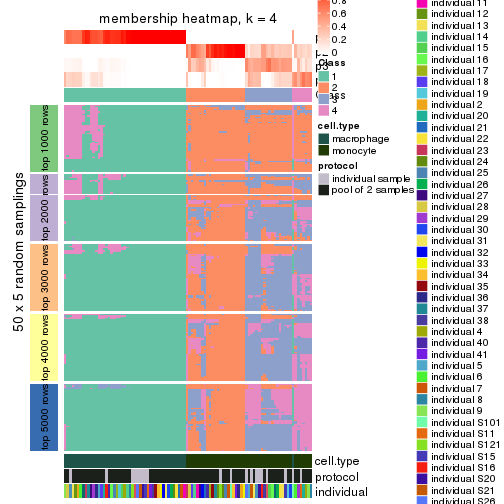</p>

</div>
<div id='tab-MAD-NMF-membership-heatmap-4'>
<pre><code class="r">membership_heatmap(res, k = 5)
</code></pre>

<p></p>

</div>
<div id='tab-MAD-NMF-membership-heatmap-5'>
<pre><code class="r">membership_heatmap(res, k = 6)
</code></pre>

<p></p>

</div>
</div>

As soon as we have had the classes for columns, we can look for signatures
which are significantly different between classes which can be candidate marks
for certain classes. Following are the heatmaps for signatures.


Signature heatmaps where rows are scaled:


<script>
$( function() {
	$( '#tabs-MAD-NMF-get-signatures' ).tabs();
} );
</script>
<div id='tabs-MAD-NMF-get-signatures'>
<ul>
<li><a href='#tab-MAD-NMF-get-signatures-1'>k = 2</a></li>
<li><a href='#tab-MAD-NMF-get-signatures-2'>k = 3</a></li>
<li><a href='#tab-MAD-NMF-get-signatures-3'>k = 4</a></li>
<li><a href='#tab-MAD-NMF-get-signatures-4'>k = 5</a></li>
<li><a href='#tab-MAD-NMF-get-signatures-5'>k = 6</a></li>
</ul>
<div id='tab-MAD-NMF-get-signatures-1'>
<pre><code class="r">get_signatures(res, k = 2)
</code></pre>

<p></p>

</div>
<div id='tab-MAD-NMF-get-signatures-2'>
<pre><code class="r">get_signatures(res, k = 3)
</code></pre>

<p></p>

</div>
<div id='tab-MAD-NMF-get-signatures-3'>
<pre><code class="r">get_signatures(res, k = 4)
</code></pre>

<p></p>

</div>
<div id='tab-MAD-NMF-get-signatures-4'>
<pre><code class="r">get_signatures(res, k = 5)
</code></pre>

<p></p>

</div>
<div id='tab-MAD-NMF-get-signatures-5'>
<pre><code class="r">get_signatures(res, k = 6)
</code></pre>

<p></p>

</div>
</div>


Signature heatmaps where rows are not scaled:


<script>
$( function() {
	$( '#tabs-MAD-NMF-get-signatures-no-scale' ).tabs();
} );
</script>
<div id='tabs-MAD-NMF-get-signatures-no-scale'>
<ul>
<li><a href='#tab-MAD-NMF-get-signatures-no-scale-1'>k = 2</a></li>
<li><a href='#tab-MAD-NMF-get-signatures-no-scale-2'>k = 3</a></li>
<li><a href='#tab-MAD-NMF-get-signatures-no-scale-3'>k = 4</a></li>
<li><a href='#tab-MAD-NMF-get-signatures-no-scale-4'>k = 5</a></li>
<li><a href='#tab-MAD-NMF-get-signatures-no-scale-5'>k = 6</a></li>
</ul>
<div id='tab-MAD-NMF-get-signatures-no-scale-1'>
<pre><code class="r">get_signatures(res, k = 2, scale_rows = FALSE)
</code></pre>

<p></p>

</div>
<div id='tab-MAD-NMF-get-signatures-no-scale-2'>
<pre><code class="r">get_signatures(res, k = 3, scale_rows = FALSE)
</code></pre>

<p></p>

</div>
<div id='tab-MAD-NMF-get-signatures-no-scale-3'>
<pre><code class="r">get_signatures(res, k = 4, scale_rows = FALSE)
</code></pre>

<p></p>

</div>
<div id='tab-MAD-NMF-get-signatures-no-scale-4'>
<pre><code class="r">get_signatures(res, k = 5, scale_rows = FALSE)
</code></pre>

<p></p>

</div>
<div id='tab-MAD-NMF-get-signatures-no-scale-5'>
<pre><code class="r">get_signatures(res, k = 6, scale_rows = FALSE)
</code></pre>

<p></p>

</div>
</div>


Compare the overlap of signatures from different k:

```r
compare_signatures(res)
```


`get_signature()` returns a data frame invisibly. TO get the list of signatures, the function
call should be assigned to a variable explicitly. In following code, if `plot` argument is set
to `FALSE`, no heatmap is plotted while only the differential analysis is performed.

```r
# code only for demonstration
tb = get_signature(res, k = ..., plot = FALSE)
```

An example of the output of `tb` is:

```
#>   which_row         fdr    mean_1    mean_2 scaled_mean_1 scaled_mean_2 km
#> 1        38 0.042760348  8.373488  9.131774    -0.5533452     0.5164555  1
#> 2        40 0.018707592  7.106213  8.469186    -0.6173731     0.5762149  1
#> 3        55 0.019134737 10.221463 11.207825    -0.6159697     0.5749050  1
#> 4        59 0.006059896  5.921854  7.869574    -0.6899429     0.6439467  1
#> 5        60 0.018055526  8.928898 10.211722    -0.6204761     0.5791110  1
#> 6        98 0.009384629 15.714769 14.887706     0.6635654    -0.6193277  2
...
```

The columns in `tb` are:

1. `which_row`: row indices corresponding to the input matrix.
2. `fdr`: FDR for the differential test. 
3. `mean_x`: The mean value in group x.
4. `scaled_mean_x`: The mean value in group x after rows are scaled.
5. `km`: Row groups if k-means clustering is applied to rows.


UMAP plot which shows how samples are separated.


<script>
$( function() {
	$( '#tabs-MAD-NMF-dimension-reduction' ).tabs();
} );
</script>
<div id='tabs-MAD-NMF-dimension-reduction'>
<ul>
<li><a href='#tab-MAD-NMF-dimension-reduction-1'>k = 2</a></li>
<li><a href='#tab-MAD-NMF-dimension-reduction-2'>k = 3</a></li>
<li><a href='#tab-MAD-NMF-dimension-reduction-3'>k = 4</a></li>
<li><a href='#tab-MAD-NMF-dimension-reduction-4'>k = 5</a></li>
<li><a href='#tab-MAD-NMF-dimension-reduction-5'>k = 6</a></li>
</ul>
<div id='tab-MAD-NMF-dimension-reduction-1'>
<pre><code class="r">dimension_reduction(res, k = 2, method = &quot;UMAP&quot;)
</code></pre>

<p></p>

</div>
<div id='tab-MAD-NMF-dimension-reduction-2'>
<pre><code class="r">dimension_reduction(res, k = 3, method = &quot;UMAP&quot;)
</code></pre>

<p></p>

</div>
<div id='tab-MAD-NMF-dimension-reduction-3'>
<pre><code class="r">dimension_reduction(res, k = 4, method = &quot;UMAP&quot;)
</code></pre>

<p></p>

</div>
<div id='tab-MAD-NMF-dimension-reduction-4'>
<pre><code class="r">dimension_reduction(res, k = 5, method = &quot;UMAP&quot;)
</code></pre>

<p></p>

</div>
<div id='tab-MAD-NMF-dimension-reduction-5'>
<pre><code class="r">dimension_reduction(res, k = 6, method = &quot;UMAP&quot;)
</code></pre>

<p></p>

</div>
</div>


Following heatmap shows how subgroups are split when increasing `k`:

```r
collect_classes(res)
```


Test correlation between subgroups and known annotations. If the known
annotation is numeric, one-way ANOVA test is applied, and if the known
annotation is discrete, chi-squared contingency table test is applied.

```r
test_to_known_factors(res)
```

```
#>          n cell.type(p) protocol(p) individual(p) k
#> MAD:NMF 96     8.49e-22       1.000         1.000 2
#> MAD:NMF 95     2.35e-21       0.614         1.000 3
#> MAD:NMF 75     5.18e-17       0.786         0.999 4
#> MAD:NMF 86     9.31e-18       0.685         0.926 5
#> MAD:NMF 91     8.07e-19       0.399         0.985 6
```


If matrix rows can be associated to genes, consider to use `functional_enrichment(res,
...)` to perform function enrichment for the signature genes. See [this vignette](http://bioconductor.org/packages/devel/bioc/vignettes/cola/inst/doc/functional_enrichment.html) for more detailed explanations.


 

---------------------------------------------------


### ATC:hclust*


The object with results only for a single top-value method and a single partition method 
can be extracted as:

```r
res = res_list["ATC", "hclust"]
# you can also extract it by
# res = res_list["ATC:hclust"]
```

A summary of `res` and all the functions that can be applied to it:

```r
res
```

```
#> A 'ConsensusPartition' object with k = 2, 3, 4, 5, 6.
#>   On a matrix with 25171 rows and 96 columns.
#>   Top rows (1000, 2000, 3000, 4000, 5000) are extracted by 'ATC' method.
#>   Subgroups are detected by 'hclust' method.
#>   Performed in total 1250 partitions by row resampling.
#>   Best k for subgroups seems to be 5.
#> 
#> Following methods can be applied to this 'ConsensusPartition' object:
#>  [1] "cola_report"             "collect_classes"         "collect_plots"          
#>  [4] "collect_stats"           "colnames"                "compare_signatures"     
#>  [7] "consensus_heatmap"       "dimension_reduction"     "functional_enrichment"  
#> [10] "get_anno_col"            "get_anno"                "get_classes"            
#> [13] "get_consensus"           "get_matrix"              "get_membership"         
#> [16] "get_param"               "get_signatures"          "get_stats"              
#> [19] "is_best_k"               "is_stable_k"             "membership_heatmap"     
#> [22] "ncol"                    "nrow"                    "plot_ecdf"              
#> [25] "rownames"                "select_partition_number" "show"                   
#> [28] "suggest_best_k"          "test_to_known_factors"
```

`collect_plots()` function collects all the plots made from `res` for all `k` (number of partitions)
into one single page to provide an easy and fast comparison between different `k`.

```r
collect_plots(res)
```

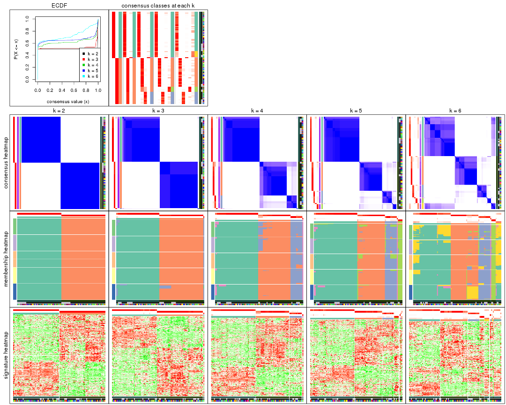

The plots are:

- The first row: a plot of the ECDF (empirical cumulative distribution
  function) curves of the consensus matrix for each `k` and the heatmap of
  predicted classes for each `k`.
- The second row: heatmaps of the consensus matrix for each `k`.
- The third row: heatmaps of the membership matrix for each `k`.
- The fouth row: heatmaps of the signatures for each `k`.

All the plots in panels can be made by individual functions and they are
plotted later in this section.

`select_partition_number()` produces several plots showing different
statistics for choosing "optimized" `k`. There are following statistics:

- ECDF curves of the consensus matrix for each `k`;
- 1-PAC. [The PAC
  score](https://en.wikipedia.org/wiki/Consensus_clustering#Over-interpretation_potential_of_consensus_clustering)
  measures the proportion of the ambiguous subgrouping.
- Mean silhouette score.
- Concordance. The mean probability of fiting the consensus class ids in all
  partitions.
- Area increased. Denote $A_k$ as the area under the ECDF curve for current
  `k`, the area increased is defined as $A_k - A_{k-1}$.
- Rand index. The percent of pairs of samples that are both in a same cluster
  or both are not in a same cluster in the partition of k and k-1.
- Jaccard index. The ratio of pairs of samples are both in a same cluster in
  the partition of k and k-1 and the pairs of samples are both in a same
  cluster in the partition k or k-1.

The detailed explanations of these statistics can be found in [the _cola_
vignette](http://bioconductor.org/packages/devel/bioc/vignettes/cola/inst/doc/cola.html#toc_13).

Generally speaking, lower PAC score, higher mean silhouette score or higher
concordance corresponds to better partition. Rand index and Jaccard index
measure how similar the current partition is compared to partition with `k-1`.
If they are too similar, we won't accept `k` is better than `k-1`.

```r
select_partition_number(res)
```


The numeric values for all these statistics can be obtained by `get_stats()`.

```r
get_stats(res)
```

```
#>   k 1-PAC mean_silhouette concordance area_increased  Rand Jaccard
#> 2 2 1.000           1.000       1.000         0.5058 0.495   0.495
#> 3 3 1.000           0.968       0.988         0.0387 0.990   0.979
#> 4 4 0.912           0.909       0.962         0.1900 0.900   0.794
#> 5 5 0.938           0.914       0.957         0.0580 0.967   0.914
#> 6 6 0.753           0.727       0.862         0.1070 0.946   0.847
```

`suggest_best_k()` suggests the best $k$ based on these statistics. The rules are as follows:

- All $k$ with Jaccard index larger than 0.95 are removed because increasing
  $k$ does not provide enough extra information. If all $k$ are removed, it is
  marked as no subgroup is detected.
- For all $k$ with 1-PAC score larger than 0.9, the maximal $k$ is taken as
  the best $k$, and other $k$ are marked as optional $k$.
- If it does not fit the second rule. The $k$ with the maximal vote of the
  highest 1-PAC score, highest mean silhouette, and highest concordance is
  taken as the best $k$.

```r
suggest_best_k(res)
```

```
#> [1] 5
#> attr(,"optional")
#> [1] 2 4
```

There is also optional best $k$ = 2 4 that is worth to check.

Following shows the table of the partitions (You need to click the **show/hide
code output** link to see it). The membership matrix (columns with name `p*`)
is inferred by
[`clue::cl_consensus()`](https://www.rdocumentation.org/link/cl_consensus?package=clue)
function with the `SE` method. Basically the value in the membership matrix
represents the probability to belong to a certain group. The finall class
label for an item is determined with the group with highest probability it
belongs to.

In `get_classes()` function, the entropy is calculated from the membership
matrix and the silhouette score is calculated from the consensus matrix.


<script>
$( function() {
	$( '#tabs-ATC-hclust-get-classes' ).tabs();
} );
</script>
<div id='tabs-ATC-hclust-get-classes'>
<ul>
<li><a href='#tab-ATC-hclust-get-classes-1'>k = 2</a></li>
<li><a href='#tab-ATC-hclust-get-classes-2'>k = 3</a></li>
<li><a href='#tab-ATC-hclust-get-classes-3'>k = 4</a></li>
<li><a href='#tab-ATC-hclust-get-classes-4'>k = 5</a></li>
<li><a href='#tab-ATC-hclust-get-classes-5'>k = 6</a></li>
</ul>

<div id='tab-ATC-hclust-get-classes-1'>
<p><a id='tab-ATC-hclust-get-classes-1-a' style='color:#0366d6' href='#'>show/hide code output</a></p>
<pre><code class="r">cbind(get_classes(res, k = 2), get_membership(res, k = 2))
</code></pre>

<pre><code>#&gt;           class entropy silhouette p1 p2
#&gt; GSM257886     1       0          1  1  0
#&gt; GSM257888     1       0          1  1  0
#&gt; GSM257890     1       0          1  1  0
#&gt; GSM257892     1       0          1  1  0
#&gt; GSM257894     1       0          1  1  0
#&gt; GSM257896     1       0          1  1  0
#&gt; GSM257898     1       0          1  1  0
#&gt; GSM257900     1       0          1  1  0
#&gt; GSM257902     1       0          1  1  0
#&gt; GSM257904     1       0          1  1  0
#&gt; GSM257906     1       0          1  1  0
#&gt; GSM257908     1       0          1  1  0
#&gt; GSM257910     1       0          1  1  0
#&gt; GSM257912     1       0          1  1  0
#&gt; GSM257914     1       0          1  1  0
#&gt; GSM257917     1       0          1  1  0
#&gt; GSM257919     1       0          1  1  0
#&gt; GSM257921     1       0          1  1  0
#&gt; GSM257923     1       0          1  1  0
#&gt; GSM257925     1       0          1  1  0
#&gt; GSM257927     1       0          1  1  0
#&gt; GSM257929     1       0          1  1  0
#&gt; GSM257937     1       0          1  1  0
#&gt; GSM257939     1       0          1  1  0
#&gt; GSM257941     1       0          1  1  0
#&gt; GSM257943     1       0          1  1  0
#&gt; GSM257945     1       0          1  1  0
#&gt; GSM257947     1       0          1  1  0
#&gt; GSM257949     1       0          1  1  0
#&gt; GSM257951     1       0          1  1  0
#&gt; GSM257953     1       0          1  1  0
#&gt; GSM257955     1       0          1  1  0
#&gt; GSM257958     1       0          1  1  0
#&gt; GSM257960     1       0          1  1  0
#&gt; GSM257962     1       0          1  1  0
#&gt; GSM257964     1       0          1  1  0
#&gt; GSM257966     1       0          1  1  0
#&gt; GSM257968     1       0          1  1  0
#&gt; GSM257970     1       0          1  1  0
#&gt; GSM257972     1       0          1  1  0
#&gt; GSM257977     1       0          1  1  0
#&gt; GSM257982     1       0          1  1  0
#&gt; GSM257984     1       0          1  1  0
#&gt; GSM257986     1       0          1  1  0
#&gt; GSM257990     1       0          1  1  0
#&gt; GSM257992     1       0          1  1  0
#&gt; GSM257996     1       0          1  1  0
#&gt; GSM258006     1       0          1  1  0
#&gt; GSM257887     2       0          1  0  1
#&gt; GSM257889     2       0          1  0  1
#&gt; GSM257891     2       0          1  0  1
#&gt; GSM257893     2       0          1  0  1
#&gt; GSM257895     2       0          1  0  1
#&gt; GSM257897     2       0          1  0  1
#&gt; GSM257899     2       0          1  0  1
#&gt; GSM257901     2       0          1  0  1
#&gt; GSM257903     2       0          1  0  1
#&gt; GSM257905     2       0          1  0  1
#&gt; GSM257907     2       0          1  0  1
#&gt; GSM257909     2       0          1  0  1
#&gt; GSM257911     2       0          1  0  1
#&gt; GSM257913     2       0          1  0  1
#&gt; GSM257916     2       0          1  0  1
#&gt; GSM257918     2       0          1  0  1
#&gt; GSM257920     2       0          1  0  1
#&gt; GSM257922     2       0          1  0  1
#&gt; GSM257924     2       0          1  0  1
#&gt; GSM257926     2       0          1  0  1
#&gt; GSM257928     2       0          1  0  1
#&gt; GSM257930     2       0          1  0  1
#&gt; GSM257938     2       0          1  0  1
#&gt; GSM257940     2       0          1  0  1
#&gt; GSM257942     2       0          1  0  1
#&gt; GSM257944     2       0          1  0  1
#&gt; GSM257946     2       0          1  0  1
#&gt; GSM257948     2       0          1  0  1
#&gt; GSM257950     2       0          1  0  1
#&gt; GSM257952     2       0          1  0  1
#&gt; GSM257954     2       0          1  0  1
#&gt; GSM257956     2       0          1  0  1
#&gt; GSM257959     2       0          1  0  1
#&gt; GSM257961     2       0          1  0  1
#&gt; GSM257963     2       0          1  0  1
#&gt; GSM257965     2       0          1  0  1
#&gt; GSM257967     2       0          1  0  1
#&gt; GSM257969     2       0          1  0  1
#&gt; GSM257971     2       0          1  0  1
#&gt; GSM257973     2       0          1  0  1
#&gt; GSM257981     2       0          1  0  1
#&gt; GSM257983     2       0          1  0  1
#&gt; GSM257985     2       0          1  0  1
#&gt; GSM257988     2       0          1  0  1
#&gt; GSM257991     2       0          1  0  1
#&gt; GSM257993     2       0          1  0  1
#&gt; GSM257994     2       0          1  0  1
#&gt; GSM257989     2       0          1  0  1
</code></pre>

<script>
$('#tab-ATC-hclust-get-classes-1-a').parent().next().next().hide();
$('#tab-ATC-hclust-get-classes-1-a').click(function(){
  $('#tab-ATC-hclust-get-classes-1-a').parent().next().next().toggle();
  return(false);
});
</script>
</div>

<div id='tab-ATC-hclust-get-classes-2'>
<p><a id='tab-ATC-hclust-get-classes-2-a' style='color:#0366d6' href='#'>show/hide code output</a></p>
<pre><code class="r">cbind(get_classes(res, k = 3), get_membership(res, k = 3))
</code></pre>

<pre><code>#&gt;           class entropy silhouette    p1    p2    p3
#&gt; GSM257886     1  0.4887      0.708 0.772 0.000 0.228
#&gt; GSM257888     1  0.0892      0.973 0.980 0.000 0.020
#&gt; GSM257890     1  0.4750      0.733 0.784 0.000 0.216
#&gt; GSM257892     3  0.1411      0.000 0.036 0.000 0.964
#&gt; GSM257894     1  0.0892      0.973 0.980 0.000 0.020
#&gt; GSM257896     1  0.0892      0.973 0.980 0.000 0.020
#&gt; GSM257898     1  0.0000      0.985 1.000 0.000 0.000
#&gt; GSM257900     1  0.0000      0.985 1.000 0.000 0.000
#&gt; GSM257902     1  0.0000      0.985 1.000 0.000 0.000
#&gt; GSM257904     1  0.0000      0.985 1.000 0.000 0.000
#&gt; GSM257906     1  0.0000      0.985 1.000 0.000 0.000
#&gt; GSM257908     1  0.0000      0.985 1.000 0.000 0.000
#&gt; GSM257910     1  0.0000      0.985 1.000 0.000 0.000
#&gt; GSM257912     1  0.0000      0.985 1.000 0.000 0.000
#&gt; GSM257914     1  0.0000      0.985 1.000 0.000 0.000
#&gt; GSM257917     1  0.0000      0.985 1.000 0.000 0.000
#&gt; GSM257919     1  0.0000      0.985 1.000 0.000 0.000
#&gt; GSM257921     1  0.0000      0.985 1.000 0.000 0.000
#&gt; GSM257923     1  0.0000      0.985 1.000 0.000 0.000
#&gt; GSM257925     1  0.0000      0.985 1.000 0.000 0.000
#&gt; GSM257927     1  0.0000      0.985 1.000 0.000 0.000
#&gt; GSM257929     1  0.0000      0.985 1.000 0.000 0.000
#&gt; GSM257937     1  0.0892      0.973 0.980 0.000 0.020
#&gt; GSM257939     1  0.0000      0.985 1.000 0.000 0.000
#&gt; GSM257941     1  0.0000      0.985 1.000 0.000 0.000
#&gt; GSM257943     1  0.0000      0.985 1.000 0.000 0.000
#&gt; GSM257945     1  0.0000      0.985 1.000 0.000 0.000
#&gt; GSM257947     1  0.0000      0.985 1.000 0.000 0.000
#&gt; GSM257949     1  0.0000      0.985 1.000 0.000 0.000
#&gt; GSM257951     1  0.0000      0.985 1.000 0.000 0.000
#&gt; GSM257953     1  0.0000      0.985 1.000 0.000 0.000
#&gt; GSM257955     1  0.0000      0.985 1.000 0.000 0.000
#&gt; GSM257958     1  0.0000      0.985 1.000 0.000 0.000
#&gt; GSM257960     1  0.0000      0.985 1.000 0.000 0.000
#&gt; GSM257962     1  0.0000      0.985 1.000 0.000 0.000
#&gt; GSM257964     1  0.0000      0.985 1.000 0.000 0.000
#&gt; GSM257966     1  0.0892      0.973 0.980 0.000 0.020
#&gt; GSM257968     1  0.0892      0.973 0.980 0.000 0.020
#&gt; GSM257970     1  0.0000      0.985 1.000 0.000 0.000
#&gt; GSM257972     1  0.0000      0.985 1.000 0.000 0.000
#&gt; GSM257977     1  0.0892      0.973 0.980 0.000 0.020
#&gt; GSM257982     1  0.0892      0.973 0.980 0.000 0.020
#&gt; GSM257984     1  0.0000      0.985 1.000 0.000 0.000
#&gt; GSM257986     1  0.0000      0.985 1.000 0.000 0.000
#&gt; GSM257990     1  0.0000      0.985 1.000 0.000 0.000
#&gt; GSM257992     1  0.1529      0.952 0.960 0.000 0.040
#&gt; GSM257996     1  0.0000      0.985 1.000 0.000 0.000
#&gt; GSM258006     1  0.1529      0.952 0.960 0.000 0.040
#&gt; GSM257887     2  0.0000      0.990 0.000 1.000 0.000
#&gt; GSM257889     2  0.1411      0.973 0.000 0.964 0.036
#&gt; GSM257891     2  0.1411      0.973 0.000 0.964 0.036
#&gt; GSM257893     2  0.1411      0.973 0.000 0.964 0.036
#&gt; GSM257895     2  0.0000      0.990 0.000 1.000 0.000
#&gt; GSM257897     2  0.1411      0.973 0.000 0.964 0.036
#&gt; GSM257899     2  0.1411      0.973 0.000 0.964 0.036
#&gt; GSM257901     2  0.0000      0.990 0.000 1.000 0.000
#&gt; GSM257903     2  0.0000      0.990 0.000 1.000 0.000
#&gt; GSM257905     2  0.0000      0.990 0.000 1.000 0.000
#&gt; GSM257907     2  0.0000      0.990 0.000 1.000 0.000
#&gt; GSM257909     2  0.0000      0.990 0.000 1.000 0.000
#&gt; GSM257911     2  0.0000      0.990 0.000 1.000 0.000
#&gt; GSM257913     2  0.0000      0.990 0.000 1.000 0.000
#&gt; GSM257916     2  0.0000      0.990 0.000 1.000 0.000
#&gt; GSM257918     2  0.0000      0.990 0.000 1.000 0.000
#&gt; GSM257920     2  0.0000      0.990 0.000 1.000 0.000
#&gt; GSM257922     2  0.1411      0.973 0.000 0.964 0.036
#&gt; GSM257924     2  0.0000      0.990 0.000 1.000 0.000
#&gt; GSM257926     2  0.0000      0.990 0.000 1.000 0.000
#&gt; GSM257928     2  0.0000      0.990 0.000 1.000 0.000
#&gt; GSM257930     2  0.0000      0.990 0.000 1.000 0.000
#&gt; GSM257938     2  0.0000      0.990 0.000 1.000 0.000
#&gt; GSM257940     2  0.0000      0.990 0.000 1.000 0.000
#&gt; GSM257942     2  0.0000      0.990 0.000 1.000 0.000
#&gt; GSM257944     2  0.0000      0.990 0.000 1.000 0.000
#&gt; GSM257946     2  0.1411      0.973 0.000 0.964 0.036
#&gt; GSM257948     2  0.0000      0.990 0.000 1.000 0.000
#&gt; GSM257950     2  0.1411      0.973 0.000 0.964 0.036
#&gt; GSM257952     2  0.0000      0.990 0.000 1.000 0.000
#&gt; GSM257954     2  0.0000      0.990 0.000 1.000 0.000
#&gt; GSM257956     2  0.0000      0.990 0.000 1.000 0.000
#&gt; GSM257959     2  0.0000      0.990 0.000 1.000 0.000
#&gt; GSM257961     2  0.0000      0.990 0.000 1.000 0.000
#&gt; GSM257963     2  0.0000      0.990 0.000 1.000 0.000
#&gt; GSM257965     2  0.0000      0.990 0.000 1.000 0.000
#&gt; GSM257967     2  0.0000      0.990 0.000 1.000 0.000
#&gt; GSM257969     2  0.0000      0.990 0.000 1.000 0.000
#&gt; GSM257971     2  0.0000      0.990 0.000 1.000 0.000
#&gt; GSM257973     2  0.1411      0.973 0.000 0.964 0.036
#&gt; GSM257981     2  0.0000      0.990 0.000 1.000 0.000
#&gt; GSM257983     2  0.1411      0.973 0.000 0.964 0.036
#&gt; GSM257985     2  0.1411      0.973 0.000 0.964 0.036
#&gt; GSM257988     2  0.1411      0.973 0.000 0.964 0.036
#&gt; GSM257991     2  0.0000      0.990 0.000 1.000 0.000
#&gt; GSM257993     2  0.0000      0.990 0.000 1.000 0.000
#&gt; GSM257994     2  0.0000      0.990 0.000 1.000 0.000
#&gt; GSM257989     2  0.1411      0.973 0.000 0.964 0.036
</code></pre>

<script>
$('#tab-ATC-hclust-get-classes-2-a').parent().next().next().hide();
$('#tab-ATC-hclust-get-classes-2-a').click(function(){
  $('#tab-ATC-hclust-get-classes-2-a').parent().next().next().toggle();
  return(false);
});
</script>
</div>

<div id='tab-ATC-hclust-get-classes-3'>
<p><a id='tab-ATC-hclust-get-classes-3-a' style='color:#0366d6' href='#'>show/hide code output</a></p>
<pre><code class="r">cbind(get_classes(res, k = 4), get_membership(res, k = 4))
</code></pre>

<pre><code>#&gt;           class entropy silhouette    p1    p2    p3    p4
#&gt; GSM257886     1  0.4134      0.669 0.740 0.000 0.000 0.260
#&gt; GSM257888     1  0.0817      0.969 0.976 0.000 0.000 0.024
#&gt; GSM257890     1  0.4008      0.701 0.756 0.000 0.000 0.244
#&gt; GSM257892     4  0.0000      0.000 0.000 0.000 0.000 1.000
#&gt; GSM257894     1  0.0817      0.969 0.976 0.000 0.000 0.024
#&gt; GSM257896     1  0.0817      0.969 0.976 0.000 0.000 0.024
#&gt; GSM257898     1  0.0000      0.983 1.000 0.000 0.000 0.000
#&gt; GSM257900     1  0.0000      0.983 1.000 0.000 0.000 0.000
#&gt; GSM257902     1  0.0000      0.983 1.000 0.000 0.000 0.000
#&gt; GSM257904     1  0.0000      0.983 1.000 0.000 0.000 0.000
#&gt; GSM257906     1  0.0000      0.983 1.000 0.000 0.000 0.000
#&gt; GSM257908     1  0.0000      0.983 1.000 0.000 0.000 0.000
#&gt; GSM257910     1  0.0000      0.983 1.000 0.000 0.000 0.000
#&gt; GSM257912     1  0.0000      0.983 1.000 0.000 0.000 0.000
#&gt; GSM257914     1  0.0000      0.983 1.000 0.000 0.000 0.000
#&gt; GSM257917     1  0.0000      0.983 1.000 0.000 0.000 0.000
#&gt; GSM257919     1  0.0000      0.983 1.000 0.000 0.000 0.000
#&gt; GSM257921     1  0.0000      0.983 1.000 0.000 0.000 0.000
#&gt; GSM257923     1  0.0000      0.983 1.000 0.000 0.000 0.000
#&gt; GSM257925     1  0.0000      0.983 1.000 0.000 0.000 0.000
#&gt; GSM257927     1  0.0000      0.983 1.000 0.000 0.000 0.000
#&gt; GSM257929     1  0.0000      0.983 1.000 0.000 0.000 0.000
#&gt; GSM257937     1  0.0817      0.969 0.976 0.000 0.000 0.024
#&gt; GSM257939     1  0.0000      0.983 1.000 0.000 0.000 0.000
#&gt; GSM257941     1  0.0000      0.983 1.000 0.000 0.000 0.000
#&gt; GSM257943     1  0.0000      0.983 1.000 0.000 0.000 0.000
#&gt; GSM257945     1  0.0000      0.983 1.000 0.000 0.000 0.000
#&gt; GSM257947     1  0.0000      0.983 1.000 0.000 0.000 0.000
#&gt; GSM257949     1  0.0000      0.983 1.000 0.000 0.000 0.000
#&gt; GSM257951     1  0.0000      0.983 1.000 0.000 0.000 0.000
#&gt; GSM257953     1  0.0000      0.983 1.000 0.000 0.000 0.000
#&gt; GSM257955     1  0.0000      0.983 1.000 0.000 0.000 0.000
#&gt; GSM257958     1  0.0000      0.983 1.000 0.000 0.000 0.000
#&gt; GSM257960     1  0.0000      0.983 1.000 0.000 0.000 0.000
#&gt; GSM257962     1  0.0000      0.983 1.000 0.000 0.000 0.000
#&gt; GSM257964     1  0.0000      0.983 1.000 0.000 0.000 0.000
#&gt; GSM257966     1  0.0817      0.969 0.976 0.000 0.000 0.024
#&gt; GSM257968     1  0.0817      0.969 0.976 0.000 0.000 0.024
#&gt; GSM257970     1  0.0000      0.983 1.000 0.000 0.000 0.000
#&gt; GSM257972     1  0.0000      0.983 1.000 0.000 0.000 0.000
#&gt; GSM257977     1  0.0817      0.969 0.976 0.000 0.000 0.024
#&gt; GSM257982     1  0.0817      0.969 0.976 0.000 0.000 0.024
#&gt; GSM257984     1  0.0000      0.983 1.000 0.000 0.000 0.000
#&gt; GSM257986     1  0.0000      0.983 1.000 0.000 0.000 0.000
#&gt; GSM257990     1  0.0000      0.983 1.000 0.000 0.000 0.000
#&gt; GSM257992     1  0.1211      0.952 0.960 0.000 0.000 0.040
#&gt; GSM257996     1  0.0000      0.983 1.000 0.000 0.000 0.000
#&gt; GSM258006     1  0.1211      0.952 0.960 0.000 0.000 0.040
#&gt; GSM257887     2  0.0000      0.928 0.000 1.000 0.000 0.000
#&gt; GSM257889     3  0.0707      0.893 0.000 0.020 0.980 0.000
#&gt; GSM257891     3  0.0000      0.885 0.000 0.000 1.000 0.000
#&gt; GSM257893     3  0.2149      0.903 0.000 0.088 0.912 0.000
#&gt; GSM257895     2  0.0000      0.928 0.000 1.000 0.000 0.000
#&gt; GSM257897     3  0.0000      0.885 0.000 0.000 1.000 0.000
#&gt; GSM257899     3  0.0000      0.885 0.000 0.000 1.000 0.000
#&gt; GSM257901     2  0.0707      0.922 0.000 0.980 0.020 0.000
#&gt; GSM257903     2  0.0000      0.928 0.000 1.000 0.000 0.000
#&gt; GSM257905     2  0.0000      0.928 0.000 1.000 0.000 0.000
#&gt; GSM257907     2  0.0707      0.922 0.000 0.980 0.020 0.000
#&gt; GSM257909     2  0.0000      0.928 0.000 1.000 0.000 0.000
#&gt; GSM257911     2  0.0000      0.928 0.000 1.000 0.000 0.000
#&gt; GSM257913     2  0.0817      0.920 0.000 0.976 0.024 0.000
#&gt; GSM257916     2  0.0000      0.928 0.000 1.000 0.000 0.000
#&gt; GSM257918     2  0.0000      0.928 0.000 1.000 0.000 0.000
#&gt; GSM257920     2  0.1867      0.893 0.000 0.928 0.072 0.000
#&gt; GSM257922     3  0.0000      0.885 0.000 0.000 1.000 0.000
#&gt; GSM257924     2  0.1867      0.893 0.000 0.928 0.072 0.000
#&gt; GSM257926     2  0.1867      0.893 0.000 0.928 0.072 0.000
#&gt; GSM257928     2  0.4605      0.544 0.000 0.664 0.336 0.000
#&gt; GSM257930     2  0.4605      0.544 0.000 0.664 0.336 0.000
#&gt; GSM257938     2  0.4605      0.544 0.000 0.664 0.336 0.000
#&gt; GSM257940     2  0.0817      0.921 0.000 0.976 0.024 0.000
#&gt; GSM257942     2  0.0000      0.928 0.000 1.000 0.000 0.000
#&gt; GSM257944     2  0.0000      0.928 0.000 1.000 0.000 0.000
#&gt; GSM257946     3  0.2149      0.903 0.000 0.088 0.912 0.000
#&gt; GSM257948     2  0.1867      0.893 0.000 0.928 0.072 0.000
#&gt; GSM257950     3  0.2149      0.903 0.000 0.088 0.912 0.000
#&gt; GSM257952     2  0.0817      0.921 0.000 0.976 0.024 0.000
#&gt; GSM257954     2  0.0000      0.928 0.000 1.000 0.000 0.000
#&gt; GSM257956     2  0.0000      0.928 0.000 1.000 0.000 0.000
#&gt; GSM257959     2  0.0000      0.928 0.000 1.000 0.000 0.000
#&gt; GSM257961     2  0.0000      0.928 0.000 1.000 0.000 0.000
#&gt; GSM257963     2  0.0000      0.928 0.000 1.000 0.000 0.000
#&gt; GSM257965     2  0.0000      0.928 0.000 1.000 0.000 0.000
#&gt; GSM257967     2  0.0000      0.928 0.000 1.000 0.000 0.000
#&gt; GSM257969     2  0.0000      0.928 0.000 1.000 0.000 0.000
#&gt; GSM257971     2  0.4661      0.519 0.000 0.652 0.348 0.000
#&gt; GSM257973     3  0.3266      0.799 0.000 0.168 0.832 0.000
#&gt; GSM257981     2  0.1302      0.911 0.000 0.956 0.044 0.000
#&gt; GSM257983     3  0.0000      0.885 0.000 0.000 1.000 0.000
#&gt; GSM257985     3  0.2216      0.899 0.000 0.092 0.908 0.000
#&gt; GSM257988     3  0.2921      0.842 0.000 0.140 0.860 0.000
#&gt; GSM257991     2  0.0000      0.928 0.000 1.000 0.000 0.000
#&gt; GSM257993     2  0.0000      0.928 0.000 1.000 0.000 0.000
#&gt; GSM257994     2  0.4605      0.544 0.000 0.664 0.336 0.000
#&gt; GSM257989     3  0.2149      0.903 0.000 0.088 0.912 0.000
</code></pre>

<script>
$('#tab-ATC-hclust-get-classes-3-a').parent().next().next().hide();
$('#tab-ATC-hclust-get-classes-3-a').click(function(){
  $('#tab-ATC-hclust-get-classes-3-a').parent().next().next().toggle();
  return(false);
});
</script>
</div>

<div id='tab-ATC-hclust-get-classes-4'>
<p><a id='tab-ATC-hclust-get-classes-4-a' style='color:#0366d6' href='#'>show/hide code output</a></p>
<pre><code class="r">cbind(get_classes(res, k = 5), get_membership(res, k = 5))
</code></pre>

<pre><code>#&gt;           class entropy silhouette    p1    p2    p3    p4    p5
#&gt; GSM257886     1  0.3814      0.656 0.720 0.000 0.000 0.276 0.004
#&gt; GSM257888     1  0.1043      0.962 0.960 0.000 0.000 0.040 0.000
#&gt; GSM257890     1  0.3715      0.689 0.736 0.000 0.000 0.260 0.004
#&gt; GSM257892     4  0.0510      0.000 0.000 0.000 0.000 0.984 0.016
#&gt; GSM257894     1  0.1043      0.962 0.960 0.000 0.000 0.040 0.000
#&gt; GSM257896     1  0.1043      0.962 0.960 0.000 0.000 0.040 0.000
#&gt; GSM257898     1  0.0671      0.972 0.980 0.000 0.000 0.016 0.004
#&gt; GSM257900     1  0.0000      0.977 1.000 0.000 0.000 0.000 0.000
#&gt; GSM257902     1  0.0000      0.977 1.000 0.000 0.000 0.000 0.000
#&gt; GSM257904     1  0.0671      0.972 0.980 0.000 0.000 0.016 0.004
#&gt; GSM257906     1  0.0671      0.972 0.980 0.000 0.000 0.016 0.004
#&gt; GSM257908     1  0.0404      0.975 0.988 0.000 0.000 0.012 0.000
#&gt; GSM257910     1  0.0404      0.975 0.988 0.000 0.000 0.012 0.000
#&gt; GSM257912     1  0.0404      0.975 0.988 0.000 0.000 0.012 0.000
#&gt; GSM257914     1  0.0404      0.975 0.988 0.000 0.000 0.012 0.000
#&gt; GSM257917     1  0.0404      0.975 0.988 0.000 0.000 0.012 0.000
#&gt; GSM257919     1  0.0404      0.975 0.988 0.000 0.000 0.012 0.000
#&gt; GSM257921     1  0.0162      0.977 0.996 0.000 0.000 0.004 0.000
#&gt; GSM257923     1  0.0000      0.977 1.000 0.000 0.000 0.000 0.000
#&gt; GSM257925     1  0.0000      0.977 1.000 0.000 0.000 0.000 0.000
#&gt; GSM257927     1  0.0000      0.977 1.000 0.000 0.000 0.000 0.000
#&gt; GSM257929     1  0.0000      0.977 1.000 0.000 0.000 0.000 0.000
#&gt; GSM257937     1  0.1043      0.962 0.960 0.000 0.000 0.040 0.000
#&gt; GSM257939     1  0.0000      0.977 1.000 0.000 0.000 0.000 0.000
#&gt; GSM257941     1  0.0000      0.977 1.000 0.000 0.000 0.000 0.000
#&gt; GSM257943     1  0.0000      0.977 1.000 0.000 0.000 0.000 0.000
#&gt; GSM257945     1  0.0000      0.977 1.000 0.000 0.000 0.000 0.000
#&gt; GSM257947     1  0.0000      0.977 1.000 0.000 0.000 0.000 0.000
#&gt; GSM257949     1  0.0000      0.977 1.000 0.000 0.000 0.000 0.000
#&gt; GSM257951     1  0.0000      0.977 1.000 0.000 0.000 0.000 0.000
#&gt; GSM257953     1  0.0000      0.977 1.000 0.000 0.000 0.000 0.000
#&gt; GSM257955     1  0.0000      0.977 1.000 0.000 0.000 0.000 0.000
#&gt; GSM257958     1  0.0000      0.977 1.000 0.000 0.000 0.000 0.000
#&gt; GSM257960     1  0.0000      0.977 1.000 0.000 0.000 0.000 0.000
#&gt; GSM257962     1  0.0000      0.977 1.000 0.000 0.000 0.000 0.000
#&gt; GSM257964     1  0.0000      0.977 1.000 0.000 0.000 0.000 0.000
#&gt; GSM257966     1  0.1043      0.962 0.960 0.000 0.000 0.040 0.000
#&gt; GSM257968     1  0.1043      0.962 0.960 0.000 0.000 0.040 0.000
#&gt; GSM257970     1  0.0000      0.977 1.000 0.000 0.000 0.000 0.000
#&gt; GSM257972     1  0.0000      0.977 1.000 0.000 0.000 0.000 0.000
#&gt; GSM257977     1  0.1043      0.962 0.960 0.000 0.000 0.040 0.000
#&gt; GSM257982     1  0.1043      0.962 0.960 0.000 0.000 0.040 0.000
#&gt; GSM257984     1  0.0000      0.977 1.000 0.000 0.000 0.000 0.000
#&gt; GSM257986     1  0.0000      0.977 1.000 0.000 0.000 0.000 0.000
#&gt; GSM257990     1  0.0000      0.977 1.000 0.000 0.000 0.000 0.000
#&gt; GSM257992     1  0.1502      0.944 0.940 0.000 0.000 0.056 0.004
#&gt; GSM257996     1  0.0000      0.977 1.000 0.000 0.000 0.000 0.000
#&gt; GSM258006     1  0.1502      0.944 0.940 0.000 0.000 0.056 0.004
#&gt; GSM257887     2  0.0000      0.945 0.000 1.000 0.000 0.000 0.000
#&gt; GSM257889     3  0.1205      0.880 0.000 0.004 0.956 0.000 0.040
#&gt; GSM257891     3  0.0000      0.862 0.000 0.000 1.000 0.000 0.000
#&gt; GSM257893     3  0.2338      0.891 0.000 0.004 0.884 0.000 0.112
#&gt; GSM257895     2  0.0000      0.945 0.000 1.000 0.000 0.000 0.000
#&gt; GSM257897     3  0.0000      0.862 0.000 0.000 1.000 0.000 0.000
#&gt; GSM257899     3  0.0000      0.862 0.000 0.000 1.000 0.000 0.000
#&gt; GSM257901     2  0.0963      0.933 0.000 0.964 0.000 0.000 0.036
#&gt; GSM257903     2  0.0000      0.945 0.000 1.000 0.000 0.000 0.000
#&gt; GSM257905     2  0.0000      0.945 0.000 1.000 0.000 0.000 0.000
#&gt; GSM257907     2  0.0963      0.933 0.000 0.964 0.000 0.000 0.036
#&gt; GSM257909     2  0.0000      0.945 0.000 1.000 0.000 0.000 0.000
#&gt; GSM257911     2  0.0510      0.940 0.000 0.984 0.000 0.000 0.016
#&gt; GSM257913     2  0.2561      0.871 0.000 0.884 0.020 0.000 0.096
#&gt; GSM257916     2  0.0000      0.945 0.000 1.000 0.000 0.000 0.000
#&gt; GSM257918     2  0.0000      0.945 0.000 1.000 0.000 0.000 0.000
#&gt; GSM257920     2  0.3460      0.820 0.000 0.828 0.044 0.000 0.128
#&gt; GSM257922     3  0.3966      0.495 0.000 0.000 0.664 0.000 0.336
#&gt; GSM257924     2  0.3460      0.820 0.000 0.828 0.044 0.000 0.128
#&gt; GSM257926     2  0.3460      0.820 0.000 0.828 0.044 0.000 0.128
#&gt; GSM257928     5  0.0609      0.967 0.000 0.020 0.000 0.000 0.980
#&gt; GSM257930     5  0.0609      0.967 0.000 0.020 0.000 0.000 0.980
#&gt; GSM257938     5  0.0609      0.967 0.000 0.020 0.000 0.000 0.980
#&gt; GSM257940     2  0.1043      0.931 0.000 0.960 0.000 0.000 0.040
#&gt; GSM257942     2  0.0000      0.945 0.000 1.000 0.000 0.000 0.000
#&gt; GSM257944     2  0.0000      0.945 0.000 1.000 0.000 0.000 0.000
#&gt; GSM257946     3  0.2338      0.891 0.000 0.004 0.884 0.000 0.112
#&gt; GSM257948     2  0.3460      0.820 0.000 0.828 0.044 0.000 0.128
#&gt; GSM257950     3  0.2338      0.891 0.000 0.004 0.884 0.000 0.112
#&gt; GSM257952     2  0.1121      0.929 0.000 0.956 0.000 0.000 0.044
#&gt; GSM257954     2  0.0000      0.945 0.000 1.000 0.000 0.000 0.000
#&gt; GSM257956     2  0.4242      0.239 0.000 0.572 0.000 0.000 0.428
#&gt; GSM257959     2  0.0000      0.945 0.000 1.000 0.000 0.000 0.000
#&gt; GSM257961     2  0.0000      0.945 0.000 1.000 0.000 0.000 0.000
#&gt; GSM257963     2  0.0000      0.945 0.000 1.000 0.000 0.000 0.000
#&gt; GSM257965     2  0.0510      0.940 0.000 0.984 0.000 0.000 0.016
#&gt; GSM257967     2  0.0000      0.945 0.000 1.000 0.000 0.000 0.000
#&gt; GSM257969     2  0.0000      0.945 0.000 1.000 0.000 0.000 0.000
#&gt; GSM257971     5  0.2390      0.863 0.000 0.020 0.084 0.000 0.896
#&gt; GSM257973     3  0.3898      0.807 0.000 0.080 0.804 0.000 0.116
#&gt; GSM257981     2  0.1800      0.915 0.000 0.932 0.020 0.000 0.048
#&gt; GSM257983     3  0.0000      0.862 0.000 0.000 1.000 0.000 0.000
#&gt; GSM257985     3  0.2389      0.889 0.000 0.004 0.880 0.000 0.116
#&gt; GSM257988     3  0.3459      0.845 0.000 0.052 0.832 0.000 0.116
#&gt; GSM257991     2  0.0162      0.944 0.000 0.996 0.000 0.000 0.004
#&gt; GSM257993     2  0.0000      0.945 0.000 1.000 0.000 0.000 0.000
#&gt; GSM257994     5  0.0609      0.967 0.000 0.020 0.000 0.000 0.980
#&gt; GSM257989     3  0.2338      0.891 0.000 0.004 0.884 0.000 0.112
</code></pre>

<script>
$('#tab-ATC-hclust-get-classes-4-a').parent().next().next().hide();
$('#tab-ATC-hclust-get-classes-4-a').click(function(){
  $('#tab-ATC-hclust-get-classes-4-a').parent().next().next().toggle();
  return(false);
});
</script>
</div>

<div id='tab-ATC-hclust-get-classes-5'>
<p><a id='tab-ATC-hclust-get-classes-5-a' style='color:#0366d6' href='#'>show/hide code output</a></p>
<pre><code class="r">cbind(get_classes(res, k = 6), get_membership(res, k = 6))
</code></pre>

<pre><code>#&gt;           class entropy silhouette    p1    p2    p3    p4    p5    p6
#&gt; GSM257886     6  0.5124     0.4857 0.148 0.000 0.000 0.232 0.000 0.620
#&gt; GSM257888     1  0.3394     0.6827 0.776 0.000 0.000 0.024 0.000 0.200
#&gt; GSM257890     1  0.5440     0.2422 0.576 0.000 0.000 0.224 0.000 0.200
#&gt; GSM257892     4  0.0632     0.0000 0.000 0.000 0.000 0.976 0.000 0.024
#&gt; GSM257894     1  0.3364     0.6866 0.780 0.000 0.000 0.024 0.000 0.196
#&gt; GSM257896     1  0.3394     0.6827 0.776 0.000 0.000 0.024 0.000 0.200
#&gt; GSM257898     6  0.3592     0.8508 0.344 0.000 0.000 0.000 0.000 0.656
#&gt; GSM257900     1  0.3828    -0.2320 0.560 0.000 0.000 0.000 0.000 0.440
#&gt; GSM257902     1  0.0363     0.7703 0.988 0.000 0.000 0.012 0.000 0.000
#&gt; GSM257904     6  0.3592     0.8493 0.344 0.000 0.000 0.000 0.000 0.656
#&gt; GSM257906     6  0.3592     0.8493 0.344 0.000 0.000 0.000 0.000 0.656
#&gt; GSM257908     1  0.2260     0.7409 0.860 0.000 0.000 0.000 0.000 0.140
#&gt; GSM257910     1  0.2260     0.7409 0.860 0.000 0.000 0.000 0.000 0.140
#&gt; GSM257912     1  0.2260     0.7409 0.860 0.000 0.000 0.000 0.000 0.140
#&gt; GSM257914     1  0.2260     0.7409 0.860 0.000 0.000 0.000 0.000 0.140
#&gt; GSM257917     1  0.2260     0.7409 0.860 0.000 0.000 0.000 0.000 0.140
#&gt; GSM257919     1  0.2260     0.7409 0.860 0.000 0.000 0.000 0.000 0.140
#&gt; GSM257921     1  0.2135     0.7135 0.872 0.000 0.000 0.000 0.000 0.128
#&gt; GSM257923     1  0.0363     0.7703 0.988 0.000 0.000 0.012 0.000 0.000
#&gt; GSM257925     1  0.0363     0.7703 0.988 0.000 0.000 0.012 0.000 0.000
#&gt; GSM257927     1  0.3774    -0.0993 0.592 0.000 0.000 0.000 0.000 0.408
#&gt; GSM257929     1  0.0363     0.7703 0.988 0.000 0.000 0.012 0.000 0.000
#&gt; GSM257937     1  0.3394     0.6827 0.776 0.000 0.000 0.024 0.000 0.200
#&gt; GSM257939     1  0.0363     0.7703 0.988 0.000 0.000 0.012 0.000 0.000
#&gt; GSM257941     1  0.3531     0.1997 0.672 0.000 0.000 0.000 0.000 0.328
#&gt; GSM257943     1  0.3838    -0.2536 0.552 0.000 0.000 0.000 0.000 0.448
#&gt; GSM257945     1  0.3672     0.0852 0.632 0.000 0.000 0.000 0.000 0.368
#&gt; GSM257947     1  0.0363     0.7703 0.988 0.000 0.000 0.012 0.000 0.000
#&gt; GSM257949     1  0.0508     0.7700 0.984 0.000 0.000 0.012 0.000 0.004
#&gt; GSM257951     1  0.0363     0.7703 0.988 0.000 0.000 0.012 0.000 0.000
#&gt; GSM257953     1  0.0260     0.7706 0.992 0.000 0.000 0.000 0.000 0.008
#&gt; GSM257955     1  0.0363     0.7703 0.988 0.000 0.000 0.012 0.000 0.000
#&gt; GSM257958     1  0.0363     0.7703 0.988 0.000 0.000 0.012 0.000 0.000
#&gt; GSM257960     1  0.3563     0.1783 0.664 0.000 0.000 0.000 0.000 0.336
#&gt; GSM257962     1  0.3563     0.1783 0.664 0.000 0.000 0.000 0.000 0.336
#&gt; GSM257964     1  0.0363     0.7703 0.988 0.000 0.000 0.012 0.000 0.000
#&gt; GSM257966     1  0.3394     0.6827 0.776 0.000 0.000 0.024 0.000 0.200
#&gt; GSM257968     1  0.3394     0.6827 0.776 0.000 0.000 0.024 0.000 0.200
#&gt; GSM257970     1  0.0363     0.7703 0.988 0.000 0.000 0.012 0.000 0.000
#&gt; GSM257972     1  0.0547     0.7709 0.980 0.000 0.000 0.000 0.000 0.020
#&gt; GSM257977     1  0.3394     0.6827 0.776 0.000 0.000 0.024 0.000 0.200
#&gt; GSM257982     1  0.3394     0.6827 0.776 0.000 0.000 0.024 0.000 0.200
#&gt; GSM257984     1  0.0363     0.7703 0.988 0.000 0.000 0.012 0.000 0.000
#&gt; GSM257986     1  0.0363     0.7703 0.988 0.000 0.000 0.012 0.000 0.000
#&gt; GSM257990     1  0.0547     0.7699 0.980 0.000 0.000 0.000 0.000 0.020
#&gt; GSM257992     6  0.3710     0.8617 0.292 0.000 0.000 0.012 0.000 0.696
#&gt; GSM257996     1  0.0790     0.7687 0.968 0.000 0.000 0.000 0.000 0.032
#&gt; GSM258006     6  0.3710     0.8617 0.292 0.000 0.000 0.012 0.000 0.696
#&gt; GSM257887     2  0.0000     0.8791 0.000 1.000 0.000 0.000 0.000 0.000
#&gt; GSM257889     3  0.1686     0.8758 0.000 0.000 0.924 0.000 0.012 0.064
#&gt; GSM257891     3  0.1908     0.8597 0.000 0.000 0.900 0.004 0.000 0.096
#&gt; GSM257893     3  0.0713     0.8863 0.000 0.000 0.972 0.000 0.028 0.000
#&gt; GSM257895     2  0.0000     0.8791 0.000 1.000 0.000 0.000 0.000 0.000
#&gt; GSM257897     3  0.2170     0.8545 0.000 0.000 0.888 0.012 0.000 0.100
#&gt; GSM257899     3  0.2170     0.8545 0.000 0.000 0.888 0.012 0.000 0.100
#&gt; GSM257901     2  0.3436     0.8233 0.000 0.796 0.020 0.000 0.012 0.172
#&gt; GSM257903     2  0.0000     0.8791 0.000 1.000 0.000 0.000 0.000 0.000
#&gt; GSM257905     2  0.0000     0.8791 0.000 1.000 0.000 0.000 0.000 0.000
#&gt; GSM257907     2  0.3436     0.8233 0.000 0.796 0.020 0.000 0.012 0.172
#&gt; GSM257909     2  0.0000     0.8791 0.000 1.000 0.000 0.000 0.000 0.000
#&gt; GSM257911     2  0.2703     0.8328 0.000 0.824 0.000 0.000 0.004 0.172
#&gt; GSM257913     2  0.4420     0.7772 0.000 0.728 0.092 0.000 0.008 0.172
#&gt; GSM257916     2  0.0000     0.8791 0.000 1.000 0.000 0.000 0.000 0.000
#&gt; GSM257918     2  0.0000     0.8791 0.000 1.000 0.000 0.000 0.000 0.000
#&gt; GSM257920     2  0.5380     0.7166 0.000 0.660 0.132 0.000 0.036 0.172
#&gt; GSM257922     3  0.4881     0.4772 0.000 0.000 0.588 0.000 0.336 0.076
#&gt; GSM257924     2  0.5380     0.7166 0.000 0.660 0.132 0.000 0.036 0.172
#&gt; GSM257926     2  0.5380     0.7166 0.000 0.660 0.132 0.000 0.036 0.172
#&gt; GSM257928     5  0.0000     0.9646 0.000 0.000 0.000 0.000 1.000 0.000
#&gt; GSM257930     5  0.0000     0.9646 0.000 0.000 0.000 0.000 1.000 0.000
#&gt; GSM257938     5  0.0000     0.9646 0.000 0.000 0.000 0.000 1.000 0.000
#&gt; GSM257940     2  0.3526     0.8214 0.000 0.792 0.020 0.000 0.016 0.172
#&gt; GSM257942     2  0.0000     0.8791 0.000 1.000 0.000 0.000 0.000 0.000
#&gt; GSM257944     2  0.0000     0.8791 0.000 1.000 0.000 0.000 0.000 0.000
#&gt; GSM257946     3  0.0713     0.8863 0.000 0.000 0.972 0.000 0.028 0.000
#&gt; GSM257948     2  0.5380     0.7166 0.000 0.660 0.132 0.000 0.036 0.172
#&gt; GSM257950     3  0.0713     0.8863 0.000 0.000 0.972 0.000 0.028 0.000
#&gt; GSM257952     2  0.3606     0.8194 0.000 0.788 0.024 0.000 0.016 0.172
#&gt; GSM257954     2  0.0000     0.8791 0.000 1.000 0.000 0.000 0.000 0.000
#&gt; GSM257956     2  0.3810     0.3391 0.000 0.572 0.000 0.000 0.428 0.000
#&gt; GSM257959     2  0.0000     0.8791 0.000 1.000 0.000 0.000 0.000 0.000
#&gt; GSM257961     2  0.0000     0.8791 0.000 1.000 0.000 0.000 0.000 0.000
#&gt; GSM257963     2  0.0000     0.8791 0.000 1.000 0.000 0.000 0.000 0.000
#&gt; GSM257965     2  0.2703     0.8328 0.000 0.824 0.000 0.000 0.004 0.172
#&gt; GSM257967     2  0.0000     0.8791 0.000 1.000 0.000 0.000 0.000 0.000
#&gt; GSM257969     2  0.0000     0.8791 0.000 1.000 0.000 0.000 0.000 0.000
#&gt; GSM257971     5  0.1806     0.8533 0.000 0.000 0.088 0.000 0.908 0.004
#&gt; GSM257973     3  0.2380     0.8052 0.000 0.068 0.892 0.000 0.036 0.004
#&gt; GSM257981     2  0.4041     0.8066 0.000 0.764 0.044 0.000 0.020 0.172
#&gt; GSM257983     3  0.2170     0.8545 0.000 0.000 0.888 0.012 0.000 0.100
#&gt; GSM257985     3  0.0858     0.8842 0.000 0.000 0.968 0.000 0.028 0.004
#&gt; GSM257988     3  0.1938     0.8429 0.000 0.040 0.920 0.000 0.036 0.004
#&gt; GSM257991     2  0.0458     0.8762 0.000 0.984 0.000 0.000 0.000 0.016
#&gt; GSM257993     2  0.0000     0.8791 0.000 1.000 0.000 0.000 0.000 0.000
#&gt; GSM257994     5  0.0000     0.9646 0.000 0.000 0.000 0.000 1.000 0.000
#&gt; GSM257989     3  0.0713     0.8863 0.000 0.000 0.972 0.000 0.028 0.000
</code></pre>

<script>
$('#tab-ATC-hclust-get-classes-5-a').parent().next().next().hide();
$('#tab-ATC-hclust-get-classes-5-a').click(function(){
  $('#tab-ATC-hclust-get-classes-5-a').parent().next().next().toggle();
  return(false);
});
</script>
</div>
</div>

Heatmaps for the consensus matrix. It visualizes the probability of two
samples to be in a same group.


<script>
$( function() {
	$( '#tabs-ATC-hclust-consensus-heatmap' ).tabs();
} );
</script>
<div id='tabs-ATC-hclust-consensus-heatmap'>
<ul>
<li><a href='#tab-ATC-hclust-consensus-heatmap-1'>k = 2</a></li>
<li><a href='#tab-ATC-hclust-consensus-heatmap-2'>k = 3</a></li>
<li><a href='#tab-ATC-hclust-consensus-heatmap-3'>k = 4</a></li>
<li><a href='#tab-ATC-hclust-consensus-heatmap-4'>k = 5</a></li>
<li><a href='#tab-ATC-hclust-consensus-heatmap-5'>k = 6</a></li>
</ul>
<div id='tab-ATC-hclust-consensus-heatmap-1'>
<pre><code class="r">consensus_heatmap(res, k = 2)
</code></pre>

<p></p>

</div>
<div id='tab-ATC-hclust-consensus-heatmap-2'>
<pre><code class="r">consensus_heatmap(res, k = 3)
</code></pre>

<p></p>

</div>
<div id='tab-ATC-hclust-consensus-heatmap-3'>
<pre><code class="r">consensus_heatmap(res, k = 4)
</code></pre>

<p>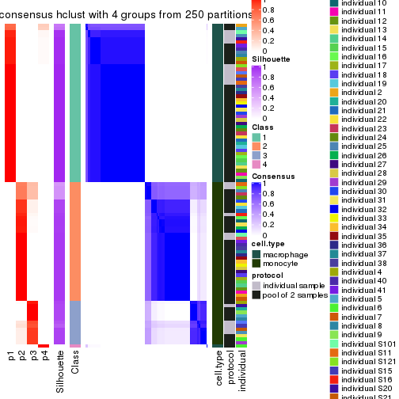</p>

</div>
<div id='tab-ATC-hclust-consensus-heatmap-4'>
<pre><code class="r">consensus_heatmap(res, k = 5)
</code></pre>

<p></p>

</div>
<div id='tab-ATC-hclust-consensus-heatmap-5'>
<pre><code class="r">consensus_heatmap(res, k = 6)
</code></pre>

<p></p>

</div>
</div>

Heatmaps for the membership of samples in all partitions to see how consistent they are:


<script>
$( function() {
	$( '#tabs-ATC-hclust-membership-heatmap' ).tabs();
} );
</script>
<div id='tabs-ATC-hclust-membership-heatmap'>
<ul>
<li><a href='#tab-ATC-hclust-membership-heatmap-1'>k = 2</a></li>
<li><a href='#tab-ATC-hclust-membership-heatmap-2'>k = 3</a></li>
<li><a href='#tab-ATC-hclust-membership-heatmap-3'>k = 4</a></li>
<li><a href='#tab-ATC-hclust-membership-heatmap-4'>k = 5</a></li>
<li><a href='#tab-ATC-hclust-membership-heatmap-5'>k = 6</a></li>
</ul>
<div id='tab-ATC-hclust-membership-heatmap-1'>
<pre><code class="r">membership_heatmap(res, k = 2)
</code></pre>

<p></p>

</div>
<div id='tab-ATC-hclust-membership-heatmap-2'>
<pre><code class="r">membership_heatmap(res, k = 3)
</code></pre>

<p></p>

</div>
<div id='tab-ATC-hclust-membership-heatmap-3'>
<pre><code class="r">membership_heatmap(res, k = 4)
</code></pre>

<p></p>

</div>
<div id='tab-ATC-hclust-membership-heatmap-4'>
<pre><code class="r">membership_heatmap(res, k = 5)
</code></pre>

<p></p>

</div>
<div id='tab-ATC-hclust-membership-heatmap-5'>
<pre><code class="r">membership_heatmap(res, k = 6)
</code></pre>

<p></p>

</div>
</div>

As soon as we have had the classes for columns, we can look for signatures
which are significantly different between classes which can be candidate marks
for certain classes. Following are the heatmaps for signatures.


Signature heatmaps where rows are scaled:


<script>
$( function() {
	$( '#tabs-ATC-hclust-get-signatures' ).tabs();
} );
</script>
<div id='tabs-ATC-hclust-get-signatures'>
<ul>
<li><a href='#tab-ATC-hclust-get-signatures-1'>k = 2</a></li>
<li><a href='#tab-ATC-hclust-get-signatures-2'>k = 3</a></li>
<li><a href='#tab-ATC-hclust-get-signatures-3'>k = 4</a></li>
<li><a href='#tab-ATC-hclust-get-signatures-4'>k = 5</a></li>
<li><a href='#tab-ATC-hclust-get-signatures-5'>k = 6</a></li>
</ul>
<div id='tab-ATC-hclust-get-signatures-1'>
<pre><code class="r">get_signatures(res, k = 2)
</code></pre>

<p></p>

</div>
<div id='tab-ATC-hclust-get-signatures-2'>
<pre><code class="r">get_signatures(res, k = 3)
</code></pre>

<p></p>

</div>
<div id='tab-ATC-hclust-get-signatures-3'>
<pre><code class="r">get_signatures(res, k = 4)
</code></pre>

<p>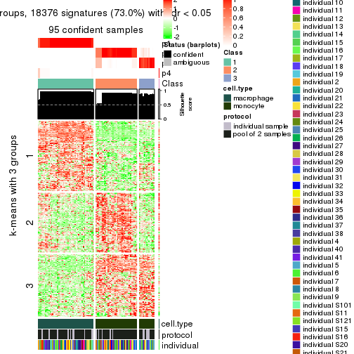</p>

</div>
<div id='tab-ATC-hclust-get-signatures-4'>
<pre><code class="r">get_signatures(res, k = 5)
</code></pre>

<p></p>

</div>
<div id='tab-ATC-hclust-get-signatures-5'>
<pre><code class="r">get_signatures(res, k = 6)
</code></pre>

<p></p>

</div>
</div>


Signature heatmaps where rows are not scaled:


<script>
$( function() {
	$( '#tabs-ATC-hclust-get-signatures-no-scale' ).tabs();
} );
</script>
<div id='tabs-ATC-hclust-get-signatures-no-scale'>
<ul>
<li><a href='#tab-ATC-hclust-get-signatures-no-scale-1'>k = 2</a></li>
<li><a href='#tab-ATC-hclust-get-signatures-no-scale-2'>k = 3</a></li>
<li><a href='#tab-ATC-hclust-get-signatures-no-scale-3'>k = 4</a></li>
<li><a href='#tab-ATC-hclust-get-signatures-no-scale-4'>k = 5</a></li>
<li><a href='#tab-ATC-hclust-get-signatures-no-scale-5'>k = 6</a></li>
</ul>
<div id='tab-ATC-hclust-get-signatures-no-scale-1'>
<pre><code class="r">get_signatures(res, k = 2, scale_rows = FALSE)
</code></pre>

<p></p>

</div>
<div id='tab-ATC-hclust-get-signatures-no-scale-2'>
<pre><code class="r">get_signatures(res, k = 3, scale_rows = FALSE)
</code></pre>

<p></p>

</div>
<div id='tab-ATC-hclust-get-signatures-no-scale-3'>
<pre><code class="r">get_signatures(res, k = 4, scale_rows = FALSE)
</code></pre>

<p></p>

</div>
<div id='tab-ATC-hclust-get-signatures-no-scale-4'>
<pre><code class="r">get_signatures(res, k = 5, scale_rows = FALSE)
</code></pre>

<p></p>

</div>
<div id='tab-ATC-hclust-get-signatures-no-scale-5'>
<pre><code class="r">get_signatures(res, k = 6, scale_rows = FALSE)
</code></pre>

<p></p>

</div>
</div>


Compare the overlap of signatures from different k:

```r
compare_signatures(res)
```


`get_signature()` returns a data frame invisibly. TO get the list of signatures, the function
call should be assigned to a variable explicitly. In following code, if `plot` argument is set
to `FALSE`, no heatmap is plotted while only the differential analysis is performed.

```r
# code only for demonstration
tb = get_signature(res, k = ..., plot = FALSE)
```

An example of the output of `tb` is:

```
#>   which_row         fdr    mean_1    mean_2 scaled_mean_1 scaled_mean_2 km
#> 1        38 0.042760348  8.373488  9.131774    -0.5533452     0.5164555  1
#> 2        40 0.018707592  7.106213  8.469186    -0.6173731     0.5762149  1
#> 3        55 0.019134737 10.221463 11.207825    -0.6159697     0.5749050  1
#> 4        59 0.006059896  5.921854  7.869574    -0.6899429     0.6439467  1
#> 5        60 0.018055526  8.928898 10.211722    -0.6204761     0.5791110  1
#> 6        98 0.009384629 15.714769 14.887706     0.6635654    -0.6193277  2
...
```

The columns in `tb` are:

1. `which_row`: row indices corresponding to the input matrix.
2. `fdr`: FDR for the differential test. 
3. `mean_x`: The mean value in group x.
4. `scaled_mean_x`: The mean value in group x after rows are scaled.
5. `km`: Row groups if k-means clustering is applied to rows.


UMAP plot which shows how samples are separated.


<script>
$( function() {
	$( '#tabs-ATC-hclust-dimension-reduction' ).tabs();
} );
</script>
<div id='tabs-ATC-hclust-dimension-reduction'>
<ul>
<li><a href='#tab-ATC-hclust-dimension-reduction-1'>k = 2</a></li>
<li><a href='#tab-ATC-hclust-dimension-reduction-2'>k = 3</a></li>
<li><a href='#tab-ATC-hclust-dimension-reduction-3'>k = 4</a></li>
<li><a href='#tab-ATC-hclust-dimension-reduction-4'>k = 5</a></li>
<li><a href='#tab-ATC-hclust-dimension-reduction-5'>k = 6</a></li>
</ul>
<div id='tab-ATC-hclust-dimension-reduction-1'>
<pre><code class="r">dimension_reduction(res, k = 2, method = &quot;UMAP&quot;)
</code></pre>

<p></p>

</div>
<div id='tab-ATC-hclust-dimension-reduction-2'>
<pre><code class="r">dimension_reduction(res, k = 3, method = &quot;UMAP&quot;)
</code></pre>

<p></p>

</div>
<div id='tab-ATC-hclust-dimension-reduction-3'>
<pre><code class="r">dimension_reduction(res, k = 4, method = &quot;UMAP&quot;)
</code></pre>

<p></p>

</div>
<div id='tab-ATC-hclust-dimension-reduction-4'>
<pre><code class="r">dimension_reduction(res, k = 5, method = &quot;UMAP&quot;)
</code></pre>

<p></p>

</div>
<div id='tab-ATC-hclust-dimension-reduction-5'>
<pre><code class="r">dimension_reduction(res, k = 6, method = &quot;UMAP&quot;)
</code></pre>

<p></p>

</div>
</div>


Following heatmap shows how subgroups are split when increasing `k`:

```r
collect_classes(res)
```


Test correlation between subgroups and known annotations. If the known
annotation is numeric, one-way ANOVA test is applied, and if the known
annotation is discrete, chi-squared contingency table test is applied.

```r
test_to_known_factors(res)
```

```
#>             n cell.type(p) protocol(p) individual(p) k
#> ATC:hclust 96     8.49e-22       1.000         1.000 2
#> ATC:hclust 95     1.41e-21       1.000         1.000 3
#> ATC:hclust 95     2.35e-21       0.189         1.000 4
#> ATC:hclust 93     4.97e-20       0.109         0.997 5
#> ATC:hclust 84     2.47e-17       0.168         0.957 6
```


If matrix rows can be associated to genes, consider to use `functional_enrichment(res,
...)` to perform function enrichment for the signature genes. See [this vignette](http://bioconductor.org/packages/devel/bioc/vignettes/cola/inst/doc/functional_enrichment.html) for more detailed explanations.


 

---------------------------------------------------


### ATC:kmeans**


The object with results only for a single top-value method and a single partition method 
can be extracted as:

```r
res = res_list["ATC", "kmeans"]
# you can also extract it by
# res = res_list["ATC:kmeans"]
```

A summary of `res` and all the functions that can be applied to it:

```r
res
```

```
#> A 'ConsensusPartition' object with k = 2, 3, 4, 5, 6.
#>   On a matrix with 25171 rows and 96 columns.
#>   Top rows (1000, 2000, 3000, 4000, 5000) are extracted by 'ATC' method.
#>   Subgroups are detected by 'kmeans' method.
#>   Performed in total 1250 partitions by row resampling.
#>   Best k for subgroups seems to be 2.
#> 
#> Following methods can be applied to this 'ConsensusPartition' object:
#>  [1] "cola_report"             "collect_classes"         "collect_plots"          
#>  [4] "collect_stats"           "colnames"                "compare_signatures"     
#>  [7] "consensus_heatmap"       "dimension_reduction"     "functional_enrichment"  
#> [10] "get_anno_col"            "get_anno"                "get_classes"            
#> [13] "get_consensus"           "get_matrix"              "get_membership"         
#> [16] "get_param"               "get_signatures"          "get_stats"              
#> [19] "is_best_k"               "is_stable_k"             "membership_heatmap"     
#> [22] "ncol"                    "nrow"                    "plot_ecdf"              
#> [25] "rownames"                "select_partition_number" "show"                   
#> [28] "suggest_best_k"          "test_to_known_factors"
```

`collect_plots()` function collects all the plots made from `res` for all `k` (number of partitions)
into one single page to provide an easy and fast comparison between different `k`.

```r
collect_plots(res)
```


The plots are:

- The first row: a plot of the ECDF (empirical cumulative distribution
  function) curves of the consensus matrix for each `k` and the heatmap of
  predicted classes for each `k`.
- The second row: heatmaps of the consensus matrix for each `k`.
- The third row: heatmaps of the membership matrix for each `k`.
- The fouth row: heatmaps of the signatures for each `k`.

All the plots in panels can be made by individual functions and they are
plotted later in this section.

`select_partition_number()` produces several plots showing different
statistics for choosing "optimized" `k`. There are following statistics:

- ECDF curves of the consensus matrix for each `k`;
- 1-PAC. [The PAC
  score](https://en.wikipedia.org/wiki/Consensus_clustering#Over-interpretation_potential_of_consensus_clustering)
  measures the proportion of the ambiguous subgrouping.
- Mean silhouette score.
- Concordance. The mean probability of fiting the consensus class ids in all
  partitions.
- Area increased. Denote $A_k$ as the area under the ECDF curve for current
  `k`, the area increased is defined as $A_k - A_{k-1}$.
- Rand index. The percent of pairs of samples that are both in a same cluster
  or both are not in a same cluster in the partition of k and k-1.
- Jaccard index. The ratio of pairs of samples are both in a same cluster in
  the partition of k and k-1 and the pairs of samples are both in a same
  cluster in the partition k or k-1.

The detailed explanations of these statistics can be found in [the _cola_
vignette](http://bioconductor.org/packages/devel/bioc/vignettes/cola/inst/doc/cola.html#toc_13).

Generally speaking, lower PAC score, higher mean silhouette score or higher
concordance corresponds to better partition. Rand index and Jaccard index
measure how similar the current partition is compared to partition with `k-1`.
If they are too similar, we won't accept `k` is better than `k-1`.

```r
select_partition_number(res)
```


The numeric values for all these statistics can be obtained by `get_stats()`.

```r
get_stats(res)
```

```
#>   k 1-PAC mean_silhouette concordance area_increased  Rand Jaccard
#> 2 2 1.000           1.000       1.000         0.5058 0.495   0.495
#> 3 3 0.747           0.850       0.825         0.2328 0.882   0.761
#> 4 4 0.644           0.820       0.820         0.1237 0.881   0.687
#> 5 5 0.612           0.685       0.772         0.0768 0.961   0.867
#> 6 6 0.651           0.523       0.747         0.0457 0.906   0.672
```

`suggest_best_k()` suggests the best $k$ based on these statistics. The rules are as follows:

- All $k$ with Jaccard index larger than 0.95 are removed because increasing
  $k$ does not provide enough extra information. If all $k$ are removed, it is
  marked as no subgroup is detected.
- For all $k$ with 1-PAC score larger than 0.9, the maximal $k$ is taken as
  the best $k$, and other $k$ are marked as optional $k$.
- If it does not fit the second rule. The $k$ with the maximal vote of the
  highest 1-PAC score, highest mean silhouette, and highest concordance is
  taken as the best $k$.

```r
suggest_best_k(res)
```

```
#> [1] 2
```


Following shows the table of the partitions (You need to click the **show/hide
code output** link to see it). The membership matrix (columns with name `p*`)
is inferred by
[`clue::cl_consensus()`](https://www.rdocumentation.org/link/cl_consensus?package=clue)
function with the `SE` method. Basically the value in the membership matrix
represents the probability to belong to a certain group. The finall class
label for an item is determined with the group with highest probability it
belongs to.

In `get_classes()` function, the entropy is calculated from the membership
matrix and the silhouette score is calculated from the consensus matrix.


<script>
$( function() {
	$( '#tabs-ATC-kmeans-get-classes' ).tabs();
} );
</script>
<div id='tabs-ATC-kmeans-get-classes'>
<ul>
<li><a href='#tab-ATC-kmeans-get-classes-1'>k = 2</a></li>
<li><a href='#tab-ATC-kmeans-get-classes-2'>k = 3</a></li>
<li><a href='#tab-ATC-kmeans-get-classes-3'>k = 4</a></li>
<li><a href='#tab-ATC-kmeans-get-classes-4'>k = 5</a></li>
<li><a href='#tab-ATC-kmeans-get-classes-5'>k = 6</a></li>
</ul>

<div id='tab-ATC-kmeans-get-classes-1'>
<p><a id='tab-ATC-kmeans-get-classes-1-a' style='color:#0366d6' href='#'>show/hide code output</a></p>
<pre><code class="r">cbind(get_classes(res, k = 2), get_membership(res, k = 2))
</code></pre>

<pre><code>#&gt;           class entropy silhouette p1 p2
#&gt; GSM257886     1       0          1  1  0
#&gt; GSM257888     1       0          1  1  0
#&gt; GSM257890     1       0          1  1  0
#&gt; GSM257892     1       0          1  1  0
#&gt; GSM257894     1       0          1  1  0
#&gt; GSM257896     1       0          1  1  0
#&gt; GSM257898     1       0          1  1  0
#&gt; GSM257900     1       0          1  1  0
#&gt; GSM257902     1       0          1  1  0
#&gt; GSM257904     1       0          1  1  0
#&gt; GSM257906     1       0          1  1  0
#&gt; GSM257908     1       0          1  1  0
#&gt; GSM257910     1       0          1  1  0
#&gt; GSM257912     1       0          1  1  0
#&gt; GSM257914     1       0          1  1  0
#&gt; GSM257917     1       0          1  1  0
#&gt; GSM257919     1       0          1  1  0
#&gt; GSM257921     1       0          1  1  0
#&gt; GSM257923     1       0          1  1  0
#&gt; GSM257925     1       0          1  1  0
#&gt; GSM257927     1       0          1  1  0
#&gt; GSM257929     1       0          1  1  0
#&gt; GSM257937     1       0          1  1  0
#&gt; GSM257939     1       0          1  1  0
#&gt; GSM257941     1       0          1  1  0
#&gt; GSM257943     1       0          1  1  0
#&gt; GSM257945     1       0          1  1  0
#&gt; GSM257947     1       0          1  1  0
#&gt; GSM257949     1       0          1  1  0
#&gt; GSM257951     1       0          1  1  0
#&gt; GSM257953     1       0          1  1  0
#&gt; GSM257955     1       0          1  1  0
#&gt; GSM257958     1       0          1  1  0
#&gt; GSM257960     1       0          1  1  0
#&gt; GSM257962     1       0          1  1  0
#&gt; GSM257964     1       0          1  1  0
#&gt; GSM257966     1       0          1  1  0
#&gt; GSM257968     1       0          1  1  0
#&gt; GSM257970     1       0          1  1  0
#&gt; GSM257972     1       0          1  1  0
#&gt; GSM257977     1       0          1  1  0
#&gt; GSM257982     1       0          1  1  0
#&gt; GSM257984     1       0          1  1  0
#&gt; GSM257986     1       0          1  1  0
#&gt; GSM257990     1       0          1  1  0
#&gt; GSM257992     1       0          1  1  0
#&gt; GSM257996     1       0          1  1  0
#&gt; GSM258006     1       0          1  1  0
#&gt; GSM257887     2       0          1  0  1
#&gt; GSM257889     2       0          1  0  1
#&gt; GSM257891     2       0          1  0  1
#&gt; GSM257893     2       0          1  0  1
#&gt; GSM257895     2       0          1  0  1
#&gt; GSM257897     2       0          1  0  1
#&gt; GSM257899     2       0          1  0  1
#&gt; GSM257901     2       0          1  0  1
#&gt; GSM257903     2       0          1  0  1
#&gt; GSM257905     2       0          1  0  1
#&gt; GSM257907     2       0          1  0  1
#&gt; GSM257909     2       0          1  0  1
#&gt; GSM257911     2       0          1  0  1
#&gt; GSM257913     2       0          1  0  1
#&gt; GSM257916     2       0          1  0  1
#&gt; GSM257918     2       0          1  0  1
#&gt; GSM257920     2       0          1  0  1
#&gt; GSM257922     2       0          1  0  1
#&gt; GSM257924     2       0          1  0  1
#&gt; GSM257926     2       0          1  0  1
#&gt; GSM257928     2       0          1  0  1
#&gt; GSM257930     2       0          1  0  1
#&gt; GSM257938     2       0          1  0  1
#&gt; GSM257940     2       0          1  0  1
#&gt; GSM257942     2       0          1  0  1
#&gt; GSM257944     2       0          1  0  1
#&gt; GSM257946     2       0          1  0  1
#&gt; GSM257948     2       0          1  0  1
#&gt; GSM257950     2       0          1  0  1
#&gt; GSM257952     2       0          1  0  1
#&gt; GSM257954     2       0          1  0  1
#&gt; GSM257956     2       0          1  0  1
#&gt; GSM257959     2       0          1  0  1
#&gt; GSM257961     2       0          1  0  1
#&gt; GSM257963     2       0          1  0  1
#&gt; GSM257965     2       0          1  0  1
#&gt; GSM257967     2       0          1  0  1
#&gt; GSM257969     2       0          1  0  1
#&gt; GSM257971     2       0          1  0  1
#&gt; GSM257973     2       0          1  0  1
#&gt; GSM257981     2       0          1  0  1
#&gt; GSM257983     2       0          1  0  1
#&gt; GSM257985     2       0          1  0  1
#&gt; GSM257988     2       0          1  0  1
#&gt; GSM257991     2       0          1  0  1
#&gt; GSM257993     2       0          1  0  1
#&gt; GSM257994     2       0          1  0  1
#&gt; GSM257989     2       0          1  0  1
</code></pre>

<script>
$('#tab-ATC-kmeans-get-classes-1-a').parent().next().next().hide();
$('#tab-ATC-kmeans-get-classes-1-a').click(function(){
  $('#tab-ATC-kmeans-get-classes-1-a').parent().next().next().toggle();
  return(false);
});
</script>
</div>

<div id='tab-ATC-kmeans-get-classes-2'>
<p><a id='tab-ATC-kmeans-get-classes-2-a' style='color:#0366d6' href='#'>show/hide code output</a></p>
<pre><code class="r">cbind(get_classes(res, k = 3), get_membership(res, k = 3))
</code></pre>

<pre><code>#&gt;           class entropy silhouette    p1    p2    p3
#&gt; GSM257886     1  0.6280      0.718 0.540 0.000 0.460
#&gt; GSM257888     1  0.6274      0.719 0.544 0.000 0.456
#&gt; GSM257890     1  0.6274      0.719 0.544 0.000 0.456
#&gt; GSM257892     1  0.6280      0.718 0.540 0.000 0.460
#&gt; GSM257894     1  0.5968      0.757 0.636 0.000 0.364
#&gt; GSM257896     1  0.6274      0.719 0.544 0.000 0.456
#&gt; GSM257898     1  0.0237      0.867 0.996 0.000 0.004
#&gt; GSM257900     1  0.0237      0.867 0.996 0.000 0.004
#&gt; GSM257902     1  0.0000      0.868 1.000 0.000 0.000
#&gt; GSM257904     1  0.0592      0.866 0.988 0.000 0.012
#&gt; GSM257906     1  0.4750      0.813 0.784 0.000 0.216
#&gt; GSM257908     1  0.6126      0.744 0.600 0.000 0.400
#&gt; GSM257910     1  0.0000      0.868 1.000 0.000 0.000
#&gt; GSM257912     1  0.6244      0.728 0.560 0.000 0.440
#&gt; GSM257914     1  0.6062      0.751 0.616 0.000 0.384
#&gt; GSM257917     1  0.3551      0.836 0.868 0.000 0.132
#&gt; GSM257919     1  0.6244      0.728 0.560 0.000 0.440
#&gt; GSM257921     1  0.0000      0.868 1.000 0.000 0.000
#&gt; GSM257923     1  0.0000      0.868 1.000 0.000 0.000
#&gt; GSM257925     1  0.0000      0.868 1.000 0.000 0.000
#&gt; GSM257927     1  0.0237      0.867 0.996 0.000 0.004
#&gt; GSM257929     1  0.0000      0.868 1.000 0.000 0.000
#&gt; GSM257937     1  0.6274      0.719 0.544 0.000 0.456
#&gt; GSM257939     1  0.0000      0.868 1.000 0.000 0.000
#&gt; GSM257941     1  0.0237      0.867 0.996 0.000 0.004
#&gt; GSM257943     1  0.0237      0.867 0.996 0.000 0.004
#&gt; GSM257945     1  0.0237      0.867 0.996 0.000 0.004
#&gt; GSM257947     1  0.0000      0.868 1.000 0.000 0.000
#&gt; GSM257949     1  0.0000      0.868 1.000 0.000 0.000
#&gt; GSM257951     1  0.0000      0.868 1.000 0.000 0.000
#&gt; GSM257953     1  0.0000      0.868 1.000 0.000 0.000
#&gt; GSM257955     1  0.0000      0.868 1.000 0.000 0.000
#&gt; GSM257958     1  0.0000      0.868 1.000 0.000 0.000
#&gt; GSM257960     1  0.0237      0.867 0.996 0.000 0.004
#&gt; GSM257962     1  0.0237      0.867 0.996 0.000 0.004
#&gt; GSM257964     1  0.0000      0.868 1.000 0.000 0.000
#&gt; GSM257966     1  0.6274      0.719 0.544 0.000 0.456
#&gt; GSM257968     1  0.6252      0.725 0.556 0.000 0.444
#&gt; GSM257970     1  0.0000      0.868 1.000 0.000 0.000
#&gt; GSM257972     1  0.0000      0.868 1.000 0.000 0.000
#&gt; GSM257977     1  0.6274      0.719 0.544 0.000 0.456
#&gt; GSM257982     1  0.6274      0.719 0.544 0.000 0.456
#&gt; GSM257984     1  0.0000      0.868 1.000 0.000 0.000
#&gt; GSM257986     1  0.0000      0.868 1.000 0.000 0.000
#&gt; GSM257990     1  0.0237      0.867 0.996 0.000 0.004
#&gt; GSM257992     1  0.4750      0.813 0.784 0.000 0.216
#&gt; GSM257996     1  0.0000      0.868 1.000 0.000 0.000
#&gt; GSM258006     1  0.5591      0.784 0.696 0.000 0.304
#&gt; GSM257887     2  0.0000      0.934 0.000 1.000 0.000
#&gt; GSM257889     3  0.6280      1.000 0.000 0.460 0.540
#&gt; GSM257891     3  0.6280      1.000 0.000 0.460 0.540
#&gt; GSM257893     3  0.6280      1.000 0.000 0.460 0.540
#&gt; GSM257895     2  0.0000      0.934 0.000 1.000 0.000
#&gt; GSM257897     3  0.6280      1.000 0.000 0.460 0.540
#&gt; GSM257899     3  0.6280      1.000 0.000 0.460 0.540
#&gt; GSM257901     2  0.0000      0.934 0.000 1.000 0.000
#&gt; GSM257903     2  0.0000      0.934 0.000 1.000 0.000
#&gt; GSM257905     2  0.0000      0.934 0.000 1.000 0.000
#&gt; GSM257907     2  0.0000      0.934 0.000 1.000 0.000
#&gt; GSM257909     2  0.0000      0.934 0.000 1.000 0.000
#&gt; GSM257911     2  0.0000      0.934 0.000 1.000 0.000
#&gt; GSM257913     2  0.0000      0.934 0.000 1.000 0.000
#&gt; GSM257916     2  0.0000      0.934 0.000 1.000 0.000
#&gt; GSM257918     2  0.0000      0.934 0.000 1.000 0.000
#&gt; GSM257920     2  0.6274     -0.805 0.000 0.544 0.456
#&gt; GSM257922     3  0.6280      1.000 0.000 0.460 0.540
#&gt; GSM257924     3  0.6280      1.000 0.000 0.460 0.540
#&gt; GSM257926     3  0.6280      1.000 0.000 0.460 0.540
#&gt; GSM257928     3  0.6280      1.000 0.000 0.460 0.540
#&gt; GSM257930     2  0.5650     -0.235 0.000 0.688 0.312
#&gt; GSM257938     2  0.0000      0.934 0.000 1.000 0.000
#&gt; GSM257940     3  0.6286      0.992 0.000 0.464 0.536
#&gt; GSM257942     2  0.0000      0.934 0.000 1.000 0.000
#&gt; GSM257944     2  0.0000      0.934 0.000 1.000 0.000
#&gt; GSM257946     3  0.6280      1.000 0.000 0.460 0.540
#&gt; GSM257948     2  0.5138      0.142 0.000 0.748 0.252
#&gt; GSM257950     3  0.6280      1.000 0.000 0.460 0.540
#&gt; GSM257952     2  0.0000      0.934 0.000 1.000 0.000
#&gt; GSM257954     2  0.0000      0.934 0.000 1.000 0.000
#&gt; GSM257956     2  0.0000      0.934 0.000 1.000 0.000
#&gt; GSM257959     2  0.0000      0.934 0.000 1.000 0.000
#&gt; GSM257961     2  0.0000      0.934 0.000 1.000 0.000
#&gt; GSM257963     2  0.0000      0.934 0.000 1.000 0.000
#&gt; GSM257965     2  0.0000      0.934 0.000 1.000 0.000
#&gt; GSM257967     2  0.0000      0.934 0.000 1.000 0.000
#&gt; GSM257969     2  0.0000      0.934 0.000 1.000 0.000
#&gt; GSM257971     3  0.6280      1.000 0.000 0.460 0.540
#&gt; GSM257973     3  0.6280      1.000 0.000 0.460 0.540
#&gt; GSM257981     2  0.0000      0.934 0.000 1.000 0.000
#&gt; GSM257983     3  0.6280      1.000 0.000 0.460 0.540
#&gt; GSM257985     3  0.6280      1.000 0.000 0.460 0.540
#&gt; GSM257988     3  0.6280      1.000 0.000 0.460 0.540
#&gt; GSM257991     2  0.0000      0.934 0.000 1.000 0.000
#&gt; GSM257993     2  0.0000      0.934 0.000 1.000 0.000
#&gt; GSM257994     2  0.0000      0.934 0.000 1.000 0.000
#&gt; GSM257989     3  0.6280      1.000 0.000 0.460 0.540
</code></pre>

<script>
$('#tab-ATC-kmeans-get-classes-2-a').parent().next().next().hide();
$('#tab-ATC-kmeans-get-classes-2-a').click(function(){
  $('#tab-ATC-kmeans-get-classes-2-a').parent().next().next().toggle();
  return(false);
});
</script>
</div>

<div id='tab-ATC-kmeans-get-classes-3'>
<p><a id='tab-ATC-kmeans-get-classes-3-a' style='color:#0366d6' href='#'>show/hide code output</a></p>
<pre><code class="r">cbind(get_classes(res, k = 4), get_membership(res, k = 4))
</code></pre>

<pre><code>#&gt;           class entropy silhouette    p1    p2    p3    p4
#&gt; GSM257886     4  0.5732      0.911 0.264 0.000 0.064 0.672
#&gt; GSM257888     4  0.4343      0.941 0.264 0.000 0.004 0.732
#&gt; GSM257890     4  0.4164      0.941 0.264 0.000 0.000 0.736
#&gt; GSM257892     4  0.5732      0.911 0.264 0.000 0.064 0.672
#&gt; GSM257894     4  0.5018      0.885 0.332 0.000 0.012 0.656
#&gt; GSM257896     4  0.4343      0.941 0.264 0.000 0.004 0.732
#&gt; GSM257898     1  0.3873      0.770 0.772 0.000 0.228 0.000
#&gt; GSM257900     1  0.3444      0.803 0.816 0.000 0.184 0.000
#&gt; GSM257902     1  0.0000      0.851 1.000 0.000 0.000 0.000
#&gt; GSM257904     1  0.4053      0.765 0.768 0.000 0.228 0.004
#&gt; GSM257906     1  0.7271      0.268 0.540 0.000 0.244 0.216
#&gt; GSM257908     4  0.5668      0.897 0.300 0.000 0.048 0.652
#&gt; GSM257910     1  0.1624      0.827 0.952 0.000 0.020 0.028
#&gt; GSM257912     4  0.6323      0.879 0.272 0.000 0.100 0.628
#&gt; GSM257914     4  0.6711      0.815 0.308 0.000 0.116 0.576
#&gt; GSM257917     1  0.6548      0.488 0.636 0.000 0.176 0.188
#&gt; GSM257919     4  0.6323      0.879 0.272 0.000 0.100 0.628
#&gt; GSM257921     1  0.3074      0.819 0.848 0.000 0.152 0.000
#&gt; GSM257923     1  0.0000      0.851 1.000 0.000 0.000 0.000
#&gt; GSM257925     1  0.0000      0.851 1.000 0.000 0.000 0.000
#&gt; GSM257927     1  0.3172      0.816 0.840 0.000 0.160 0.000
#&gt; GSM257929     1  0.0000      0.851 1.000 0.000 0.000 0.000
#&gt; GSM257937     4  0.4164      0.941 0.264 0.000 0.000 0.736
#&gt; GSM257939     1  0.0000      0.851 1.000 0.000 0.000 0.000
#&gt; GSM257941     1  0.3172      0.816 0.840 0.000 0.160 0.000
#&gt; GSM257943     1  0.3801      0.776 0.780 0.000 0.220 0.000
#&gt; GSM257945     1  0.3172      0.816 0.840 0.000 0.160 0.000
#&gt; GSM257947     1  0.0000      0.851 1.000 0.000 0.000 0.000
#&gt; GSM257949     1  0.0000      0.851 1.000 0.000 0.000 0.000
#&gt; GSM257951     1  0.0000      0.851 1.000 0.000 0.000 0.000
#&gt; GSM257953     1  0.0000      0.851 1.000 0.000 0.000 0.000
#&gt; GSM257955     1  0.0000      0.851 1.000 0.000 0.000 0.000
#&gt; GSM257958     1  0.0000      0.851 1.000 0.000 0.000 0.000
#&gt; GSM257960     1  0.3172      0.816 0.840 0.000 0.160 0.000
#&gt; GSM257962     1  0.3172      0.816 0.840 0.000 0.160 0.000
#&gt; GSM257964     1  0.0000      0.851 1.000 0.000 0.000 0.000
#&gt; GSM257966     4  0.4164      0.941 0.264 0.000 0.000 0.736
#&gt; GSM257968     4  0.4428      0.936 0.276 0.000 0.004 0.720
#&gt; GSM257970     1  0.0000      0.851 1.000 0.000 0.000 0.000
#&gt; GSM257972     1  0.1118      0.847 0.964 0.000 0.036 0.000
#&gt; GSM257977     4  0.4343      0.941 0.264 0.000 0.004 0.732
#&gt; GSM257982     4  0.4343      0.941 0.264 0.000 0.004 0.732
#&gt; GSM257984     1  0.0000      0.851 1.000 0.000 0.000 0.000
#&gt; GSM257986     1  0.0000      0.851 1.000 0.000 0.000 0.000
#&gt; GSM257990     1  0.1792      0.842 0.932 0.000 0.068 0.000
#&gt; GSM257992     1  0.7271      0.268 0.540 0.000 0.244 0.216
#&gt; GSM257996     1  0.3356      0.809 0.824 0.000 0.176 0.000
#&gt; GSM258006     1  0.7494     -0.243 0.460 0.000 0.188 0.352
#&gt; GSM257887     2  0.0188      0.898 0.000 0.996 0.000 0.004
#&gt; GSM257889     3  0.4606      0.923 0.000 0.264 0.724 0.012
#&gt; GSM257891     3  0.4343      0.924 0.000 0.264 0.732 0.004
#&gt; GSM257893     3  0.4606      0.923 0.000 0.264 0.724 0.012
#&gt; GSM257895     2  0.0469      0.895 0.000 0.988 0.000 0.012
#&gt; GSM257897     3  0.4343      0.924 0.000 0.264 0.732 0.004
#&gt; GSM257899     3  0.4343      0.924 0.000 0.264 0.732 0.004
#&gt; GSM257901     2  0.3444      0.777 0.000 0.816 0.000 0.184
#&gt; GSM257903     2  0.0000      0.899 0.000 1.000 0.000 0.000
#&gt; GSM257905     2  0.0000      0.899 0.000 1.000 0.000 0.000
#&gt; GSM257907     2  0.3444      0.777 0.000 0.816 0.000 0.184
#&gt; GSM257909     2  0.0000      0.899 0.000 1.000 0.000 0.000
#&gt; GSM257911     2  0.2760      0.823 0.000 0.872 0.000 0.128
#&gt; GSM257913     2  0.3444      0.777 0.000 0.816 0.000 0.184
#&gt; GSM257916     2  0.0000      0.899 0.000 1.000 0.000 0.000
#&gt; GSM257918     2  0.0000      0.899 0.000 1.000 0.000 0.000
#&gt; GSM257920     3  0.7432      0.715 0.000 0.336 0.480 0.184
#&gt; GSM257922     3  0.4343      0.924 0.000 0.264 0.732 0.004
#&gt; GSM257924     3  0.7149      0.821 0.000 0.264 0.552 0.184
#&gt; GSM257926     3  0.7149      0.821 0.000 0.264 0.552 0.184
#&gt; GSM257928     3  0.5732      0.899 0.000 0.264 0.672 0.064
#&gt; GSM257930     2  0.7539     -0.133 0.000 0.492 0.256 0.252
#&gt; GSM257938     2  0.2589      0.838 0.000 0.884 0.000 0.116
#&gt; GSM257940     3  0.7373      0.786 0.000 0.280 0.516 0.204
#&gt; GSM257942     2  0.0000      0.899 0.000 1.000 0.000 0.000
#&gt; GSM257944     2  0.0000      0.899 0.000 1.000 0.000 0.000
#&gt; GSM257946     3  0.4606      0.923 0.000 0.264 0.724 0.012
#&gt; GSM257948     2  0.7110      0.110 0.000 0.564 0.236 0.200
#&gt; GSM257950     3  0.4343      0.924 0.000 0.264 0.732 0.004
#&gt; GSM257952     2  0.3528      0.772 0.000 0.808 0.000 0.192
#&gt; GSM257954     2  0.0592      0.894 0.000 0.984 0.000 0.016
#&gt; GSM257956     2  0.1118      0.888 0.000 0.964 0.000 0.036
#&gt; GSM257959     2  0.0000      0.899 0.000 1.000 0.000 0.000
#&gt; GSM257961     2  0.0000      0.899 0.000 1.000 0.000 0.000
#&gt; GSM257963     2  0.0000      0.899 0.000 1.000 0.000 0.000
#&gt; GSM257965     2  0.0592      0.895 0.000 0.984 0.000 0.016
#&gt; GSM257967     2  0.0000      0.899 0.000 1.000 0.000 0.000
#&gt; GSM257969     2  0.0188      0.898 0.000 0.996 0.000 0.004
#&gt; GSM257971     3  0.7450      0.792 0.000 0.264 0.508 0.228
#&gt; GSM257973     3  0.5927      0.896 0.000 0.264 0.660 0.076
#&gt; GSM257981     2  0.3908      0.746 0.000 0.784 0.004 0.212
#&gt; GSM257983     3  0.4343      0.924 0.000 0.264 0.732 0.004
#&gt; GSM257985     3  0.4606      0.923 0.000 0.264 0.724 0.012
#&gt; GSM257988     3  0.4164      0.924 0.000 0.264 0.736 0.000
#&gt; GSM257991     2  0.0336      0.897 0.000 0.992 0.000 0.008
#&gt; GSM257993     2  0.0469      0.895 0.000 0.988 0.000 0.012
#&gt; GSM257994     2  0.2773      0.834 0.000 0.880 0.004 0.116
#&gt; GSM257989     3  0.4164      0.924 0.000 0.264 0.736 0.000
</code></pre>

<script>
$('#tab-ATC-kmeans-get-classes-3-a').parent().next().next().hide();
$('#tab-ATC-kmeans-get-classes-3-a').click(function(){
  $('#tab-ATC-kmeans-get-classes-3-a').parent().next().next().toggle();
  return(false);
});
</script>
</div>

<div id='tab-ATC-kmeans-get-classes-4'>
<p><a id='tab-ATC-kmeans-get-classes-4-a' style='color:#0366d6' href='#'>show/hide code output</a></p>
<pre><code class="r">cbind(get_classes(res, k = 5), get_membership(res, k = 5))
</code></pre>

<pre><code>#&gt;           class entropy silhouette    p1    p2    p3    p4 p5
#&gt; GSM257886     4  0.5735     0.8461 0.156 0.000 0.056 0.696 NA
#&gt; GSM257888     4  0.2806     0.9148 0.152 0.000 0.000 0.844 NA
#&gt; GSM257890     4  0.3087     0.9120 0.152 0.000 0.008 0.836 NA
#&gt; GSM257892     4  0.5735     0.8474 0.156 0.000 0.056 0.696 NA
#&gt; GSM257894     4  0.3796     0.8767 0.216 0.000 0.008 0.768 NA
#&gt; GSM257896     4  0.2806     0.9148 0.152 0.000 0.000 0.844 NA
#&gt; GSM257898     1  0.2358     0.6695 0.888 0.000 0.000 0.008 NA
#&gt; GSM257900     1  0.1544     0.7041 0.932 0.000 0.000 0.000 NA
#&gt; GSM257902     1  0.3790     0.7919 0.724 0.000 0.000 0.004 NA
#&gt; GSM257904     1  0.2681     0.6591 0.876 0.000 0.004 0.012 NA
#&gt; GSM257906     1  0.5634     0.2446 0.656 0.000 0.008 0.204 NA
#&gt; GSM257908     4  0.5187     0.8552 0.216 0.000 0.064 0.700 NA
#&gt; GSM257910     1  0.5887     0.7221 0.652 0.000 0.064 0.052 NA
#&gt; GSM257912     4  0.5497     0.8184 0.264 0.000 0.064 0.652 NA
#&gt; GSM257914     4  0.5745     0.7560 0.316 0.000 0.064 0.600 NA
#&gt; GSM257917     1  0.4915     0.4372 0.740 0.000 0.064 0.172 NA
#&gt; GSM257919     4  0.5497     0.8184 0.264 0.000 0.064 0.652 NA
#&gt; GSM257921     1  0.2419     0.7312 0.904 0.000 0.064 0.004 NA
#&gt; GSM257923     1  0.3790     0.7919 0.724 0.000 0.000 0.004 NA
#&gt; GSM257925     1  0.3790     0.7919 0.724 0.000 0.000 0.004 NA
#&gt; GSM257927     1  0.0000     0.7413 1.000 0.000 0.000 0.000 NA
#&gt; GSM257929     1  0.3790     0.7919 0.724 0.000 0.000 0.004 NA
#&gt; GSM257937     4  0.2648     0.9146 0.152 0.000 0.000 0.848 NA
#&gt; GSM257939     1  0.3790     0.7919 0.724 0.000 0.000 0.004 NA
#&gt; GSM257941     1  0.0000     0.7413 1.000 0.000 0.000 0.000 NA
#&gt; GSM257943     1  0.1965     0.6835 0.904 0.000 0.000 0.000 NA
#&gt; GSM257945     1  0.0000     0.7413 1.000 0.000 0.000 0.000 NA
#&gt; GSM257947     1  0.3790     0.7919 0.724 0.000 0.000 0.004 NA
#&gt; GSM257949     1  0.3790     0.7919 0.724 0.000 0.000 0.004 NA
#&gt; GSM257951     1  0.3790     0.7919 0.724 0.000 0.000 0.004 NA
#&gt; GSM257953     1  0.3790     0.7919 0.724 0.000 0.000 0.004 NA
#&gt; GSM257955     1  0.3790     0.7919 0.724 0.000 0.000 0.004 NA
#&gt; GSM257958     1  0.3790     0.7919 0.724 0.000 0.000 0.004 NA
#&gt; GSM257960     1  0.0000     0.7413 1.000 0.000 0.000 0.000 NA
#&gt; GSM257962     1  0.0000     0.7413 1.000 0.000 0.000 0.000 NA
#&gt; GSM257964     1  0.3790     0.7919 0.724 0.000 0.000 0.004 NA
#&gt; GSM257966     4  0.2648     0.9146 0.152 0.000 0.000 0.848 NA
#&gt; GSM257968     4  0.3450     0.9038 0.176 0.000 0.008 0.808 NA
#&gt; GSM257970     1  0.3790     0.7919 0.724 0.000 0.000 0.004 NA
#&gt; GSM257972     1  0.3706     0.7883 0.756 0.000 0.004 0.004 NA
#&gt; GSM257977     4  0.2806     0.9148 0.152 0.000 0.000 0.844 NA
#&gt; GSM257982     4  0.2806     0.9148 0.152 0.000 0.000 0.844 NA
#&gt; GSM257984     1  0.3790     0.7919 0.724 0.000 0.000 0.004 NA
#&gt; GSM257986     1  0.3790     0.7919 0.724 0.000 0.000 0.004 NA
#&gt; GSM257990     1  0.1792     0.7646 0.916 0.000 0.000 0.000 NA
#&gt; GSM257992     1  0.6007     0.2289 0.640 0.000 0.024 0.204 NA
#&gt; GSM257996     1  0.1893     0.7139 0.928 0.000 0.048 0.000 NA
#&gt; GSM258006     1  0.6504    -0.0736 0.548 0.000 0.024 0.296 NA
#&gt; GSM257887     2  0.4278     0.7377 0.000 0.548 0.000 0.000 NA
#&gt; GSM257889     3  0.2929     0.9217 0.000 0.128 0.856 0.012 NA
#&gt; GSM257891     3  0.3332     0.9205 0.000 0.120 0.844 0.028 NA
#&gt; GSM257893     3  0.3163     0.9217 0.000 0.128 0.848 0.012 NA
#&gt; GSM257895     2  0.4622     0.7301 0.000 0.548 0.000 0.012 NA
#&gt; GSM257897     3  0.3707     0.9176 0.000 0.120 0.828 0.036 NA
#&gt; GSM257899     3  0.3707     0.9176 0.000 0.120 0.828 0.036 NA
#&gt; GSM257901     2  0.0162     0.5180 0.000 0.996 0.000 0.000 NA
#&gt; GSM257903     2  0.4268     0.7396 0.000 0.556 0.000 0.000 NA
#&gt; GSM257905     2  0.4268     0.7396 0.000 0.556 0.000 0.000 NA
#&gt; GSM257907     2  0.0451     0.5107 0.000 0.988 0.008 0.000 NA
#&gt; GSM257909     2  0.4268     0.7396 0.000 0.556 0.000 0.000 NA
#&gt; GSM257911     2  0.2690     0.6159 0.000 0.844 0.000 0.000 NA
#&gt; GSM257913     2  0.0693     0.5075 0.000 0.980 0.008 0.012 NA
#&gt; GSM257916     2  0.4268     0.7396 0.000 0.556 0.000 0.000 NA
#&gt; GSM257918     2  0.4268     0.7396 0.000 0.556 0.000 0.000 NA
#&gt; GSM257920     2  0.4696    -0.3912 0.000 0.584 0.400 0.012 NA
#&gt; GSM257922     3  0.3463     0.9205 0.000 0.120 0.840 0.020 NA
#&gt; GSM257924     2  0.4973    -0.5339 0.000 0.496 0.480 0.020 NA
#&gt; GSM257926     2  0.4791    -0.5025 0.000 0.524 0.460 0.012 NA
#&gt; GSM257928     3  0.5637     0.8355 0.000 0.128 0.712 0.092 NA
#&gt; GSM257930     2  0.6650     0.0384 0.000 0.616 0.184 0.104 NA
#&gt; GSM257938     2  0.5613     0.6283 0.000 0.576 0.000 0.092 NA
#&gt; GSM257940     2  0.4480    -0.4140 0.000 0.592 0.400 0.004 NA
#&gt; GSM257942     2  0.4268     0.7396 0.000 0.556 0.000 0.000 NA
#&gt; GSM257944     2  0.4268     0.7396 0.000 0.556 0.000 0.000 NA
#&gt; GSM257946     3  0.3031     0.9208 0.000 0.128 0.852 0.016 NA
#&gt; GSM257948     2  0.3845     0.0678 0.000 0.760 0.224 0.012 NA
#&gt; GSM257950     3  0.3031     0.9226 0.000 0.120 0.856 0.020 NA
#&gt; GSM257952     2  0.1661     0.5116 0.000 0.940 0.000 0.024 NA
#&gt; GSM257954     2  0.4622     0.7301 0.000 0.548 0.000 0.012 NA
#&gt; GSM257956     2  0.5118     0.7135 0.000 0.548 0.000 0.040 NA
#&gt; GSM257959     2  0.4268     0.7396 0.000 0.556 0.000 0.000 NA
#&gt; GSM257961     2  0.4268     0.7396 0.000 0.556 0.000 0.000 NA
#&gt; GSM257963     2  0.4268     0.7396 0.000 0.556 0.000 0.000 NA
#&gt; GSM257965     2  0.4210     0.7354 0.000 0.588 0.000 0.000 NA
#&gt; GSM257967     2  0.4268     0.7396 0.000 0.556 0.000 0.000 NA
#&gt; GSM257969     2  0.4278     0.7377 0.000 0.548 0.000 0.000 NA
#&gt; GSM257971     3  0.7115     0.4870 0.000 0.412 0.420 0.092 NA
#&gt; GSM257973     3  0.4178     0.7849 0.000 0.292 0.696 0.008 NA
#&gt; GSM257981     2  0.1787     0.4807 0.000 0.940 0.016 0.012 NA
#&gt; GSM257983     3  0.3495     0.9191 0.000 0.120 0.836 0.036 NA
#&gt; GSM257985     3  0.3031     0.9208 0.000 0.128 0.852 0.016 NA
#&gt; GSM257988     3  0.2612     0.9238 0.000 0.124 0.868 0.008 NA
#&gt; GSM257991     2  0.4249     0.7380 0.000 0.568 0.000 0.000 NA
#&gt; GSM257993     2  0.4437     0.7332 0.000 0.532 0.000 0.004 NA
#&gt; GSM257994     2  0.5836     0.6142 0.000 0.568 0.004 0.100 NA
#&gt; GSM257989     3  0.2488     0.9239 0.000 0.124 0.872 0.004 NA
</code></pre>

<script>
$('#tab-ATC-kmeans-get-classes-4-a').parent().next().next().hide();
$('#tab-ATC-kmeans-get-classes-4-a').click(function(){
  $('#tab-ATC-kmeans-get-classes-4-a').parent().next().next().toggle();
  return(false);
});
</script>
</div>

<div id='tab-ATC-kmeans-get-classes-5'>
<p><a id='tab-ATC-kmeans-get-classes-5-a' style='color:#0366d6' href='#'>show/hide code output</a></p>
<pre><code class="r">cbind(get_classes(res, k = 6), get_membership(res, k = 6))
</code></pre>

<pre><code>#&gt;           class entropy silhouette    p1    p2    p3    p4    p5    p6
#&gt; GSM257886     4  0.6605      0.641 0.084 0.000 0.052 0.612 0.136 0.116
#&gt; GSM257888     4  0.1610      0.844 0.084 0.000 0.000 0.916 0.000 0.000
#&gt; GSM257890     4  0.2230      0.836 0.084 0.000 0.000 0.892 0.024 0.000
#&gt; GSM257892     4  0.6660      0.652 0.084 0.000 0.080 0.616 0.120 0.100
#&gt; GSM257894     4  0.3098      0.796 0.140 0.000 0.004 0.832 0.008 0.016
#&gt; GSM257896     4  0.1610      0.844 0.084 0.000 0.000 0.916 0.000 0.000
#&gt; GSM257898     6  0.4459      0.633 0.384 0.000 0.012 0.000 0.016 0.588
#&gt; GSM257900     6  0.3979      0.448 0.456 0.000 0.000 0.000 0.004 0.540
#&gt; GSM257902     1  0.0603      0.714 0.980 0.000 0.004 0.000 0.016 0.000
#&gt; GSM257904     6  0.4047      0.631 0.384 0.000 0.012 0.000 0.000 0.604
#&gt; GSM257906     6  0.6137      0.665 0.244 0.000 0.020 0.112 0.036 0.588
#&gt; GSM257908     4  0.5673      0.694 0.108 0.000 0.000 0.636 0.196 0.060
#&gt; GSM257910     1  0.4823      0.343 0.700 0.000 0.000 0.056 0.204 0.040
#&gt; GSM257912     4  0.6288      0.625 0.100 0.000 0.000 0.576 0.204 0.120
#&gt; GSM257914     4  0.6603      0.565 0.124 0.000 0.000 0.540 0.204 0.132
#&gt; GSM257917     6  0.7445      0.420 0.320 0.000 0.000 0.144 0.204 0.332
#&gt; GSM257919     4  0.6288      0.625 0.100 0.000 0.000 0.576 0.204 0.120
#&gt; GSM257921     1  0.5671     -0.142 0.544 0.000 0.004 0.000 0.180 0.272
#&gt; GSM257923     1  0.0000      0.717 1.000 0.000 0.000 0.000 0.000 0.000
#&gt; GSM257925     1  0.0000      0.717 1.000 0.000 0.000 0.000 0.000 0.000
#&gt; GSM257927     1  0.4177     -0.314 0.520 0.000 0.000 0.000 0.012 0.468
#&gt; GSM257929     1  0.0000      0.717 1.000 0.000 0.000 0.000 0.000 0.000
#&gt; GSM257937     4  0.1610      0.844 0.084 0.000 0.000 0.916 0.000 0.000
#&gt; GSM257939     1  0.0000      0.717 1.000 0.000 0.000 0.000 0.000 0.000
#&gt; GSM257941     1  0.4089     -0.308 0.524 0.000 0.000 0.000 0.008 0.468
#&gt; GSM257943     6  0.3747      0.606 0.396 0.000 0.000 0.000 0.000 0.604
#&gt; GSM257945     1  0.4177     -0.314 0.520 0.000 0.000 0.000 0.012 0.468
#&gt; GSM257947     1  0.0000      0.717 1.000 0.000 0.000 0.000 0.000 0.000
#&gt; GSM257949     1  0.0405      0.713 0.988 0.000 0.008 0.000 0.000 0.004
#&gt; GSM257951     1  0.0603      0.714 0.980 0.000 0.004 0.000 0.016 0.000
#&gt; GSM257953     1  0.0260      0.715 0.992 0.000 0.000 0.000 0.000 0.008
#&gt; GSM257955     1  0.0603      0.714 0.980 0.000 0.004 0.000 0.016 0.000
#&gt; GSM257958     1  0.0603      0.714 0.980 0.000 0.004 0.000 0.016 0.000
#&gt; GSM257960     1  0.4177     -0.314 0.520 0.000 0.000 0.000 0.012 0.468
#&gt; GSM257962     1  0.4177     -0.314 0.520 0.000 0.000 0.000 0.012 0.468
#&gt; GSM257964     1  0.0000      0.717 1.000 0.000 0.000 0.000 0.000 0.000
#&gt; GSM257966     4  0.1610      0.844 0.084 0.000 0.000 0.916 0.000 0.000
#&gt; GSM257968     4  0.2153      0.842 0.084 0.000 0.004 0.900 0.008 0.004
#&gt; GSM257970     1  0.0603      0.714 0.980 0.000 0.004 0.000 0.016 0.000
#&gt; GSM257972     1  0.2013      0.650 0.908 0.000 0.008 0.000 0.008 0.076
#&gt; GSM257977     4  0.1610      0.844 0.084 0.000 0.000 0.916 0.000 0.000
#&gt; GSM257982     4  0.1897      0.843 0.084 0.000 0.004 0.908 0.000 0.004
#&gt; GSM257984     1  0.0551      0.714 0.984 0.000 0.008 0.000 0.004 0.004
#&gt; GSM257986     1  0.0551      0.714 0.984 0.000 0.008 0.000 0.004 0.004
#&gt; GSM257990     1  0.3957      0.261 0.696 0.000 0.004 0.000 0.020 0.280
#&gt; GSM257992     6  0.6592      0.654 0.244 0.000 0.024 0.112 0.064 0.556
#&gt; GSM257996     1  0.5595     -0.361 0.464 0.000 0.000 0.000 0.144 0.392
#&gt; GSM258006     6  0.7079      0.481 0.192 0.000 0.024 0.228 0.064 0.492
#&gt; GSM257887     2  0.1065      0.759 0.000 0.964 0.000 0.020 0.008 0.008
#&gt; GSM257889     3  0.2765      0.740 0.000 0.104 0.864 0.004 0.024 0.004
#&gt; GSM257891     3  0.3527      0.739 0.000 0.104 0.828 0.024 0.004 0.040
#&gt; GSM257893     3  0.2986      0.734 0.000 0.104 0.852 0.000 0.032 0.012
#&gt; GSM257895     2  0.2485      0.725 0.000 0.884 0.000 0.024 0.084 0.008
#&gt; GSM257897     3  0.3658      0.735 0.000 0.104 0.820 0.024 0.004 0.048
#&gt; GSM257899     3  0.3658      0.735 0.000 0.104 0.820 0.024 0.004 0.048
#&gt; GSM257901     2  0.6375     -0.139 0.000 0.452 0.000 0.024 0.308 0.216
#&gt; GSM257903     2  0.0000      0.767 0.000 1.000 0.000 0.000 0.000 0.000
#&gt; GSM257905     2  0.0458      0.765 0.000 0.984 0.000 0.016 0.000 0.000
#&gt; GSM257907     2  0.6375     -0.139 0.000 0.452 0.000 0.024 0.308 0.216
#&gt; GSM257909     2  0.0000      0.767 0.000 1.000 0.000 0.000 0.000 0.000
#&gt; GSM257911     2  0.5621      0.306 0.000 0.620 0.000 0.028 0.188 0.164
#&gt; GSM257913     2  0.6081     -0.183 0.000 0.448 0.004 0.000 0.296 0.252
#&gt; GSM257916     2  0.0146      0.767 0.000 0.996 0.000 0.004 0.000 0.000
#&gt; GSM257918     2  0.0000      0.767 0.000 1.000 0.000 0.000 0.000 0.000
#&gt; GSM257920     3  0.7553     -0.547 0.000 0.156 0.312 0.000 0.300 0.232
#&gt; GSM257922     3  0.3089      0.743 0.000 0.104 0.848 0.020 0.000 0.028
#&gt; GSM257924     3  0.7201     -0.367 0.000 0.104 0.404 0.000 0.264 0.228
#&gt; GSM257926     3  0.7259     -0.417 0.000 0.104 0.376 0.000 0.288 0.232
#&gt; GSM257928     3  0.5302      0.445 0.000 0.104 0.628 0.004 0.252 0.012
#&gt; GSM257930     5  0.5579      0.499 0.000 0.248 0.148 0.004 0.592 0.008
#&gt; GSM257938     2  0.3915      0.332 0.000 0.584 0.000 0.004 0.412 0.000
#&gt; GSM257940     5  0.7884      0.426 0.000 0.128 0.300 0.024 0.328 0.220
#&gt; GSM257942     2  0.0000      0.767 0.000 1.000 0.000 0.000 0.000 0.000
#&gt; GSM257944     2  0.0000      0.767 0.000 1.000 0.000 0.000 0.000 0.000
#&gt; GSM257946     3  0.2986      0.734 0.000 0.104 0.852 0.000 0.032 0.012
#&gt; GSM257948     5  0.7533      0.521 0.000 0.288 0.144 0.000 0.312 0.256
#&gt; GSM257950     3  0.3219      0.741 0.000 0.104 0.840 0.016 0.000 0.040
#&gt; GSM257952     2  0.6440     -0.162 0.000 0.420 0.000 0.032 0.364 0.184
#&gt; GSM257954     2  0.2537      0.723 0.000 0.880 0.000 0.024 0.088 0.008
#&gt; GSM257956     2  0.3419      0.657 0.000 0.796 0.000 0.024 0.172 0.008
#&gt; GSM257959     2  0.0000      0.767 0.000 1.000 0.000 0.000 0.000 0.000
#&gt; GSM257961     2  0.0000      0.767 0.000 1.000 0.000 0.000 0.000 0.000
#&gt; GSM257963     2  0.0000      0.767 0.000 1.000 0.000 0.000 0.000 0.000
#&gt; GSM257965     2  0.2480      0.717 0.000 0.896 0.000 0.028 0.048 0.028
#&gt; GSM257967     2  0.0000      0.767 0.000 1.000 0.000 0.000 0.000 0.000
#&gt; GSM257969     2  0.1065      0.759 0.000 0.964 0.000 0.020 0.008 0.008
#&gt; GSM257971     5  0.5683      0.287 0.000 0.104 0.348 0.000 0.528 0.020
#&gt; GSM257973     3  0.5657      0.457 0.000 0.104 0.660 0.000 0.112 0.124
#&gt; GSM257981     2  0.6535     -0.274 0.000 0.388 0.004 0.024 0.380 0.204
#&gt; GSM257983     3  0.3781      0.735 0.000 0.104 0.812 0.024 0.004 0.056
#&gt; GSM257985     3  0.3003      0.737 0.000 0.104 0.852 0.000 0.028 0.016
#&gt; GSM257988     3  0.2622      0.745 0.000 0.104 0.868 0.000 0.004 0.024
#&gt; GSM257991     2  0.1714      0.738 0.000 0.936 0.000 0.016 0.024 0.024
#&gt; GSM257993     2  0.2206      0.734 0.000 0.904 0.000 0.024 0.064 0.008
#&gt; GSM257994     2  0.4165      0.294 0.000 0.568 0.008 0.004 0.420 0.000
#&gt; GSM257989     3  0.2261      0.745 0.000 0.104 0.884 0.000 0.004 0.008
</code></pre>

<script>
$('#tab-ATC-kmeans-get-classes-5-a').parent().next().next().hide();
$('#tab-ATC-kmeans-get-classes-5-a').click(function(){
  $('#tab-ATC-kmeans-get-classes-5-a').parent().next().next().toggle();
  return(false);
});
</script>
</div>
</div>

Heatmaps for the consensus matrix. It visualizes the probability of two
samples to be in a same group.


<script>
$( function() {
	$( '#tabs-ATC-kmeans-consensus-heatmap' ).tabs();
} );
</script>
<div id='tabs-ATC-kmeans-consensus-heatmap'>
<ul>
<li><a href='#tab-ATC-kmeans-consensus-heatmap-1'>k = 2</a></li>
<li><a href='#tab-ATC-kmeans-consensus-heatmap-2'>k = 3</a></li>
<li><a href='#tab-ATC-kmeans-consensus-heatmap-3'>k = 4</a></li>
<li><a href='#tab-ATC-kmeans-consensus-heatmap-4'>k = 5</a></li>
<li><a href='#tab-ATC-kmeans-consensus-heatmap-5'>k = 6</a></li>
</ul>
<div id='tab-ATC-kmeans-consensus-heatmap-1'>
<pre><code class="r">consensus_heatmap(res, k = 2)
</code></pre>

<p></p>

</div>
<div id='tab-ATC-kmeans-consensus-heatmap-2'>
<pre><code class="r">consensus_heatmap(res, k = 3)
</code></pre>

<p></p>

</div>
<div id='tab-ATC-kmeans-consensus-heatmap-3'>
<pre><code class="r">consensus_heatmap(res, k = 4)
</code></pre>

<p></p>

</div>
<div id='tab-ATC-kmeans-consensus-heatmap-4'>
<pre><code class="r">consensus_heatmap(res, k = 5)
</code></pre>

<p></p>

</div>
<div id='tab-ATC-kmeans-consensus-heatmap-5'>
<pre><code class="r">consensus_heatmap(res, k = 6)
</code></pre>

<p></p>

</div>
</div>

Heatmaps for the membership of samples in all partitions to see how consistent they are:


<script>
$( function() {
	$( '#tabs-ATC-kmeans-membership-heatmap' ).tabs();
} );
</script>
<div id='tabs-ATC-kmeans-membership-heatmap'>
<ul>
<li><a href='#tab-ATC-kmeans-membership-heatmap-1'>k = 2</a></li>
<li><a href='#tab-ATC-kmeans-membership-heatmap-2'>k = 3</a></li>
<li><a href='#tab-ATC-kmeans-membership-heatmap-3'>k = 4</a></li>
<li><a href='#tab-ATC-kmeans-membership-heatmap-4'>k = 5</a></li>
<li><a href='#tab-ATC-kmeans-membership-heatmap-5'>k = 6</a></li>
</ul>
<div id='tab-ATC-kmeans-membership-heatmap-1'>
<pre><code class="r">membership_heatmap(res, k = 2)
</code></pre>

<p></p>

</div>
<div id='tab-ATC-kmeans-membership-heatmap-2'>
<pre><code class="r">membership_heatmap(res, k = 3)
</code></pre>

<p></p>

</div>
<div id='tab-ATC-kmeans-membership-heatmap-3'>
<pre><code class="r">membership_heatmap(res, k = 4)
</code></pre>

<p></p>

</div>
<div id='tab-ATC-kmeans-membership-heatmap-4'>
<pre><code class="r">membership_heatmap(res, k = 5)
</code></pre>

<p></p>

</div>
<div id='tab-ATC-kmeans-membership-heatmap-5'>
<pre><code class="r">membership_heatmap(res, k = 6)
</code></pre>

<p></p>

</div>
</div>

As soon as we have had the classes for columns, we can look for signatures
which are significantly different between classes which can be candidate marks
for certain classes. Following are the heatmaps for signatures.


Signature heatmaps where rows are scaled:


<script>
$( function() {
	$( '#tabs-ATC-kmeans-get-signatures' ).tabs();
} );
</script>
<div id='tabs-ATC-kmeans-get-signatures'>
<ul>
<li><a href='#tab-ATC-kmeans-get-signatures-1'>k = 2</a></li>
<li><a href='#tab-ATC-kmeans-get-signatures-2'>k = 3</a></li>
<li><a href='#tab-ATC-kmeans-get-signatures-3'>k = 4</a></li>
<li><a href='#tab-ATC-kmeans-get-signatures-4'>k = 5</a></li>
<li><a href='#tab-ATC-kmeans-get-signatures-5'>k = 6</a></li>
</ul>
<div id='tab-ATC-kmeans-get-signatures-1'>
<pre><code class="r">get_signatures(res, k = 2)
</code></pre>

<p></p>

</div>
<div id='tab-ATC-kmeans-get-signatures-2'>
<pre><code class="r">get_signatures(res, k = 3)
</code></pre>

<p></p>

</div>
<div id='tab-ATC-kmeans-get-signatures-3'>
<pre><code class="r">get_signatures(res, k = 4)
</code></pre>

<p></p>

</div>
<div id='tab-ATC-kmeans-get-signatures-4'>
<pre><code class="r">get_signatures(res, k = 5)
</code></pre>

<p></p>

</div>
<div id='tab-ATC-kmeans-get-signatures-5'>
<pre><code class="r">get_signatures(res, k = 6)
</code></pre>

<p></p>

</div>
</div>


Signature heatmaps where rows are not scaled:


<script>
$( function() {
	$( '#tabs-ATC-kmeans-get-signatures-no-scale' ).tabs();
} );
</script>
<div id='tabs-ATC-kmeans-get-signatures-no-scale'>
<ul>
<li><a href='#tab-ATC-kmeans-get-signatures-no-scale-1'>k = 2</a></li>
<li><a href='#tab-ATC-kmeans-get-signatures-no-scale-2'>k = 3</a></li>
<li><a href='#tab-ATC-kmeans-get-signatures-no-scale-3'>k = 4</a></li>
<li><a href='#tab-ATC-kmeans-get-signatures-no-scale-4'>k = 5</a></li>
<li><a href='#tab-ATC-kmeans-get-signatures-no-scale-5'>k = 6</a></li>
</ul>
<div id='tab-ATC-kmeans-get-signatures-no-scale-1'>
<pre><code class="r">get_signatures(res, k = 2, scale_rows = FALSE)
</code></pre>

<p></p>

</div>
<div id='tab-ATC-kmeans-get-signatures-no-scale-2'>
<pre><code class="r">get_signatures(res, k = 3, scale_rows = FALSE)
</code></pre>

<p></p>

</div>
<div id='tab-ATC-kmeans-get-signatures-no-scale-3'>
<pre><code class="r">get_signatures(res, k = 4, scale_rows = FALSE)
</code></pre>

<p></p>

</div>
<div id='tab-ATC-kmeans-get-signatures-no-scale-4'>
<pre><code class="r">get_signatures(res, k = 5, scale_rows = FALSE)
</code></pre>

<p></p>

</div>
<div id='tab-ATC-kmeans-get-signatures-no-scale-5'>
<pre><code class="r">get_signatures(res, k = 6, scale_rows = FALSE)
</code></pre>

<p>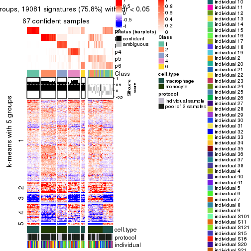</p>

</div>
</div>


Compare the overlap of signatures from different k:

```r
compare_signatures(res)
```

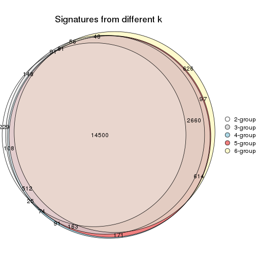

`get_signature()` returns a data frame invisibly. TO get the list of signatures, the function
call should be assigned to a variable explicitly. In following code, if `plot` argument is set
to `FALSE`, no heatmap is plotted while only the differential analysis is performed.

```r
# code only for demonstration
tb = get_signature(res, k = ..., plot = FALSE)
```

An example of the output of `tb` is:

```
#>   which_row         fdr    mean_1    mean_2 scaled_mean_1 scaled_mean_2 km
#> 1        38 0.042760348  8.373488  9.131774    -0.5533452     0.5164555  1
#> 2        40 0.018707592  7.106213  8.469186    -0.6173731     0.5762149  1
#> 3        55 0.019134737 10.221463 11.207825    -0.6159697     0.5749050  1
#> 4        59 0.006059896  5.921854  7.869574    -0.6899429     0.6439467  1
#> 5        60 0.018055526  8.928898 10.211722    -0.6204761     0.5791110  1
#> 6        98 0.009384629 15.714769 14.887706     0.6635654    -0.6193277  2
...
```

The columns in `tb` are:

1. `which_row`: row indices corresponding to the input matrix.
2. `fdr`: FDR for the differential test. 
3. `mean_x`: The mean value in group x.
4. `scaled_mean_x`: The mean value in group x after rows are scaled.
5. `km`: Row groups if k-means clustering is applied to rows.


UMAP plot which shows how samples are separated.


<script>
$( function() {
	$( '#tabs-ATC-kmeans-dimension-reduction' ).tabs();
} );
</script>
<div id='tabs-ATC-kmeans-dimension-reduction'>
<ul>
<li><a href='#tab-ATC-kmeans-dimension-reduction-1'>k = 2</a></li>
<li><a href='#tab-ATC-kmeans-dimension-reduction-2'>k = 3</a></li>
<li><a href='#tab-ATC-kmeans-dimension-reduction-3'>k = 4</a></li>
<li><a href='#tab-ATC-kmeans-dimension-reduction-4'>k = 5</a></li>
<li><a href='#tab-ATC-kmeans-dimension-reduction-5'>k = 6</a></li>
</ul>
<div id='tab-ATC-kmeans-dimension-reduction-1'>
<pre><code class="r">dimension_reduction(res, k = 2, method = &quot;UMAP&quot;)
</code></pre>

<p></p>

</div>
<div id='tab-ATC-kmeans-dimension-reduction-2'>
<pre><code class="r">dimension_reduction(res, k = 3, method = &quot;UMAP&quot;)
</code></pre>

<p></p>

</div>
<div id='tab-ATC-kmeans-dimension-reduction-3'>
<pre><code class="r">dimension_reduction(res, k = 4, method = &quot;UMAP&quot;)
</code></pre>

<p></p>

</div>
<div id='tab-ATC-kmeans-dimension-reduction-4'>
<pre><code class="r">dimension_reduction(res, k = 5, method = &quot;UMAP&quot;)
</code></pre>

<p></p>

</div>
<div id='tab-ATC-kmeans-dimension-reduction-5'>
<pre><code class="r">dimension_reduction(res, k = 6, method = &quot;UMAP&quot;)
</code></pre>

<p></p>

</div>
</div>


Following heatmap shows how subgroups are split when increasing `k`:

```r
collect_classes(res)
```


Test correlation between subgroups and known annotations. If the known
annotation is numeric, one-way ANOVA test is applied, and if the known
annotation is discrete, chi-squared contingency table test is applied.

```r
test_to_known_factors(res)
```

```
#>             n cell.type(p) protocol(p) individual(p) k
#> ATC:kmeans 96     8.49e-22       1.000         1.000 2
#> ATC:kmeans 93     6.39e-21       0.329         1.000 3
#> ATC:kmeans 90     2.19e-19       0.481         0.996 4
#> ATC:kmeans 84     4.25e-18       0.279         0.987 5
#> ATC:kmeans 68     2.67e-13       0.639         0.937 6
```


If matrix rows can be associated to genes, consider to use `functional_enrichment(res,
...)` to perform function enrichment for the signature genes. See [this vignette](http://bioconductor.org/packages/devel/bioc/vignettes/cola/inst/doc/functional_enrichment.html) for more detailed explanations.


 

---------------------------------------------------


### ATC:skmeans*


The object with results only for a single top-value method and a single partition method 
can be extracted as:

```r
res = res_list["ATC", "skmeans"]
# you can also extract it by
# res = res_list["ATC:skmeans"]
```

A summary of `res` and all the functions that can be applied to it:

```r
res
```

```
#> A 'ConsensusPartition' object with k = 2, 3, 4, 5, 6.
#>   On a matrix with 25171 rows and 96 columns.
#>   Top rows (1000, 2000, 3000, 4000, 5000) are extracted by 'ATC' method.
#>   Subgroups are detected by 'skmeans' method.
#>   Performed in total 1250 partitions by row resampling.
#>   Best k for subgroups seems to be 4.
#> 
#> Following methods can be applied to this 'ConsensusPartition' object:
#>  [1] "cola_report"             "collect_classes"         "collect_plots"          
#>  [4] "collect_stats"           "colnames"                "compare_signatures"     
#>  [7] "consensus_heatmap"       "dimension_reduction"     "functional_enrichment"  
#> [10] "get_anno_col"            "get_anno"                "get_classes"            
#> [13] "get_consensus"           "get_matrix"              "get_membership"         
#> [16] "get_param"               "get_signatures"          "get_stats"              
#> [19] "is_best_k"               "is_stable_k"             "membership_heatmap"     
#> [22] "ncol"                    "nrow"                    "plot_ecdf"              
#> [25] "rownames"                "select_partition_number" "show"                   
#> [28] "suggest_best_k"          "test_to_known_factors"
```

`collect_plots()` function collects all the plots made from `res` for all `k` (number of partitions)
into one single page to provide an easy and fast comparison between different `k`.

```r
collect_plots(res)
```


The plots are:

- The first row: a plot of the ECDF (empirical cumulative distribution
  function) curves of the consensus matrix for each `k` and the heatmap of
  predicted classes for each `k`.
- The second row: heatmaps of the consensus matrix for each `k`.
- The third row: heatmaps of the membership matrix for each `k`.
- The fouth row: heatmaps of the signatures for each `k`.

All the plots in panels can be made by individual functions and they are
plotted later in this section.

`select_partition_number()` produces several plots showing different
statistics for choosing "optimized" `k`. There are following statistics:

- ECDF curves of the consensus matrix for each `k`;
- 1-PAC. [The PAC
  score](https://en.wikipedia.org/wiki/Consensus_clustering#Over-interpretation_potential_of_consensus_clustering)
  measures the proportion of the ambiguous subgrouping.
- Mean silhouette score.
- Concordance. The mean probability of fiting the consensus class ids in all
  partitions.
- Area increased. Denote $A_k$ as the area under the ECDF curve for current
  `k`, the area increased is defined as $A_k - A_{k-1}$.
- Rand index. The percent of pairs of samples that are both in a same cluster
  or both are not in a same cluster in the partition of k and k-1.
- Jaccard index. The ratio of pairs of samples are both in a same cluster in
  the partition of k and k-1 and the pairs of samples are both in a same
  cluster in the partition k or k-1.

The detailed explanations of these statistics can be found in [the _cola_
vignette](http://bioconductor.org/packages/devel/bioc/vignettes/cola/inst/doc/cola.html#toc_13).

Generally speaking, lower PAC score, higher mean silhouette score or higher
concordance corresponds to better partition. Rand index and Jaccard index
measure how similar the current partition is compared to partition with `k-1`.
If they are too similar, we won't accept `k` is better than `k-1`.

```r
select_partition_number(res)
```


The numeric values for all these statistics can be obtained by `get_stats()`.

```r
get_stats(res)
```

```
#>   k 1-PAC mean_silhouette concordance area_increased  Rand Jaccard
#> 2 2 1.000           1.000       1.000         0.5058 0.495   0.495
#> 3 3 1.000           0.969       0.981         0.2254 0.882   0.761
#> 4 4 0.908           0.934       0.963         0.1351 0.911   0.763
#> 5 5 0.832           0.831       0.908         0.0587 0.975   0.912
#> 6 6 0.793           0.707       0.858         0.0407 0.987   0.952
```

`suggest_best_k()` suggests the best $k$ based on these statistics. The rules are as follows:

- All $k$ with Jaccard index larger than 0.95 are removed because increasing
  $k$ does not provide enough extra information. If all $k$ are removed, it is
  marked as no subgroup is detected.
- For all $k$ with 1-PAC score larger than 0.9, the maximal $k$ is taken as
  the best $k$, and other $k$ are marked as optional $k$.
- If it does not fit the second rule. The $k$ with the maximal vote of the
  highest 1-PAC score, highest mean silhouette, and highest concordance is
  taken as the best $k$.

```r
suggest_best_k(res)
```

```
#> [1] 4
#> attr(,"optional")
#> [1] 2 3
```

There is also optional best $k$ = 2 3 that is worth to check.

Following shows the table of the partitions (You need to click the **show/hide
code output** link to see it). The membership matrix (columns with name `p*`)
is inferred by
[`clue::cl_consensus()`](https://www.rdocumentation.org/link/cl_consensus?package=clue)
function with the `SE` method. Basically the value in the membership matrix
represents the probability to belong to a certain group. The finall class
label for an item is determined with the group with highest probability it
belongs to.

In `get_classes()` function, the entropy is calculated from the membership
matrix and the silhouette score is calculated from the consensus matrix.


<script>
$( function() {
	$( '#tabs-ATC-skmeans-get-classes' ).tabs();
} );
</script>
<div id='tabs-ATC-skmeans-get-classes'>
<ul>
<li><a href='#tab-ATC-skmeans-get-classes-1'>k = 2</a></li>
<li><a href='#tab-ATC-skmeans-get-classes-2'>k = 3</a></li>
<li><a href='#tab-ATC-skmeans-get-classes-3'>k = 4</a></li>
<li><a href='#tab-ATC-skmeans-get-classes-4'>k = 5</a></li>
<li><a href='#tab-ATC-skmeans-get-classes-5'>k = 6</a></li>
</ul>

<div id='tab-ATC-skmeans-get-classes-1'>
<p><a id='tab-ATC-skmeans-get-classes-1-a' style='color:#0366d6' href='#'>show/hide code output</a></p>
<pre><code class="r">cbind(get_classes(res, k = 2), get_membership(res, k = 2))
</code></pre>

<pre><code>#&gt;           class entropy silhouette p1 p2
#&gt; GSM257886     1       0          1  1  0
#&gt; GSM257888     1       0          1  1  0
#&gt; GSM257890     1       0          1  1  0
#&gt; GSM257892     1       0          1  1  0
#&gt; GSM257894     1       0          1  1  0
#&gt; GSM257896     1       0          1  1  0
#&gt; GSM257898     1       0          1  1  0
#&gt; GSM257900     1       0          1  1  0
#&gt; GSM257902     1       0          1  1  0
#&gt; GSM257904     1       0          1  1  0
#&gt; GSM257906     1       0          1  1  0
#&gt; GSM257908     1       0          1  1  0
#&gt; GSM257910     1       0          1  1  0
#&gt; GSM257912     1       0          1  1  0
#&gt; GSM257914     1       0          1  1  0
#&gt; GSM257917     1       0          1  1  0
#&gt; GSM257919     1       0          1  1  0
#&gt; GSM257921     1       0          1  1  0
#&gt; GSM257923     1       0          1  1  0
#&gt; GSM257925     1       0          1  1  0
#&gt; GSM257927     1       0          1  1  0
#&gt; GSM257929     1       0          1  1  0
#&gt; GSM257937     1       0          1  1  0
#&gt; GSM257939     1       0          1  1  0
#&gt; GSM257941     1       0          1  1  0
#&gt; GSM257943     1       0          1  1  0
#&gt; GSM257945     1       0          1  1  0
#&gt; GSM257947     1       0          1  1  0
#&gt; GSM257949     1       0          1  1  0
#&gt; GSM257951     1       0          1  1  0
#&gt; GSM257953     1       0          1  1  0
#&gt; GSM257955     1       0          1  1  0
#&gt; GSM257958     1       0          1  1  0
#&gt; GSM257960     1       0          1  1  0
#&gt; GSM257962     1       0          1  1  0
#&gt; GSM257964     1       0          1  1  0
#&gt; GSM257966     1       0          1  1  0
#&gt; GSM257968     1       0          1  1  0
#&gt; GSM257970     1       0          1  1  0
#&gt; GSM257972     1       0          1  1  0
#&gt; GSM257977     1       0          1  1  0
#&gt; GSM257982     1       0          1  1  0
#&gt; GSM257984     1       0          1  1  0
#&gt; GSM257986     1       0          1  1  0
#&gt; GSM257990     1       0          1  1  0
#&gt; GSM257992     1       0          1  1  0
#&gt; GSM257996     1       0          1  1  0
#&gt; GSM258006     1       0          1  1  0
#&gt; GSM257887     2       0          1  0  1
#&gt; GSM257889     2       0          1  0  1
#&gt; GSM257891     2       0          1  0  1
#&gt; GSM257893     2       0          1  0  1
#&gt; GSM257895     2       0          1  0  1
#&gt; GSM257897     2       0          1  0  1
#&gt; GSM257899     2       0          1  0  1
#&gt; GSM257901     2       0          1  0  1
#&gt; GSM257903     2       0          1  0  1
#&gt; GSM257905     2       0          1  0  1
#&gt; GSM257907     2       0          1  0  1
#&gt; GSM257909     2       0          1  0  1
#&gt; GSM257911     2       0          1  0  1
#&gt; GSM257913     2       0          1  0  1
#&gt; GSM257916     2       0          1  0  1
#&gt; GSM257918     2       0          1  0  1
#&gt; GSM257920     2       0          1  0  1
#&gt; GSM257922     2       0          1  0  1
#&gt; GSM257924     2       0          1  0  1
#&gt; GSM257926     2       0          1  0  1
#&gt; GSM257928     2       0          1  0  1
#&gt; GSM257930     2       0          1  0  1
#&gt; GSM257938     2       0          1  0  1
#&gt; GSM257940     2       0          1  0  1
#&gt; GSM257942     2       0          1  0  1
#&gt; GSM257944     2       0          1  0  1
#&gt; GSM257946     2       0          1  0  1
#&gt; GSM257948     2       0          1  0  1
#&gt; GSM257950     2       0          1  0  1
#&gt; GSM257952     2       0          1  0  1
#&gt; GSM257954     2       0          1  0  1
#&gt; GSM257956     2       0          1  0  1
#&gt; GSM257959     2       0          1  0  1
#&gt; GSM257961     2       0          1  0  1
#&gt; GSM257963     2       0          1  0  1
#&gt; GSM257965     2       0          1  0  1
#&gt; GSM257967     2       0          1  0  1
#&gt; GSM257969     2       0          1  0  1
#&gt; GSM257971     2       0          1  0  1
#&gt; GSM257973     2       0          1  0  1
#&gt; GSM257981     2       0          1  0  1
#&gt; GSM257983     2       0          1  0  1
#&gt; GSM257985     2       0          1  0  1
#&gt; GSM257988     2       0          1  0  1
#&gt; GSM257991     2       0          1  0  1
#&gt; GSM257993     2       0          1  0  1
#&gt; GSM257994     2       0          1  0  1
#&gt; GSM257989     2       0          1  0  1
</code></pre>

<script>
$('#tab-ATC-skmeans-get-classes-1-a').parent().next().next().hide();
$('#tab-ATC-skmeans-get-classes-1-a').click(function(){
  $('#tab-ATC-skmeans-get-classes-1-a').parent().next().next().toggle();
  return(false);
});
</script>
</div>

<div id='tab-ATC-skmeans-get-classes-2'>
<p><a id='tab-ATC-skmeans-get-classes-2-a' style='color:#0366d6' href='#'>show/hide code output</a></p>
<pre><code class="r">cbind(get_classes(res, k = 3), get_membership(res, k = 3))
</code></pre>

<pre><code>#&gt;           class entropy silhouette    p1    p2    p3
#&gt; GSM257886     1  0.1031      0.984 0.976 0.000 0.024
#&gt; GSM257888     1  0.0892      0.986 0.980 0.000 0.020
#&gt; GSM257890     1  0.1031      0.984 0.976 0.000 0.024
#&gt; GSM257892     1  0.1031      0.984 0.976 0.000 0.024
#&gt; GSM257894     1  0.0892      0.986 0.980 0.000 0.020
#&gt; GSM257896     1  0.0892      0.986 0.980 0.000 0.020
#&gt; GSM257898     1  0.0000      0.996 1.000 0.000 0.000
#&gt; GSM257900     1  0.0000      0.996 1.000 0.000 0.000
#&gt; GSM257902     1  0.0000      0.996 1.000 0.000 0.000
#&gt; GSM257904     1  0.0000      0.996 1.000 0.000 0.000
#&gt; GSM257906     1  0.0237      0.994 0.996 0.000 0.004
#&gt; GSM257908     1  0.0237      0.994 0.996 0.000 0.004
#&gt; GSM257910     1  0.0000      0.996 1.000 0.000 0.000
#&gt; GSM257912     1  0.0000      0.996 1.000 0.000 0.000
#&gt; GSM257914     1  0.0000      0.996 1.000 0.000 0.000
#&gt; GSM257917     1  0.0000      0.996 1.000 0.000 0.000
#&gt; GSM257919     1  0.0000      0.996 1.000 0.000 0.000
#&gt; GSM257921     1  0.0000      0.996 1.000 0.000 0.000
#&gt; GSM257923     1  0.0000      0.996 1.000 0.000 0.000
#&gt; GSM257925     1  0.0000      0.996 1.000 0.000 0.000
#&gt; GSM257927     1  0.0000      0.996 1.000 0.000 0.000
#&gt; GSM257929     1  0.0000      0.996 1.000 0.000 0.000
#&gt; GSM257937     1  0.0892      0.986 0.980 0.000 0.020
#&gt; GSM257939     1  0.0000      0.996 1.000 0.000 0.000
#&gt; GSM257941     1  0.0000      0.996 1.000 0.000 0.000
#&gt; GSM257943     1  0.0000      0.996 1.000 0.000 0.000
#&gt; GSM257945     1  0.0000      0.996 1.000 0.000 0.000
#&gt; GSM257947     1  0.0000      0.996 1.000 0.000 0.000
#&gt; GSM257949     1  0.0000      0.996 1.000 0.000 0.000
#&gt; GSM257951     1  0.0000      0.996 1.000 0.000 0.000
#&gt; GSM257953     1  0.0000      0.996 1.000 0.000 0.000
#&gt; GSM257955     1  0.0000      0.996 1.000 0.000 0.000
#&gt; GSM257958     1  0.0000      0.996 1.000 0.000 0.000
#&gt; GSM257960     1  0.0000      0.996 1.000 0.000 0.000
#&gt; GSM257962     1  0.0000      0.996 1.000 0.000 0.000
#&gt; GSM257964     1  0.0000      0.996 1.000 0.000 0.000
#&gt; GSM257966     1  0.0892      0.986 0.980 0.000 0.020
#&gt; GSM257968     1  0.0892      0.986 0.980 0.000 0.020
#&gt; GSM257970     1  0.0000      0.996 1.000 0.000 0.000
#&gt; GSM257972     1  0.0000      0.996 1.000 0.000 0.000
#&gt; GSM257977     1  0.0892      0.986 0.980 0.000 0.020
#&gt; GSM257982     1  0.0892      0.986 0.980 0.000 0.020
#&gt; GSM257984     1  0.0000      0.996 1.000 0.000 0.000
#&gt; GSM257986     1  0.0000      0.996 1.000 0.000 0.000
#&gt; GSM257990     1  0.0000      0.996 1.000 0.000 0.000
#&gt; GSM257992     1  0.0237      0.994 0.996 0.000 0.004
#&gt; GSM257996     1  0.0000      0.996 1.000 0.000 0.000
#&gt; GSM258006     1  0.0237      0.994 0.996 0.000 0.004
#&gt; GSM257887     2  0.0000      1.000 0.000 1.000 0.000
#&gt; GSM257889     3  0.1031      0.930 0.000 0.024 0.976
#&gt; GSM257891     3  0.1031      0.930 0.000 0.024 0.976
#&gt; GSM257893     3  0.1031      0.930 0.000 0.024 0.976
#&gt; GSM257895     2  0.0000      1.000 0.000 1.000 0.000
#&gt; GSM257897     3  0.1031      0.930 0.000 0.024 0.976
#&gt; GSM257899     3  0.1031      0.930 0.000 0.024 0.976
#&gt; GSM257901     2  0.0000      1.000 0.000 1.000 0.000
#&gt; GSM257903     2  0.0000      1.000 0.000 1.000 0.000
#&gt; GSM257905     2  0.0000      1.000 0.000 1.000 0.000
#&gt; GSM257907     2  0.0000      1.000 0.000 1.000 0.000
#&gt; GSM257909     2  0.0000      1.000 0.000 1.000 0.000
#&gt; GSM257911     2  0.0000      1.000 0.000 1.000 0.000
#&gt; GSM257913     2  0.0000      1.000 0.000 1.000 0.000
#&gt; GSM257916     2  0.0000      1.000 0.000 1.000 0.000
#&gt; GSM257918     2  0.0000      1.000 0.000 1.000 0.000
#&gt; GSM257920     3  0.6154      0.417 0.000 0.408 0.592
#&gt; GSM257922     3  0.1031      0.930 0.000 0.024 0.976
#&gt; GSM257924     3  0.3551      0.844 0.000 0.132 0.868
#&gt; GSM257926     3  0.6126      0.436 0.000 0.400 0.600
#&gt; GSM257928     3  0.1031      0.930 0.000 0.024 0.976
#&gt; GSM257930     2  0.0000      1.000 0.000 1.000 0.000
#&gt; GSM257938     2  0.0000      1.000 0.000 1.000 0.000
#&gt; GSM257940     2  0.0000      1.000 0.000 1.000 0.000
#&gt; GSM257942     2  0.0000      1.000 0.000 1.000 0.000
#&gt; GSM257944     2  0.0000      1.000 0.000 1.000 0.000
#&gt; GSM257946     3  0.1031      0.930 0.000 0.024 0.976
#&gt; GSM257948     2  0.0237      0.995 0.000 0.996 0.004
#&gt; GSM257950     3  0.1031      0.930 0.000 0.024 0.976
#&gt; GSM257952     2  0.0000      1.000 0.000 1.000 0.000
#&gt; GSM257954     2  0.0000      1.000 0.000 1.000 0.000
#&gt; GSM257956     2  0.0000      1.000 0.000 1.000 0.000
#&gt; GSM257959     2  0.0000      1.000 0.000 1.000 0.000
#&gt; GSM257961     2  0.0000      1.000 0.000 1.000 0.000
#&gt; GSM257963     2  0.0000      1.000 0.000 1.000 0.000
#&gt; GSM257965     2  0.0000      1.000 0.000 1.000 0.000
#&gt; GSM257967     2  0.0000      1.000 0.000 1.000 0.000
#&gt; GSM257969     2  0.0000      1.000 0.000 1.000 0.000
#&gt; GSM257971     3  0.5465      0.638 0.000 0.288 0.712
#&gt; GSM257973     3  0.1031      0.930 0.000 0.024 0.976
#&gt; GSM257981     2  0.0000      1.000 0.000 1.000 0.000
#&gt; GSM257983     3  0.1031      0.930 0.000 0.024 0.976
#&gt; GSM257985     3  0.1031      0.930 0.000 0.024 0.976
#&gt; GSM257988     3  0.1031      0.930 0.000 0.024 0.976
#&gt; GSM257991     2  0.0000      1.000 0.000 1.000 0.000
#&gt; GSM257993     2  0.0000      1.000 0.000 1.000 0.000
#&gt; GSM257994     2  0.0000      1.000 0.000 1.000 0.000
#&gt; GSM257989     3  0.1031      0.930 0.000 0.024 0.976
</code></pre>

<script>
$('#tab-ATC-skmeans-get-classes-2-a').parent().next().next().hide();
$('#tab-ATC-skmeans-get-classes-2-a').click(function(){
  $('#tab-ATC-skmeans-get-classes-2-a').parent().next().next().toggle();
  return(false);
});
</script>
</div>

<div id='tab-ATC-skmeans-get-classes-3'>
<p><a id='tab-ATC-skmeans-get-classes-3-a' style='color:#0366d6' href='#'>show/hide code output</a></p>
<pre><code class="r">cbind(get_classes(res, k = 4), get_membership(res, k = 4))
</code></pre>

<pre><code>#&gt;           class entropy silhouette    p1    p2    p3    p4
#&gt; GSM257886     4  0.0000      0.770 0.000 0.000 0.000 1.000
#&gt; GSM257888     4  0.3486      0.896 0.188 0.000 0.000 0.812
#&gt; GSM257890     4  0.0000      0.770 0.000 0.000 0.000 1.000
#&gt; GSM257892     4  0.0000      0.770 0.000 0.000 0.000 1.000
#&gt; GSM257894     4  0.3942      0.878 0.236 0.000 0.000 0.764
#&gt; GSM257896     4  0.3907      0.881 0.232 0.000 0.000 0.768
#&gt; GSM257898     1  0.0336      0.969 0.992 0.000 0.000 0.008
#&gt; GSM257900     1  0.0000      0.975 1.000 0.000 0.000 0.000
#&gt; GSM257902     1  0.0000      0.975 1.000 0.000 0.000 0.000
#&gt; GSM257904     1  0.0336      0.969 0.992 0.000 0.000 0.008
#&gt; GSM257906     1  0.3610      0.742 0.800 0.000 0.000 0.200
#&gt; GSM257908     1  0.1940      0.887 0.924 0.000 0.000 0.076
#&gt; GSM257910     1  0.0000      0.975 1.000 0.000 0.000 0.000
#&gt; GSM257912     1  0.0000      0.975 1.000 0.000 0.000 0.000
#&gt; GSM257914     1  0.0000      0.975 1.000 0.000 0.000 0.000
#&gt; GSM257917     1  0.0000      0.975 1.000 0.000 0.000 0.000
#&gt; GSM257919     1  0.0000      0.975 1.000 0.000 0.000 0.000
#&gt; GSM257921     1  0.0000      0.975 1.000 0.000 0.000 0.000
#&gt; GSM257923     1  0.0000      0.975 1.000 0.000 0.000 0.000
#&gt; GSM257925     1  0.0000      0.975 1.000 0.000 0.000 0.000
#&gt; GSM257927     1  0.0000      0.975 1.000 0.000 0.000 0.000
#&gt; GSM257929     1  0.0000      0.975 1.000 0.000 0.000 0.000
#&gt; GSM257937     4  0.3356      0.897 0.176 0.000 0.000 0.824
#&gt; GSM257939     1  0.0000      0.975 1.000 0.000 0.000 0.000
#&gt; GSM257941     1  0.0000      0.975 1.000 0.000 0.000 0.000
#&gt; GSM257943     1  0.0336      0.969 0.992 0.000 0.000 0.008
#&gt; GSM257945     1  0.0000      0.975 1.000 0.000 0.000 0.000
#&gt; GSM257947     1  0.0000      0.975 1.000 0.000 0.000 0.000
#&gt; GSM257949     1  0.0000      0.975 1.000 0.000 0.000 0.000
#&gt; GSM257951     1  0.0000      0.975 1.000 0.000 0.000 0.000
#&gt; GSM257953     1  0.0000      0.975 1.000 0.000 0.000 0.000
#&gt; GSM257955     1  0.0000      0.975 1.000 0.000 0.000 0.000
#&gt; GSM257958     1  0.0000      0.975 1.000 0.000 0.000 0.000
#&gt; GSM257960     1  0.0000      0.975 1.000 0.000 0.000 0.000
#&gt; GSM257962     1  0.0000      0.975 1.000 0.000 0.000 0.000
#&gt; GSM257964     1  0.0000      0.975 1.000 0.000 0.000 0.000
#&gt; GSM257966     4  0.3400      0.897 0.180 0.000 0.000 0.820
#&gt; GSM257968     4  0.3873      0.883 0.228 0.000 0.000 0.772
#&gt; GSM257970     1  0.0000      0.975 1.000 0.000 0.000 0.000
#&gt; GSM257972     1  0.0000      0.975 1.000 0.000 0.000 0.000
#&gt; GSM257977     4  0.3356      0.897 0.176 0.000 0.000 0.824
#&gt; GSM257982     4  0.3942      0.878 0.236 0.000 0.000 0.764
#&gt; GSM257984     1  0.0000      0.975 1.000 0.000 0.000 0.000
#&gt; GSM257986     1  0.0000      0.975 1.000 0.000 0.000 0.000
#&gt; GSM257990     1  0.0000      0.975 1.000 0.000 0.000 0.000
#&gt; GSM257992     1  0.3801      0.715 0.780 0.000 0.000 0.220
#&gt; GSM257996     1  0.0000      0.975 1.000 0.000 0.000 0.000
#&gt; GSM258006     1  0.3907      0.699 0.768 0.000 0.000 0.232
#&gt; GSM257887     2  0.0000      1.000 0.000 1.000 0.000 0.000
#&gt; GSM257889     3  0.0000      0.908 0.000 0.000 1.000 0.000
#&gt; GSM257891     3  0.0000      0.908 0.000 0.000 1.000 0.000
#&gt; GSM257893     3  0.0000      0.908 0.000 0.000 1.000 0.000
#&gt; GSM257895     2  0.0000      1.000 0.000 1.000 0.000 0.000
#&gt; GSM257897     3  0.0000      0.908 0.000 0.000 1.000 0.000
#&gt; GSM257899     3  0.0000      0.908 0.000 0.000 1.000 0.000
#&gt; GSM257901     2  0.0000      1.000 0.000 1.000 0.000 0.000
#&gt; GSM257903     2  0.0000      1.000 0.000 1.000 0.000 0.000
#&gt; GSM257905     2  0.0000      1.000 0.000 1.000 0.000 0.000
#&gt; GSM257907     2  0.0000      1.000 0.000 1.000 0.000 0.000
#&gt; GSM257909     2  0.0000      1.000 0.000 1.000 0.000 0.000
#&gt; GSM257911     2  0.0000      1.000 0.000 1.000 0.000 0.000
#&gt; GSM257913     2  0.0000      1.000 0.000 1.000 0.000 0.000
#&gt; GSM257916     2  0.0000      1.000 0.000 1.000 0.000 0.000
#&gt; GSM257918     2  0.0000      1.000 0.000 1.000 0.000 0.000
#&gt; GSM257920     3  0.4817      0.432 0.000 0.388 0.612 0.000
#&gt; GSM257922     3  0.0000      0.908 0.000 0.000 1.000 0.000
#&gt; GSM257924     3  0.2704      0.797 0.000 0.124 0.876 0.000
#&gt; GSM257926     3  0.4776      0.460 0.000 0.376 0.624 0.000
#&gt; GSM257928     3  0.0000      0.908 0.000 0.000 1.000 0.000
#&gt; GSM257930     2  0.0000      1.000 0.000 1.000 0.000 0.000
#&gt; GSM257938     2  0.0000      1.000 0.000 1.000 0.000 0.000
#&gt; GSM257940     2  0.0000      1.000 0.000 1.000 0.000 0.000
#&gt; GSM257942     2  0.0000      1.000 0.000 1.000 0.000 0.000
#&gt; GSM257944     2  0.0000      1.000 0.000 1.000 0.000 0.000
#&gt; GSM257946     3  0.0000      0.908 0.000 0.000 1.000 0.000
#&gt; GSM257948     2  0.0188      0.996 0.000 0.996 0.004 0.000
#&gt; GSM257950     3  0.0000      0.908 0.000 0.000 1.000 0.000
#&gt; GSM257952     2  0.0000      1.000 0.000 1.000 0.000 0.000
#&gt; GSM257954     2  0.0000      1.000 0.000 1.000 0.000 0.000
#&gt; GSM257956     2  0.0000      1.000 0.000 1.000 0.000 0.000
#&gt; GSM257959     2  0.0000      1.000 0.000 1.000 0.000 0.000
#&gt; GSM257961     2  0.0000      1.000 0.000 1.000 0.000 0.000
#&gt; GSM257963     2  0.0000      1.000 0.000 1.000 0.000 0.000
#&gt; GSM257965     2  0.0000      1.000 0.000 1.000 0.000 0.000
#&gt; GSM257967     2  0.0000      1.000 0.000 1.000 0.000 0.000
#&gt; GSM257969     2  0.0000      1.000 0.000 1.000 0.000 0.000
#&gt; GSM257971     3  0.4222      0.616 0.000 0.272 0.728 0.000
#&gt; GSM257973     3  0.0000      0.908 0.000 0.000 1.000 0.000
#&gt; GSM257981     2  0.0000      1.000 0.000 1.000 0.000 0.000
#&gt; GSM257983     3  0.0000      0.908 0.000 0.000 1.000 0.000
#&gt; GSM257985     3  0.0000      0.908 0.000 0.000 1.000 0.000
#&gt; GSM257988     3  0.0000      0.908 0.000 0.000 1.000 0.000
#&gt; GSM257991     2  0.0000      1.000 0.000 1.000 0.000 0.000
#&gt; GSM257993     2  0.0000      1.000 0.000 1.000 0.000 0.000
#&gt; GSM257994     2  0.0000      1.000 0.000 1.000 0.000 0.000
#&gt; GSM257989     3  0.0000      0.908 0.000 0.000 1.000 0.000
</code></pre>

<script>
$('#tab-ATC-skmeans-get-classes-3-a').parent().next().next().hide();
$('#tab-ATC-skmeans-get-classes-3-a').click(function(){
  $('#tab-ATC-skmeans-get-classes-3-a').parent().next().next().toggle();
  return(false);
});
</script>
</div>

<div id='tab-ATC-skmeans-get-classes-4'>
<p><a id='tab-ATC-skmeans-get-classes-4-a' style='color:#0366d6' href='#'>show/hide code output</a></p>
<pre><code class="r">cbind(get_classes(res, k = 5), get_membership(res, k = 5))
</code></pre>

<pre><code>#&gt;           class entropy silhouette    p1    p2    p3    p4    p5
#&gt; GSM257886     5  0.4283     -0.298 0.000 0.000 0.000 0.456 0.544
#&gt; GSM257888     4  0.1043      0.891 0.040 0.000 0.000 0.960 0.000
#&gt; GSM257890     4  0.0703      0.843 0.000 0.000 0.000 0.976 0.024
#&gt; GSM257892     4  0.4227      0.310 0.000 0.000 0.000 0.580 0.420
#&gt; GSM257894     4  0.2127      0.869 0.108 0.000 0.000 0.892 0.000
#&gt; GSM257896     4  0.2074      0.873 0.104 0.000 0.000 0.896 0.000
#&gt; GSM257898     1  0.3424      0.631 0.760 0.000 0.000 0.000 0.240
#&gt; GSM257900     1  0.2179      0.832 0.888 0.000 0.000 0.000 0.112
#&gt; GSM257902     1  0.0000      0.890 1.000 0.000 0.000 0.000 0.000
#&gt; GSM257904     1  0.3395      0.640 0.764 0.000 0.000 0.000 0.236
#&gt; GSM257906     5  0.4088      0.704 0.368 0.000 0.000 0.000 0.632
#&gt; GSM257908     1  0.4751      0.555 0.732 0.000 0.000 0.152 0.116
#&gt; GSM257910     1  0.2230      0.797 0.884 0.000 0.000 0.000 0.116
#&gt; GSM257912     1  0.3780      0.725 0.808 0.000 0.000 0.060 0.132
#&gt; GSM257914     1  0.3780      0.725 0.808 0.000 0.000 0.060 0.132
#&gt; GSM257917     1  0.2516      0.797 0.860 0.000 0.000 0.000 0.140
#&gt; GSM257919     1  0.3844      0.719 0.804 0.000 0.000 0.064 0.132
#&gt; GSM257921     1  0.0404      0.888 0.988 0.000 0.000 0.000 0.012
#&gt; GSM257923     1  0.0000      0.890 1.000 0.000 0.000 0.000 0.000
#&gt; GSM257925     1  0.0290      0.888 0.992 0.000 0.000 0.000 0.008
#&gt; GSM257927     1  0.1792      0.854 0.916 0.000 0.000 0.000 0.084
#&gt; GSM257929     1  0.0000      0.890 1.000 0.000 0.000 0.000 0.000
#&gt; GSM257937     4  0.1043      0.891 0.040 0.000 0.000 0.960 0.000
#&gt; GSM257939     1  0.0000      0.890 1.000 0.000 0.000 0.000 0.000
#&gt; GSM257941     1  0.1908      0.849 0.908 0.000 0.000 0.000 0.092
#&gt; GSM257943     1  0.3395      0.640 0.764 0.000 0.000 0.000 0.236
#&gt; GSM257945     1  0.1908      0.849 0.908 0.000 0.000 0.000 0.092
#&gt; GSM257947     1  0.0000      0.890 1.000 0.000 0.000 0.000 0.000
#&gt; GSM257949     1  0.0000      0.890 1.000 0.000 0.000 0.000 0.000
#&gt; GSM257951     1  0.0000      0.890 1.000 0.000 0.000 0.000 0.000
#&gt; GSM257953     1  0.0510      0.886 0.984 0.000 0.000 0.000 0.016
#&gt; GSM257955     1  0.0000      0.890 1.000 0.000 0.000 0.000 0.000
#&gt; GSM257958     1  0.0609      0.884 0.980 0.000 0.000 0.000 0.020
#&gt; GSM257960     1  0.1851      0.852 0.912 0.000 0.000 0.000 0.088
#&gt; GSM257962     1  0.1851      0.852 0.912 0.000 0.000 0.000 0.088
#&gt; GSM257964     1  0.0000      0.890 1.000 0.000 0.000 0.000 0.000
#&gt; GSM257966     4  0.1043      0.891 0.040 0.000 0.000 0.960 0.000
#&gt; GSM257968     4  0.2020      0.875 0.100 0.000 0.000 0.900 0.000
#&gt; GSM257970     1  0.0000      0.890 1.000 0.000 0.000 0.000 0.000
#&gt; GSM257972     1  0.0000      0.890 1.000 0.000 0.000 0.000 0.000
#&gt; GSM257977     4  0.1043      0.891 0.040 0.000 0.000 0.960 0.000
#&gt; GSM257982     4  0.2230      0.859 0.116 0.000 0.000 0.884 0.000
#&gt; GSM257984     1  0.0000      0.890 1.000 0.000 0.000 0.000 0.000
#&gt; GSM257986     1  0.0000      0.890 1.000 0.000 0.000 0.000 0.000
#&gt; GSM257990     1  0.1908      0.849 0.908 0.000 0.000 0.000 0.092
#&gt; GSM257992     5  0.4211      0.717 0.360 0.000 0.000 0.004 0.636
#&gt; GSM257996     1  0.2561      0.830 0.856 0.000 0.000 0.000 0.144
#&gt; GSM258006     5  0.4327      0.716 0.360 0.000 0.000 0.008 0.632
#&gt; GSM257887     2  0.0000      0.960 0.000 1.000 0.000 0.000 0.000
#&gt; GSM257889     3  0.0000      0.850 0.000 0.000 1.000 0.000 0.000
#&gt; GSM257891     3  0.0510      0.849 0.000 0.000 0.984 0.000 0.016
#&gt; GSM257893     3  0.0162      0.850 0.000 0.000 0.996 0.004 0.000
#&gt; GSM257895     2  0.0000      0.960 0.000 1.000 0.000 0.000 0.000
#&gt; GSM257897     3  0.1012      0.845 0.000 0.000 0.968 0.012 0.020
#&gt; GSM257899     3  0.0898      0.846 0.000 0.000 0.972 0.008 0.020
#&gt; GSM257901     2  0.2813      0.847 0.000 0.832 0.000 0.000 0.168
#&gt; GSM257903     2  0.0000      0.960 0.000 1.000 0.000 0.000 0.000
#&gt; GSM257905     2  0.0000      0.960 0.000 1.000 0.000 0.000 0.000
#&gt; GSM257907     2  0.2813      0.847 0.000 0.832 0.000 0.000 0.168
#&gt; GSM257909     2  0.0000      0.960 0.000 1.000 0.000 0.000 0.000
#&gt; GSM257911     2  0.1478      0.928 0.000 0.936 0.000 0.000 0.064
#&gt; GSM257913     2  0.2813      0.847 0.000 0.832 0.000 0.000 0.168
#&gt; GSM257916     2  0.0000      0.960 0.000 1.000 0.000 0.000 0.000
#&gt; GSM257918     2  0.0000      0.960 0.000 1.000 0.000 0.000 0.000
#&gt; GSM257920     3  0.6356      0.311 0.000 0.364 0.468 0.000 0.168
#&gt; GSM257922     3  0.0771      0.848 0.000 0.000 0.976 0.004 0.020
#&gt; GSM257924     3  0.5155      0.669 0.000 0.140 0.692 0.000 0.168
#&gt; GSM257926     3  0.6349      0.322 0.000 0.360 0.472 0.000 0.168
#&gt; GSM257928     3  0.1357      0.833 0.000 0.000 0.948 0.004 0.048
#&gt; GSM257930     2  0.1518      0.928 0.000 0.944 0.004 0.004 0.048
#&gt; GSM257938     2  0.1357      0.931 0.000 0.948 0.000 0.004 0.048
#&gt; GSM257940     2  0.3203      0.836 0.000 0.820 0.012 0.000 0.168
#&gt; GSM257942     2  0.0000      0.960 0.000 1.000 0.000 0.000 0.000
#&gt; GSM257944     2  0.0000      0.960 0.000 1.000 0.000 0.000 0.000
#&gt; GSM257946     3  0.0609      0.848 0.000 0.000 0.980 0.000 0.020
#&gt; GSM257948     2  0.3656      0.813 0.000 0.800 0.032 0.000 0.168
#&gt; GSM257950     3  0.0290      0.850 0.000 0.000 0.992 0.000 0.008
#&gt; GSM257952     2  0.0162      0.959 0.000 0.996 0.000 0.000 0.004
#&gt; GSM257954     2  0.0000      0.960 0.000 1.000 0.000 0.000 0.000
#&gt; GSM257956     2  0.0000      0.960 0.000 1.000 0.000 0.000 0.000
#&gt; GSM257959     2  0.0000      0.960 0.000 1.000 0.000 0.000 0.000
#&gt; GSM257961     2  0.0000      0.960 0.000 1.000 0.000 0.000 0.000
#&gt; GSM257963     2  0.0000      0.960 0.000 1.000 0.000 0.000 0.000
#&gt; GSM257965     2  0.0000      0.960 0.000 1.000 0.000 0.000 0.000
#&gt; GSM257967     2  0.0000      0.960 0.000 1.000 0.000 0.000 0.000
#&gt; GSM257969     2  0.0000      0.960 0.000 1.000 0.000 0.000 0.000
#&gt; GSM257971     3  0.6107      0.568 0.000 0.200 0.588 0.004 0.208
#&gt; GSM257973     3  0.2813      0.784 0.000 0.000 0.832 0.000 0.168
#&gt; GSM257981     2  0.1478      0.927 0.000 0.936 0.000 0.000 0.064
#&gt; GSM257983     3  0.1012      0.845 0.000 0.000 0.968 0.012 0.020
#&gt; GSM257985     3  0.1197      0.840 0.000 0.000 0.952 0.000 0.048
#&gt; GSM257988     3  0.2648      0.793 0.000 0.000 0.848 0.000 0.152
#&gt; GSM257991     2  0.0162      0.959 0.000 0.996 0.000 0.000 0.004
#&gt; GSM257993     2  0.0000      0.960 0.000 1.000 0.000 0.000 0.000
#&gt; GSM257994     2  0.1518      0.928 0.000 0.944 0.004 0.004 0.048
#&gt; GSM257989     3  0.0000      0.850 0.000 0.000 1.000 0.000 0.000
</code></pre>

<script>
$('#tab-ATC-skmeans-get-classes-4-a').parent().next().next().hide();
$('#tab-ATC-skmeans-get-classes-4-a').click(function(){
  $('#tab-ATC-skmeans-get-classes-4-a').parent().next().next().toggle();
  return(false);
});
</script>
</div>

<div id='tab-ATC-skmeans-get-classes-5'>
<p><a id='tab-ATC-skmeans-get-classes-5-a' style='color:#0366d6' href='#'>show/hide code output</a></p>
<pre><code class="r">cbind(get_classes(res, k = 6), get_membership(res, k = 6))
</code></pre>

<pre><code>#&gt;           class entropy silhouette    p1    p2    p3    p4    p5    p6
#&gt; GSM257886     6  0.4664    0.37190 0.000 0.000 0.000 0.280 0.076 0.644
#&gt; GSM257888     4  0.0260    0.97025 0.008 0.000 0.000 0.992 0.000 0.000
#&gt; GSM257890     4  0.0363    0.95382 0.000 0.000 0.000 0.988 0.000 0.012
#&gt; GSM257892     6  0.5422    0.00192 0.000 0.000 0.000 0.436 0.116 0.448
#&gt; GSM257894     4  0.0937    0.95497 0.040 0.000 0.000 0.960 0.000 0.000
#&gt; GSM257896     4  0.0865    0.95927 0.036 0.000 0.000 0.964 0.000 0.000
#&gt; GSM257898     1  0.3810    0.27840 0.572 0.000 0.000 0.000 0.000 0.428
#&gt; GSM257900     1  0.2219    0.77948 0.864 0.000 0.000 0.000 0.000 0.136
#&gt; GSM257902     1  0.0000    0.84461 1.000 0.000 0.000 0.000 0.000 0.000
#&gt; GSM257904     1  0.3797    0.30252 0.580 0.000 0.000 0.000 0.000 0.420
#&gt; GSM257906     6  0.3050    0.67460 0.236 0.000 0.000 0.000 0.000 0.764
#&gt; GSM257908     1  0.6624    0.32546 0.528 0.000 0.000 0.220 0.152 0.100
#&gt; GSM257910     1  0.4562    0.62965 0.728 0.000 0.000 0.016 0.156 0.100
#&gt; GSM257912     1  0.6362    0.45318 0.580 0.000 0.000 0.140 0.156 0.124
#&gt; GSM257914     1  0.6297    0.46612 0.588 0.000 0.000 0.132 0.156 0.124
#&gt; GSM257917     1  0.4666    0.63202 0.708 0.000 0.000 0.008 0.156 0.128
#&gt; GSM257919     1  0.6362    0.45318 0.580 0.000 0.000 0.140 0.156 0.124
#&gt; GSM257921     1  0.0777    0.83813 0.972 0.000 0.000 0.000 0.004 0.024
#&gt; GSM257923     1  0.0000    0.84461 1.000 0.000 0.000 0.000 0.000 0.000
#&gt; GSM257925     1  0.0146    0.84376 0.996 0.000 0.000 0.000 0.000 0.004
#&gt; GSM257927     1  0.1556    0.81767 0.920 0.000 0.000 0.000 0.000 0.080
#&gt; GSM257929     1  0.0000    0.84461 1.000 0.000 0.000 0.000 0.000 0.000
#&gt; GSM257937     4  0.0260    0.97025 0.008 0.000 0.000 0.992 0.000 0.000
#&gt; GSM257939     1  0.0000    0.84461 1.000 0.000 0.000 0.000 0.000 0.000
#&gt; GSM257941     1  0.2003    0.79539 0.884 0.000 0.000 0.000 0.000 0.116
#&gt; GSM257943     1  0.3774    0.33536 0.592 0.000 0.000 0.000 0.000 0.408
#&gt; GSM257945     1  0.1863    0.80405 0.896 0.000 0.000 0.000 0.000 0.104
#&gt; GSM257947     1  0.0000    0.84461 1.000 0.000 0.000 0.000 0.000 0.000
#&gt; GSM257949     1  0.0000    0.84461 1.000 0.000 0.000 0.000 0.000 0.000
#&gt; GSM257951     1  0.0000    0.84461 1.000 0.000 0.000 0.000 0.000 0.000
#&gt; GSM257953     1  0.0146    0.84376 0.996 0.000 0.000 0.000 0.000 0.004
#&gt; GSM257955     1  0.0000    0.84461 1.000 0.000 0.000 0.000 0.000 0.000
#&gt; GSM257958     1  0.0146    0.84376 0.996 0.000 0.000 0.000 0.000 0.004
#&gt; GSM257960     1  0.1663    0.81371 0.912 0.000 0.000 0.000 0.000 0.088
#&gt; GSM257962     1  0.1765    0.80911 0.904 0.000 0.000 0.000 0.000 0.096
#&gt; GSM257964     1  0.0000    0.84461 1.000 0.000 0.000 0.000 0.000 0.000
#&gt; GSM257966     4  0.0260    0.97025 0.008 0.000 0.000 0.992 0.000 0.000
#&gt; GSM257968     4  0.0632    0.96685 0.024 0.000 0.000 0.976 0.000 0.000
#&gt; GSM257970     1  0.0000    0.84461 1.000 0.000 0.000 0.000 0.000 0.000
#&gt; GSM257972     1  0.0000    0.84461 1.000 0.000 0.000 0.000 0.000 0.000
#&gt; GSM257977     4  0.0260    0.97025 0.008 0.000 0.000 0.992 0.000 0.000
#&gt; GSM257982     4  0.1267    0.92784 0.060 0.000 0.000 0.940 0.000 0.000
#&gt; GSM257984     1  0.0000    0.84461 1.000 0.000 0.000 0.000 0.000 0.000
#&gt; GSM257986     1  0.0000    0.84461 1.000 0.000 0.000 0.000 0.000 0.000
#&gt; GSM257990     1  0.1663    0.81389 0.912 0.000 0.000 0.000 0.000 0.088
#&gt; GSM257992     6  0.2883    0.70358 0.212 0.000 0.000 0.000 0.000 0.788
#&gt; GSM257996     1  0.3206    0.77548 0.828 0.000 0.000 0.000 0.068 0.104
#&gt; GSM258006     6  0.3052    0.70148 0.216 0.000 0.000 0.004 0.000 0.780
#&gt; GSM257887     2  0.0000    0.85922 0.000 1.000 0.000 0.000 0.000 0.000
#&gt; GSM257889     3  0.0937    0.75333 0.000 0.000 0.960 0.000 0.040 0.000
#&gt; GSM257891     3  0.0937    0.74923 0.000 0.000 0.960 0.000 0.040 0.000
#&gt; GSM257893     3  0.1806    0.73890 0.000 0.000 0.908 0.000 0.088 0.004
#&gt; GSM257895     2  0.0000    0.85922 0.000 1.000 0.000 0.000 0.000 0.000
#&gt; GSM257897     3  0.2288    0.71507 0.000 0.000 0.876 0.004 0.116 0.004
#&gt; GSM257899     3  0.2101    0.72519 0.000 0.000 0.892 0.004 0.100 0.004
#&gt; GSM257901     2  0.3547    0.42244 0.000 0.668 0.000 0.000 0.332 0.000
#&gt; GSM257903     2  0.0000    0.85922 0.000 1.000 0.000 0.000 0.000 0.000
#&gt; GSM257905     2  0.0000    0.85922 0.000 1.000 0.000 0.000 0.000 0.000
#&gt; GSM257907     2  0.3714    0.39427 0.000 0.656 0.004 0.000 0.340 0.000
#&gt; GSM257909     2  0.0000    0.85922 0.000 1.000 0.000 0.000 0.000 0.000
#&gt; GSM257911     2  0.2300    0.73529 0.000 0.856 0.000 0.000 0.144 0.000
#&gt; GSM257913     2  0.3592    0.39561 0.000 0.656 0.000 0.000 0.344 0.000
#&gt; GSM257916     2  0.0000    0.85922 0.000 1.000 0.000 0.000 0.000 0.000
#&gt; GSM257918     2  0.0000    0.85922 0.000 1.000 0.000 0.000 0.000 0.000
#&gt; GSM257920     5  0.6101    0.67053 0.000 0.288 0.340 0.000 0.372 0.000
#&gt; GSM257922     3  0.2738    0.66384 0.000 0.000 0.820 0.000 0.176 0.004
#&gt; GSM257924     3  0.5418   -0.42639 0.000 0.120 0.492 0.000 0.388 0.000
#&gt; GSM257926     5  0.6053    0.66919 0.000 0.256 0.368 0.000 0.376 0.000
#&gt; GSM257928     3  0.4414    0.47505 0.000 0.000 0.676 0.000 0.260 0.064
#&gt; GSM257930     2  0.4537    0.47222 0.000 0.684 0.008 0.000 0.248 0.060
#&gt; GSM257938     2  0.4121    0.53659 0.000 0.720 0.000 0.000 0.220 0.060
#&gt; GSM257940     2  0.4396    0.26480 0.000 0.612 0.036 0.000 0.352 0.000
#&gt; GSM257942     2  0.0000    0.85922 0.000 1.000 0.000 0.000 0.000 0.000
#&gt; GSM257944     2  0.0000    0.85922 0.000 1.000 0.000 0.000 0.000 0.000
#&gt; GSM257946     3  0.2048    0.71738 0.000 0.000 0.880 0.000 0.120 0.000
#&gt; GSM257948     2  0.4885    0.05674 0.000 0.560 0.068 0.000 0.372 0.000
#&gt; GSM257950     3  0.0146    0.75591 0.000 0.000 0.996 0.000 0.004 0.000
#&gt; GSM257952     2  0.0790    0.83961 0.000 0.968 0.000 0.000 0.032 0.000
#&gt; GSM257954     2  0.0000    0.85922 0.000 1.000 0.000 0.000 0.000 0.000
#&gt; GSM257956     2  0.0000    0.85922 0.000 1.000 0.000 0.000 0.000 0.000
#&gt; GSM257959     2  0.0000    0.85922 0.000 1.000 0.000 0.000 0.000 0.000
#&gt; GSM257961     2  0.0000    0.85922 0.000 1.000 0.000 0.000 0.000 0.000
#&gt; GSM257963     2  0.0000    0.85922 0.000 1.000 0.000 0.000 0.000 0.000
#&gt; GSM257965     2  0.0000    0.85922 0.000 1.000 0.000 0.000 0.000 0.000
#&gt; GSM257967     2  0.0000    0.85922 0.000 1.000 0.000 0.000 0.000 0.000
#&gt; GSM257969     2  0.0000    0.85922 0.000 1.000 0.000 0.000 0.000 0.000
#&gt; GSM257971     5  0.6253    0.30244 0.000 0.120 0.328 0.000 0.500 0.052
#&gt; GSM257973     3  0.4002    0.27067 0.000 0.020 0.660 0.000 0.320 0.000
#&gt; GSM257981     2  0.1910    0.77269 0.000 0.892 0.000 0.000 0.108 0.000
#&gt; GSM257983     3  0.2362    0.70337 0.000 0.000 0.860 0.004 0.136 0.000
#&gt; GSM257985     3  0.2048    0.70388 0.000 0.000 0.880 0.000 0.120 0.000
#&gt; GSM257988     3  0.3175    0.49962 0.000 0.000 0.744 0.000 0.256 0.000
#&gt; GSM257991     2  0.0632    0.84493 0.000 0.976 0.000 0.000 0.024 0.000
#&gt; GSM257993     2  0.0000    0.85922 0.000 1.000 0.000 0.000 0.000 0.000
#&gt; GSM257994     2  0.4198    0.51583 0.000 0.708 0.000 0.000 0.232 0.060
#&gt; GSM257989     3  0.0260    0.75634 0.000 0.000 0.992 0.000 0.008 0.000
</code></pre>

<script>
$('#tab-ATC-skmeans-get-classes-5-a').parent().next().next().hide();
$('#tab-ATC-skmeans-get-classes-5-a').click(function(){
  $('#tab-ATC-skmeans-get-classes-5-a').parent().next().next().toggle();
  return(false);
});
</script>
</div>
</div>

Heatmaps for the consensus matrix. It visualizes the probability of two
samples to be in a same group.


<script>
$( function() {
	$( '#tabs-ATC-skmeans-consensus-heatmap' ).tabs();
} );
</script>
<div id='tabs-ATC-skmeans-consensus-heatmap'>
<ul>
<li><a href='#tab-ATC-skmeans-consensus-heatmap-1'>k = 2</a></li>
<li><a href='#tab-ATC-skmeans-consensus-heatmap-2'>k = 3</a></li>
<li><a href='#tab-ATC-skmeans-consensus-heatmap-3'>k = 4</a></li>
<li><a href='#tab-ATC-skmeans-consensus-heatmap-4'>k = 5</a></li>
<li><a href='#tab-ATC-skmeans-consensus-heatmap-5'>k = 6</a></li>
</ul>
<div id='tab-ATC-skmeans-consensus-heatmap-1'>
<pre><code class="r">consensus_heatmap(res, k = 2)
</code></pre>

<p></p>

</div>
<div id='tab-ATC-skmeans-consensus-heatmap-2'>
<pre><code class="r">consensus_heatmap(res, k = 3)
</code></pre>

<p></p>

</div>
<div id='tab-ATC-skmeans-consensus-heatmap-3'>
<pre><code class="r">consensus_heatmap(res, k = 4)
</code></pre>

<p></p>

</div>
<div id='tab-ATC-skmeans-consensus-heatmap-4'>
<pre><code class="r">consensus_heatmap(res, k = 5)
</code></pre>

<p></p>

</div>
<div id='tab-ATC-skmeans-consensus-heatmap-5'>
<pre><code class="r">consensus_heatmap(res, k = 6)
</code></pre>

<p></p>

</div>
</div>

Heatmaps for the membership of samples in all partitions to see how consistent they are:


<script>
$( function() {
	$( '#tabs-ATC-skmeans-membership-heatmap' ).tabs();
} );
</script>
<div id='tabs-ATC-skmeans-membership-heatmap'>
<ul>
<li><a href='#tab-ATC-skmeans-membership-heatmap-1'>k = 2</a></li>
<li><a href='#tab-ATC-skmeans-membership-heatmap-2'>k = 3</a></li>
<li><a href='#tab-ATC-skmeans-membership-heatmap-3'>k = 4</a></li>
<li><a href='#tab-ATC-skmeans-membership-heatmap-4'>k = 5</a></li>
<li><a href='#tab-ATC-skmeans-membership-heatmap-5'>k = 6</a></li>
</ul>
<div id='tab-ATC-skmeans-membership-heatmap-1'>
<pre><code class="r">membership_heatmap(res, k = 2)
</code></pre>

<p></p>

</div>
<div id='tab-ATC-skmeans-membership-heatmap-2'>
<pre><code class="r">membership_heatmap(res, k = 3)
</code></pre>

<p></p>

</div>
<div id='tab-ATC-skmeans-membership-heatmap-3'>
<pre><code class="r">membership_heatmap(res, k = 4)
</code></pre>

<p></p>

</div>
<div id='tab-ATC-skmeans-membership-heatmap-4'>
<pre><code class="r">membership_heatmap(res, k = 5)
</code></pre>

<p></p>

</div>
<div id='tab-ATC-skmeans-membership-heatmap-5'>
<pre><code class="r">membership_heatmap(res, k = 6)
</code></pre>

<p></p>

</div>
</div>

As soon as we have had the classes for columns, we can look for signatures
which are significantly different between classes which can be candidate marks
for certain classes. Following are the heatmaps for signatures.


Signature heatmaps where rows are scaled:


<script>
$( function() {
	$( '#tabs-ATC-skmeans-get-signatures' ).tabs();
} );
</script>
<div id='tabs-ATC-skmeans-get-signatures'>
<ul>
<li><a href='#tab-ATC-skmeans-get-signatures-1'>k = 2</a></li>
<li><a href='#tab-ATC-skmeans-get-signatures-2'>k = 3</a></li>
<li><a href='#tab-ATC-skmeans-get-signatures-3'>k = 4</a></li>
<li><a href='#tab-ATC-skmeans-get-signatures-4'>k = 5</a></li>
<li><a href='#tab-ATC-skmeans-get-signatures-5'>k = 6</a></li>
</ul>
<div id='tab-ATC-skmeans-get-signatures-1'>
<pre><code class="r">get_signatures(res, k = 2)
</code></pre>

<p></p>

</div>
<div id='tab-ATC-skmeans-get-signatures-2'>
<pre><code class="r">get_signatures(res, k = 3)
</code></pre>

<p></p>

</div>
<div id='tab-ATC-skmeans-get-signatures-3'>
<pre><code class="r">get_signatures(res, k = 4)
</code></pre>

<p></p>

</div>
<div id='tab-ATC-skmeans-get-signatures-4'>
<pre><code class="r">get_signatures(res, k = 5)
</code></pre>

<p></p>

</div>
<div id='tab-ATC-skmeans-get-signatures-5'>
<pre><code class="r">get_signatures(res, k = 6)
</code></pre>

<p></p>

</div>
</div>


Signature heatmaps where rows are not scaled:


<script>
$( function() {
	$( '#tabs-ATC-skmeans-get-signatures-no-scale' ).tabs();
} );
</script>
<div id='tabs-ATC-skmeans-get-signatures-no-scale'>
<ul>
<li><a href='#tab-ATC-skmeans-get-signatures-no-scale-1'>k = 2</a></li>
<li><a href='#tab-ATC-skmeans-get-signatures-no-scale-2'>k = 3</a></li>
<li><a href='#tab-ATC-skmeans-get-signatures-no-scale-3'>k = 4</a></li>
<li><a href='#tab-ATC-skmeans-get-signatures-no-scale-4'>k = 5</a></li>
<li><a href='#tab-ATC-skmeans-get-signatures-no-scale-5'>k = 6</a></li>
</ul>
<div id='tab-ATC-skmeans-get-signatures-no-scale-1'>
<pre><code class="r">get_signatures(res, k = 2, scale_rows = FALSE)
</code></pre>

<p></p>

</div>
<div id='tab-ATC-skmeans-get-signatures-no-scale-2'>
<pre><code class="r">get_signatures(res, k = 3, scale_rows = FALSE)
</code></pre>

<p></p>

</div>
<div id='tab-ATC-skmeans-get-signatures-no-scale-3'>
<pre><code class="r">get_signatures(res, k = 4, scale_rows = FALSE)
</code></pre>

<p></p>

</div>
<div id='tab-ATC-skmeans-get-signatures-no-scale-4'>
<pre><code class="r">get_signatures(res, k = 5, scale_rows = FALSE)
</code></pre>

<p></p>

</div>
<div id='tab-ATC-skmeans-get-signatures-no-scale-5'>
<pre><code class="r">get_signatures(res, k = 6, scale_rows = FALSE)
</code></pre>

<p></p>

</div>
</div>


Compare the overlap of signatures from different k:

```r
compare_signatures(res)
```


`get_signature()` returns a data frame invisibly. TO get the list of signatures, the function
call should be assigned to a variable explicitly. In following code, if `plot` argument is set
to `FALSE`, no heatmap is plotted while only the differential analysis is performed.

```r
# code only for demonstration
tb = get_signature(res, k = ..., plot = FALSE)
```

An example of the output of `tb` is:

```
#>   which_row         fdr    mean_1    mean_2 scaled_mean_1 scaled_mean_2 km
#> 1        38 0.042760348  8.373488  9.131774    -0.5533452     0.5164555  1
#> 2        40 0.018707592  7.106213  8.469186    -0.6173731     0.5762149  1
#> 3        55 0.019134737 10.221463 11.207825    -0.6159697     0.5749050  1
#> 4        59 0.006059896  5.921854  7.869574    -0.6899429     0.6439467  1
#> 5        60 0.018055526  8.928898 10.211722    -0.6204761     0.5791110  1
#> 6        98 0.009384629 15.714769 14.887706     0.6635654    -0.6193277  2
...
```

The columns in `tb` are:

1. `which_row`: row indices corresponding to the input matrix.
2. `fdr`: FDR for the differential test. 
3. `mean_x`: The mean value in group x.
4. `scaled_mean_x`: The mean value in group x after rows are scaled.
5. `km`: Row groups if k-means clustering is applied to rows.


UMAP plot which shows how samples are separated.


<script>
$( function() {
	$( '#tabs-ATC-skmeans-dimension-reduction' ).tabs();
} );
</script>
<div id='tabs-ATC-skmeans-dimension-reduction'>
<ul>
<li><a href='#tab-ATC-skmeans-dimension-reduction-1'>k = 2</a></li>
<li><a href='#tab-ATC-skmeans-dimension-reduction-2'>k = 3</a></li>
<li><a href='#tab-ATC-skmeans-dimension-reduction-3'>k = 4</a></li>
<li><a href='#tab-ATC-skmeans-dimension-reduction-4'>k = 5</a></li>
<li><a href='#tab-ATC-skmeans-dimension-reduction-5'>k = 6</a></li>
</ul>
<div id='tab-ATC-skmeans-dimension-reduction-1'>
<pre><code class="r">dimension_reduction(res, k = 2, method = &quot;UMAP&quot;)
</code></pre>

<p></p>

</div>
<div id='tab-ATC-skmeans-dimension-reduction-2'>
<pre><code class="r">dimension_reduction(res, k = 3, method = &quot;UMAP&quot;)
</code></pre>

<p></p>

</div>
<div id='tab-ATC-skmeans-dimension-reduction-3'>
<pre><code class="r">dimension_reduction(res, k = 4, method = &quot;UMAP&quot;)
</code></pre>

<p></p>

</div>
<div id='tab-ATC-skmeans-dimension-reduction-4'>
<pre><code class="r">dimension_reduction(res, k = 5, method = &quot;UMAP&quot;)
</code></pre>

<p></p>

</div>
<div id='tab-ATC-skmeans-dimension-reduction-5'>
<pre><code class="r">dimension_reduction(res, k = 6, method = &quot;UMAP&quot;)
</code></pre>

<p></p>

</div>
</div>


Following heatmap shows how subgroups are split when increasing `k`:

```r
collect_classes(res)
```


Test correlation between subgroups and known annotations. If the known
annotation is numeric, one-way ANOVA test is applied, and if the known
annotation is discrete, chi-squared contingency table test is applied.

```r
test_to_known_factors(res)
```

```
#>              n cell.type(p) protocol(p) individual(p) k
#> ATC:skmeans 96     8.49e-22       1.000         1.000 2
#> ATC:skmeans 94     3.87e-21       0.161         1.000 3
#> ATC:skmeans 94     3.03e-20       0.295         0.998 4
#> ATC:skmeans 92     4.95e-19       0.113         0.991 5
#> ATC:skmeans 76     5.75e-15       0.471         0.808 6
```


If matrix rows can be associated to genes, consider to use `functional_enrichment(res,
...)` to perform function enrichment for the signature genes. See [this vignette](http://bioconductor.org/packages/devel/bioc/vignettes/cola/inst/doc/functional_enrichment.html) for more detailed explanations.


 

---------------------------------------------------


### ATC:pam*


The object with results only for a single top-value method and a single partition method 
can be extracted as:

```r
res = res_list["ATC", "pam"]
# you can also extract it by
# res = res_list["ATC:pam"]
```

A summary of `res` and all the functions that can be applied to it:

```r
res
```

```
#> A 'ConsensusPartition' object with k = 2, 3, 4, 5, 6.
#>   On a matrix with 25171 rows and 96 columns.
#>   Top rows (1000, 2000, 3000, 4000, 5000) are extracted by 'ATC' method.
#>   Subgroups are detected by 'pam' method.
#>   Performed in total 1250 partitions by row resampling.
#>   Best k for subgroups seems to be 6.
#> 
#> Following methods can be applied to this 'ConsensusPartition' object:
#>  [1] "cola_report"             "collect_classes"         "collect_plots"          
#>  [4] "collect_stats"           "colnames"                "compare_signatures"     
#>  [7] "consensus_heatmap"       "dimension_reduction"     "functional_enrichment"  
#> [10] "get_anno_col"            "get_anno"                "get_classes"            
#> [13] "get_consensus"           "get_matrix"              "get_membership"         
#> [16] "get_param"               "get_signatures"          "get_stats"              
#> [19] "is_best_k"               "is_stable_k"             "membership_heatmap"     
#> [22] "ncol"                    "nrow"                    "plot_ecdf"              
#> [25] "rownames"                "select_partition_number" "show"                   
#> [28] "suggest_best_k"          "test_to_known_factors"
```

`collect_plots()` function collects all the plots made from `res` for all `k` (number of partitions)
into one single page to provide an easy and fast comparison between different `k`.

```r
collect_plots(res)
```


The plots are:

- The first row: a plot of the ECDF (empirical cumulative distribution
  function) curves of the consensus matrix for each `k` and the heatmap of
  predicted classes for each `k`.
- The second row: heatmaps of the consensus matrix for each `k`.
- The third row: heatmaps of the membership matrix for each `k`.
- The fouth row: heatmaps of the signatures for each `k`.

All the plots in panels can be made by individual functions and they are
plotted later in this section.

`select_partition_number()` produces several plots showing different
statistics for choosing "optimized" `k`. There are following statistics:

- ECDF curves of the consensus matrix for each `k`;
- 1-PAC. [The PAC
  score](https://en.wikipedia.org/wiki/Consensus_clustering#Over-interpretation_potential_of_consensus_clustering)
  measures the proportion of the ambiguous subgrouping.
- Mean silhouette score.
- Concordance. The mean probability of fiting the consensus class ids in all
  partitions.
- Area increased. Denote $A_k$ as the area under the ECDF curve for current
  `k`, the area increased is defined as $A_k - A_{k-1}$.
- Rand index. The percent of pairs of samples that are both in a same cluster
  or both are not in a same cluster in the partition of k and k-1.
- Jaccard index. The ratio of pairs of samples are both in a same cluster in
  the partition of k and k-1 and the pairs of samples are both in a same
  cluster in the partition k or k-1.

The detailed explanations of these statistics can be found in [the _cola_
vignette](http://bioconductor.org/packages/devel/bioc/vignettes/cola/inst/doc/cola.html#toc_13).

Generally speaking, lower PAC score, higher mean silhouette score or higher
concordance corresponds to better partition. Rand index and Jaccard index
measure how similar the current partition is compared to partition with `k-1`.
If they are too similar, we won't accept `k` is better than `k-1`.

```r
select_partition_number(res)
```


The numeric values for all these statistics can be obtained by `get_stats()`.

```r
get_stats(res)
```

```
#>   k 1-PAC mean_silhouette concordance area_increased  Rand Jaccard
#> 2 2 1.000           1.000       1.000         0.5058 0.495   0.495
#> 3 3 1.000           0.984       0.992         0.2460 0.876   0.749
#> 4 4 0.874           0.820       0.925         0.1713 0.888   0.697
#> 5 5 0.842           0.898       0.909         0.0725 0.914   0.689
#> 6 6 0.906           0.917       0.949         0.0541 0.946   0.747
```

`suggest_best_k()` suggests the best $k$ based on these statistics. The rules are as follows:

- All $k$ with Jaccard index larger than 0.95 are removed because increasing
  $k$ does not provide enough extra information. If all $k$ are removed, it is
  marked as no subgroup is detected.
- For all $k$ with 1-PAC score larger than 0.9, the maximal $k$ is taken as
  the best $k$, and other $k$ are marked as optional $k$.
- If it does not fit the second rule. The $k$ with the maximal vote of the
  highest 1-PAC score, highest mean silhouette, and highest concordance is
  taken as the best $k$.

```r
suggest_best_k(res)
```

```
#> [1] 6
#> attr(,"optional")
#> [1] 2 3
```

There is also optional best $k$ = 2 3 that is worth to check.

Following shows the table of the partitions (You need to click the **show/hide
code output** link to see it). The membership matrix (columns with name `p*`)
is inferred by
[`clue::cl_consensus()`](https://www.rdocumentation.org/link/cl_consensus?package=clue)
function with the `SE` method. Basically the value in the membership matrix
represents the probability to belong to a certain group. The finall class
label for an item is determined with the group with highest probability it
belongs to.

In `get_classes()` function, the entropy is calculated from the membership
matrix and the silhouette score is calculated from the consensus matrix.


<script>
$( function() {
	$( '#tabs-ATC-pam-get-classes' ).tabs();
} );
</script>
<div id='tabs-ATC-pam-get-classes'>
<ul>
<li><a href='#tab-ATC-pam-get-classes-1'>k = 2</a></li>
<li><a href='#tab-ATC-pam-get-classes-2'>k = 3</a></li>
<li><a href='#tab-ATC-pam-get-classes-3'>k = 4</a></li>
<li><a href='#tab-ATC-pam-get-classes-4'>k = 5</a></li>
<li><a href='#tab-ATC-pam-get-classes-5'>k = 6</a></li>
</ul>

<div id='tab-ATC-pam-get-classes-1'>
<p><a id='tab-ATC-pam-get-classes-1-a' style='color:#0366d6' href='#'>show/hide code output</a></p>
<pre><code class="r">cbind(get_classes(res, k = 2), get_membership(res, k = 2))
</code></pre>

<pre><code>#&gt;           class entropy silhouette p1 p2
#&gt; GSM257886     1       0          1  1  0
#&gt; GSM257888     1       0          1  1  0
#&gt; GSM257890     1       0          1  1  0
#&gt; GSM257892     1       0          1  1  0
#&gt; GSM257894     1       0          1  1  0
#&gt; GSM257896     1       0          1  1  0
#&gt; GSM257898     1       0          1  1  0
#&gt; GSM257900     1       0          1  1  0
#&gt; GSM257902     1       0          1  1  0
#&gt; GSM257904     1       0          1  1  0
#&gt; GSM257906     1       0          1  1  0
#&gt; GSM257908     1       0          1  1  0
#&gt; GSM257910     1       0          1  1  0
#&gt; GSM257912     1       0          1  1  0
#&gt; GSM257914     1       0          1  1  0
#&gt; GSM257917     1       0          1  1  0
#&gt; GSM257919     1       0          1  1  0
#&gt; GSM257921     1       0          1  1  0
#&gt; GSM257923     1       0          1  1  0
#&gt; GSM257925     1       0          1  1  0
#&gt; GSM257927     1       0          1  1  0
#&gt; GSM257929     1       0          1  1  0
#&gt; GSM257937     1       0          1  1  0
#&gt; GSM257939     1       0          1  1  0
#&gt; GSM257941     1       0          1  1  0
#&gt; GSM257943     1       0          1  1  0
#&gt; GSM257945     1       0          1  1  0
#&gt; GSM257947     1       0          1  1  0
#&gt; GSM257949     1       0          1  1  0
#&gt; GSM257951     1       0          1  1  0
#&gt; GSM257953     1       0          1  1  0
#&gt; GSM257955     1       0          1  1  0
#&gt; GSM257958     1       0          1  1  0
#&gt; GSM257960     1       0          1  1  0
#&gt; GSM257962     1       0          1  1  0
#&gt; GSM257964     1       0          1  1  0
#&gt; GSM257966     1       0          1  1  0
#&gt; GSM257968     1       0          1  1  0
#&gt; GSM257970     1       0          1  1  0
#&gt; GSM257972     1       0          1  1  0
#&gt; GSM257977     1       0          1  1  0
#&gt; GSM257982     1       0          1  1  0
#&gt; GSM257984     1       0          1  1  0
#&gt; GSM257986     1       0          1  1  0
#&gt; GSM257990     1       0          1  1  0
#&gt; GSM257992     1       0          1  1  0
#&gt; GSM257996     1       0          1  1  0
#&gt; GSM258006     1       0          1  1  0
#&gt; GSM257887     2       0          1  0  1
#&gt; GSM257889     2       0          1  0  1
#&gt; GSM257891     2       0          1  0  1
#&gt; GSM257893     2       0          1  0  1
#&gt; GSM257895     2       0          1  0  1
#&gt; GSM257897     2       0          1  0  1
#&gt; GSM257899     2       0          1  0  1
#&gt; GSM257901     2       0          1  0  1
#&gt; GSM257903     2       0          1  0  1
#&gt; GSM257905     2       0          1  0  1
#&gt; GSM257907     2       0          1  0  1
#&gt; GSM257909     2       0          1  0  1
#&gt; GSM257911     2       0          1  0  1
#&gt; GSM257913     2       0          1  0  1
#&gt; GSM257916     2       0          1  0  1
#&gt; GSM257918     2       0          1  0  1
#&gt; GSM257920     2       0          1  0  1
#&gt; GSM257922     2       0          1  0  1
#&gt; GSM257924     2       0          1  0  1
#&gt; GSM257926     2       0          1  0  1
#&gt; GSM257928     2       0          1  0  1
#&gt; GSM257930     2       0          1  0  1
#&gt; GSM257938     2       0          1  0  1
#&gt; GSM257940     2       0          1  0  1
#&gt; GSM257942     2       0          1  0  1
#&gt; GSM257944     2       0          1  0  1
#&gt; GSM257946     2       0          1  0  1
#&gt; GSM257948     2       0          1  0  1
#&gt; GSM257950     2       0          1  0  1
#&gt; GSM257952     2       0          1  0  1
#&gt; GSM257954     2       0          1  0  1
#&gt; GSM257956     2       0          1  0  1
#&gt; GSM257959     2       0          1  0  1
#&gt; GSM257961     2       0          1  0  1
#&gt; GSM257963     2       0          1  0  1
#&gt; GSM257965     2       0          1  0  1
#&gt; GSM257967     2       0          1  0  1
#&gt; GSM257969     2       0          1  0  1
#&gt; GSM257971     2       0          1  0  1
#&gt; GSM257973     2       0          1  0  1
#&gt; GSM257981     2       0          1  0  1
#&gt; GSM257983     2       0          1  0  1
#&gt; GSM257985     2       0          1  0  1
#&gt; GSM257988     2       0          1  0  1
#&gt; GSM257991     2       0          1  0  1
#&gt; GSM257993     2       0          1  0  1
#&gt; GSM257994     2       0          1  0  1
#&gt; GSM257989     2       0          1  0  1
</code></pre>

<script>
$('#tab-ATC-pam-get-classes-1-a').parent().next().next().hide();
$('#tab-ATC-pam-get-classes-1-a').click(function(){
  $('#tab-ATC-pam-get-classes-1-a').parent().next().next().toggle();
  return(false);
});
</script>
</div>

<div id='tab-ATC-pam-get-classes-2'>
<p><a id='tab-ATC-pam-get-classes-2-a' style='color:#0366d6' href='#'>show/hide code output</a></p>
<pre><code class="r">cbind(get_classes(res, k = 3), get_membership(res, k = 3))
</code></pre>

<pre><code>#&gt;           class entropy silhouette p1    p2    p3
#&gt; GSM257886     1  0.0000      1.000  1 0.000 0.000
#&gt; GSM257888     1  0.0000      1.000  1 0.000 0.000
#&gt; GSM257890     1  0.0000      1.000  1 0.000 0.000
#&gt; GSM257892     1  0.0000      1.000  1 0.000 0.000
#&gt; GSM257894     1  0.0000      1.000  1 0.000 0.000
#&gt; GSM257896     1  0.0000      1.000  1 0.000 0.000
#&gt; GSM257898     1  0.0000      1.000  1 0.000 0.000
#&gt; GSM257900     1  0.0000      1.000  1 0.000 0.000
#&gt; GSM257902     1  0.0000      1.000  1 0.000 0.000
#&gt; GSM257904     1  0.0000      1.000  1 0.000 0.000
#&gt; GSM257906     1  0.0000      1.000  1 0.000 0.000
#&gt; GSM257908     1  0.0000      1.000  1 0.000 0.000
#&gt; GSM257910     1  0.0000      1.000  1 0.000 0.000
#&gt; GSM257912     1  0.0000      1.000  1 0.000 0.000
#&gt; GSM257914     1  0.0000      1.000  1 0.000 0.000
#&gt; GSM257917     1  0.0000      1.000  1 0.000 0.000
#&gt; GSM257919     1  0.0000      1.000  1 0.000 0.000
#&gt; GSM257921     1  0.0000      1.000  1 0.000 0.000
#&gt; GSM257923     1  0.0000      1.000  1 0.000 0.000
#&gt; GSM257925     1  0.0000      1.000  1 0.000 0.000
#&gt; GSM257927     1  0.0000      1.000  1 0.000 0.000
#&gt; GSM257929     1  0.0000      1.000  1 0.000 0.000
#&gt; GSM257937     1  0.0000      1.000  1 0.000 0.000
#&gt; GSM257939     1  0.0000      1.000  1 0.000 0.000
#&gt; GSM257941     1  0.0000      1.000  1 0.000 0.000
#&gt; GSM257943     1  0.0000      1.000  1 0.000 0.000
#&gt; GSM257945     1  0.0000      1.000  1 0.000 0.000
#&gt; GSM257947     1  0.0000      1.000  1 0.000 0.000
#&gt; GSM257949     1  0.0000      1.000  1 0.000 0.000
#&gt; GSM257951     1  0.0000      1.000  1 0.000 0.000
#&gt; GSM257953     1  0.0000      1.000  1 0.000 0.000
#&gt; GSM257955     1  0.0000      1.000  1 0.000 0.000
#&gt; GSM257958     1  0.0000      1.000  1 0.000 0.000
#&gt; GSM257960     1  0.0000      1.000  1 0.000 0.000
#&gt; GSM257962     1  0.0000      1.000  1 0.000 0.000
#&gt; GSM257964     1  0.0000      1.000  1 0.000 0.000
#&gt; GSM257966     1  0.0000      1.000  1 0.000 0.000
#&gt; GSM257968     1  0.0000      1.000  1 0.000 0.000
#&gt; GSM257970     1  0.0000      1.000  1 0.000 0.000
#&gt; GSM257972     1  0.0000      1.000  1 0.000 0.000
#&gt; GSM257977     1  0.0000      1.000  1 0.000 0.000
#&gt; GSM257982     1  0.0000      1.000  1 0.000 0.000
#&gt; GSM257984     1  0.0000      1.000  1 0.000 0.000
#&gt; GSM257986     1  0.0000      1.000  1 0.000 0.000
#&gt; GSM257990     1  0.0000      1.000  1 0.000 0.000
#&gt; GSM257992     1  0.0000      1.000  1 0.000 0.000
#&gt; GSM257996     1  0.0000      1.000  1 0.000 0.000
#&gt; GSM258006     1  0.0000      1.000  1 0.000 0.000
#&gt; GSM257887     2  0.0000      0.982  0 1.000 0.000
#&gt; GSM257889     3  0.0000      0.987  0 0.000 1.000
#&gt; GSM257891     3  0.0000      0.987  0 0.000 1.000
#&gt; GSM257893     3  0.0000      0.987  0 0.000 1.000
#&gt; GSM257895     2  0.0000      0.982  0 1.000 0.000
#&gt; GSM257897     3  0.0000      0.987  0 0.000 1.000
#&gt; GSM257899     3  0.0000      0.987  0 0.000 1.000
#&gt; GSM257901     2  0.2796      0.899  0 0.908 0.092
#&gt; GSM257903     2  0.0000      0.982  0 1.000 0.000
#&gt; GSM257905     2  0.0000      0.982  0 1.000 0.000
#&gt; GSM257907     2  0.4842      0.721  0 0.776 0.224
#&gt; GSM257909     2  0.0000      0.982  0 1.000 0.000
#&gt; GSM257911     2  0.0000      0.982  0 1.000 0.000
#&gt; GSM257913     2  0.0892      0.968  0 0.980 0.020
#&gt; GSM257916     2  0.0000      0.982  0 1.000 0.000
#&gt; GSM257918     2  0.0000      0.982  0 1.000 0.000
#&gt; GSM257920     3  0.0000      0.987  0 0.000 1.000
#&gt; GSM257922     3  0.0000      0.987  0 0.000 1.000
#&gt; GSM257924     3  0.0000      0.987  0 0.000 1.000
#&gt; GSM257926     3  0.0000      0.987  0 0.000 1.000
#&gt; GSM257928     3  0.0000      0.987  0 0.000 1.000
#&gt; GSM257930     3  0.5016      0.681  0 0.240 0.760
#&gt; GSM257938     2  0.0237      0.979  0 0.996 0.004
#&gt; GSM257940     3  0.0424      0.980  0 0.008 0.992
#&gt; GSM257942     2  0.0000      0.982  0 1.000 0.000
#&gt; GSM257944     2  0.0000      0.982  0 1.000 0.000
#&gt; GSM257946     3  0.0000      0.987  0 0.000 1.000
#&gt; GSM257948     3  0.0424      0.980  0 0.008 0.992
#&gt; GSM257950     3  0.0000      0.987  0 0.000 1.000
#&gt; GSM257952     2  0.0237      0.979  0 0.996 0.004
#&gt; GSM257954     2  0.0000      0.982  0 1.000 0.000
#&gt; GSM257956     2  0.0000      0.982  0 1.000 0.000
#&gt; GSM257959     2  0.0000      0.982  0 1.000 0.000
#&gt; GSM257961     2  0.0000      0.982  0 1.000 0.000
#&gt; GSM257963     2  0.0000      0.982  0 1.000 0.000
#&gt; GSM257965     2  0.0000      0.982  0 1.000 0.000
#&gt; GSM257967     2  0.0000      0.982  0 1.000 0.000
#&gt; GSM257969     2  0.0000      0.982  0 1.000 0.000
#&gt; GSM257971     3  0.0000      0.987  0 0.000 1.000
#&gt; GSM257973     3  0.0000      0.987  0 0.000 1.000
#&gt; GSM257981     2  0.1163      0.961  0 0.972 0.028
#&gt; GSM257983     3  0.0000      0.987  0 0.000 1.000
#&gt; GSM257985     3  0.0000      0.987  0 0.000 1.000
#&gt; GSM257988     3  0.0000      0.987  0 0.000 1.000
#&gt; GSM257991     2  0.0000      0.982  0 1.000 0.000
#&gt; GSM257993     2  0.0000      0.982  0 1.000 0.000
#&gt; GSM257994     2  0.2878      0.894  0 0.904 0.096
#&gt; GSM257989     3  0.0000      0.987  0 0.000 1.000
</code></pre>

<script>
$('#tab-ATC-pam-get-classes-2-a').parent().next().next().hide();
$('#tab-ATC-pam-get-classes-2-a').click(function(){
  $('#tab-ATC-pam-get-classes-2-a').parent().next().next().toggle();
  return(false);
});
</script>
</div>

<div id='tab-ATC-pam-get-classes-3'>
<p><a id='tab-ATC-pam-get-classes-3-a' style='color:#0366d6' href='#'>show/hide code output</a></p>
<pre><code class="r">cbind(get_classes(res, k = 4), get_membership(res, k = 4))
</code></pre>

<pre><code>#&gt;           class entropy silhouette    p1    p2    p3    p4
#&gt; GSM257886     4  0.1716      0.776 0.064 0.000 0.000 0.936
#&gt; GSM257888     4  0.0000      0.804 0.000 0.000 0.000 1.000
#&gt; GSM257890     4  0.0000      0.804 0.000 0.000 0.000 1.000
#&gt; GSM257892     4  0.0000      0.804 0.000 0.000 0.000 1.000
#&gt; GSM257894     4  0.1792      0.781 0.068 0.000 0.000 0.932
#&gt; GSM257896     4  0.0000      0.804 0.000 0.000 0.000 1.000
#&gt; GSM257898     1  0.4761      0.442 0.628 0.000 0.000 0.372
#&gt; GSM257900     1  0.4761      0.442 0.628 0.000 0.000 0.372
#&gt; GSM257902     1  0.0336      0.817 0.992 0.000 0.000 0.008
#&gt; GSM257904     1  0.4761      0.442 0.628 0.000 0.000 0.372
#&gt; GSM257906     4  0.4948      0.209 0.440 0.000 0.000 0.560
#&gt; GSM257908     4  0.4790      0.340 0.380 0.000 0.000 0.620
#&gt; GSM257910     1  0.0188      0.819 0.996 0.000 0.000 0.004
#&gt; GSM257912     4  0.4948      0.209 0.440 0.000 0.000 0.560
#&gt; GSM257914     1  0.4985      0.126 0.532 0.000 0.000 0.468
#&gt; GSM257917     1  0.2345      0.777 0.900 0.000 0.000 0.100
#&gt; GSM257919     4  0.4948      0.209 0.440 0.000 0.000 0.560
#&gt; GSM257921     1  0.4040      0.630 0.752 0.000 0.000 0.248
#&gt; GSM257923     1  0.0000      0.820 1.000 0.000 0.000 0.000
#&gt; GSM257925     1  0.0000      0.820 1.000 0.000 0.000 0.000
#&gt; GSM257927     1  0.0921      0.817 0.972 0.000 0.000 0.028
#&gt; GSM257929     1  0.0000      0.820 1.000 0.000 0.000 0.000
#&gt; GSM257937     4  0.0000      0.804 0.000 0.000 0.000 1.000
#&gt; GSM257939     1  0.0000      0.820 1.000 0.000 0.000 0.000
#&gt; GSM257941     1  0.0921      0.817 0.972 0.000 0.000 0.028
#&gt; GSM257943     1  0.4761      0.442 0.628 0.000 0.000 0.372
#&gt; GSM257945     1  0.0921      0.817 0.972 0.000 0.000 0.028
#&gt; GSM257947     1  0.0000      0.820 1.000 0.000 0.000 0.000
#&gt; GSM257949     1  0.1637      0.779 0.940 0.000 0.000 0.060
#&gt; GSM257951     1  0.0000      0.820 1.000 0.000 0.000 0.000
#&gt; GSM257953     1  0.0000      0.820 1.000 0.000 0.000 0.000
#&gt; GSM257955     1  0.0000      0.820 1.000 0.000 0.000 0.000
#&gt; GSM257958     1  0.0000      0.820 1.000 0.000 0.000 0.000
#&gt; GSM257960     1  0.2281      0.780 0.904 0.000 0.000 0.096
#&gt; GSM257962     1  0.0921      0.817 0.972 0.000 0.000 0.028
#&gt; GSM257964     1  0.0000      0.820 1.000 0.000 0.000 0.000
#&gt; GSM257966     4  0.0000      0.804 0.000 0.000 0.000 1.000
#&gt; GSM257968     4  0.2868      0.722 0.136 0.000 0.000 0.864
#&gt; GSM257970     1  0.0000      0.820 1.000 0.000 0.000 0.000
#&gt; GSM257972     1  0.4907      0.348 0.580 0.000 0.000 0.420
#&gt; GSM257977     4  0.0000      0.804 0.000 0.000 0.000 1.000
#&gt; GSM257982     4  0.0000      0.804 0.000 0.000 0.000 1.000
#&gt; GSM257984     1  0.4761      0.432 0.628 0.000 0.000 0.372
#&gt; GSM257986     1  0.1716      0.775 0.936 0.000 0.000 0.064
#&gt; GSM257990     1  0.0817      0.817 0.976 0.000 0.000 0.024
#&gt; GSM257992     1  0.4761      0.442 0.628 0.000 0.000 0.372
#&gt; GSM257996     1  0.4761      0.442 0.628 0.000 0.000 0.372
#&gt; GSM258006     4  0.4222      0.573 0.272 0.000 0.000 0.728
#&gt; GSM257887     2  0.0000      0.981 0.000 1.000 0.000 0.000
#&gt; GSM257889     3  0.0000      0.985 0.000 0.000 1.000 0.000
#&gt; GSM257891     3  0.0000      0.985 0.000 0.000 1.000 0.000
#&gt; GSM257893     3  0.0000      0.985 0.000 0.000 1.000 0.000
#&gt; GSM257895     2  0.0000      0.981 0.000 1.000 0.000 0.000
#&gt; GSM257897     3  0.0000      0.985 0.000 0.000 1.000 0.000
#&gt; GSM257899     3  0.0000      0.985 0.000 0.000 1.000 0.000
#&gt; GSM257901     2  0.2216      0.899 0.000 0.908 0.092 0.000
#&gt; GSM257903     2  0.0000      0.981 0.000 1.000 0.000 0.000
#&gt; GSM257905     2  0.0000      0.981 0.000 1.000 0.000 0.000
#&gt; GSM257907     2  0.3837      0.721 0.000 0.776 0.224 0.000
#&gt; GSM257909     2  0.0000      0.981 0.000 1.000 0.000 0.000
#&gt; GSM257911     2  0.0000      0.981 0.000 1.000 0.000 0.000
#&gt; GSM257913     2  0.0707      0.967 0.000 0.980 0.020 0.000
#&gt; GSM257916     2  0.0000      0.981 0.000 1.000 0.000 0.000
#&gt; GSM257918     2  0.0000      0.981 0.000 1.000 0.000 0.000
#&gt; GSM257920     3  0.0000      0.985 0.000 0.000 1.000 0.000
#&gt; GSM257922     3  0.0000      0.985 0.000 0.000 1.000 0.000
#&gt; GSM257924     3  0.0000      0.985 0.000 0.000 1.000 0.000
#&gt; GSM257926     3  0.0000      0.985 0.000 0.000 1.000 0.000
#&gt; GSM257928     3  0.0000      0.985 0.000 0.000 1.000 0.000
#&gt; GSM257930     3  0.3975      0.681 0.000 0.240 0.760 0.000
#&gt; GSM257938     2  0.0188      0.979 0.000 0.996 0.004 0.000
#&gt; GSM257940     3  0.0336      0.978 0.000 0.008 0.992 0.000
#&gt; GSM257942     2  0.0000      0.981 0.000 1.000 0.000 0.000
#&gt; GSM257944     2  0.0000      0.981 0.000 1.000 0.000 0.000
#&gt; GSM257946     3  0.0000      0.985 0.000 0.000 1.000 0.000
#&gt; GSM257948     3  0.0336      0.978 0.000 0.008 0.992 0.000
#&gt; GSM257950     3  0.0000      0.985 0.000 0.000 1.000 0.000
#&gt; GSM257952     2  0.0188      0.979 0.000 0.996 0.004 0.000
#&gt; GSM257954     2  0.0000      0.981 0.000 1.000 0.000 0.000
#&gt; GSM257956     2  0.0000      0.981 0.000 1.000 0.000 0.000
#&gt; GSM257959     2  0.0000      0.981 0.000 1.000 0.000 0.000
#&gt; GSM257961     2  0.0000      0.981 0.000 1.000 0.000 0.000
#&gt; GSM257963     2  0.0000      0.981 0.000 1.000 0.000 0.000
#&gt; GSM257965     2  0.0000      0.981 0.000 1.000 0.000 0.000
#&gt; GSM257967     2  0.0000      0.981 0.000 1.000 0.000 0.000
#&gt; GSM257969     2  0.0000      0.981 0.000 1.000 0.000 0.000
#&gt; GSM257971     3  0.0000      0.985 0.000 0.000 1.000 0.000
#&gt; GSM257973     3  0.0000      0.985 0.000 0.000 1.000 0.000
#&gt; GSM257981     2  0.0921      0.960 0.000 0.972 0.028 0.000
#&gt; GSM257983     3  0.0000      0.985 0.000 0.000 1.000 0.000
#&gt; GSM257985     3  0.0000      0.985 0.000 0.000 1.000 0.000
#&gt; GSM257988     3  0.0000      0.985 0.000 0.000 1.000 0.000
#&gt; GSM257991     2  0.0000      0.981 0.000 1.000 0.000 0.000
#&gt; GSM257993     2  0.0000      0.981 0.000 1.000 0.000 0.000
#&gt; GSM257994     2  0.2281      0.894 0.000 0.904 0.096 0.000
#&gt; GSM257989     3  0.0000      0.985 0.000 0.000 1.000 0.000
</code></pre>

<script>
$('#tab-ATC-pam-get-classes-3-a').parent().next().next().hide();
$('#tab-ATC-pam-get-classes-3-a').click(function(){
  $('#tab-ATC-pam-get-classes-3-a').parent().next().next().toggle();
  return(false);
});
</script>
</div>

<div id='tab-ATC-pam-get-classes-4'>
<p><a id='tab-ATC-pam-get-classes-4-a' style='color:#0366d6' href='#'>show/hide code output</a></p>
<pre><code class="r">cbind(get_classes(res, k = 5), get_membership(res, k = 5))
</code></pre>

<pre><code>#&gt;           class entropy silhouette    p1    p2    p3    p4    p5
#&gt; GSM257886     4  0.2280      0.953 0.120 0.000 0.000 0.880 0.000
#&gt; GSM257888     4  0.2020      0.964 0.100 0.000 0.000 0.900 0.000
#&gt; GSM257890     4  0.2020      0.964 0.100 0.000 0.000 0.900 0.000
#&gt; GSM257892     4  0.2020      0.964 0.100 0.000 0.000 0.900 0.000
#&gt; GSM257894     4  0.3655      0.894 0.160 0.000 0.000 0.804 0.036
#&gt; GSM257896     4  0.2074      0.964 0.104 0.000 0.000 0.896 0.000
#&gt; GSM257898     1  0.2570      0.877 0.888 0.000 0.000 0.028 0.084
#&gt; GSM257900     1  0.2570      0.877 0.888 0.000 0.000 0.028 0.084
#&gt; GSM257902     5  0.0451      0.973 0.008 0.000 0.000 0.004 0.988
#&gt; GSM257904     1  0.2570      0.877 0.888 0.000 0.000 0.028 0.084
#&gt; GSM257906     1  0.2645      0.846 0.888 0.000 0.000 0.068 0.044
#&gt; GSM257908     1  0.4031      0.700 0.772 0.000 0.000 0.184 0.044
#&gt; GSM257910     5  0.1768      0.931 0.072 0.000 0.000 0.004 0.924
#&gt; GSM257912     1  0.2153      0.852 0.916 0.000 0.000 0.040 0.044
#&gt; GSM257914     1  0.2046      0.870 0.916 0.000 0.000 0.016 0.068
#&gt; GSM257917     1  0.2813      0.857 0.832 0.000 0.000 0.000 0.168
#&gt; GSM257919     1  0.2153      0.852 0.916 0.000 0.000 0.040 0.044
#&gt; GSM257921     1  0.2583      0.873 0.864 0.000 0.000 0.004 0.132
#&gt; GSM257923     5  0.0404      0.975 0.012 0.000 0.000 0.000 0.988
#&gt; GSM257925     5  0.1121      0.952 0.044 0.000 0.000 0.000 0.956
#&gt; GSM257927     1  0.3508      0.799 0.748 0.000 0.000 0.000 0.252
#&gt; GSM257929     5  0.0963      0.960 0.036 0.000 0.000 0.000 0.964
#&gt; GSM257937     4  0.2377      0.950 0.128 0.000 0.000 0.872 0.000
#&gt; GSM257939     5  0.0404      0.975 0.012 0.000 0.000 0.000 0.988
#&gt; GSM257941     1  0.3242      0.830 0.784 0.000 0.000 0.000 0.216
#&gt; GSM257943     1  0.2570      0.877 0.888 0.000 0.000 0.028 0.084
#&gt; GSM257945     1  0.3242      0.830 0.784 0.000 0.000 0.000 0.216
#&gt; GSM257947     5  0.0404      0.975 0.012 0.000 0.000 0.000 0.988
#&gt; GSM257949     5  0.0451      0.970 0.004 0.000 0.000 0.008 0.988
#&gt; GSM257951     5  0.0404      0.975 0.012 0.000 0.000 0.000 0.988
#&gt; GSM257953     5  0.0880      0.963 0.032 0.000 0.000 0.000 0.968
#&gt; GSM257955     5  0.0404      0.975 0.012 0.000 0.000 0.000 0.988
#&gt; GSM257958     5  0.0404      0.975 0.012 0.000 0.000 0.000 0.988
#&gt; GSM257960     1  0.3527      0.848 0.792 0.000 0.000 0.016 0.192
#&gt; GSM257962     1  0.3242      0.830 0.784 0.000 0.000 0.000 0.216
#&gt; GSM257964     5  0.0404      0.975 0.012 0.000 0.000 0.000 0.988
#&gt; GSM257966     4  0.2377      0.950 0.128 0.000 0.000 0.872 0.000
#&gt; GSM257968     4  0.3789      0.818 0.212 0.000 0.000 0.768 0.020
#&gt; GSM257970     5  0.0404      0.975 0.012 0.000 0.000 0.000 0.988
#&gt; GSM257972     1  0.4342      0.776 0.728 0.000 0.000 0.040 0.232
#&gt; GSM257977     4  0.2020      0.964 0.100 0.000 0.000 0.900 0.000
#&gt; GSM257982     4  0.2074      0.964 0.104 0.000 0.000 0.896 0.000
#&gt; GSM257984     5  0.3112      0.812 0.100 0.000 0.000 0.044 0.856
#&gt; GSM257986     5  0.0404      0.966 0.000 0.000 0.000 0.012 0.988
#&gt; GSM257990     1  0.4074      0.637 0.636 0.000 0.000 0.000 0.364
#&gt; GSM257992     1  0.2570      0.877 0.888 0.000 0.000 0.028 0.084
#&gt; GSM257996     1  0.1792      0.875 0.916 0.000 0.000 0.000 0.084
#&gt; GSM258006     1  0.4350      0.575 0.704 0.000 0.000 0.268 0.028
#&gt; GSM257887     2  0.0968      0.889 0.004 0.972 0.000 0.012 0.012
#&gt; GSM257889     3  0.0000      0.966 0.000 0.000 1.000 0.000 0.000
#&gt; GSM257891     3  0.0000      0.966 0.000 0.000 1.000 0.000 0.000
#&gt; GSM257893     3  0.0000      0.966 0.000 0.000 1.000 0.000 0.000
#&gt; GSM257895     2  0.1314      0.885 0.016 0.960 0.000 0.012 0.012
#&gt; GSM257897     3  0.0000      0.966 0.000 0.000 1.000 0.000 0.000
#&gt; GSM257899     3  0.0000      0.966 0.000 0.000 1.000 0.000 0.000
#&gt; GSM257901     2  0.4998      0.845 0.068 0.764 0.080 0.088 0.000
#&gt; GSM257903     2  0.3354      0.902 0.068 0.844 0.000 0.088 0.000
#&gt; GSM257905     2  0.0968      0.889 0.004 0.972 0.000 0.012 0.012
#&gt; GSM257907     2  0.6415      0.695 0.080 0.628 0.204 0.088 0.000
#&gt; GSM257909     2  0.3354      0.902 0.068 0.844 0.000 0.088 0.000
#&gt; GSM257911     2  0.3291      0.902 0.064 0.848 0.000 0.088 0.000
#&gt; GSM257913     2  0.3485      0.900 0.060 0.852 0.016 0.072 0.000
#&gt; GSM257916     2  0.3051      0.903 0.060 0.864 0.000 0.076 0.000
#&gt; GSM257918     2  0.3354      0.902 0.068 0.844 0.000 0.088 0.000
#&gt; GSM257920     3  0.0162      0.962 0.000 0.004 0.996 0.000 0.000
#&gt; GSM257922     3  0.0000      0.966 0.000 0.000 1.000 0.000 0.000
#&gt; GSM257924     3  0.0000      0.966 0.000 0.000 1.000 0.000 0.000
#&gt; GSM257926     3  0.0000      0.966 0.000 0.000 1.000 0.000 0.000
#&gt; GSM257928     3  0.0000      0.966 0.000 0.000 1.000 0.000 0.000
#&gt; GSM257930     3  0.5285      0.409 0.016 0.368 0.592 0.012 0.012
#&gt; GSM257938     2  0.1475      0.884 0.016 0.956 0.004 0.012 0.012
#&gt; GSM257940     3  0.4437      0.761 0.064 0.048 0.800 0.088 0.000
#&gt; GSM257942     2  0.3354      0.902 0.068 0.844 0.000 0.088 0.000
#&gt; GSM257944     2  0.3354      0.902 0.068 0.844 0.000 0.088 0.000
#&gt; GSM257946     3  0.0000      0.966 0.000 0.000 1.000 0.000 0.000
#&gt; GSM257948     3  0.0703      0.942 0.000 0.024 0.976 0.000 0.000
#&gt; GSM257950     3  0.0000      0.966 0.000 0.000 1.000 0.000 0.000
#&gt; GSM257952     2  0.1475      0.884 0.016 0.956 0.004 0.012 0.012
#&gt; GSM257954     2  0.1314      0.885 0.016 0.960 0.000 0.012 0.012
#&gt; GSM257956     2  0.1314      0.885 0.016 0.960 0.000 0.012 0.012
#&gt; GSM257959     2  0.3354      0.902 0.068 0.844 0.000 0.088 0.000
#&gt; GSM257961     2  0.3354      0.902 0.068 0.844 0.000 0.088 0.000
#&gt; GSM257963     2  0.3354      0.902 0.068 0.844 0.000 0.088 0.000
#&gt; GSM257965     2  0.1074      0.890 0.016 0.968 0.000 0.004 0.012
#&gt; GSM257967     2  0.3354      0.902 0.068 0.844 0.000 0.088 0.000
#&gt; GSM257969     2  0.1314      0.885 0.016 0.960 0.000 0.012 0.012
#&gt; GSM257971     3  0.0000      0.966 0.000 0.000 1.000 0.000 0.000
#&gt; GSM257973     3  0.0000      0.966 0.000 0.000 1.000 0.000 0.000
#&gt; GSM257981     2  0.2100      0.872 0.016 0.932 0.028 0.012 0.012
#&gt; GSM257983     3  0.0000      0.966 0.000 0.000 1.000 0.000 0.000
#&gt; GSM257985     3  0.0000      0.966 0.000 0.000 1.000 0.000 0.000
#&gt; GSM257988     3  0.0000      0.966 0.000 0.000 1.000 0.000 0.000
#&gt; GSM257991     2  0.3354      0.902 0.068 0.844 0.000 0.088 0.000
#&gt; GSM257993     2  0.1314      0.885 0.016 0.960 0.000 0.012 0.012
#&gt; GSM257994     2  0.3360      0.805 0.016 0.856 0.104 0.012 0.012
#&gt; GSM257989     3  0.0000      0.966 0.000 0.000 1.000 0.000 0.000
</code></pre>

<script>
$('#tab-ATC-pam-get-classes-4-a').parent().next().next().hide();
$('#tab-ATC-pam-get-classes-4-a').click(function(){
  $('#tab-ATC-pam-get-classes-4-a').parent().next().next().toggle();
  return(false);
});
</script>
</div>

<div id='tab-ATC-pam-get-classes-5'>
<p><a id='tab-ATC-pam-get-classes-5-a' style='color:#0366d6' href='#'>show/hide code output</a></p>
<pre><code class="r">cbind(get_classes(res, k = 6), get_membership(res, k = 6))
</code></pre>

<pre><code>#&gt;           class entropy silhouette    p1    p2    p3    p4    p5    p6
#&gt; GSM257886     4  0.0260      0.968 0.000 0.000 0.000 0.992 0.000 0.008
#&gt; GSM257888     4  0.0000      0.973 0.000 0.000 0.000 1.000 0.000 0.000
#&gt; GSM257890     4  0.0000      0.973 0.000 0.000 0.000 1.000 0.000 0.000
#&gt; GSM257892     4  0.0000      0.973 0.000 0.000 0.000 1.000 0.000 0.000
#&gt; GSM257894     4  0.2046      0.904 0.032 0.000 0.000 0.908 0.000 0.060
#&gt; GSM257896     4  0.0000      0.973 0.000 0.000 0.000 1.000 0.000 0.000
#&gt; GSM257898     6  0.0146      0.951 0.000 0.000 0.000 0.004 0.000 0.996
#&gt; GSM257900     6  0.0146      0.951 0.000 0.000 0.000 0.004 0.000 0.996
#&gt; GSM257902     1  0.0000      0.986 1.000 0.000 0.000 0.000 0.000 0.000
#&gt; GSM257904     6  0.0146      0.951 0.000 0.000 0.000 0.004 0.000 0.996
#&gt; GSM257906     6  0.0146      0.951 0.000 0.000 0.000 0.004 0.000 0.996
#&gt; GSM257908     6  0.2597      0.785 0.000 0.000 0.000 0.176 0.000 0.824
#&gt; GSM257910     1  0.1075      0.954 0.952 0.000 0.000 0.000 0.000 0.048
#&gt; GSM257912     6  0.0000      0.951 0.000 0.000 0.000 0.000 0.000 1.000
#&gt; GSM257914     6  0.0000      0.951 0.000 0.000 0.000 0.000 0.000 1.000
#&gt; GSM257917     6  0.0000      0.951 0.000 0.000 0.000 0.000 0.000 1.000
#&gt; GSM257919     6  0.0000      0.951 0.000 0.000 0.000 0.000 0.000 1.000
#&gt; GSM257921     6  0.0000      0.951 0.000 0.000 0.000 0.000 0.000 1.000
#&gt; GSM257923     1  0.0000      0.986 1.000 0.000 0.000 0.000 0.000 0.000
#&gt; GSM257925     1  0.0865      0.963 0.964 0.000 0.000 0.000 0.000 0.036
#&gt; GSM257927     6  0.1387      0.904 0.068 0.000 0.000 0.000 0.000 0.932
#&gt; GSM257929     1  0.0713      0.970 0.972 0.000 0.000 0.000 0.000 0.028
#&gt; GSM257937     4  0.0146      0.971 0.000 0.000 0.000 0.996 0.000 0.004
#&gt; GSM257939     1  0.0000      0.986 1.000 0.000 0.000 0.000 0.000 0.000
#&gt; GSM257941     6  0.0146      0.951 0.004 0.000 0.000 0.000 0.000 0.996
#&gt; GSM257943     6  0.0146      0.951 0.000 0.000 0.000 0.004 0.000 0.996
#&gt; GSM257945     6  0.0146      0.951 0.004 0.000 0.000 0.000 0.000 0.996
#&gt; GSM257947     1  0.0000      0.986 1.000 0.000 0.000 0.000 0.000 0.000
#&gt; GSM257949     1  0.0000      0.986 1.000 0.000 0.000 0.000 0.000 0.000
#&gt; GSM257951     1  0.0000      0.986 1.000 0.000 0.000 0.000 0.000 0.000
#&gt; GSM257953     1  0.0865      0.961 0.964 0.000 0.000 0.000 0.000 0.036
#&gt; GSM257955     1  0.0000      0.986 1.000 0.000 0.000 0.000 0.000 0.000
#&gt; GSM257958     1  0.0000      0.986 1.000 0.000 0.000 0.000 0.000 0.000
#&gt; GSM257960     6  0.0146      0.951 0.004 0.000 0.000 0.000 0.000 0.996
#&gt; GSM257962     6  0.0146      0.951 0.004 0.000 0.000 0.000 0.000 0.996
#&gt; GSM257964     1  0.0000      0.986 1.000 0.000 0.000 0.000 0.000 0.000
#&gt; GSM257966     4  0.0146      0.971 0.000 0.000 0.000 0.996 0.000 0.004
#&gt; GSM257968     4  0.2178      0.840 0.000 0.000 0.000 0.868 0.000 0.132
#&gt; GSM257970     1  0.0000      0.986 1.000 0.000 0.000 0.000 0.000 0.000
#&gt; GSM257972     6  0.3073      0.758 0.204 0.000 0.000 0.008 0.000 0.788
#&gt; GSM257977     4  0.0000      0.973 0.000 0.000 0.000 1.000 0.000 0.000
#&gt; GSM257982     4  0.0000      0.973 0.000 0.000 0.000 1.000 0.000 0.000
#&gt; GSM257984     1  0.0972      0.962 0.964 0.000 0.000 0.008 0.000 0.028
#&gt; GSM257986     1  0.0000      0.986 1.000 0.000 0.000 0.000 0.000 0.000
#&gt; GSM257990     6  0.2854      0.758 0.208 0.000 0.000 0.000 0.000 0.792
#&gt; GSM257992     6  0.0146      0.951 0.000 0.000 0.000 0.004 0.000 0.996
#&gt; GSM257996     6  0.0000      0.951 0.000 0.000 0.000 0.000 0.000 1.000
#&gt; GSM258006     6  0.2854      0.734 0.000 0.000 0.000 0.208 0.000 0.792
#&gt; GSM257887     5  0.3221      0.775 0.000 0.264 0.000 0.000 0.736 0.000
#&gt; GSM257889     3  0.0000      0.965 0.000 0.000 1.000 0.000 0.000 0.000
#&gt; GSM257891     3  0.0000      0.965 0.000 0.000 1.000 0.000 0.000 0.000
#&gt; GSM257893     3  0.0000      0.965 0.000 0.000 1.000 0.000 0.000 0.000
#&gt; GSM257895     5  0.1957      0.923 0.000 0.112 0.000 0.000 0.888 0.000
#&gt; GSM257897     3  0.0146      0.964 0.000 0.000 0.996 0.000 0.004 0.000
#&gt; GSM257899     3  0.0146      0.964 0.000 0.000 0.996 0.000 0.004 0.000
#&gt; GSM257901     2  0.1531      0.859 0.000 0.928 0.004 0.000 0.068 0.000
#&gt; GSM257903     2  0.0000      0.907 0.000 1.000 0.000 0.000 0.000 0.000
#&gt; GSM257905     5  0.3175      0.786 0.000 0.256 0.000 0.000 0.744 0.000
#&gt; GSM257907     2  0.3163      0.736 0.000 0.764 0.004 0.000 0.232 0.000
#&gt; GSM257909     2  0.0000      0.907 0.000 1.000 0.000 0.000 0.000 0.000
#&gt; GSM257911     2  0.0363      0.901 0.000 0.988 0.000 0.000 0.012 0.000
#&gt; GSM257913     2  0.3828      0.398 0.000 0.560 0.000 0.000 0.440 0.000
#&gt; GSM257916     2  0.2912      0.633 0.000 0.784 0.000 0.000 0.216 0.000
#&gt; GSM257918     2  0.0000      0.907 0.000 1.000 0.000 0.000 0.000 0.000
#&gt; GSM257920     3  0.1957      0.922 0.000 0.000 0.888 0.000 0.112 0.000
#&gt; GSM257922     3  0.0000      0.965 0.000 0.000 1.000 0.000 0.000 0.000
#&gt; GSM257924     3  0.1910      0.924 0.000 0.000 0.892 0.000 0.108 0.000
#&gt; GSM257926     3  0.1910      0.924 0.000 0.000 0.892 0.000 0.108 0.000
#&gt; GSM257928     3  0.0000      0.965 0.000 0.000 1.000 0.000 0.000 0.000
#&gt; GSM257930     5  0.2003      0.842 0.000 0.000 0.116 0.000 0.884 0.000
#&gt; GSM257938     5  0.1204      0.894 0.000 0.056 0.000 0.000 0.944 0.000
#&gt; GSM257940     2  0.4474      0.641 0.000 0.704 0.188 0.000 0.108 0.000
#&gt; GSM257942     2  0.0000      0.907 0.000 1.000 0.000 0.000 0.000 0.000
#&gt; GSM257944     2  0.0000      0.907 0.000 1.000 0.000 0.000 0.000 0.000
#&gt; GSM257946     3  0.0000      0.965 0.000 0.000 1.000 0.000 0.000 0.000
#&gt; GSM257948     3  0.2165      0.919 0.000 0.008 0.884 0.000 0.108 0.000
#&gt; GSM257950     3  0.0000      0.965 0.000 0.000 1.000 0.000 0.000 0.000
#&gt; GSM257952     5  0.1863      0.921 0.000 0.104 0.000 0.000 0.896 0.000
#&gt; GSM257954     5  0.1957      0.923 0.000 0.112 0.000 0.000 0.888 0.000
#&gt; GSM257956     5  0.1957      0.923 0.000 0.112 0.000 0.000 0.888 0.000
#&gt; GSM257959     2  0.0000      0.907 0.000 1.000 0.000 0.000 0.000 0.000
#&gt; GSM257961     2  0.0000      0.907 0.000 1.000 0.000 0.000 0.000 0.000
#&gt; GSM257963     2  0.0000      0.907 0.000 1.000 0.000 0.000 0.000 0.000
#&gt; GSM257965     5  0.2219      0.908 0.000 0.136 0.000 0.000 0.864 0.000
#&gt; GSM257967     2  0.0260      0.902 0.000 0.992 0.000 0.000 0.008 0.000
#&gt; GSM257969     5  0.1957      0.923 0.000 0.112 0.000 0.000 0.888 0.000
#&gt; GSM257971     3  0.0363      0.962 0.000 0.000 0.988 0.000 0.012 0.000
#&gt; GSM257973     3  0.1910      0.924 0.000 0.000 0.892 0.000 0.108 0.000
#&gt; GSM257981     5  0.0146      0.850 0.000 0.004 0.000 0.000 0.996 0.000
#&gt; GSM257983     3  0.0146      0.964 0.000 0.000 0.996 0.000 0.004 0.000
#&gt; GSM257985     3  0.0000      0.965 0.000 0.000 1.000 0.000 0.000 0.000
#&gt; GSM257988     3  0.1814      0.928 0.000 0.000 0.900 0.000 0.100 0.000
#&gt; GSM257991     2  0.0000      0.907 0.000 1.000 0.000 0.000 0.000 0.000
#&gt; GSM257993     5  0.1957      0.923 0.000 0.112 0.000 0.000 0.888 0.000
#&gt; GSM257994     5  0.1958      0.852 0.000 0.004 0.100 0.000 0.896 0.000
#&gt; GSM257989     3  0.0000      0.965 0.000 0.000 1.000 0.000 0.000 0.000
</code></pre>

<script>
$('#tab-ATC-pam-get-classes-5-a').parent().next().next().hide();
$('#tab-ATC-pam-get-classes-5-a').click(function(){
  $('#tab-ATC-pam-get-classes-5-a').parent().next().next().toggle();
  return(false);
});
</script>
</div>
</div>

Heatmaps for the consensus matrix. It visualizes the probability of two
samples to be in a same group.


<script>
$( function() {
	$( '#tabs-ATC-pam-consensus-heatmap' ).tabs();
} );
</script>
<div id='tabs-ATC-pam-consensus-heatmap'>
<ul>
<li><a href='#tab-ATC-pam-consensus-heatmap-1'>k = 2</a></li>
<li><a href='#tab-ATC-pam-consensus-heatmap-2'>k = 3</a></li>
<li><a href='#tab-ATC-pam-consensus-heatmap-3'>k = 4</a></li>
<li><a href='#tab-ATC-pam-consensus-heatmap-4'>k = 5</a></li>
<li><a href='#tab-ATC-pam-consensus-heatmap-5'>k = 6</a></li>
</ul>
<div id='tab-ATC-pam-consensus-heatmap-1'>
<pre><code class="r">consensus_heatmap(res, k = 2)
</code></pre>

<p></p>

</div>
<div id='tab-ATC-pam-consensus-heatmap-2'>
<pre><code class="r">consensus_heatmap(res, k = 3)
</code></pre>

<p></p>

</div>
<div id='tab-ATC-pam-consensus-heatmap-3'>
<pre><code class="r">consensus_heatmap(res, k = 4)
</code></pre>

<p></p>

</div>
<div id='tab-ATC-pam-consensus-heatmap-4'>
<pre><code class="r">consensus_heatmap(res, k = 5)
</code></pre>

<p></p>

</div>
<div id='tab-ATC-pam-consensus-heatmap-5'>
<pre><code class="r">consensus_heatmap(res, k = 6)
</code></pre>

<p></p>

</div>
</div>

Heatmaps for the membership of samples in all partitions to see how consistent they are:


<script>
$( function() {
	$( '#tabs-ATC-pam-membership-heatmap' ).tabs();
} );
</script>
<div id='tabs-ATC-pam-membership-heatmap'>
<ul>
<li><a href='#tab-ATC-pam-membership-heatmap-1'>k = 2</a></li>
<li><a href='#tab-ATC-pam-membership-heatmap-2'>k = 3</a></li>
<li><a href='#tab-ATC-pam-membership-heatmap-3'>k = 4</a></li>
<li><a href='#tab-ATC-pam-membership-heatmap-4'>k = 5</a></li>
<li><a href='#tab-ATC-pam-membership-heatmap-5'>k = 6</a></li>
</ul>
<div id='tab-ATC-pam-membership-heatmap-1'>
<pre><code class="r">membership_heatmap(res, k = 2)
</code></pre>

<p></p>

</div>
<div id='tab-ATC-pam-membership-heatmap-2'>
<pre><code class="r">membership_heatmap(res, k = 3)
</code></pre>

<p></p>

</div>
<div id='tab-ATC-pam-membership-heatmap-3'>
<pre><code class="r">membership_heatmap(res, k = 4)
</code></pre>

<p></p>

</div>
<div id='tab-ATC-pam-membership-heatmap-4'>
<pre><code class="r">membership_heatmap(res, k = 5)
</code></pre>

<p></p>

</div>
<div id='tab-ATC-pam-membership-heatmap-5'>
<pre><code class="r">membership_heatmap(res, k = 6)
</code></pre>

<p></p>

</div>
</div>

As soon as we have had the classes for columns, we can look for signatures
which are significantly different between classes which can be candidate marks
for certain classes. Following are the heatmaps for signatures.


Signature heatmaps where rows are scaled:


<script>
$( function() {
	$( '#tabs-ATC-pam-get-signatures' ).tabs();
} );
</script>
<div id='tabs-ATC-pam-get-signatures'>
<ul>
<li><a href='#tab-ATC-pam-get-signatures-1'>k = 2</a></li>
<li><a href='#tab-ATC-pam-get-signatures-2'>k = 3</a></li>
<li><a href='#tab-ATC-pam-get-signatures-3'>k = 4</a></li>
<li><a href='#tab-ATC-pam-get-signatures-4'>k = 5</a></li>
<li><a href='#tab-ATC-pam-get-signatures-5'>k = 6</a></li>
</ul>
<div id='tab-ATC-pam-get-signatures-1'>
<pre><code class="r">get_signatures(res, k = 2)
</code></pre>

<p></p>

</div>
<div id='tab-ATC-pam-get-signatures-2'>
<pre><code class="r">get_signatures(res, k = 3)
</code></pre>

<p></p>

</div>
<div id='tab-ATC-pam-get-signatures-3'>
<pre><code class="r">get_signatures(res, k = 4)
</code></pre>

<p></p>

</div>
<div id='tab-ATC-pam-get-signatures-4'>
<pre><code class="r">get_signatures(res, k = 5)
</code></pre>

<p></p>

</div>
<div id='tab-ATC-pam-get-signatures-5'>
<pre><code class="r">get_signatures(res, k = 6)
</code></pre>

<p></p>

</div>
</div>


Signature heatmaps where rows are not scaled:


<script>
$( function() {
	$( '#tabs-ATC-pam-get-signatures-no-scale' ).tabs();
} );
</script>
<div id='tabs-ATC-pam-get-signatures-no-scale'>
<ul>
<li><a href='#tab-ATC-pam-get-signatures-no-scale-1'>k = 2</a></li>
<li><a href='#tab-ATC-pam-get-signatures-no-scale-2'>k = 3</a></li>
<li><a href='#tab-ATC-pam-get-signatures-no-scale-3'>k = 4</a></li>
<li><a href='#tab-ATC-pam-get-signatures-no-scale-4'>k = 5</a></li>
<li><a href='#tab-ATC-pam-get-signatures-no-scale-5'>k = 6</a></li>
</ul>
<div id='tab-ATC-pam-get-signatures-no-scale-1'>
<pre><code class="r">get_signatures(res, k = 2, scale_rows = FALSE)
</code></pre>

<p></p>

</div>
<div id='tab-ATC-pam-get-signatures-no-scale-2'>
<pre><code class="r">get_signatures(res, k = 3, scale_rows = FALSE)
</code></pre>

<p></p>

</div>
<div id='tab-ATC-pam-get-signatures-no-scale-3'>
<pre><code class="r">get_signatures(res, k = 4, scale_rows = FALSE)
</code></pre>

<p></p>

</div>
<div id='tab-ATC-pam-get-signatures-no-scale-4'>
<pre><code class="r">get_signatures(res, k = 5, scale_rows = FALSE)
</code></pre>

<p></p>

</div>
<div id='tab-ATC-pam-get-signatures-no-scale-5'>
<pre><code class="r">get_signatures(res, k = 6, scale_rows = FALSE)
</code></pre>

<p></p>

</div>
</div>


Compare the overlap of signatures from different k:

```r
compare_signatures(res)
```


`get_signature()` returns a data frame invisibly. TO get the list of signatures, the function
call should be assigned to a variable explicitly. In following code, if `plot` argument is set
to `FALSE`, no heatmap is plotted while only the differential analysis is performed.

```r
# code only for demonstration
tb = get_signature(res, k = ..., plot = FALSE)
```

An example of the output of `tb` is:

```
#>   which_row         fdr    mean_1    mean_2 scaled_mean_1 scaled_mean_2 km
#> 1        38 0.042760348  8.373488  9.131774    -0.5533452     0.5164555  1
#> 2        40 0.018707592  7.106213  8.469186    -0.6173731     0.5762149  1
#> 3        55 0.019134737 10.221463 11.207825    -0.6159697     0.5749050  1
#> 4        59 0.006059896  5.921854  7.869574    -0.6899429     0.6439467  1
#> 5        60 0.018055526  8.928898 10.211722    -0.6204761     0.5791110  1
#> 6        98 0.009384629 15.714769 14.887706     0.6635654    -0.6193277  2
...
```

The columns in `tb` are:

1. `which_row`: row indices corresponding to the input matrix.
2. `fdr`: FDR for the differential test. 
3. `mean_x`: The mean value in group x.
4. `scaled_mean_x`: The mean value in group x after rows are scaled.
5. `km`: Row groups if k-means clustering is applied to rows.


UMAP plot which shows how samples are separated.


<script>
$( function() {
	$( '#tabs-ATC-pam-dimension-reduction' ).tabs();
} );
</script>
<div id='tabs-ATC-pam-dimension-reduction'>
<ul>
<li><a href='#tab-ATC-pam-dimension-reduction-1'>k = 2</a></li>
<li><a href='#tab-ATC-pam-dimension-reduction-2'>k = 3</a></li>
<li><a href='#tab-ATC-pam-dimension-reduction-3'>k = 4</a></li>
<li><a href='#tab-ATC-pam-dimension-reduction-4'>k = 5</a></li>
<li><a href='#tab-ATC-pam-dimension-reduction-5'>k = 6</a></li>
</ul>
<div id='tab-ATC-pam-dimension-reduction-1'>
<pre><code class="r">dimension_reduction(res, k = 2, method = &quot;UMAP&quot;)
</code></pre>

<p></p>

</div>
<div id='tab-ATC-pam-dimension-reduction-2'>
<pre><code class="r">dimension_reduction(res, k = 3, method = &quot;UMAP&quot;)
</code></pre>

<p></p>

</div>
<div id='tab-ATC-pam-dimension-reduction-3'>
<pre><code class="r">dimension_reduction(res, k = 4, method = &quot;UMAP&quot;)
</code></pre>

<p></p>

</div>
<div id='tab-ATC-pam-dimension-reduction-4'>
<pre><code class="r">dimension_reduction(res, k = 5, method = &quot;UMAP&quot;)
</code></pre>

<p></p>

</div>
<div id='tab-ATC-pam-dimension-reduction-5'>
<pre><code class="r">dimension_reduction(res, k = 6, method = &quot;UMAP&quot;)
</code></pre>

<p></p>

</div>
</div>


Following heatmap shows how subgroups are split when increasing `k`:

```r
collect_classes(res)
```


Test correlation between subgroups and known annotations. If the known
annotation is numeric, one-way ANOVA test is applied, and if the known
annotation is discrete, chi-squared contingency table test is applied.

```r
test_to_known_factors(res)
```

```
#>          n cell.type(p) protocol(p) individual(p) k
#> ATC:pam 96     8.49e-22       1.000         1.000 2
#> ATC:pam 96     1.43e-21       0.508         1.000 3
#> ATC:pam 83     6.97e-18       0.505         0.990 4
#> ATC:pam 95     1.14e-19       0.773         0.991 5
#> ATC:pam 95     5.97e-19       0.643         0.981 6
```


If matrix rows can be associated to genes, consider to use `functional_enrichment(res,
...)` to perform function enrichment for the signature genes. See [this vignette](http://bioconductor.org/packages/devel/bioc/vignettes/cola/inst/doc/functional_enrichment.html) for more detailed explanations.


 

---------------------------------------------------


### ATC:mclust**


The object with results only for a single top-value method and a single partition method 
can be extracted as:

```r
res = res_list["ATC", "mclust"]
# you can also extract it by
# res = res_list["ATC:mclust"]
```

A summary of `res` and all the functions that can be applied to it:

```r
res
```

```
#> A 'ConsensusPartition' object with k = 2, 3, 4, 5, 6.
#>   On a matrix with 25171 rows and 96 columns.
#>   Top rows (1000, 2000, 3000, 4000, 5000) are extracted by 'ATC' method.
#>   Subgroups are detected by 'mclust' method.
#>   Performed in total 1250 partitions by row resampling.
#>   Best k for subgroups seems to be 2.
#> 
#> Following methods can be applied to this 'ConsensusPartition' object:
#>  [1] "cola_report"             "collect_classes"         "collect_plots"          
#>  [4] "collect_stats"           "colnames"                "compare_signatures"     
#>  [7] "consensus_heatmap"       "dimension_reduction"     "functional_enrichment"  
#> [10] "get_anno_col"            "get_anno"                "get_classes"            
#> [13] "get_consensus"           "get_matrix"              "get_membership"         
#> [16] "get_param"               "get_signatures"          "get_stats"              
#> [19] "is_best_k"               "is_stable_k"             "membership_heatmap"     
#> [22] "ncol"                    "nrow"                    "plot_ecdf"              
#> [25] "rownames"                "select_partition_number" "show"                   
#> [28] "suggest_best_k"          "test_to_known_factors"
```

`collect_plots()` function collects all the plots made from `res` for all `k` (number of partitions)
into one single page to provide an easy and fast comparison between different `k`.

```r
collect_plots(res)
```


The plots are:

- The first row: a plot of the ECDF (empirical cumulative distribution
  function) curves of the consensus matrix for each `k` and the heatmap of
  predicted classes for each `k`.
- The second row: heatmaps of the consensus matrix for each `k`.
- The third row: heatmaps of the membership matrix for each `k`.
- The fouth row: heatmaps of the signatures for each `k`.

All the plots in panels can be made by individual functions and they are
plotted later in this section.

`select_partition_number()` produces several plots showing different
statistics for choosing "optimized" `k`. There are following statistics:

- ECDF curves of the consensus matrix for each `k`;
- 1-PAC. [The PAC
  score](https://en.wikipedia.org/wiki/Consensus_clustering#Over-interpretation_potential_of_consensus_clustering)
  measures the proportion of the ambiguous subgrouping.
- Mean silhouette score.
- Concordance. The mean probability of fiting the consensus class ids in all
  partitions.
- Area increased. Denote $A_k$ as the area under the ECDF curve for current
  `k`, the area increased is defined as $A_k - A_{k-1}$.
- Rand index. The percent of pairs of samples that are both in a same cluster
  or both are not in a same cluster in the partition of k and k-1.
- Jaccard index. The ratio of pairs of samples are both in a same cluster in
  the partition of k and k-1 and the pairs of samples are both in a same
  cluster in the partition k or k-1.

The detailed explanations of these statistics can be found in [the _cola_
vignette](http://bioconductor.org/packages/devel/bioc/vignettes/cola/inst/doc/cola.html#toc_13).

Generally speaking, lower PAC score, higher mean silhouette score or higher
concordance corresponds to better partition. Rand index and Jaccard index
measure how similar the current partition is compared to partition with `k-1`.
If they are too similar, we won't accept `k` is better than `k-1`.

```r
select_partition_number(res)
```


The numeric values for all these statistics can be obtained by `get_stats()`.

```r
get_stats(res)
```

```
#>   k 1-PAC mean_silhouette concordance area_increased  Rand Jaccard
#> 2 2 1.000           1.000       1.000         0.5058 0.495   0.495
#> 3 3 0.888           0.906       0.933         0.2222 0.876   0.749
#> 4 4 0.685           0.735       0.841         0.1564 0.862   0.644
#> 5 5 0.667           0.758       0.826         0.0624 0.940   0.784
#> 6 6 0.710           0.686       0.800         0.0454 0.931   0.728
```

`suggest_best_k()` suggests the best $k$ based on these statistics. The rules are as follows:

- All $k$ with Jaccard index larger than 0.95 are removed because increasing
  $k$ does not provide enough extra information. If all $k$ are removed, it is
  marked as no subgroup is detected.
- For all $k$ with 1-PAC score larger than 0.9, the maximal $k$ is taken as
  the best $k$, and other $k$ are marked as optional $k$.
- If it does not fit the second rule. The $k$ with the maximal vote of the
  highest 1-PAC score, highest mean silhouette, and highest concordance is
  taken as the best $k$.

```r
suggest_best_k(res)
```

```
#> [1] 2
```


Following shows the table of the partitions (You need to click the **show/hide
code output** link to see it). The membership matrix (columns with name `p*`)
is inferred by
[`clue::cl_consensus()`](https://www.rdocumentation.org/link/cl_consensus?package=clue)
function with the `SE` method. Basically the value in the membership matrix
represents the probability to belong to a certain group. The finall class
label for an item is determined with the group with highest probability it
belongs to.

In `get_classes()` function, the entropy is calculated from the membership
matrix and the silhouette score is calculated from the consensus matrix.


<script>
$( function() {
	$( '#tabs-ATC-mclust-get-classes' ).tabs();
} );
</script>
<div id='tabs-ATC-mclust-get-classes'>
<ul>
<li><a href='#tab-ATC-mclust-get-classes-1'>k = 2</a></li>
<li><a href='#tab-ATC-mclust-get-classes-2'>k = 3</a></li>
<li><a href='#tab-ATC-mclust-get-classes-3'>k = 4</a></li>
<li><a href='#tab-ATC-mclust-get-classes-4'>k = 5</a></li>
<li><a href='#tab-ATC-mclust-get-classes-5'>k = 6</a></li>
</ul>

<div id='tab-ATC-mclust-get-classes-1'>
<p><a id='tab-ATC-mclust-get-classes-1-a' style='color:#0366d6' href='#'>show/hide code output</a></p>
<pre><code class="r">cbind(get_classes(res, k = 2), get_membership(res, k = 2))
</code></pre>

<pre><code>#&gt;           class entropy silhouette p1 p2
#&gt; GSM257886     1       0          1  1  0
#&gt; GSM257888     1       0          1  1  0
#&gt; GSM257890     1       0          1  1  0
#&gt; GSM257892     1       0          1  1  0
#&gt; GSM257894     1       0          1  1  0
#&gt; GSM257896     1       0          1  1  0
#&gt; GSM257898     1       0          1  1  0
#&gt; GSM257900     1       0          1  1  0
#&gt; GSM257902     1       0          1  1  0
#&gt; GSM257904     1       0          1  1  0
#&gt; GSM257906     1       0          1  1  0
#&gt; GSM257908     1       0          1  1  0
#&gt; GSM257910     1       0          1  1  0
#&gt; GSM257912     1       0          1  1  0
#&gt; GSM257914     1       0          1  1  0
#&gt; GSM257917     1       0          1  1  0
#&gt; GSM257919     1       0          1  1  0
#&gt; GSM257921     1       0          1  1  0
#&gt; GSM257923     1       0          1  1  0
#&gt; GSM257925     1       0          1  1  0
#&gt; GSM257927     1       0          1  1  0
#&gt; GSM257929     1       0          1  1  0
#&gt; GSM257937     1       0          1  1  0
#&gt; GSM257939     1       0          1  1  0
#&gt; GSM257941     1       0          1  1  0
#&gt; GSM257943     1       0          1  1  0
#&gt; GSM257945     1       0          1  1  0
#&gt; GSM257947     1       0          1  1  0
#&gt; GSM257949     1       0          1  1  0
#&gt; GSM257951     1       0          1  1  0
#&gt; GSM257953     1       0          1  1  0
#&gt; GSM257955     1       0          1  1  0
#&gt; GSM257958     1       0          1  1  0
#&gt; GSM257960     1       0          1  1  0
#&gt; GSM257962     1       0          1  1  0
#&gt; GSM257964     1       0          1  1  0
#&gt; GSM257966     1       0          1  1  0
#&gt; GSM257968     1       0          1  1  0
#&gt; GSM257970     1       0          1  1  0
#&gt; GSM257972     1       0          1  1  0
#&gt; GSM257977     1       0          1  1  0
#&gt; GSM257982     1       0          1  1  0
#&gt; GSM257984     1       0          1  1  0
#&gt; GSM257986     1       0          1  1  0
#&gt; GSM257990     1       0          1  1  0
#&gt; GSM257992     1       0          1  1  0
#&gt; GSM257996     1       0          1  1  0
#&gt; GSM258006     1       0          1  1  0
#&gt; GSM257887     2       0          1  0  1
#&gt; GSM257889     2       0          1  0  1
#&gt; GSM257891     2       0          1  0  1
#&gt; GSM257893     2       0          1  0  1
#&gt; GSM257895     2       0          1  0  1
#&gt; GSM257897     2       0          1  0  1
#&gt; GSM257899     2       0          1  0  1
#&gt; GSM257901     2       0          1  0  1
#&gt; GSM257903     2       0          1  0  1
#&gt; GSM257905     2       0          1  0  1
#&gt; GSM257907     2       0          1  0  1
#&gt; GSM257909     2       0          1  0  1
#&gt; GSM257911     2       0          1  0  1
#&gt; GSM257913     2       0          1  0  1
#&gt; GSM257916     2       0          1  0  1
#&gt; GSM257918     2       0          1  0  1
#&gt; GSM257920     2       0          1  0  1
#&gt; GSM257922     2       0          1  0  1
#&gt; GSM257924     2       0          1  0  1
#&gt; GSM257926     2       0          1  0  1
#&gt; GSM257928     2       0          1  0  1
#&gt; GSM257930     2       0          1  0  1
#&gt; GSM257938     2       0          1  0  1
#&gt; GSM257940     2       0          1  0  1
#&gt; GSM257942     2       0          1  0  1
#&gt; GSM257944     2       0          1  0  1
#&gt; GSM257946     2       0          1  0  1
#&gt; GSM257948     2       0          1  0  1
#&gt; GSM257950     2       0          1  0  1
#&gt; GSM257952     2       0          1  0  1
#&gt; GSM257954     2       0          1  0  1
#&gt; GSM257956     2       0          1  0  1
#&gt; GSM257959     2       0          1  0  1
#&gt; GSM257961     2       0          1  0  1
#&gt; GSM257963     2       0          1  0  1
#&gt; GSM257965     2       0          1  0  1
#&gt; GSM257967     2       0          1  0  1
#&gt; GSM257969     2       0          1  0  1
#&gt; GSM257971     2       0          1  0  1
#&gt; GSM257973     2       0          1  0  1
#&gt; GSM257981     2       0          1  0  1
#&gt; GSM257983     2       0          1  0  1
#&gt; GSM257985     2       0          1  0  1
#&gt; GSM257988     2       0          1  0  1
#&gt; GSM257991     2       0          1  0  1
#&gt; GSM257993     2       0          1  0  1
#&gt; GSM257994     2       0          1  0  1
#&gt; GSM257989     2       0          1  0  1
</code></pre>

<script>
$('#tab-ATC-mclust-get-classes-1-a').parent().next().next().hide();
$('#tab-ATC-mclust-get-classes-1-a').click(function(){
  $('#tab-ATC-mclust-get-classes-1-a').parent().next().next().toggle();
  return(false);
});
</script>
</div>

<div id='tab-ATC-mclust-get-classes-2'>
<p><a id='tab-ATC-mclust-get-classes-2-a' style='color:#0366d6' href='#'>show/hide code output</a></p>
<pre><code class="r">cbind(get_classes(res, k = 3), get_membership(res, k = 3))
</code></pre>

<pre><code>#&gt;           class entropy silhouette    p1    p2    p3
#&gt; GSM257886     1  0.0592      0.980 0.988 0.000 0.012
#&gt; GSM257888     1  0.0424      0.982 0.992 0.000 0.008
#&gt; GSM257890     1  0.0424      0.982 0.992 0.000 0.008
#&gt; GSM257892     1  0.1163      0.971 0.972 0.000 0.028
#&gt; GSM257894     1  0.0424      0.982 0.992 0.000 0.008
#&gt; GSM257896     1  0.0424      0.982 0.992 0.000 0.008
#&gt; GSM257898     1  0.0000      0.983 1.000 0.000 0.000
#&gt; GSM257900     1  0.1163      0.983 0.972 0.000 0.028
#&gt; GSM257902     1  0.1411      0.982 0.964 0.000 0.036
#&gt; GSM257904     1  0.0000      0.983 1.000 0.000 0.000
#&gt; GSM257906     1  0.0237      0.982 0.996 0.000 0.004
#&gt; GSM257908     1  0.0424      0.982 0.992 0.000 0.008
#&gt; GSM257910     1  0.0424      0.982 0.992 0.000 0.008
#&gt; GSM257912     1  0.0424      0.982 0.992 0.000 0.008
#&gt; GSM257914     1  0.0424      0.982 0.992 0.000 0.008
#&gt; GSM257917     1  0.0424      0.982 0.992 0.000 0.008
#&gt; GSM257919     1  0.0424      0.982 0.992 0.000 0.008
#&gt; GSM257921     1  0.1163      0.983 0.972 0.000 0.028
#&gt; GSM257923     1  0.1411      0.982 0.964 0.000 0.036
#&gt; GSM257925     1  0.1411      0.982 0.964 0.000 0.036
#&gt; GSM257927     1  0.1163      0.983 0.972 0.000 0.028
#&gt; GSM257929     1  0.1411      0.982 0.964 0.000 0.036
#&gt; GSM257937     1  0.0424      0.982 0.992 0.000 0.008
#&gt; GSM257939     1  0.1411      0.982 0.964 0.000 0.036
#&gt; GSM257941     1  0.1163      0.983 0.972 0.000 0.028
#&gt; GSM257943     1  0.0000      0.983 1.000 0.000 0.000
#&gt; GSM257945     1  0.1163      0.983 0.972 0.000 0.028
#&gt; GSM257947     1  0.1411      0.982 0.964 0.000 0.036
#&gt; GSM257949     1  0.1411      0.982 0.964 0.000 0.036
#&gt; GSM257951     1  0.1411      0.982 0.964 0.000 0.036
#&gt; GSM257953     1  0.1289      0.982 0.968 0.000 0.032
#&gt; GSM257955     1  0.1411      0.982 0.964 0.000 0.036
#&gt; GSM257958     1  0.1411      0.982 0.964 0.000 0.036
#&gt; GSM257960     1  0.1163      0.983 0.972 0.000 0.028
#&gt; GSM257962     1  0.1163      0.983 0.972 0.000 0.028
#&gt; GSM257964     1  0.1411      0.982 0.964 0.000 0.036
#&gt; GSM257966     1  0.0424      0.982 0.992 0.000 0.008
#&gt; GSM257968     1  0.0424      0.982 0.992 0.000 0.008
#&gt; GSM257970     1  0.1411      0.982 0.964 0.000 0.036
#&gt; GSM257972     1  0.1289      0.982 0.968 0.000 0.032
#&gt; GSM257977     1  0.0424      0.982 0.992 0.000 0.008
#&gt; GSM257982     1  0.0424      0.982 0.992 0.000 0.008
#&gt; GSM257984     1  0.1411      0.982 0.964 0.000 0.036
#&gt; GSM257986     1  0.1411      0.982 0.964 0.000 0.036
#&gt; GSM257990     1  0.1411      0.982 0.964 0.000 0.036
#&gt; GSM257992     1  0.0237      0.982 0.996 0.000 0.004
#&gt; GSM257996     1  0.0424      0.982 0.992 0.000 0.008
#&gt; GSM258006     1  0.0237      0.982 0.996 0.000 0.004
#&gt; GSM257887     2  0.0000      0.931 0.000 1.000 0.000
#&gt; GSM257889     3  0.2356      0.825 0.000 0.072 0.928
#&gt; GSM257891     3  0.2261      0.824 0.000 0.068 0.932
#&gt; GSM257893     3  0.3879      0.817 0.000 0.152 0.848
#&gt; GSM257895     2  0.1411      0.918 0.000 0.964 0.036
#&gt; GSM257897     3  0.1753      0.810 0.000 0.048 0.952
#&gt; GSM257899     3  0.2066      0.819 0.000 0.060 0.940
#&gt; GSM257901     3  0.6008      0.684 0.000 0.372 0.628
#&gt; GSM257903     2  0.0000      0.931 0.000 1.000 0.000
#&gt; GSM257905     2  0.0000      0.931 0.000 1.000 0.000
#&gt; GSM257907     3  0.5926      0.706 0.000 0.356 0.644
#&gt; GSM257909     2  0.0000      0.931 0.000 1.000 0.000
#&gt; GSM257911     2  0.0000      0.931 0.000 1.000 0.000
#&gt; GSM257913     3  0.6045      0.672 0.000 0.380 0.620
#&gt; GSM257916     2  0.0000      0.931 0.000 1.000 0.000
#&gt; GSM257918     2  0.0000      0.931 0.000 1.000 0.000
#&gt; GSM257920     3  0.5760      0.732 0.000 0.328 0.672
#&gt; GSM257922     3  0.2356      0.825 0.000 0.072 0.928
#&gt; GSM257924     3  0.5882      0.714 0.000 0.348 0.652
#&gt; GSM257926     3  0.5926      0.706 0.000 0.356 0.644
#&gt; GSM257928     2  0.5497      0.490 0.000 0.708 0.292
#&gt; GSM257930     2  0.3038      0.865 0.000 0.896 0.104
#&gt; GSM257938     2  0.2959      0.870 0.000 0.900 0.100
#&gt; GSM257940     3  0.5926      0.706 0.000 0.356 0.644
#&gt; GSM257942     2  0.0000      0.931 0.000 1.000 0.000
#&gt; GSM257944     2  0.0000      0.931 0.000 1.000 0.000
#&gt; GSM257946     3  0.3192      0.826 0.000 0.112 0.888
#&gt; GSM257948     3  0.5926      0.706 0.000 0.356 0.644
#&gt; GSM257950     3  0.2261      0.824 0.000 0.068 0.932
#&gt; GSM257952     2  0.2625      0.884 0.000 0.916 0.084
#&gt; GSM257954     2  0.1411      0.918 0.000 0.964 0.036
#&gt; GSM257956     2  0.2625      0.884 0.000 0.916 0.084
#&gt; GSM257959     2  0.0000      0.931 0.000 1.000 0.000
#&gt; GSM257961     2  0.0000      0.931 0.000 1.000 0.000
#&gt; GSM257963     2  0.0000      0.931 0.000 1.000 0.000
#&gt; GSM257965     2  0.0000      0.931 0.000 1.000 0.000
#&gt; GSM257967     2  0.0000      0.931 0.000 1.000 0.000
#&gt; GSM257969     2  0.0000      0.931 0.000 1.000 0.000
#&gt; GSM257971     2  0.5988      0.222 0.000 0.632 0.368
#&gt; GSM257973     3  0.5621      0.746 0.000 0.308 0.692
#&gt; GSM257981     2  0.3038      0.865 0.000 0.896 0.104
#&gt; GSM257983     3  0.1753      0.810 0.000 0.048 0.952
#&gt; GSM257985     3  0.3267      0.825 0.000 0.116 0.884
#&gt; GSM257988     3  0.2261      0.824 0.000 0.068 0.932
#&gt; GSM257991     2  0.0424      0.929 0.000 0.992 0.008
#&gt; GSM257993     2  0.1411      0.918 0.000 0.964 0.036
#&gt; GSM257994     2  0.2959      0.870 0.000 0.900 0.100
#&gt; GSM257989     3  0.2448      0.826 0.000 0.076 0.924
</code></pre>

<script>
$('#tab-ATC-mclust-get-classes-2-a').parent().next().next().hide();
$('#tab-ATC-mclust-get-classes-2-a').click(function(){
  $('#tab-ATC-mclust-get-classes-2-a').parent().next().next().toggle();
  return(false);
});
</script>
</div>

<div id='tab-ATC-mclust-get-classes-3'>
<p><a id='tab-ATC-mclust-get-classes-3-a' style='color:#0366d6' href='#'>show/hide code output</a></p>
<pre><code class="r">cbind(get_classes(res, k = 4), get_membership(res, k = 4))
</code></pre>

<pre><code>#&gt;           class entropy silhouette    p1    p2    p3    p4
#&gt; GSM257886     4  0.1557    0.74142 0.056 0.000 0.000 0.944
#&gt; GSM257888     4  0.3610    0.88113 0.200 0.000 0.000 0.800
#&gt; GSM257890     4  0.3444    0.86939 0.184 0.000 0.000 0.816
#&gt; GSM257892     4  0.1118    0.72998 0.036 0.000 0.000 0.964
#&gt; GSM257894     4  0.4040    0.87479 0.248 0.000 0.000 0.752
#&gt; GSM257896     4  0.4454    0.84555 0.308 0.000 0.000 0.692
#&gt; GSM257898     1  0.4866    0.58135 0.596 0.000 0.000 0.404
#&gt; GSM257900     1  0.3172    0.77890 0.840 0.000 0.000 0.160
#&gt; GSM257902     1  0.0000    0.81499 1.000 0.000 0.000 0.000
#&gt; GSM257904     1  0.4585    0.64581 0.668 0.000 0.000 0.332
#&gt; GSM257906     1  0.4866    0.58135 0.596 0.000 0.000 0.404
#&gt; GSM257908     4  0.4477    0.84463 0.312 0.000 0.000 0.688
#&gt; GSM257910     1  0.4830    0.20750 0.608 0.000 0.000 0.392
#&gt; GSM257912     4  0.4522    0.83518 0.320 0.000 0.000 0.680
#&gt; GSM257914     4  0.4522    0.83518 0.320 0.000 0.000 0.680
#&gt; GSM257917     1  0.4522    0.46362 0.680 0.000 0.000 0.320
#&gt; GSM257919     4  0.4500    0.83975 0.316 0.000 0.000 0.684
#&gt; GSM257921     1  0.1302    0.80593 0.956 0.000 0.000 0.044
#&gt; GSM257923     1  0.0000    0.81499 1.000 0.000 0.000 0.000
#&gt; GSM257925     1  0.0000    0.81499 1.000 0.000 0.000 0.000
#&gt; GSM257927     1  0.2345    0.79780 0.900 0.000 0.000 0.100
#&gt; GSM257929     1  0.0000    0.81499 1.000 0.000 0.000 0.000
#&gt; GSM257937     4  0.3610    0.88113 0.200 0.000 0.000 0.800
#&gt; GSM257939     1  0.0000    0.81499 1.000 0.000 0.000 0.000
#&gt; GSM257941     1  0.4193    0.69848 0.732 0.000 0.000 0.268
#&gt; GSM257943     1  0.4585    0.64977 0.668 0.000 0.000 0.332
#&gt; GSM257945     1  0.4356    0.67576 0.708 0.000 0.000 0.292
#&gt; GSM257947     1  0.0000    0.81499 1.000 0.000 0.000 0.000
#&gt; GSM257949     1  0.0188    0.81417 0.996 0.000 0.000 0.004
#&gt; GSM257951     1  0.0000    0.81499 1.000 0.000 0.000 0.000
#&gt; GSM257953     1  0.1792    0.79423 0.932 0.000 0.000 0.068
#&gt; GSM257955     1  0.0000    0.81499 1.000 0.000 0.000 0.000
#&gt; GSM257958     1  0.0188    0.81449 0.996 0.000 0.000 0.004
#&gt; GSM257960     1  0.4103    0.71110 0.744 0.000 0.000 0.256
#&gt; GSM257962     1  0.4304    0.67965 0.716 0.000 0.000 0.284
#&gt; GSM257964     1  0.0000    0.81499 1.000 0.000 0.000 0.000
#&gt; GSM257966     4  0.3610    0.88113 0.200 0.000 0.000 0.800
#&gt; GSM257968     4  0.3610    0.88113 0.200 0.000 0.000 0.800
#&gt; GSM257970     1  0.0000    0.81499 1.000 0.000 0.000 0.000
#&gt; GSM257972     1  0.2216    0.78732 0.908 0.000 0.000 0.092
#&gt; GSM257977     4  0.3726    0.88131 0.212 0.000 0.000 0.788
#&gt; GSM257982     4  0.4431    0.84690 0.304 0.000 0.000 0.696
#&gt; GSM257984     1  0.0000    0.81499 1.000 0.000 0.000 0.000
#&gt; GSM257986     1  0.0000    0.81499 1.000 0.000 0.000 0.000
#&gt; GSM257990     1  0.1867    0.79805 0.928 0.000 0.000 0.072
#&gt; GSM257992     1  0.4877    0.57567 0.592 0.000 0.000 0.408
#&gt; GSM257996     1  0.3356    0.68032 0.824 0.000 0.000 0.176
#&gt; GSM258006     1  0.4877    0.57567 0.592 0.000 0.000 0.408
#&gt; GSM257887     2  0.0000    0.87039 0.000 1.000 0.000 0.000
#&gt; GSM257889     3  0.1940    0.78607 0.000 0.076 0.924 0.000
#&gt; GSM257891     3  0.1940    0.78593 0.000 0.076 0.924 0.000
#&gt; GSM257893     3  0.3726    0.70272 0.000 0.212 0.788 0.000
#&gt; GSM257895     2  0.1004    0.86174 0.000 0.972 0.024 0.004
#&gt; GSM257897     3  0.0817    0.76292 0.000 0.000 0.976 0.024
#&gt; GSM257899     3  0.0817    0.76292 0.000 0.000 0.976 0.024
#&gt; GSM257901     2  0.4843    0.24873 0.000 0.604 0.396 0.000
#&gt; GSM257903     2  0.0000    0.87039 0.000 1.000 0.000 0.000
#&gt; GSM257905     2  0.0000    0.87039 0.000 1.000 0.000 0.000
#&gt; GSM257907     2  0.4972   -0.00902 0.000 0.544 0.456 0.000
#&gt; GSM257909     2  0.0000    0.87039 0.000 1.000 0.000 0.000
#&gt; GSM257911     2  0.0000    0.87039 0.000 1.000 0.000 0.000
#&gt; GSM257913     2  0.4730    0.35475 0.000 0.636 0.364 0.000
#&gt; GSM257916     2  0.0000    0.87039 0.000 1.000 0.000 0.000
#&gt; GSM257918     2  0.0000    0.87039 0.000 1.000 0.000 0.000
#&gt; GSM257920     3  0.4761    0.49899 0.000 0.372 0.628 0.000
#&gt; GSM257922     3  0.2813    0.78250 0.000 0.080 0.896 0.024
#&gt; GSM257924     3  0.4941    0.36061 0.000 0.436 0.564 0.000
#&gt; GSM257926     3  0.4981    0.28172 0.000 0.464 0.536 0.000
#&gt; GSM257928     2  0.5492    0.39729 0.000 0.640 0.328 0.032
#&gt; GSM257930     2  0.4728    0.63648 0.000 0.752 0.216 0.032
#&gt; GSM257938     2  0.3694    0.76326 0.000 0.844 0.124 0.032
#&gt; GSM257940     3  0.4981    0.28172 0.000 0.464 0.536 0.000
#&gt; GSM257942     2  0.0000    0.87039 0.000 1.000 0.000 0.000
#&gt; GSM257944     2  0.0000    0.87039 0.000 1.000 0.000 0.000
#&gt; GSM257946     3  0.1557    0.78579 0.000 0.056 0.944 0.000
#&gt; GSM257948     3  0.4977    0.29441 0.000 0.460 0.540 0.000
#&gt; GSM257950     3  0.0592    0.77554 0.000 0.016 0.984 0.000
#&gt; GSM257952     2  0.0817    0.86260 0.000 0.976 0.024 0.000
#&gt; GSM257954     2  0.1284    0.85916 0.000 0.964 0.024 0.012
#&gt; GSM257956     2  0.1488    0.85453 0.000 0.956 0.032 0.012
#&gt; GSM257959     2  0.0000    0.87039 0.000 1.000 0.000 0.000
#&gt; GSM257961     2  0.0000    0.87039 0.000 1.000 0.000 0.000
#&gt; GSM257963     2  0.0000    0.87039 0.000 1.000 0.000 0.000
#&gt; GSM257965     2  0.0000    0.87039 0.000 1.000 0.000 0.000
#&gt; GSM257967     2  0.0000    0.87039 0.000 1.000 0.000 0.000
#&gt; GSM257969     2  0.0000    0.87039 0.000 1.000 0.000 0.000
#&gt; GSM257971     2  0.5423    0.39156 0.000 0.640 0.332 0.028
#&gt; GSM257973     3  0.4477    0.59387 0.000 0.312 0.688 0.000
#&gt; GSM257981     2  0.3610    0.69079 0.000 0.800 0.200 0.000
#&gt; GSM257983     3  0.0707    0.76386 0.000 0.000 0.980 0.020
#&gt; GSM257985     3  0.2149    0.78228 0.000 0.088 0.912 0.000
#&gt; GSM257988     3  0.0469    0.77358 0.000 0.012 0.988 0.000
#&gt; GSM257991     2  0.0000    0.87039 0.000 1.000 0.000 0.000
#&gt; GSM257993     2  0.1284    0.85916 0.000 0.964 0.024 0.012
#&gt; GSM257994     2  0.3694    0.76326 0.000 0.844 0.124 0.032
#&gt; GSM257989     3  0.1022    0.78113 0.000 0.032 0.968 0.000
</code></pre>

<script>
$('#tab-ATC-mclust-get-classes-3-a').parent().next().next().hide();
$('#tab-ATC-mclust-get-classes-3-a').click(function(){
  $('#tab-ATC-mclust-get-classes-3-a').parent().next().next().toggle();
  return(false);
});
</script>
</div>

<div id='tab-ATC-mclust-get-classes-4'>
<p><a id='tab-ATC-mclust-get-classes-4-a' style='color:#0366d6' href='#'>show/hide code output</a></p>
<pre><code class="r">cbind(get_classes(res, k = 5), get_membership(res, k = 5))
</code></pre>

<pre><code>#&gt;           class entropy silhouette    p1    p2    p3    p4    p5
#&gt; GSM257886     4  0.2873      0.781 0.016 0.000 0.000 0.856 0.128
#&gt; GSM257888     4  0.1608      0.921 0.072 0.000 0.000 0.928 0.000
#&gt; GSM257890     4  0.2278      0.906 0.060 0.000 0.000 0.908 0.032
#&gt; GSM257892     4  0.2424      0.777 0.000 0.000 0.000 0.868 0.132
#&gt; GSM257894     4  0.2017      0.919 0.080 0.000 0.000 0.912 0.008
#&gt; GSM257896     4  0.3828      0.890 0.072 0.000 0.000 0.808 0.120
#&gt; GSM257898     1  0.4793      0.759 0.708 0.000 0.000 0.216 0.076
#&gt; GSM257900     1  0.2773      0.831 0.836 0.000 0.000 0.164 0.000
#&gt; GSM257902     1  0.0324      0.843 0.992 0.000 0.000 0.004 0.004
#&gt; GSM257904     1  0.4073      0.795 0.752 0.000 0.000 0.216 0.032
#&gt; GSM257906     1  0.5004      0.746 0.692 0.000 0.000 0.216 0.092
#&gt; GSM257908     4  0.2293      0.919 0.084 0.000 0.000 0.900 0.016
#&gt; GSM257910     1  0.6024      0.390 0.512 0.000 0.000 0.364 0.124
#&gt; GSM257912     4  0.3992      0.888 0.080 0.000 0.000 0.796 0.124
#&gt; GSM257914     4  0.4049      0.887 0.084 0.000 0.000 0.792 0.124
#&gt; GSM257917     1  0.5835      0.545 0.568 0.000 0.000 0.312 0.120
#&gt; GSM257919     4  0.3992      0.888 0.080 0.000 0.000 0.796 0.124
#&gt; GSM257921     1  0.4717      0.786 0.736 0.000 0.000 0.144 0.120
#&gt; GSM257923     1  0.0865      0.842 0.972 0.000 0.000 0.004 0.024
#&gt; GSM257925     1  0.0794      0.848 0.972 0.000 0.000 0.028 0.000
#&gt; GSM257927     1  0.2424      0.842 0.868 0.000 0.000 0.132 0.000
#&gt; GSM257929     1  0.0451      0.844 0.988 0.000 0.000 0.004 0.008
#&gt; GSM257937     4  0.1544      0.920 0.068 0.000 0.000 0.932 0.000
#&gt; GSM257939     1  0.0671      0.844 0.980 0.000 0.000 0.004 0.016
#&gt; GSM257941     1  0.3086      0.821 0.816 0.000 0.000 0.180 0.004
#&gt; GSM257943     1  0.4134      0.792 0.744 0.000 0.000 0.224 0.032
#&gt; GSM257945     1  0.3690      0.801 0.780 0.000 0.000 0.200 0.020
#&gt; GSM257947     1  0.0566      0.844 0.984 0.000 0.000 0.004 0.012
#&gt; GSM257949     1  0.2790      0.836 0.880 0.000 0.000 0.052 0.068
#&gt; GSM257951     1  0.0671      0.843 0.980 0.000 0.000 0.004 0.016
#&gt; GSM257953     1  0.1270      0.849 0.948 0.000 0.000 0.052 0.000
#&gt; GSM257955     1  0.0162      0.843 0.996 0.000 0.000 0.004 0.000
#&gt; GSM257958     1  0.0898      0.845 0.972 0.000 0.000 0.008 0.020
#&gt; GSM257960     1  0.2852      0.827 0.828 0.000 0.000 0.172 0.000
#&gt; GSM257962     1  0.3160      0.816 0.808 0.000 0.000 0.188 0.004
#&gt; GSM257964     1  0.0566      0.844 0.984 0.000 0.000 0.004 0.012
#&gt; GSM257966     4  0.1608      0.921 0.072 0.000 0.000 0.928 0.000
#&gt; GSM257968     4  0.1608      0.921 0.072 0.000 0.000 0.928 0.000
#&gt; GSM257970     1  0.0955      0.841 0.968 0.000 0.000 0.004 0.028
#&gt; GSM257972     1  0.3035      0.846 0.856 0.000 0.000 0.112 0.032
#&gt; GSM257977     4  0.1544      0.920 0.068 0.000 0.000 0.932 0.000
#&gt; GSM257982     4  0.4049      0.877 0.084 0.000 0.000 0.792 0.124
#&gt; GSM257984     1  0.2439      0.795 0.876 0.000 0.000 0.004 0.120
#&gt; GSM257986     1  0.2439      0.795 0.876 0.000 0.000 0.004 0.120
#&gt; GSM257990     1  0.2329      0.844 0.876 0.000 0.000 0.124 0.000
#&gt; GSM257992     1  0.5149      0.734 0.680 0.000 0.000 0.216 0.104
#&gt; GSM257996     1  0.3621      0.811 0.788 0.000 0.000 0.192 0.020
#&gt; GSM258006     1  0.5240      0.726 0.672 0.000 0.000 0.216 0.112
#&gt; GSM257887     2  0.0000      0.882 0.000 1.000 0.000 0.000 0.000
#&gt; GSM257889     3  0.3904      0.622 0.000 0.052 0.792 0.000 0.156
#&gt; GSM257891     3  0.2853      0.707 0.000 0.052 0.876 0.000 0.072
#&gt; GSM257893     5  0.5894      0.451 0.000 0.112 0.356 0.000 0.532
#&gt; GSM257895     5  0.4644      0.372 0.000 0.460 0.012 0.000 0.528
#&gt; GSM257897     3  0.2648      0.664 0.000 0.000 0.848 0.000 0.152
#&gt; GSM257899     3  0.2648      0.664 0.000 0.000 0.848 0.000 0.152
#&gt; GSM257901     2  0.4088      0.470 0.000 0.688 0.304 0.000 0.008
#&gt; GSM257903     2  0.0000      0.882 0.000 1.000 0.000 0.000 0.000
#&gt; GSM257905     2  0.0000      0.882 0.000 1.000 0.000 0.000 0.000
#&gt; GSM257907     2  0.5376      0.261 0.000 0.612 0.308 0.000 0.080
#&gt; GSM257909     2  0.0000      0.882 0.000 1.000 0.000 0.000 0.000
#&gt; GSM257911     2  0.0000      0.882 0.000 1.000 0.000 0.000 0.000
#&gt; GSM257913     2  0.3906      0.504 0.000 0.704 0.292 0.000 0.004
#&gt; GSM257916     2  0.0000      0.882 0.000 1.000 0.000 0.000 0.000
#&gt; GSM257918     2  0.0000      0.882 0.000 1.000 0.000 0.000 0.000
#&gt; GSM257920     5  0.6582      0.568 0.000 0.208 0.376 0.000 0.416
#&gt; GSM257922     3  0.5370      0.389 0.000 0.068 0.584 0.000 0.348
#&gt; GSM257924     5  0.6527      0.565 0.000 0.196 0.376 0.000 0.428
#&gt; GSM257926     5  0.6585      0.584 0.000 0.212 0.360 0.000 0.428
#&gt; GSM257928     5  0.5296      0.679 0.000 0.180 0.144 0.000 0.676
#&gt; GSM257930     5  0.4757      0.671 0.000 0.204 0.080 0.000 0.716
#&gt; GSM257938     5  0.4649      0.666 0.000 0.212 0.068 0.000 0.720
#&gt; GSM257940     2  0.4309      0.450 0.000 0.676 0.308 0.000 0.016
#&gt; GSM257942     2  0.0000      0.882 0.000 1.000 0.000 0.000 0.000
#&gt; GSM257944     2  0.0000      0.882 0.000 1.000 0.000 0.000 0.000
#&gt; GSM257946     3  0.4950      0.187 0.000 0.040 0.612 0.000 0.348
#&gt; GSM257948     5  0.6646      0.582 0.000 0.228 0.356 0.000 0.416
#&gt; GSM257950     3  0.0703      0.717 0.000 0.024 0.976 0.000 0.000
#&gt; GSM257952     2  0.1364      0.853 0.000 0.952 0.036 0.000 0.012
#&gt; GSM257954     2  0.3163      0.742 0.000 0.824 0.012 0.000 0.164
#&gt; GSM257956     2  0.3343      0.731 0.000 0.812 0.016 0.000 0.172
#&gt; GSM257959     2  0.0000      0.882 0.000 1.000 0.000 0.000 0.000
#&gt; GSM257961     2  0.0000      0.882 0.000 1.000 0.000 0.000 0.000
#&gt; GSM257963     2  0.0000      0.882 0.000 1.000 0.000 0.000 0.000
#&gt; GSM257965     2  0.0000      0.882 0.000 1.000 0.000 0.000 0.000
#&gt; GSM257967     2  0.0000      0.882 0.000 1.000 0.000 0.000 0.000
#&gt; GSM257969     2  0.0912      0.869 0.000 0.972 0.012 0.000 0.016
#&gt; GSM257971     5  0.5334      0.679 0.000 0.180 0.148 0.000 0.672
#&gt; GSM257973     3  0.3690      0.444 0.000 0.200 0.780 0.000 0.020
#&gt; GSM257981     2  0.2864      0.742 0.000 0.852 0.136 0.000 0.012
#&gt; GSM257983     3  0.2074      0.689 0.000 0.000 0.896 0.000 0.104
#&gt; GSM257985     3  0.4313      0.542 0.000 0.040 0.732 0.000 0.228
#&gt; GSM257988     3  0.0880      0.718 0.000 0.032 0.968 0.000 0.000
#&gt; GSM257991     2  0.0290      0.878 0.000 0.992 0.008 0.000 0.000
#&gt; GSM257993     2  0.3123      0.747 0.000 0.828 0.012 0.000 0.160
#&gt; GSM257994     5  0.4649      0.666 0.000 0.212 0.068 0.000 0.720
#&gt; GSM257989     3  0.2813      0.708 0.000 0.040 0.876 0.000 0.084
</code></pre>

<script>
$('#tab-ATC-mclust-get-classes-4-a').parent().next().next().hide();
$('#tab-ATC-mclust-get-classes-4-a').click(function(){
  $('#tab-ATC-mclust-get-classes-4-a').parent().next().next().toggle();
  return(false);
});
</script>
</div>

<div id='tab-ATC-mclust-get-classes-5'>
<p><a id='tab-ATC-mclust-get-classes-5-a' style='color:#0366d6' href='#'>show/hide code output</a></p>
<pre><code class="r">cbind(get_classes(res, k = 6), get_membership(res, k = 6))
</code></pre>

<pre><code>#&gt;           class entropy silhouette    p1    p2    p3    p4    p5    p6
#&gt; GSM257886     4  0.5329      0.502 0.128 0.000 0.000 0.684 0.060 0.128
#&gt; GSM257888     4  0.2944      0.684 0.068 0.000 0.000 0.856 0.004 0.072
#&gt; GSM257890     4  0.2257      0.703 0.040 0.000 0.000 0.904 0.008 0.048
#&gt; GSM257892     4  0.3522      0.562 0.000 0.000 0.000 0.800 0.072 0.128
#&gt; GSM257894     4  0.5380      0.345 0.232 0.000 0.000 0.600 0.004 0.164
#&gt; GSM257896     4  0.4569      0.455 0.156 0.000 0.000 0.700 0.000 0.144
#&gt; GSM257898     1  0.5265      0.664 0.676 0.000 0.000 0.176 0.044 0.104
#&gt; GSM257900     1  0.2003      0.857 0.912 0.000 0.000 0.044 0.000 0.044
#&gt; GSM257902     1  0.0547      0.862 0.980 0.000 0.000 0.000 0.000 0.020
#&gt; GSM257904     1  0.4840      0.699 0.700 0.000 0.000 0.200 0.036 0.064
#&gt; GSM257906     1  0.5460      0.634 0.652 0.000 0.000 0.192 0.044 0.112
#&gt; GSM257908     6  0.4664      0.620 0.052 0.000 0.000 0.364 0.000 0.584
#&gt; GSM257910     6  0.4339      0.765 0.060 0.000 0.000 0.256 0.000 0.684
#&gt; GSM257912     6  0.4009      0.762 0.028 0.000 0.000 0.288 0.000 0.684
#&gt; GSM257914     6  0.4270      0.766 0.052 0.000 0.000 0.264 0.000 0.684
#&gt; GSM257917     6  0.4619      0.681 0.088 0.000 0.000 0.244 0.000 0.668
#&gt; GSM257919     6  0.3990      0.762 0.028 0.000 0.000 0.284 0.000 0.688
#&gt; GSM257921     1  0.3758      0.728 0.772 0.000 0.000 0.048 0.004 0.176
#&gt; GSM257923     1  0.0790      0.860 0.968 0.000 0.000 0.000 0.000 0.032
#&gt; GSM257925     1  0.1075      0.861 0.952 0.000 0.000 0.000 0.000 0.048
#&gt; GSM257927     1  0.1934      0.858 0.916 0.000 0.000 0.040 0.000 0.044
#&gt; GSM257929     1  0.0547      0.861 0.980 0.000 0.000 0.000 0.000 0.020
#&gt; GSM257937     4  0.2670      0.677 0.040 0.000 0.000 0.872 0.004 0.084
#&gt; GSM257939     1  0.0458      0.863 0.984 0.000 0.000 0.000 0.000 0.016
#&gt; GSM257941     1  0.2328      0.856 0.892 0.000 0.000 0.052 0.000 0.056
#&gt; GSM257943     1  0.4672      0.716 0.716 0.000 0.000 0.192 0.036 0.056
#&gt; GSM257945     1  0.4125      0.740 0.736 0.000 0.000 0.184 0.000 0.080
#&gt; GSM257947     1  0.0363      0.862 0.988 0.000 0.000 0.000 0.000 0.012
#&gt; GSM257949     1  0.1528      0.850 0.936 0.000 0.000 0.016 0.000 0.048
#&gt; GSM257951     1  0.0547      0.862 0.980 0.000 0.000 0.000 0.000 0.020
#&gt; GSM257953     1  0.1789      0.858 0.924 0.000 0.000 0.032 0.000 0.044
#&gt; GSM257955     1  0.0547      0.862 0.980 0.000 0.000 0.000 0.000 0.020
#&gt; GSM257958     1  0.1663      0.857 0.912 0.000 0.000 0.000 0.000 0.088
#&gt; GSM257960     1  0.2660      0.842 0.868 0.000 0.000 0.084 0.000 0.048
#&gt; GSM257962     1  0.2747      0.834 0.860 0.000 0.000 0.096 0.000 0.044
#&gt; GSM257964     1  0.0632      0.861 0.976 0.000 0.000 0.000 0.000 0.024
#&gt; GSM257966     4  0.3204      0.667 0.068 0.000 0.000 0.836 0.004 0.092
#&gt; GSM257968     4  0.2380      0.700 0.068 0.000 0.000 0.892 0.004 0.036
#&gt; GSM257970     1  0.0865      0.858 0.964 0.000 0.000 0.000 0.000 0.036
#&gt; GSM257972     1  0.2119      0.860 0.904 0.000 0.000 0.036 0.000 0.060
#&gt; GSM257977     4  0.1082      0.699 0.040 0.000 0.000 0.956 0.000 0.004
#&gt; GSM257982     4  0.4526      0.454 0.164 0.000 0.000 0.704 0.000 0.132
#&gt; GSM257984     1  0.2003      0.806 0.884 0.000 0.000 0.000 0.000 0.116
#&gt; GSM257986     1  0.2752      0.798 0.856 0.000 0.000 0.036 0.000 0.108
#&gt; GSM257990     1  0.2046      0.859 0.908 0.000 0.000 0.032 0.000 0.060
#&gt; GSM257992     1  0.5474      0.641 0.656 0.000 0.000 0.180 0.048 0.116
#&gt; GSM257996     6  0.5052      0.322 0.388 0.000 0.000 0.080 0.000 0.532
#&gt; GSM258006     1  0.5596      0.633 0.648 0.000 0.000 0.176 0.056 0.120
#&gt; GSM257887     2  0.0260      0.847 0.000 0.992 0.000 0.000 0.008 0.000
#&gt; GSM257889     3  0.3078      0.612 0.000 0.012 0.796 0.000 0.192 0.000
#&gt; GSM257891     3  0.1644      0.648 0.000 0.004 0.920 0.000 0.076 0.000
#&gt; GSM257893     3  0.4508      0.153 0.000 0.024 0.536 0.000 0.436 0.004
#&gt; GSM257895     5  0.3969      0.478 0.000 0.332 0.016 0.000 0.652 0.000
#&gt; GSM257897     3  0.2165      0.584 0.000 0.000 0.884 0.000 0.108 0.008
#&gt; GSM257899     3  0.2165      0.584 0.000 0.000 0.884 0.000 0.108 0.008
#&gt; GSM257901     2  0.6205     -0.259 0.000 0.428 0.412 0.000 0.040 0.120
#&gt; GSM257903     2  0.0000      0.848 0.000 1.000 0.000 0.000 0.000 0.000
#&gt; GSM257905     2  0.0363      0.850 0.000 0.988 0.012 0.000 0.000 0.000
#&gt; GSM257907     3  0.6468      0.448 0.000 0.304 0.500 0.000 0.076 0.120
#&gt; GSM257909     2  0.0146      0.848 0.000 0.996 0.000 0.000 0.004 0.000
#&gt; GSM257911     2  0.0458      0.849 0.000 0.984 0.016 0.000 0.000 0.000
#&gt; GSM257913     2  0.6306     -0.269 0.000 0.420 0.412 0.000 0.048 0.120
#&gt; GSM257916     2  0.0363      0.850 0.000 0.988 0.012 0.000 0.000 0.000
#&gt; GSM257918     2  0.0363      0.850 0.000 0.988 0.012 0.000 0.000 0.000
#&gt; GSM257920     3  0.6649      0.542 0.000 0.120 0.520 0.000 0.240 0.120
#&gt; GSM257922     3  0.3833      0.237 0.000 0.000 0.648 0.000 0.344 0.008
#&gt; GSM257924     3  0.6050      0.567 0.000 0.112 0.588 0.000 0.228 0.072
#&gt; GSM257926     3  0.6363      0.539 0.000 0.076 0.532 0.000 0.272 0.120
#&gt; GSM257928     5  0.3827      0.654 0.000 0.020 0.256 0.000 0.720 0.004
#&gt; GSM257930     5  0.3167      0.796 0.000 0.072 0.096 0.000 0.832 0.000
#&gt; GSM257938     5  0.3225      0.799 0.000 0.080 0.092 0.000 0.828 0.000
#&gt; GSM257940     3  0.6378      0.464 0.000 0.276 0.528 0.000 0.076 0.120
#&gt; GSM257942     2  0.0363      0.850 0.000 0.988 0.012 0.000 0.000 0.000
#&gt; GSM257944     2  0.0000      0.848 0.000 1.000 0.000 0.000 0.000 0.000
#&gt; GSM257946     3  0.3683      0.616 0.000 0.044 0.764 0.000 0.192 0.000
#&gt; GSM257948     3  0.6683      0.535 0.000 0.120 0.512 0.000 0.248 0.120
#&gt; GSM257950     3  0.1074      0.666 0.000 0.028 0.960 0.000 0.012 0.000
#&gt; GSM257952     2  0.3110      0.757 0.000 0.836 0.016 0.000 0.128 0.020
#&gt; GSM257954     2  0.3674      0.615 0.000 0.716 0.016 0.000 0.268 0.000
#&gt; GSM257956     2  0.4253      0.547 0.000 0.672 0.044 0.000 0.284 0.000
#&gt; GSM257959     2  0.0000      0.848 0.000 1.000 0.000 0.000 0.000 0.000
#&gt; GSM257961     2  0.0260      0.850 0.000 0.992 0.008 0.000 0.000 0.000
#&gt; GSM257963     2  0.0146      0.848 0.000 0.996 0.000 0.000 0.004 0.000
#&gt; GSM257965     2  0.1151      0.836 0.000 0.956 0.012 0.000 0.032 0.000
#&gt; GSM257967     2  0.0146      0.848 0.000 0.996 0.000 0.000 0.004 0.000
#&gt; GSM257969     2  0.2450      0.770 0.000 0.868 0.016 0.000 0.116 0.000
#&gt; GSM257971     5  0.3850      0.651 0.000 0.020 0.260 0.000 0.716 0.004
#&gt; GSM257973     3  0.5585      0.572 0.000 0.196 0.640 0.000 0.048 0.116
#&gt; GSM257981     2  0.3351      0.680 0.000 0.800 0.168 0.000 0.004 0.028
#&gt; GSM257983     3  0.2213      0.587 0.000 0.004 0.888 0.000 0.100 0.008
#&gt; GSM257985     3  0.2258      0.675 0.000 0.060 0.896 0.000 0.044 0.000
#&gt; GSM257988     3  0.1895      0.668 0.000 0.072 0.912 0.000 0.016 0.000
#&gt; GSM257991     2  0.1007      0.832 0.000 0.956 0.044 0.000 0.000 0.000
#&gt; GSM257993     2  0.4026      0.475 0.000 0.636 0.016 0.000 0.348 0.000
#&gt; GSM257994     5  0.3225      0.799 0.000 0.080 0.092 0.000 0.828 0.000
#&gt; GSM257989     3  0.1391      0.671 0.000 0.040 0.944 0.000 0.016 0.000
</code></pre>

<script>
$('#tab-ATC-mclust-get-classes-5-a').parent().next().next().hide();
$('#tab-ATC-mclust-get-classes-5-a').click(function(){
  $('#tab-ATC-mclust-get-classes-5-a').parent().next().next().toggle();
  return(false);
});
</script>
</div>
</div>

Heatmaps for the consensus matrix. It visualizes the probability of two
samples to be in a same group.


<script>
$( function() {
	$( '#tabs-ATC-mclust-consensus-heatmap' ).tabs();
} );
</script>
<div id='tabs-ATC-mclust-consensus-heatmap'>
<ul>
<li><a href='#tab-ATC-mclust-consensus-heatmap-1'>k = 2</a></li>
<li><a href='#tab-ATC-mclust-consensus-heatmap-2'>k = 3</a></li>
<li><a href='#tab-ATC-mclust-consensus-heatmap-3'>k = 4</a></li>
<li><a href='#tab-ATC-mclust-consensus-heatmap-4'>k = 5</a></li>
<li><a href='#tab-ATC-mclust-consensus-heatmap-5'>k = 6</a></li>
</ul>
<div id='tab-ATC-mclust-consensus-heatmap-1'>
<pre><code class="r">consensus_heatmap(res, k = 2)
</code></pre>

<p></p>

</div>
<div id='tab-ATC-mclust-consensus-heatmap-2'>
<pre><code class="r">consensus_heatmap(res, k = 3)
</code></pre>

<p></p>

</div>
<div id='tab-ATC-mclust-consensus-heatmap-3'>
<pre><code class="r">consensus_heatmap(res, k = 4)
</code></pre>

<p></p>

</div>
<div id='tab-ATC-mclust-consensus-heatmap-4'>
<pre><code class="r">consensus_heatmap(res, k = 5)
</code></pre>

<p></p>

</div>
<div id='tab-ATC-mclust-consensus-heatmap-5'>
<pre><code class="r">consensus_heatmap(res, k = 6)
</code></pre>

<p></p>

</div>
</div>

Heatmaps for the membership of samples in all partitions to see how consistent they are:


<script>
$( function() {
	$( '#tabs-ATC-mclust-membership-heatmap' ).tabs();
} );
</script>
<div id='tabs-ATC-mclust-membership-heatmap'>
<ul>
<li><a href='#tab-ATC-mclust-membership-heatmap-1'>k = 2</a></li>
<li><a href='#tab-ATC-mclust-membership-heatmap-2'>k = 3</a></li>
<li><a href='#tab-ATC-mclust-membership-heatmap-3'>k = 4</a></li>
<li><a href='#tab-ATC-mclust-membership-heatmap-4'>k = 5</a></li>
<li><a href='#tab-ATC-mclust-membership-heatmap-5'>k = 6</a></li>
</ul>
<div id='tab-ATC-mclust-membership-heatmap-1'>
<pre><code class="r">membership_heatmap(res, k = 2)
</code></pre>

<p></p>

</div>
<div id='tab-ATC-mclust-membership-heatmap-2'>
<pre><code class="r">membership_heatmap(res, k = 3)
</code></pre>

<p></p>

</div>
<div id='tab-ATC-mclust-membership-heatmap-3'>
<pre><code class="r">membership_heatmap(res, k = 4)
</code></pre>

<p></p>

</div>
<div id='tab-ATC-mclust-membership-heatmap-4'>
<pre><code class="r">membership_heatmap(res, k = 5)
</code></pre>

<p></p>

</div>
<div id='tab-ATC-mclust-membership-heatmap-5'>
<pre><code class="r">membership_heatmap(res, k = 6)
</code></pre>

<p></p>

</div>
</div>

As soon as we have had the classes for columns, we can look for signatures
which are significantly different between classes which can be candidate marks
for certain classes. Following are the heatmaps for signatures.


Signature heatmaps where rows are scaled:


<script>
$( function() {
	$( '#tabs-ATC-mclust-get-signatures' ).tabs();
} );
</script>
<div id='tabs-ATC-mclust-get-signatures'>
<ul>
<li><a href='#tab-ATC-mclust-get-signatures-1'>k = 2</a></li>
<li><a href='#tab-ATC-mclust-get-signatures-2'>k = 3</a></li>
<li><a href='#tab-ATC-mclust-get-signatures-3'>k = 4</a></li>
<li><a href='#tab-ATC-mclust-get-signatures-4'>k = 5</a></li>
<li><a href='#tab-ATC-mclust-get-signatures-5'>k = 6</a></li>
</ul>
<div id='tab-ATC-mclust-get-signatures-1'>
<pre><code class="r">get_signatures(res, k = 2)
</code></pre>

<p></p>

</div>
<div id='tab-ATC-mclust-get-signatures-2'>
<pre><code class="r">get_signatures(res, k = 3)
</code></pre>

<p></p>

</div>
<div id='tab-ATC-mclust-get-signatures-3'>
<pre><code class="r">get_signatures(res, k = 4)
</code></pre>

<p></p>

</div>
<div id='tab-ATC-mclust-get-signatures-4'>
<pre><code class="r">get_signatures(res, k = 5)
</code></pre>

<p></p>

</div>
<div id='tab-ATC-mclust-get-signatures-5'>
<pre><code class="r">get_signatures(res, k = 6)
</code></pre>

<p></p>

</div>
</div>


Signature heatmaps where rows are not scaled:


<script>
$( function() {
	$( '#tabs-ATC-mclust-get-signatures-no-scale' ).tabs();
} );
</script>
<div id='tabs-ATC-mclust-get-signatures-no-scale'>
<ul>
<li><a href='#tab-ATC-mclust-get-signatures-no-scale-1'>k = 2</a></li>
<li><a href='#tab-ATC-mclust-get-signatures-no-scale-2'>k = 3</a></li>
<li><a href='#tab-ATC-mclust-get-signatures-no-scale-3'>k = 4</a></li>
<li><a href='#tab-ATC-mclust-get-signatures-no-scale-4'>k = 5</a></li>
<li><a href='#tab-ATC-mclust-get-signatures-no-scale-5'>k = 6</a></li>
</ul>
<div id='tab-ATC-mclust-get-signatures-no-scale-1'>
<pre><code class="r">get_signatures(res, k = 2, scale_rows = FALSE)
</code></pre>

<p></p>

</div>
<div id='tab-ATC-mclust-get-signatures-no-scale-2'>
<pre><code class="r">get_signatures(res, k = 3, scale_rows = FALSE)
</code></pre>

<p></p>

</div>
<div id='tab-ATC-mclust-get-signatures-no-scale-3'>
<pre><code class="r">get_signatures(res, k = 4, scale_rows = FALSE)
</code></pre>

<p></p>

</div>
<div id='tab-ATC-mclust-get-signatures-no-scale-4'>
<pre><code class="r">get_signatures(res, k = 5, scale_rows = FALSE)
</code></pre>

<p></p>

</div>
<div id='tab-ATC-mclust-get-signatures-no-scale-5'>
<pre><code class="r">get_signatures(res, k = 6, scale_rows = FALSE)
</code></pre>

<p></p>

</div>
</div>


Compare the overlap of signatures from different k:

```r
compare_signatures(res)
```


`get_signature()` returns a data frame invisibly. TO get the list of signatures, the function
call should be assigned to a variable explicitly. In following code, if `plot` argument is set
to `FALSE`, no heatmap is plotted while only the differential analysis is performed.

```r
# code only for demonstration
tb = get_signature(res, k = ..., plot = FALSE)
```

An example of the output of `tb` is:

```
#>   which_row         fdr    mean_1    mean_2 scaled_mean_1 scaled_mean_2 km
#> 1        38 0.042760348  8.373488  9.131774    -0.5533452     0.5164555  1
#> 2        40 0.018707592  7.106213  8.469186    -0.6173731     0.5762149  1
#> 3        55 0.019134737 10.221463 11.207825    -0.6159697     0.5749050  1
#> 4        59 0.006059896  5.921854  7.869574    -0.6899429     0.6439467  1
#> 5        60 0.018055526  8.928898 10.211722    -0.6204761     0.5791110  1
#> 6        98 0.009384629 15.714769 14.887706     0.6635654    -0.6193277  2
...
```

The columns in `tb` are:

1. `which_row`: row indices corresponding to the input matrix.
2. `fdr`: FDR for the differential test. 
3. `mean_x`: The mean value in group x.
4. `scaled_mean_x`: The mean value in group x after rows are scaled.
5. `km`: Row groups if k-means clustering is applied to rows.


UMAP plot which shows how samples are separated.


<script>
$( function() {
	$( '#tabs-ATC-mclust-dimension-reduction' ).tabs();
} );
</script>
<div id='tabs-ATC-mclust-dimension-reduction'>
<ul>
<li><a href='#tab-ATC-mclust-dimension-reduction-1'>k = 2</a></li>
<li><a href='#tab-ATC-mclust-dimension-reduction-2'>k = 3</a></li>
<li><a href='#tab-ATC-mclust-dimension-reduction-3'>k = 4</a></li>
<li><a href='#tab-ATC-mclust-dimension-reduction-4'>k = 5</a></li>
<li><a href='#tab-ATC-mclust-dimension-reduction-5'>k = 6</a></li>
</ul>
<div id='tab-ATC-mclust-dimension-reduction-1'>
<pre><code class="r">dimension_reduction(res, k = 2, method = &quot;UMAP&quot;)
</code></pre>

<p></p>

</div>
<div id='tab-ATC-mclust-dimension-reduction-2'>
<pre><code class="r">dimension_reduction(res, k = 3, method = &quot;UMAP&quot;)
</code></pre>

<p></p>

</div>
<div id='tab-ATC-mclust-dimension-reduction-3'>
<pre><code class="r">dimension_reduction(res, k = 4, method = &quot;UMAP&quot;)
</code></pre>

<p></p>

</div>
<div id='tab-ATC-mclust-dimension-reduction-4'>
<pre><code class="r">dimension_reduction(res, k = 5, method = &quot;UMAP&quot;)
</code></pre>

<p></p>

</div>
<div id='tab-ATC-mclust-dimension-reduction-5'>
<pre><code class="r">dimension_reduction(res, k = 6, method = &quot;UMAP&quot;)
</code></pre>

<p></p>

</div>
</div>


Following heatmap shows how subgroups are split when increasing `k`:

```r
collect_classes(res)
```


Test correlation between subgroups and known annotations. If the known
annotation is numeric, one-way ANOVA test is applied, and if the known
annotation is discrete, chi-squared contingency table test is applied.

```r
test_to_known_factors(res)
```

```
#>             n cell.type(p) protocol(p) individual(p) k
#> ATC:mclust 96     8.49e-22       1.000         1.000 2
#> ATC:mclust 94     3.87e-21       0.797         1.000 3
#> ATC:mclust 84     4.25e-18       0.333         0.992 4
#> ATC:mclust 87     5.71e-18       0.356         0.989 5
#> ATC:mclust 84     1.22e-16       0.297         0.915 6
```


If matrix rows can be associated to genes, consider to use `functional_enrichment(res,
...)` to perform function enrichment for the signature genes. See [this vignette](http://bioconductor.org/packages/devel/bioc/vignettes/cola/inst/doc/functional_enrichment.html) for more detailed explanations.


 

---------------------------------------------------


### ATC:NMF**


The object with results only for a single top-value method and a single partition method 
can be extracted as:

```r
res = res_list["ATC", "NMF"]
# you can also extract it by
# res = res_list["ATC:NMF"]
```

A summary of `res` and all the functions that can be applied to it:

```r
res
```

```
#> A 'ConsensusPartition' object with k = 2, 3, 4, 5, 6.
#>   On a matrix with 25171 rows and 96 columns.
#>   Top rows (1000, 2000, 3000, 4000, 5000) are extracted by 'ATC' method.
#>   Subgroups are detected by 'NMF' method.
#>   Performed in total 1250 partitions by row resampling.
#>   Best k for subgroups seems to be 3.
#> 
#> Following methods can be applied to this 'ConsensusPartition' object:
#>  [1] "cola_report"             "collect_classes"         "collect_plots"          
#>  [4] "collect_stats"           "colnames"                "compare_signatures"     
#>  [7] "consensus_heatmap"       "dimension_reduction"     "functional_enrichment"  
#> [10] "get_anno_col"            "get_anno"                "get_classes"            
#> [13] "get_consensus"           "get_matrix"              "get_membership"         
#> [16] "get_param"               "get_signatures"          "get_stats"              
#> [19] "is_best_k"               "is_stable_k"             "membership_heatmap"     
#> [22] "ncol"                    "nrow"                    "plot_ecdf"              
#> [25] "rownames"                "select_partition_number" "show"                   
#> [28] "suggest_best_k"          "test_to_known_factors"
```

`collect_plots()` function collects all the plots made from `res` for all `k` (number of partitions)
into one single page to provide an easy and fast comparison between different `k`.

```r
collect_plots(res)
```


The plots are:

- The first row: a plot of the ECDF (empirical cumulative distribution
  function) curves of the consensus matrix for each `k` and the heatmap of
  predicted classes for each `k`.
- The second row: heatmaps of the consensus matrix for each `k`.
- The third row: heatmaps of the membership matrix for each `k`.
- The fouth row: heatmaps of the signatures for each `k`.

All the plots in panels can be made by individual functions and they are
plotted later in this section.

`select_partition_number()` produces several plots showing different
statistics for choosing "optimized" `k`. There are following statistics:

- ECDF curves of the consensus matrix for each `k`;
- 1-PAC. [The PAC
  score](https://en.wikipedia.org/wiki/Consensus_clustering#Over-interpretation_potential_of_consensus_clustering)
  measures the proportion of the ambiguous subgrouping.
- Mean silhouette score.
- Concordance. The mean probability of fiting the consensus class ids in all
  partitions.
- Area increased. Denote $A_k$ as the area under the ECDF curve for current
  `k`, the area increased is defined as $A_k - A_{k-1}$.
- Rand index. The percent of pairs of samples that are both in a same cluster
  or both are not in a same cluster in the partition of k and k-1.
- Jaccard index. The ratio of pairs of samples are both in a same cluster in
  the partition of k and k-1 and the pairs of samples are both in a same
  cluster in the partition k or k-1.

The detailed explanations of these statistics can be found in [the _cola_
vignette](http://bioconductor.org/packages/devel/bioc/vignettes/cola/inst/doc/cola.html#toc_13).

Generally speaking, lower PAC score, higher mean silhouette score or higher
concordance corresponds to better partition. Rand index and Jaccard index
measure how similar the current partition is compared to partition with `k-1`.
If they are too similar, we won't accept `k` is better than `k-1`.

```r
select_partition_number(res)
```


The numeric values for all these statistics can be obtained by `get_stats()`.

```r
get_stats(res)
```

```
#>   k 1-PAC mean_silhouette concordance area_increased  Rand Jaccard
#> 2 2 1.000           1.000       1.000         0.5058 0.495   0.495
#> 3 3 0.968           0.950       0.976         0.2407 0.877   0.752
#> 4 4 0.807           0.784       0.888         0.0666 0.984   0.956
#> 5 5 0.749           0.728       0.855         0.0716 0.919   0.779
#> 6 6 0.645           0.743       0.823         0.0464 0.961   0.872
```

`suggest_best_k()` suggests the best $k$ based on these statistics. The rules are as follows:

- All $k$ with Jaccard index larger than 0.95 are removed because increasing
  $k$ does not provide enough extra information. If all $k$ are removed, it is
  marked as no subgroup is detected.
- For all $k$ with 1-PAC score larger than 0.9, the maximal $k$ is taken as
  the best $k$, and other $k$ are marked as optional $k$.
- If it does not fit the second rule. The $k$ with the maximal vote of the
  highest 1-PAC score, highest mean silhouette, and highest concordance is
  taken as the best $k$.

```r
suggest_best_k(res)
```

```
#> [1] 3
#> attr(,"optional")
#> [1] 2
```

There is also optional best $k$ = 2 that is worth to check.

Following shows the table of the partitions (You need to click the **show/hide
code output** link to see it). The membership matrix (columns with name `p*`)
is inferred by
[`clue::cl_consensus()`](https://www.rdocumentation.org/link/cl_consensus?package=clue)
function with the `SE` method. Basically the value in the membership matrix
represents the probability to belong to a certain group. The finall class
label for an item is determined with the group with highest probability it
belongs to.

In `get_classes()` function, the entropy is calculated from the membership
matrix and the silhouette score is calculated from the consensus matrix.


<script>
$( function() {
	$( '#tabs-ATC-NMF-get-classes' ).tabs();
} );
</script>
<div id='tabs-ATC-NMF-get-classes'>
<ul>
<li><a href='#tab-ATC-NMF-get-classes-1'>k = 2</a></li>
<li><a href='#tab-ATC-NMF-get-classes-2'>k = 3</a></li>
<li><a href='#tab-ATC-NMF-get-classes-3'>k = 4</a></li>
<li><a href='#tab-ATC-NMF-get-classes-4'>k = 5</a></li>
<li><a href='#tab-ATC-NMF-get-classes-5'>k = 6</a></li>
</ul>

<div id='tab-ATC-NMF-get-classes-1'>
<p><a id='tab-ATC-NMF-get-classes-1-a' style='color:#0366d6' href='#'>show/hide code output</a></p>
<pre><code class="r">cbind(get_classes(res, k = 2), get_membership(res, k = 2))
</code></pre>

<pre><code>#&gt;           class entropy silhouette p1 p2
#&gt; GSM257886     1       0          1  1  0
#&gt; GSM257888     1       0          1  1  0
#&gt; GSM257890     1       0          1  1  0
#&gt; GSM257892     1       0          1  1  0
#&gt; GSM257894     1       0          1  1  0
#&gt; GSM257896     1       0          1  1  0
#&gt; GSM257898     1       0          1  1  0
#&gt; GSM257900     1       0          1  1  0
#&gt; GSM257902     1       0          1  1  0
#&gt; GSM257904     1       0          1  1  0
#&gt; GSM257906     1       0          1  1  0
#&gt; GSM257908     1       0          1  1  0
#&gt; GSM257910     1       0          1  1  0
#&gt; GSM257912     1       0          1  1  0
#&gt; GSM257914     1       0          1  1  0
#&gt; GSM257917     1       0          1  1  0
#&gt; GSM257919     1       0          1  1  0
#&gt; GSM257921     1       0          1  1  0
#&gt; GSM257923     1       0          1  1  0
#&gt; GSM257925     1       0          1  1  0
#&gt; GSM257927     1       0          1  1  0
#&gt; GSM257929     1       0          1  1  0
#&gt; GSM257937     1       0          1  1  0
#&gt; GSM257939     1       0          1  1  0
#&gt; GSM257941     1       0          1  1  0
#&gt; GSM257943     1       0          1  1  0
#&gt; GSM257945     1       0          1  1  0
#&gt; GSM257947     1       0          1  1  0
#&gt; GSM257949     1       0          1  1  0
#&gt; GSM257951     1       0          1  1  0
#&gt; GSM257953     1       0          1  1  0
#&gt; GSM257955     1       0          1  1  0
#&gt; GSM257958     1       0          1  1  0
#&gt; GSM257960     1       0          1  1  0
#&gt; GSM257962     1       0          1  1  0
#&gt; GSM257964     1       0          1  1  0
#&gt; GSM257966     1       0          1  1  0
#&gt; GSM257968     1       0          1  1  0
#&gt; GSM257970     1       0          1  1  0
#&gt; GSM257972     1       0          1  1  0
#&gt; GSM257977     1       0          1  1  0
#&gt; GSM257982     1       0          1  1  0
#&gt; GSM257984     1       0          1  1  0
#&gt; GSM257986     1       0          1  1  0
#&gt; GSM257990     1       0          1  1  0
#&gt; GSM257992     1       0          1  1  0
#&gt; GSM257996     1       0          1  1  0
#&gt; GSM258006     1       0          1  1  0
#&gt; GSM257887     2       0          1  0  1
#&gt; GSM257889     2       0          1  0  1
#&gt; GSM257891     2       0          1  0  1
#&gt; GSM257893     2       0          1  0  1
#&gt; GSM257895     2       0          1  0  1
#&gt; GSM257897     2       0          1  0  1
#&gt; GSM257899     2       0          1  0  1
#&gt; GSM257901     2       0          1  0  1
#&gt; GSM257903     2       0          1  0  1
#&gt; GSM257905     2       0          1  0  1
#&gt; GSM257907     2       0          1  0  1
#&gt; GSM257909     2       0          1  0  1
#&gt; GSM257911     2       0          1  0  1
#&gt; GSM257913     2       0          1  0  1
#&gt; GSM257916     2       0          1  0  1
#&gt; GSM257918     2       0          1  0  1
#&gt; GSM257920     2       0          1  0  1
#&gt; GSM257922     2       0          1  0  1
#&gt; GSM257924     2       0          1  0  1
#&gt; GSM257926     2       0          1  0  1
#&gt; GSM257928     2       0          1  0  1
#&gt; GSM257930     2       0          1  0  1
#&gt; GSM257938     2       0          1  0  1
#&gt; GSM257940     2       0          1  0  1
#&gt; GSM257942     2       0          1  0  1
#&gt; GSM257944     2       0          1  0  1
#&gt; GSM257946     2       0          1  0  1
#&gt; GSM257948     2       0          1  0  1
#&gt; GSM257950     2       0          1  0  1
#&gt; GSM257952     2       0          1  0  1
#&gt; GSM257954     2       0          1  0  1
#&gt; GSM257956     2       0          1  0  1
#&gt; GSM257959     2       0          1  0  1
#&gt; GSM257961     2       0          1  0  1
#&gt; GSM257963     2       0          1  0  1
#&gt; GSM257965     2       0          1  0  1
#&gt; GSM257967     2       0          1  0  1
#&gt; GSM257969     2       0          1  0  1
#&gt; GSM257971     2       0          1  0  1
#&gt; GSM257973     2       0          1  0  1
#&gt; GSM257981     2       0          1  0  1
#&gt; GSM257983     2       0          1  0  1
#&gt; GSM257985     2       0          1  0  1
#&gt; GSM257988     2       0          1  0  1
#&gt; GSM257991     2       0          1  0  1
#&gt; GSM257993     2       0          1  0  1
#&gt; GSM257994     2       0          1  0  1
#&gt; GSM257989     2       0          1  0  1
</code></pre>

<script>
$('#tab-ATC-NMF-get-classes-1-a').parent().next().next().hide();
$('#tab-ATC-NMF-get-classes-1-a').click(function(){
  $('#tab-ATC-NMF-get-classes-1-a').parent().next().next().toggle();
  return(false);
});
</script>
</div>

<div id='tab-ATC-NMF-get-classes-2'>
<p><a id='tab-ATC-NMF-get-classes-2-a' style='color:#0366d6' href='#'>show/hide code output</a></p>
<pre><code class="r">cbind(get_classes(res, k = 3), get_membership(res, k = 3))
</code></pre>

<pre><code>#&gt;           class entropy silhouette    p1    p2    p3
#&gt; GSM257886     1  0.0000      0.998 1.000 0.000 0.000
#&gt; GSM257888     1  0.0000      0.998 1.000 0.000 0.000
#&gt; GSM257890     1  0.0000      0.998 1.000 0.000 0.000
#&gt; GSM257892     1  0.3192      0.875 0.888 0.112 0.000
#&gt; GSM257894     1  0.0000      0.998 1.000 0.000 0.000
#&gt; GSM257896     1  0.0000      0.998 1.000 0.000 0.000
#&gt; GSM257898     1  0.0000      0.998 1.000 0.000 0.000
#&gt; GSM257900     1  0.0000      0.998 1.000 0.000 0.000
#&gt; GSM257902     1  0.0000      0.998 1.000 0.000 0.000
#&gt; GSM257904     1  0.0000      0.998 1.000 0.000 0.000
#&gt; GSM257906     1  0.0000      0.998 1.000 0.000 0.000
#&gt; GSM257908     1  0.0000      0.998 1.000 0.000 0.000
#&gt; GSM257910     1  0.0000      0.998 1.000 0.000 0.000
#&gt; GSM257912     1  0.0000      0.998 1.000 0.000 0.000
#&gt; GSM257914     1  0.0000      0.998 1.000 0.000 0.000
#&gt; GSM257917     1  0.0000      0.998 1.000 0.000 0.000
#&gt; GSM257919     1  0.0000      0.998 1.000 0.000 0.000
#&gt; GSM257921     1  0.0000      0.998 1.000 0.000 0.000
#&gt; GSM257923     1  0.0000      0.998 1.000 0.000 0.000
#&gt; GSM257925     1  0.0000      0.998 1.000 0.000 0.000
#&gt; GSM257927     1  0.0000      0.998 1.000 0.000 0.000
#&gt; GSM257929     1  0.0000      0.998 1.000 0.000 0.000
#&gt; GSM257937     1  0.0000      0.998 1.000 0.000 0.000
#&gt; GSM257939     1  0.0000      0.998 1.000 0.000 0.000
#&gt; GSM257941     1  0.0000      0.998 1.000 0.000 0.000
#&gt; GSM257943     1  0.0000      0.998 1.000 0.000 0.000
#&gt; GSM257945     1  0.0000      0.998 1.000 0.000 0.000
#&gt; GSM257947     1  0.0000      0.998 1.000 0.000 0.000
#&gt; GSM257949     1  0.0000      0.998 1.000 0.000 0.000
#&gt; GSM257951     1  0.0000      0.998 1.000 0.000 0.000
#&gt; GSM257953     1  0.0000      0.998 1.000 0.000 0.000
#&gt; GSM257955     1  0.0000      0.998 1.000 0.000 0.000
#&gt; GSM257958     1  0.0000      0.998 1.000 0.000 0.000
#&gt; GSM257960     1  0.0000      0.998 1.000 0.000 0.000
#&gt; GSM257962     1  0.0000      0.998 1.000 0.000 0.000
#&gt; GSM257964     1  0.0000      0.998 1.000 0.000 0.000
#&gt; GSM257966     1  0.0000      0.998 1.000 0.000 0.000
#&gt; GSM257968     1  0.0000      0.998 1.000 0.000 0.000
#&gt; GSM257970     1  0.0000      0.998 1.000 0.000 0.000
#&gt; GSM257972     1  0.0000      0.998 1.000 0.000 0.000
#&gt; GSM257977     1  0.0000      0.998 1.000 0.000 0.000
#&gt; GSM257982     1  0.0000      0.998 1.000 0.000 0.000
#&gt; GSM257984     1  0.0000      0.998 1.000 0.000 0.000
#&gt; GSM257986     1  0.0000      0.998 1.000 0.000 0.000
#&gt; GSM257990     1  0.0000      0.998 1.000 0.000 0.000
#&gt; GSM257992     1  0.0000      0.998 1.000 0.000 0.000
#&gt; GSM257996     1  0.0000      0.998 1.000 0.000 0.000
#&gt; GSM258006     1  0.0000      0.998 1.000 0.000 0.000
#&gt; GSM257887     2  0.0000      0.952 0.000 1.000 0.000
#&gt; GSM257889     3  0.0000      0.949 0.000 0.000 1.000
#&gt; GSM257891     3  0.0000      0.949 0.000 0.000 1.000
#&gt; GSM257893     3  0.0237      0.950 0.000 0.004 0.996
#&gt; GSM257895     2  0.0592      0.950 0.000 0.988 0.012
#&gt; GSM257897     3  0.0000      0.949 0.000 0.000 1.000
#&gt; GSM257899     3  0.0237      0.950 0.000 0.004 0.996
#&gt; GSM257901     2  0.2878      0.883 0.000 0.904 0.096
#&gt; GSM257903     2  0.0000      0.952 0.000 1.000 0.000
#&gt; GSM257905     2  0.0237      0.952 0.000 0.996 0.004
#&gt; GSM257907     2  0.6126      0.313 0.000 0.600 0.400
#&gt; GSM257909     2  0.0000      0.952 0.000 1.000 0.000
#&gt; GSM257911     2  0.0892      0.947 0.000 0.980 0.020
#&gt; GSM257913     2  0.2625      0.895 0.000 0.916 0.084
#&gt; GSM257916     2  0.0000      0.952 0.000 1.000 0.000
#&gt; GSM257918     2  0.0000      0.952 0.000 1.000 0.000
#&gt; GSM257920     3  0.4399      0.803 0.000 0.188 0.812
#&gt; GSM257922     3  0.0000      0.949 0.000 0.000 1.000
#&gt; GSM257924     3  0.0592      0.947 0.000 0.012 0.988
#&gt; GSM257926     3  0.3619      0.861 0.000 0.136 0.864
#&gt; GSM257928     3  0.0237      0.950 0.000 0.004 0.996
#&gt; GSM257930     2  0.6235      0.236 0.000 0.564 0.436
#&gt; GSM257938     2  0.1163      0.942 0.000 0.972 0.028
#&gt; GSM257940     3  0.2261      0.916 0.000 0.068 0.932
#&gt; GSM257942     2  0.0424      0.951 0.000 0.992 0.008
#&gt; GSM257944     2  0.0000      0.952 0.000 1.000 0.000
#&gt; GSM257946     3  0.0237      0.950 0.000 0.004 0.996
#&gt; GSM257948     3  0.4796      0.756 0.000 0.220 0.780
#&gt; GSM257950     3  0.0000      0.949 0.000 0.000 1.000
#&gt; GSM257952     2  0.1031      0.945 0.000 0.976 0.024
#&gt; GSM257954     2  0.0237      0.952 0.000 0.996 0.004
#&gt; GSM257956     2  0.0237      0.952 0.000 0.996 0.004
#&gt; GSM257959     2  0.0000      0.952 0.000 1.000 0.000
#&gt; GSM257961     2  0.0000      0.952 0.000 1.000 0.000
#&gt; GSM257963     2  0.0000      0.952 0.000 1.000 0.000
#&gt; GSM257965     2  0.0237      0.952 0.000 0.996 0.004
#&gt; GSM257967     2  0.0000      0.952 0.000 1.000 0.000
#&gt; GSM257969     2  0.0237      0.952 0.000 0.996 0.004
#&gt; GSM257971     3  0.0237      0.950 0.000 0.004 0.996
#&gt; GSM257973     3  0.4121      0.827 0.000 0.168 0.832
#&gt; GSM257981     2  0.2066      0.917 0.000 0.940 0.060
#&gt; GSM257983     3  0.0237      0.950 0.000 0.004 0.996
#&gt; GSM257985     3  0.0237      0.950 0.000 0.004 0.996
#&gt; GSM257988     3  0.2878      0.896 0.000 0.096 0.904
#&gt; GSM257991     2  0.1031      0.945 0.000 0.976 0.024
#&gt; GSM257993     2  0.0000      0.952 0.000 1.000 0.000
#&gt; GSM257994     2  0.1289      0.940 0.000 0.968 0.032
#&gt; GSM257989     3  0.0000      0.949 0.000 0.000 1.000
</code></pre>

<script>
$('#tab-ATC-NMF-get-classes-2-a').parent().next().next().hide();
$('#tab-ATC-NMF-get-classes-2-a').click(function(){
  $('#tab-ATC-NMF-get-classes-2-a').parent().next().next().toggle();
  return(false);
});
</script>
</div>

<div id='tab-ATC-NMF-get-classes-3'>
<p><a id='tab-ATC-NMF-get-classes-3-a' style='color:#0366d6' href='#'>show/hide code output</a></p>
<pre><code class="r">cbind(get_classes(res, k = 4), get_membership(res, k = 4))
</code></pre>

<pre><code>#&gt;           class entropy silhouette    p1    p2    p3    p4
#&gt; GSM257886     1  0.4500      0.594 0.684 0.000 0.000 0.316
#&gt; GSM257888     1  0.2149      0.898 0.912 0.000 0.000 0.088
#&gt; GSM257890     1  0.4477      0.604 0.688 0.000 0.000 0.312
#&gt; GSM257892     4  0.6990      0.210 0.304 0.144 0.000 0.552
#&gt; GSM257894     1  0.0469      0.943 0.988 0.000 0.000 0.012
#&gt; GSM257896     1  0.0188      0.942 0.996 0.000 0.000 0.004
#&gt; GSM257898     1  0.2868      0.840 0.864 0.000 0.000 0.136
#&gt; GSM257900     1  0.0921      0.934 0.972 0.000 0.000 0.028
#&gt; GSM257902     1  0.0469      0.942 0.988 0.000 0.000 0.012
#&gt; GSM257904     1  0.2081      0.891 0.916 0.000 0.000 0.084
#&gt; GSM257906     1  0.4008      0.701 0.756 0.000 0.000 0.244
#&gt; GSM257908     1  0.0592      0.942 0.984 0.000 0.000 0.016
#&gt; GSM257910     1  0.0469      0.942 0.988 0.000 0.000 0.012
#&gt; GSM257912     1  0.1474      0.921 0.948 0.000 0.000 0.052
#&gt; GSM257914     1  0.1474      0.924 0.948 0.000 0.000 0.052
#&gt; GSM257917     1  0.0469      0.942 0.988 0.000 0.000 0.012
#&gt; GSM257919     1  0.1637      0.916 0.940 0.000 0.000 0.060
#&gt; GSM257921     1  0.0000      0.943 1.000 0.000 0.000 0.000
#&gt; GSM257923     1  0.0469      0.943 0.988 0.000 0.000 0.012
#&gt; GSM257925     1  0.0336      0.943 0.992 0.000 0.000 0.008
#&gt; GSM257927     1  0.0188      0.942 0.996 0.000 0.000 0.004
#&gt; GSM257929     1  0.0336      0.943 0.992 0.000 0.000 0.008
#&gt; GSM257937     1  0.2149      0.898 0.912 0.000 0.000 0.088
#&gt; GSM257939     1  0.0336      0.943 0.992 0.000 0.000 0.008
#&gt; GSM257941     1  0.0000      0.943 1.000 0.000 0.000 0.000
#&gt; GSM257943     1  0.3024      0.827 0.852 0.000 0.000 0.148
#&gt; GSM257945     1  0.0000      0.943 1.000 0.000 0.000 0.000
#&gt; GSM257947     1  0.0469      0.943 0.988 0.000 0.000 0.012
#&gt; GSM257949     1  0.0336      0.943 0.992 0.000 0.000 0.008
#&gt; GSM257951     1  0.0469      0.943 0.988 0.000 0.000 0.012
#&gt; GSM257953     1  0.0336      0.943 0.992 0.000 0.000 0.008
#&gt; GSM257955     1  0.0592      0.942 0.984 0.000 0.000 0.016
#&gt; GSM257958     1  0.0336      0.943 0.992 0.000 0.000 0.008
#&gt; GSM257960     1  0.0188      0.942 0.996 0.000 0.000 0.004
#&gt; GSM257962     1  0.0188      0.942 0.996 0.000 0.000 0.004
#&gt; GSM257964     1  0.0469      0.943 0.988 0.000 0.000 0.012
#&gt; GSM257966     1  0.2149      0.895 0.912 0.000 0.000 0.088
#&gt; GSM257968     1  0.0817      0.940 0.976 0.000 0.000 0.024
#&gt; GSM257970     1  0.0469      0.943 0.988 0.000 0.000 0.012
#&gt; GSM257972     1  0.0592      0.942 0.984 0.000 0.000 0.016
#&gt; GSM257977     1  0.1474      0.923 0.948 0.000 0.000 0.052
#&gt; GSM257982     1  0.0336      0.943 0.992 0.000 0.000 0.008
#&gt; GSM257984     1  0.0336      0.943 0.992 0.000 0.000 0.008
#&gt; GSM257986     1  0.0469      0.943 0.988 0.000 0.000 0.012
#&gt; GSM257990     1  0.0336      0.943 0.992 0.000 0.000 0.008
#&gt; GSM257992     1  0.4040      0.691 0.752 0.000 0.000 0.248
#&gt; GSM257996     1  0.0336      0.943 0.992 0.000 0.000 0.008
#&gt; GSM258006     1  0.3172      0.813 0.840 0.000 0.000 0.160
#&gt; GSM257887     2  0.1824      0.815 0.000 0.936 0.004 0.060
#&gt; GSM257889     3  0.1004      0.769 0.000 0.004 0.972 0.024
#&gt; GSM257891     3  0.1004      0.769 0.000 0.004 0.972 0.024
#&gt; GSM257893     3  0.4123      0.645 0.000 0.008 0.772 0.220
#&gt; GSM257895     2  0.3217      0.776 0.000 0.860 0.012 0.128
#&gt; GSM257897     3  0.2053      0.753 0.000 0.004 0.924 0.072
#&gt; GSM257899     3  0.2412      0.748 0.000 0.008 0.908 0.084
#&gt; GSM257901     2  0.6039      0.366 0.000 0.596 0.348 0.056
#&gt; GSM257903     2  0.1474      0.819 0.000 0.948 0.000 0.052
#&gt; GSM257905     2  0.1042      0.835 0.000 0.972 0.008 0.020
#&gt; GSM257907     2  0.6310      0.113 0.000 0.512 0.428 0.060
#&gt; GSM257909     2  0.0336      0.833 0.000 0.992 0.000 0.008
#&gt; GSM257911     2  0.3903      0.750 0.000 0.844 0.076 0.080
#&gt; GSM257913     2  0.5180      0.623 0.000 0.740 0.196 0.064
#&gt; GSM257916     2  0.0376      0.835 0.000 0.992 0.004 0.004
#&gt; GSM257918     2  0.0524      0.834 0.000 0.988 0.004 0.008
#&gt; GSM257920     3  0.5648      0.561 0.000 0.252 0.684 0.064
#&gt; GSM257922     3  0.4431      0.554 0.000 0.000 0.696 0.304
#&gt; GSM257924     3  0.1888      0.770 0.000 0.016 0.940 0.044
#&gt; GSM257926     3  0.5147      0.626 0.000 0.200 0.740 0.060
#&gt; GSM257928     3  0.6170      0.412 0.000 0.068 0.600 0.332
#&gt; GSM257930     4  0.7752     -0.156 0.000 0.300 0.264 0.436
#&gt; GSM257938     2  0.5523      0.361 0.000 0.596 0.024 0.380
#&gt; GSM257940     3  0.5218      0.623 0.000 0.200 0.736 0.064
#&gt; GSM257942     2  0.2255      0.810 0.000 0.920 0.012 0.068
#&gt; GSM257944     2  0.1867      0.812 0.000 0.928 0.000 0.072
#&gt; GSM257946     3  0.1004      0.769 0.000 0.004 0.972 0.024
#&gt; GSM257948     3  0.6083      0.377 0.000 0.360 0.584 0.056
#&gt; GSM257950     3  0.0188      0.771 0.000 0.004 0.996 0.000
#&gt; GSM257952     2  0.1520      0.834 0.000 0.956 0.020 0.024
#&gt; GSM257954     2  0.3032      0.782 0.000 0.868 0.008 0.124
#&gt; GSM257956     2  0.2859      0.792 0.000 0.880 0.008 0.112
#&gt; GSM257959     2  0.0592      0.832 0.000 0.984 0.000 0.016
#&gt; GSM257961     2  0.1545      0.826 0.000 0.952 0.008 0.040
#&gt; GSM257963     2  0.0336      0.833 0.000 0.992 0.000 0.008
#&gt; GSM257965     2  0.0657      0.835 0.000 0.984 0.012 0.004
#&gt; GSM257967     2  0.0336      0.833 0.000 0.992 0.000 0.008
#&gt; GSM257969     2  0.2342      0.809 0.000 0.912 0.008 0.080
#&gt; GSM257971     3  0.5754      0.468 0.000 0.048 0.636 0.316
#&gt; GSM257973     3  0.5218      0.628 0.000 0.200 0.736 0.064
#&gt; GSM257981     2  0.4332      0.727 0.000 0.816 0.112 0.072
#&gt; GSM257983     3  0.1798      0.762 0.000 0.016 0.944 0.040
#&gt; GSM257985     3  0.0524      0.772 0.000 0.008 0.988 0.004
#&gt; GSM257988     3  0.5062      0.644 0.000 0.184 0.752 0.064
#&gt; GSM257991     2  0.2335      0.810 0.000 0.920 0.020 0.060
#&gt; GSM257993     2  0.2831      0.783 0.000 0.876 0.004 0.120
#&gt; GSM257994     2  0.5650      0.242 0.000 0.544 0.024 0.432
#&gt; GSM257989     3  0.0657      0.770 0.000 0.004 0.984 0.012
</code></pre>

<script>
$('#tab-ATC-NMF-get-classes-3-a').parent().next().next().hide();
$('#tab-ATC-NMF-get-classes-3-a').click(function(){
  $('#tab-ATC-NMF-get-classes-3-a').parent().next().next().toggle();
  return(false);
});
</script>
</div>

<div id='tab-ATC-NMF-get-classes-4'>
<p><a id='tab-ATC-NMF-get-classes-4-a' style='color:#0366d6' href='#'>show/hide code output</a></p>
<pre><code class="r">cbind(get_classes(res, k = 5), get_membership(res, k = 5))
</code></pre>

<pre><code>#&gt;           class entropy silhouette    p1    p2    p3    p4    p5
#&gt; GSM257886     4  0.3274      0.825 0.220 0.000 0.000 0.780 0.000
#&gt; GSM257888     1  0.2583      0.777 0.864 0.000 0.000 0.132 0.004
#&gt; GSM257890     4  0.3961      0.811 0.248 0.000 0.000 0.736 0.016
#&gt; GSM257892     4  0.3937      0.551 0.052 0.072 0.000 0.832 0.044
#&gt; GSM257894     1  0.0290      0.897 0.992 0.000 0.000 0.008 0.000
#&gt; GSM257896     1  0.0703      0.895 0.976 0.000 0.000 0.024 0.000
#&gt; GSM257898     1  0.5176     -0.354 0.492 0.000 0.000 0.468 0.040
#&gt; GSM257900     1  0.3123      0.696 0.812 0.000 0.000 0.184 0.004
#&gt; GSM257902     1  0.0324      0.898 0.992 0.000 0.000 0.004 0.004
#&gt; GSM257904     1  0.4505      0.101 0.604 0.000 0.000 0.384 0.012
#&gt; GSM257906     4  0.4260      0.776 0.308 0.000 0.008 0.680 0.004
#&gt; GSM257908     1  0.0162      0.898 0.996 0.000 0.000 0.004 0.000
#&gt; GSM257910     1  0.0000      0.898 1.000 0.000 0.000 0.000 0.000
#&gt; GSM257912     1  0.1331      0.886 0.952 0.000 0.000 0.040 0.008
#&gt; GSM257914     1  0.0693      0.898 0.980 0.000 0.000 0.012 0.008
#&gt; GSM257917     1  0.1251      0.886 0.956 0.000 0.000 0.036 0.008
#&gt; GSM257919     1  0.1041      0.891 0.964 0.000 0.000 0.032 0.004
#&gt; GSM257921     1  0.0693      0.895 0.980 0.000 0.000 0.012 0.008
#&gt; GSM257923     1  0.0451      0.895 0.988 0.000 0.000 0.008 0.004
#&gt; GSM257925     1  0.0324      0.897 0.992 0.000 0.000 0.004 0.004
#&gt; GSM257927     1  0.1469      0.881 0.948 0.000 0.000 0.036 0.016
#&gt; GSM257929     1  0.0162      0.898 0.996 0.000 0.000 0.004 0.000
#&gt; GSM257937     1  0.3671      0.632 0.756 0.000 0.000 0.236 0.008
#&gt; GSM257939     1  0.0324      0.898 0.992 0.000 0.000 0.004 0.004
#&gt; GSM257941     1  0.2046      0.851 0.916 0.000 0.000 0.068 0.016
#&gt; GSM257943     1  0.4562     -0.350 0.496 0.000 0.000 0.496 0.008
#&gt; GSM257945     1  0.0798      0.895 0.976 0.000 0.000 0.016 0.008
#&gt; GSM257947     1  0.0324      0.897 0.992 0.000 0.000 0.004 0.004
#&gt; GSM257949     1  0.0000      0.898 1.000 0.000 0.000 0.000 0.000
#&gt; GSM257951     1  0.0000      0.898 1.000 0.000 0.000 0.000 0.000
#&gt; GSM257953     1  0.1117      0.892 0.964 0.000 0.000 0.020 0.016
#&gt; GSM257955     1  0.0451      0.895 0.988 0.000 0.000 0.008 0.004
#&gt; GSM257958     1  0.0404      0.898 0.988 0.000 0.000 0.000 0.012
#&gt; GSM257960     1  0.0992      0.892 0.968 0.000 0.000 0.024 0.008
#&gt; GSM257962     1  0.1251      0.886 0.956 0.000 0.000 0.036 0.008
#&gt; GSM257964     1  0.0000      0.898 1.000 0.000 0.000 0.000 0.000
#&gt; GSM257966     1  0.2886      0.761 0.844 0.000 0.000 0.148 0.008
#&gt; GSM257968     1  0.0404      0.896 0.988 0.000 0.000 0.012 0.000
#&gt; GSM257970     1  0.0162      0.898 0.996 0.000 0.000 0.000 0.004
#&gt; GSM257972     1  0.0898      0.894 0.972 0.000 0.000 0.020 0.008
#&gt; GSM257977     1  0.2929      0.769 0.840 0.000 0.000 0.152 0.008
#&gt; GSM257982     1  0.0290      0.897 0.992 0.000 0.000 0.008 0.000
#&gt; GSM257984     1  0.0000      0.898 1.000 0.000 0.000 0.000 0.000
#&gt; GSM257986     1  0.0162      0.898 0.996 0.000 0.000 0.004 0.000
#&gt; GSM257990     1  0.0807      0.896 0.976 0.000 0.000 0.012 0.012
#&gt; GSM257992     4  0.5303      0.792 0.232 0.000 0.000 0.660 0.108
#&gt; GSM257996     1  0.0898      0.894 0.972 0.000 0.000 0.020 0.008
#&gt; GSM258006     1  0.4559     -0.298 0.512 0.000 0.000 0.480 0.008
#&gt; GSM257887     2  0.2833      0.802 0.000 0.864 0.004 0.012 0.120
#&gt; GSM257889     3  0.2331      0.712 0.000 0.004 0.908 0.024 0.064
#&gt; GSM257891     3  0.1911      0.718 0.000 0.004 0.932 0.036 0.028
#&gt; GSM257893     3  0.5225      0.404 0.000 0.028 0.660 0.032 0.280
#&gt; GSM257895     2  0.4872      0.627 0.000 0.692 0.024 0.024 0.260
#&gt; GSM257897     3  0.2713      0.697 0.000 0.004 0.888 0.036 0.072
#&gt; GSM257899     3  0.3781      0.669 0.000 0.020 0.828 0.040 0.112
#&gt; GSM257901     3  0.5693      0.207 0.000 0.456 0.484 0.020 0.040
#&gt; GSM257903     2  0.2605      0.819 0.000 0.900 0.016 0.024 0.060
#&gt; GSM257905     2  0.3022      0.826 0.000 0.880 0.036 0.020 0.064
#&gt; GSM257907     3  0.5557      0.430 0.000 0.376 0.564 0.016 0.044
#&gt; GSM257909     2  0.1117      0.836 0.000 0.964 0.000 0.016 0.020
#&gt; GSM257911     2  0.3981      0.776 0.000 0.824 0.076 0.024 0.076
#&gt; GSM257913     2  0.5549      0.641 0.000 0.692 0.188 0.032 0.088
#&gt; GSM257916     2  0.1074      0.844 0.000 0.968 0.012 0.004 0.016
#&gt; GSM257918     2  0.1074      0.844 0.000 0.968 0.012 0.004 0.016
#&gt; GSM257920     3  0.5380      0.616 0.000 0.224 0.688 0.036 0.052
#&gt; GSM257922     5  0.5131      0.285 0.000 0.000 0.420 0.040 0.540
#&gt; GSM257924     3  0.2966      0.727 0.000 0.040 0.884 0.020 0.056
#&gt; GSM257926     3  0.4443      0.689 0.000 0.152 0.776 0.020 0.052
#&gt; GSM257928     5  0.5169      0.581 0.000 0.056 0.260 0.012 0.672
#&gt; GSM257930     5  0.4251      0.621 0.000 0.200 0.040 0.004 0.756
#&gt; GSM257938     5  0.5029      0.320 0.000 0.376 0.012 0.020 0.592
#&gt; GSM257940     3  0.4791      0.678 0.000 0.168 0.752 0.036 0.044
#&gt; GSM257942     2  0.3175      0.805 0.000 0.872 0.044 0.020 0.064
#&gt; GSM257944     2  0.2609      0.816 0.000 0.896 0.008 0.028 0.068
#&gt; GSM257946     3  0.2518      0.714 0.000 0.008 0.896 0.016 0.080
#&gt; GSM257948     3  0.5653      0.511 0.000 0.316 0.608 0.024 0.052
#&gt; GSM257950     3  0.1483      0.729 0.000 0.008 0.952 0.028 0.012
#&gt; GSM257952     2  0.4316      0.797 0.000 0.808 0.068 0.044 0.080
#&gt; GSM257954     2  0.4080      0.721 0.000 0.760 0.016 0.012 0.212
#&gt; GSM257956     2  0.4672      0.743 0.000 0.752 0.040 0.028 0.180
#&gt; GSM257959     2  0.0992      0.838 0.000 0.968 0.000 0.008 0.024
#&gt; GSM257961     2  0.1956      0.828 0.000 0.916 0.000 0.008 0.076
#&gt; GSM257963     2  0.0880      0.839 0.000 0.968 0.000 0.000 0.032
#&gt; GSM257965     2  0.2722      0.834 0.000 0.896 0.020 0.028 0.056
#&gt; GSM257967     2  0.1278      0.836 0.000 0.960 0.004 0.016 0.020
#&gt; GSM257969     2  0.3280      0.775 0.000 0.824 0.004 0.012 0.160
#&gt; GSM257971     5  0.5390      0.527 0.000 0.036 0.316 0.024 0.624
#&gt; GSM257973     3  0.3783      0.714 0.000 0.120 0.824 0.016 0.040
#&gt; GSM257981     2  0.5414      0.681 0.000 0.708 0.164 0.028 0.100
#&gt; GSM257983     3  0.1701      0.738 0.000 0.016 0.944 0.012 0.028
#&gt; GSM257985     3  0.2467      0.726 0.000 0.016 0.908 0.024 0.052
#&gt; GSM257988     3  0.3907      0.712 0.000 0.108 0.824 0.028 0.040
#&gt; GSM257991     2  0.3538      0.805 0.000 0.848 0.056 0.016 0.080
#&gt; GSM257993     2  0.3550      0.738 0.000 0.796 0.000 0.020 0.184
#&gt; GSM257994     5  0.4679      0.516 0.000 0.288 0.016 0.016 0.680
#&gt; GSM257989     3  0.1243      0.731 0.000 0.008 0.960 0.028 0.004
</code></pre>

<script>
$('#tab-ATC-NMF-get-classes-4-a').parent().next().next().hide();
$('#tab-ATC-NMF-get-classes-4-a').click(function(){
  $('#tab-ATC-NMF-get-classes-4-a').parent().next().next().toggle();
  return(false);
});
</script>
</div>

<div id='tab-ATC-NMF-get-classes-5'>
<p><a id='tab-ATC-NMF-get-classes-5-a' style='color:#0366d6' href='#'>show/hide code output</a></p>
<pre><code class="r">cbind(get_classes(res, k = 6), get_membership(res, k = 6))
</code></pre>

<pre><code>#&gt;           class entropy silhouette    p1    p2    p3 p4    p5    p6
#&gt; GSM257886     6  0.3611      0.730 0.108 0.000 0.000 NA 0.000 0.796
#&gt; GSM257888     1  0.4495      0.414 0.580 0.000 0.000 NA 0.004 0.028
#&gt; GSM257890     6  0.5721      0.551 0.128 0.000 0.000 NA 0.008 0.460
#&gt; GSM257892     6  0.5443      0.543 0.036 0.028 0.000 NA 0.036 0.640
#&gt; GSM257894     1  0.2562      0.775 0.828 0.000 0.000 NA 0.000 0.000
#&gt; GSM257896     1  0.3470      0.738 0.772 0.000 0.000 NA 0.000 0.028
#&gt; GSM257898     6  0.3298      0.761 0.236 0.000 0.000 NA 0.008 0.756
#&gt; GSM257900     1  0.3816      0.511 0.688 0.000 0.000 NA 0.000 0.296
#&gt; GSM257902     1  0.0937      0.852 0.960 0.000 0.000 NA 0.000 0.000
#&gt; GSM257904     6  0.3772      0.716 0.296 0.000 0.008 NA 0.000 0.692
#&gt; GSM257906     6  0.2051      0.727 0.096 0.000 0.004 NA 0.000 0.896
#&gt; GSM257908     1  0.1349      0.850 0.940 0.000 0.000 NA 0.000 0.004
#&gt; GSM257910     1  0.1267      0.848 0.940 0.000 0.000 NA 0.000 0.000
#&gt; GSM257912     1  0.2776      0.823 0.860 0.000 0.000 NA 0.000 0.088
#&gt; GSM257914     1  0.2136      0.844 0.904 0.000 0.000 NA 0.000 0.048
#&gt; GSM257917     1  0.3139      0.770 0.812 0.000 0.000 NA 0.000 0.160
#&gt; GSM257919     1  0.2660      0.828 0.868 0.000 0.000 NA 0.000 0.084
#&gt; GSM257921     1  0.1528      0.847 0.936 0.000 0.000 NA 0.000 0.048
#&gt; GSM257923     1  0.1268      0.848 0.952 0.000 0.000 NA 0.004 0.008
#&gt; GSM257925     1  0.0984      0.852 0.968 0.000 0.000 NA 0.008 0.012
#&gt; GSM257927     1  0.2312      0.805 0.876 0.000 0.000 NA 0.000 0.112
#&gt; GSM257929     1  0.0870      0.851 0.972 0.000 0.000 NA 0.004 0.012
#&gt; GSM257937     1  0.5341      0.468 0.592 0.000 0.000 NA 0.000 0.184
#&gt; GSM257939     1  0.1268      0.850 0.952 0.000 0.000 NA 0.004 0.008
#&gt; GSM257941     1  0.3404      0.659 0.760 0.000 0.000 NA 0.000 0.224
#&gt; GSM257943     6  0.3445      0.759 0.260 0.000 0.000 NA 0.008 0.732
#&gt; GSM257945     1  0.2214      0.815 0.888 0.000 0.000 NA 0.000 0.096
#&gt; GSM257947     1  0.0922      0.849 0.968 0.000 0.000 NA 0.004 0.004
#&gt; GSM257949     1  0.0790      0.853 0.968 0.000 0.000 NA 0.000 0.000
#&gt; GSM257951     1  0.1003      0.849 0.964 0.000 0.000 NA 0.004 0.004
#&gt; GSM257953     1  0.0951      0.850 0.968 0.000 0.000 NA 0.004 0.020
#&gt; GSM257955     1  0.1410      0.847 0.944 0.000 0.000 NA 0.004 0.008
#&gt; GSM257958     1  0.1321      0.849 0.952 0.000 0.000 NA 0.004 0.024
#&gt; GSM257960     1  0.2489      0.791 0.860 0.000 0.000 NA 0.000 0.128
#&gt; GSM257962     1  0.2896      0.755 0.824 0.000 0.000 NA 0.000 0.160
#&gt; GSM257964     1  0.0790      0.852 0.968 0.000 0.000 NA 0.000 0.000
#&gt; GSM257966     1  0.4812      0.564 0.640 0.000 0.000 NA 0.000 0.096
#&gt; GSM257968     1  0.2823      0.744 0.796 0.000 0.000 NA 0.000 0.000
#&gt; GSM257970     1  0.0922      0.850 0.968 0.000 0.000 NA 0.004 0.004
#&gt; GSM257972     1  0.1682      0.851 0.928 0.000 0.000 NA 0.000 0.020
#&gt; GSM257977     1  0.5602      0.267 0.500 0.000 0.000 NA 0.004 0.132
#&gt; GSM257982     1  0.2454      0.782 0.840 0.000 0.000 NA 0.000 0.000
#&gt; GSM257984     1  0.0790      0.852 0.968 0.000 0.000 NA 0.000 0.000
#&gt; GSM257986     1  0.1531      0.844 0.928 0.000 0.000 NA 0.000 0.004
#&gt; GSM257990     1  0.2288      0.826 0.896 0.000 0.000 NA 0.004 0.072
#&gt; GSM257992     6  0.2791      0.722 0.096 0.000 0.000 NA 0.032 0.864
#&gt; GSM257996     1  0.2404      0.805 0.872 0.000 0.000 NA 0.000 0.112
#&gt; GSM258006     6  0.3725      0.690 0.316 0.000 0.000 NA 0.000 0.676
#&gt; GSM257887     2  0.2421      0.823 0.000 0.900 0.040 NA 0.028 0.000
#&gt; GSM257889     3  0.2918      0.771 0.000 0.016 0.872 NA 0.056 0.004
#&gt; GSM257891     3  0.2839      0.696 0.000 0.000 0.860 NA 0.004 0.044
#&gt; GSM257893     3  0.4497      0.615 0.000 0.064 0.696 NA 0.232 0.000
#&gt; GSM257895     2  0.4330      0.741 0.000 0.764 0.056 NA 0.136 0.000
#&gt; GSM257897     3  0.3066      0.755 0.000 0.012 0.868 NA 0.056 0.016
#&gt; GSM257899     3  0.3882      0.763 0.000 0.044 0.824 NA 0.072 0.024
#&gt; GSM257901     3  0.4816      0.600 0.000 0.264 0.664 NA 0.036 0.000
#&gt; GSM257903     2  0.2854      0.795 0.000 0.872 0.020 NA 0.024 0.004
#&gt; GSM257905     2  0.2680      0.818 0.000 0.856 0.124 NA 0.016 0.000
#&gt; GSM257907     3  0.4429      0.652 0.000 0.244 0.700 NA 0.032 0.000
#&gt; GSM257909     2  0.1003      0.822 0.000 0.964 0.016 NA 0.000 0.000
#&gt; GSM257911     2  0.4698      0.767 0.000 0.740 0.132 NA 0.060 0.000
#&gt; GSM257913     2  0.4695      0.706 0.000 0.704 0.220 NA 0.040 0.004
#&gt; GSM257916     2  0.1812      0.834 0.000 0.912 0.080 NA 0.008 0.000
#&gt; GSM257918     2  0.2367      0.835 0.000 0.888 0.088 NA 0.008 0.000
#&gt; GSM257920     3  0.4522      0.718 0.000 0.180 0.736 NA 0.028 0.004
#&gt; GSM257922     5  0.4731      0.575 0.000 0.008 0.220 NA 0.704 0.040
#&gt; GSM257924     3  0.3270      0.787 0.000 0.092 0.840 NA 0.052 0.000
#&gt; GSM257926     3  0.3053      0.754 0.000 0.168 0.812 NA 0.020 0.000
#&gt; GSM257928     5  0.4513      0.703 0.000 0.116 0.152 NA 0.724 0.000
#&gt; GSM257930     5  0.3947      0.724 0.000 0.220 0.048 NA 0.732 0.000
#&gt; GSM257938     5  0.4058      0.593 0.000 0.308 0.004 NA 0.672 0.012
#&gt; GSM257940     3  0.5851      0.638 0.000 0.200 0.648 NA 0.048 0.032
#&gt; GSM257942     2  0.3378      0.809 0.000 0.840 0.068 NA 0.028 0.000
#&gt; GSM257944     2  0.3987      0.745 0.000 0.792 0.028 NA 0.036 0.008
#&gt; GSM257946     3  0.3018      0.779 0.000 0.024 0.868 NA 0.060 0.004
#&gt; GSM257948     3  0.5392      0.579 0.000 0.272 0.624 NA 0.036 0.004
#&gt; GSM257950     3  0.1741      0.775 0.000 0.008 0.936 NA 0.012 0.008
#&gt; GSM257952     2  0.4681      0.694 0.000 0.700 0.228 NA 0.032 0.004
#&gt; GSM257954     2  0.3879      0.765 0.000 0.784 0.064 NA 0.140 0.000
#&gt; GSM257956     2  0.4053      0.786 0.000 0.788 0.100 NA 0.084 0.000
#&gt; GSM257959     2  0.1168      0.824 0.000 0.956 0.016 NA 0.000 0.000
#&gt; GSM257961     2  0.1116      0.814 0.000 0.960 0.008 NA 0.004 0.000
#&gt; GSM257963     2  0.0993      0.821 0.000 0.964 0.012 NA 0.000 0.000
#&gt; GSM257965     2  0.3042      0.830 0.000 0.852 0.100 NA 0.020 0.000
#&gt; GSM257967     2  0.1176      0.829 0.000 0.956 0.024 NA 0.000 0.000
#&gt; GSM257969     2  0.2939      0.808 0.000 0.872 0.036 NA 0.064 0.004
#&gt; GSM257971     5  0.5506      0.318 0.000 0.044 0.400 NA 0.520 0.024
#&gt; GSM257973     3  0.2871      0.781 0.000 0.116 0.852 NA 0.024 0.000
#&gt; GSM257981     2  0.4925      0.122 0.000 0.492 0.460 NA 0.032 0.000
#&gt; GSM257983     3  0.1706      0.796 0.000 0.032 0.936 NA 0.004 0.004
#&gt; GSM257985     3  0.2259      0.793 0.000 0.044 0.904 NA 0.044 0.000
#&gt; GSM257988     3  0.2434      0.795 0.000 0.056 0.896 NA 0.016 0.000
#&gt; GSM257991     2  0.4327      0.798 0.000 0.772 0.108 NA 0.048 0.000
#&gt; GSM257993     2  0.3392      0.770 0.000 0.844 0.020 NA 0.080 0.008
#&gt; GSM257994     5  0.3702      0.703 0.000 0.224 0.012 NA 0.752 0.008
#&gt; GSM257989     3  0.1768      0.780 0.000 0.012 0.936 NA 0.012 0.008
</code></pre>

<script>
$('#tab-ATC-NMF-get-classes-5-a').parent().next().next().hide();
$('#tab-ATC-NMF-get-classes-5-a').click(function(){
  $('#tab-ATC-NMF-get-classes-5-a').parent().next().next().toggle();
  return(false);
});
</script>
</div>
</div>

Heatmaps for the consensus matrix. It visualizes the probability of two
samples to be in a same group.


<script>
$( function() {
	$( '#tabs-ATC-NMF-consensus-heatmap' ).tabs();
} );
</script>
<div id='tabs-ATC-NMF-consensus-heatmap'>
<ul>
<li><a href='#tab-ATC-NMF-consensus-heatmap-1'>k = 2</a></li>
<li><a href='#tab-ATC-NMF-consensus-heatmap-2'>k = 3</a></li>
<li><a href='#tab-ATC-NMF-consensus-heatmap-3'>k = 4</a></li>
<li><a href='#tab-ATC-NMF-consensus-heatmap-4'>k = 5</a></li>
<li><a href='#tab-ATC-NMF-consensus-heatmap-5'>k = 6</a></li>
</ul>
<div id='tab-ATC-NMF-consensus-heatmap-1'>
<pre><code class="r">consensus_heatmap(res, k = 2)
</code></pre>

<p></p>

</div>
<div id='tab-ATC-NMF-consensus-heatmap-2'>
<pre><code class="r">consensus_heatmap(res, k = 3)
</code></pre>

<p></p>

</div>
<div id='tab-ATC-NMF-consensus-heatmap-3'>
<pre><code class="r">consensus_heatmap(res, k = 4)
</code></pre>

<p></p>

</div>
<div id='tab-ATC-NMF-consensus-heatmap-4'>
<pre><code class="r">consensus_heatmap(res, k = 5)
</code></pre>

<p></p>

</div>
<div id='tab-ATC-NMF-consensus-heatmap-5'>
<pre><code class="r">consensus_heatmap(res, k = 6)
</code></pre>

<p></p>

</div>
</div>

Heatmaps for the membership of samples in all partitions to see how consistent they are:


<script>
$( function() {
	$( '#tabs-ATC-NMF-membership-heatmap' ).tabs();
} );
</script>
<div id='tabs-ATC-NMF-membership-heatmap'>
<ul>
<li><a href='#tab-ATC-NMF-membership-heatmap-1'>k = 2</a></li>
<li><a href='#tab-ATC-NMF-membership-heatmap-2'>k = 3</a></li>
<li><a href='#tab-ATC-NMF-membership-heatmap-3'>k = 4</a></li>
<li><a href='#tab-ATC-NMF-membership-heatmap-4'>k = 5</a></li>
<li><a href='#tab-ATC-NMF-membership-heatmap-5'>k = 6</a></li>
</ul>
<div id='tab-ATC-NMF-membership-heatmap-1'>
<pre><code class="r">membership_heatmap(res, k = 2)
</code></pre>

<p></p>

</div>
<div id='tab-ATC-NMF-membership-heatmap-2'>
<pre><code class="r">membership_heatmap(res, k = 3)
</code></pre>

<p>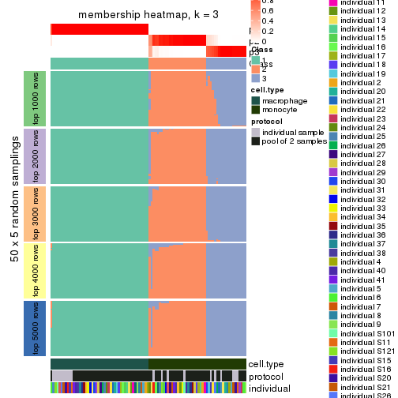</p>

</div>
<div id='tab-ATC-NMF-membership-heatmap-3'>
<pre><code class="r">membership_heatmap(res, k = 4)
</code></pre>

<p></p>

</div>
<div id='tab-ATC-NMF-membership-heatmap-4'>
<pre><code class="r">membership_heatmap(res, k = 5)
</code></pre>

<p></p>

</div>
<div id='tab-ATC-NMF-membership-heatmap-5'>
<pre><code class="r">membership_heatmap(res, k = 6)
</code></pre>

<p></p>

</div>
</div>

As soon as we have had the classes for columns, we can look for signatures
which are significantly different between classes which can be candidate marks
for certain classes. Following are the heatmaps for signatures.


Signature heatmaps where rows are scaled:


<script>
$( function() {
	$( '#tabs-ATC-NMF-get-signatures' ).tabs();
} );
</script>
<div id='tabs-ATC-NMF-get-signatures'>
<ul>
<li><a href='#tab-ATC-NMF-get-signatures-1'>k = 2</a></li>
<li><a href='#tab-ATC-NMF-get-signatures-2'>k = 3</a></li>
<li><a href='#tab-ATC-NMF-get-signatures-3'>k = 4</a></li>
<li><a href='#tab-ATC-NMF-get-signatures-4'>k = 5</a></li>
<li><a href='#tab-ATC-NMF-get-signatures-5'>k = 6</a></li>
</ul>
<div id='tab-ATC-NMF-get-signatures-1'>
<pre><code class="r">get_signatures(res, k = 2)
</code></pre>

<p></p>

</div>
<div id='tab-ATC-NMF-get-signatures-2'>
<pre><code class="r">get_signatures(res, k = 3)
</code></pre>

<p></p>

</div>
<div id='tab-ATC-NMF-get-signatures-3'>
<pre><code class="r">get_signatures(res, k = 4)
</code></pre>

<p></p>

</div>
<div id='tab-ATC-NMF-get-signatures-4'>
<pre><code class="r">get_signatures(res, k = 5)
</code></pre>

<p></p>

</div>
<div id='tab-ATC-NMF-get-signatures-5'>
<pre><code class="r">get_signatures(res, k = 6)
</code></pre>

<p></p>

</div>
</div>


Signature heatmaps where rows are not scaled:


<script>
$( function() {
	$( '#tabs-ATC-NMF-get-signatures-no-scale' ).tabs();
} );
</script>
<div id='tabs-ATC-NMF-get-signatures-no-scale'>
<ul>
<li><a href='#tab-ATC-NMF-get-signatures-no-scale-1'>k = 2</a></li>
<li><a href='#tab-ATC-NMF-get-signatures-no-scale-2'>k = 3</a></li>
<li><a href='#tab-ATC-NMF-get-signatures-no-scale-3'>k = 4</a></li>
<li><a href='#tab-ATC-NMF-get-signatures-no-scale-4'>k = 5</a></li>
<li><a href='#tab-ATC-NMF-get-signatures-no-scale-5'>k = 6</a></li>
</ul>
<div id='tab-ATC-NMF-get-signatures-no-scale-1'>
<pre><code class="r">get_signatures(res, k = 2, scale_rows = FALSE)
</code></pre>

<p></p>

</div>
<div id='tab-ATC-NMF-get-signatures-no-scale-2'>
<pre><code class="r">get_signatures(res, k = 3, scale_rows = FALSE)
</code></pre>

<p></p>

</div>
<div id='tab-ATC-NMF-get-signatures-no-scale-3'>
<pre><code class="r">get_signatures(res, k = 4, scale_rows = FALSE)
</code></pre>

<p></p>

</div>
<div id='tab-ATC-NMF-get-signatures-no-scale-4'>
<pre><code class="r">get_signatures(res, k = 5, scale_rows = FALSE)
</code></pre>

<p></p>

</div>
<div id='tab-ATC-NMF-get-signatures-no-scale-5'>
<pre><code class="r">get_signatures(res, k = 6, scale_rows = FALSE)
</code></pre>

<p></p>

</div>
</div>


Compare the overlap of signatures from different k:

```r
compare_signatures(res)
```


`get_signature()` returns a data frame invisibly. TO get the list of signatures, the function
call should be assigned to a variable explicitly. In following code, if `plot` argument is set
to `FALSE`, no heatmap is plotted while only the differential analysis is performed.

```r
# code only for demonstration
tb = get_signature(res, k = ..., plot = FALSE)
```

An example of the output of `tb` is:

```
#>   which_row         fdr    mean_1    mean_2 scaled_mean_1 scaled_mean_2 km
#> 1        38 0.042760348  8.373488  9.131774    -0.5533452     0.5164555  1
#> 2        40 0.018707592  7.106213  8.469186    -0.6173731     0.5762149  1
#> 3        55 0.019134737 10.221463 11.207825    -0.6159697     0.5749050  1
#> 4        59 0.006059896  5.921854  7.869574    -0.6899429     0.6439467  1
#> 5        60 0.018055526  8.928898 10.211722    -0.6204761     0.5791110  1
#> 6        98 0.009384629 15.714769 14.887706     0.6635654    -0.6193277  2
...
```

The columns in `tb` are:

1. `which_row`: row indices corresponding to the input matrix.
2. `fdr`: FDR for the differential test. 
3. `mean_x`: The mean value in group x.
4. `scaled_mean_x`: The mean value in group x after rows are scaled.
5. `km`: Row groups if k-means clustering is applied to rows.


UMAP plot which shows how samples are separated.


<script>
$( function() {
	$( '#tabs-ATC-NMF-dimension-reduction' ).tabs();
} );
</script>
<div id='tabs-ATC-NMF-dimension-reduction'>
<ul>
<li><a href='#tab-ATC-NMF-dimension-reduction-1'>k = 2</a></li>
<li><a href='#tab-ATC-NMF-dimension-reduction-2'>k = 3</a></li>
<li><a href='#tab-ATC-NMF-dimension-reduction-3'>k = 4</a></li>
<li><a href='#tab-ATC-NMF-dimension-reduction-4'>k = 5</a></li>
<li><a href='#tab-ATC-NMF-dimension-reduction-5'>k = 6</a></li>
</ul>
<div id='tab-ATC-NMF-dimension-reduction-1'>
<pre><code class="r">dimension_reduction(res, k = 2, method = &quot;UMAP&quot;)
</code></pre>

<p></p>

</div>
<div id='tab-ATC-NMF-dimension-reduction-2'>
<pre><code class="r">dimension_reduction(res, k = 3, method = &quot;UMAP&quot;)
</code></pre>

<p></p>

</div>
<div id='tab-ATC-NMF-dimension-reduction-3'>
<pre><code class="r">dimension_reduction(res, k = 4, method = &quot;UMAP&quot;)
</code></pre>

<p></p>

</div>
<div id='tab-ATC-NMF-dimension-reduction-4'>
<pre><code class="r">dimension_reduction(res, k = 5, method = &quot;UMAP&quot;)
</code></pre>

<p></p>

</div>
<div id='tab-ATC-NMF-dimension-reduction-5'>
<pre><code class="r">dimension_reduction(res, k = 6, method = &quot;UMAP&quot;)
</code></pre>

<p></p>

</div>
</div>


Following heatmap shows how subgroups are split when increasing `k`:

```r
collect_classes(res)
```


Test correlation between subgroups and known annotations. If the known
annotation is numeric, one-way ANOVA test is applied, and if the known
annotation is discrete, chi-squared contingency table test is applied.

```r
test_to_known_factors(res)
```

```
#>          n cell.type(p) protocol(p) individual(p) k
#> ATC:NMF 96     8.49e-22       1.000         1.000 2
#> ATC:NMF 94     3.87e-21       0.484         1.000 3
#> ATC:NMF 87     1.28e-19       0.445         1.000 4
#> ATC:NMF 87     5.71e-18       0.436         0.928 5
#> ATC:NMF 91     8.07e-19       0.707         0.972 6
```


If matrix rows can be associated to genes, consider to use `functional_enrichment(res,
...)` to perform function enrichment for the signature genes. See [this vignette](http://bioconductor.org/packages/devel/bioc/vignettes/cola/inst/doc/functional_enrichment.html) for more detailed explanations.


 

## Session info


```r
sessionInfo()
```

```
#> R version 3.6.0 (2019-04-26)
#> Platform: x86_64-pc-linux-gnu (64-bit)
#> Running under: CentOS Linux 7 (Core)
#> 
#> Matrix products: default
#> BLAS:   /usr/lib64/libblas.so.3.4.2
#> LAPACK: /usr/lib64/liblapack.so.3.4.2
#> 
#> locale:
#>  [1] LC_CTYPE=en_GB.UTF-8       LC_NUMERIC=C               LC_TIME=en_GB.UTF-8       
#>  [4] LC_COLLATE=en_GB.UTF-8     LC_MONETARY=en_GB.UTF-8    LC_MESSAGES=en_GB.UTF-8   
#>  [7] LC_PAPER=en_GB.UTF-8       LC_NAME=C                  LC_ADDRESS=C              
#> [10] LC_TELEPHONE=C             LC_MEASUREMENT=en_GB.UTF-8 LC_IDENTIFICATION=C       
#> 
#> attached base packages:
#> [1] grid      stats     graphics  grDevices utils     datasets  methods   base     
#> 
#> other attached packages:
#> [1] genefilter_1.66.0    ComplexHeatmap_2.3.1 markdown_1.1         knitr_1.26          
#> [5] GetoptLong_0.1.7     cola_1.3.2          
#> 
#> loaded via a namespace (and not attached):
#>  [1] circlize_0.4.8       shape_1.4.4          xfun_0.11            slam_0.1-46         
#>  [5] lattice_0.20-38      splines_3.6.0        colorspace_1.4-1     vctrs_0.2.0         
#>  [9] stats4_3.6.0         blob_1.2.0           XML_3.98-1.20        survival_2.44-1.1   
#> [13] rlang_0.4.2          pillar_1.4.2         DBI_1.0.0            BiocGenerics_0.30.0 
#> [17] bit64_0.9-7          RColorBrewer_1.1-2   matrixStats_0.55.0   stringr_1.4.0       
#> [21] GlobalOptions_0.1.1  evaluate_0.14        memoise_1.1.0        Biobase_2.44.0      
#> [25] IRanges_2.18.3       parallel_3.6.0       AnnotationDbi_1.46.1 highr_0.8           
#> [29] Rcpp_1.0.3           xtable_1.8-4         backports_1.1.5      S4Vectors_0.22.1    
#> [33] annotate_1.62.0      skmeans_0.2-11       bit_1.1-14           microbenchmark_1.4-7
#> [37] brew_1.0-6           impute_1.58.0        rjson_0.2.20         png_0.1-7           
#> [41] digest_0.6.23        stringi_1.4.3        polyclip_1.10-0      clue_0.3-57         
#> [45] tools_3.6.0          bitops_1.0-6         magrittr_1.5         eulerr_6.0.0        
#> [49] RCurl_1.95-4.12      RSQLite_2.1.4        tibble_2.1.3         cluster_2.1.0       
#> [53] crayon_1.3.4         pkgconfig_2.0.3      zeallot_0.1.0        Matrix_1.2-17       
#> [57] xml2_1.2.2           httr_1.4.1           R6_2.4.1             mclust_5.4.5        
#> [61] compiler_3.6.0
```


